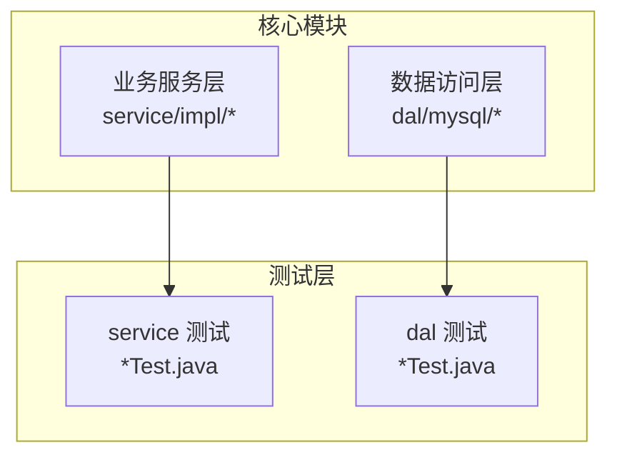
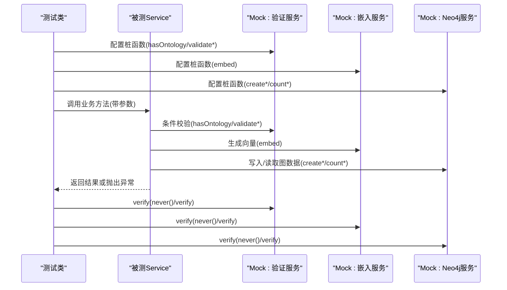
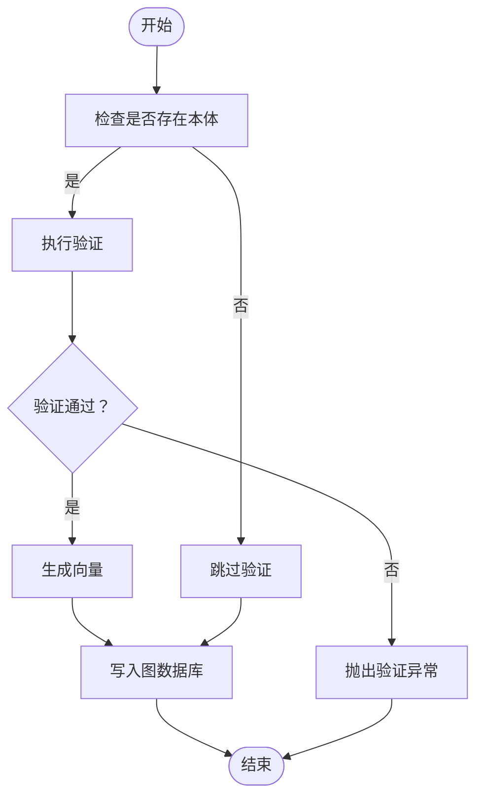
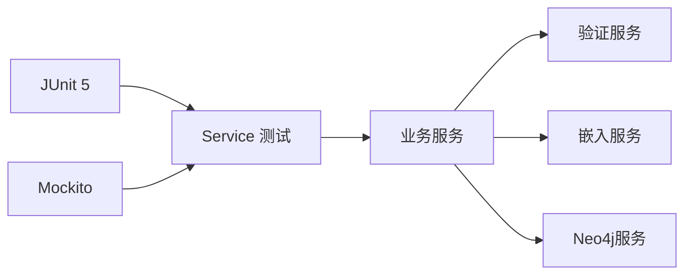

# 单元测试

<!--<cite>
**本文引用的文件**
- [pom.xml](file://pom.xml)
- [GraphitiServiceImpl.java](file://graphiti-module-core/src/main/java/com/graphiti/module/graphiti/service/impl/GraphitiServiceImpl.java)
- [DataImportServiceImplTest.java](file://graphiti-module-core/src/test/java/com/graphiti/module/graphiti/service/DataImportServiceImplTest.java)
- [EdgeServiceImplTest.java](file://graphiti-module-core/src/test/java/com/graphiti/module/graphiti/service/EdgeServiceImplTest.java)
- [NodeServiceImplTest.java](file://graphiti-module-core/src/test/java/com/graphiti/module/graphiti/service/NodeServiceImplTest.java)
- [OntologyClassServiceImplTest.java](file://graphiti-module-core/src/test/java/com/graphiti/module/graphiti/service/OntologyClassServiceImplTest.java)
- [OntologyPropertyServiceImplTest.java](file://graphiti-module-core/src/test/java/com/graphiti/module/graphiti/service/OntologyPropertyServiceImplTest.java)
- [OntologyValidationServiceImplTest.java](file://graphiti-module-core/src/test/java/com/graphiti/module/graphiti/service/OntologyValidationServiceImplTest.java)
- [OntMapperTest.java](file://graphiti-module-core/src/test/java/com/graphiti/module/graphiti/dal/mysql/ont/OntMapperTest.java)
- [OntDOTest.java](file://graphiti-module-core/src/test/java/com/graphiti/module/graphiti/dal/OntDOTest.java)
- [UserMapper.java](file://graphiti-module-system/src/main/java/com/graphiti/system/dal/mysql/UserMapper.java)
- [RoleMapper.java](file://graphiti-module-system/src/main/java/com/graphiti/system/dal/mysql/RoleMapper.java)
- [PasswordTest.java](file://graphiti-server/src/test/java/com/graphiti/PasswordTest.java)
</cite>-->

## 目录
1. [引言](#引言)
2. [项目结构](#项目结构)
3. [核心组件](#核心组件)
4. [架构总览](#架构总览)
5. [详细组件分析](#详细组件分析)
6. [依赖分析](#依赖分析)
7. [性能与覆盖率](#性能与覆盖率)
8. [故障排查指南](#故障排查指南)
9. [结论](#结论)
10. [附录](#附录)

## 引言
本指南面向Graphiti Java项目的单元测试实践，系统讲解JUnit 5与Mockito的使用方法、测试类组织与命名规范、Service层与DAO层测试策略、测试数据准备、断言与异常测试、测试隔离原则、覆盖率计算与性能优化，并结合项目中的核心业务服务与数据访问层给出可操作的测试实现范式。

## 项目结构
- 测试位于各模块的test目录下，采用按功能域分层组织：service与dal分别对应业务层与数据访问层。
- 使用JUnit 5作为测试框架，部分用例启用Mockito扩展以进行依赖注入与桩函数配置。
- Maven聚合工程统一管理版本与插件，便于在CI中统一执行测试与覆盖率收集。

章节来源
- [pom.xml:15-20](file://pom.xml#L15-L20)

## 核心组件
- JUnit 5：用于声明测试、断言与参数化；在多处测试类中直接使用断言API。
- Mockito：用于创建桩函数、模拟外部依赖、验证交互；广泛用于Service层测试。
- 测试生命周期：通过@BeforeEach初始化被测对象与Mock依赖；通过@ExtendWith(MockitoExtension.class)启用Mockito支持。

章节来源
- [DataImportServiceImplTest.java:26-40](file://graphiti-module-core/src/test/java/com/graphiti/module/graphiti/service/DataImportServiceImplTest.java#L26-L40)
- [EdgeServiceImplTest.java:19-26](file://graphiti-module-core/src/test/java/com/graphiti/module/graphiti/service/EdgeServiceImplTest.java#L19-L26)
- [NodeServiceImplTest.java:17-24](file://graphiti-module-core/src/test/java/com/graphiti/module/graphiti/service/NodeServiceImplTest.java#L17-L24)

## 架构总览
以下序列图展示典型Service层测试流程：构造Mock依赖 → 注入被测Service → 执行业务方法 → 断言返回值与副作用（如调用链、异常抛出）。

图表来源
- [DataImportServiceImplTest.java:42-94](file://graphiti-module-core/src/test/java/com/graphiti/module/graphiti/service/DataImportServiceImplTest.java#L42-L94)
- [EdgeServiceImplTest.java:28-73](file://graphiti-module-core/src/test/java/com/graphiti/module/graphiti/service/EdgeServiceImplTest.java#L28-L73)
- [NodeServiceImplTest.java:26-72](file://graphiti-module-core/src/test/java/com/graphiti/module/graphiti/service/NodeServiceImplTest.java#L26-L72)

## 详细组件分析

### Service层测试策略与范式
- Mock依赖注入：使用@InjectMocks创建被测Service实例，@Mock注入外部依赖（如验证服务、嵌入服务、图数据库服务）。
- 分支覆盖：针对“存在本体/不存在本体”两种分支设计用例，确保验证与非验证路径均被覆盖。
- 异常测试：当验证失败时抛出业务异常，需断言异常类型与传播路径。
- 交互验证：使用verify确认是否调用了预期方法及次数，必要时使用never()断言未调用。

图表来源
- [DataImportServiceImplTest.java:42-94](file://graphiti-module-core/src/test/java/com/graphiti/module/graphiti/service/DataImportServiceImplTest.java#L42-L94)
- [EdgeServiceImplTest.java:28-73](file://graphiti-module-core/src/test/java/com/graphiti/module/graphiti/service/EdgeServiceImplTest.java#L28-L73)
- [NodeServiceImplTest.java:26-72](file://graphiti-module-core/src/test/java/com/graphiti/module/graphiti/service/NodeServiceImplTest.java#L26-L72)

章节来源
- [DataImportServiceImplTest.java:26-94](file://graphiti-module-core/src/test/java/com/graphiti/module/graphiti/service/DataImportServiceImplTest.java#L26-L94)
- [EdgeServiceImplTest.java:19-73](file://graphiti-module-core/src/test/java/com/graphiti/module/graphiti/service/EdgeServiceImplTest.java#L19-L73)
- [NodeServiceImplTest.java:17-72](file://graphiti-module-core/src/test/java/com/graphiti/module/graphiti/service/NodeServiceImplTest.java#L17-L72)

### GraphitiServiceImpl（图谱管理服务）
- 关键点：事务注解、条件查询、转换器方法、对外部服务的调用。
- 测试建议：
  - 使用内存数据库或事务回滚策略隔离持久化副作用。
  - 对转换器方法进行独立单元测试，确保DTO映射正确。
  - 对外部Neo4j服务进行Mock，验证调用参数与次数。

章节来源
- [GraphitiServiceImpl.java:27-255](file://graphiti-module-core/src/main/java/com/graphiti/module/graphiti/service/impl/GraphitiServiceImpl.java#L27-L255)

### VO与DO测试（值对象与数据对象）
- VO测试：验证Builder与Setter行为，确保字段正确赋值与读取。
- DO测试：验证JSON字符串字段的存储与解析，确保序列化/反序列化一致性。

章节来源
- [OntologyClassServiceImplTest.java:10-52](file://graphiti-module-core/src/test/java/com/graphiti/module/graphiti/service/OntologyClassServiceImplTest.java#L10-L52)
- [OntologyPropertyServiceImplTest.java:10-39](file://graphiti-module-core/src/test/java/com/graphiti/module/graphiti/service/OntologyPropertyServiceImplTest.java#L10-L39)
- [OntDOTest.java:11-86](file://graphiti-module-core/src/test/java/com/graphiti/module/graphiti/dal/OntDOTest.java#L11-86)

### DAO层测试（MyBatis接口）
- 接口编译性测试：验证Mapper接口可正常加载，避免XML或注解配置错误导致运行期问题。
- 建议：对复杂SQL的边界条件与空值处理进行集成测试（可选），但纯接口编译性测试足以保证基本可用。

章节来源
- [OntMapperTest.java:6-42](file://graphiti-module-core/src/test/java/com/graphiti/module/graphiti/dal/mysql/ont/OntMapperTest.java#L6-L42)

### 系统模块Mapper（UserMapper、RoleMapper）
- Mapper接口继承BaseMapper，提供通用CRUD能力。
- 测试建议：结合Service层测试覆盖典型增删改查场景；DAO层可做接口编译性验证。

章节来源
- [UserMapper.java:1-13](file://graphiti-module-system/src/main/java/com/graphiti/system/dal/mysql/UserMapper.java#L1-L13)
- [RoleMapper.java:1-13](file://graphiti-module-system/src/main/java/com/graphiti/system/dal/mysql/RoleMapper.java#L1-L13)

### 密码相关测试（PasswordTest）
- 可作为安全相关测试的参考模板，演示如何组织断言与边界条件。

章节来源
- [PasswordTest.java](file://graphiti-server/src/test/java/com/graphiti/PasswordTest.java)

## 依赖分析
- 测试框架与Mock：JUnit 5与Mockito扩展在多个测试类中使用，确保了对Service层依赖的可控替换。
- 外部服务依赖：GraphNeo4jService、EmbedderService、OntologyValidationService等通过Mock隔离，避免真实数据库或外部模型服务的耦合。
- 项目依赖：pom.xml集中管理Spring Boot、MyBatis-Plus、Neo4j驱动等版本，保证测试环境与生产一致。

图表来源
- [DataImportServiceImplTest.java:26-94](file://graphiti-module-core/src/test/java/com/graphiti/module/graphiti/service/DataImportServiceImplTest.java#L26-L94)
- [EdgeServiceImplTest.java:19-73](file://graphiti-module-core/src/test/java/com/graphiti/module/graphiti/service/EdgeServiceImplTest.java#L19-L73)
- [NodeServiceImplTest.java:17-72](file://graphiti-module-core/src/test/java/com/graphiti/module/graphiti/service/NodeServiceImplTest.java#L17-L72)

章节来源
- [pom.xml:45-196](file://pom.xml#L45-L196)

## 性能与覆盖率
- 测试性能优化
  - 使用Mock隔离外部依赖，减少I/O与网络开销。
  - 将数据库操作放入事务并在测试后回滚，避免真实写入。
  - 合理拆分测试用例，避免单个测试方法过长。
- 覆盖率计算
  - 在Maven中集成JaCoCo插件，生成覆盖率报告；在CI中设置阈值门禁，保证关键路径覆盖。
  - 重点覆盖分支与异常路径，尤其是验证失败与外部服务异常场景。

[本节为通用指导，不直接分析具体文件]

## 故障排查指南
- 常见问题
  - Mock未生效：确认使用@ExtendWith(MockitoExtension.class)，并正确标注@Mock与@InjectMocks。
  - 断言失败：优先检查桩函数参数匹配器（eq/any/isNull）是否与实际调用一致。
  - 事务与持久化：若涉及数据库写入，确保测试后回滚或使用内存数据库。
- 排查步骤
  - 逐步缩小范围：先验证桩函数配置，再验证方法调用顺序与参数。
  - 使用verify确认交互，结合never()排除未期望的调用。
  - 对异常场景使用assertThrows断言异常类型与消息。

章节来源
- [DataImportServiceImplTest.java:16-24](file://graphiti-module-core/src/test/java/com/graphiti/module/graphiti/service/DataImportServiceImplTest.java#L16-L24)
- [EdgeServiceImplTest.java:13-17](file://graphiti-module-core/src/test/java/com/graphiti/module/graphiti/service/EdgeServiceImplTest.java#L13-L17)
- [NodeServiceImplTest.java:12-15](file://graphiti-module-core/src/test/java/com/graphiti/module/graphiti/service/NodeServiceImplTest.java#L12-L15)

## 结论
本指南基于现有测试样例总结了JUnit 5与Mockito在Graphiti项目中的最佳实践：以Service层为主、DAO层为辅，强调分支与异常路径覆盖、交互验证与测试隔离。结合Maven与JaCoCo，可在持续集成中稳定提升测试质量与覆盖率。

[本节为总结性内容，不直接分析具体文件]

## 附录

### JUnit 5与Mockito使用要点
- 测试类组织：按功能域分层，每个业务类对应一个测试类，命名以被测类名+Test结尾。
- 命名规范：测试方法采用语义化命名，描述输入、行为与期望，如addEntityNode_withNoOntology_bypassesValidation。
- 断言：优先使用明确的断言方法，如assertEquals、assertTrue、assertThrows、assertDoesNotThrow。
- 异常测试：使用assertThrows断言异常类型，确保异常传播路径正确。

章节来源
- [DataImportServiceImplTest.java:42-94](file://graphiti-module-core/src/test/java/com/graphiti/module/graphiti/service/DataImportServiceImplTest.java#L42-L94)
- [EdgeServiceImplTest.java:28-73](file://graphiti-module-core/src/test/java/com/graphiti/module/graphiti/service/EdgeServiceImplTest.java#L28-L73)
- [NodeServiceImplTest.java:26-72](file://graphiti-module-core/src/test/java/com/graphiti/module/graphiti/service/NodeServiceImplTest.java#L26-L72)

### Service层测试清单
- 输入参数校验：空值、非法类型、越界值。
- 分支覆盖：存在/不存在本体的两条路径。
- 异常路径：验证失败抛出业务异常，且不触发后续写入。
- 交互验证：verify/never确保外部依赖调用符合预期。

章节来源
- [OntologyValidationServiceImplTest.java:9-48](file://graphiti-module-core/src/test/java/com/graphiti/module/graphiti/service/OntologyValidationServiceImplTest.java#L9-L48)

### DAO层测试清单
- 接口编译性：确保Mapper接口可加载，避免XML/注解配置错误。
- JSON字段：对存储为JSON字符串的字段进行读写一致性验证。

章节来源
- [OntMapperTest.java:6-42](file://graphiti-module-core/src/test/java/com/graphiti/module/graphiti/dal/mysql/ont/OntMapperTest.java#L6-L42)
- [OntDOTest.java:11-86](file://graphiti-module-core/src/test/java/com/graphiti/module/graphiti/dal/OntDOTest.java#L11-86)