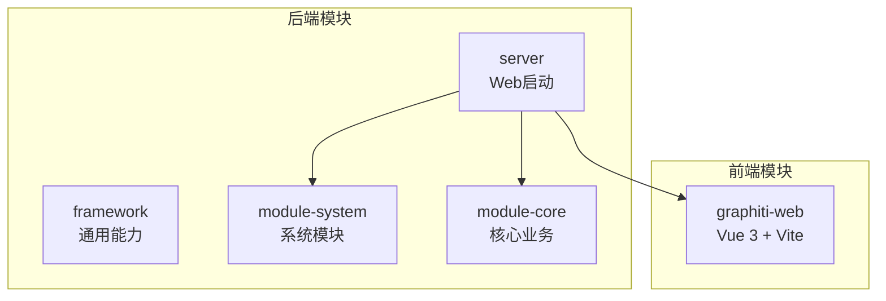
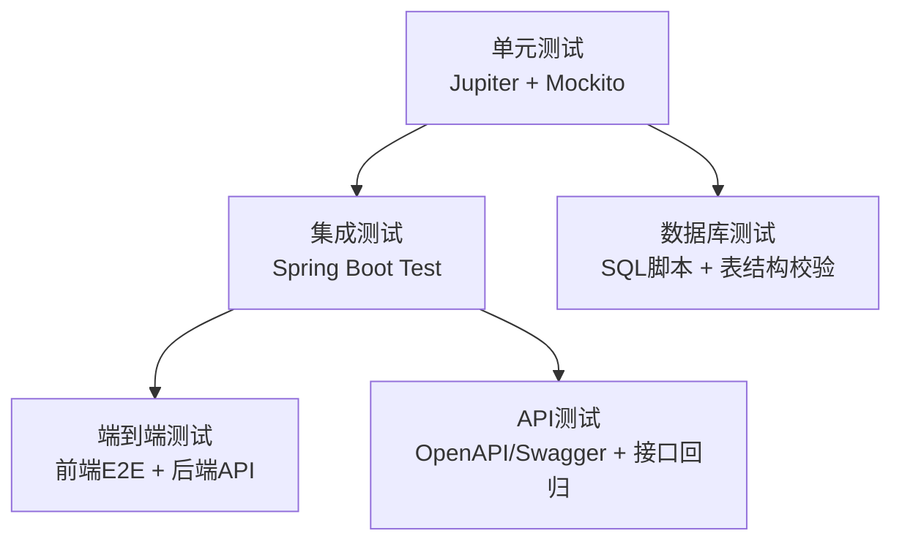
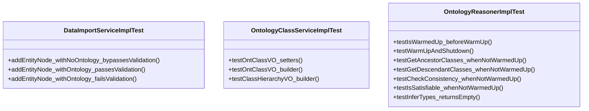
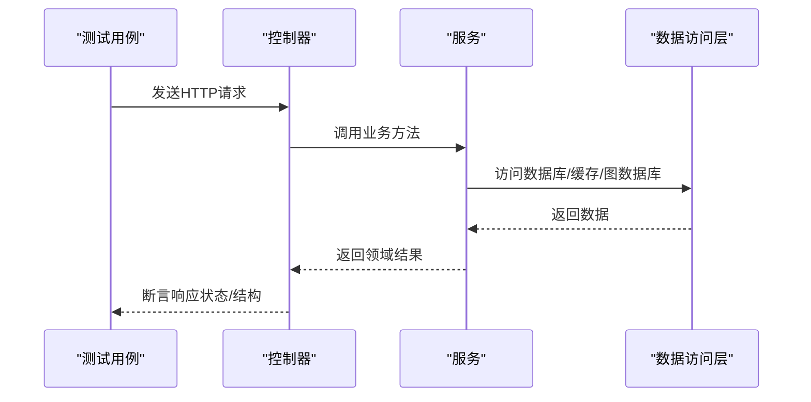
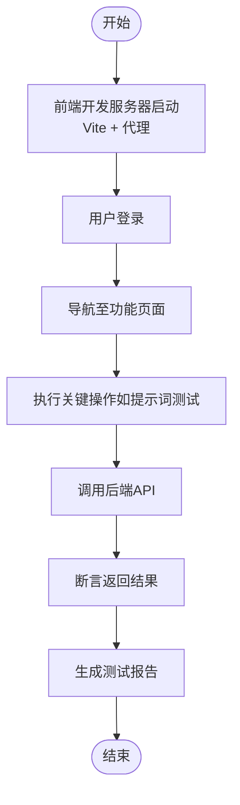
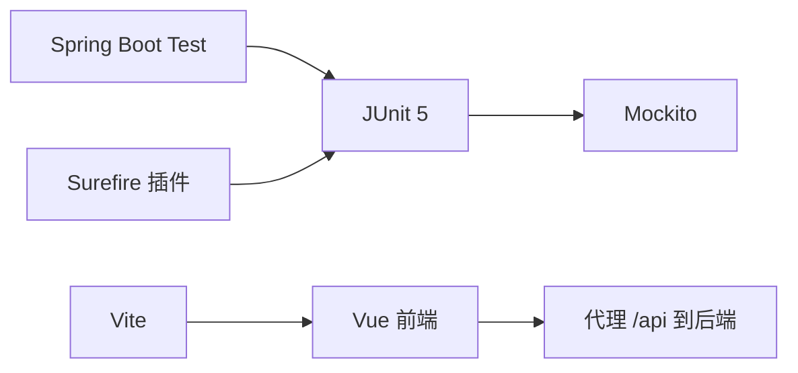

# 测试策略

<!--<cite>
**本文引用的文件**
- [pom.xml](file://pom.xml)
- [graphiti-module-core/pom.xml](file://graphiti-module-core/pom.xml)
- [graphiti-server/pom.xml](file://graphiti-server/pom.xml)
- [graphiti-module-core/src/test/java/com/graphiti/module/graphiti/service/DataImportServiceImplTest.java](file://graphiti-module-core/src/test/java/com/graphiti/module/graphiti/service/DataImportServiceImplTest.java)
- [graphiti-module-core/src/test/java/com/graphiti/module/graphiti/dal/mysql/ont/OntMapperTest.java](file://graphiti-module-core/src/test/java/com/graphiti/module/graphiti/dal/mysql/ont/OntMapperTest.java)
- [graphiti-module-core/src/test/java/com/graphiti/module/graphiti/service/OntologyClassServiceImplTest.java](file://graphiti-module-core/src/test/java/com/graphiti/module/graphiti/service/OntologyClassServiceImplTest.java)
- [graphiti-module-core/src/test/java/com/graphiti/module/graphiti/service/OntologyReasonerImplTest.java](file://graphiti-module-core/src/test/java/com/graphiti/module/graphiti/service/OntologyReasonerImplTest.java)
- [graphiti-server/src/test/java/com/graphiti/PasswordTest.java](file://graphiti-server/src/test/java/com/graphiti/PasswordTest.java)
- [graphiti-web/vite.config.ts](file://graphiti-web/vite.config.ts)
- [graphiti-web/package.json](file://graphiti-web/package.json)
- [graphiti-web/src/main.ts](file://graphiti-web/src/main.ts)
- [graphiti-web/src/App.vue](file://graphiti-web/src/App.vue)
- [graphiti-web/src/views/prompt/index.vue](file://graphiti-web/src/views/prompt/index.vue)
</cite>-->

## 目录
1. [引言](#引言)
2. [项目结构](#项目结构)
3. [核心组件](#核心组件)
4. [架构总览](#架构总览)
5. [详细组件分析](#详细组件分析)
6. [依赖分析](#依赖分析)
7. [性能考虑](#性能考虑)
8. [故障排查指南](#故障排查指南)
9. [结论](#结论)
10. [附录](#附录)

## 引言
本指南面向Graphiti-Java后端与前端团队，系统化阐述测试策略与实施方法，覆盖单元测试、集成测试与端到端测试（E2E），并结合现有代码库中的测试样例，给出基于JUnit 5、Mockito、Spring Boot Test与前端Vue生态的实践建议。同时，提供数据库测试、API测试策略、测试覆盖率目标、持续集成中的测试执行与报告生成路径，帮助团队建立稳定、可维护且高覆盖率的测试体系。

## 项目结构
- 后端采用多模块Maven工程，核心模块包括：
  - framework层：通用能力与安全、MyBatis、Redis等starter封装
  - module-system：系统管理相关控制器、服务与数据访问
  - module-core：核心业务（图谱、本体、检索、导入导出等）
  - server：Web启动模块，整合前后端产物
- 前端为独立Vue 3项目，通过Vite构建，代理后端接口进行联调

图表来源
- [pom.xml:15-20](file://pom.xml#L15-L20)
- [graphiti-server/pom.xml:17-40](file://graphiti-server/pom.xml#L17-L40)

章节来源
- [pom.xml:15-20](file://pom.xml#L15-L20)
- [graphiti-server/pom.xml:17-40](file://graphiti-server/pom.xml#L17-L40)

## 核心组件
- 单元测试：以Jupiter + Mockito为主，覆盖服务层逻辑、值对象行为与状态机
- 集成测试：基于Spring Boot Test，加载最小上下文，验证控制器、服务与外部依赖（数据库、缓存、图数据库）交互
- 端到端测试：前端E2E结合后端API，验证用户操作链路与数据流转
- 数据库测试：MySQL/PostgreSQL迁移脚本与本体表结构校验
- API测试：OpenAPI/Swagger辅助接口验证与回归

章节来源
- [graphiti-module-core/src/test/java/com/graphiti/module/graphiti/service/DataImportServiceImplTest.java:1-96](file://graphiti-module-core/src/test/java/com/graphiti/module/graphiti/service/DataImportServiceImplTest.java#L1-L96)
- [graphiti-module-core/src/test/java/com/graphiti/module/graphiti/service/OntologyClassServiceImplTest.java:1-53](file://graphiti-module-core/src/test/java/com/graphiti/module/graphiti/service/OntologyClassServiceImplTest.java#L1-L53)
- [graphiti-module-core/src/test/java/com/graphiti/module/graphiti/service/OntologyReasonerImplTest.java:1-64](file://graphiti-module-core/src/test/java/com/graphiti/module/graphiti/service/OntologyReasonerImplTest.java#L1-L64)
- [graphiti-module-core/src/test/java/com/graphiti/module/graphiti/dal/mysql/ont/OntMapperTest.java:1-43](file://graphiti-module-core/src/test/java/com/graphiti/module/graphiti/dal/mysql/ont/OntMapperTest.java#L1-L43)
- [graphiti-server/src/test/java/com/graphiti/PasswordTest.java:1-17](file://graphiti-server/src/test/java/com/graphiti/PasswordTest.java#L1-L17)

## 架构总览
下图展示测试金字塔在本项目中的落地方式：单元测试（Mock服务）、集成测试（Spring Boot Test）、E2E（前端+后端）。

图表来源
- [graphiti-module-core/pom.xml:99-110](file://graphiti-module-core/pom.xml#L99-L110)
- [graphiti-module-core/pom.xml:147-158](file://graphiti-module-core/pom.xml#L147-L158)
- [graphiti-server/pom.xml:30-40](file://graphiti-server/pom.xml#L30-L40)

## 详细组件分析

### 单元测试：服务层与值对象
- DataImportServiceImplTest：验证有/无本体场景下的节点导入流程、本体校验失败时的异常传播与副作用抑制
- OntologyClassServiceImplTest：验证VO的setter、builder与层级结构构建
- OntologyReasonerImplTest：验证推理器状态机（预热、关闭、一致性检查、可满足性、祖先/后代查询）

图表来源
- [graphiti-module-core/src/test/java/com/graphiti/module/graphiti/service/DataImportServiceImplTest.java:26-95](file://graphiti-module-core/src/test/java/com/graphiti/module/graphiti/service/DataImportServiceImplTest.java#L26-L95)
- [graphiti-module-core/src/test/java/com/graphiti/module/graphiti/service/OntologyClassServiceImplTest.java:10-52](file://graphiti-module-core/src/test/java/com/graphiti/module/graphiti/service/OntologyClassServiceImplTest.java#L10-L52)
- [graphiti-module-core/src/test/java/com/graphiti/module/graphiti/service/OntologyReasonerImplTest.java:10-63](file://graphiti-module-core/src/test/java/com/graphiti/module/graphiti/service/OntologyReasonerImplTest.java#L10-L63)

章节来源
- [graphiti-module-core/src/test/java/com/graphiti/module/graphiti/service/DataImportServiceImplTest.java:1-96](file://graphiti-module-core/src/test/java/com/graphiti/module/graphiti/service/DataImportServiceImplTest.java#L1-L96)
- [graphiti-module-core/src/test/java/com/graphiti/module/graphiti/service/OntologyClassServiceImplTest.java:1-53](file://graphiti-module-core/src/test/java/com/graphiti/module/graphiti/service/OntologyClassServiceImplTest.java#L1-L53)
- [graphiti-module-core/src/test/java/com/graphiti/module/graphiti/service/OntologyReasonerImplTest.java:1-64](file://graphiti-module-core/src/test/java/com/graphiti/module/graphiti/service/OntologyReasonerImplTest.java#L1-L64)

### 集成测试：控制器与服务交互
- 建议使用@SpringBootTest加载最小上下文，启用WebMvc或WebFlux测试切片，对控制器进行请求-响应断言
- 使用@AutoConfigureTestDatabase与@Testcontainers或H2进行数据库隔离测试
- 对于Neo4j/Redis等外部依赖，建议使用Testcontainers启动容器或Mock实现

图表来源
- [graphiti-module-core/pom.xml:99-110](file://graphiti-module-core/pom.xml#L99-L110)

章节来源
- [graphiti-module-core/pom.xml:99-110](file://graphiti-module-core/pom.xml#L99-L110)

### 端到端测试：前端与后端协同
- 前端通过Vite开发服务器代理后端接口，便于本地联调
- 建议使用Cypress或Playwright进行E2E，覆盖登录、图谱浏览、本体管理、提示词测试等关键路径
- 将后端测试与前端E2E纳入CI流水线，确保每次变更的回归验证

图表来源
- [graphiti-web/vite.config.ts:18-26](file://graphiti-web/vite.config.ts#L18-L26)
- [graphiti-web/src/views/prompt/index.vue:325-351](file://graphiti-web/src/views/prompt/index.vue#L325-L351)

章节来源
- [graphiti-web/vite.config.ts:1-40](file://graphiti-web/vite.config.ts#L1-L40)
- [graphiti-web/src/views/prompt/index.vue:325-351](file://graphiti-web/src/views/prompt/index.vue#L325-L351)

### 数据库测试策略
- 使用Flyway/Vitchay/版本化SQL脚本管理数据库演进，确保测试环境与生产一致
- 在单元测试中对DAO接口存在性进行编译期校验；在集成测试中使用真实数据库或内存数据库进行数据一致性验证
- 对本体相关表（MySQL/PostgreSQL）进行结构与种子数据校验

章节来源
- [graphiti-module-core/src/test/java/com/graphiti/module/graphiti/dal/mysql/ont/OntMapperTest.java:1-43](file://graphiti-module-core/src/test/java/com/graphiti/module/graphiti/dal/mysql/ont/OntMapperTest.java#L1-L43)

### API测试策略
- 基于SpringDoc/OpenAPI生成接口文档，作为API契约参与测试
- 使用RestAssured或WebTestClient进行接口回归测试，覆盖成功/失败路径与鉴权场景
- 对提示词测试等前端触发的后端接口，结合前端E2E进行端到端验证

章节来源
- [graphiti-server/pom.xml:35-40](file://graphiti-server/pom.xml#L35-L40)

## 依赖分析
- 测试框架与工具
  - JUnit 5 Jupiter：测试生命周期与断言
  - Mockito：Mock对象与行为验证
  - Spring Boot Starter Test：自动装配测试环境
  - Surefire插件：Maven测试执行
- 前端测试与构建
  - Vite：开发与构建
  - Vue生态：Vue 3 + Pinia + Ant Design Vue
  - 代理配置：开发时将/api转发至后端

图表来源
- [graphiti-module-core/pom.xml:99-110](file://graphiti-module-core/pom.xml#L99-L110)
- [graphiti-module-core/pom.xml:147-158](file://graphiti-module-core/pom.xml#L147-L158)
- [graphiti-web/vite.config.ts:18-26](file://graphiti-web/vite.config.ts#L18-L26)

章节来源
- [graphiti-module-core/pom.xml:99-110](file://graphiti-module-core/pom.xml#L99-L110)
- [graphiti-module-core/pom.xml:147-158](file://graphiti-module-core/pom.xml#L147-L158)
- [graphiti-web/vite.config.ts:1-40](file://graphiti-web/vite.config.ts#L1-L40)

## 性能考虑
- 单元测试应避免真实IO，优先使用Mock与In-Memory实现
- 集成测试尽量缩短运行时间，使用轻量级容器或内存数据库
- 前端E2E测试拆分关键路径，减少全量回归时间
- CI中按模块并行执行测试，提升整体吞吐

## 故障排查指南
- 密码校验问题：若遇到密码匹配异常，可参考PasswordTest的BCrypt校验与新哈希生成方式
- 前端代理：确认Vite代理配置是否正确指向后端端口
- 前端入口：检查main.ts、App.vue与路由初始化顺序

章节来源
- [graphiti-server/src/test/java/com/graphiti/PasswordTest.java:1-17](file://graphiti-server/src/test/java/com/graphiti/PasswordTest.java#L1-L17)
- [graphiti-web/vite.config.ts:18-26](file://graphiti-web/vite.config.ts#L18-L26)
- [graphiti-web/src/main.ts:1-24](file://graphiti-web/src/main.ts#L1-L24)
- [graphiti-web/src/App.vue:1-15](file://graphiti-web/src/App.vue#L1-L15)

## 结论
通过“单元测试（Mock）+ 集成测试（Spring Boot Test）+ 端到端测试（前端+E2E）”的三层测试策略，并结合数据库脚本与API契约，可有效保障Graphiti-Java在功能正确性、接口稳定性与用户体验方面的质量。建议在CI中统一执行测试并生成报告，逐步提升覆盖率与自动化程度。

## 附录

### 测试覆盖率与持续集成
- 覆盖率目标建议
  - 单元测试：核心服务与工具类达到较高覆盖率（如80%+）
  - 集成测试：关键业务路径与异常分支全覆盖
  - 前端E2E：关键用户旅程（登录、图谱浏览、本体管理、提示词测试）100%回归
- 持续集成
  - Maven阶段：mvn test（Surefire）
  - 前端阶段：pnpm test（如引入）+ 构建产物校验
  - 报告生成：Surefire报告 + 前端测试报告 + 覆盖率聚合（JaCoCo/LCOV）

章节来源
- [graphiti-module-core/pom.xml:147-158](file://graphiti-module-core/pom.xml#L147-L158)
- [graphiti-web/package.json:5-10](file://graphiti-web/package.json#L5-L10)