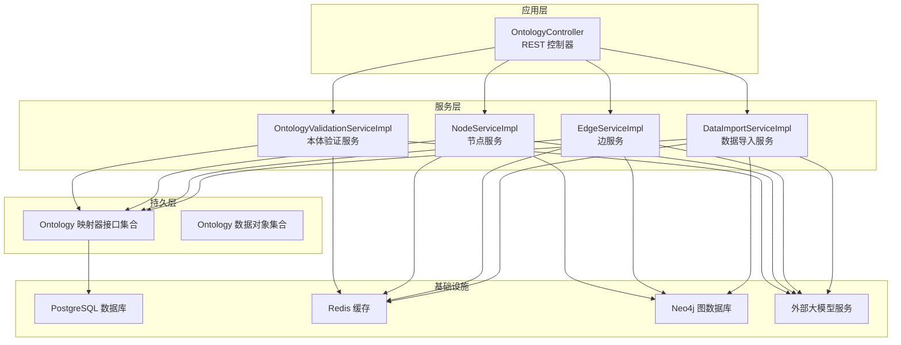
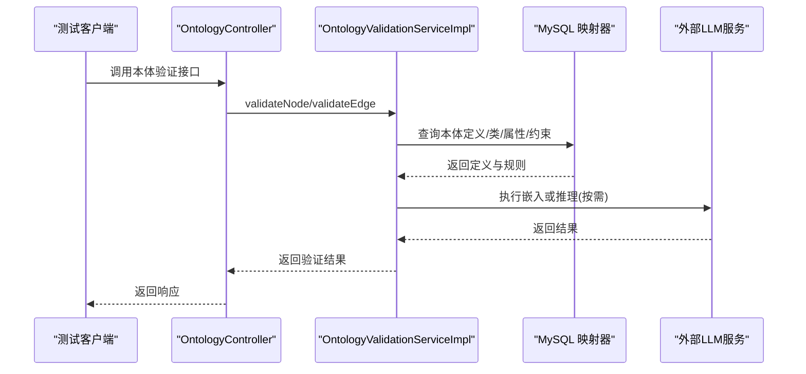
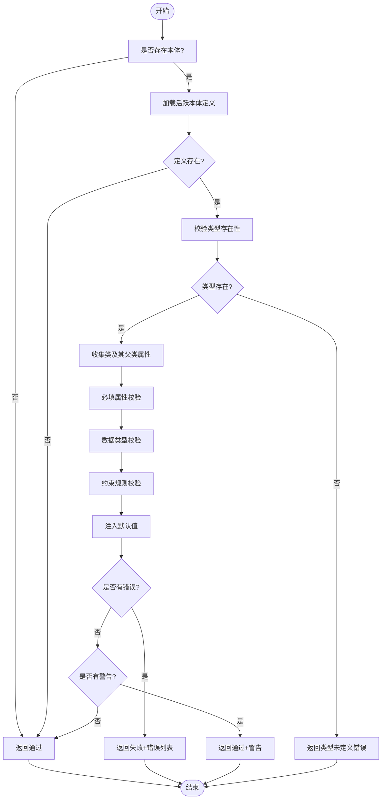
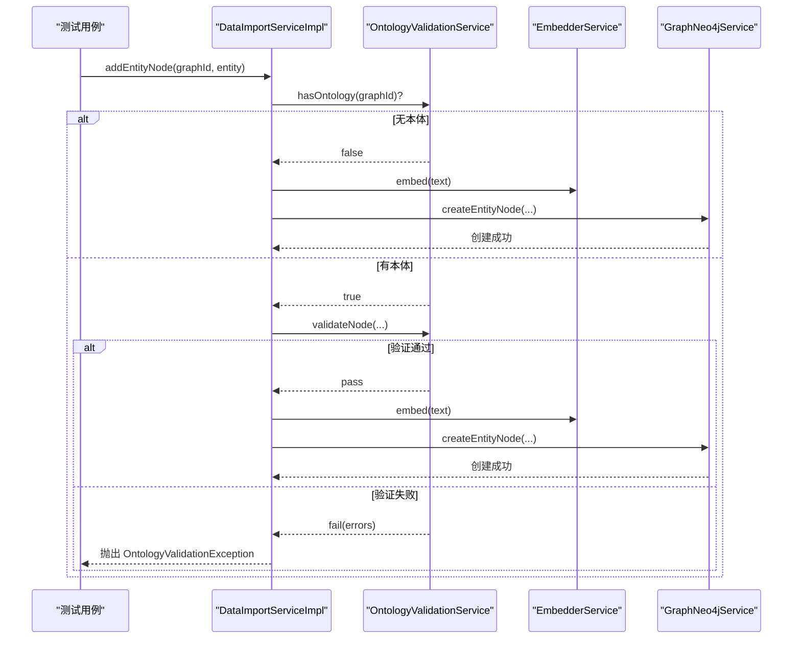
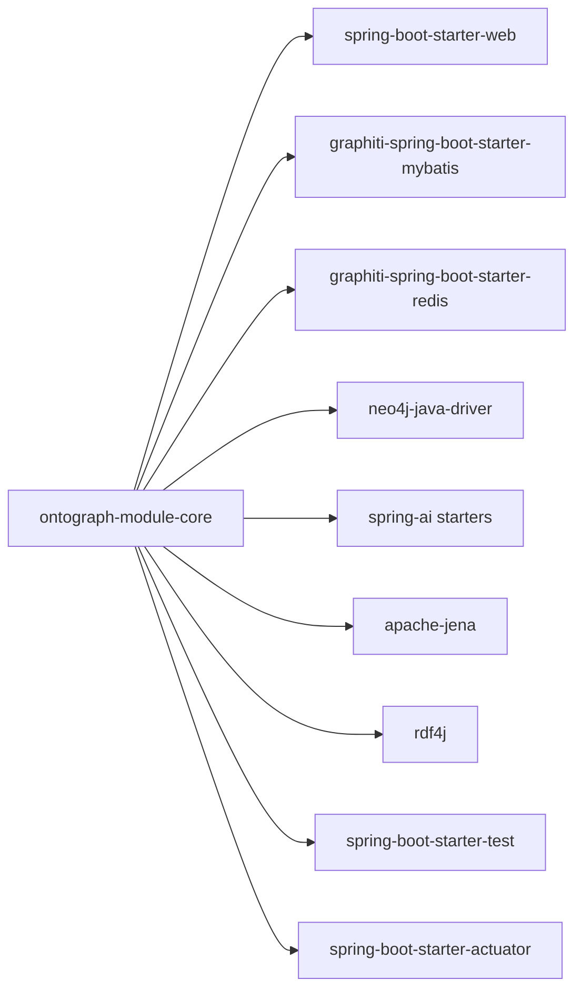

# 集成测试

<!--<cite>
**本文引用的文件**
- [ontograph-module-core/pom.xml](file://ontograph-module-core/pom.xml)
- [ontograph-server/src/main/resources/application.yml](file://ontograph-server/src/main/resources/application.yml)
- [ontograph-server/src/main/resources/application-dev.yml](file://ontograph-server/src/main/resources/application-dev.yml)
- [ontograph-module-core/src/test/java/com/graphiti/module/graphiti/service/DataImportServiceImplTest.java](file://ontograph-module-core/src/test/java/com/graphiti/module/graphiti/service/DataImportServiceImplTest.java)
- [ontograph-module-core/src/test/java/com/graphiti/module/graphiti/service/NodeServiceImplTest.java](file://ontograph-module-core/src/test/java/com/graphiti/module/graphiti/service/NodeServiceImplTest.java)
- [ontograph-module-core/src/test/java/com/graphiti/module/graphiti/service/EdgeServiceImplTest.java](file://ontograph-module-core/src/test/java/com/graphiti/module/graphiti/service/EdgeServiceImplTest.java)
- [ontograph-module-core/src/test/java/com/graphiti/module/graphiti/service/OntologyValidationServiceImplTest.java](file://ontograph-module-core/src/test/java/com/graphiti/module/graphiti/service/OntologyValidationServiceImplTest.java)
- [ontograph-module-core/src/test/java/com/graphiti/module/graphiti/dal/mysql/ont/OntMapperTest.java](file://ontograph-module-core/src/test/java/com/graphiti/module/graphiti/dal/mysql/ont/OntMapperTest.java)
- [ontograph-module-core/src/test/java/com/graphiti/module/graphiti/dal/OntDOTest.java](file://ontograph-module-core/src/test/java/com/graphiti/module/graphiti/dal/OntDOTest.java)
- [ontograph-module-core/src/main/java/com/graphiti/module/graphiti/controller/admin/OntologyController.java](file://ontograph-module-core/src/main/java/com/graphiti/module/graphiti/controller/admin/OntologyController.java)
- [ontograph-module-core/src/main/java/com/graphiti/module/graphiti/service/impl/OntologyValidationServiceImpl.java](file://ontograph-module-core/src/main/java/com/graphiti/module/graphiti/service/impl/OntologyValidationServiceImpl.java)
</cite>-->

## 目录
1. [简介](#简介)
2. [项目结构](#项目结构)
3. [核心组件](#核心组件)
4. [架构总览](#架构总览)
5. [详细组件分析](#详细组件分析)
6. [依赖分析](#依赖分析)
7. [性能考虑](#性能考虑)
8. [故障排查指南](#故障排查指南)
9. [结论](#结论)
10. [附录](#附录)

## 简介
本指南面向OntoGraph项目的集成测试实践，围绕Spring Boot集成测试配置、数据库连接与事务管理、API端点测试、数据库测试、外部服务集成测试、测试环境配置、数据种子准备与测试清理策略、性能/负载/压力测试方法、测试数据同步与环境隔离以及测试结果验证进行系统化说明，并覆盖Ontology验证测试、数据导入测试、实体抽取测试等核心业务流程的集成测试实现路径。

## 项目结构
- 核心模块ontograph-module-core包含业务服务、控制器、DAO与MyBatis映射器，是集成测试的主要目标。
- 服务器模块ontograph-server提供应用入口与配置文件，包含开发环境配置application-dev.yml及通用配置application.yml。
- 单元测试集中在ontograph-module-core/src/test目录，覆盖服务层与数据对象层的关键逻辑。

图表来源
- [ontograph-module-core/src/main/java/com/graphiti/module/graphiti/controller/admin/OntologyController.java:1-232](file://ontograph-module-core/src/main/java/com/graphiti/module/graphiti/controller/admin/OntologyController.java#L1-232)
- [ontograph-module-core/src/main/java/com/graphiti/module/graphiti/service/impl/OntologyValidationServiceImpl.java:1-345](file://ontograph-module-core/src/main/java/com/graphiti/module/graphiti/service/impl/OntologyValidationServiceImpl.java#L1-345)

章节来源
- [ontograph-module-core/pom.xml:1-160](file://ontograph-module-core/pom.xml#L1-L160)
- [ontograph-server/src/main/resources/application.yml:1-67](file://ontograph-server/src/main/resources/application.yml#L1-L67)
- [ontograph-server/src/main/resources/application-dev.yml:1-676](file://ontograph-server/src/main/resources/application-dev.yml#L1-L676)

## 核心组件
- 控制器层：OntologyController提供本体管理相关REST接口，是API集成测试的直接目标。
- 服务层：OntologyValidationServiceImpl负责节点/边的本体验证；Node/Edge/DataImport等服务负责业务流程编排。
- 持久层：Ontology映射器接口与数据对象，支撑数据库集成测试。
- 基础设施：PostgreSQL、Redis、Neo4j、外部LLM服务，构成集成测试的外部依赖。

章节来源
- [ontograph-module-core/src/main/java/com/graphiti/module/graphiti/controller/admin/OntologyController.java:1-232](file://ontograph-module-core/src/main/java/com/graphiti/module/graphiti/controller/admin/OntologyController.java#L1-L232)
- [ontograph-module-core/src/main/java/com/graphiti/module/graphiti/service/impl/OntologyValidationServiceImpl.java:1-345](file://ontograph-module-core/src/main/java/com/graphiti/module/graphiti/service/impl/OntologyValidationServiceImpl.java#L1-L345)

## 架构总览
集成测试关注以下交互链路：
- API层：通过REST接口调用控制器，进入服务层。
- 服务层：调用验证服务、嵌入服务、时间序列服务与图数据库服务。
- 持久层：访问MySQL数据库，读写本体定义、类、属性、约束等。
- 外部服务：调用LLM服务进行嵌入与推理，Neo4j进行图操作。

图表来源
- [ontograph-module-core/src/main/java/com/graphiti/module/graphiti/controller/admin/OntologyController.java:1-232](file://ontograph-module-core/src/main/java/com/graphiti/module/graphiti/controller/admin/OntologyController.java#L1-L232)
- [ontograph-module-core/src/main/java/com/graphiti/module/graphiti/service/impl/OntologyValidationServiceImpl.java:1-345](file://ontograph-module-core/src/main/java/com/graphiti/module/graphiti/service/impl/OntologyValidationServiceImpl.java#L1-L345)

## 详细组件分析

### Spring Boot集成测试配置与启动
- 使用Spring Boot Starter Test作为测试基础，确保容器启动与依赖注入可用。
- 在开发环境配置application-dev.yml中提供数据库、缓存、Neo4j与LLM服务的连接参数，便于集成测试连接真实外部服务。
- Actuator端点在开发环境开放，便于监控与健康检查验证。

章节来源
- [ontograph-module-core/pom.xml:99-109](file://ontograph-module-core/pom.xml#L99-L109)
- [ontograph-server/src/main/resources/application-dev.yml:487-676](file://ontograph-server/src/main/resources/application-dev.yml#L487-L676)
- [ontograph-server/src/main/resources/application.yml:43-67](file://ontograph-server/src/main/resources/application.yml#L43-L67)

### 数据库连接与事务管理
- 数据源配置位于application-dev.yml，使用动态多数据源与Hikari连接池，主库master指向PostgreSQL。
- 集成测试建议：
  - 使用测试专用数据库或容器化PostgreSQL，避免污染生产数据。
  - 采用事务回滚策略（如@TestTransaction + @Rollback）保证测试隔离。
  - 对于DDL变更，使用Flyway/Vitchi迁移工具配合测试初始化脚本。
- 本体映射器接口与数据对象测试覆盖了字段正确性与JSON字段处理，可作为数据库层集成测试的参考。

章节来源
- [ontograph-server/src/main/resources/application-dev.yml:487-502](file://ontograph-server/src/main/resources/application-dev.yml#L487-L502)
- [ontograph-module-core/src/test/java/com/graphiti/module/graphiti/dal/mysql/ont/OntMapperTest.java:1-43](file://ontograph-module-core/src/test/java/com/graphiti/module/graphiti/dal/mysql/ont/OntMapperTest.java#L1-L43)
- [ontograph-module-core/src/test/java/com/graphiti/module/graphiti/dal/OntDOTest.java:1-87](file://ontograph-module-core/src/test/java/com/graphiti/module/graphiti/dal/OntDOTest.java#L1-L87)

### API端点测试
- 通过控制器OntologyController提供的本体管理接口进行集成测试，覆盖：
  - 本体定义查询与创建
  - 类/属性/约束的增删改查
  - 批量验证接口
  - 推理机状态与一致性检查
- 建议使用REST Assured或Spring Boot Test的WebTestClient发起HTTP请求，断言响应码、响应体结构与业务语义。

章节来源
- [ontograph-module-core/src/main/java/com/graphiti/module/graphiti/controller/admin/OntologyController.java:1-232](file://ontograph-module-core/src/main/java/com/graphiti/module/graphiti/controller/admin/OntologyController.java#L1-L232)

### 数据库测试
- 本体数据对象与映射器的单元测试展示了字段setter/getter、JSON字段存储与解析、约束值解析等行为，可作为数据库层集成测试的基线。
- 集成测试要点：
  - 初始化种子数据（本体定义、类、属性、约束），确保验证服务能正确读取。
  - 验证不同图谱ID下的本体隔离与并发场景。
  - 断言插入/更新/删除后的查询一致性。

章节来源
- [ontograph-module-core/src/test/java/com/graphiti/module/graphiti/dal/OntDOTest.java:1-87](file://ontograph-module-core/src/test/java/com/graphiti/module/graphiti/dal/OntDOTest.java#L1-L87)
- [ontograph-module-core/src/test/java/com/graphiti/module/graphiti/dal/mysql/ont/OntMapperTest.java:1-43](file://ontograph-module-core/src/test/java/com/graphiti/module/graphiti/dal/mysql/ont/OntMapperTest.java#L1-L43)

### 外部服务集成测试
- LLM服务：通过ontograph-server配置文件中的provider选项与模型参数，集成OpenAI、Qwen、Ollama、Anthropic、Mistral等。
- Neo4j：在application-dev.yml中配置bolt连接，用于节点/边创建与查询。
- Redis：用于缓存与会话管理，集成测试中可验证缓存命中与失效策略。
- 建议：
  - 使用容器化外部服务（如Testcontainers）在CI中拉起PostgreSQL、Neo4j、Redis与LLM服务镜像。
  - 对LLM调用进行Mock或Fake实现，避免真实计费与网络抖动影响测试稳定性。

章节来源
- [ontograph-server/src/main/resources/application-dev.yml:467-593](file://ontograph-server/src/main/resources/application-dev.yml#L467-L593)
- [ontograph-server/src/main/resources/application-dev.yml:594-599](file://ontograph-server/src/main/resources/application-dev.yml#L594-L599)
- [ontograph-server/src/main/resources/application-dev.yml:504-507](file://ontograph-server/src/main/resources/application-dev.yml#L504-L507)

### 测试环境配置
- 开发环境配置application-dev.yml提供完整的外部服务连接模板，便于在本地快速搭建集成测试环境。
- 生产环境配置application.yml提供Actuator与Swagger等运维与文档能力，便于集成测试期间的可观测性验证。

章节来源
- [ontograph-server/src/main/resources/application-dev.yml:1-676](file://ontograph-server/src/main/resources/application-dev.yml#L1-L676)
- [ontograph-server/src/main/resources/application.yml:1-67](file://ontograph-server/src/main/resources/application.yml#L1-L67)

### 数据种子准备与测试清理
- 种子策略：
  - 使用SQL脚本初始化本体表（schema.sql、Vn__create_*.sql、Vn__seed_*.sql）。
  - 在测试前执行初始化脚本，确保本体定义与约束就绪。
- 清理策略：
  - 使用事务回滚或在测试后执行清理脚本，删除测试产生的临时数据。
  - 对Neo4j图数据，可在测试后清空图或删除特定标签/关系。

章节来源
- [ontograph-module-core/src/test/java/com/graphiti/module/graphiti/service/DataImportServiceImplTest.java:1-96](file://ontograph-module-core/src/test/java/com/graphiti/module/graphiti/service/DataImportServiceImplTest.java#L1-L96)
- [ontograph-module-core/src/test/java/com/graphiti/module/graphiti/service/NodeServiceImplTest.java:1-74](file://ontograph-module-core/src/test/java/com/graphiti/module/graphiti/service/NodeServiceImplTest.java#L1-L74)
- [ontograph-module-core/src/test/java/com/graphiti/module/graphiti/service/EdgeServiceImplTest.java:1-75](file://ontograph-module-core/src/test/java/com/graphiti/module/graphiti/service/EdgeServiceImplTest.java#L1-L75)

### 性能测试、负载测试与压力测试
- 性能测试：
  - 使用JMeter或Gatling对本体验证接口进行吞吐与延迟测试，关注数据库查询与LLM调用耗时。
- 负载测试：
  - 并发调用批量验证接口，观察数据库连接池与Neo4j连接池的饱和与排队情况。
- 压力测试：
  - 逐步提升并发与数据规模，定位瓶颈（数据库索引缺失、LLM限流、Neo4j写放大）。
- 关键指标：
  - P50/P95/P99延迟、错误率、数据库连接池利用率、Neo4j事务提交速率、LLM调用成功率与RT。

[本节为通用指导，无需列出章节来源]

### 测试数据同步、环境隔离与测试结果验证
- 数据同步：
  - 通过迁移脚本与初始化SQL确保各环境（dev/stage/prod）本体定义一致。
- 环境隔离：
  - 使用独立数据库实例与命名空间（如graphId前缀）隔离不同测试套件。
- 结果验证：
  - 针对本体验证：断言错误码、错误级别、警告数量与默认值注入。
  - 针对数据导入：断言节点/边创建成功、嵌入生成、时间序列失效触发。
  - 针对API：断言HTTP状态码、响应体字段与业务规则。

章节来源
- [ontograph-module-core/src/test/java/com/graphiti/module/graphiti/service/OntologyValidationServiceImplTest.java:1-49](file://ontograph-module-core/src/test/java/com/graphiti/module/graphiti/service/OntologyValidationServiceImplTest.java#L1-L49)
- [ontograph-module-core/src/test/java/com/graphiti/module/graphiti/service/DataImportServiceImplTest.java:1-96](file://ontograph-module-core/src/test/java/com/graphiti/module/graphiti/service/DataImportServiceImplTest.java#L1-L96)

### 核心业务流程集成测试实现

#### Ontology验证测试
- 目标：验证节点/边类型在本体中的存在性、必填属性、数据类型、约束规则与默认值注入。
- 方法：
  - 使用Mockito模拟验证服务与嵌入服务，断言验证结果与异常抛出。
  - 针对“无本体”、“本体存在但类型未定义”、“类型定义但属性缺失/类型不匹配/约束违反”等分支进行覆盖。
- 关键断言：
  - 验证通过/失败标志、错误码与消息、警告列表、增强后的属性集。

图表来源
- [ontograph-module-core/src/main/java/com/graphiti/module/graphiti/service/impl/OntologyValidationServiceImpl.java:39-129](file://ontograph-module-core/src/main/java/com/graphiti/module/graphiti/service/impl/OntologyValidationServiceImpl.java#L39-L129)

章节来源
- [ontograph-module-core/src/test/java/com/graphiti/module/graphiti/service/OntologyValidationServiceImplTest.java:1-49](file://ontograph-module-core/src/test/java/com/graphiti/module/graphiti/service/OntologyValidationServiceImplTest.java#L1-L49)
- [ontograph-module-core/src/main/java/com/graphiti/module/graphiti/service/impl/OntologyValidationServiceImpl.java:1-345](file://ontograph-module-core/src/main/java/com/graphiti/module/graphiti/service/impl/OntologyValidationServiceImpl.java#L1-L345)

#### 数据导入测试
- 目标：验证导入流程在存在/不存在本体时的行为差异，以及验证失败时的短路机制。
- 方法：
  - Mock验证服务、嵌入服务与图数据库服务，构造不同场景（无本体、通过、失败）。
  - 断言验证调用次数、嵌入调用、图数据库创建调用与异常抛出。
- 关键断言：
  - 无本体时不触发验证；有本体且验证失败时不应创建节点/边。

图表来源
- [ontograph-module-core/src/test/java/com/graphiti/module/graphiti/service/DataImportServiceImplTest.java:42-94](file://ontograph-module-core/src/test/java/com/graphiti/module/graphiti/service/DataImportServiceImplTest.java#L42-L94)

章节来源
- [ontograph-module-core/src/test/java/com/graphiti/module/graphiti/service/DataImportServiceImplTest.java:1-96](file://ontograph-module-core/src/test/java/com/graphiti/module/graphiti/service/DataImportServiceImplTest.java#L1-L96)

#### 实体抽取测试
- 目标：验证节点创建流程在存在/不存在本体时的行为差异，以及验证失败时的短路机制。
- 方法：
  - 与数据导入类似，使用Mockito断言验证调用与图数据库创建调用。
- 关键断言：
  - 无本体时不触发验证；有本体且验证失败时不应创建节点。

章节来源
- [ontograph-module-core/src/test/java/com/graphiti/module/graphiti/service/NodeServiceImplTest.java:1-74](file://ontograph-module-core/src/test/java/com/graphiti/module/graphiti/service/NodeServiceImplTest.java#L1-L74)

#### 边抽取测试
- 目标：验证边创建流程在存在/不存在本体时的行为差异，以及边类型未定义时的警告策略。
- 方法：
  - Mock验证服务与图数据库服务，断言验证调用与边创建调用。
- 关键断言：
  - 无本体时不触发验证；边类型未定义时返回带警告的通过结果。

章节来源
- [ontograph-module-core/src/test/java/com/graphiti/module/graphiti/service/EdgeServiceImplTest.java:1-75](file://ontograph-module-core/src/test/java/com/graphiti/module/graphiti/service/EdgeServiceImplTest.java#L1-L75)

## 依赖分析
- 模块依赖：ontograph-module-core依赖Spring Boot Starter Web、MyBatis Starter、Redis Starter、Neo4j驱动与Spring AI多个Provider。
- 测试依赖：spring-boot-starter-test提供测试容器与断言能力；Actuator便于集成测试期间的健康检查与指标采集。

图表来源
- [ontograph-module-core/pom.xml:17-145](file://ontograph-module-core/pom.xml#L17-L145)

章节来源
- [ontograph-module-core/pom.xml:1-160](file://ontograph-module-core/pom.xml#L1-L160)

## 性能考虑
- 连接池与超时：合理配置Hikari连接池大小与超时，避免测试高峰期连接争用。
- 批量验证：利用批量验证接口减少网络往返，提高吞吐。
- LLM调用：在测试中使用Mock或限速策略，避免真实外部服务成为瓶颈。
- 图写入：批量写入Neo4j，启用事务批处理，降低提交开销。

[本节为通用指导，无需列出章节来源]

## 故障排查指南
- 数据库连接失败：检查application-dev.yml中的数据库URL、用户名与密码，确认容器或本地服务可达。
- 本体验证异常：核对本体定义是否激活、类与属性是否正确配置，关注错误码与消息。
- LLM调用失败：检查Provider配置与API Key，必要时使用本地LLM（如Ollama）替代云端服务。
- Neo4j写入失败：确认Neo4j服务状态与认证信息，检查事务与索引配置。

章节来源
- [ontograph-server/src/main/resources/application-dev.yml:487-599](file://ontograph-server/src/main/resources/application-dev.yml#L487-L599)
- [ontograph-module-core/src/main/java/com/graphiti/module/graphiti/service/impl/OntologyValidationServiceImpl.java:34-87](file://ontograph-module-core/src/main/java/com/graphiti/module/graphiti/service/impl/OntologyValidationServiceImpl.java#L34-L87)

## 结论
通过明确的集成测试配置、严格的数据库与事务管理、完善的API与外部服务集成测试、规范的数据种子与清理策略，以及针对性能与可靠性的一系列保障措施，OntoGraph项目可以构建稳定、可重复、可扩展的集成测试体系，有效覆盖Ontology验证、数据导入与实体抽取等核心业务流程。

## 附录
- 测试最佳实践清单
  - 使用容器化外部服务（Testcontainers）
  - 采用事务回滚与测试隔离
  - 分层Mock外部依赖
  - 基于Actuator与日志进行可观测性验证
  - 制定性能基线与回归阈值

[本节为通用指导，无需列出章节来源]