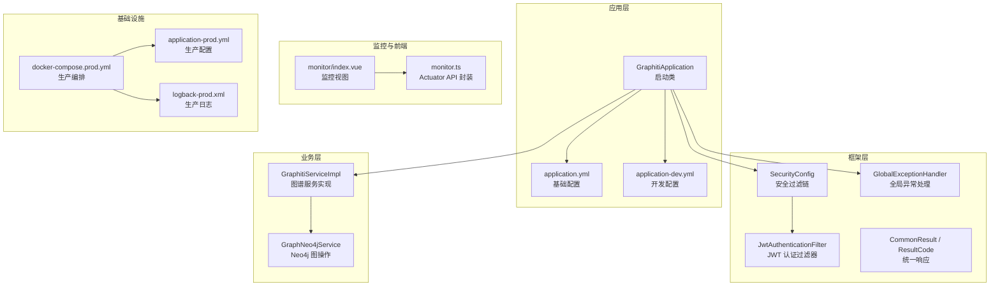
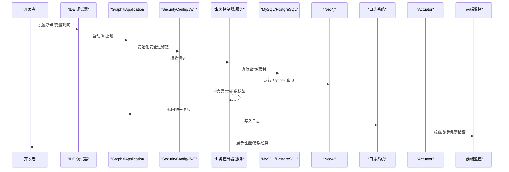
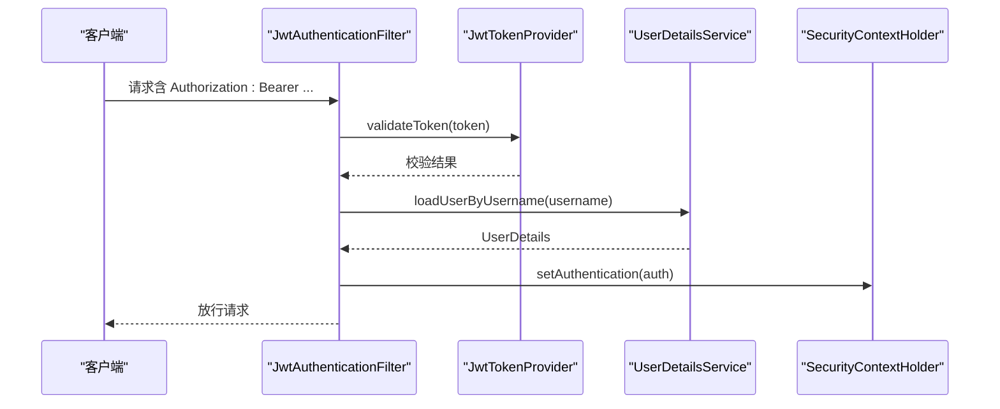
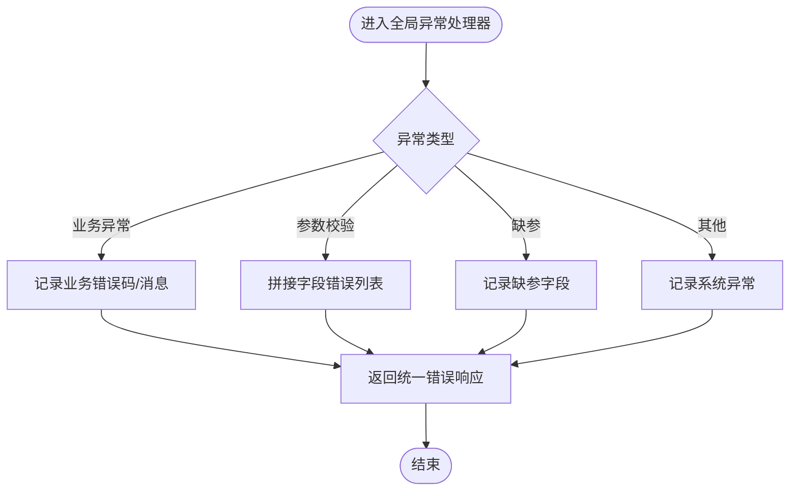
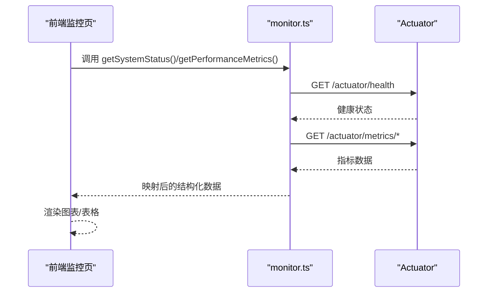
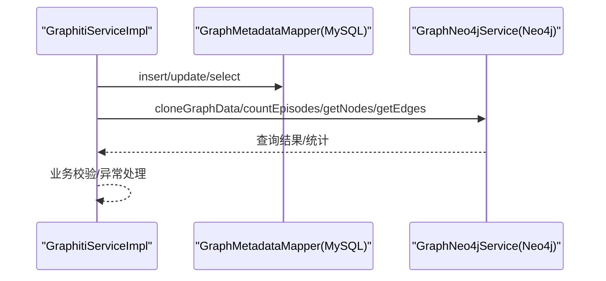
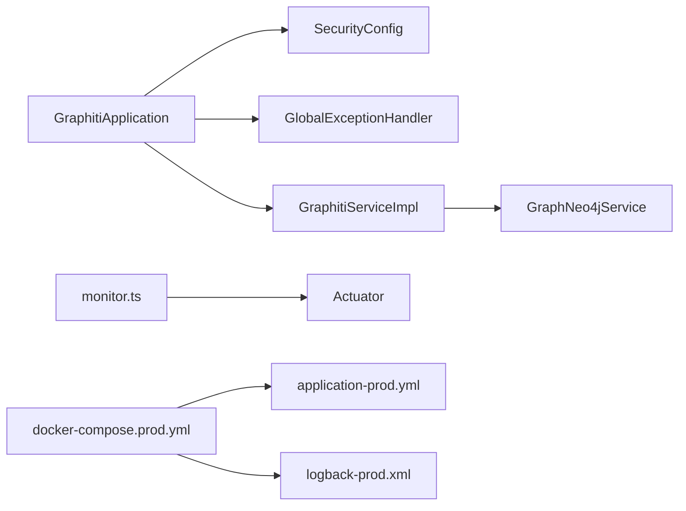

# 调试与性能分析

<cite>
**本文引用的文件**
- [GraphitiApplication.java](file://graphiti-server/src/main/java/com/graphiti/GraphitiApplication.java)
- [application.yml](file://graphiti-server/src/main/resources/application.yml)
- [application-dev.yml](file://graphiti-server/src/main/resources/application-dev.yml)
- [logback-prod.xml](file://config/logback-prod.xml)
- [SecurityConfig.java](file://graphiti-framework/graphiti-spring-boot-starter-security/src/main/java/com/graphiti/framework/security/config/SecurityConfig.java)
- [JwtAuthenticationFilter.java](file://graphiti-framework/graphiti-spring-boot-starter-security/src/main/java/com/graphiti/framework/security/jwt/JwtAuthenticationFilter.java)
- [GlobalExceptionHandler.java](file://graphiti-framework/graphiti-common/src/main/java/com/graphiti/common/exception/GlobalExceptionHandler.java)
- [CommonResult.java](file://graphiti-framework/graphiti-common/src/main/java/com/graphiti/common/response/CommonResult.java)
- [ResultCode.java](file://graphiti-framework/graphiti-common/src/main/java/com/graphiti/common/constants/ResultCode.java)
- [monitor.ts](file://graphiti-web/src/api/monitor.ts)
- [index.vue](file://graphiti-web/src/views/monitor/index.vue)
- [docker-compose.prod.yml](file://docker-compose.prod.yml)
- [application-prod.yml](file://config/application-prod.yml)
- [GraphitiServiceImpl.java](file://graphiti-module-core/src/main/java/com/graphiti/module/graphiti/service/impl/GraphitiServiceImpl.java)
- [GraphNeo4jService.java](file://graphiti-module-core/src/main/java/com/graphiti/module/graphiti/service/GraphNeo4jService.java)
- [docker-compose.prod.yml](file://docker-compose.prod.yml)
- [install.md](file://install.md)
</cite>

## 目录
1. [简介](#简介)
2. [项目结构](#项目结构)
3. [核心组件](#核心组件)
4. [架构总览](#架构总览)
5. [详细组件分析](#详细组件分析)
6. [依赖分析](#依赖分析)
7. [性能考虑](#性能考虑)
8. [故障排查指南](#故障排查指南)
9. [结论](#结论)
10. [附录](#附录)

## 简介
本指南面向开发者与运维工程师，围绕 Graphiti-Java 后端服务提供一套完整的调试与性能分析实践，涵盖：
- IDE 调试配置、断点设置与变量监控
- 日志级别配置、日志分析工具与错误追踪
- 性能分析工具使用、内存泄漏检测与 CPU 性能分析
- 数据库查询优化、慢查询分析与索引优化策略
- 分布式追踪、APM 工具使用与生产环境问题排查

## 项目结构
后端采用 Spring Boot 多模块结构，核心模块包括：
- graphiti-server：应用启动与配置入口
- graphiti-framework：通用框架与基础设施（安全、公共响应、MyBatis-Plus、Redis 等）
- graphiti-module-core：业务域实现（图谱、本体、导入导出、Neo4j/MySQL/Redis 集成）
- graphiti-web：前端控制台（监控页、API 文档等）

**图表来源**
- [GraphitiApplication.java:18-39](file://graphiti-server/src/main/java/com/graphiti/GraphitiApplication.java#L18-L39)
- [application.yml:1-67](file://graphiti-server/src/main/resources/application.yml#L1-L67)
- [application-dev.yml:1-676](file://graphiti-server/src/main/resources/application-dev.yml#L1-L676)
- [SecurityConfig.java:115-136](file://graphiti-framework/graphiti-spring-boot-starter-security/src/main/java/com/graphiti/framework/security/config/SecurityConfig.java#L115-L136)
- [JwtAuthenticationFilter.java:26-60](file://graphiti-framework/graphiti-spring-boot-starter-security/src/main/java/com/graphiti/framework/security/jwt/JwtAuthenticationFilter.java#L26-L60)
- [GlobalExceptionHandler.java:17-73](file://graphiti-framework/graphiti-common/src/main/java/com/graphiti/common/exception/GlobalExceptionHandler.java#L17-L73)
- [CommonResult.java:14-67](file://graphiti-framework/graphiti-common/src/main/java/com/graphiti/common/response/CommonResult.java#L14-L67)
- [ResultCode.java:7-22](file://graphiti-framework/graphiti-common/src/main/java/com/graphiti/common/constants/ResultCode.java#L7-L22)
- [GraphitiServiceImpl.java:24-256](file://graphiti-module-core/src/main/java/com/graphiti/module/graphiti/service/impl/GraphitiServiceImpl.java#L24-L256)
- [GraphNeo4jService.java:941-972](file://graphiti-module-core/src/main/java/com/graphiti/module/graphiti/service/GraphNeo4jService.java#L941-L972)
- [monitor.ts:75-196](file://graphiti-web/src/api/monitor.ts#L75-L196)
- [index.vue:256-322](file://graphiti-web/src/views/monitor/index.vue#L256-L322)
- [docker-compose.prod.yml:11-39](file://docker-compose.prod.yml#L11-L39)
- [application-prod.yml:10-41](file://config/application-prod.yml#L10-L41)
- [logback-prod.xml:8-70](file://config/logback-prod.xml#L8-L70)

**章节来源**
- [GraphitiApplication.java:18-39](file://graphiti-server/src/main/java/com/graphiti/GraphitiApplication.java#L18-L39)
- [application.yml:1-67](file://graphiti-server/src/main/resources/application.yml#L1-L67)
- [application-dev.yml:1-676](file://graphiti-server/src/main/resources/application-dev.yml#L1-L676)

## 核心组件
- 启动与配置
  - 启动类负责扫描包与排除不必要的自动配置，确保运行时轻量化。
  - 应用配置文件提供 MyBatis-Plus、JWT、日志、Actuator、OpenAPI 等关键开关。
- 安全与认证
  - 安全配置启用无状态会话、CORS、JWT 过滤链，并对未认证与权限不足场景返回结构化 JSON。
  - JWT 过滤器从 Authorization 请求头提取 Token，进行校验并注入认证上下文。
- 统一响应与异常
  - 统一响应封装与错误码常量，保证前后端交互一致性。
  - 全局异常处理器捕获业务异常、参数校验异常与未知异常，记录日志并返回统一格式。
- 监控与前端
  - 前端通过 Axios 封装 Actuator 接口，获取系统健康、性能指标与数据库状态。
  - 控制台页面展示 CPU/内存/磁盘使用率、请求量与响应时间趋势。

**章节来源**
- [SecurityConfig.java:115-136](file://graphiti-framework/graphiti-spring-boot-starter-security/src/main/java/com/graphiti/framework/security/config/SecurityConfig.java#L115-L136)
- [JwtAuthenticationFilter.java:26-60](file://graphiti-framework/graphiti-spring-boot-starter-security/src/main/java/com/graphiti/framework/security/jwt/JwtAuthenticationFilter.java#L26-L60)
- [GlobalExceptionHandler.java:17-73](file://graphiti-framework/graphiti-common/src/main/java/com/graphiti/common/exception/GlobalExceptionHandler.java#L17-L73)
- [CommonResult.java:14-67](file://graphiti-framework/graphiti-common/src/main/java/com/graphiti/common/response/CommonResult.java#L14-L67)
- [ResultCode.java:7-22](file://graphiti-framework/graphiti-common/src/main/java/com/graphiti/common/constants/ResultCode.java#L7-L22)
- [monitor.ts:75-196](file://graphiti-web/src/api/monitor.ts#L75-L196)
- [index.vue:256-322](file://graphiti-web/src/views/monitor/index.vue#L256-L322)

## 架构总览
下图展示了调试与性能分析的关键交互路径：IDE 断点与变量监控、日志采集、异常处理、Actuator 指标采集与前端可视化。

**图表来源**
- [GraphitiApplication.java:18-39](file://graphiti-server/src/main/java/com/graphiti/GraphitiApplication.java#L18-L39)
- [SecurityConfig.java:115-136](file://graphiti-framework/graphiti-spring-boot-starter-security/src/main/java/com/graphiti/framework/security/config/SecurityConfig.java#L115-L136)
- [JwtAuthenticationFilter.java:26-60](file://graphiti-framework/graphiti-spring-boot-starter-security/src/main/java/com/graphiti/framework/security/jwt/JwtAuthenticationFilter.java#L26-L60)
- [GlobalExceptionHandler.java:17-73](file://graphiti-framework/graphiti-common/src/main/java/com/graphiti/common/exception/GlobalExceptionHandler.java#L17-L73)
- [monitor.ts:75-196](file://graphiti-web/src/api/monitor.ts#L75-L196)

## 详细组件分析

### 组件A：安全与认证（调试要点）
- 调试建议
  - 在 JWT 过滤器中设置断点，验证 Authorization 头是否正确传递、Token 是否有效、用户详情是否加载成功。
  - 在安全配置处断点，确认未认证与权限不足分支返回的 JSON 结构是否符合前端预期。
- 变量监控
  - 观察请求头中的 Authorization 字段、Token 解析后的用户名、认证上下文中的权限集合。
- 错误追踪
  - 未认证/权限不足时返回结构化 JSON，便于前端定位问题；结合日志查看具体异常堆栈。

**图表来源**
- [JwtAuthenticationFilter.java:26-60](file://graphiti-framework/graphiti-spring-boot-starter-security/src/main/java/com/graphiti/framework/security/jwt/JwtAuthenticationFilter.java#L26-L60)
- [SecurityConfig.java:115-136](file://graphiti-framework/graphiti-spring-boot-starter-security/src/main/java/com/graphiti/framework/security/config/SecurityConfig.java#L115-L136)

**章节来源**
- [JwtAuthenticationFilter.java:26-60](file://graphiti-framework/graphiti-spring-boot-starter-security/src/main/java/com/graphiti/framework/security/jwt/JwtAuthenticationFilter.java#L26-L60)
- [SecurityConfig.java:115-136](file://graphiti-framework/graphiti-spring-boot-starter-security/src/main/java/com/graphiti/framework/security/config/SecurityConfig.java#L115-L136)

### 组件B：统一异常处理（调试要点）
- 调试建议
  - 在全局异常处理器中设置断点，分别触发业务异常、参数校验异常与缺参异常，验证返回码与消息是否符合 ResultCode 定义。
- 变量监控
  - 观察异常类型、错误码、消息体与日志输出级别。
- 错误追踪
  - 结合前端监控页面的 API 日志表格，筛选状态码与响应时间，定位高频错误。

**图表来源**
- [GlobalExceptionHandler.java:17-73](file://graphiti-framework/graphiti-common/src/main/java/com/graphiti/common/exception/GlobalExceptionHandler.java#L17-L73)
- [ResultCode.java:7-22](file://graphiti-framework/graphiti-common/src/main/java/com/graphiti/common/constants/ResultCode.java#L7-L22)
- [CommonResult.java:14-67](file://graphiti-framework/graphiti-common/src/main/java/com/graphiti/common/response/CommonResult.java#L14-L67)

**章节来源**
- [GlobalExceptionHandler.java:17-73](file://graphiti-framework/graphiti-common/src/main/java/com/graphiti/common/exception/GlobalExceptionHandler.java#L17-L73)
- [ResultCode.java:7-22](file://graphiti-framework/graphiti-common/src/main/java/com/graphiti/common/constants/ResultCode.java#L7-L22)
- [CommonResult.java:14-67](file://graphiti-framework/graphiti-common/src/main/java/com/graphiti/common/response/CommonResult.java#L14-L67)

### 组件C：监控与前端可视化（调试要点）
- 调试建议
  - 在前端 monitor.ts 中断点，观察 Actuator 接口调用顺序与返回数据映射。
  - 在前端监控页断点，验证图表渲染的数据结构与时间轴切分逻辑。
- 变量监控
  - 观察 CPU/内存使用率、线程数、请求量与平均响应时间等指标。
- 错误追踪
  - 当 Actuator 接口不可用时，前端降级为模拟数据，便于离线调试。

**图表来源**
- [monitor.ts:75-196](file://graphiti-web/src/api/monitor.ts#L75-L196)
- [index.vue:256-322](file://graphiti-web/src/views/monitor/index.vue#L256-L322)

**章节来源**
- [monitor.ts:75-196](file://graphiti-web/src/api/monitor.ts#L75-L196)
- [index.vue:256-322](file://graphiti-web/src/views/monitor/index.vue#L256-L322)

### 组件D：业务服务（调试要点）
- 调试建议
  - 在图谱服务实现中设置断点，观察图谱创建、列表、更新、删除、克隆与导出流程。
  - 在 Neo4j 服务中设置断点，验证 Cypher 查询执行与结果映射。
- 变量监控
  - 观察图谱元数据、节点/边计数、Episode 统计与异常日志。
- 错误追踪
  - 对于跨存储（MySQL/Neo4j）的事务性操作，关注异常回滚与日志记录。

**图表来源**
- [GraphitiServiceImpl.java:24-256](file://graphiti-module-core/src/main/java/com/graphiti/module/graphiti/service/impl/GraphitiServiceImpl.java#L24-L256)
- [GraphNeo4jService.java:941-972](file://graphiti-module-core/src/main/java/com/graphiti/module/graphiti/service/GraphNeo4jService.java#L941-L972)

**章节来源**
- [GraphitiServiceImpl.java:24-256](file://graphiti-module-core/src/main/java/com/graphiti/module/graphiti/service/impl/GraphitiServiceImpl.java#L24-L256)
- [GraphNeo4jService.java:941-972](file://graphiti-module-core/src/main/java/com/graphiti/module/graphiti/service/GraphNeo4jService.java#L941-L972)

## 依赖分析
- 启动类排除了部分 AI 自动配置，减少运行时开销。
- 安全模块依赖 Spring Security 与 JWT，提供无状态认证。
- 业务模块依赖 MyBatis-Plus 与动态数据源，支撑 MySQL/PostgreSQL。
- 前端通过 Axios 访问 Actuator，实现系统监控可视化。

**图表来源**
- [GraphitiApplication.java:18-39](file://graphiti-server/src/main/java/com/graphiti/GraphitiApplication.java#L18-L39)
- [SecurityConfig.java:115-136](file://graphiti-framework/graphiti-spring-boot-starter-security/src/main/java/com/graphiti/framework/security/config/SecurityConfig.java#L115-L136)
- [GlobalExceptionHandler.java:17-73](file://graphiti-framework/graphiti-common/src/main/java/com/graphiti/common/exception/GlobalExceptionHandler.java#L17-L73)
- [GraphitiServiceImpl.java:24-256](file://graphiti-module-core/src/main/java/com/graphiti/module/graphiti/service/impl/GraphitiServiceImpl.java#L24-L256)
- [monitor.ts:75-196](file://graphiti-web/src/api/monitor.ts#L75-L196)
- [docker-compose.prod.yml:11-39](file://docker-compose.prod.yml#L11-L39)
- [application-prod.yml:10-41](file://config/application-prod.yml#L10-L41)
- [logback-prod.xml:8-70](file://config/logback-prod.xml#L8-L70)

**章节来源**
- [GraphitiApplication.java:18-39](file://graphiti-server/src/main/java/com/graphiti/GraphitiApplication.java#L18-L39)
- [monitor.ts:75-196](file://graphiti-web/src/api/monitor.ts#L75-L196)

## 性能考虑
- JVM 与容器资源
  - 生产环境通过容器资源限制与 JVM 参数控制内存与 CPU 使用，建议结合监控指标调整。
- Actuator 指标
  - 使用 Actuator 暴露 jvm.memory.used/committed、process.cpu.usage、jvm.threads.live 等指标，前端按时间窗口聚合展示。
- 日志性能
  - 生产环境使用异步 Appender 与滚动策略，避免阻塞主线程与磁盘 IO 放大。
- 数据库连接池
  - HikariCP 连接池参数可在生产配置中调整，平衡并发与延迟。
- 前端监控
  - 建议在前端增加错误边界与埋点上报，结合后端日志与指标进行关联分析。

**章节来源**
- [docker-compose.prod.yml:11-39](file://docker-compose.prod.yml#L11-L39)
- [application-prod.yml:10-41](file://config/application-prod.yml#L10-L41)
- [monitor.ts:103-122](file://graphiti-web/src/api/monitor.ts#L103-L122)
- [logback-prod.xml:50-56](file://config/logback-prod.xml#L50-L56)

## 故障排查指南
- 开发环境调试
  - 启动应用后，通过 Swagger UI 验证接口可用性；在 IDE 中设置断点，逐步跟踪请求生命周期。
  - 使用 Actuator 端点检查健康状态与指标，定位异常来源。
- 安全与认证问题
  - 若出现 401/403，检查 Authorization 头是否携带 Bearer Token，确认 JWT 过滤器是否正确解析与注入认证上下文。
- 统一响应与异常
  - 若返回非预期错误码，核对全局异常处理器与 ResultCode 常量，确保业务异常被正确包装。
- 前端监控
  - 若监控页显示模拟数据，检查 Actuator 基础地址配置与网络连通性。
- 生产环境
  - 通过 docker-compose 生产编排与日志落盘策略，结合容器健康检查与资源限制，快速定位资源瓶颈与异常进程。

**章节来源**
- [SecurityConfig.java:84-113](file://graphiti-framework/graphiti-spring-boot-starter-security/src/main/java/com/graphiti/framework/security/config/SecurityConfig.java#L84-L113)
- [JwtAuthenticationFilter.java:26-60](file://graphiti-framework/graphiti-spring-boot-starter-security/src/main/java/com/graphiti/framework/security/jwt/JwtAuthenticationFilter.java#L26-L60)
- [GlobalExceptionHandler.java:17-73](file://graphiti-framework/graphiti-common/src/main/java/com/graphiti/common/exception/GlobalExceptionHandler.java#L17-L73)
- [monitor.ts:75-97](file://graphiti-web/src/api/monitor.ts#L75-L97)
- [docker-compose.prod.yml:43-48](file://docker-compose.prod.yml#L43-L48)
- [install.md:169-184](file://install.md#L169-L184)

## 结论
本指南提供了从 IDE 调试、日志与异常处理，到性能指标采集与前端可视化的完整闭环。结合生产环境的容器编排与日志策略，可快速定位问题并持续优化系统稳定性与性能表现。

## 附录
- IDE 调试建议
  - 在启动类与安全过滤器设置断点，观察请求进入与放行路径。
  - 在全局异常处理器设置断点，验证各类异常的统一返回。
  - 在业务服务与 Neo4j 服务设置断点，验证跨存储操作与异常回滚。
- 日志与监控
  - 开发环境使用详细日志级别，生产环境使用异步与滚动策略。
  - 前端通过 Actuator 获取指标，结合时间窗口与阈值告警进行分析。
- 数据库优化
  - 基于 Actuator 指标与业务热点查询，针对性创建索引与优化连接池参数。