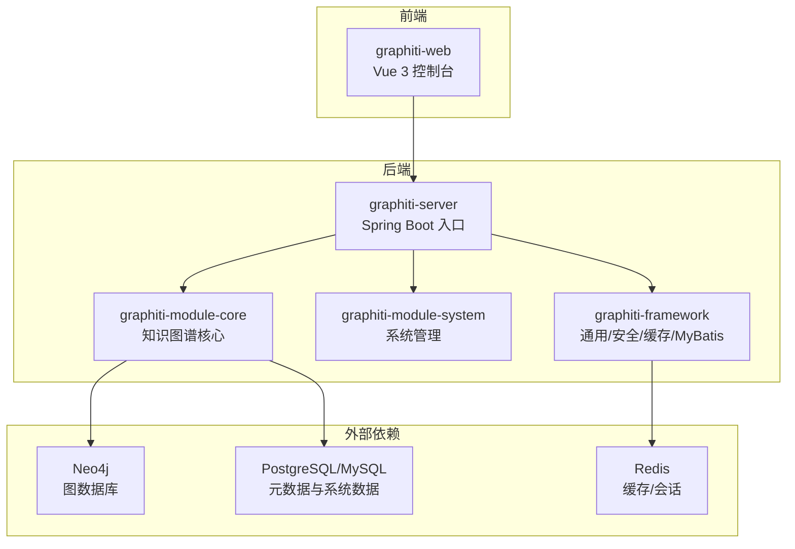
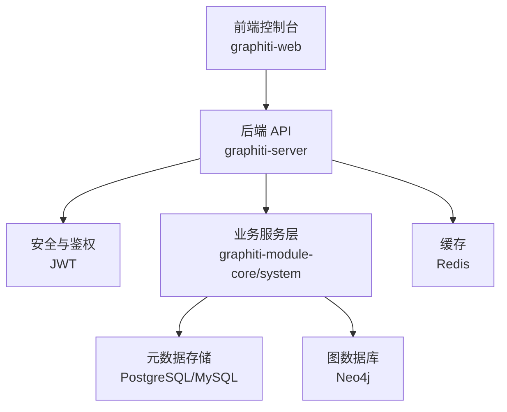
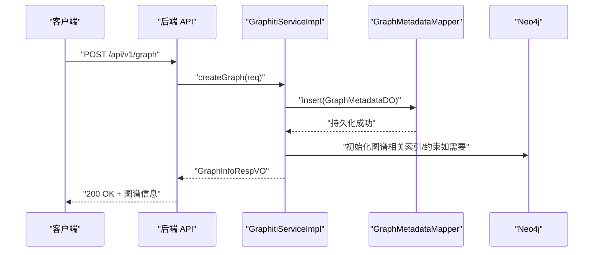
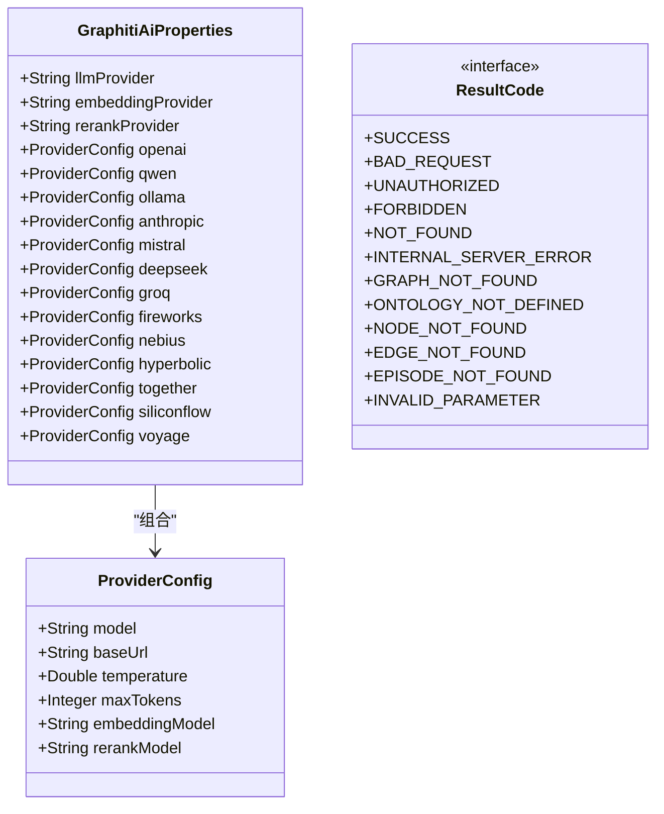
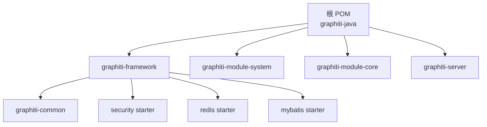

# 快速开始

<!--<cite>
**本文引用的文件**
- [README.md](file://README.md)
- [pom.xml](file://pom.xml)
- [graphiti-server/src/main/resources/application.yml](file://graphiti-server/src/main/resources/application.yml)
- [graphiti-server/src/main/resources/application-dev.yml](file://graphiti-server/src/main/resources/application-dev.yml)
- [graphiti-server/src/main/java/com/graphiti/GraphitiApplication.java](file://graphiti-server/src/main/java/com/graphiti/GraphitiApplication.java)
- [graphiti-module-core/src/main/java/com/Graphiti/module/graphiti/config/GraphitiAiProperties.java](file://graphiti-module-core/src/main/java/com/graphiti/module/graphiti/config/GraphitiAiProperties.java)
- [graphiti-module-core/src/main/java/com/Graphiti/module/graphiti/service/impl/GraphitiServiceImpl.java](file://graphiti-module-core/src/main/java/com/graphiti/module/graphiti/service/impl/GraphitiServiceImpl.java)
- [graphiti-framework/graphiti-common/src/main/java/com/graphiti/common/constants/ResultCode.java](file://graphiti-framework/graphiti-common/src/main/java/com/graphiti/common/constants/ResultCode.java)
- [graphiti-web/package.json](file://graphiti-web/package.json)
- [graphiti-web/vite.config.ts](file://graphiti-web/vite.config.ts)
- [graphiti-web/setup.bat](file://graphiti-web/setup.bat)
- [graphiti-web/install.bat](file://graphiti-web/install.bat)
- [sql/postgresql/schema.sql](file://sql/postgresql/schema.sql)
- [sql/neo4j/init.cypher](file://sql/neo4j/init.cypher)
</cite>-->

## 目录
1. [简介](#简介)
2. [项目结构](#项目结构)
3. [核心组件](#核心组件)
4. [架构总览](#架构总览)
5. [详细组件分析](#详细组件分析)
6. [依赖分析](#依赖分析)
7. [性能考虑](#性能考虑)
8. [故障排除指南](#故障排除指南)
9. [结论](#结论)
10. [附录](#附录)

## 简介
本指南面向首次接触 Graphiti-Java 的用户，帮助你在约 30 分钟内完成环境准备、安装配置与首次运行。你将获得：
- 完整的前置条件清单（JDK 21+、Maven、Neo4j、PostgreSQL/MySQL、Redis、Node.js）
- 详细的安装步骤（代码克隆、依赖安装、数据库初始化、配置修改）
- 命令行示例与配置文件模板路径
- 组件作用与相互关系说明
- 常见问题与故障排除建议
- 成功运行后的验证步骤与预期输出

## 项目结构
Graphiti-Java 采用多模块 Maven 工程组织，包含后端框架、业务模块、服务入口与前端控制台。核心模块如下：
- graphiti-framework：通用组件与安全、缓存、MyBatis 扩展
- graphiti-module-system：系统管理（用户、角色、菜单、认证）
- graphiti-module-core：知识图谱核心（图、节点、边、本体、搜索、导入等）
- graphiti-server：Spring Boot 启动入口与配置
- graphiti-web：Vue 3 前端控制台

图表来源
- [pom.xml:15-20](file://pom.xml#L15-L20)
- [graphiti-server/src/main/java/com/graphiti/GraphitiApplication.java:18-34](file://graphiti-server/src/main/java/com/graphiti/GraphitiApplication.java#L18-L34)

章节来源
- [README.md:110-166](file://README.md#L110-L166)
- [pom.xml:15-20](file://pom.xml#L15-L20)

## 核心组件
- 启动入口：Spring Boot 应用入口类负责扫描包与排除不必要的自动配置
- 配置中心：application.yml 与 application-dev.yml 提供基础配置与开发环境模板
- AI 配置：GraphitiAiProperties 读取 graphiti.ai.* 配置，统一管理 LLM/Embedding/Rerank 提供商
- 业务服务：GraphitiServiceImpl 等实现图谱生命周期、统计与克隆导出等核心功能
- 前端代理：Vite 配置将 /api 代理至后端 8080 端口，便于联调

章节来源
- [graphiti-server/src/main/java/com/graphiti/GraphitiApplication.java:18-34](file://graphiti-server/src/main/java/com/graphiti/GraphitiApplication.java#L18-L34)
- [graphiti-server/src/main/resources/application.yml:25-67](file://graphiti-server/src/main/resources/application.yml#L25-L67)
- [graphiti-server/src/main/resources/application-dev.yml:508-593](file://graphiti-server/src/main/resources/application-dev.yml#L508-L593)
- [graphiti-module-core/src/main/java/com/graphiti/module/graphiti/config/GraphitiAiProperties.java:13-135](file://graphiti-module-core/src/main/java/com/graphiti/module/graphiti/config/GraphitiAiProperties.java#L13-L135)
- [graphiti-module-core/src/main/java/com/graphiti/module/graphiti/service/impl/GraphitiServiceImpl.java:24-200](file://graphiti-module-core/src/main/java/com/graphiti/module/graphiti/service/impl/GraphitiServiceImpl.java#L24-L200)
- [graphiti-web/vite.config.ts:18-26](file://graphiti-web/vite.config.ts#L18-L26)

## 架构总览
后端以 Spring Boot 为核心，结合 Spring AI、MyBatis-Plus、Neo4j Java Driver、Redisson 与 JWT 安全栈，提供知识图谱的实体抽取、本体校验、混合搜索与社区发现能力。前端采用 Vue 3 + Vite，通过代理访问后端 API。

图表来源
- [README.md:71-108](file://README.md#L71-L108)
- [README.md:170-218](file://README.md#L170-L218)

章节来源
- [README.md:71-108](file://README.md#L71-L108)
- [README.md:170-218](file://README.md#L170-L218)

## 详细组件分析

### 环境准备与安装
- 前置条件
  - JDK 21+
  - Maven 3.9+
  - Neo4j 5.26+
  - PostgreSQL 15+（或 MySQL 8.0+）
  - Redis 6+
  - Node.js 18+（用于前端）

- 克隆与构建
  - 克隆仓库后，在根目录执行 Maven 安装（跳过测试可加速）
  - 命令参考：[README.md:234-238](file://README.md#L234-L238)

- 数据库初始化
  - Neo4j：执行 Cypher 初始化脚本创建唯一性约束与索引
    - 脚本路径：[sql/neo4j/init.cypher:1-33](file://sql/neo4j/init.cypher#L1-L33)
  - PostgreSQL：执行 schema.sql 与 init-data.sql
    - 脚本路径：[sql/postgresql/schema.sql:1-319](file://sql/postgresql/schema.sql#L1-L319)
  - MySQL（可选）：同理执行对应 SQL 文件

- 配置应用
  - 编辑开发配置文件 application-dev.yml，填写 LLM/Embedding/Rerank 提供商与凭据
  - 关键配置项参考：
    - LLM 提供商与嵌入提供商：[graphiti-server/src/main/resources/application-dev.yml:508-593](file://graphiti-server/src/main/resources/application-dev.yml#L508-L593)
    - 数据源与 Redis：[graphiti-server/src/main/resources/application-dev.yml:487-507](file://graphiti-server/src/main/resources/application-dev.yml#L487-L507)
    - Neo4j 连接：[graphiti-server/src/main/resources/application-dev.yml:594-599](file://graphiti-server/src/main/resources/application-dev.yml#L594-L599)
  - 基础配置（JWT、日志、Actuator、OpenAPI）参考：
    - [graphiti-server/src/main/resources/application.yml:25-67](file://graphiti-server/src/main/resources/application.yml#L25-L67)

- 启动后端
  - 在 graphiti-server 目录执行 Spring Boot 运行命令
  - 访问 Swagger UI：http://localhost:8080/swagger-ui.html
  - 参考：[README.md:293-301](file://README.md#L293-L301)

- 启动前端
  - 在 graphiti-web 目录安装依赖并启动开发服务器
  - 前端默认端口：http://localhost:5173
  - 参考：[README.md:303-312](file://README.md#L303-L312)

章节来源
- [README.md:221-312](file://README.md#L221-L312)
- [graphiti-server/src/main/resources/application.yml:25-67](file://graphiti-server/src/main/resources/application.yml#L25-L67)
- [graphiti-server/src/main/resources/application-dev.yml:487-599](file://graphiti-server/src/main/resources/application-dev.yml#L487-L599)
- [sql/neo4j/init.cypher:1-33](file://sql/neo4j/init.cypher#L1-L33)
- [sql/postgresql/schema.sql:1-319](file://sql/postgresql/schema.sql#L1-L319)

### 首次运行与验证
- 登录与获取 Token
  - 使用系统管理模块的登录接口获取 JWT Token（具体接口见 Swagger 文档）
  - Swagger 路径：http://localhost:8080/swagger-ui.html

- 创建图谱
  - 请求示例参考：[README.md:317-324](file://README.md#L317-L324)
  - 返回包含新建图谱的 graphId

- 自动抽取与导入数据
  - 将非结构化文本提交给数据导入接口，系统自动抽取实体与关系
  - 示例参考：[README.md:326-338](file://README.md#L326-L338)

- 混合搜索
  - 使用混合搜索接口进行 BM25、向量与 BFS 的融合检索
  - 示例参考：[README.md:347-364](file://README.md#L347-L364)

- 定义本体
  - 通过本体接口定义实体与关系类型，开启六层校验
  - 示例参考：[README.md:366-395](file://README.md#L366-L395)

- 社区发现
  - 触发社区构建，生成社区摘要
  - 示例参考：[README.md:397-402](file://README.md#L397-L402)

章节来源
- [README.md:317-402](file://README.md#L317-L402)

### 组件交互序列（创建图谱）

图表来源
- [graphiti-module-core/src/main/java/com/graphiti/module/graphiti/service/impl/GraphitiServiceImpl.java:24-70](file://graphiti-module-core/src/main/java/com/graphiti/module/graphiti/service/impl/GraphitiServiceImpl.java#L24-L70)

章节来源
- [graphiti-module-core/src/main/java/com/graphiti/module/graphiti/service/impl/GraphitiServiceImpl.java:24-70](file://graphiti-module-core/src/main/java/com/graphiti/module/graphiti/service/impl/GraphitiServiceImpl.java#L24-L70)

### 类关系概览（核心配置与常量）

图表来源
- [graphiti-module-core/src/main/java/com/graphiti/module/graphiti/config/GraphitiAiProperties.java:13-135](file://graphiti-module-core/src/main/java/com/graphiti/module/graphiti/config/GraphitiAiProperties.java#L13-L135)
- [graphiti-framework/graphiti-common/src/main/java/com/graphiti/common/constants/ResultCode.java:7-22](file://graphiti-framework/graphiti-common/src/main/java/com/graphiti/common/constants/ResultCode.java#L7-L22)

章节来源
- [graphiti-module-core/src/main/java/com/graphiti/module/graphiti/config/GraphitiAiProperties.java:13-135](file://graphiti-module-core/src/main/java/com/graphiti/module/graphiti/config/GraphitiAiProperties.java#L13-L135)
- [graphiti-framework/graphiti-common/src/main/java/com/graphiti/common/constants/ResultCode.java:7-22](file://graphiti-framework/graphiti-common/src/main/java/com/graphiti/common/constants/ResultCode.java#L7-L22)

## 依赖分析
- 技术栈与版本
  - 后端：Java 21、Spring Boot 3.5.5、Spring AI 1.1.2、MyBatis-Plus 3.5.12、Neo4j Java Driver 5.26.0、Redisson 3.37.0、JWT jjwt 0.12.3
  - 前端：Vue 3.4、Vite 5.2、Ant Design Vue 4.2
  - 数据库：Neo4j 5.26、PostgreSQL 15+、MySQL 8.0+、Redis 6+

- Maven 模块依赖
  - 根 POM 定义了多模块结构与依赖版本管理，确保一致性

图表来源
- [pom.xml:15-20](file://pom.xml#L15-L20)
- [pom.xml:45-196](file://pom.xml#L45-L196)

章节来源
- [README.md:170-218](file://README.md#L170-L218)
- [pom.xml:15-20](file://pom.xml#L15-L20)
- [pom.xml:45-196](file://pom.xml#L45-L196)

## 性能考虑
- 数据库连接池与并发
  - application-dev.yml 中已配置 Hikari 连接池参数，可根据环境调整最大连接数与超时
  - 参考：[graphiti-server/src/main/resources/application-dev.yml:498-501](file://graphiti-server/src/main/resources/application-dev.yml#L498-L501)

- 向量索引与搜索
  - Neo4j 已创建节点与边的向量索引，确保嵌入维度与相似度函数匹配
  - 参考：[README.md:477-491](file://README.md#L477-L491)

- 前端开发体验
  - Vite 代理与热更新提升开发效率；生产构建目标为现代浏览器兼容
  - 参考：[graphiti-web/vite.config.ts:18-26](file://graphiti-web/vite.config.ts#L18-L26)

## 故障排除指南
- 启动失败（端口占用）
  - 后端默认端口 8080，前端默认 5173；若冲突请修改相应配置
  - 参考：[README.md:300-312](file://README.md#L300-L312)

- 数据库连接异常
  - 检查 application-dev.yml 中的数据源 URL、用户名与密码
  - 参考：[graphiti-server/src/main/resources/application-dev.yml:487-507](file://graphiti-server/src/main/resources/application-dev.yml#L487-L507)

- Neo4j 连接失败
  - 确认 Neo4j 服务已启动，URI 与凭据正确
  - 参考：[graphiti-server/src/main/resources/application-dev.yml:594-599](file://graphiti-server/src/main/resources/application-dev.yml#L594-L599)

- LLM/Embedding/Rerank 配置错误
  - 在 application-dev.yml 中选择正确的提供商，并填写 API Key/base-url
  - 参考：[graphiti-server/src/main/resources/application-dev.yml:508-593](file://graphiti-server/src/main/resources/application-dev.yml#L508-L593)

- 前端无法访问后端 API
  - 确认 Vite 代理配置指向 8080 端口
  - 参考：[graphiti-web/vite.config.ts:20-25](file://graphiti-web/vite.config.ts#L20-L25)

- 常见返回码
  - 业务错误码参考 ResultCode 常量定义，便于定位问题类型
  - 参考：[graphiti-framework/graphiti-common/src/main/java/com/graphiti/common/constants/ResultCode.java:7-22](file://graphiti-framework/graphiti-common/src/main/java/com/graphiti/common/constants/ResultCode.java#L7-L22)

章节来源
- [README.md:300-312](file://README.md#L300-L312)
- [graphiti-server/src/main/resources/application-dev.yml:487-599](file://graphiti-server/src/main/resources/application-dev.yml#L487-L599)
- [graphiti-web/vite.config.ts:20-25](file://graphiti-web/vite.config.ts#L20-L25)
- [graphiti-framework/graphiti-common/src/main/java/com/graphiti/common/constants/ResultCode.java:7-22](file://graphiti-framework/graphiti-common/src/main/java/com/graphiti/common/constants/ResultCode.java#L7-L22)

## 结论
按照本指南，你可以在 30 分钟内完成 Graphiti-Java 的环境准备、安装配置与首次运行。建议在开发阶段使用 PostgreSQL 与 Neo4j 的本地实例，完成后端与前端分别启动，随后通过 Swagger 文档与示例请求验证核心功能。遇到问题时，优先检查配置文件与数据库连接，必要时开启更详细的日志级别以辅助诊断。

## 附录
- 前端依赖与脚本
  - 依赖管理与脚本定义参考：[graphiti-web/package.json:1-32](file://graphiti-web/package.json#L1-L32)
  - Windows 安装与启动脚本参考：[graphiti-web/setup.bat:1-32](file://graphiti-web/setup.bat#L1-L32)、[graphiti-web/install.bat:1-10](file://graphiti-web/install.bat#L1-L10)

- 数据库初始化脚本
  - PostgreSQL Schema：[sql/postgresql/schema.sql:1-319](file://sql/postgresql/schema.sql#L1-L319)
  - Neo4j 初始化：[sql/neo4j/init.cypher:1-33](file://sql/neo4j/init.cypher#L1-L33)

章节来源
- [graphiti-web/package.json:1-32](file://graphiti-web/package.json#L1-L32)
- [graphiti-web/setup.bat:1-32](file://graphiti-web/setup.bat#L1-L32)
- [graphiti-web/install.bat:1-10](file://graphiti-web/install.bat#L1-L10)
- [sql/postgresql/schema.sql:1-319](file://sql/postgresql/schema.sql#L1-L319)
- [sql/neo4j/init.cypher:1-33](file://sql/neo4j/init.cypher#L1-L33)