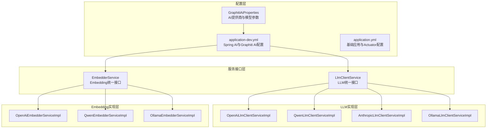
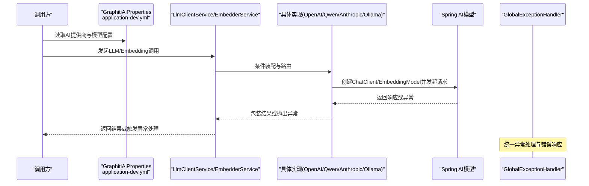
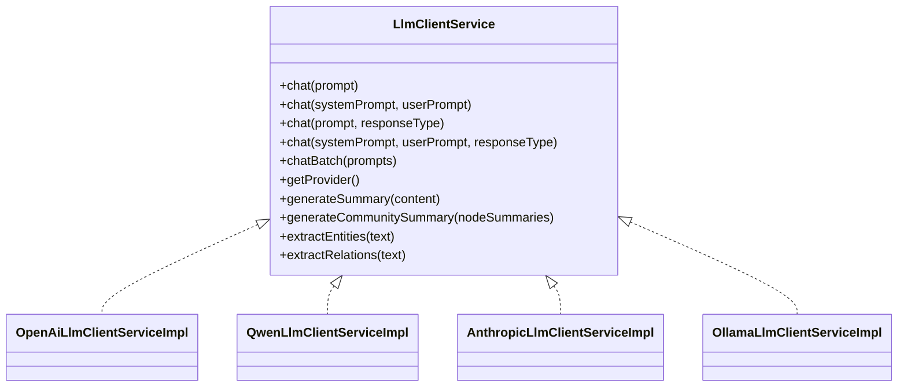
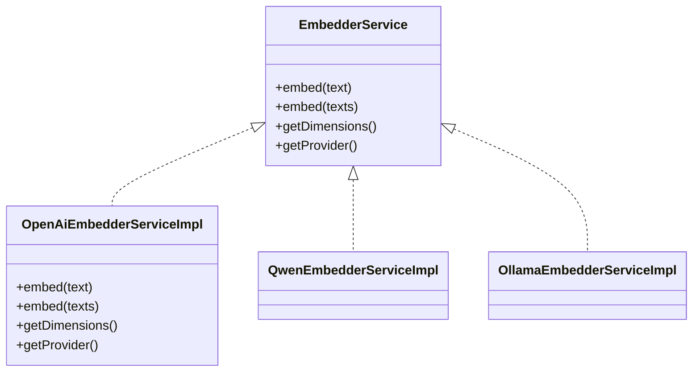
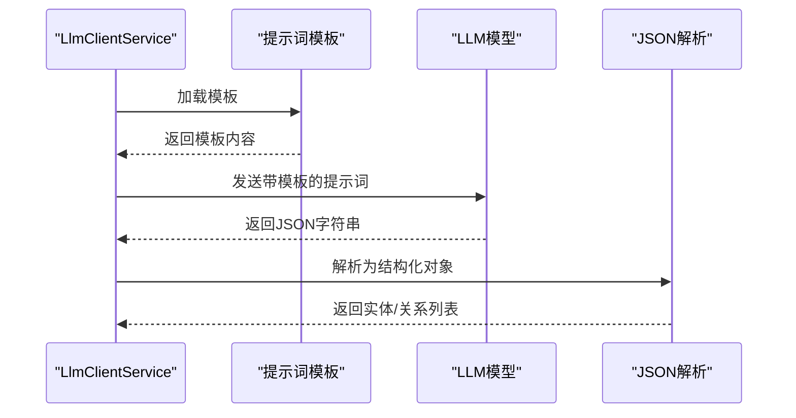
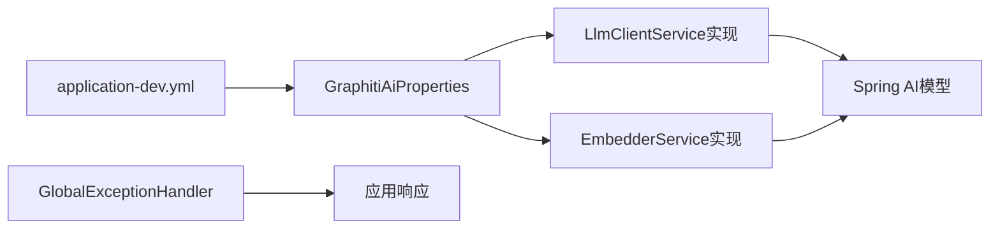

# AI服务问题

<cite>
**本文引用的文件**
- [GraphitiAiProperties.java](file://graphiti-module-core/src/main/java/com/graphiti/module/graphiti/config/GraphitiAiProperties.java)
- [LlmClientService.java](file://graphiti-module-core/src/main/java/com/graphiti/module/graphiti/service/LlmClientService.java)
- [EmbedderService.java](file://graphiti-module-core/src/main/java/com/graphiti/module/graphiti/service/EmbedderService.java)
- [OpenAiLlmClientServiceImpl.java](file://graphiti-module-core/src/main/java/com/graphiti/module/graphiti/service/impl/ai/OpenAiLlmClientServiceImpl.java)
- [QwenLlmClientServiceImpl.java](file://graphiti-module-core/src/main/java/com/graphiti/module/graphiti/service/impl/ai/QwenLlmClientServiceImpl.java)
- [AnthropicLlmClientServiceImpl.java](file://graphiti-module-core/src/main/java/com/graphiti/module/graphiti/service/impl/ai/AnthropicLlmClientServiceImpl.java)
- [OllamaLlmClientServiceImpl.java](file://graphiti-module-core/src/main/java/com/graphiti/module/graphiti/service/impl/ai/OllamaLlmClientServiceImpl.java)
- [OpenAiEmbedderServiceImpl.java](file://graphiti-module-core/src/main/java/com/graphiti/module/graphiti/service/impl/ai/OpenAiEmbedderServiceImpl.java)
- [QwenEmbedderServiceImpl.java](file://graphiti-module-core/src/main/java/com/graphiti/module/graphiti/service/impl/ai/QwenEmbedderServiceImpl.java)
- [OllamaEmbedderServiceImpl.java](file://graphiti-module-core/src/main/java/com/graphiti/module/graphiti/service/impl/ai/OllamaEmbedderServiceImpl.java)
- [application-dev.yml](file://graphiti-server/src/main/resources/application-dev.yml)
- [application.yml](file://graphiti-server/src/main/resources/application.yml)
- [GlobalExceptionHandler.java](file://graphiti-framework/graphiti-common/src/main/java/com/graphiti/common/exception/GlobalExceptionHandler.java)
- [BusinessException.java](file://graphiti-framework/graphiti-common/src/main/java/com/graphiti/common/exception/BusinessException.java)
</cite>

## 目录
1. [简介](#简介)
2. [项目结构](#项目结构)
3. [核心组件](#核心组件)
4. [架构总览](#架构总览)
5. [详细组件分析](#详细组件分析)
6. [依赖分析](#依赖分析)
7. [性能考虑](#性能考虑)
8. [故障排查指南](#故障排查指南)
9. [结论](#结论)
10. [附录](#附录)

## 简介
本文件面向Graphiti-Java的AI服务运维与开发人员，聚焦于LLM与向量嵌入服务的故障排查与优化。内容覆盖OpenAI、Anthropic、Qwen、Ollama等主流提供商的常见问题与解决方案；解释API密钥配置、网络超时、请求频率限制、响应格式异常的处理；提供向量嵌入维度不匹配、数值溢出、索引重建的诊断技巧；说明提示词模板错误、LLM调用失败与结果质量差的排查步骤；给出降级策略与容错配置思路；并提供API调用监控与错误统计的分析方法，以及各提供商特点与选型建议。

## 项目结构
Graphiti-Java在模块化设计上采用“接口+多实现”的策略，将LLM与Embedding抽象为统一接口，通过配置切换不同AI提供商。核心配置位于应用配置文件，AI提供商选择与模型参数由配置驱动。

**图表来源**
- [GraphitiAiProperties.java:1-135](file://graphiti-module-core/src/main/java/com/graphiti/module/graphiti/config/GraphitiAiProperties.java#L1-L135)
- [application-dev.yml:508-593](file://graphiti-server/src/main/resources/application-dev.yml#L508-L593)
- [application.yml:31-34](file://graphiti-server/src/main/resources/application.yml#L31-L34)
- [LlmClientService.java:17-70](file://graphiti-module-core/src/main/java/com/graphiti/module/graphiti/service/LlmClientService.java#L17-L70)
- [EmbedderService.java:9-40](file://graphiti-module-core/src/main/java/com/graphiti/module/graphiti/service/EmbedderService.java#L9-L40)
- [OpenAiLlmClientServiceImpl.java:36](file://graphiti-module-core/src/main/java/com/graphiti/module/graphiti/service/impl/ai/OpenAiLlmClientServiceImpl.java#L36)
- [QwenLlmClientServiceImpl.java:23](file://graphiti-module-core/src/main/java/com/graphiti/module/graphiti/service/impl/ai/QwenLlmClientServiceImpl.java#L23)
- [AnthropicLlmClientServiceImpl.java:36](file://graphiti-module-core/src/main/java/com/graphiti/module/graphiti/service/impl/ai/AnthropicLlmClientServiceImpl.java#L36)
- [OllamaLlmClientServiceImpl.java:22](file://graphiti-module-core/src/main/java/com/graphiti/module/graphiti/service/impl/ai/OllamaLlmClientServiceImpl.java#L22)
- [OpenAiEmbedderServiceImpl.java:24](file://graphiti-module-core/src/main/java/com/graphiti/module/graphiti/service/impl/ai/OpenAiEmbedderServiceImpl.java#L24)
- [QwenEmbedderServiceImpl.java:24](file://graphiti-module-core/src/main/java/com/graphiti/module/graphiti/service/impl/ai/QwenEmbedderServiceImpl.java#L24)
- [OllamaEmbedderServiceImpl.java:24](file://graphiti-module-core/src/main/java/com/graphiti/module/graphiti/service/impl/ai/OllamaEmbedderServiceImpl.java#L24)

**章节来源**
- [application-dev.yml:508-593](file://graphiti-server/src/main/resources/application-dev.yml#L508-L593)
- [application.yml:31-34](file://graphiti-server/src/main/resources/application.yml#L31-L34)
- [GraphitiAiProperties.java:18-31](file://graphiti-module-core/src/main/java/com/graphiti/module/graphiti/config/GraphitiAiProperties.java#L18-L31)

## 核心组件
- GraphitiAiProperties：集中管理各AI提供商的模型与参数，默认启用OpenAI作为LLM与Embedding提供商，并支持通过配置切换。
- LlmClientService：统一的LLM调用接口，支持普通对话、带系统提示词对话、结构化输出与批量调用，并内置摘要与抽取能力。
- EmbedderService：统一的文本嵌入接口，支持单条与批量嵌入，返回向量维度与提供商标识。
- OpenAI/Qwen/Anthropic/Ollama实现：分别封装Spring AI的ChatModel与EmbeddingModel，按条件装配，避免不必要的依赖加载。
- 全局异常处理：统一捕获业务异常与参数异常，保证对外响应一致性。

**章节来源**
- [GraphitiAiProperties.java:18-31](file://graphiti-module-core/src/main/java/com/graphiti/module/graphiti/config/GraphitiAiProperties.java#L18-L31)
- [LlmClientService.java:17-70](file://graphiti-module-core/src/main/java/com/graphiti/module/graphiti/service/LlmClientService.java#L17-L70)
- [EmbedderService.java:9-40](file://graphiti-module-core/src/main/java/com/graphiti/module/graphiti/service/EmbedderService.java#L9-L40)
- [OpenAiLlmClientServiceImpl.java:36](file://graphiti-module-core/src/main/java/com/graphiti/module/graphiti/service/impl/ai/OpenAiLlmClientServiceImpl.java#L36)
- [QwenLlmClientServiceImpl.java:23](file://graphiti-module-core/src/main/java/com/graphiti/module/graphiti/service/impl/ai/QwenLlmClientServiceImpl.java#L23)
- [AnthropicLlmClientServiceImpl.java:36](file://graphiti-module-core/src/main/java/com/graphiti/module/graphiti/service/impl/ai/AnthropicLlmClientServiceImpl.java#L36)
- [OllamaLlmClientServiceImpl.java:22](file://graphiti-module-core/src/main/java/com/graphiti/module/graphiti/service/impl/ai/OllamaLlmClientServiceImpl.java#L22)
- [OpenAiEmbedderServiceImpl.java:24](file://graphiti-module-core/src/main/java/com/graphiti/module/graphiti/service/impl/ai/OpenAiEmbedderServiceImpl.java#L24)
- [QwenEmbedderServiceImpl.java:24](file://graphiti-module-core/src/main/java/com/graphiti/module/graphiti/service/impl/ai/QwenEmbedderServiceImpl.java#L24)
- [OllamaEmbedderServiceImpl.java:24](file://graphiti-module-core/src/main/java/com/graphiti/module/graphiti/service/impl/ai/OllamaEmbedderServiceImpl.java#L24)
- [GlobalExceptionHandler.java:26-72](file://graphiti-framework/graphiti-common/src/main/java/com/graphiti/common/exception/GlobalExceptionHandler.java#L26-L72)

## 架构总览
下图展示从配置到具体AI提供商实现的调用链路，以及异常处理与监控入口。

**图表来源**
- [GraphitiAiProperties.java:18-31](file://graphiti-module-core/src/main/java/com/graphiti/module/graphiti/config/GraphitiAiProperties.java#L18-L31)
- [application-dev.yml:508-593](file://graphiti-server/src/main/resources/application-dev.yml#L508-L593)
- [LlmClientService.java:17-70](file://graphiti-module-core/src/main/java/com/graphiti/module/graphiti/service/LlmClientService.java#L17-L70)
- [EmbedderService.java:9-40](file://graphiti-module-core/src/main/java/com/graphiti/module/graphiti/service/EmbedderService.java#L9-L40)
- [OpenAiLlmClientServiceImpl.java:42-53](file://graphiti-module-core/src/main/java/com/graphiti/module/graphiti/service/impl/ai/OpenAiLlmClientServiceImpl.java#L42-L53)
- [OpenAiEmbedderServiceImpl.java:34-42](file://graphiti-module-core/src/main/java/com/graphiti/module/graphiti/service/impl/ai/OpenAiEmbedderServiceImpl.java#L34-L42)
- [GlobalExceptionHandler.java:26-72](file://graphiti-framework/graphiti-common/src/main/java/com/graphiti/common/exception/GlobalExceptionHandler.java#L26-L72)

## 详细组件分析

### LLM客户端接口与实现
- 接口能力：支持单轮对话、系统提示词对话、结构化输出解析、批量调用；并提供摘要与抽取的默认实现。
- OpenAI/Qwen/Anthropic/Ollama实现均基于Spring AI模型，通过条件装配按配置启用；出现异常时记录日志并抛出运行时异常，便于上层统一处理。
- 提示词模板：接口内默认加载classpath下的提示词模板，若模板缺失会抛出运行时异常，便于快速定位。

**图表来源**
- [LlmClientService.java:17-158](file://graphiti-module-core/src/main/java/com/graphiti/module/graphiti/service/LlmClientService.java#L17-L158)
- [OpenAiLlmClientServiceImpl.java:36](file://graphiti-module-core/src/main/java/com/graphiti/module/graphiti/service/impl/ai/OpenAiLlmClientServiceImpl.java#L36)
- [QwenLlmClientServiceImpl.java:23](file://graphiti-module-core/src/main/java/com/graphiti/module/graphiti/service/impl/ai/QwenLlmClientServiceImpl.java#L23)
- [AnthropicLlmClientServiceImpl.java:36](file://graphiti-module-core/src/main/java/com/graphiti/module/graphiti/service/impl/ai/AnthropicLlmClientServiceImpl.java#L36)
- [OllamaLlmClientServiceImpl.java:22](file://graphiti-module-core/src/main/java/com/graphiti/module/graphiti/service/impl/ai/OllamaLlmClientServiceImpl.java#L22)

**章节来源**
- [LlmClientService.java:17-158](file://graphiti-module-core/src/main/java/com/graphiti/module/graphiti/service/LlmClientService.java#L17-L158)
- [OpenAiLlmClientServiceImpl.java:42-96](file://graphiti-module-core/src/main/java/com/graphiti/module/graphiti/service/impl/ai/OpenAiLlmClientServiceImpl.java#L42-L96)
- [QwenLlmClientServiceImpl.java:29-83](file://graphiti-module-core/src/main/java/com/graphiti/module/graphiti/service/impl/ai/QwenLlmClientServiceImpl.java#L29-L83)
- [AnthropicLlmClientServiceImpl.java:43-97](file://graphiti-module-core/src/main/java/com/graphiti/module/graphiti/service/impl/ai/AnthropicLlmClientServiceImpl.java#L43-L97)
- [OllamaLlmClientServiceImpl.java:29-83](file://graphiti-module-core/src/main/java/com/graphiti/module/graphiti/service/impl/ai/OllamaLlmClientServiceImpl.java#L29-L83)

### 向量嵌入服务接口与实现
- 接口能力：单条与批量嵌入、维度查询、提供商标识。
- OpenAI/Qwen/Ollama实现均基于Spring AI EmbeddingModel；OpenAI实现对空结果与空输入做了显式校验与错误提示，有助于快速定位模型加载与类型错误。
- Ollama实现对空结果进行显式校验，避免静默失败。

**图表来源**
- [EmbedderService.java:9-40](file://graphiti-module-core/src/main/java/com/graphiti/module/graphiti/service/EmbedderService.java#L9-L40)
- [OpenAiEmbedderServiceImpl.java:24-106](file://graphiti-module-core/src/main/java/com/graphiti/module/graphiti/service/impl/ai/OpenAiEmbedderServiceImpl.java#L24-L106)
- [QwenEmbedderServiceImpl.java:24-66](file://graphiti-module-core/src/main/java/com/graphiti/module/graphiti/service/impl/ai/QwenEmbedderServiceImpl.java#L24-L66)
- [OllamaEmbedderServiceImpl.java:24-78](file://graphiti-module-core/src/main/java/com/graphiti/module/graphiti/service/impl/ai/OllamaEmbedderServiceImpl.java#L24-L78)

**章节来源**
- [OpenAiEmbedderServiceImpl.java:29-60](file://graphiti-module-core/src/main/java/com/graphiti/module/graphiti/service/impl/ai/OpenAiEmbedderServiceImpl.java#L29-L60)
- [OpenAiEmbedderServiceImpl.java:63-95](file://graphiti-module-core/src/main/java/com/graphiti/module/graphiti/service/impl/ai/OpenAiEmbedderServiceImpl.java#L63-L95)
- [OllamaEmbedderServiceImpl.java:29-45](file://graphiti-module-core/src/main/java/com/graphiti/module/graphiti/service/impl/ai/OllamaEmbedderServiceImpl.java#L29-L45)
- [OllamaEmbedderServiceImpl.java:48-66](file://graphiti-module-core/src/main/java/com/graphiti/module/graphiti/service/impl/ai/OllamaEmbedderServiceImpl.java#L48-L66)

### 提示词模板与抽取流程
- LlmClientService默认从classpath加载提示词模板，若模板不存在会抛出运行时异常，便于快速发现模板缺失问题。
- 实体与关系抽取默认通过结构化输出解析，解析失败会回退为空列表，避免中断主流程。

**图表来源**
- [LlmClientService.java:110-142](file://graphiti-module-core/src/main/java/com/graphiti/module/graphiti/service/LlmClientService.java#L110-L142)

**章节来源**
- [LlmClientService.java:147-156](file://graphiti-module-core/src/main/java/com/graphiti/module/graphiti/service/LlmClientService.java#L147-L156)
- [LlmClientService.java:110-142](file://graphiti-module-core/src/main/java/com/graphiti/module/graphiti/service/LlmClientService.java#L110-L142)

## 依赖分析
- 配置驱动：GraphitiAiProperties与application-dev.yml共同决定当前使用的LLM与Embedding提供商及模型参数。
- 条件装配：各实现通过@ConditionalOnProperty按配置启用，避免未使用提供商的依赖与初始化开销。
- 异常处理：全局异常处理器统一拦截业务异常与参数异常，保证对外响应一致。

**图表来源**
- [application-dev.yml:508-593](file://graphiti-server/src/main/resources/application-dev.yml#L508-L593)
- [GraphitiAiProperties.java:18-31](file://graphiti-module-core/src/main/java/com/graphiti/module/graphiti/config/GraphitiAiProperties.java#L18-L31)
- [GlobalExceptionHandler.java:26-72](file://graphiti-framework/graphiti-common/src/main/java/com/graphiti/common/exception/GlobalExceptionHandler.java#L26-L72)

**章节来源**
- [application-dev.yml:508-593](file://graphiti-server/src/main/resources/application-dev.yml#L508-L593)
- [GraphitiAiProperties.java:18-31](file://graphiti-module-core/src/main/java/com/graphiti/module/graphiti/config/GraphitiAiProperties.java#L18-L31)
- [GlobalExceptionHandler.java:26-72](file://graphiti-framework/graphiti-common/src/main/java/com/graphiti/common/exception/GlobalExceptionHandler.java#L26-L72)

## 性能考虑
- 批量调用：LlmClientService提供批量接口，可减少网络往返；EmbedderService同样支持批量嵌入，提升吞吐。
- 模型参数：通过配置调整temperature与max-tokens，平衡质量与延迟；注意不同提供商对参数的支持差异。
- 本地化部署：LM Studio、Ollama等可通过本地部署降低网络延迟与带宽消耗，但需确保模型已正确加载与可用。

[本节为通用指导，无需列出具体文件来源]

## 故障排查指南

### API密钥配置错误
- 症状：调用LLM或Embedding时出现鉴权失败或被拒绝。
- 排查要点：
  - 确认application-dev.yml中的api-key是否正确设置。
  - 若使用OpenAI兼容模式（如LM Studio、LocalAI），确认base-url与模型名称一致。
  - 检查GraphitiAiProperties中provider的model与embedding-model是否与实际部署匹配。
- 降级建议：临时切换至本地Ollama或LM Studio进行功能验证，排除云端配置问题。

**章节来源**
- [application-dev.yml:467-486](file://graphiti-server/src/main/resources/application-dev.yml#L467-L486)
- [application-dev.yml:519-593](file://graphiti-server/src/main/resources/application-dev.yml#L519-L593)
- [GraphitiAiProperties.java:101-133](file://graphiti-module-core/src/main/java/com/graphiti/module/graphiti/config/GraphitiAiProperties.java#L101-L133)

### 网络连接超时
- 症状：调用LLM或Embedding时出现超时或连接失败。
- 排查要点：
  - 检查base-url连通性与端口开放情况。
  - 本地部署场景（LM Studio、Ollama）确认服务已启动且端口正确。
  - 在application-dev.yml中适当增大连接超时与重试策略（如通过Spring AI相关配置项）。
- 降级建议：优先使用本地Ollama或LM Studio；若必须使用云端，启用重试与熔断策略。

**章节来源**
- [application-dev.yml:59-69](file://graphiti-server/src/main/resources/application-dev.yml#L59-L69)
- [application-dev.yml:217-228](file://graphiti-server/src/main/resources/application-dev.yml#L217-L228)

### 请求频率限制与配额不足
- 症状：调用频繁时报错或被限流。
- 排查要点：
  - 检查提供商控制台配额与使用情况。
  - 评估是否需要升级套餐或开启白名单。
  - 在应用侧增加指数退避与队列限速。
- 降级建议：优先使用本地模型；或在高峰期切换至低负载提供商。

[本节为通用指导，无需列出具体文件来源]

### 响应格式异常
- 症状：结构化输出解析失败或返回非预期JSON。
- 排查要点：
  - 确认提示词模板完整且包含期望字段。
  - 检查LLM输出是否被截断或包含非JSON内容。
  - 在LlmClientService中对解析失败进行降级处理（返回空列表）。
- 降级建议：回退到非结构化输出或简化模板字段。

**章节来源**
- [LlmClientService.java:110-142](file://graphiti-module-core/src/main/java/com/graphiti/module/graphiti/service/LlmClientService.java#L110-L142)

### 向量嵌入维度不匹配
- 症状：Neo4j向量索引创建失败或相似度计算异常。
- 排查要点：
  - 确认EmbedderService返回的维度与索引创建时指定维度一致。
  - OpenAI嵌入通常为1536维；Ollama嵌入为768维；Qwen嵌入维度以提供商配置为准。
  - 检查application-dev.yml中embedding-model是否与索引维度匹配。
- 降级建议：统一使用单一提供商的嵌入模型，避免跨维度混合。

**章节来源**
- [OpenAiEmbedderServiceImpl.java:98-100](file://graphiti-module-core/src/main/java/com/graphiti/module/graphiti/service/impl/ai/OpenAiEmbedderServiceImpl.java#L98-L100)
- [OllamaEmbedderServiceImpl.java:69-71](file://graphiti-module-core/src/main/java/com/graphiti/module/graphiti/service/impl/ai/OllamaEmbedderServiceImpl.java#L69-L71)
- [application-dev.yml:525-530](file://graphiti-server/src/main/resources/application-dev.yml#L525-L530)

### 数值溢出与NaN
- 症状：嵌入向量包含NaN或无穷大，导致索引异常。
- 排查要点：
  - 检查输入文本是否为空或过长；必要时进行截断或清洗。
  - 确认模型输出非空且为有效浮点数。
  - 在OpenAI实现中，若返回空数据会抛出明确异常，便于定位模型类型错误（如误用reranker而非embedding模型）。
- 降级建议：对输入进行预处理与长度限制；更换更稳定的embedding模型。

**章节来源**
- [OpenAiEmbedderServiceImpl.java:34-42](file://graphiti-module-core/src/main/java/com/graphiti/module/graphiti/service/impl/ai/OpenAiEmbedderServiceImpl.java#L34-L42)
- [OpenAiEmbedderServiceImpl.java:68-75](file://graphiti-module-core/src/main/java/com/graphiti/module/graphiti/service/impl/ai/OpenAiEmbedderServiceImpl.java#L68-L75)

### 索引重建问题
- 症状：向量索引无法写入或查询异常。
- 排查要点：
  - 确认向量维度与索引定义一致。
  - 检查Neo4j向量索引初始化脚本与版本兼容性。
  - 重建索引前清理历史数据，避免冲突。
- 降级建议：在维护窗口执行重建；或临时关闭向量化查询以恢复服务。

[本节为通用指导，无需列出具体文件来源]

### 提示词模板错误
- 症状：实体/关系抽取失败或结果为空。
- 排查要点：
  - 确认提示词模板存在于classpath且可读。
  - 检查模板变量替换是否正确。
  - 若解析失败，接口会回退为空列表，需检查模板与LLM输出一致性。
- 降级建议：使用简化的模板先行验证；逐步增加复杂度。

**章节来源**
- [LlmClientService.java:147-156](file://graphiti-module-core/src/main/java/com/graphiti/module/graphiti/service/LlmClientService.java#L147-L156)
- [LlmClientService.java:110-142](file://graphiti-module-core/src/main/java/com/graphiti/module/graphiti/service/LlmClientService.java#L110-L142)

### LLM调用失败
- 症状：聊天接口抛出异常或返回空内容。
- 排查要点：
  - 检查provider配置与模型名称是否正确。
  - 查看实现类的日志输出，定位异常根因。
  - 对批量调用逐条重试或分批处理。
- 降级建议：切换至本地Ollama或LM Studio；或启用备用提供商。

**章节来源**
- [OpenAiLlmClientServiceImpl.java:42-53](file://graphiti-module-core/src/main/java/com/graphiti/module/graphiti/service/impl/ai/OpenAiLlmClientServiceImpl.java#L42-L53)
- [QwenLlmClientServiceImpl.java:29-39](file://graphiti-module-core/src/main/java/com/graphiti/module/graphiti/service/impl/ai/QwenLlmClientServiceImpl.java#L29-L39)
- [AnthropicLlmClientServiceImpl.java:43-53](file://graphiti-module-core/src/main/java/com/graphiti/module/graphiti/service/impl/ai/AnthropicLlmClientServiceImpl.java#L43-L53)
- [OllamaLlmClientServiceImpl.java:29-39](file://graphiti-module-core/src/main/java/com/graphiti/module/graphiti/service/impl/ai/OllamaLlmClientServiceImpl.java#L29-L39)

### 结果质量差
- 症状：摘要、实体/关系抽取质量不佳。
- 排查要点：
  - 调整temperature与max-tokens参数，平衡创造性与稳定性。
  - 优化提示词模板与上下文长度。
  - 对抽取任务增加后处理校验与去重。
- 降级建议：使用更稳定的模型或切换至本地模型。

[本节为通用指导，无需列出具体文件来源]

### AI服务降级策略与容错机制
- 降级策略：
  - 优先使用本地Ollama/LM Studio，云端作为备选。
  - 对高频调用增加本地缓存与批量处理。
  - 对关键路径启用快速失败与熔断。
- 容错机制：
  - 全局异常处理器统一捕获业务异常与参数异常，返回标准化错误。
  - LlmClientService与EmbedderService对空结果与解析失败进行显式处理与降级。

**章节来源**
- [GlobalExceptionHandler.java:26-72](file://graphiti-framework/graphiti-common/src/main/java/com/graphiti/common/exception/GlobalExceptionHandler.java#L26-L72)
- [OpenAiEmbedderServiceImpl.java:34-42](file://graphiti-module-core/src/main/java/com/graphiti/module/graphiti/service/impl/ai/OpenAiEmbedderServiceImpl.java#L34-L42)
- [LlmClientService.java:110-142](file://graphiti-module-core/src/main/java/com/graphiti/module/graphiti/service/LlmClientService.java#L110-L142)

### API调用监控与错误统计
- 监控建议：
  - 利用Actuator暴露health、metrics端点，结合Prometheus/Grafana进行可视化。
  - 记录调用耗时、成功率、错误码分布与Top异常原因。
  - 对关键指标设置告警阈值。
- 错误统计：
  - 统计不同提供商的错误类型与占比，识别热点问题。
  - 分析提示词模板与模型参数对错误率的影响。

**章节来源**
- [application.yml:44-56](file://graphiti-server/src/main/resources/application.yml#L44-L56)

## 结论
Graphiti-Java通过统一接口与配置驱动实现了对多家AI提供商的灵活切换。排查时应优先从配置与网络入手，结合实现类的日志与异常处理进行定位；对嵌入服务重点核对维度与模型类型；对提示词与结构化输出进行模板与解析层面的验证。通过本地化部署与降级策略，可在保障服务连续性的同时提升整体稳定性。

[本节为总结性内容，无需列出具体文件来源]

## 附录

### 各提供商特点与选择建议
- OpenAI：生态完善，模型丰富，适合高质量与多模态场景；需关注成本与配额。
- Qwen：阿里云生态集成良好，兼容OpenAI API，适合国内合规与成本敏感场景。
- Anthropic：推理能力强，但不直接提供Embedding/Rerank，需搭配其他服务。
- Ollama：本地化部署友好，适合隐私与低延迟场景；需自行管理模型与资源。
- 其他：Mistral、DeepSeek、Groq、Fireworks、Nebius、Hyperbolic、Together、SiliconFlow等各有侧重，建议按预算、延迟与合规要求选择。

**章节来源**
- [application-dev.yml:13-18](file://graphiti-server/src/main/resources/application-dev.yml#L13-L18)
- [application-dev.yml:71-87](file://graphiti-server/src/main/resources/application-dev.yml#L71-L87)
- [application-dev.yml:89-103](file://graphiti-server/src/main/resources/application-dev.yml#L89-L103)
- [application-dev.yml:531-535](file://graphiti-server/src/main/resources/application-dev.yml#L531-L535)