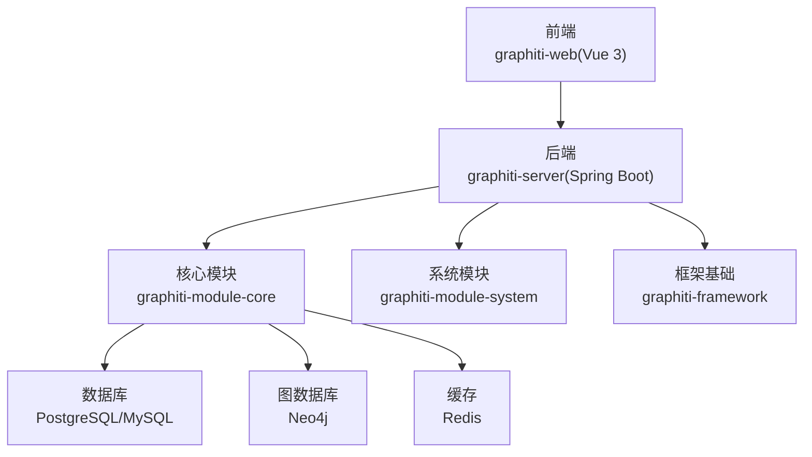
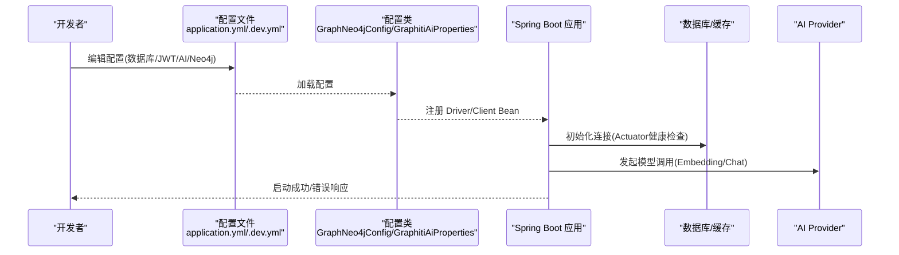
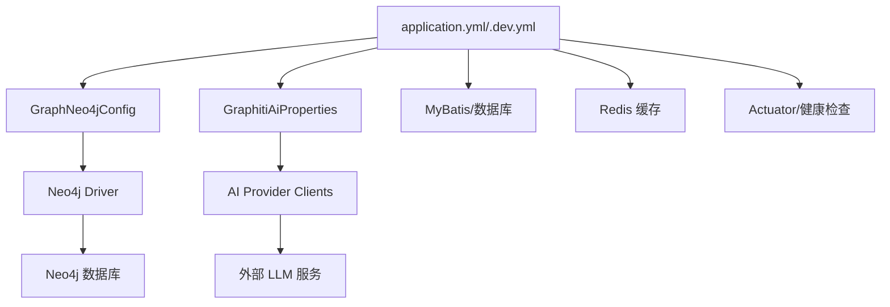

# 常见问题

<!--<cite>
**本文引用的文件**
- [README.md](file://README.md)
- [README_CN.md](file://README_CN.md)
- [application.yml](file://graphiti-server/src/main/resources/application.yml)
- [application-dev.yml](file://graphiti-server/src/main/resources/application-dev.yml)
- [GraphNeo4jConfig.java](file://graphiti-module-core/src/main/java/com/neo4j/driver/GraphNeo4jConfig.java)
- [GraphitiAiProperties.java](file://graphiti-module-core/src/main/java/com/graphiti/module/graphiti/config/GraphitiAiProperties.java)
- [GlobalExceptionHandler.java](file://graphiti-framework/graphiti-common/src/main/java/com/graphiti/common/exception/GlobalExceptionHandler.java)
- [BusinessException.java](file://graphiti-framework/graphiti-common/src/main/java/com/graphiti/common/exception/BusinessException.java)
- [CommonResult.java](file://graphiti-framework/graphiti-common/src/main/java/com/graphiti/common/response/CommonResult.java)
- [GraphitiServiceImpl.java](file://graphiti-module-core/src/main/java/com/graphiti/module/graphiti/service/impl/GraphitiServiceImpl.java)
- [DataImportServiceImpl.java](file://graphiti-module-core/src/main/java/com/graphiti/module/graphiti/service/impl/DataImportServiceImpl.java)
- [SearchServiceImpl.java](file://graphiti-module-core/src/main/java/com/graphiti/module/graphiti/service/impl/SearchServiceImpl.java)
- [OntologyValidationException.java](file://graphiti-module-core/src/main/java/com/graphiti/module/graphiti/exception/OntologyValidationException.java)
- [schema.sql](file://sql/postgresql/schema.sql)
- [init.cypher](file://sql/neo4j/init.cypher)
</cite>-->

## 目录
1. [简介](#简介)
2. [项目结构](#项目结构)
3. [核心组件](#核心组件)
4. [架构总览](#架构总览)
5. [详细组件分析](#详细组件分析)
6. [依赖分析](#依赖分析)
7. [性能考虑](#性能考虑)
8. [故障排查指南](#故障排查指南)
9. [结论](#结论)
10. [附录](#附录)

## 简介
本文件面向新用户与初级开发者，汇总并解答 Graphiti-Java 在安装、配置与使用过程中最常遇到的问题，覆盖启动失败、数据库连接异常、Neo4j 连接问题、AI 服务调用失败、权限配置错误等主题。每个问题均提供清晰的问题描述、可能原因分析、详细解决步骤、错误信息解读、日志分析方法与快速修复技巧，并附带“问题自检清单”与“预防措施”，帮助您快速定位与规避常见陷阱。

## 项目结构
Graphiti-Java 采用前后端分离与多模块架构：前端 Vue 3 应用位于 graphiti-web，后端 Spring Boot 应用位于 graphiti-server，核心业务逻辑在 graphiti-module-core，系统管理在 graphiti-module-system，框架基础设施在 graphiti-framework。数据库方面，PostgreSQL/MySQL 存放元数据与系统数据，Neo4j 存放知识图谱，Redis 作为缓存与会话存储。

图表来源
- [README.md](file://README.md)
- [README_CN.md](file://README_CN.md)

章节来源
- [README.md](file://README.md)
- [README_CN.md](file://README_CN.md)

## 核心组件
- 配置与启动
  - 后端配置文件 application.yml 与 application-dev.yml，负责数据库、AI Provider、JWT、Actuator、日志等全局配置。
  - Neo4j 连接配置通过 GraphNeo4jConfig 读取 neo4j.* 配置项并创建 Driver Bean。
  - AI Provider 配置通过 GraphitiAiProperties 读取 graphiti.ai.* 与 spring.ai.* 对应项，统一管理各厂商模型与参数。
- 异常与响应
  - GlobalExceptionHandler 统一捕获业务异常、参数校验异常与缺失参数异常，返回 CommonResult 标准响应。
  - BusinessException 业务异常基类，便于在服务层抛出明确错误码与消息。
- 业务服务
  - GraphitiServiceImpl：图谱生命周期管理、统计与克隆导出。
  - DataImportServiceImpl：LLM 实体/关系抽取、嵌入生成、节点/关系创建、时序失效与本体校验。
  - SearchServiceImpl：混合检索（BM25、向量、BFS、RRF、MMR）与记忆检索。

章节来源
- [application.yml](file://graphiti-server/src/main/resources/application.yml)
- [application-dev.yml](file://graphiti-server/src/main/resources/application-dev.yml)
- [GraphNeo4jConfig.java](file://graphiti-module-core/src/main/java/com/neo4j/driver/GraphNeo4jConfig.java)
- [GraphitiAiProperties.java](file://graphiti-module-core/src/main/java/com/graphiti/module/graphiti/config/GraphitiAiProperties.java)
- [GlobalExceptionHandler.java](file://graphiti-framework/graphiti-common/src/main/java/com/graphiti/common/exception/GlobalExceptionHandler.java)
- [BusinessException.java](file://graphiti-framework/graphiti-common/src/main/java/com/graphiti/common/exception/BusinessException.java)
- [CommonResult.java](file://graphiti-framework/graphiti-common/src/main/java/com/graphiti/common/response/CommonResult.java)
- [GraphitiServiceImpl.java](file://graphiti-module-core/src/main/java/com/graphiti/module/graphiti/service/impl/GraphitiServiceImpl.java)
- [DataImportServiceImpl.java](file://graphiti-module-core/src/main/java/com/graphiti/module/graphiti/service/impl/DataImportServiceImpl.java)
- [SearchServiceImpl.java](file://graphiti-module-core/src/main/java/com/graphiti/module/graphiti/service/impl/SearchServiceImpl.java)

## 架构总览
后端启动流程概览如下：

图表来源
- [application.yml](file://graphiti-server/src/main/resources/application.yml)
- [application-dev.yml](file://graphiti-server/src/main/resources/application-dev.yml)
- [GraphNeo4jConfig.java](file://graphiti-module-core/src/main/java/com/neo4j/driver/GraphNeo4jConfig.java)
- [GraphitiAiProperties.java](file://graphiti-module-core/src/main/java/com/graphiti/module/graphiti/config/GraphitiAiProperties.java)

## 详细组件分析

### 启动失败
- 现象
  - 后端启动报错，无法访问 Swagger 或接口 500。
- 可能原因
  - 配置文件未正确加载或字段缺失（如数据库、Neo4j、AI Provider）。
  - Actuator 健康检查失败（数据库/Redis/Neo4j 未就绪）。
  - 日志级别过低，未显示具体异常堆栈。
- 解决步骤
  - 检查 application-dev.yml 是否存在并填写完整（数据库、Neo4j、AI Provider、Redis）。
  - 在 application.yml 中确认 Actuator 暴露端点与健康检查开启。
  - 将日志级别提升至 DEBUG，观察启动阶段异常。
  - 使用 Actuator 健康检查端点确认依赖服务状态。
- 快速修复
  - 临时将 graphiti.ai.llm-provider 与 embedding-provider 设为受支持的厂商之一。
  - 确认 Neo4j 与数据库端口可达，必要时调整 application-dev.yml 中的连接串。
- 日志分析
  - 关注启动阶段的 Bean 注册与连接池初始化日志。
  - 若出现“找不到配置类”或“构造函数注入失败”，检查配置前缀与字段命名是否一致。
- 预防措施
  - 使用 application-dev.yml 的模板注释逐项核对。
  - 在 CI/CD 中加入启动前健康检查脚本。

章节来源
- [application.yml](file://graphiti-server/src/main/resources/application.yml)
- [application-dev.yml](file://graphiti-server/src/main/resources/application-dev.yml)

### 数据库连接异常（PostgreSQL/MySQL）
- 现象
  - 启动时报数据库连接失败、SQL 初始化脚本未执行、MyBatis 映射异常。
- 可能原因
  - JDBC URL、用户名、密码错误或字符集与时区配置不当。
  - 数据库未初始化或初始化脚本执行失败。
  - 连接池超时或最大连接数不足。
- 解决步骤
  - 核对 application-dev.yml 中 datasource 配置，确保 URL、用户名、密码正确。
  - 手动执行 schema.sql 与 init-data.sql（PostgreSQL）或对应 MySQL 脚本。
  - 检查数据库版本与驱动兼容性（PostgreSQL 15+，MySQL 8.0+）。
  - 调整 Hikari 连接池参数（最大连接数、最小空闲、连接超时）。
- 快速修复
  - 临时将数据库连接改为本地回环地址与默认端口，确认连通性。
  - 使用数据库客户端先行验证连接。
- 日志分析
  - 关注连接池初始化与 SQL 执行异常。
  - 若出现“找不到驱动类”，检查驱动依赖与驱动类名配置。
- 预防措施
  - 在本地与 CI 环境分别准备独立的初始化脚本。
  - 使用 Docker Compose 启动数据库与 Redis，确保网络互通。

章节来源
- [application-dev.yml](file://graphiti-server/src/main/resources/application-dev.yml)
- [schema.sql](file://sql/postgresql/schema.sql)

### Neo4j 连接问题
- 现象
  - 启动后图数据库连接失败、向量索引创建失败、查询报错。
- 可能原因
  - Neo4j URI、用户名、密码错误或未启用 Bolt 端口。
  - 未执行初始化脚本导致唯一性约束与索引缺失。
  - 向量索引未按要求创建（维度与相似度函数）。
- 解决步骤
  - 核对 application-dev.yml 中 neo4j.uri、username、password。
  - 执行 Neo4j 初始化脚本（init.cypher），创建唯一性约束与全文索引。
  - 确认 Neo4j 版本与向量索引语法兼容（Neo4j 5.x）。
  - 如使用容器，确保端口映射与网络策略允许访问。
- 快速修复
  - 临时将 Neo4j 地址指向本地回环，确认端口可达。
  - 在 Neo4j Browser 中手动执行 init.cypher 验证。
- 日志分析
  - 关注 Driver 初始化与会话创建异常。
  - 若出现“索引不存在”或“约束冲突”，检查初始化脚本执行情况。
- 预防措施
  - 在启动脚本中增加 Neo4j 健康检查与初始化步骤。
  - 将 init.cypher 作为数据库迁移的一部分纳入版本控制。

章节来源
- [application-dev.yml](file://graphiti-server/src/main/resources/application-dev.yml)
- [init.cypher](file://sql/neo4j/init.cypher)
- [GraphNeo4jConfig.java](file://graphiti-module-core/src/main/java/com/neo4j/driver/GraphNeo4jConfig.java)

### AI 服务调用失败（Embedding/Chat）
- 现象
  - LLM 实体/关系抽取失败、嵌入生成返回空、聊天接口报错。
- 可能原因
  - AI Provider 配置错误（模型名、Base URL、API Key）。
  - 使用了错误的模型类型（如将 reranker 当作 embedding 模型）。
  - 本地推理服务（如 LM Studio/Ollama）未正确加载 embedding 模型。
- 解决步骤
  - 在 application-dev.yml 中选择受支持的 Provider，并正确填写 base-url 与 API Key。
  - 确认 embedding 模型与 rerank 模型的区分，避免混用。
  - 对于本地服务，确保 embedding 模型已在“Embedding”界面加载。
  - 检查网络连通性与代理设置。
- 快速修复
  - 临时切换到公开可用的 Provider（如 OpenAI/Qwen），验证链路。
  - 使用 curl 或 Postman 直接调用 Provider API 验证鉴权与模型可用性。
- 日志分析
  - 关注 NullPointerException 或空结果返回的日志，通常意味着模型未加载或返回为空。
  - 若出现“模型不支持”或“参数无效”，检查模型名与选项配置。
- 预防措施
  - 在开发环境提供完整的 Provider 配置模板，按需取消注释。
  - 对关键调用增加重试与降级策略。

章节来源
- [application-dev.yml](file://graphiti-server/src/main/resources/application-dev.yml)
- [GraphitiAiProperties.java](file://graphiti-module-core/src/main/java/com/graphiti/module/graphiti/config/GraphitiAiProperties.java)

### 权限配置错误（JWT/接口鉴权）
- 现象
  - 登录成功但接口返回 401/403，或 Swagger UI 无法访问。
- 可能原因
  - JWT 密钥与过期时间配置不当。
  - 安全过滤器未正确拦截或放行规则配置错误。
  - 前端未携带有效 Token 或 Token 过期。
- 解决步骤
  - 在 application.yml 中确认 graphiti.security.jwt.secret 与 expiration 配置。
  - 检查安全过滤器与放行路径配置，确保 Swagger UI 与登录接口放行。
  - 前端重新登录获取新 Token，并在请求头中携带 Authorization: Bearer <token>。
- 快速修复
  - 临时关闭 JWT 校验（仅开发环境），确认业务接口可用。
  - 使用 Swagger UI 的 Authorize 功能输入 Bearer Token 测试。
- 日志分析
  - 关注 Spring Security 的拦截与异常日志。
  - 若出现“签名无效”或“过期”，检查密钥与时间同步。
- 预防措施
  - 在 CI 环境使用不同密钥与较短过期时间，避免泄露风险。

章节来源
- [application.yml](file://graphiti-server/src/main/resources/application.yml)

### 本体校验失败（OntologyValidationException）
- 现象
  - 创建/更新节点时报“本体校验失败”，字段类型不符或必填缺失。
- 可能原因
  - 节点属性类型与本体定义不一致。
  - 必填字段未提供或为空字符串。
  - 本体未定义或未生效。
- 解决步骤
  - 根据错误信息逐项修正属性类型与必填字段。
  - 若使用外部导入，先执行本体定义与校验。
  - 对于批量导入，先进行预校验，再分批写入。
- 快速修复
  - 临时关闭本体校验（仅开发环境），完成数据清洗后再启用。
  - 使用本体校验返回的详细错误列表逐条修正。
- 日志分析
  - 关注 OntologyValidationException 的错误集合，定位具体字段。
- 预防措施
  - 在导入前执行本体校验，提前发现不合规数据。

章节来源
- [DataImportServiceImpl.java](file://graphiti-module-core/src/main/java/com/graphiti/module/graphiti/service/impl/DataImportServiceImpl.java)
- [OntologyValidationException.java](file://graphiti-module-core/src/main/java/com/graphiti/module/graphiti/exception/OntologyValidationException.java)

### 搜索与检索异常
- 现象
  - 混合检索返回空结果、向量搜索失败、BFS 遍历无邻居。
- 可能原因
  - 查询文本为空或不含有效关键词。
  - 向量索引未创建或维度不匹配。
  - BFS 深度与邻居上限设置过小。
- 解决步骤
  - 确认查询文本长度与关键词丰富度。
  - 检查向量索引创建脚本是否执行，维度与相似度函数是否一致。
  - 调整 BFS 的深度与邻居上限，扩大搜索范围。
- 快速修复
  - 临时切换为 BM25 模式，确认全文索引正常工作。
  - 使用更短的查询词进行回归测试。
- 日志分析
  - 关注 RRF 融合与 MMR 重排序过程中的空结果与分数计算。
- 预防措施
  - 在导入数据后立即执行向量索引初始化与全文索引构建。

章节来源
- [SearchServiceImpl.java](file://graphiti-module-core/src/main/java/com/graphiti/module/graphiti/service/impl/SearchServiceImpl.java)
- [init.cypher](file://sql/neo4j/init.cypher)

## 依赖分析
后端启动与运行的关键依赖关系如下：

图表来源
- [application.yml](file://graphiti-server/src/main/resources/application.yml)
- [application-dev.yml](file://graphiti-server/src/main/resources/application-dev.yml)
- [GraphNeo4jConfig.java](file://graphiti-module-core/src/main/java/com/neo4j/driver/GraphNeo4jConfig.java)
- [GraphitiAiProperties.java](file://graphiti-module-core/src/main/java/com/graphiti/module/graphiti/config/GraphitiAiProperties.java)

章节来源
- [application.yml](file://graphiti-server/src/main/resources/application.yml)
- [application-dev.yml](file://graphiti-server/src/main/resources/application-dev.yml)
- [GraphNeo4jConfig.java](file://graphiti-module-core/src/main/java/com/neo4j/driver/GraphNeo4jConfig.java)
- [GraphitiAiProperties.java](file://graphiti-module-core/src/main/java/com/graphiti/module/graphiti/config/GraphitiAiProperties.java)

## 性能考虑
- 连接池与超时
  - 合理设置数据库连接池的最大连接数、最小空闲与连接超时，避免高并发下的连接争用。
- 向量索引与查询
  - 确保向量维度与相似度函数与模型一致，避免查询性能下降。
  - 对高频查询建立合适的索引与缓存策略。
- 搜索融合与重排序
  - RRF 融合参数 k 与 MMR 重排序参数 lambda 需结合业务调优，避免过度打散结果。
- 日志与监控
  - 在生产环境降低日志级别，启用 Prometheus 指标导出（如开启）以便观测性能瓶颈。

## 故障排查指南
- 统一异常处理与响应
  - 全局异常处理器将业务异常、参数校验异常与缺失参数异常统一转换为 CommonResult，便于前端与自动化测试识别。
- 常见错误码与含义
  - 1001：图谱不存在或已删除（GraphitiServiceImpl）。
  - 1006：节点名称不能为空（DataImportServiceImpl）。
  - 2001：本体校验失败（OntologyValidationException）。
- 快速诊断流程
  1) 启动阶段：查看 Actuator 健康检查，确认数据库、Redis、Neo4j 均为 UP。
  2) 运行阶段：打开 Swagger UI，尝试登录获取 Token，再调用受保护接口。
  3) 业务阶段：若出现业务异常，优先查看 GlobalExceptionHandler 返回的错误码与消息。
  4) 日志阶段：将日志级别临时提升至 DEBUG，定位具体异常堆栈与参数。

章节来源
- [GlobalExceptionHandler.java](file://graphiti-framework/graphiti-common/src/main/java/com/graphiti/common/exception/GlobalExceptionHandler.java)
- [BusinessException.java](file://graphiti-framework/graphiti-common/src/main/java/com/graphiti/common/exception/BusinessException.java)
- [CommonResult.java](file://graphiti-framework/graphiti-common/src/main/java/com/graphiti/common/response/CommonResult.java)
- [GraphitiServiceImpl.java](file://graphiti-module-core/src/main/java/com/graphiti/module/graphiti/service/impl/GraphitiServiceImpl.java)
- [DataImportServiceImpl.java](file://graphiti-module-core/src/main/java/com/graphiti/module/graphiti/service/impl/DataImportServiceImpl.java)
- [OntologyValidationException.java](file://graphiti-module-core/src/main/java/com/graphiti/module/graphiti/exception/OntologyValidationException.java)

## 结论
通过以上常见问题的梳理与解决步骤，您可以快速定位并修复 Graphiti-Java 在安装、配置与使用过程中的大多数问题。建议在开发与生产环境中分别准备完善的配置模板与初始化脚本，并持续关注日志与监控指标，以保障系统的稳定性与性能。

## 附录

### 问题自检清单
- 启动与配置
  - application-dev.yml 是否完整填写（数据库、Neo4j、AI Provider、Redis、JWT）？
  - Actuator 健康检查是否显示数据库、Redis、Neo4j 均为 UP？
  - 日志级别是否足够详细（至少 DEBUG）？
- 数据库与索引
  - PostgreSQL/MySQL 初始化脚本是否执行成功？
  - Neo4j 初始化脚本（init.cypher）是否执行成功？
  - 向量索引与全文索引是否存在且维度/相似度函数正确？
- AI 服务
  - Provider 名称与 base-url 是否正确？
  - embedding 模型是否为 embedding 类型而非 rerank？
  - 本地推理服务是否已加载 embedding 模型？
- 权限与接口
  - JWT 密钥与过期时间是否配置？
  - Swagger UI 与登录接口是否被正确放行？
  - 前端是否携带有效的 Bearer Token？

### 预防措施
- 在 CI/CD 中加入启动前健康检查与初始化脚本。
- 对关键调用增加重试与降级策略，避免单点故障。
- 定期备份数据库与 Neo4j 数据，制定灾难恢复预案。
- 对外暴露的 API 增加限流与鉴权策略，防止滥用。