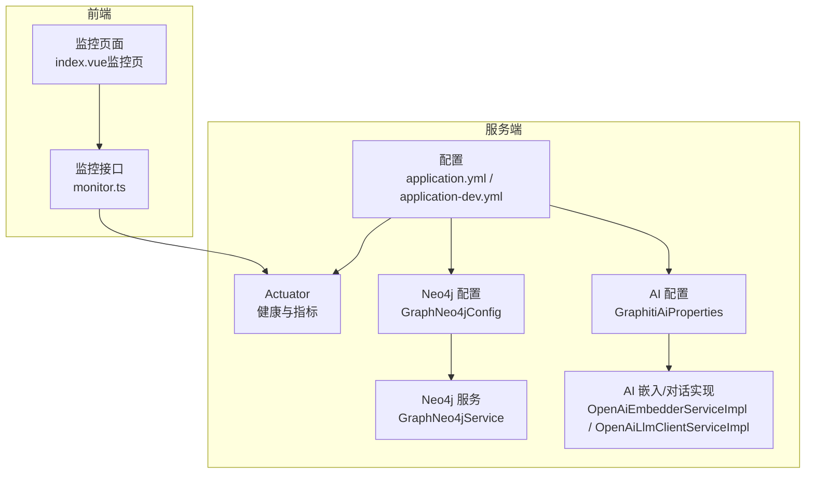
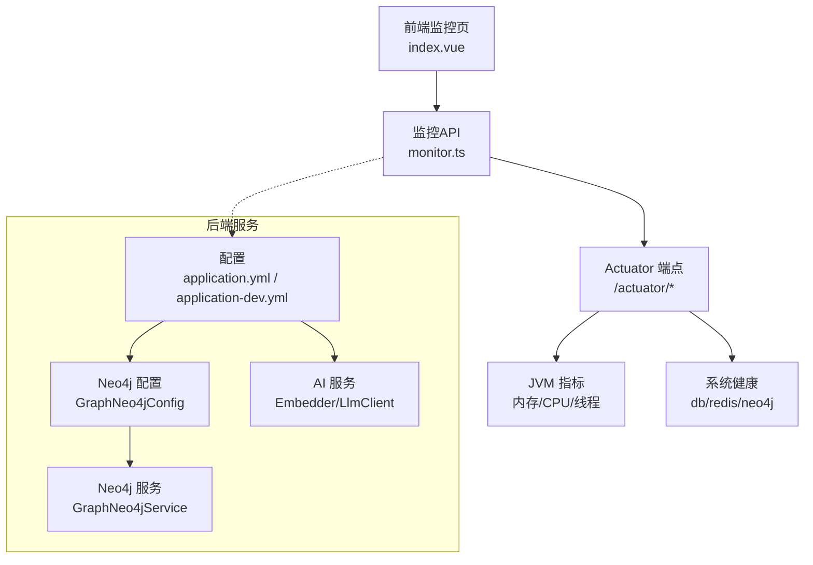
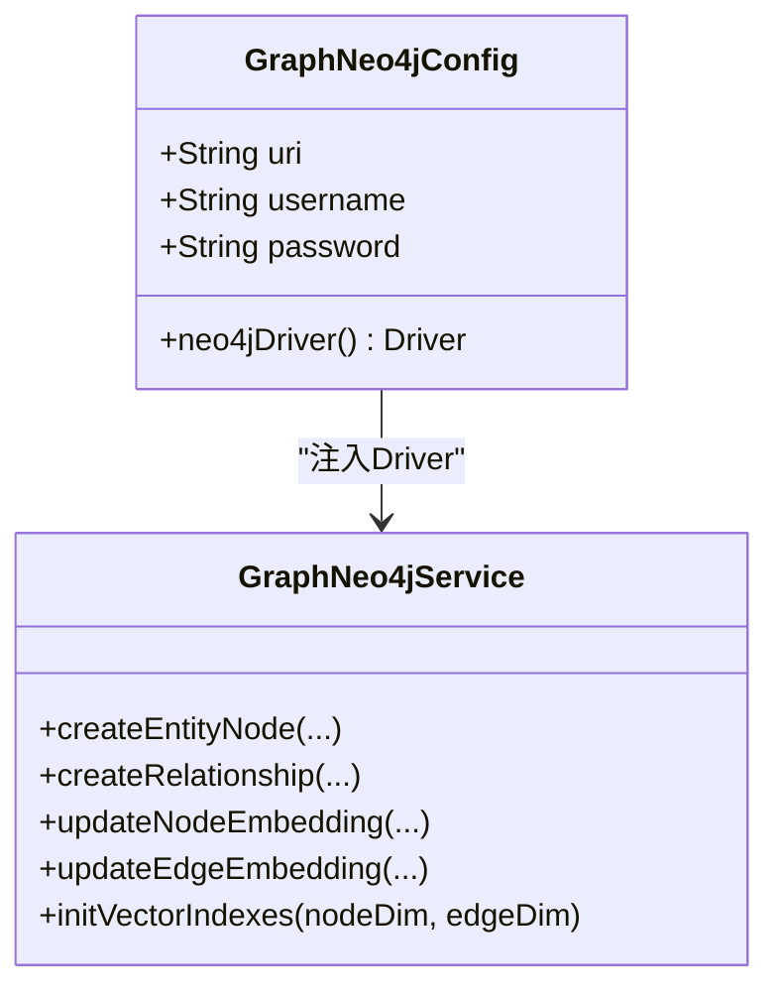
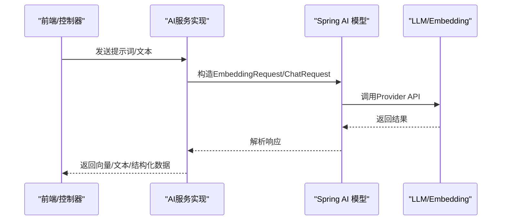
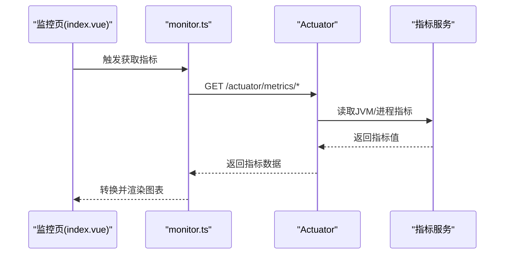
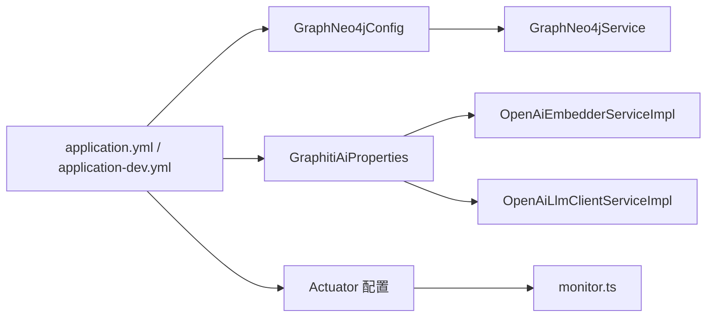

# 性能诊断

<!--<cite>
**本文引用的文件**
- [application.yml](file://graphiti-server/src/main/resources/application.yml)
- [application-dev.yml](file://graphiti-server/src/main/resources/application-dev.yml)
- [GraphNeo4jConfig.java](file://graphiti-module-core/src/main/java/com/graphiti/module/graphiti/config/GraphNeo4jConfig.java)
- [GraphitiAiProperties.java](file://graphiti-module-core/src/main/java/com/graphiti/module/graphiti/config/GraphitiAiProperties.java)
- [GraphNeo4jService.java](file://graphiti-module-core/src/main/java/com/graphiti/module/graphiti/service/GraphNeo4jService.java)
- [Neo4jDriverAdapter.java](file://graphiti-module-core/src/main/java/com/graphiti/module/graphiti/service/impl/Neo4jDriverAdapter.java)
- [OpenAiEmbedderServiceImpl.java](file://graphiti-module-core/src/main/java/com/graphiti/module/graphiti/service/impl/ai/OpenAiEmbedderServiceImpl.java)
- [QwenEmbedderServiceImpl.java](file://graphiti-module-core/src/main/java/com/graphiti/module/graphiti/service/impl/ai/QwenEmbedderServiceImpl.java)
- [OpenAiLlmClientServiceImpl.java](file://graphiti-module-core/src/main/java/com/graphiti/module/graphiti/service/impl/ai/OpenAiLlmClientServiceImpl.java)
- [QwenLlmClientServiceImpl.java](file://graphiti-module-core/src/main/java/com/graphiti/module/graphiti/service/impl/ai/QwenLlmClientServiceImpl.java)
- [monitor.ts](file://graphiti-web/src/api/monitor.ts)
- [index.vue（监控页）](file://graphiti-web/src/views/monitor/index.vue)
- [vector-index-init.cypher](file://sql/neo4j/vector-index-init.cypher)
- [docker-compose.prod.yml](file://docker-compose.prod.yml)
- [application-prod.yml](file://config/application-prod.yml)
- [2026-05-11-graphiti-java-full-migration-plan.md](file://docs/superpowers/plans/2026-05-11-graphiti-java-full-migration-plan.md)
- [database-migration-guide.md](file://docs/database-migration-guide.md)
- [install.md](file://install.md)
</cite>-->

## 目录
1. [简介](#简介)
2. [项目结构](#项目结构)
3. [核心组件](#核心组件)
4. [架构总览](#架构总览)
5. [详细组件分析](#详细组件分析)
6. [依赖分析](#依赖分析)
7. [性能考量](#性能考量)
8. [故障排查指南](#故障排查指南)
9. [结论](#结论)
10. [附录](#附录)

## 简介
本文件面向Graphiti-Java后端系统的性能诊断与优化，聚焦以下目标：
- 性能监控指标采集与分析：响应时间、吞吐量、内存使用、CPU负载
- Neo4j查询性能优化：索引使用、查询计划分析、批量操作优化
- AI服务调用性能：并发控制、缓存策略、超时配置
- 数据库连接池配置、JVM参数调优、系统资源监控
- 性能测试工具与基准测试方法
- 常见性能瓶颈识别与解决方案：查询慢、内存泄漏、并发冲突

## 项目结构
后端采用多模块结构，核心与性能相关的关键位置如下：
- 配置层：Spring Boot配置文件集中于服务端资源目录，包含Actuator、日志、数据源、Redis、Neo4j、AI Provider等
- 服务层：Neo4j驱动与服务封装、AI嵌入与对话客户端、向量索引初始化
- 前端监控：基于Actuator的系统健康与指标展示
- 运维：生产级Compose与配置覆盖，含JVM参数与连接池调优

**图表来源**
- [application.yml:1-67](file://graphiti-server/src/main/resources/application.yml#L1-L67)
- [application-dev.yml:1-676](file://graphiti-server/src/main/resources/application-dev.yml#L1-L676)
- [GraphNeo4jConfig.java:1-47](file://graphiti-module-core/src/main/java/com/graphiti/module/graphiti/config/GraphNeo4jConfig.java#L1-L47)
- [GraphNeo4jService.java:1-200](file://graphiti-module-core/src/main/java/com/graphiti/module/graphiti/service/GraphNeo4jService.java#L1-L200)
- [GraphitiAiProperties.java:1-135](file://graphiti-module-core/src/main/java/com/graphiti/module/graphiti/config/GraphitiAiProperties.java#L1-L135)
- [OpenAiEmbedderServiceImpl.java:1-107](file://graphiti-module-core/src/main/java/com/graphiti/module/graphiti/service/impl/ai/OpenAiEmbedderServiceImpl.java#L1-L107)
- [OpenAiLlmClientServiceImpl.java:1-110](file://graphiti-module-core/src/main/java/com/graphiti/module/graphiti/service/impl/ai/OpenAiLlmClientServiceImpl.java#L1-L110)
- [monitor.ts:1-196](file://graphiti-web/src/api/monitor.ts#L1-L196)
- [index.vue（监控页）:436-494](file://graphiti-web/src/views/monitor/index.vue#L436-L494)

**章节来源**
- [application.yml:1-67](file://graphiti-server/src/main/resources/application.yml#L1-L67)
- [application-dev.yml:1-676](file://graphiti-server/src/main/resources/application-dev.yml#L1-L676)

## 核心组件
- Neo4j驱动与服务
  - 配置类负责读取URI、用户名、密码并创建Driver Bean
  - 服务类封装节点/关系的CRUD、向量更新、全文检索、向量索引初始化
- AI配置与实现
  - 配置类统一管理各Provider的模型、温度、最大token、嵌入模型等
  - 嵌入实现基于Spring AI的OpenAI兼容模型；对话实现基于ChatClient
- 监控与指标
  - 前端通过Axios调用Actuator端点，聚合JVM内存、CPU、线程等指标
  - 监控页定时轮询并渲染趋势图

**章节来源**
- [GraphNeo4jConfig.java:1-47](file://graphiti-module-core/src/main/java/com/graphiti/module/graphiti/config/GraphNeo4jConfig.java#L1-L47)
- [GraphNeo4jService.java:1-200](file://graphiti-module-core/src/main/java/com/graphiti/module/graphiti/service/GraphNeo4jService.java#L1-L200)
- [GraphitiAiProperties.java:1-135](file://graphiti-module-core/src/main/java/com/graphiti/module/graphiti/config/GraphitiAiProperties.java#L1-L135)
- [OpenAiEmbedderServiceImpl.java:1-107](file://graphiti-module-core/src/main/java/com/graphiti/module/graphiti/service/impl/ai/OpenAiEmbedderServiceImpl.java#L1-L107)
- [OpenAiLlmClientServiceImpl.java:1-110](file://graphiti-module-core/src/main/java/com/graphiti/module/graphiti/service/impl/ai/OpenAiLlmClientServiceImpl.java#L1-L110)
- [monitor.ts:1-196](file://graphiti-web/src/api/monitor.ts#L1-L196)

## 架构总览
下图展示了从前端到后端、数据库与AI服务的整体交互路径，以及性能监控的接入点。

**图表来源**
- [monitor.ts:1-196](file://graphiti-web/src/api/monitor.ts#L1-L196)
- [application.yml:43-67](file://graphiti-server/src/main/resources/application.yml#L43-L67)
- [application-dev.yml:615-635](file://graphiti-server/src/main/resources/application-dev.yml#L615-L635)
- [GraphNeo4jConfig.java:1-47](file://graphiti-module-core/src/main/java/com/graphiti/module/graphiti/config/GraphNeo4jConfig.java#L1-L47)
- [GraphNeo4jService.java:1-200](file://graphiti-module-core/src/main/java/com/graphiti/module/graphiti/service/GraphNeo4jService.java#L1-L200)

## 详细组件分析

### Neo4j查询与向量索引优化
- 配置与连接
  - 通过配置类读取URI、用户名、密码，创建Driver Bean供服务层使用
- 查询与索引
  - 服务层提供节点/关系的CRUD、向量更新、全文检索
  - 支持在启动时初始化向量索引（节点与关系），并提供Cypher脚本用于手动创建
- 批量与性能
  - 服务层提供批量嵌入更新接口，便于批量写入时减少往返
  - 建议结合事务与参数化查询，避免逐条执行

**图表来源**
- [GraphNeo4jConfig.java:1-47](file://graphiti-module-core/src/main/java/com/graphiti/module/graphiti/config/GraphNeo4jConfig.java#L1-L47)
- [GraphNeo4jService.java:1-200](file://graphiti-module-core/src/main/java/com/graphiti/module/graphiti/service/GraphNeo4jService.java#L1-L200)

**章节来源**
- [GraphNeo4jConfig.java:1-47](file://graphiti-module-core/src/main/java/com/graphiti/module/graphiti/config/GraphNeo4jConfig.java#L1-L47)
- [GraphNeo4jService.java:768-786](file://graphiti-module-core/src/main/java/com/graphiti/module/graphiti/service/GraphNeo4jService.java#L768-L786)
- [vector-index-init.cypher:1-26](file://sql/neo4j/vector-index-init.cypher#L1-L26)

### AI服务调用流程与性能要点
- 配置
  - 通过配置类读取各Provider的模型、温度、最大token、嵌入模型等
- 调用
  - 嵌入服务基于Spring AI的EmbeddingModel，支持单条与批量
  - 对话服务基于ChatClient，支持系统+用户提示词与结构化输出
- 并发与超时
  - 建议在调用侧设置合理超时与重试策略，避免阻塞线程池
  - 对批量嵌入建议分批处理，并行度受网络与Provider限流约束

**图表来源**
- [OpenAiEmbedderServiceImpl.java:1-107](file://graphiti-module-core/src/main/java/com/graphiti/module/graphiti/service/impl/ai/OpenAiEmbedderServiceImpl.java#L1-L107)
- [OpenAiLlmClientServiceImpl.java:1-110](file://graphiti-module-core/src/main/java/com/graphiti/module/graphiti/service/impl/ai/OpenAiLlmClientServiceImpl.java#L1-L110)
- [GraphitiAiProperties.java:1-135](file://graphiti-module-core/src/main/java/com/graphiti/module/graphiti/config/GraphitiAiProperties.java#L1-L135)

**章节来源**
- [OpenAiEmbedderServiceImpl.java:1-107](file://graphiti-module-core/src/main/java/com/graphiti/module/graphiti/service/impl/ai/OpenAiEmbedderServiceImpl.java#L1-L107)
- [QwenEmbedderServiceImpl.java:1-66](file://graphiti-module-core/src/main/java/com/graphiti/module/graphiti/service/impl/ai/QwenEmbedderServiceImpl.java#L1-L66)
- [OpenAiLlmClientServiceImpl.java:1-110](file://graphiti-module-core/src/main/java/com/graphiti/module/graphiti/service/impl/ai/OpenAiLlmClientServiceImpl.java#L1-L110)
- [GraphitiAiProperties.java:1-135](file://graphiti-module-core/src/main/java/com/graphiti/module/graphiti/config/GraphitiAiProperties.java#L1-L135)

### 监控与指标采集
- Actuator端点
  - 健康检查：/actuator/health
  - 指标：/actuator/metrics/{name}（如jvm.memory.used、process.cpu.usage、jvm.threads.live）
- 前端集成
  - monitor.ts封装Axios请求，聚合指标并转换为图表所需格式
  - 监控页定时轮询，按时间范围生成折线图

**图表来源**
- [monitor.ts:1-196](file://graphiti-web/src/api/monitor.ts#L1-L196)
- [index.vue（监控页）:436-494](file://graphiti-web/src/views/monitor/index.vue#L436-L494)
- [application.yml:43-67](file://graphiti-server/src/main/resources/application.yml#L43-L67)
- [application-dev.yml:615-635](file://graphiti-server/src/main/resources/application-dev.yml#L615-L635)

**章节来源**
- [monitor.ts:1-196](file://graphiti-web/src/api/monitor.ts#L1-L196)
- [index.vue（监控页）:436-494](file://graphiti-web/src/views/monitor/index.vue#L436-L494)
- [application.yml:43-67](file://graphiti-server/src/main/resources/application.yml#L43-L67)

## 依赖分析
- 配置依赖
  - application.yml与application-dev.yml共同决定Actuator、日志、数据源、Redis、Neo4j、AI Provider等行为
- 组件耦合
  - GraphNeo4jConfig与GraphNeo4jService强耦合，前者提供Driver后者使用
  - AI实现依赖GraphitiAiProperties进行Provider选择与参数注入
- 外部依赖
  - Neo4j Driver、PostgreSQL JDBC、Spring AI、Redis客户端

**图表来源**
- [application.yml:1-67](file://graphiti-server/src/main/resources/application.yml#L1-L67)
- [application-dev.yml:1-676](file://graphiti-server/src/main/resources/application-dev.yml#L1-L676)
- [GraphNeo4jConfig.java:1-47](file://graphiti-module-core/src/main/java/com/graphiti/module/graphiti/config/GraphNeo4jConfig.java#L1-L47)
- [GraphNeo4jService.java:1-200](file://graphiti-module-core/src/main/java/com/graphiti/module/graphiti/service/GraphNeo4jService.java#L1-L200)
- [GraphitiAiProperties.java:1-135](file://graphiti-module-core/src/main/java/com/graphiti/module/graphiti/config/GraphitiAiProperties.java#L1-L135)
- [OpenAiEmbedderServiceImpl.java:1-107](file://graphiti-module-core/src/main/java/com/graphiti/module/graphiti/service/impl/ai/OpenAiEmbedderServiceImpl.java#L1-L107)
- [OpenAiLlmClientServiceImpl.java:1-110](file://graphiti-module-core/src/main/java/com/graphiti/module/graphiti/service/impl/ai/OpenAiLlmClientServiceImpl.java#L1-L110)
- [monitor.ts:1-196](file://graphiti-web/src/api/monitor.ts#L1-L196)

**章节来源**
- [application.yml:1-67](file://graphiti-server/src/main/resources/application.yml#L1-L67)
- [application-dev.yml:1-676](file://graphiti-server/src/main/resources/application-dev.yml#L1-L676)

## 性能考量

### 响应时间与吞吐量
- 指标采集
  - 使用Actuator的metrics端点获取JVM内存、CPU、线程等指标，前端按时间窗口聚合
- 优化方向
  - 减少GC停顿：合理设置堆大小与GC参数（容器内使用UseContainerSupport）
  - 降低阻塞：对IO密集型（AI、数据库）使用异步与限流
  - 缓存热点数据：Redis缓存热点查询结果

**章节来源**
- [monitor.ts:103-139](file://graphiti-web/src/api/monitor.ts#L103-L139)
- [application.yml:43-67](file://graphiti-server/src/main/resources/application.yml#L43-L67)
- [docker-compose.prod.yml:27-28](file://docker-compose.prod.yml#L27-L28)

### 内存使用与CPU负载
- 内存
  - 通过Actuator jvm.memory.used与jvm.memory.committed计算使用率
  - 生产环境建议开启容器内存感知，避免过度分配
- CPU
  - process.cpu.usage反映瞬时CPU占用，结合线程数判断是否过载

**章节来源**
- [monitor.ts:103-139](file://graphiti-web/src/api/monitor.ts#L103-L139)
- [docker-compose.prod.yml:27-28](file://docker-compose.prod.yml#L27-L28)

### Neo4j查询性能优化
- 索引
  - 启动时初始化向量索引（节点与关系），并创建全文索引以加速相似度与模糊匹配
  - 手动脚本可直接在Neo4j中创建索引
- 查询计划
  - 使用Neo4j浏览器或驱动执行EXPLAIN/PROFILE分析查询计划
- 批量操作
  - 使用事务与参数化批量写入，减少网络往返
  - 分批提交，避免单事务过大导致锁竞争

**章节来源**
- [GraphNeo4jService.java:768-786](file://graphiti-module-core/src/main/java/com/graphiti/module/graphiti/service/GraphNeo4jService.java#L768-L786)
- [vector-index-init.cypher:1-26](file://sql/neo4j/vector-index-init.cypher#L1-L26)
- [2026-05-11-graphiti-java-full-migration-plan.md:646-695](file://docs/superpowers/plans/2026-05-11-graphiti-java-full-migration-plan.md#L646-L695)

### AI服务调用性能
- 并发控制
  - 对外暴露的批量接口建议限流与队列缓冲，避免上游突发流量压垮AI服务
- 缓存策略
  - 对重复文本的嵌入结果进行缓存，命中则直接返回
- 超时配置
  - 设置合理的请求超时与重试次数，避免长时间阻塞线程

**章节来源**
- [OpenAiEmbedderServiceImpl.java:1-107](file://graphiti-module-core/src/main/java/com/graphiti/module/graphiti/service/impl/ai/OpenAiEmbedderServiceImpl.java#L1-L107)
- [OpenAiLlmClientServiceImpl.java:1-110](file://graphiti-module-core/src/main/java/com/graphiti/module/graphiti/service/impl/ai/OpenAiLlmClientServiceImpl.java#L1-L110)
- [GraphitiAiProperties.java:1-135](file://graphiti-module-core/src/main/java/com/graphiti/module/graphiti/config/GraphitiAiProperties.java#L1-L135)

### 数据库连接池与JVM参数
- 连接池
  - HikariCP参数在开发与生产配置中均有体现，建议根据QPS与事务持续时间调优
- JVM参数
  - 生产环境启用容器内存感知，限制堆大小，降低Full GC概率

**章节来源**
- [application-dev.yml:498-502](file://graphiti-server/src/main/resources/application-dev.yml#L498-L502)
- [application-prod.yml:25-31](file://config/application-prod.yml#L25-L31)
- [docker-compose.prod.yml:27-28](file://docker-compose.prod.yml#L27-L28)

### 系统资源监控
- Actuator健康与指标端点在开发与生产配置中分别开放不同范围
- 前端监控页定时轮询并展示CPU、内存、线程等趋势

**章节来源**
- [application.yml:43-67](file://graphiti-server/src/main/resources/application.yml#L43-L67)
- [application-dev.yml:615-635](file://graphiti-server/src/main/resources/application-dev.yml#L615-L635)
- [monitor.ts:1-196](file://graphiti-web/src/api/monitor.ts#L1-L196)

### 性能测试与基准测试
- 工具建议
  - JMeter/LoadRunner进行接口级压力测试
  - Neo4j内置基准工具与EXPLAIN/PROFILE分析查询
- 方法
  - 基准测试前清理缓存与索引，保证结果可重复
  - 分别测试单条与批量场景，记录P95/P99延迟与错误率

[本节为通用指导，无需特定文件引用]

### 常见性能瓶颈与解决方案
- 查询慢
  - 未建立向量/全文索引：按脚本创建索引并验证查询计划
  - 未使用参数化与事务：改为批量参数化写入
- 内存泄漏
  - 检查长生命周期对象持有Session/Buffer，确保资源在try-with-resources中释放
- 并发冲突
  - 适当增加连接池上限与最小空闲，避免排队超时
  - 对热点数据引入Redis缓存，降低数据库压力

**章节来源**
- [GraphNeo4jService.java:1-200](file://graphiti-module-core/src/main/java/com/graphiti/module/graphiti/service/GraphNeo4jService.java#L1-L200)
- [vector-index-init.cypher:1-26](file://sql/neo4j/vector-index-init.cypher#L1-L26)

## 故障排查指南
- Actuator不可用
  - 检查端点暴露配置与安全策略
- 指标为空
  - 确认指标名称正确且JMX可用
- Neo4j连接失败
  - 校验URI、凭据与防火墙
- AI调用异常
  - 检查Provider配置、模型名称与网络连通性

**章节来源**
- [application.yml:43-67](file://graphiti-server/src/main/resources/application.yml#L43-L67)
- [application-dev.yml:615-635](file://graphiti-server/src/main/resources/application-dev.yml#L615-L635)
- [GraphNeo4jConfig.java:1-47](file://graphiti-module-core/src/main/java/com/graphiti/module/graphiti/config/GraphNeo4jConfig.java#L1-L47)
- [OpenAiEmbedderServiceImpl.java:1-107](file://graphiti-module-core/src/main/java/com/graphiti/module/graphiti/service/impl/ai/OpenAiEmbedderServiceImpl.java#L1-L107)

## 结论
通过配置化管理Actuator与AI Provider、在Neo4j中建立向量与全文索引、在前端集成指标采集与展示，Graphiti-Java具备了完善的性能观测与优化基础。结合连接池与JVM参数调优、合理的并发与缓存策略，可在高负载场景下保持稳定与高效。

## 附录

### 配置要点速览
- Actuator端点与指标
  - 开放health与metrics，开发环境可全量暴露
- Neo4j
  - 配置URI/用户名/密码，服务层提供索引初始化与向量更新
- AI Provider
  - 通过配置类选择Provider与模型，实现可插拔替换
- 生产环境
  - 容器内JVM参数与连接池上限，结合监控持续迭代

**章节来源**
- [application.yml:43-67](file://graphiti-server/src/main/resources/application.yml#L43-L67)
- [application-dev.yml:1-676](file://graphiti-server/src/main/resources/application-dev.yml#L1-L676)
- [docker-compose.prod.yml:1-39](file://docker-compose.prod.yml#L1-L39)
- [GraphNeo4jConfig.java:1-47](file://graphiti-module-core/src/main/java/com/graphiti/module/graphiti/config/GraphNeo4jConfig.java#L1-L47)
- [GraphitiAiProperties.java:1-135](file://graphiti-module-core/src/main/java/com/graphiti/module/graphiti/config/GraphitiAiProperties.java#L1-L135)