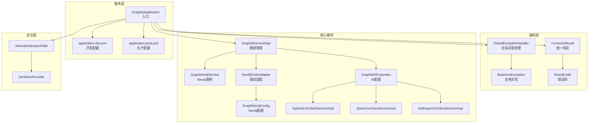
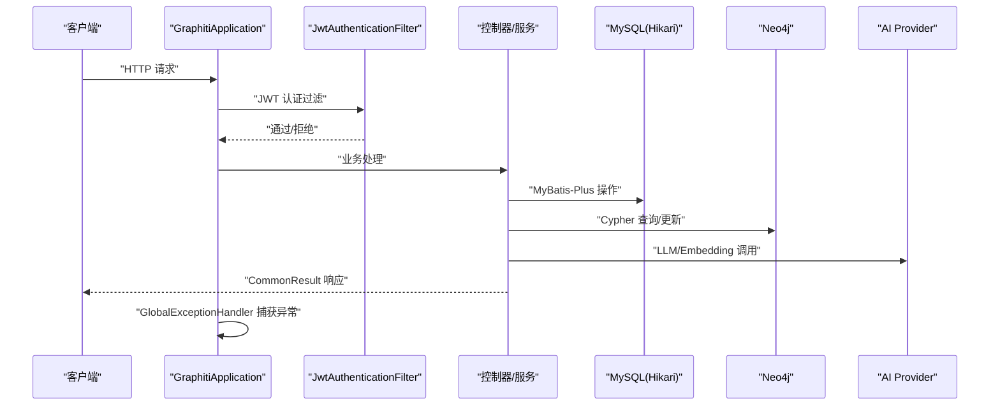
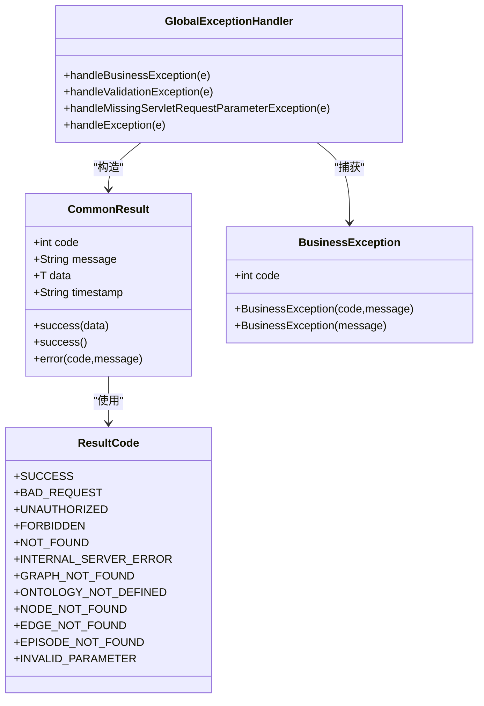
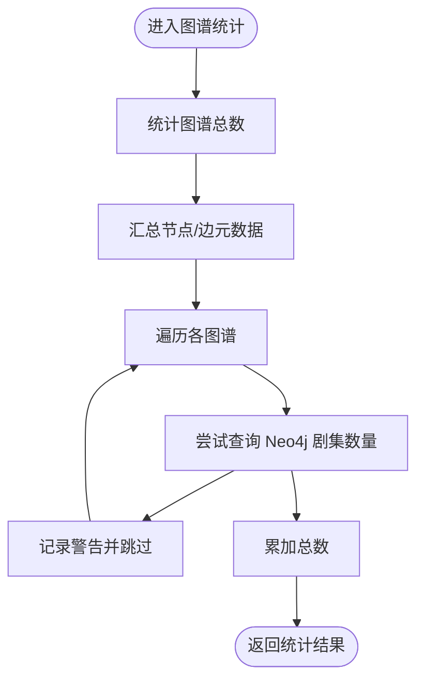
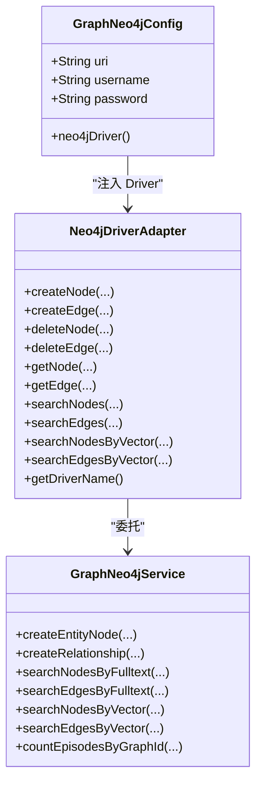
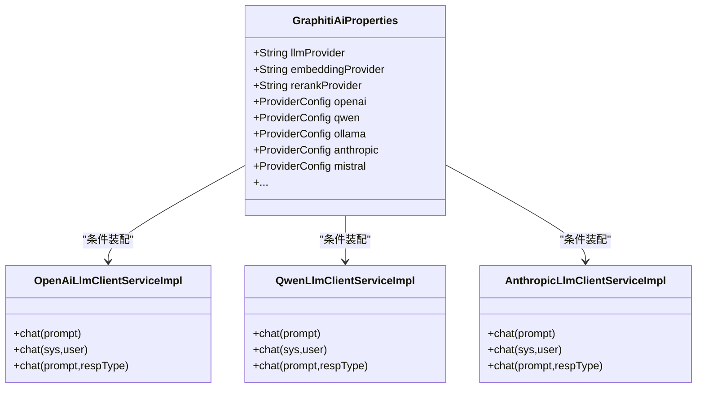
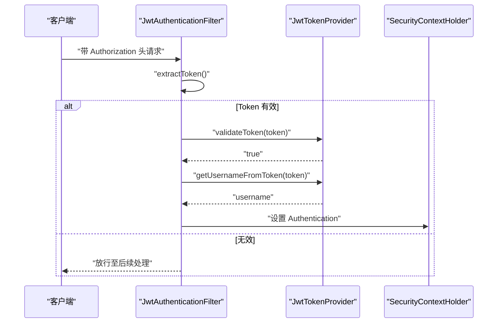
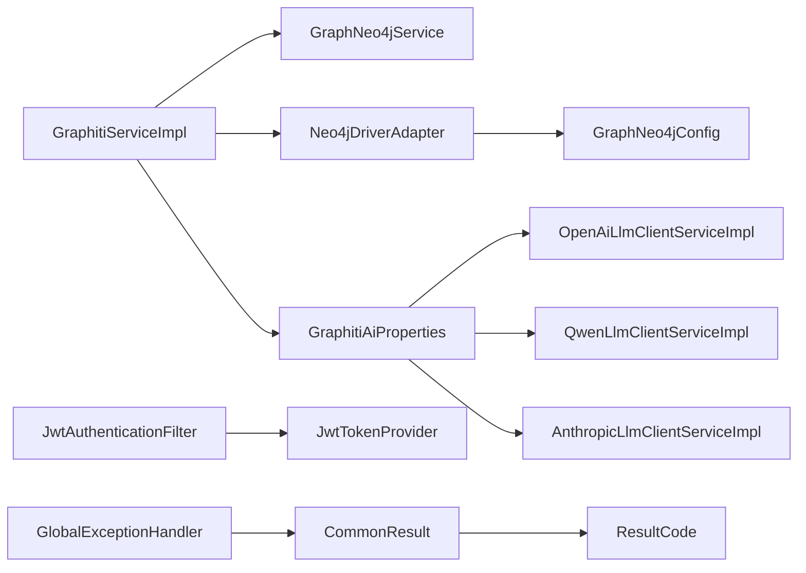

# 故障排查

<!--<cite>
**本文引用的文件**
- [application.yml](file://graphiti-server/src/main/resources/application.yml)
- [application-dev.yml](file://graphiti-server/src/main/resources/application-dev.yml)
- [application-prod.yml](file://config/application-prod.yml)
- [docker-compose.prod.yml](file://docker-compose.prod.yml)
- [ResultCode.java](file://graphiti-framework/graphiti-common/src/main/java/com/raphiti/common/constants/ResultCode.java)
- [CommonResult.java](file://graphiti-framework/graphiti-common/src/main/java/com/raphiti/common/response/CommonResult.java)
- [BusinessException.java](file://graphiti-framework/graphiti-common/src/main/java/com/raphiti/common/exception/BusinessException.java)
- [GlobalExceptionHandler.java](file://graphiti-framework/graphiti-common/src/main/java/com/raphiti/common/exception/GlobalExceptionHandler.java)
- [GraphitiServiceImpl.java](file://graphiti-module-core/src/main/java/com/raphiti/module/graphiti/service/impl/GraphitiServiceImpl.java)
- [GraphNeo4jConfig.java](file://graphiti-module-core/src/main/java/com/raphiti/module/graphiti/config/GraphNeo4jConfig.java)
- [GraphitiAiProperties.java](file://graphiti-module-core/src/main/java/com/raphiti/module/graphiti/config/GraphitiAiProperties.java)
- [Neo4jDriverAdapter.java](file://graphiti-module-core/src/main/java/com/raphiti/module/graphiti/service/impl/Neo4jDriverAdapter.java)
- [GraphNeo4jService.java](file://graphiti-module-core/src/main/java/com/raphiti/module/graphiti/service/GraphNeo4jService.java)
- [OpenAiLlmClientServiceImpl.java](file://graphiti-module-core/src/main/java/com/raphiti/module/graphiti/service/impl/ai/OpenAiLlmClientServiceImpl.java)
- [QwenLlmClientServiceImpl.java](file://graphiti-module-core/src/main/java/com/raphiti/module/graphiti/service/impl/ai/QwenLlmClientServiceImpl.java)
- [AnthropicLlmClientServiceImpl.java](file://graphiti-module-core/src/main/java/com/raphiti/module/graphiti/service/impl/ai/AnthropicLlmClientServiceImpl.java)
- [JwtAuthenticationFilter.java](file://graphiti-framework/graphiti-spring-boot-starter-security/src/main/java/com/raphiti/framework/security/jwt/JwtAuthenticationFilter.java)
- [JwtTokenProvider.java](file://graphiti-framework/graphiti-spring-boot-starter-security/src/main/java/com/raphiti/framework/security/jwt/JwtTokenProvider.java)
- [OntologyValidationException.java](file://graphiti-module-core/src/main/java/com/raphiti/module/graphiti/exception/OntologyValidationException.java)
- [TemporalServiceImpl.java](file://graphiti-module-core/src/main/java/com/raphiti/module/graphiti/service/impl/TemporalServiceImpl.java)
- [2026-05-08-mysql-to-postgresql-migration.md](file://docs/superpowers/plans/2026-05-08-mysql-to-postgresql-migration.md)
</cite>-->

## 目录
1. [简介](#简介)
2. [项目结构](#项目结构)
3. [核心组件](#核心组件)
4. [架构总览](#架构总览)
5. [详细组件分析](#详细组件分析)
6. [依赖分析](#依赖分析)
7. [性能考虑](#性能考虑)
8. [故障排查指南](#故障排查指南)
9. [结论](#结论)
10. [附录](#附录)

## 简介
本文件面向技术支持与运维工程师，系统化梳理 ontograph-java 在运行期可能出现的常见问题与排障路径，涵盖：
- 统一异常与错误码体系
- 数据库连接与迁移问题
- Neo4j 图数据库连接与集群故障
- AI 服务调用失败（OpenAI、Qwen、Anthropic 等）
- 网络与权限配置错误
- 性能瓶颈与优化建议
- 应急处理与数据恢复流程

目标是提供可操作的诊断步骤、日志分析技巧与快速修复方案。

## 项目结构
- 服务入口与配置：graphiti-server 提供 Spring Boot 入口与多环境配置（dev/prod）
- 通用层：graphiti-common 定义统一响应、错误码与全局异常处理
- 核心模块：graphiti-module-core 实现图谱、本体、实体抽取、向量化检索等能力，并集成 Neo4j 与 AI 服务
- 安全层：graphiti-spring-boot-starter-security 提供 JWT 认证与鉴权
- 文档与迁移：docs 下包含数据库迁移与设计文档

图表来源
- [application.yml:1-67](file://graphiti-server/src/main/resources/application.yml#L1-L67)
- [application-dev.yml:1-676](file://graphiti-server/src/main/resources/application-dev.yml#L1-L676)
- [application-prod.yml:1-41](file://config/application-prod.yml#L1-L41)
- [CommonResult.java:1-68](file://graphiti-framework/graphiti-common/src/main/java/com/raphiti/common/response/CommonResult.java#L1-L68)
- [ResultCode.java:1-23](file://graphiti-framework/graphiti-common/src/main/java/com/raphiti/common/constants/ResultCode.java#L1-L23)
- [GlobalExceptionHandler.java:1-74](file://graphiti-framework/graphiti-common/src/main/java/com/raphiti/common/exception/GlobalExceptionHandler.java#L1-L74)
- [BusinessException.java:1-33](file://graphiti-framework/graphiti-common/src/main/java/com/raphiti/common/exception/BusinessException.java#L1-L33)
- [GraphitiServiceImpl.java:1-256](file://graphiti-module-core/src/main/java/com/raphiti/module/graphiti/service/impl/GraphitiServiceImpl.java#L1-L256)
- [GraphNeo4jService.java:853-972](file://graphiti-module-core/src/main/java/com/raphiti/module/graphiti/service/GraphNeo4jService.java#L853-L972)
- [GraphNeo4jConfig.java:1-47](file://graphiti-module-core/src/main/java/com/raphiti/module/graphiti/config/GraphNeo4jConfig.java#L1-L47)
- [Neo4jDriverAdapter.java:1-84](file://graphiti-module-core/src/main/java/com/raphiti/module/graphiti/service/impl/Neo4jDriverAdapter.java#L1-L84)
- [GraphitiAiProperties.java:1-135](file://graphiti-module-core/src/main/java/com/raphiti/module/graphiti/config/GraphitiAiProperties.java#L1-L135)
- [OpenAiLlmClientServiceImpl.java:39-110](file://graphiti-module-core/src/main/java/com/raphiti/module/graphiti/service/impl/ai/OpenAiLlmClientServiceImpl.java#L39-L110)
- [QwenLlmClientServiceImpl.java:28-73](file://graphiti-module-core/src/main/java/com/raphiti/module/graphiti/service/impl/ai/QwenLlmClientServiceImpl.java#L28-L73)
- [AnthropicLlmClientServiceImpl.java:36-76](file://graphiti-module-core/src/main/java/com/raphiti/module/graphiti/service/impl/ai/AnthropicLlmClientServiceImpl.java#L36-L76)
- [JwtAuthenticationFilter.java:1-61](file://graphiti-framework/graphiti-spring-boot-starter-security/src/main/java/com/raphiti/framework/security/jwt/JwtAuthenticationFilter.java#L1-L61)
- [JwtTokenProvider.java:1-87](file://graphiti-framework/graphiti-spring-boot-starter-security/src/main/java/com/raphiti/framework/security/jwt/JwtTokenProvider.java#L1-L87)

章节来源
- [application.yml:1-67](file://graphiti-server/src/main/resources/application.yml#L1-L67)
- [application-dev.yml:1-676](file://graphiti-server/src/main/resources/application-dev.yml#L1-L676)
- [application-prod.yml:1-41](file://config/application-prod.yml#L1-L41)

## 核心组件
- 统一响应与错误码：统一响应体、业务错误码与全局异常处理，确保错误信息标准化输出与日志记录
- 图谱管理服务：负责图谱元数据、统计、克隆与导出，串联 MySQL 与 Neo4j
- Neo4j 配置与适配：读取配置创建 Driver 并提供节点/边的增删改查与向量检索
- AI 配置与客户端：集中管理 LLM/Embedding/Rerank Provider，按配置动态启用
- 安全认证：基于 JWT 的请求拦截与 Token 校验

章节来源
- [CommonResult.java:1-68](file://graphiti-framework/graphiti-common/src/main/java/com/raphiti/common/response/CommonResult.java#L1-L68)
- [ResultCode.java:1-23](file://graphiti-framework/graphiti-common/src/main/java/com/raphiti/common/constants/ResultCode.java#L1-L23)
- [GlobalExceptionHandler.java:1-74](file://graphiti-framework/graphiti-common/src/main/java/com/raphiti/common/exception/GlobalExceptionHandler.java#L1-L74)
- [GraphitiServiceImpl.java:1-256](file://graphiti-module-core/src/main/java/com/raphiti/module/graphiti/service/impl/GraphitiServiceImpl.java#L1-L256)
- [GraphNeo4jConfig.java:1-47](file://graphiti-module-core/src/main/java/com/raphiti/module/graphiti/config/GraphNeo4jConfig.java#L1-L47)
- [Neo4jDriverAdapter.java:1-84](file://graphiti-module-core/src/main/java/com/raphiti/module/graphiti/service/impl/Neo4jDriverAdapter.java#L1-L84)
- [GraphitiAiProperties.java:1-135](file://graphiti-module-core/src/main/java/com/raphiti/module/graphiti/config/GraphitiAiProperties.java#L1-L135)
- [JwtAuthenticationFilter.java:1-61](file://graphiti-framework/graphiti-spring-boot-starter-security/src/main/java/com/raphiti/framework/security/jwt/JwtAuthenticationFilter.java#L1-L61)
- [JwtTokenProvider.java:1-87](file://graphiti-framework/graphiti-spring-boot-starter-security/src/main/java/com/raphiti/framework/security/jwt/JwtTokenProvider.java#L1-L87)

## 架构总览
下图展示服务启动、请求处理、异常捕获与外部依赖交互的关键路径。

图表来源
- [application.yml:1-67](file://graphiti-server/src/main/resources/application.yml#L1-L67)
- [application-dev.yml:1-676](file://graphiti-server/src/main/resources/application-dev.yml#L1-L676)
- [GlobalExceptionHandler.java:1-74](file://graphiti-framework/graphiti-common/src/main/java/com/raphiti/common/exception/GlobalExceptionHandler.java#L1-L74)
- [CommonResult.java:1-68](file://graphiti-framework/graphiti-common/src/main/java/com/raphiti/common/response/CommonResult.java#L1-L68)
- [GraphitiServiceImpl.java:1-256](file://graphiti-module-core/src/main/java/com/raphiti/module/graphiti/service/impl/GraphitiServiceImpl.java#L1-L256)
- [GraphNeo4jService.java:853-972](file://graphiti-module-core/src/main/java/com/raphiti/module/graphiti/service/GraphNeo4jService.java#L853-L972)
- [GraphitiAiProperties.java:1-135](file://graphiti-module-core/src/main/java/com/raphiti/module/graphiti/config/GraphitiAiProperties.java#L1-L135)

## 详细组件分析

### 统一异常与错误码体系
- 错误码定义：SUCCESS、4xx/5xx 通用码与 1001-1099 业务码
- 全局异常处理：业务异常、参数校验缺失、其他未知异常的统一包装与日志记录
- 业务异常：携带业务错误码，便于前端与监控识别

图表来源
- [ResultCode.java:1-23](file://graphiti-framework/graphiti-common/src/main/java/com/raphiti/common/constants/ResultCode.java#L1-L23)
- [CommonResult.java:1-68](file://graphiti-framework/graphiti-common/src/main/java/com/raphiti/common/response/CommonResult.java#L1-L68)
- [BusinessException.java:1-33](file://graphiti-framework/graphiti-common/src/main/java/com/raphiti/common/exception/BusinessException.java#L1-L33)
- [GlobalExceptionHandler.java:1-74](file://graphiti-framework/graphiti-common/src/main/java/com/raphiti/common/exception/GlobalExceptionHandler.java#L1-L74)

章节来源
- [ResultCode.java:1-23](file://graphiti-framework/graphiti-common/src/main/java/com/raphiti/common/constants/ResultCode.java#L1-L23)
- [CommonResult.java:1-68](file://graphiti-framework/graphiti-common/src/main/java/com/raphiti/common/response/CommonResult.java#L1-L68)
- [BusinessException.java:1-33](file://graphiti-framework/graphiti-common/src/main/java/com/raphiti/common/exception/BusinessException.java#L1-L33)
- [GlobalExceptionHandler.java:1-74](file://graphiti-framework/graphiti-common/src/main/java/com/raphiti/common/exception/GlobalExceptionHandler.java#L1-L74)

### 图谱管理与统计
- 图谱 CRUD、列表、统计、克隆与导出
- 统计包含节点/边/剧集数量，部分统计依赖 Neo4j
- 业务异常：图谱不存在或已删除

图表来源
- [GraphitiServiceImpl.java:118-158](file://graphiti-module-core/src/main/java/com/raphiti/module/graphiti/service/impl/GraphitiServiceImpl.java#L118-L158)

章节来源
- [GraphitiServiceImpl.java:1-256](file://graphiti-module-core/src/main/java/com/raphiti/module/graphiti/service/impl/GraphitiServiceImpl.java#L1-L256)

### Neo4j 配置与适配
- 配置项：URI、用户名、密码，创建 Driver Bean
- 适配器：将 GraphNeo4jService 适配为 GraphDriverService，提供节点/边的创建、查询、向量检索与删除
- 服务层：封装 Cypher 查询、会话管理与异常处理

图表来源
- [GraphNeo4jConfig.java:1-47](file://graphiti-module-core/src/main/java/com/raphiti/module/graphiti/config/GraphNeo4jConfig.java#L1-L47)
- [Neo4jDriverAdapter.java:1-84](file://graphiti-module-core/src/main/java/com/raphiti/module/graphiti/service/impl/Neo4jDriverAdapter.java#L1-L84)
- [GraphNeo4jService.java:853-972](file://graphiti-module-core/src/main/java/com/raphiti/module/graphiti/service/GraphNeo4jService.java#L853-L972)

章节来源
- [GraphNeo4jConfig.java:1-47](file://graphiti-module-core/src/main/java/com/raphiti/module/graphiti/config/GraphNeo4jConfig.java#L1-L47)
- [Neo4jDriverAdapter.java:1-84](file://graphiti-module-core/src/main/java/com/raphiti/module/graphiti/service/impl/Neo4jDriverAdapter.java#L1-L84)
- [GraphNeo4jService.java:853-972](file://graphiti-module-core/src/main/java/com/raphiti/module/graphiti/service/GraphNeo4jService.java#L853-L972)

### AI 配置与客户端
- 配置：Provider 列表、模型、Base URL、温度、最大 Token、Embedding/Rerank 模型
- 客户端：OpenAI、Qwen、Anthropic 客户端实现，统一异常捕获与日志记录

图表来源
- [GraphitiAiProperties.java:1-135](file://graphiti-module-core/src/main/java/com/raphiti/module/graphiti/config/GraphitiAiProperties.java#L1-L135)
- [OpenAiLlmClientServiceImpl.java:39-110](file://graphiti-module-core/src/main/java/com/raphiti/module/graphiti/service/impl/ai/OpenAiLlmClientServiceImpl.java#L39-L110)
- [QwenLlmClientServiceImpl.java:28-73](file://graphiti-module-core/src/main/java/com/raphiti/module/graphiti/service/impl/ai/QwenLlmClientServiceImpl.java#L28-L73)
- [AnthropicLlmClientServiceImpl.java:36-76](file://graphiti-module-core/src/main/java/com/raphiti/module/graphiti/service/impl/ai/AnthropicLlmClientServiceImpl.java#L36-L76)

章节来源
- [GraphitiAiProperties.java:1-135](file://graphiti-module-core/src/main/java/com/raphiti/module/graphiti/config/GraphitiAiProperties.java#L1-L135)
- [OpenAiLlmClientServiceImpl.java:39-110](file://graphiti-module-core/src/main/java/com/raphiti/module/graphiti/service/impl/ai/OpenAiLlmClientServiceImpl.java#L39-L110)
- [QwenLlmClientServiceImpl.java:28-73](file://graphiti-module-core/src/main/java/com/raphiti/module/graphiti/service/impl/ai/QwenLlmClientServiceImpl.java#L28-L73)
- [AnthropicLlmClientServiceImpl.java:36-76](file://graphiti-module-core/src/main/java/com/raphiti/module/graphiti/service/impl/ai/AnthropicLlmClientServiceImpl.java#L36-L76)

### 安全认证与权限
- JWT 过滤器：从 Authorization 头提取 Bearer Token，验证后设置 SecurityContext
- Token 提供器：生成、解析与校验 Token，使用配置密钥与过期时间

图表来源
- [JwtAuthenticationFilter.java:1-61](file://graphiti-framework/graphiti-spring-boot-starter-security/src/main/java/com/raphiti/framework/security/jwt/JwtAuthenticationFilter.java#L1-L61)
- [JwtTokenProvider.java:1-87](file://graphiti-framework/graphiti-spring-boot-starter-security/src/main/java/com/raphiti/framework/security/jwt/JwtTokenProvider.java#L1-L87)

章节来源
- [JwtAuthenticationFilter.java:1-61](file://graphiti-framework/graphiti-spring-boot-starter-security/src/main/java/com/raphiti/framework/security/jwt/JwtAuthenticationFilter.java#L1-L61)
- [JwtTokenProvider.java:1-87](file://graphiti-framework/graphiti-spring-boot-starter-security/src/main/java/com/raphiti/framework/security/jwt/JwtTokenProvider.java#L1-L87)

## 依赖分析
- 组件耦合：核心服务依赖 Neo4j 与 AI 配置；异常处理统一收敛；安全层贯穿请求链路
- 外部依赖：Neo4j Driver、Spring AI（OpenAI/Anthropic/Qwen 等）、PostgreSQL/HikariCP、Redis（生产）

图表来源
- [GraphitiServiceImpl.java:1-256](file://graphiti-module-core/src/main/java/com/raphiti/module/graphiti/service/impl/GraphitiServiceImpl.java#L1-L256)
- [GraphNeo4jService.java:853-972](file://graphiti-module-core/src/main/java/com/raphiti/module/graphiti/service/GraphNeo4jService.java#L853-L972)
- [Neo4jDriverAdapter.java:1-84](file://graphiti-module-core/src/main/java/com/raphiti/module/graphiti/service/impl/Neo4jDriverAdapter.java#L1-L84)
- [GraphNeo4jConfig.java:1-47](file://graphiti-module-core/src/main/java/com/raphiti/module/graphiti/config/GraphNeo4jConfig.java#L1-L47)
- [GraphitiAiProperties.java:1-135](file://graphiti-module-core/src/main/java/com/raphiti/module/graphiti/config/GraphitiAiProperties.java#L1-L135)
- [OpenAiLlmClientServiceImpl.java:39-110](file://graphiti-module-core/src/main/java/com/raphiti/module/graphiti/service/impl/ai/OpenAiLlmClientServiceImpl.java#L39-L110)
- [QwenLlmClientServiceImpl.java:28-73](file://graphiti-module-core/src/main/java/com/raphiti/module/graphiti/service/impl/ai/QwenLlmClientServiceImpl.java#L28-L73)
- [AnthropicLlmClientServiceImpl.java:36-76](file://graphiti-module-core/src/main/java/com/raphiti/module/graphiti/service/impl/ai/AnthropicLlmClientServiceImpl.java#L36-L76)
- [JwtAuthenticationFilter.java:1-61](file://graphiti-framework/graphiti-spring-boot-starter-security/src/main/java/com/raphiti/framework/security/jwt/JwtAuthenticationFilter.java#L1-L61)
- [JwtTokenProvider.java:1-87](file://graphiti-framework/graphiti-spring-boot-starter-security/src/main/java/com/raphiti/framework/security/jwt/JwtTokenProvider.java#L1-L87)
- [GlobalExceptionHandler.java:1-74](file://graphiti-framework/graphiti-common/src/main/java/com/raphiti/common/exception/GlobalExceptionHandler.java#L1-L74)
- [CommonResult.java:1-68](file://graphiti-framework/graphiti-common/src/main/java/com/raphiti/common/response/CommonResult.java#L1-L68)
- [ResultCode.java:1-23](file://graphiti-framework/graphiti-common/src/main/java/com/raphiti/common/constants/ResultCode.java#L1-L23)

## 性能考虑
- 连接池与超时：HikariCP 最大池大小、最小空闲、连接超时、空闲与生命周期
- Actuator 指标：健康检查、指标暴露与 Prometheus（可选）
- 日志级别：开发环境 DEBUG，生产环境 INFO，避免过度日志影响吞吐
- Neo4j 查询：全文检索与向量检索的 LIMIT 控制与索引建设
- AI 调用：批量处理、并发控制与超时设置

章节来源
- [application-dev.yml:488-502](file://graphiti-server/src/main/resources/application-dev.yml#L488-L502)
- [application-prod.yml:25-31](file://config/application-prod.yml#L25-L31)
- [application.yml:44-56](file://graphiti-server/src/main/resources/application.yml#L44-L56)

## 故障排查指南

### 一、统一异常与错误码
- 现象：接口返回 code/message，前端无法区分业务与系统错误
- 排查步骤：
  - 检查 GlobalExceptionHandler 是否生效
  - 查看日志中是否出现业务异常或参数校验异常
  - 确认 ResultCode 中是否存在对应业务码
- 快速定位：关注 CommonResult 的 code/message 与日志中的错误堆栈

章节来源
- [GlobalExceptionHandler.java:1-74](file://graphiti-framework/graphiti-common/src/main/java/com/raphiti/common/exception/GlobalExceptionHandler.java#L1-L74)
- [CommonResult.java:1-68](file://graphiti-framework/graphiti-common/src/main/java/com/raphiti/common/response/CommonResult.java#L1-L68)
- [ResultCode.java:1-23](file://graphiti-framework/graphiti-common/src/main/java/com/raphiti/common/constants/ResultCode.java#L1-L23)

### 二、数据库连接与迁移问题
- 现象：启动报错、连接拒绝、时区异常、JSONB 类型不支持
- 排查步骤：
  - 确认 application-dev.yml 与 application-prod.yml 中 datasource.url、username、password
  - 检查 PostgreSQL 是否启动、网络连通性与 pg_hba.conf 配置
  - 若存在时区相关异常，在 JDBC URL 添加 serverTimezone 参数
  - 若涉及 JSONB 字段，确认 MyBatis-Plus 版本或引入 JSONB 依赖
- 迁移参考：MySQL → PostgreSQL 的驱动替换、URL 与连接池配置变更

章节来源
- [application-dev.yml:488-502](file://graphiti-server/src/main/resources/application-dev.yml#L488-L502)
- [application-prod.yml:14-31](file://config/application-prod.yml#L14-L31)
- [2026-05-08-mysql-to-postgresql-migration.md:791-842](file://docs/superpowers/plans/2026-05-08-mysql-to-postgresql-migration.md#L791-L842)

### 三、Neo4j 连接与集群故障
- 现象：连接超时、认证失败、Cypher 执行异常
- 排查步骤：
  - 检查 application-dev.yml 中 neo4j.uri、username、password
  - 使用 Neo4j 浏览器或命令行验证连接与权限
  - 关注 GraphNeo4jService 的会话管理与异常日志
  - 对于集群：确认主从切换、副本延迟与只读副本访问策略
- 常见问题：
  - 未创建向量索引导致向量检索失败
  - 全文检索索引未建立导致模糊查询慢

章节来源
- [application-dev.yml:594-599](file://graphiti-server/src/main/resources/application-dev.yml#L594-L599)
- [GraphNeo4jConfig.java:1-47](file://graphiti-module-core/src/main/java/com/raphiti/module/graphiti/config/GraphNeo4jConfig.java#L1-L47)
- [GraphNeo4jService.java:853-972](file://graphiti-module-core/src/main/java/com/raphiti/module/graphiti/service/GraphNeo4jService.java#L853-L972)

### 四、AI 服务调用失败
- 现象：LLM/Embedding/Rerank 调用超时、鉴权失败、模型不可用
- 排查步骤：
  - 检查 GraphitiAiProperties 中 provider 与模型配置
  - 确认对应 Provider 的 API Key/Base URL 与网络可达性
  - 查看 OpenAI/Qwen/Anthropic 客户端实现中的异常日志
  - 对于本地/私有化部署，确认兼容 OpenAI API 的地址与模型名
- 常见原因：
  - API Key 未配置或过期
  - Base URL 错误或代理阻断
  - 模型名称不匹配或未加载

章节来源
- [GraphitiAiProperties.java:1-135](file://graphiti-module-core/src/main/java/com/raphiti/module/graphiti/config/GraphitiAiProperties.java#L1-L135)
- [OpenAiLlmClientServiceImpl.java:39-110](file://graphiti-module-core/src/main/java/com/raphiti/module/graphiti/service/impl/ai/OpenAiLlmClientServiceImpl.java#L39-L110)
- [QwenLlmClientServiceImpl.java:28-73](file://graphiti-module-core/src/main/java/com/raphiti/module/graphiti/service/impl/ai/QwenLlmClientServiceImpl.java#L28-L73)
- [AnthropicLlmClientServiceImpl.java:36-76](file://graphiti-module-core/src/main/java/com/raphiti/module/graphiti/service/impl/ai/AnthropicLlmClientServiceImpl.java#L36-L76)

### 五、网络连接与权限配置错误
- 现象：跨域、鉴权失败、401/403
- 排查步骤：
  - 检查 Authorization 头是否携带 Bearer Token
  - 确认 JWT 密钥与过期时间配置
  - 校验用户权限与角色授权
- 建议：
  - 开发环境开启 Swagger 便于调试
  - 生产关闭敏感端点，仅暴露必要指标

章节来源
- [JwtAuthenticationFilter.java:1-61](file://graphiti-framework/graphiti-spring-boot-starter-security/src/main/java/com/raphiti/framework/security/jwt/JwtAuthenticationFilter.java#L1-L61)
- [JwtTokenProvider.java:1-87](file://graphiti-framework/graphiti-spring-boot-starter-security/src/main/java/com/raphiti/framework/security/jwt/JwtTokenProvider.java#L1-L87)
- [application.yml:58-67](file://graphiti-server/src/main/resources/application.yml#L58-L67)

### 六、版本兼容性问题
- 现象：依赖冲突、编译失败、运行期异常
- 排查步骤：
  - 确认 Spring Boot、MyBatis-Plus、Neo4j Driver、Spring AI 版本兼容
  - 检查 Maven 依赖树，排除重复或冲突版本
- 建议：
  - 使用官方 Starter 与受支持的版本组合
  - 在 CI 中固定依赖版本

### 七、性能瓶颈与优化
- 数据库：
  - 调整 HikariCP 连接池参数，结合业务峰值并发
  - 为高频查询字段建立索引
- Neo4j：
  - 建立全文检索与向量索引
  - 控制查询 LIMIT，避免全表扫描
- AI：
  - 批量调用与并发控制
  - 设置合理超时与重试策略

章节来源
- [application-dev.yml:488-502](file://graphiti-server/src/main/resources/application-dev.yml#L488-L502)
- [application-prod.yml:25-31](file://config/application-prod.yml#L25-L31)

### 八、应急处理与数据恢复
- 应急流程：
  - 快速降级：临时关闭高风险功能（如 AI 调用）
  - 限流与熔断：对下游依赖增加超时与重试保护
  - 快速回滚：锁定依赖版本，回退最近变更
- 数据恢复：
  - MySQL：基于备份进行时间点恢复（PITR）
  - Neo4j：基于快照与 WAL 恢复，重建索引
  - AI：检查 Provider 可用性与配额，必要时切换备用 Provider

章节来源
- [docker-compose.prod.yml:1-82](file://docker-compose.prod.yml#L1-L82)
- [application-prod.yml:1-41](file://config/application-prod.yml#L1-L41)

## 结论
通过统一异常与错误码、完善的配置与日志体系、以及对数据库、Neo4j 与 AI 服务的分层治理，ontograph-java 能够在复杂环境中保持稳定运行。建议运维团队以“配置即文档”的方式管理环境差异，以“可观测性”为核心持续优化性能与可用性。

## 附录

### A. 常见错误码与含义
- 200：成功
- 400：参数错误/缺失
- 401：未认证
- 403：禁止访问
- 404：资源不存在
- 500：系统内部错误
- 1001：图谱不存在或已删除
- 1002：本体未定义
- 1003：节点不存在
- 1004：边不存在
- 1005：剧集不存在
- 1006：参数非法

章节来源
- [ResultCode.java:1-23](file://graphiti-framework/graphiti-common/src/main/java/com/raphiti/common/constants/ResultCode.java#L1-L23)

### B. 本体检错异常
- 现象：本体检错失败，返回错误集合
- 处理：查看 OntologyValidationException 中的错误摘要，聚焦前若干条关键错误

章节来源
- [OntologyValidationException.java:1-31](file://graphiti-module-core/src/main/java/com/raphiti/module/graphiti/exception/OntologyValidationException.java#L1-L31)

### C. 时间线与边有效性
- 现象：边时间冲突导致失效
- 处理：通过 TemporalServiceImpl 解决时间冲突，标记失效边并记录日志

章节来源
- [TemporalServiceImpl.java:71-104](file://graphiti-module-core/src/main/java/com/raphiti/module/graphiti/service/impl/TemporalServiceImpl.java#L71-L104)