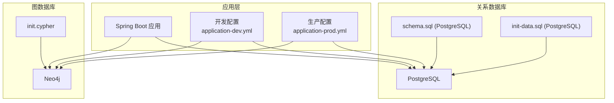
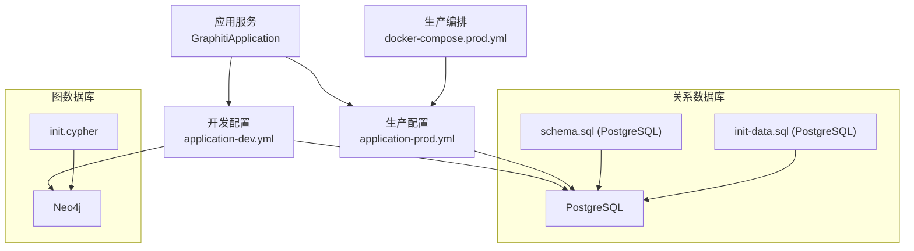
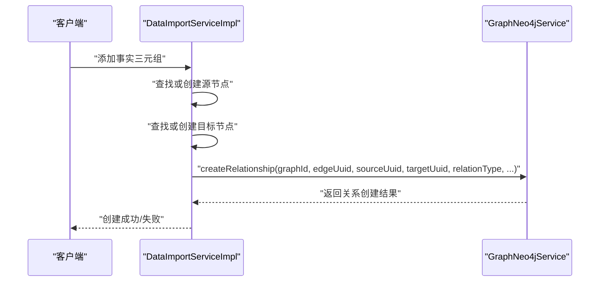
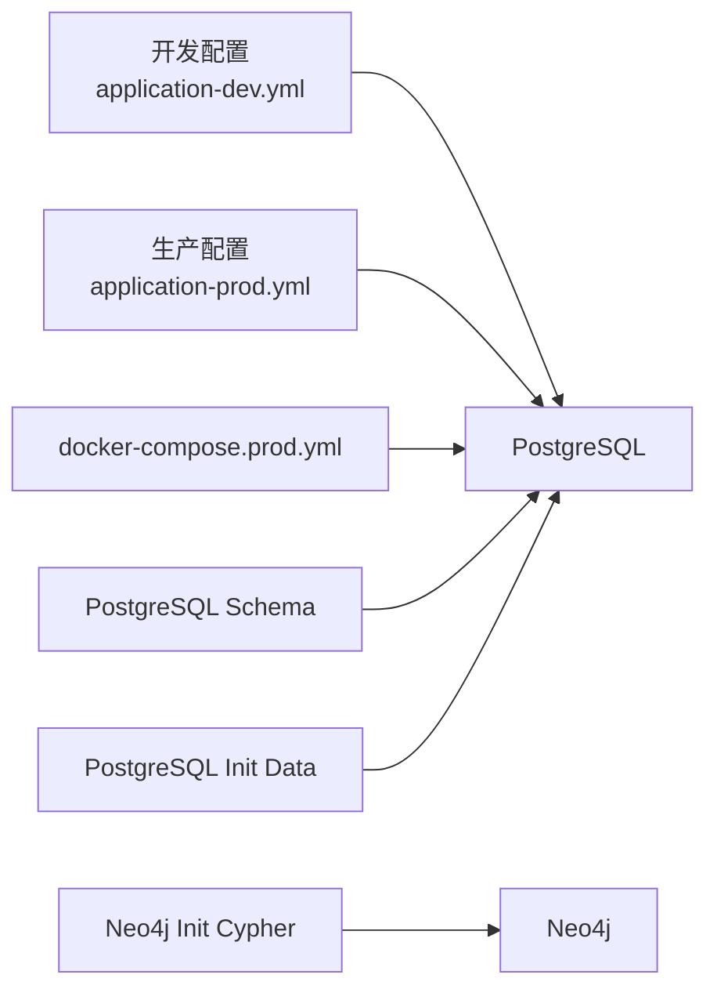

# 数据库故障

<!--<cite>
**本文引用的文件**
- [application.yml](file://ontograph-server/src/main/resources/application.yml)
- [application-dev.yml](file://ontograph-server/src/main/resources/application-dev.yml)
- [application-prod.yml](file://config/application-prod.yml)
- [docker-compose.prod.yml](file://docker-compose.prod.yml)
- [schema.sql (MySQL)](file://sql/mysql/schema.sql)
- [init-data.sql (MySQL)](file://sql/mysql/init-data.sql)
- [schema.sql (PostgreSQL)](file://sql/postgresql/schema.sql)
- [init-data.sql (PostgreSQL)](file://sql/postgresql/init-data.sql)
- [database-migration-guide.md](file://docs/database-migration-guide.md)
- [init.cypher](file://sql/neo4j/init.cypher)
- [2026-05-11-neo4j-relation-type-consistency.md](file://docs/plan/2026-05-11-neo4j-relation-type-consistency.md)
- [DataImportServiceImpl.java](file://ontograph-module-core/src/main/java/com/graphiti/module/graphiti/service/impl/DataImportServiceImpl.java)
</cite>-->

## 目录
1. [简介](#简介)
2. [项目结构](#项目结构)
3. [核心组件](#核心组件)
4. [架构总览](#架构总览)
5. [详细组件分析](#详细组件分析)
6. [依赖分析](#依赖分析)
7. [性能考虑](#性能考虑)
8. [故障排查指南](#故障排查指南)
9. [结论](#结论)
10. [附录](#附录)

## 简介
本文件面向OntoGraph项目的数据库运维与开发人员，聚焦于数据库故障排查与治理。内容涵盖：
- MySQL与PostgreSQL常见故障类型与解决方法（连接超时、死锁、索引失效、数据不一致）
- Neo4j图数据库的故障诊断（节点/关系完整性、索引重建、集群同步）
- 备份恢复策略与数据迁移过程中的问题处理
- 性能调优技巧（查询优化、索引设计、分区策略）
- 监控指标解读与预警机制
- 紧急情况下的数据恢复操作步骤与注意事项

## 项目结构
OntoGraph采用“后端服务 + 关系数据库(PostgreSQL) + 图数据库(Neo4j)”的组合架构。数据库相关配置集中在应用配置文件中，并通过SQL脚本完成初始化与迁移。

**图表来源**
- [application-dev.yml:487-676](file://ontograph-server/src/main/resources/application-dev.yml#L487-L676)
- [application-prod.yml:10-41](file://config/application-prod.yml#L10-L41)
- [schema.sql (PostgreSQL):1-319](file://sql/postgresql/schema.sql#L1-L319)
- [init-data.sql (PostgreSQL):1-110](file://sql/postgresql/init-data.sql#L1-L110)
- [init.cypher:1-33](file://sql/neo4j/init.cypher#L1-L33)

**章节来源**
- [application.yml:1-67](file://ontograph-server/src/main/resources/application.yml#L1-L67)
- [application-dev.yml:487-676](file://ontograph-server/src/main/resources/application-dev.yml#L487-L676)
- [application-prod.yml:10-41](file://config/application-prod.yml#L10-L41)
- [schema.sql (PostgreSQL):1-319](file://sql/postgresql/schema.sql#L1-L319)
- [init-data.sql (PostgreSQL):1-110](file://sql/postgresql/init-data.sql#L1-L110)
- [init.cypher:1-33](file://sql/neo4j/init.cypher#L1-L33)

## 核心组件
- 数据库连接与连接池
  - 开发/生产配置中均包含PostgreSQL连接信息与HikariCP连接池参数，便于统一管理与切换。
- SQL脚本与迁移
  - 提供MySQL到PostgreSQL的迁移指南与脚本，包含表结构、索引、初始化数据等。
- Neo4j初始化
  - 提供Cypher初始化脚本，包含唯一性约束与全文索引，支撑图谱检索与一致性校验。
- 服务层集成
  - 数据导入服务在创建关系时对关系类型进行参数化处理，避免硬编码导致的关系类型丢失。

**章节来源**
- [application-dev.yml:487-676](file://ontograph-server/src/main/resources/application-dev.yml#L487-L676)
- [application-prod.yml:10-41](file://config/application-prod.yml#L10-L41)
- [database-migration-guide.md:1-218](file://docs/database-migration-guide.md#L1-L218)
- [schema.sql (PostgreSQL):147-177](file://sql/postgresql/schema.sql#L147-L177)
- [init.cypher:1-33](file://sql/neo4j/init.cypher#L1-L33)
- [DataImportServiceImpl.java:213-220](file://ontograph-module-core/src/main/java/com/graphiti/module/graphiti/service/impl/DataImportServiceImpl.java#L213-L220)

## 架构总览
下图展示应用与数据库的交互关系，以及关键的配置与脚本位置。

**图表来源**
- [application-dev.yml:487-676](file://ontograph-server/src/main/resources/application-dev.yml#L487-L676)
- [application-prod.yml:10-41](file://config/application-prod.yml#L10-L41)
- [docker-compose.prod.yml:11-82](file://docker-compose.prod.yml#L11-L82)
- [schema.sql (PostgreSQL):1-319](file://sql/postgresql/schema.sql#L1-L319)
- [init-data.sql (PostgreSQL):1-110](file://sql/postgresql/init-data.sql#L1-L110)
- [init.cypher:1-33](file://sql/neo4j/init.cypher#L1-L33)

## 详细组件分析

### 关系数据库（PostgreSQL）故障排查
- 连接超时
  - 症状：应用启动或运行时报连接超时、HikariCP无法获取连接。
  - 排查要点：
    - 检查数据库监听地址、端口与网络连通性。
    - 核对HikariCP连接池参数（最大连接数、最小空闲、连接超时）。
    - 核对JDBC URL时区参数与字符集设置。
  - 解决建议：
    - 调整HikariCP参数，必要时增加最大连接数与空闲连接数。
    - 在JDBC URL中显式指定时区参数，避免解析异常。
    - 确认防火墙与pg_hba.conf配置允许访问。
- 死锁
  - 症状：事务长时间等待，出现死锁错误。
  - 排查要点：
    - 分析慢查询与长事务，识别热点表与并发写入模式。
    - 检查外键约束与级联删除引发的锁竞争。
  - 解决建议：
    - 降低事务粒度，缩短持有锁的时间。
    - 重试策略与幂等设计，避免重复提交。
    - 调整隔离级别与锁超时阈值。
- 索引失效
  - 症状：查询变慢，执行计划未使用预期索引。
  - 排查要点：
    - 使用EXPLAIN/ANALYZE分析执行计划。
    - 检查列统计信息是否过期，必要时更新。
    - 确认WHERE条件与索引列顺序一致。
  - 解决建议：
    - 为高频查询字段创建合适索引。
    - 定期维护统计信息与索引重建。
- 数据不一致
  - 症状：不同实例间数据差异，或迁移后字段类型不匹配。
  - 排查要点：
    - 对比迁移前后脚本差异，核对字段类型（如JSON/JSONB）。
    - 检查触发器与默认值是否正确生效。
  - 解决建议：
    - 使用迁移指南中的脚本逐项验证。
    - 引入一致性校验任务，定期扫描关键表。

**章节来源**
- [application-dev.yml:487-676](file://ontograph-server/src/main/resources/application-dev.yml#L487-L676)
- [application-prod.yml:10-41](file://config/application-prod.yml#L10-L41)
- [database-migration-guide.md:139-218](file://docs/database-migration-guide.md#L139-L218)
- [schema.sql (PostgreSQL):147-177](file://sql/postgresql/schema.sql#L147-L177)

### 图数据库（Neo4j）故障排查
- 节点与关系完整性
  - 症状：关系创建失败、节点缺失导致关系断链。
  - 排查要点：
    - 检查实体节点是否存在且属性唯一性约束满足。
    - 核对关系类型是否与初始化脚本一致。
  - 解决建议：
    - 在创建关系前先创建或查找节点，保证两端存在。
    - 使用唯一性约束与全文索引提升检索效率。
- 索引与全文检索
  - 症状：按名称或摘要检索缓慢。
  - 排查要点：
    - 确认实体节点的name、summary等属性是否建立索引。
  - 解决建议：
    - 按需重建全文索引，确保索引状态正常。
- 关系类型一致性
  - 症状：导入的事实三元组关系类型被忽略，统一为默认类型。
  - 排查要点：
    - 检查关系创建方法是否使用了正确的重载版本。
  - 解决建议：
    - 使用明确传递关系类型的重载方法，避免硬编码默认类型。
    - 在调用点增加空值保护与默认值处理。

**图表来源**
- [DataImportServiceImpl.java:213-220](file://ontograph-module-core/src/main/java/com/graphiti/module/graphiti/service/impl/DataImportServiceImpl.java#L213-L220)

**章节来源**
- [init.cypher:1-33](file://sql/neo4j/init.cypher#L1-L33)
- [2026-05-11-neo4j-relation-type-consistency.md:1-141](file://docs/superpowers/plans/2026-05-11-neo4j-relation-type-consistency.md#L1-L141)
- [DataImportServiceImpl.java:213-220](file://ontograph-module-core/src/main/java/com/graphiti/module/graphiti/service/impl/DataImportServiceImpl.java#L213-L220)

### 数据迁移与备份恢复
- 迁移策略
  - 使用pgLoader进行结构与数据迁移，或通过mysqldump转换后导入。
  - 迁移前后核对字段类型（如JSON/JSONB）、触发器与索引。
- 备份与恢复
  - 关系数据库：使用pg_dump/pg_restore进行全量与增量备份。
  - 图数据库：使用Neo4j内置备份工具或快照策略。
- 回滚方案
  - 若迁移失败，可回退至MySQL配置与脚本，重新初始化。

**章节来源**
- [database-migration-guide.md:113-218](file://docs/database-migration-guide.md#L113-L218)
- [schema.sql (PostgreSQL):1-319](file://sql/postgresql/schema.sql#L1-L319)
- [init-data.sql (PostgreSQL):1-110](file://sql/postgresql/init-data.sql#L1-L110)

## 依赖分析
- 配置依赖
  - 开发与生产配置分别指向不同的数据库实例与连接池参数。
- 运行时依赖
  - Docker编排文件提供生产环境的资源限制与健康检查。
- 脚本依赖
  - 初始化脚本与Cypher脚本为数据库与图数据库的启动前提。

**图表来源**
- [application-dev.yml:487-676](file://ontograph-server/src/main/resources/application-dev.yml#L487-L676)
- [application-prod.yml:10-41](file://config/application-prod.yml#L10-L41)
- [docker-compose.prod.yml:11-82](file://docker-compose.prod.yml#L11-L82)
- [schema.sql (PostgreSQL):1-319](file://sql/postgresql/schema.sql#L1-L319)
- [init-data.sql (PostgreSQL):1-110](file://sql/postgresql/init-data.sql#L1-L110)
- [init.cypher:1-33](file://sql/neo4j/init.cypher#L1-L33)

**章节来源**
- [application-dev.yml:487-676](file://ontograph-server/src/main/resources/application-dev.yml#L487-L676)
- [application-prod.yml:10-41](file://config/application-prod.yml#L10-L41)
- [docker-compose.prod.yml:11-82](file://docker-compose.prod.yml#L11-L82)

## 性能考虑
- 查询优化
  - 使用EXPLAIN/ANALYZE定位慢查询，结合索引与查询重写优化。
- 索引设计
  - 为高频过滤与排序字段创建索引，避免全表扫描。
- 连接池调优
  - 根据业务峰值调整最大连接数、空闲连接与超时参数。
- 分区策略
  - 对大表按时间或业务维度进行分区，降低扫描范围。

**章节来源**
- [database-migration-guide.md:815-842](file://docs/database-migration-guide.md#L815-L842)
- [schema.sql (PostgreSQL):147-177](file://sql/postgresql/schema.sql#L147-L177)

## 故障排查指南

### 关系数据库（PostgreSQL）
- 连接超时
  - 检查数据库监听与网络策略，确认HikariCP参数合理。
  - 参考：[application-dev.yml:487-676](file://ontograph-server/src/main/resources/application-dev.yml#L487-L676)、[application-prod.yml:10-41](file://config/application-prod.yml#L10-L41)
- 死锁
  - 降低事务粒度，引入重试与幂等；必要时调整隔离级别。
- 索引失效
  - 使用EXPLAIN/ANALYZE分析，重建索引并更新统计信息。
- 数据不一致
  - 对照迁移脚本逐项验证，确保触发器与默认值生效。

**章节来源**
- [application-dev.yml:487-676](file://ontograph-server/src/main/resources/application-dev.yml#L487-L676)
- [application-prod.yml:10-41](file://config/application-prod.yml#L10-L41)
- [database-migration-guide.md:139-218](file://docs/database-migration-guide.md#L139-L218)

### 图数据库（Neo4j）
- 节点/关系完整性
  - 确保实体节点存在且满足唯一性约束；关系类型与初始化脚本一致。
  - 参考：[init.cypher:1-33](file://sql/neo4j/init.cypher#L1-L33)
- 关系类型一致性
  - 使用正确的重载方法传递关系类型，避免硬编码默认类型。
  - 参考：[2026-05-11-neo4j-relation-type-consistency.md:1-141](file://docs/superpowers/plans/2026-05-11-neo4j-relation-type-consistency.md#L1-L141)、[DataImportServiceImpl.java:213-220](file://ontograph-module-core/src/main/java/com/graphiti/module/graphiti/service/impl/DataImportServiceImpl.java#L213-L220)

**章节来源**
- [init.cypher:1-33](file://sql/neo4j/init.cypher#L1-L33)
- [2026-05-11-neo4j-relation-type-consistency.md:1-141](file://docs/superpowers/plans/2026-05-11-neo4j-relation-type-consistency.md#L1-L141)
- [DataImportServiceImpl.java:213-220](file://ontograph-module-core/src/main/java/com/graphiti/module/graphiti/service/impl/DataImportServiceImpl.java#L213-L220)

### 监控与预警
- 健康检查
  - 生产环境通过健康探针检测数据库与Redis可用性。
  - 参考：[docker-compose.prod.yml:43-48](file://docker-compose.prod.yml#L43-L48)、[application-prod.yml:10-41](file://config/application-prod.yml#L10-L41)
- 指标采集
  - 结合Actuator与Prometheus（如启用）采集数据库连接池与查询性能指标。

**章节来源**
- [docker-compose.prod.yml:43-48](file://docker-compose.prod.yml#L43-L48)
- [application-prod.yml:10-41](file://config/application-prod.yml#L10-L41)

### 紧急恢复操作
- 快速回滚
  - 回退至MySQL配置与脚本，重新初始化数据库。
  - 参考：[database-migration-guide.md:192-200](file://docs/database-migration-guide.md#L192-L200)
- 数据恢复
  - 使用pg_dump/pg_restore进行全量恢复；Neo4j使用快照或备份工具恢复。
- 验证
  - 通过初始化脚本与样例数据验证数据库与图数据库一致性。

**章节来源**
- [database-migration-guide.md:192-200](file://docs/database-migration-guide.md#L192-L200)
- [init-data.sql (PostgreSQL):1-110](file://sql/postgresql/init-data.sql#L1-L110)
- [init.cypher:1-33](file://sql/neo4j/init.cypher#L1-L33)

## 结论
通过规范化的配置、完善的脚本与严格的监控，OntoGraph能够在PostgreSQL与Neo4j环境下稳定运行。遇到故障时，建议优先从连接与索引入手排查，结合迁移脚本与初始化脚本进行一致性验证，并制定清晰的回滚与恢复流程，确保业务连续性。

## 附录
- 关键配置与脚本路径
  - 开发配置：[application-dev.yml:487-676](file://ontograph-server/src/main/resources/application-dev.yml#L487-L676)
  - 生产配置：[application-prod.yml:10-41](file://config/application-prod.yml#L10-L41)
  - Docker编排：[docker-compose.prod.yml:11-82](file://docker-compose.prod.yml#L11-L82)
  - PostgreSQL脚本：[schema.sql:1-319](file://sql/postgresql/schema.sql#L1-L319)、[init-data.sql:1-110](file://sql/postgresql/init-data.sql#L1-L110)
  - Neo4j脚本：[init.cypher:1-33](file://sql/neo4j/init.cypher#L1-L33)
  - 迁移指南：[database-migration-guide.md:1-218](file://docs/database-migration-guide.md#L1-L218)