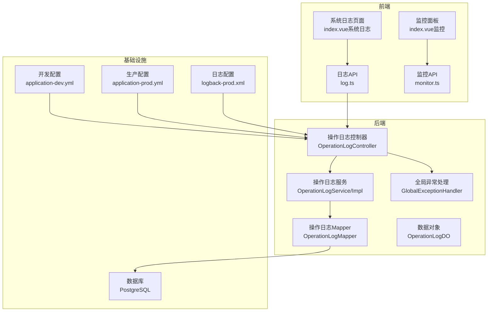
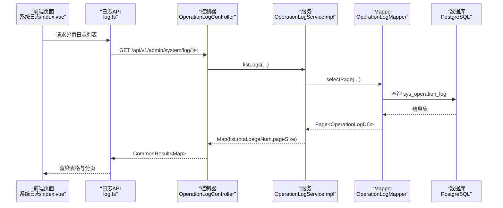
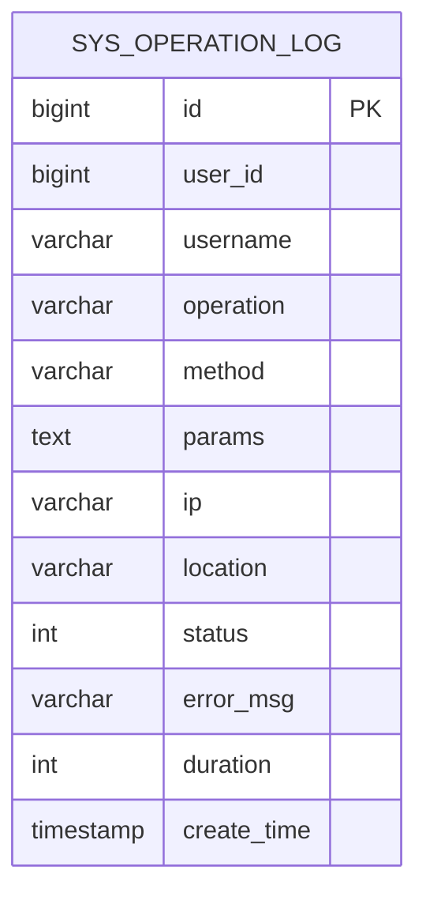
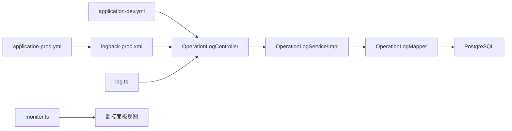

# 日志分析

<cite>
**本文引用的文件**
- [application.yml](file://graphiti-server/src/main/resources/application.yml)
- [application-dev.yml](file://graphiti-server/src/main/resources/application-dev.yml)
- [application-prod.yml](file://config/application-prod.yml)
- [logback-prod.xml](file://config/logback-prod.xml)
- [OperationLogController.java](file://graphiti-module-system/src/main/java/com/graphiti/system/controller/OperationLogController.java)
- [OperationLogService.java](file://graphiti-module-system/src/main/java/com/graphiti/system/service/OperationLogService.java)
- [OperationLogServiceImpl.java](file://graphiti-module-system/src/main/java/com/graphiti/system/service/impl/OperationLogServiceImpl.java)
- [OperationLogDO.java](file://graphiti-module-system/src/main/java/com/graphiti/system/dal/dataobject/OperationLogDO.java)
- [OperationLogMapper.java](file://graphiti-module-system/src/main/java/com/graphiti/system/dal/mysql/OperationLogMapper.java)
- [log.ts](file://graphiti-web/src/api/log.ts)
- [index.vue（系统日志）](file://graphiti-web/src/views/system/log/index.vue)
- [monitor.ts](file://graphiti-web/src/api/monitor.ts)
- [index.vue（监控面板）](file://graphiti-web/src/views/monitor/index.vue)
- [GlobalExceptionHandler.java](file://graphiti-framework/graphiti-common/src/main/java/com/raphiti/common/exception/GlobalExceptionHandler.java)
- [BusinessException.java](file://graphiti-framework/graphiti-common/src/main/java/com/graphiti/common/exception/BusinessException.java)
- [schema.sql（PostgreSQL）](file://sql/postgresql/schema.sql)
- [2026-05-11-backend-api-impl-design.md](file://docs/superpowers/specs/2026-05-11-backend-api-impl-design.md)
</cite>

## 目录
1. [简介](#简介)
2. [项目结构](#项目结构)
3. [核心组件](#核心组件)
4. [架构总览](#架构总览)
5. [详细组件分析](#详细组件分析)
6. [依赖分析](#依赖分析)
7. [性能考虑](#性能考虑)
8. [故障排查指南](#故障排查指南)
9. [结论](#结论)
10. [附录](#附录)

## 简介
本文件面向Graphiti-Java项目的日志分析与监控，系统性说明日志配置、输出格式、存储位置、关键字段与分析技巧，并提供检索与过滤最佳实践、性能瓶颈定位、错误模式识别、系统异常排查以及日志轮转与聚合方案。

## 项目结构
- 配置层
  - 开发环境配置：application-dev.yml
  - 生产环境配置：application-prod.yml
  - 日志配置：logback-prod.xml
- 控制器与服务层
  - 操作日志：OperationLogController、OperationLogService、OperationLogServiceImpl、OperationLogDO、OperationLogMapper
- 前端层
  - 日志管理页面：graphiti-web/src/views/system/log/index.vue
  - 日志API封装：graphiti-web/src/api/log.ts
  - 监控面板：graphiti-web/src/views/monitor/index.vue
  - 监控API封装：graphiti-web/src/api/monitor.ts
- 异常与全局处理
  - GlobalExceptionHandler、BusinessException

**图表来源**
- [application-dev.yml:608-676](file://graphiti-server/src/main/resources/application-dev.yml#L608-L676)
- [application-prod.yml:196-205](file://config/application-prod.yml#L196-L205)
- [logback-prod.xml:1-84](file://config/logback-prod.xml#L1-L84)
- [OperationLogController.java:1-33](file://graphiti-module-system/src/main/java/com/graphiti/system/controller/OperationLogController.java#L1-L33)
- [OperationLogService.java:1-44](file://graphiti-module-system/src/main/java/com/graphiti/system/service/OperationLogService.java#L1-L44)
- [OperationLogServiceImpl.java:34-71](file://graphiti-module-system/src/main/java/com/graphiti/system/service/impl/OperationLogServiceImpl.java#L34-L71)
- [OperationLogDO.java:1-41](file://graphiti-module-system/src/main/java/com/graphiti/system/dal/dataobject/OperationLogDO.java#L1-L41)
- [OperationLogMapper.java:1-12](file://graphiti-module-system/src/main/java/com/graphiti/system/dal/mysql/OperationLogMapper.java#L1-L12)
- [log.ts:1-133](file://graphiti-web/src/api/log.ts#L1-L133)
- [index.vue（系统日志）:1-406](file://graphiti-web/src/views/system/log/index.vue#L1-L406)
- [monitor.ts:89-122](file://graphiti-web/src/api/monitor.ts#L89-L122)
- [index.vue（监控面板）:171-494](file://graphiti-web/src/views/monitor/index.vue#L171-L494)

**章节来源**
- [application.yml:35-67](file://graphiti-server/src/main/resources/application.yml#L35-L67)
- [application-dev.yml:608-676](file://graphiti-server/src/main/resources/application-dev.yml#L608-L676)
- [application-prod.yml:196-205](file://config/application-prod.yml#L196-L205)
- [logback-prod.xml:1-84](file://config/logback-prod.xml#L1-L84)

## 核心组件
- 日志系统
  - 开发环境：控制台输出，时间戳+线程+级别+Logger+消息
  - 生产环境：logback-prod.xml统一配置，控制台输出与异步文件输出，按日期+大小滚动，保留30天
- 操作日志
  - 后端提供分页查询、详情、删除、清空、导出能力
  - 前端提供筛选、分页、导出Excel、查看详情
- 异常处理
  - 全局异常捕获并记录，区分业务异常与通用异常

**章节来源**
- [application.yml:35-67](file://graphiti-server/src/main/resources/application.yml#L35-L67)
- [application-dev.yml:636-643](file://graphiti-server/src/main/resources/application-dev.yml#L636-L643)
- [application-prod.yml:196-205](file://config/application-prod.yml#L196-L205)
- [logback-prod.xml:26-56](file://config/logback-prod.xml#L26-L56)
- [OperationLogController.java:27-56](file://graphiti-module-system/src/main/java/com/graphiti/system/controller/OperationLogController.java#L27-L56)
- [OperationLogService.java:14-44](file://graphiti-module-system/src/main/java/com/graphiti/system/service/OperationLogService.java#L14-L44)
- [OperationLogServiceImpl.java:34-71](file://graphiti-module-system/src/main/java/com/graphiti/system/service/impl/OperationLogServiceImpl.java#L34-L71)
- [log.ts:36-131](file://graphiti-web/src/api/log.ts#L36-L131)
- [index.vue（系统日志）:249-355](file://graphiti-web/src/views/system/log/index.vue#L249-L355)
- [GlobalExceptionHandler.java:26-72](file://graphiti-framework/graphiti-common/src/main/java/com/graphiti/common/exception/GlobalExceptionHandler.java#L26-L72)

## 架构总览
日志从应用产生，经由Spring Boot日志框架输出至控制台与文件；生产环境采用异步文件Appender提升吞吐；前端通过API访问后端日志与监控数据，实现可视化展示与检索。

**图表来源**
- [OperationLogController.java:27-56](file://graphiti-module-system/src/main/java/com/graphiti/system/controller/OperationLogController.java#L27-L56)
- [OperationLogService.java:14-17](file://graphiti-module-system/src/main/java/com/graphiti/system/service/OperationLogService.java#L14-L17)
- [OperationLogServiceImpl.java:34-56](file://graphiti-module-system/src/main/java/com/graphiti/system/service/impl/OperationLogServiceImpl.java#L34-L56)
- [OperationLogMapper.java:1-12](file://graphiti-module-system/src/main/java/com/graphiti/system/dal/mysql/OperationLogMapper.java#L1-L12)
- [log.ts:36-73](file://graphiti-web/src/api/log.ts#L36-L73)
- [index.vue（系统日志）:249-263](file://graphiti-web/src/views/system/log/index.vue#L249-L263)

## 详细组件分析

### 日志配置与输出
- 开发环境
  - application-dev.yml中开启DEBUG级别，覆盖com.graphiti、org.springframework.security、org.springframework.web、org.springframework.boot等包
  - 控制台输出格式包含时间、线程、级别、Logger、消息
- 生产环境
  - application-prod.yml指定logback-prod.xml为日志配置
  - logback-prod.xml
    - 控制台输出：标准格式
    - 文件输出：异步RollingFileAppender，按日期+大小滚动，保留30天
    - 第三方库日志级别调优，降低噪音
- 运维建议
  - 生产环境建议启用JSON格式编码器以利于日志聚合系统解析（logstash-logback-encoder可选）

**章节来源**
- [application-dev.yml:636-643](file://graphiti-server/src/main/resources/application-dev.yml#L636-L643)
- [application.yml:35-42](file://graphiti-server/src/main/resources/application.yml#L35-L42)
- [application-prod.yml:196-205](file://config/application-prod.yml#L196-L205)
- [logback-prod.xml:13-14](file://config/logback-prod.xml#L13-L14)
- [logback-prod.xml:27-48](file://config/logback-prod.xml#L27-L48)
- [logback-prod.xml:51-56](file://config/logback-prod.xml#L51-L56)
- [logback-prod.xml:74-82](file://config/logback-prod.xml#L74-L82)

### 操作日志（业务日志）
- 数据模型
  - 字段：id、userId、username、operation、method、params、ip、location、status、errorMsg、duration、createTime
  - 注释：明确各字段含义，如status取值0/1表示失败/成功，duration单位为毫秒
- 功能接口
  - 分页查询、详情、删除、清空、导出
  - 前端支持按用户名、操作名、状态、时间范围筛选
- 存储与索引
  - PostgreSQL建表脚本包含字段注释与索引设计

**图表来源**
- [OperationLogDO.java:17-41](file://graphiti-module-system/src/main/java/com/graphiti/system/dal/dataobject/OperationLogDO.java#L17-L41)
- [schema.sql（PostgreSQL）:261-270](file://sql/postgresql/schema.sql#L261-L270)

**章节来源**
- [OperationLogController.java:27-56](file://graphiti-module-system/src/main/java/com/graphiti/system/controller/OperationLogController.java#L27-L56)
- [OperationLogService.java:14-44](file://graphiti-module-system/src/main/java/com/graphiti/system/service/OperationLogService.java#L14-L44)
- [OperationLogServiceImpl.java:34-71](file://graphiti-module-system/src/main/java/com/graphiti/system/service/impl/OperationLogServiceImpl.java#L34-L71)
- [OperationLogDO.java:17-41](file://graphiti-module-system/src/main/java/com/graphiti/system/dal/dataobject/OperationLogDO.java#L17-L41)
- [OperationLogMapper.java:1-12](file://graphiti-module-system/src/main/java/com/graphiti/system/dal/mysql/OperationLogMapper.java#L1-L12)
- [schema.sql（PostgreSQL）:261-270](file://sql/postgresql/schema.sql#L261-L270)

### 异常日志（错误日志）
- 全局异常处理
  - 捕获业务异常、参数校验异常、缺少请求参数异常、其他未知异常
  - 对业务异常记录错误码与消息；对通用异常记录堆栈
- 建议
  - 在业务层抛出带语义的BusinessException，便于前端与日志统一处理

**章节来源**
- [GlobalExceptionHandler.java:26-72](file://graphiti-framework/graphiti-common/src/main/java/com/graphiti/common/exception/GlobalExceptionHandler.java#L26-L72)
- [BusinessException.java:10-32](file://graphiti-framework/graphiti-common/src/main/java/com/graphiti/common/exception/BusinessException.java#L10-L32)

### 性能日志与监控
- 监控指标
  - Actuator端点：health、info、metrics、prometheus
  - 前端监控面板展示CPU使用率、内存使用率、磁盘使用率、Neo4j/MySQL/Redis健康状态、运行时长等
- 日志与监控联动
  - 将关键业务耗时duration纳入前端可视化，辅助定位慢请求

**章节来源**
- [application-prod.yml:175-195](file://config/application-prod.yml#L175-L195)
- [monitor.ts:89-122](file://graphiti-web/src/api/monitor.ts#L89-L122)
- [index.vue（监控面板）:256-288](file://graphiti-web/src/views/monitor/index.vue#L256-L288)

## 依赖分析
- 配置依赖
  - application-dev.yml与application-prod.yml分别决定开发/生产日志级别与输出
  - logback-prod.xml决定生产日志输出格式、滚动策略与第三方库日志级别
- 控制器依赖
  - OperationLogController依赖OperationLogService
  - Service依赖Mapper与DO
- 前端依赖
  - log.ts封装后端日志接口；index.vue渲染与交互
  - monitor.ts封装Actuator监控接口；index.vue展示监控面板

**图表来源**
- [application-dev.yml:636-643](file://graphiti-server/src/main/resources/application-dev.yml#L636-L643)
- [application-prod.yml:196-205](file://config/application-prod.yml#L196-L205)
- [logback-prod.xml:59-82](file://config/logback-prod.xml#L59-L82)
- [OperationLogController.java:25-26](file://graphiti-module-system/src/main/java/com/graphiti/system/controller/OperationLogController.java#L25-L26)
- [OperationLogService.java:10-11](file://graphiti-module-system/src/main/java/com/graphiti/system/service/OperationLogService.java#L10-L11)
- [OperationLogServiceImpl.java:34-56](file://graphiti-module-system/src/main/java/com/graphiti/system/service/impl/OperationLogServiceImpl.java#L34-L56)
- [OperationLogMapper.java:1-12](file://graphiti-module-system/src/main/java/com/graphiti/system/dal/mysql/OperationLogMapper.java#L1-L12)
- [log.ts:36-73](file://graphiti-web/src/api/log.ts#L36-L73)
- [monitor.ts:89-122](file://graphiti-web/src/api/monitor.ts#L89-L122)

**章节来源**
- [application-dev.yml:636-643](file://graphiti-server/src/main/resources/application-dev.yml#L636-L643)
- [application-prod.yml:196-205](file://config/application-prod.yml#L196-L205)
- [logback-prod.xml:59-82](file://config/logback-prod.xml#L59-L82)
- [OperationLogController.java:25-26](file://graphiti-module-system/src/main/java/com/graphiti/system/controller/OperationLogController.java#L25-L26)
- [OperationLogService.java:10-11](file://graphiti-module-system/src/main/java/com/graphiti/system/service/OperationLogService.java#L10-L11)
- [OperationLogServiceImpl.java:34-56](file://graphiti-module-system/src/main/java/com/graphiti/system/service/impl/OperationLogServiceImpl.java#L34-L56)
- [OperationLogMapper.java:1-12](file://graphiti-module-system/src/main/java/com/graphiti/system/dal/mysql/OperationLogMapper.java#L1-L12)
- [log.ts:36-73](file://graphiti-web/src/api/log.ts#L36-L73)
- [monitor.ts:89-122](file://graphiti-web/src/api/monitor.ts#L89-L122)

## 性能考虑
- 生产日志
  - 异步文件Appender减少IO阻塞
  - 按日期+大小滚动，避免单文件过大
  - 保留策略：30天，总量上限3GB
- 建议
  - 针对热点接口，结合业务日志duration字段进行趋势分析
  - 使用监控面板CPU/内存指标与日志错误模式交叉验证

**章节来源**
- [logback-prod.xml:35-56](file://config/logback-prod.xml#L35-L56)
- [index.vue（监控面板）:256-288](file://graphiti-web/src/views/monitor/index.vue#L256-L288)

## 故障排查指南
- 快速定位
  - 业务异常：查看全局异常处理记录的错误码与消息
  - 参数异常：校验请求参数缺失或格式错误
  - 通用异常：检查堆栈日志
- 日志检索
  - 使用时间范围、用户名、操作名、状态筛选
  - 结合duration字段识别慢请求
- 常见问题
  - 日志量过大：调整日志级别与滚动策略
  - 日志格式不统一：生产环境启用JSON编码器
  - 权限不足：确认Actuator端点暴露与鉴权配置

**章节来源**
- [GlobalExceptionHandler.java:26-72](file://graphiti-framework/graphiti-common/src/main/java/com/graphiti/common/exception/GlobalExceptionHandler.java#L26-L72)
- [index.vue（系统日志）:266-290](file://graphiti-web/src/views/system/log/index.vue#L266-L290)
- [logback-prod.xml:16-24](file://config/logback-prod.xml#L16-L24)

## 结论
Graphiti-Java的日志体系在开发与生产环境分别采用差异化配置，既保证开发调试效率，又满足生产性能与合规要求。结合操作日志与监控面板，可实现对请求行为、性能与异常的全链路观测与快速定位。

## 附录

### 关键日志字段与含义
- 业务日志（sys_operation_log）
  - id：日志主键
  - userId/username：操作用户
  - operation：操作名称
  - method：请求方法与路径
  - params：请求参数（JSON）
  - ip/location：来源IP与地理信息
  - status：0-失败 1-成功
  - errorMsg：错误信息
  - duration：耗时（毫秒）
  - createTime：创建时间

**章节来源**
- [OperationLogDO.java:17-41](file://graphiti-module-system/src/main/java/com/graphiti/system/dal/dataobject/OperationLogDO.java#L17-L41)
- [schema.sql（PostgreSQL）:261-270](file://sql/postgresql/schema.sql#L261-L270)

### 日志检索与过滤最佳实践
- 前端
  - 使用系统日志页面的筛选条件（用户名、操作、状态、时间范围）
  - 导出Excel以便离线分析
- 工具
  - grep/awk：按关键字、时间、状态过滤
  - jq：解析JSON格式日志（如启用JSON编码器）

**章节来源**
- [index.vue（系统日志）:266-290](file://graphiti-web/src/views/system/log/index.vue#L266-L290)
- [log.ts:36-131](file://graphiti-web/src/api/log.ts#L36-L131)

### 日志轮转与存储管理
- 轮转策略
  - 按日期滚动
  - 单文件最大100MB
  - 保留30天，总量上限3GB
- 存储位置
  - 文件输出路径：/app/logs/graphiti-java.log
- 建议
  - 配合日志聚合系统（如ELK/Fluentd）集中收集与持久化

**章节来源**
- [logback-prod.xml:35-48](file://config/logback-prod.xml#L35-L48)
- [logback-prod.xml:67-71](file://config/logback-prod.xml#L67-L71)

### 日志聚合方案
- 生产环境建议启用JSON编码器，便于结构化解析
- 通过Docker log driver或Agent收集stdout/stderr
- 集成Prometheus/Grafana进行指标可视化

**章节来源**
- [logback-prod.xml:16-24](file://config/logback-prod.xml#L16-L24)
- [application-prod.yml:175-195](file://config/application-prod.yml#L175-L195)

### API与页面映射参考
- 后端API
  - GET /api/v1/admin/system/log/list：分页查询操作日志
  - GET /api/v1/admin/system/log/{id}：获取日志详情
  - DELETE /api/v1/admin/system/log/{id}：删除日志
  - DELETE /api/v1/admin/system/log/clear：清空日志
  - GET /api/v1/admin/system/log/export：导出日志
- 前端页面
  - 系统日志管理：index.vue
  - 监控面板：index.vue（监控）

**章节来源**
- [2026-05-11-backend-api-impl-design.md:139-181](file://docs/superpowers/specs/2026-05-11-backend-api-impl-design.md#L139-L181)
- [OperationLogController.java:27-56](file://graphiti-module-system/src/main/java/com/graphiti/system/controller/OperationLogController.java#L27-L56)
- [log.ts:36-131](file://graphiti-web/src/api/log.ts#L36-L131)
- [index.vue（系统日志）:249-355](file://graphiti-web/src/views/system/log/index.vue#L249-L355)