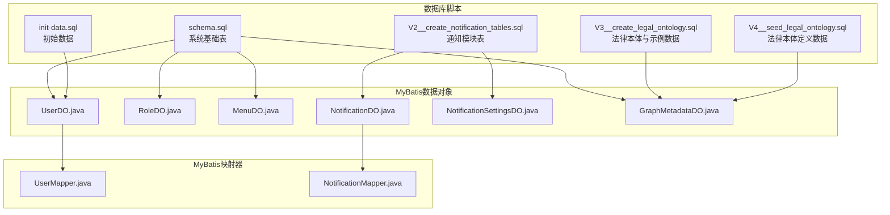
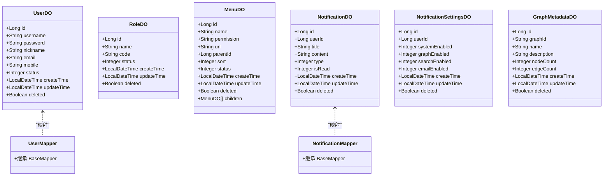
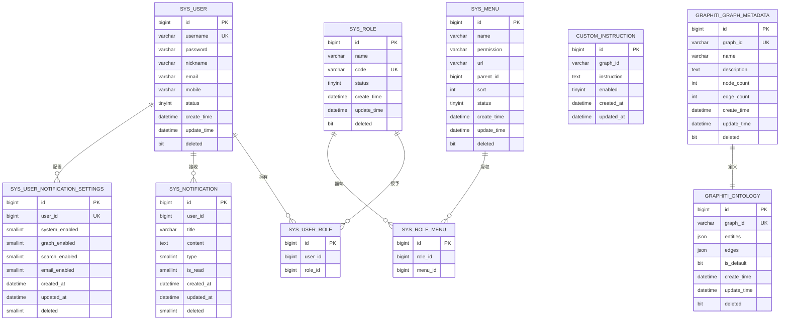
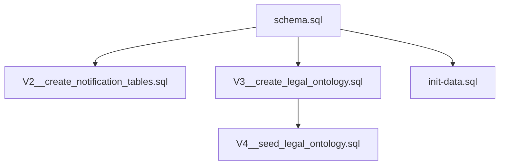

# MySQL数据库实现

<cite>
**本文档引用的文件**
- [schema.sql](file://sql/mysql/schema.sql)
- [init-data.sql](file://sql/mysql/init-data.sql)
- [V2__create_notification_tables.sql](file://sql/mysql/V2__create_notification_tables.sql)
- [V3__create_legal_ontology.sql](file://sql/mysql/V3__create_legal_ontology.sql)
- [V4__seed_legal_ontology.sql](file://sql/mysql/V4__seed_legal_ontology.sql)
- [UserDO.java](file://graphiti-module-system/src/main/java/com/graphiti/system/dal/dataobject/UserDO.java)
- [RoleDO.java](file://graphiti-module-system/src/main/java/com/graphiti/system/dal/dataobject/RoleDO.java)
- [MenuDO.java](file://graphiti-module-system/src/main/java/com/graphiti/system/dal/dataobject/MenuDO.java)
- [NotificationDO.java](file://graphiti-module-system/src/main/java/com/graphiti/system/dal/dataobject/NotificationDO.java)
- [NotificationSettingsDO.java](file://graphiti-module-system/src/main/java/com/graphiti/system/dal/dataobject/NotificationSettingsDO.java)
- [UserMapper.java](file://graphiti-module-system/src/main/java/com/graphiti/system/dal/mysql/UserMapper.java)
- [NotificationMapper.java](file://graphiti-module-system/src/main/java/com/graphiti/system/dal/mysql/NotificationMapper.java)
- [GraphMetadataDO.java](file://graphiti-module-core/src/main/java/com/graphiti/module/graphiti/dal/dataobject/GraphMetadataDO.java)
</cite>

## 目录
1. [简介](#简介)
2. [项目结构](#项目结构)
3. [核心组件](#核心组件)
4. [架构总览](#架构总览)
5. [详细组件分析](#详细组件分析)
6. [依赖分析](#依赖分析)
7. [性能考虑](#性能考虑)
8. [故障排查指南](#故障排查指南)
9. [结论](#结论)
10. [附录](#附录)

## 简介
本文件面向数据库管理员与后端开发工程师，系统化梳理Graphiti Java项目在MySQL上的数据库实现。内容涵盖：
- 完整的表结构定义、字段类型选择、主键外键约束与索引策略
- 系统管理模块与法律本体相关表设计说明
- 数据库初始化脚本与数据种子的执行顺序与依赖关系
- DDL创建语句与数据导入方案
- 版本迁移脚本的设计模式与升级策略
- 性能优化建议、查询调优技巧与维护最佳实践
- 运维操作指南与常见问题排查方法

## 项目结构
本项目的数据库相关实现主要分布在以下位置：
- MySQL初始化与迁移脚本位于 sql/mysql 目录
- MyBatis数据对象与映射器位于 graphiti-module-system 与 graphiti-module-core 的 dal 包中
- 系统模块负责用户、角色、菜单、通知、操作日志、系统配置、搜索历史等表
- 核心模块负责图谱元数据与本体定义等表

**图表来源**
- [schema.sql:1-196](file://sql/mysql/schema.sql#L1-L196)
- [V2__create_notification_tables.sql:1-49](file://sql/mysql/V2__create_notification_tables.sql#L1-L49)
- [V3__create_legal_ontology.sql:1-683](file://sql/mysql/V3__create_legal_ontology.sql#L1-L683)
- [V4__seed_legal_ontology.sql:1-345](file://sql/mysql/V4__seed_legal_ontology.sql#L1-L345)
- [init-data.sql:1-17](file://sql/mysql/init-data.sql#L1-L17)
- [UserDO.java:1-38](file://graphiti-module-system/src/main/java/com/graphiti/system/dal/dataobject/UserDO.java#L1-L38)
- [RoleDO.java:1-32](file://graphiti-module-system/src/main/java/com/graphiti/system/dal/dataobject/RoleDO.java#L1-L32)
- [MenuDO.java:1-45](file://graphiti-module-system/src/main/java/com/graphiti/system/dal/dataobject/MenuDO.java#L1-L45)
- [NotificationDO.java:1-36](file://graphiti-module-system/src/main/java/com/graphiti/system/dal/dataobject/NotificationDO.java#L1-L36)
- [NotificationSettingsDO.java:1-36](file://graphiti-module-system/src/main/java/com/graphiti/system/dal/dataobject/NotificationSettingsDO.java#L1-L36)
- [GraphMetadataDO.java:1-60](file://graphiti-module-core/src/main/java/com/graphiti/module/graphiti/dal/dataobject/GraphMetadataDO.java#L1-L60)
- [UserMapper.java:1-13](file://graphiti-module-system/src/main/java/com/graphiti/system/dal/mysql/UserMapper.java#L1-L13)
- [NotificationMapper.java:1-13](file://graphiti-module-system/src/main/java/com/graphiti/system/dal/mysql/NotificationMapper.java#L1-L13)

**章节来源**
- [schema.sql:1-196](file://sql/mysql/schema.sql#L1-L196)
- [V2__create_notification_tables.sql:1-49](file://sql/mysql/V2__create_notification_tables.sql#L1-L49)
- [V3__create_legal_ontology.sql:1-683](file://sql/mysql/V3__create_legal_ontology.sql#L1-L683)
- [V4__seed_legal_ontology.sql:1-345](file://sql/mysql/V4__seed_legal_ontology.sql#L1-L345)
- [init-data.sql:1-17](file://sql/mysql/init-data.sql#L1-L17)

## 核心组件
本节概述MySQL数据库的核心表与职责划分。

- 系统用户表（sys_user）
  - 字段：主键、用户名（唯一）、密码（BCrypt加密）、昵称、邮箱、手机、状态、时间戳、逻辑删除
  - 索引：主键、用户名唯一索引
  - 设计要点：采用BCrypt存储密码，统一时间戳字段命名，逻辑删除避免物理删除风险

- 系统角色表（sys_role）
  - 字段：主键、角色名称、角色编码（唯一）、状态、时间戳、逻辑删除
  - 索引：主键、编码唯一索引
  - 设计要点：编码作为权限识别的关键标识

- 用户角色关联表（sys_user_role）
  - 字段：主键、用户ID、角色ID
  - 索引：主键、唯一索引（用户ID, 角色ID）、用户ID与角色ID独立索引
  - 设计要点：支持多对多关系，便于权限矩阵扩展

- 系统菜单表（sys_menu）
  - 字段：主键、菜单名称、权限标识、URL、父ID、排序、状态、时间戳、逻辑删除
  - 索引：主键
  - 设计要点：支持树形菜单结构，权限标识用于鉴权

- 角色菜单关联表（sys_role_menu）
  - 字段：主键、角色ID、菜单ID
  - 索引：主键、唯一索引（角色ID, 菜单ID）、角色ID与菜单ID独立索引
  - 设计要点：角色到菜单的授权映射

- 图谱元数据表（graphiti_graph_metadata）
  - 字段：主键、图谱ID（UUID唯一）、名称、描述、节点数、边数、时间戳、逻辑删除
  - 索引：主键、图谱ID唯一索引
  - 设计要点：统一管理不同知识图谱的元信息

- 本体定义表（graphiti_ontology）
  - 字段：主键、图谱ID、实体定义（JSON）、关系定义（JSON）、是否默认、时间戳、逻辑删除
  - 索引：主键、图谱ID唯一索引
  - 设计要点：JSON存储动态本体定义，支持实体与关系的灵活扩展

- 自定义指令表（graphiti_custom_instruction）
  - 字段：主键、图谱ID、指令内容、类型、时间戳、逻辑删除
  - 索引：主键、图谱ID索引
  - 设计要点：按图谱隔离的抽取提示词

- 系统操作日志表（sys_operation_log）
  - 字段：主键、用户ID、用户名、操作名称、请求方法与路径、参数（JSON）、IP、地理、状态、错误信息、耗时、时间戳
  - 索引：主键、用户名、操作、创建时间
  - 设计要点：便于审计与问题追踪

- 系统配置表（sys_system_config）
  - 字段：主键、配置键（唯一）、配置值、配置名称、描述、类型、分组、排序、状态、时间戳、逻辑删除
  - 索引：主键、配置键唯一索引、分组索引
  - 设计要点：集中化配置管理

- 搜索历史表（sys_search_history）
  - 字段：主键、用户ID、搜索词、模式、结果数量、时间戳
  - 索引：主键、用户ID、创建时间
  - 设计要点：支持个性化搜索推荐与趋势分析

- 通知表（sys_notification）
  - 字段：主键、用户ID、标题、内容、类型、已读状态、时间戳、逻辑删除
  - 索引：主键、用户ID、类型、已读状态、创建时间倒序
  - 设计要点：按用户维度快速检索与分页

- 用户通知设置表（sys_user_notification_settings）
  - 字段：主键、用户ID（唯一）、各类通知开关、邮件开关、时间戳、逻辑删除
  - 索引：主键、用户ID唯一索引
  - 设计要点：统一控制通知偏好

- 自定义抽取指令表（custom_instruction）
  - 字段：主键、图谱ID（可空）、指令内容、启用状态、时间戳
  - 索引：主键、图谱ID、启用状态
  - 设计要点：全局/图谱级指令，支持启用/禁用

**章节来源**
- [schema.sql:11-196](file://sql/mysql/schema.sql#L11-L196)
- [V2__create_notification_tables.sql:6-49](file://sql/mysql/V2__create_notification_tables.sql#L6-L49)

## 架构总览
下图展示MySQL层与Java持久层（MyBatis）的对应关系与交互：

**图表来源**
- [UserDO.java:1-38](file://graphiti-module-system/src/main/java/com/graphiti/system/dal/dataobject/UserDO.java#L1-L38)
- [RoleDO.java:1-32](file://graphiti-module-system/src/main/java/com/graphiti/system/dal/dataobject/RoleDO.java#L1-L32)
- [MenuDO.java:1-45](file://graphiti-module-system/src/main/java/com/graphiti/system/dal/dataobject/MenuDO.java#L1-L45)
- [NotificationDO.java:1-36](file://graphiti-module-system/src/main/java/com/graphiti/system/dal/dataobject/NotificationDO.java#L1-L36)
- [NotificationSettingsDO.java:1-36](file://graphiti-module-system/src/main/java/com/graphiti/system/dal/dataobject/NotificationSettingsDO.java#L1-L36)
- [GraphMetadataDO.java:1-60](file://graphiti-module-core/src/main/java/com/graphiti/module/graphiti/dal/dataobject/GraphMetadataDO.java#L1-L60)
- [UserMapper.java:1-13](file://graphiti-module-system/src/main/java/com/graphiti/system/dal/mysql/UserMapper.java#L1-L13)
- [NotificationMapper.java:1-13](file://graphiti-module-system/src/main/java/com/graphiti/system/dal/mysql/NotificationMapper.java#L1-L13)

## 详细组件分析

### 系统管理模块表设计
- 用户表（sys_user）
  - 字段类型选择：用户名与密码使用VARCHAR，邮箱与手机号使用VARCHAR，状态使用TINYINT，时间戳使用DATETIME，逻辑删除使用BIT
  - 约束与索引：主键自增，用户名唯一索引，逻辑删除字段统一命名
  - 复杂度：插入/更新O(1)，查询按用户名唯一键O(1)

- 角色表（sys_role）
  - 字段类型选择：角色编码使用VARCHAR唯一，便于权限匹配
  - 约束与索引：主键自增，编码唯一索引
  - 复杂度：插入/更新O(1)，查询按编码唯一键O(1)

- 用户角色关联表（sys_user_role）
  - 字段类型选择：用户ID与角色ID使用BIGINT
  - 约束与索引：唯一索引（用户ID, 角色ID），分别对用户ID与角色ID建立索引
  - 复杂度：插入/更新O(1)，查询按用户ID或角色IDO(1)

- 菜单表（sys_menu）
  - 字段类型选择：权限标识使用VARCHAR，URL使用VARCHAR，父ID使用BIGINT支持树形结构
  - 约束与索引：主键自增
  - 复杂度：插入/更新O(1)，树形查询需配合应用层递归

- 角色菜单关联表（sys_role_menu）
  - 字段类型选择：角色ID与菜单ID使用BIGINT
  - 约束与索引：唯一索引（角色ID, 菜单ID），分别对角色ID与菜单ID建立索引
  - 复杂度：插入/更新O(1)，查询按角色ID或菜单IDO(1)

- 操作日志表（sys_operation_log）
  - 字段类型选择：参数使用TEXT存储JSON，耗时使用INT，状态使用TINYINT
  - 索引：用户名、操作、创建时间
  - 复杂度：插入O(1)，查询按用户名/操作/时间范围O(logN)

- 系统配置表（sys_system_config）
  - 字段类型选择：配置键唯一，配置类型使用TINYINT枚举，分组使用VARCHAR
  - 索引：配置键唯一索引、分组索引
  - 复杂度：插入/更新O(1)，查询按配置键O(1)

- 搜索历史表（sys_search_history）
  - 字段类型选择：搜索词使用VARCHAR，结果数量使用INT
  - 索引：用户ID、创建时间
  - 复杂度：插入O(1)，查询按用户ID或时间范围O(logN)

**章节来源**
- [schema.sql:11-196](file://sql/mysql/schema.sql#L11-L196)

### 通知模块表设计
- 通知表（sys_notification）
  - 字段类型选择：类型与已读状态使用SMALLINT，时间戳使用DATETIME
  - 索引：用户ID、类型、已读状态、创建时间倒序
  - 复杂度：插入O(1)，按用户分页查询O(logN)

- 用户通知设置表（sys_user_notification_settings）
  - 字段类型选择：各通知开关使用SMALLINT，用户ID唯一
  - 索引：用户ID唯一索引
  - 复杂度：插入/更新O(1)，查询按用户IDO(1)

- 自定义抽取指令表（custom_instruction）
  - 字段类型选择：启用状态使用TINYINT(1)，图谱ID可空
  - 索引：图谱ID、启用状态
  - 复杂度：插入/更新O(1)，查询按图谱ID或启用状态O(logN)

**章节来源**
- [V2__create_notification_tables.sql:6-49](file://sql/mysql/V2__create_notification_tables.sql#L6-L49)

### 法律本体相关表设计
- 图谱元数据表（graphiti_graph_metadata）
  - 字段类型选择：图谱ID使用VARCHAR(64)存储UUID，节点数与边数使用INT
  - 索引：图谱ID唯一索引
  - 复杂度：插入/更新O(1)，查询按图谱IDO(1)

- 本体定义表（graphiti_ontology）
  - 字段类型选择：实体与关系定义使用JSON，是否默认使用BIT
  - 索引：图谱ID唯一索引
  - 复杂度：插入/更新O(1)，查询按图谱IDO(1)

- 自定义指令表（graphiti_custom_instruction）
  - 字段类型选择：类型使用VARCHAR，默认为'entity'
  - 索引：图谱ID
  - 复杂度：插入/更新O(1)，查询按图谱IDO(1)

**章节来源**
- [schema.sql:88-137](file://sql/mysql/schema.sql#L88-L137)
- [V4__seed_legal_ontology.sql:12-345](file://sql/mysql/V4__seed_legal_ontology.sql#L12-L345)

### 数据模型关系图

**图表来源**
- [schema.sql:11-196](file://sql/mysql/schema.sql#L11-L196)
- [V2__create_notification_tables.sql:6-49](file://sql/mysql/V2__create_notification_tables.sql#L6-L49)

## 依赖分析
- 表间依赖
  - sys_user_role 与 sys_user、sys_role：多对多关联，通过用户ID与角色ID建立
  - sys_role_menu 与 sys_role、sys_menu：多对多关联，通过角色ID与菜单ID建立
  - sys_notification 与 sys_user：一对多，通知归属用户
  - sys_user_notification_settings 与 sys_user：一对一，用户的通知偏好
  - graphiti_ontology 与 graphiti_graph_metadata：一对一，本体定义归属图谱
  - custom_instruction 与 graphiti_graph_metadata：可选一对一，按图谱隔离

- 脚本依赖
  - schema.sql 先于其他业务脚本执行，确保基础表存在
  - V2__create_notification_tables.sql 在 schema.sql 之后执行，创建通知模块表
  - V4__seed_legal_ontology.sql 在 schema.sql 与 V3__create_legal_ontology.sql 之后执行，写入法律本体定义
  - init-data.sql 可在 schema.sql 之后执行，插入初始用户与角色数据

**图表来源**
- [schema.sql:1-196](file://sql/mysql/schema.sql#L1-L196)
- [V2__create_notification_tables.sql:1-49](file://sql/mysql/V2__create_notification_tables.sql#L1-L49)
- [V3__create_legal_ontology.sql:1-12](file://sql/mysql/V3__create_legal_ontology.sql#L1-L12)
- [V4__seed_legal_ontology.sql:1-10](file://sql/mysql/V4__seed_legal_ontology.sql#L1-L10)
- [init-data.sql:1-17](file://sql/mysql/init-data.sql#L1-L17)

**章节来源**
- [schema.sql:1-196](file://sql/mysql/schema.sql#L1-L196)
- [V2__create_notification_tables.sql:1-49](file://sql/mysql/V2__create_notification_tables.sql#L1-L49)
- [V3__create_legal_ontology.sql:6-11](file://sql/mysql/V3__create_legal_ontology.sql#L6-L11)
- [V4__seed_legal_ontology.sql:12-15](file://sql/mysql/V4__seed_legal_ontology.sql#L12-L15)
- [init-data.sql:1-17](file://sql/mysql/init-data.sql#L1-L17)

## 性能考虑
- 索引策略
  - 唯一键：用户名、角色编码、图谱ID等唯一键，保证数据一致性的同时支持O(1)查找
  - 辅助索引：用户ID、类型、已读状态、创建时间等，满足高频查询场景
  - 时间列：统一使用DATETIME并启用自动更新，减少应用层逻辑复杂度

- 查询优化
  - 分页查询：通知模块按用户ID与创建时间倒序分页，避免全表扫描
  - 条件过滤：按类型、状态、启用状态等维度过滤，结合复合索引提升效率
  - 日志表：按用户名与操作维度建立索引，便于审计与问题定位

- 存储与字符集
  - 统一使用utf8mb4_unicode_ci，支持emoji与多语言
  - JSON字段用于动态本体定义，注意查询时避免深度遍历

- 事务与并发
  - 使用MyBatis Plus的逻辑删除与自动填充，降低并发冲突
  - 对高并发写入场景，建议分库分表或异步写入队列

[本节为通用性能指导，无需特定文件来源]

## 故障排查指南
- 常见问题
  - 无法登录：检查 sys_user 中用户名是否存在，密码是否为BCrypt加密
  - 权限异常：核对 sys_user_role 与 sys_role_menu 的关联是否正确
  - 通知未送达：检查 sys_user_notification_settings 的开关状态与 sys_notification 的用户ID
  - 本体未生效：确认 graphiti_ontology 是否存在且 is_default 设置正确
  - 日志缺失：检查 sys_operation_log 的索引与查询条件

- 排查步骤
  - 登录问题：比对用户名唯一键是否存在，确认密码哈希格式
  - 权限问题：列出用户的角色列表与菜单授权，验证权限标识
  - 通知问题：按用户ID查询通知记录，核对类型与已读状态
  - 本体问题：查询图谱ID对应的本体定义，确认JSON结构
  - 日志问题：按用户名或操作名称筛选，检查状态与耗时

**章节来源**
- [schema.sql:11-196](file://sql/mysql/schema.sql#L11-L196)
- [V2__create_notification_tables.sql:6-49](file://sql/mysql/V2__create_notification_tables.sql#L6-L49)
- [V4__seed_legal_ontology.sql:12-345](file://sql/mysql/V4__seed_legal_ontology.sql#L12-L345)

## 结论
本MySQL实现以清晰的表结构与完善的索引策略支撑了系统的用户管理、权限控制、通知与日志、配置与搜索等核心能力。法律本体模块通过JSON动态定义实现了高度可扩展的知识建模。建议在生产环境中结合业务增长趋势进行分库分表与缓存策略优化，并持续完善监控与告警体系。

[本节为总结性内容，无需特定文件来源]

## 附录

### 数据库初始化与数据导入方案
- 初始化顺序
  1) 执行 schema.sql 创建系统基础表
  2) 执行 V2__create_notification_tables.sql 创建通知模块表
  3) 执行 V3__create_legal_ontology.sql（如需法律本体示例数据）
  4) 执行 V4__seed_legal_ontology.sql 写入法律本体定义
  5) 执行 init-data.sql 插入初始用户与角色数据

- 导入注意事项
  - 确保数据库字符集为 utf8mb4_unicode_ci
  - 初始数据中的密码为BCrypt加密，请勿直接修改
  - 法律本体数据仅写入MySQL的本体定义表，Neo4j的约束与示例数据在V3脚本中有说明

**章节来源**
- [schema.sql:1-196](file://sql/mysql/schema.sql#L1-L196)
- [V2__create_notification_tables.sql:1-49](file://sql/mysql/V2__create_notification_tables.sql#L1-L49)
- [V3__create_legal_ontology.sql:6-11](file://sql/mysql/V3__create_legal_ontology.sql#L6-L11)
- [V4__seed_legal_ontology.sql:12-15](file://sql/mysql/V4__seed_legal_ontology.sql#L12-L15)
- [init-data.sql:1-17](file://sql/mysql/init-data.sql#L1-L17)

### 版本迁移脚本设计模式与升级策略
- 设计模式
  - 版本化命名：VX__描述.sql，便于排序与追溯
  - 逐步演进：先创建表结构，再写入数据，最后执行约束与索引
  - 幂等性：使用唯一键与ON DUPLICATE KEY UPDATE保证重复执行的安全性

- 升级策略
  - 先备份数据库，再执行升级脚本
  - 严格遵循执行顺序，避免依赖缺失
  - 对生产环境执行前，在测试环境验证脚本兼容性

**章节来源**
- [V4__seed_legal_ontology.sql:336-340](file://sql/mysql/V4__seed_legal_ontology.sql#L336-L340)

### MyBatis映射与数据对象
- 映射器接口
  - UserMapper：继承BaseMapper，提供标准CRUD能力
  - NotificationMapper：继承BaseMapper，提供通知相关CRUD能力

- 数据对象
  - UserDO、RoleDO、MenuDO、NotificationDO、NotificationSettingsDO、GraphMetadataDO
  - 字段命名与表结构一一对应，支持逻辑删除与自动填充

**章节来源**
- [UserMapper.java:1-13](file://graphiti-module-system/src/main/java/com/graphiti/system/dal/mysql/UserMapper.java#L1-L13)
- [NotificationMapper.java:1-13](file://graphiti-module-system/src/main/java/com/graphiti/system/dal/mysql/NotificationMapper.java#L1-L13)
- [UserDO.java:1-38](file://graphiti-module-system/src/main/java/com/graphiti/system/dal/dataobject/UserDO.java#L1-L38)
- [RoleDO.java:1-32](file://graphiti-module-system/src/main/java/com/graphiti/system/dal/dataobject/RoleDO.java#L1-L32)
- [MenuDO.java:1-45](file://graphiti-module-system/src/main/java/com/graphiti/system/dal/dataobject/MenuDO.java#L1-L45)
- [NotificationDO.java:1-36](file://graphiti-module-system/src/main/java/com/graphiti/system/dal/dataobject/NotificationDO.java#L1-L36)
- [NotificationSettingsDO.java:1-36](file://graphiti-module-system/src/main/java/com/graphiti/system/dal/dataobject/NotificationSettingsDO.java#L1-L36)
- [GraphMetadataDO.java:1-60](file://graphiti-module-core/src/main/java/com/graphiti/module/graphiti/dal/dataobject/GraphMetadataDO.java#L1-L60)