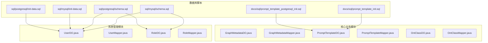
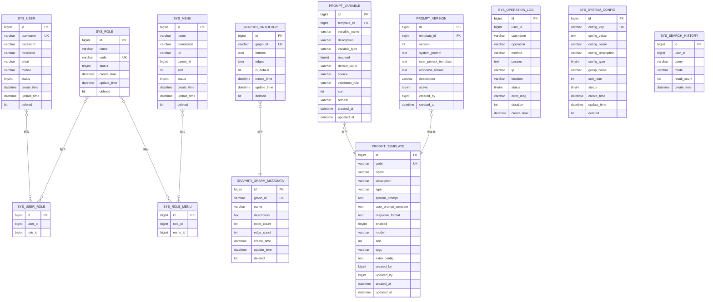
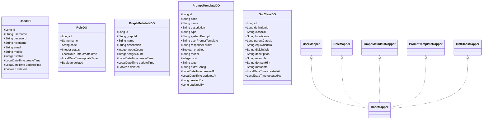
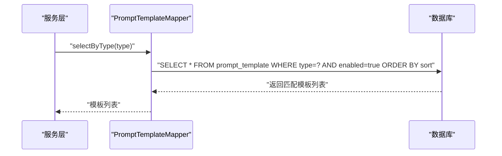
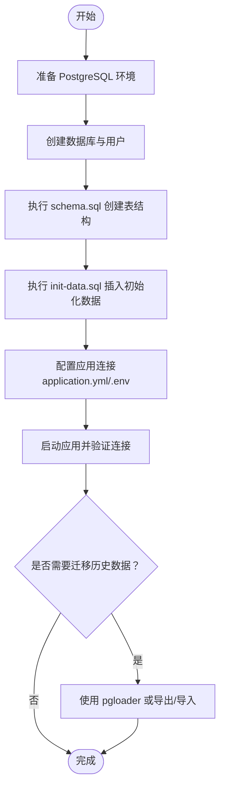
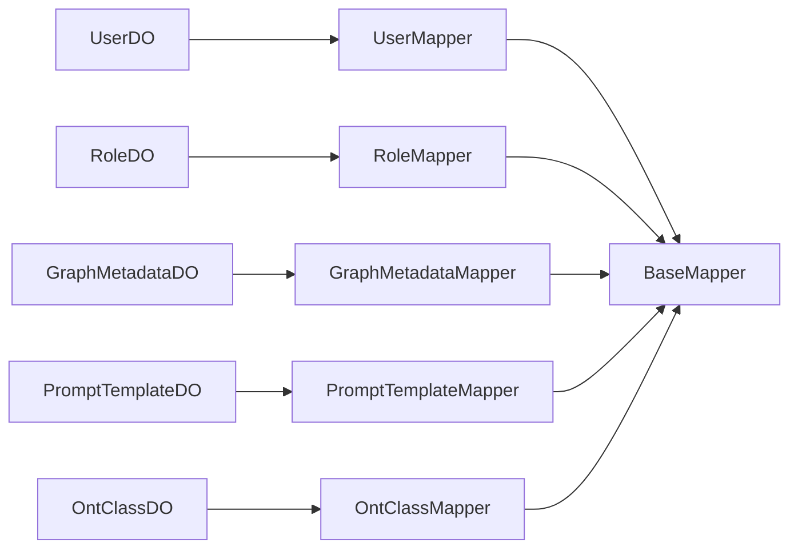

# 关系数据库设计

<!--<cite>
**本文引用的文件**
- [schema.sql（MySQL）](file://sql/mysql/schema.sql)
- [init-data.sql（MySQL）](file://sql/mysql/init-data.sql)
- [schema.sql（PostgreSQL）](file://sql/postgresql/schema.sql)
- [init-data.sql（PostgreSQL）](file://sql/postgresql/init-data.sql)
- [prompt_template_init.sql](file://docs/sql/prompt_template_init.sql)
- [prompt_template_postgresql_init.sql](file://docs/sql/prompt_template_postgresql_init.sql)
- [UserDO.java](file://ontograph-module-system/src/main/java/com/graphiti/system/dal/dataobject/UserDO.java)
- [UserMapper.java](file://ontograph-module-system/src/main/java/com/graphiti/system/dal/mysql/UserMapper.java)
- [RoleDO.java](file://ontograph-module-system/src/main/java/com/graphiti/system/dal/dataobject/RoleDO.java)
- [RoleMapper.java](file://ontograph-module-system/src/main/java/com/graphiti/system/dal/mysql/RoleMapper.java)
- [GraphMetadataDO.java](file://ontograph-module-core/src/main/java/com/graphiti/module/graphiti/dal/dataobject/GraphMetadataDO.java)
- [GraphMetadataMapper.java](file://ontograph-module-core/src/main/java/com/graphiti/module/graphiti/dal/mysql/GraphMetadataMapper.java)
- [PromptTemplateDO.java](file://ontograph-module-core/src/main/java/com/graphiti/module/graphiti/dal/dataobject/PromptTemplateDO.java)
- [PromptTemplateMapper.java](file://ontograph-module-core/src/main/java/com/graphiti/module/graphiti/dal/mysql/PromptTemplateMapper.java)
- [OntClassDO.java](file://ontograph-module-core/src/main/java/com/graphiti/module/graphiti/dal/dataobject/ont/OntClassDO.java)
- [OntClassMapper.java](file://ontograph-module-core/src/main/java/com/graphiti/module/graphiti/dal/mysql/ont/OntClassMapper.java)
- [database-migration-guide.md](file://docs/database-migration-guide.md)
</cite>-->

## 目录
1. [简介](#简介)
2. [项目结构](#项目结构)
3. [核心组件](#核心组件)
4. [架构总览](#架构总览)
5. [详细组件分析](#详细组件分析)
6. [依赖分析](#依赖分析)
7. [性能考虑](#性能考虑)
8. [故障排查指南](#故障排查指南)
9. [结论](#结论)
10. [附录](#附录)

## 简介
本文件面向数据库管理员与后端开发者，系统化梳理 ontograph-java 项目的数据库设计与实现，覆盖 MySQL 与 PostgreSQL 的表结构、字段定义、主外键关系与约束规则；解释系统管理模块与核心业务模块的数据模型；分析 MyBatis-Plus 实体映射与 Mapper 接口设计模式；提供完整的 DDL 与初始化脚本路径；阐述版本迁移策略与数据库演进过程；总结索引设计原则、查询优化技巧与性能调优建议，并给出数据字典与 ER 图。

## 项目结构
- 数据库脚本位于 sql/ 目录，分别提供 MySQL 与 PostgreSQL 的 schema 与 init-data。
- MyBatis-Plus 实体类与 Mapper 位于 ontograph-module-system 与 ontograph-module-core 模块的 dal 包下。
- 迁移指南位于 docs/database-migration-guide.md，涵盖从 MySQL 到 PostgreSQL 的步骤与注意事项。

图表来源
- [schema.sql（MySQL）:1-196](file://sql/mysql/schema.sql#L1-L196)
- [schema.sql（PostgreSQL）:1-319](file://sql/postgresql/schema.sql#L1-L319)
- [init-data.sql（MySQL）:1-17](file://sql/mysql/init-data.sql#L1-L17)
- [init-data.sql（PostgreSQL）:1-110](file://sql/postgresql/init-data.sql#L1-L110)
- [prompt_template_init.sql:1-385](file://docs/sql/prompt_template_init.sql#L1-L385)
- [prompt_template_postgresql_init.sql:1-698](file://docs/sql/prompt_template_postgresql_init.sql#L1-L698)
- [UserDO.java:1-38](file://ontograph-module-system/src/main/java/com/graphiti/system/dal/dataobject/UserDO.java#L1-L38)
- [RoleDO.java:1-32](file://ontograph-module-system/src/main/java/com/graphiti/system/dal/dataobject/RoleDO.java#L1-L32)
- [GraphMetadataDO.java:1-60](file://ontograph-module-core/src/main/java/com/graphiti/module/graphiti/dal/dataobject/GraphMetadataDO.java#L1-L60)
- [PromptTemplateDO.java:1-99](file://ontograph-module-core/src/main/java/com/graphiti/module/graphiti/dal/dataobject/PromptTemplateDO.java#L1-L99)
- [OntClassDO.java:1-49](file://ontograph-module-core/src/main/java/com/graphiti/module/graphiti/dal/dataobject/ont/OntClassDO.java#L1-L49)

章节来源
- [schema.sql（MySQL）:1-196](file://sql/mysql/schema.sql#L1-L196)
- [schema.sql（PostgreSQL）:1-319](file://sql/postgresql/schema.sql#L1-L319)
- [init-data.sql（MySQL）:1-17](file://sql/mysql/init-data.sql#L1-L17)
- [init-data.sql（PostgreSQL）:1-110](file://sql/postgresql/init-data.sql#L1-L110)
- [prompt_template_init.sql:1-385](file://docs/sql/prompt_template_init.sql#L1-L385)
- [prompt_template_postgresql_init.sql:1-698](file://docs/sql/prompt_template_postgresql_init.sql#L1-L698)

## 核心组件
- 系统管理模块：用户、角色、菜单、用户角色关联、角色菜单关联、操作日志、系统配置、搜索历史。
- 核心业务模块：图谱元数据、本体定义、自定义指令、提示词模板（含变量与版本）。
- MyBatis-Plus 映射：通过注解将 Java 实体与数据库表字段映射，Mapper 继承 BaseMapper 并可扩展自定义 SQL。

章节来源
- [UserDO.java:1-38](file://ontograph-module-system/src/main/java/com/graphiti/system/dal/dataobject/UserDO.java#L1-L38)
- [RoleDO.java:1-32](file://ontograph-module-system/src/main/java/com/graphiti/system/dal/dataobject/RoleDO.java#L1-L32)
- [GraphMetadataDO.java:1-60](file://ontograph-module-core/src/main/java/com/graphiti/module/graphiti/dal/dataobject/GraphMetadataDO.java#L1-L60)
- [PromptTemplateDO.java:1-99](file://ontograph-module-core/src/main/java/com/graphiti/module/graphiti/dal/dataobject/PromptTemplateDO.java#L1-L99)
- [OntClassDO.java:1-49](file://ontograph-module-core/src/main/java/com/graphiti/module/graphiti/dal/dataobject/ont/OntClassDO.java#L1-L49)

## 架构总览
系统采用“模块化表结构 + MyBatis-Plus ORM”的设计，MySQL 与 PostgreSQL 两套脚本保证跨数据库兼容与迁移能力。提示词模板体系独立于核心图谱表，便于版本演进与多模型适配。

图表来源
- [schema.sql（MySQL）:12-196](file://sql/mysql/schema.sql#L12-L196)
- [schema.sql（PostgreSQL）:21-319](file://sql/postgresql/schema.sql#L21-L319)
- [prompt_template_init.sql:5-64](file://docs/sql/prompt_template_init.sql#L5-L64)
- [prompt_template_postgresql_init.sql:5-102](file://docs/sql/prompt_template_postgresql_init.sql#L5-L102)

## 详细组件分析

### 系统管理模块（MySQL 与 PostgreSQL）
- 表：sys_user、sys_role、sys_user_role、sys_menu、sys_role_menu、sys_operation_log、sys_system_config、sys_search_history。
- 约束与索引：
  - 唯一约束：username、code、config_key（MySQL）；username、code、config_key（PostgreSQL）。
  - 外键：sys_user_role.user_id → sys_user.id；sys_user_role.role_id → sys_role.id；sys_role_menu.role_id → sys_role.id；sys_role_menu.menu_id → sys_menu.id。
  - 时间戳：MySQL 使用列级 ON UPDATE CURRENT_TIMESTAMP；PostgreSQL 使用触发器函数维护 update_time。
  - 逻辑删除：deleted 字段用于软删除。
- 初始化数据：MySQL 提供基础用户与角色；PostgreSQL 提供更完整的菜单与角色-菜单关联初始化。

章节来源
- [schema.sql（MySQL）:12-196](file://sql/mysql/schema.sql#L12-L196)
- [schema.sql（PostgreSQL）:21-103](file://sql/postgresql/schema.sql#L21-L103)
- [init-data.sql（MySQL）:1-17](file://sql/mysql/init-data.sql#L1-L17)
- [init-data.sql（PostgreSQL）:1-110](file://sql/postgresql/init-data.sql#L1-L110)

### 核心业务模块（图谱与本体）
- 表：graphiti_graph_metadata、graphiti_ontology、graphiti_custom_instruction。
- 关系：graphiti_ontology.graph_id → graphiti_graph_metadata.graph_id。
- 字段要点：JSON 类型存储本体定义；graph_id 作为 UUID 唯一键；软删除标志 deleted。

章节来源
- [schema.sql（MySQL）:91-137](file://sql/mysql/schema.sql#L91-L137)
- [schema.sql（PostgreSQL）:109-144](file://sql/postgresql/schema.sql#L109-L144)

### 提示词模板体系（MySQL 与 PostgreSQL）
- 表：prompt_template、prompt_variable、prompt_version。
- 关系：prompt_variable.template_id → prompt_template.id；prompt_version.template_id → prompt_template.id。
- 索引：唯一索引 code；普通索引 type、enabled、template_id、(template_id, version)。
- 初始化：提供默认模板、变量与版本记录，支持多类型（实体抽取、关系抽取、去重、摘要）。

章节来源
- [prompt_template_init.sql:5-64](file://docs/sql/prompt_template_init.sql#L5-L64)
- [prompt_template_postgresql_init.sql:5-102](file://docs/sql/prompt_template_postgresql_init.sql#L5-L102)

### MyBatis-Plus 实体映射与 Mapper 设计
- 实体类注解：
  - @TableName 指定表名；@TableId 指定主键；@TableField 支持插入/更新时间填充与软删除逻辑删除。
- Mapper 接口：
  - 继承 BaseMapper<T>，自动获得 CRUD；可按需扩展 @Select 自定义 SQL。
- 示例：
  - UserDO/RoleDO：系统用户与角色实体。
  - GraphMetadataDO：图谱元数据实体，包含软删除与时间字段自动填充。
  - PromptTemplateDO：提示词模板实体，包含 JSON 字段与时间字段自动填充。
  - OntClassDO：本体类实体，包含 JSON 字段与层级关系字段。

图表来源
- [UserDO.java:1-38](file://ontograph-module-system/src/main/java/com/graphiti/system/dal/dataobject/UserDO.java#L1-L38)
- [RoleDO.java:1-32](file://ontograph-module-system/src/main/java/com/graphiti/system/dal/dataobject/RoleDO.java#L1-L32)
- [GraphMetadataDO.java:1-60](file://ontograph-module-core/src/main/java/com/graphiti/module/graphiti/dal/dataobject/GraphMetadataDO.java#L1-L60)
- [PromptTemplateDO.java:1-99](file://ontograph-module-core/src/main/java/com/graphiti/module/graphiti/dal/dataobject/PromptTemplateDO.java#L1-L99)
- [OntClassDO.java:1-49](file://ontograph-module-core/src/main/java/com/graphiti/module/graphiti/dal/dataobject/ont/OntClassDO.java#L1-L49)
- [UserMapper.java:1-13](file://ontograph-module-system/src/main/java/com/graphiti/system/dal/mysql/UserMapper.java#L1-L13)
- [RoleMapper.java:1-13](file://ontograph-module-system/src/main/java/com/graphiti/system/dal/mysql/RoleMapper.java#L1-L13)
- [GraphMetadataMapper.java:1-15](file://ontograph-module-core/src/main/java/com/graphiti/module/graphiti/dal/mysql/GraphMetadataMapper.java#L1-L15)
- [PromptTemplateMapper.java:1-40](file://ontograph-module-core/src/main/java/com/graphiti/module/graphiti/dal/mysql/PromptTemplateMapper.java#L1-L40)
- [OntClassMapper.java:1-22](file://ontograph-module-core/src/main/java/com/graphiti/module/graphiti/dal/mysql/ont/OntClassMapper.java#L1-L22)

章节来源
- [UserDO.java:1-38](file://ontograph-module-system/src/main/java/com/graphiti/system/dal/dataobject/UserDO.java#L1-L38)
- [RoleDO.java:1-32](file://ontograph-module-system/src/main/java/com/graphiti/system/dal/dataobject/RoleDO.java#L1-L32)
- [GraphMetadataDO.java:1-60](file://ontograph-module-core/src/main/java/com/graphiti/module/graphiti/dal/dataobject/GraphMetadataDO.java#L1-L60)
- [PromptTemplateDO.java:1-99](file://ontograph-module-core/src/main/java/com/graphiti/module/graphiti/dal/dataobject/PromptTemplateDO.java#L1-L99)
- [OntClassDO.java:1-49](file://ontograph-module-core/src/main/java/com/graphiti/module/graphiti/dal/dataobject/ont/OntClassDO.java#L1-L49)
- [UserMapper.java:1-13](file://ontograph-module-system/src/main/java/com/graphiti/system/dal/mysql/UserMapper.java#L1-L13)
- [RoleMapper.java:1-13](file://ontograph-module-system/src/main/java/com/graphiti/system/dal/mysql/RoleMapper.java#L1-L13)
- [GraphMetadataMapper.java:1-15](file://ontograph-module-core/src/main/java/com/graphiti/module/graphiti/dal/mysql/GraphMetadataMapper.java#L1-L15)
- [PromptTemplateMapper.java:1-40](file://ontograph-module-core/src/main/java/com/graphiti/module/graphiti/dal/mysql/PromptTemplateMapper.java#L1-L40)
- [OntClassMapper.java:1-22](file://ontograph-module-core/src/main/java/com/graphiti/module/graphiti/dal/mysql/ont/OntClassMapper.java#L1-L22)

### 提示词模板流程（序列图）
展示根据模板类型查询启用模板的典型流程。

图表来源
- [PromptTemplateMapper.java:18-20](file://ontograph-module-core/src/main/java/com/graphiti/module/graphiti/dal/mysql/PromptTemplateMapper.java#L18-L20)

章节来源
- [PromptTemplateMapper.java:1-40](file://ontograph-module-core/src/main/java/com/graphiti/module/graphiti/dal/mysql/PromptTemplateMapper.java#L1-L40)

### 数据库演进与版本迁移（流程图）
从 MySQL 到 PostgreSQL 的迁移流程。

图表来源
- [database-migration-guide.md:64-137](file://docs/database-migration-guide.md#L64-L137)

章节来源
- [database-migration-guide.md:1-218](file://docs/database-migration-guide.md#L1-L218)

## 依赖分析
- 模块内聚与耦合：
  - 系统管理模块与核心业务模块相对独立，通过提示词模板体系与图谱元数据形成弱耦合。
  - 提示词模板与版本表之间存在直接外键依赖，变量表依赖模板表。
- 外部依赖：
  - MyBatis-Plus 提供 ORM 能力；PostgreSQL 需要触发器维护更新时间；JSON/JSONB 字段在不同数据库间差异较大。

图表来源
- [UserMapper.java:1-13](file://ontograph-module-system/src/main/java/com/graphiti/system/dal/mysql/UserMapper.java#L1-L13)
- [RoleMapper.java:1-13](file://ontograph-module-system/src/main/java/com/graphiti/system/dal/mysql/RoleMapper.java#L1-L13)
- [GraphMetadataMapper.java:1-15](file://ontograph-module-core/src/main/java/com/graphiti/module/graphiti/dal/mysql/GraphMetadataMapper.java#L1-L15)
- [PromptTemplateMapper.java:1-40](file://ontograph-module-core/src/main/java/com/graphiti/module/graphiti/dal/mysql/PromptTemplateMapper.java#L1-L40)
- [OntClassMapper.java:1-22](file://ontograph-module-core/src/main/java/com/graphiti/module/graphiti/dal/mysql/ont/OntClassMapper.java#L1-L22)

章节来源
- [UserMapper.java:1-13](file://ontograph-module-system/src/main/java/com/graphiti/system/dal/mysql/UserMapper.java#L1-L13)
- [RoleMapper.java:1-13](file://ontograph-module-system/src/main/java/com/graphiti/system/dal/mysql/RoleMapper.java#L1-L13)
- [GraphMetadataMapper.java:1-15](file://ontograph-module-core/src/main/java/com/graphiti/module/graphiti/dal/mysql/GraphMetadataMapper.java#L1-L15)
- [PromptTemplateMapper.java:1-40](file://ontograph-module-core/src/main/java/com/graphiti/module/graphiti/dal/mysql/PromptTemplateMapper.java#L1-L40)
- [OntClassMapper.java:1-22](file://ontograph-module-core/src/main/java/com/graphiti/module/graphiti/dal/mysql/ont/OntClassMapper.java#L1-L22)

## 性能考虑
- 索引设计原则：
  - 唯一键优先：username、code、config_key、graph_id、prompt_template.code。
  - 查询热点字段建立索引：username、operation、create_time（日志表）；group_name、deleted（系统配置）；user_id、create_time（搜索历史）。
  - PostgreSQL 使用触发器维护更新时间，避免手工更新。
- 查询优化技巧：
  - 使用 LIMIT 限制结果集；合理利用索引覆盖；避免 SELECT *。
  - JSON/JSONB 查询建议配合 GIN/BTree 索引（PostgreSQL）。
- 连接池与驱动：
  - 调整 HikariCP 参数；确保 JDBC 驱动版本与数据库匹配；PostgreSQL 建议在 URL 中指定时区参数。

章节来源
- [schema.sql（MySQL）:15-195](file://sql/mysql/schema.sql#L15-L195)
- [schema.sql（PostgreSQL）:150-178](file://sql/postgresql/schema.sql#L150-L178)
- [database-migration-guide.md:163-190](file://docs/database-migration-guide.md#L163-L190)

## 故障排查指南
- 连接问题：
  - 检查 PostgreSQL 是否启动、监听地址与认证方式；核对 application.yml 或环境变量中的 JDBC URL、用户名与密码。
- 时区问题：
  - 在 JDBC URL 中添加 serverTimezone 参数（如 Asia/Shanghai）。
- JSON/JSONB 类型：
  - 确保 MyBatis-Plus 版本满足 JSON/JSONB 映射要求，必要时引入专用依赖。
- 迁移失败：
  - 使用 pgloader 工具进行结构与数据迁移；若手动转换 SQL，注意语法差异（如 JSON、布尔、时间类型）。

章节来源
- [database-migration-guide.md:139-162](file://docs/database-migration-guide.md#L139-L162)

## 结论
本设计以模块化表结构与 MyBatis-Plus ORM 为核心，兼顾 MySQL 与 PostgreSQL 的兼容性与迁移能力。通过完善的索引策略、软删除与时间字段自动维护机制，以及提示词模板的版本化管理，为系统提供了良好的扩展性与可维护性。建议在生产环境中结合监控与慢查询日志持续优化索引与查询计划。

## 附录
- DDL 与初始化脚本路径
  - MySQL
    - [schema.sql（MySQL）:1-196](file://sql/mysql/schema.sql#L1-L196)
    - [init-data.sql（MySQL）:1-17](file://sql/mysql/init-data.sql#L1-L17)
  - PostgreSQL
    - [schema.sql（PostgreSQL）:1-319](file://sql/postgresql/schema.sql#L1-L319)
    - [init-data.sql（PostgreSQL）:1-110](file://sql/postgresql/init-data.sql#L1-L110)
  - 提示词模板
    - [prompt_template_init.sql:1-385](file://docs/sql/prompt_template_init.sql#L1-L385)
    - [prompt_template_postgresql_init.sql:1-698](file://docs/sql/prompt_template_postgresql_init.sql#L1-L698)
- 迁移指南
  - [database-migration-guide.md:1-218](file://docs/database-migration-guide.md#L1-L218)