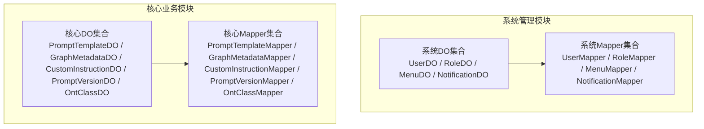
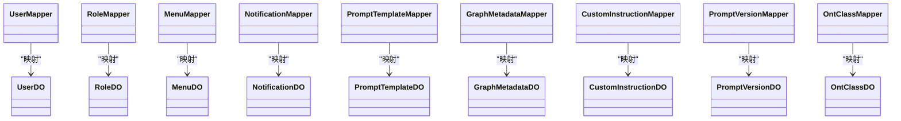
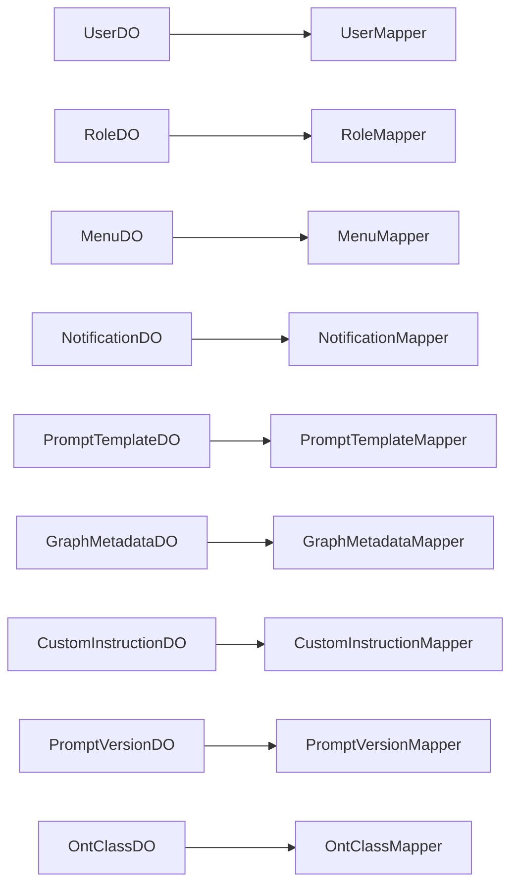

# 数据模型设计

<!--<cite>
**本文引用的文件**
- [UserDO.java](file://graphiti-module-system/src/main/java/com/graphiti/system/dal/dataobject/UserDO.java)
- [UserMapper.java](file://graphiti-module-system/src/main/java/com/graphiti/system/dal/mysql/UserMapper.java)
- [RoleDO.java](file://graphiti-module-system/src/main/java/com/graphiti/system/dal/dataobject/RoleDO.java)
- [RoleMapper.java](file://graphiti-module-system/src/main/java/com/graphiti/system/dal/mysql/RoleMapper.java)
- [MenuDO.java](file://graphiti-module-system/src/main/java/com/graphiti/system/dal/dataobject/MenuDO.java)
- [MenuMapper.java](file://graphiti-module-system/src/main/java/com/graphiti/system/dal/mysql/MenuMapper.java)
- [NotificationDO.java](file://graphiti-module-system/src/main/java/com/graphiti/system/dal/dataobject/NotificationDO.java)
- [NotificationMapper.java](file://graphiti-module-system/src/main/java/com/graphiti/system/dal/mysql/NotificationMapper.java)
- [PromptTemplateDO.java](file://graphiti-module-core/src/main/java/com/graphiti/module/graphiti/dal/dataobject/PromptTemplateDO.java)
- [PromptTemplateMapper.java](file://graphiti-module-core/src/main/java/com/graphiti/module/graphiti/dal/mysql/PromptTemplateMapper.java)
- [GraphMetadataDO.java](file://graphiti-module-core/src/main/java/com/graphiti/module/graphiti/dal/dataobject/GraphMetadataDO.java)
- [GraphMetadataMapper.java](file://graphiti-module-core/src/main/java/com/graphiti/module/graphiti/dal/mysql/GraphMetadataMapper.java)
- [CustomInstructionDO.java](file://graphiti-module-core/src/main/java/com/graphiti/module/graphiti/dal/dataobject/CustomInstructionDO.java)
- [CustomInstructionMapper.java](file://graphiti-module-core/src/main/java/com/graphiti/module/graphiti/dal/mysql/CustomInstructionMapper.java)
- [PromptVersionDO.java](file://graphiti-module-core/src/main/java/com/graphiti/module/graphiti/dal/dataobject/PromptVersionDO.java)
- [PromptVersionMapper.java](file://graphiti-module-core/src/main/java/com/graphiti/module/graphiti/dal/mysql/PromptVersionMapper.java)
- [OntClassDO.java](file://graphiti-module-core/src/main/java/com/graphiti/module/graphiti/dal/dataobject/ont/OntClassDO.java)
- [OntClassMapper.java](file://graphiti-module-core/src/main/java/com/graphiti/module/graphiti/dal/mysql/ont/OntClassMapper.java)
</cite>-->

## 目录
1. [引言](#引言)
2. [项目结构](#项目结构)
3. [核心组件](#核心组件)
4. [架构总览](#架构总览)
5. [详细组件分析](#详细组件分析)
6. [依赖分析](#依赖分析)
7. [性能考虑](#性能考虑)
8. [故障排查指南](#故障排查指南)
9. [结论](#结论)
10. [附录](#附录)

## 引言
本文件聚焦于系统的数据模型设计与实现，覆盖系统管理模块与核心业务模块的完整数据对象（DO）、Mapper 接口以及 MyBatis-Plus 实体映射配置。文档详细解释注解使用（如 @TableId、@TableName、@TableLogic、@TableField 等），并结合实际 Mapper 接口中的自定义 SQL 方法，阐述 CRUD、分页查询、条件查询与批量操作的设计原则与最佳实践。同时给出数据访问层的类图、序列图与流程图，帮助后端开发者快速理解与扩展。

## 项目结构
系统采用模块化组织，数据访问层位于各模块的 dal 子包中，按功能域划分为：
- 系统管理模块（graphiti-module-system）：用户、角色、菜单、通知等基础能力
- 核心业务模块（graphiti-module-core）：提示词模板、图谱元数据、自定义指令、提示词版本、本体类等

图表来源
- [UserDO.java:1-38](file://graphiti-module-system/src/main/java/com/graphiti/system/dal/dataobject/UserDO.java#L1-L38)
- [RoleDO.java:1-32](file://graphiti-module-system/src/main/java/com/graphiti/system/dal/dataobject/RoleDO.java#L1-L32)
- [MenuDO.java:1-45](file://graphiti-module-system/src/main/java/com/graphiti/system/dal/dataobject/MenuDO.java#L1-L45)
- [NotificationDO.java:1-36](file://graphiti-module-system/src/main/java/com/graphiti/system/dal/dataobject/NotificationDO.java#L1-L36)
- [PromptTemplateDO.java:1-99](file://graphiti-module-core/src/main/java/com/graphiti/module/graphiti/dal/dataobject/PromptTemplateDO.java#L1-L99)
- [GraphMetadataDO.java:1-60](file://graphiti-module-core/src/main/java/com/graphiti/module/graphiti/dal/dataobject/GraphMetadataDO.java#L1-L60)
- [CustomInstructionDO.java:1-40](file://graphiti-module-core/src/main/java/com/graphiti/module/graphiti/dal/dataobject/CustomInstructionDO.java#L1-L40)
- [PromptVersionDO.java:1-66](file://graphiti-module-core/src/main/java/com/graphiti/module/graphiti/dal/dataobject/PromptVersionDO.java#L1-L66)
- [OntClassDO.java:1-49](file://graphiti-module-core/src/main/java/com/graphiti/module/graphiti/dal/dataobject/ont/OntClassDO.java#L1-L49)

章节来源
- [UserDO.java:1-38](file://graphiti-module-system/src/main/java/com/graphiti/system/dal/dataobject/UserDO.java#L1-L38)
- [RoleDO.java:1-32](file://graphiti-module-system/src/main/java/com/graphiti/system/dal/dataobject/RoleDO.java#L1-L32)
- [MenuDO.java:1-45](file://graphiti-module-system/src/main/java/com/graphiti/system/dal/dataobject/MenuDO.java#L1-L45)
- [NotificationDO.java:1-36](file://graphiti-module-system/src/main/java/com/graphiti/system/dal/dataobject/NotificationDO.java#L1-L36)
- [PromptTemplateDO.java:1-99](file://graphiti-module-core/src/main/java/com/graphiti/module/graphiti/dal/dataobject/PromptTemplateDO.java#L1-L99)
- [GraphMetadataDO.java:1-60](file://graphiti-module-core/src/main/java/com/graphiti/module/graphiti/dal/dataobject/GraphMetadataDO.java#L1-L60)
- [CustomInstructionDO.java:1-40](file://graphiti-module-core/src/main/java/com/graphiti/module/graphiti/dal/dataobject/CustomInstructionDO.java#L1-L40)
- [PromptVersionDO.java:1-66](file://graphiti-module-core/src/main/java/com/graphiti/module/graphiti/dal/dataobject/PromptVersionDO.java#L1-L66)
- [OntClassDO.java:1-49](file://graphiti-module-core/src/main/java/com/graphiti/module/graphiti/dal/dataobject/ont/OntClassDO.java#L1-L49)

## 核心组件
本节从数据模型角度梳理系统管理与核心业务的关键实体及其字段语义，并说明 MyBatis-Plus 注解在实体映射中的作用。

- 系统管理模块
  - 用户（UserDO）：用户名、密码、昵称、邮箱、手机号、状态、时间戳、软删标记
  - 角色（RoleDO）：角色名、编码、状态、时间戳、软删标记
  - 菜单（MenuDO）：菜单名、权限标识、URL、父级ID、排序、状态、时间戳、软删标记；包含非持久化子节点列表
  - 通知（NotificationDO）：用户ID、标题、内容、类型、已读状态、时间戳、软删标记

- 核心业务模块
  - 提示词模板（PromptTemplateDO）：模板编码、名称、描述、类型、系统提示词、用户提示词模板、响应格式、启用状态、模型、排序、标签、额外配置、创建/更新时间、创建者/更新者
  - 图谱元数据（GraphMetadataDO）：图谱ID、名称、描述、节点/边数量、创建/更新时间、软删逻辑
  - 自定义指令（CustomInstructionDO）：图谱ID（可空表示全局）、指令内容、启用状态、创建/更新时间
  - 提示词版本（PromptVersionDO）：所属模板ID、版本号、系统/用户提示词、响应格式、描述、是否活跃、创建者、创建时间
  - 本体类（OntClassDO）：定义ID、类URI、本地名、父类ID、等价类、不相交类、描述/示例、领域提示、元数据、创建/更新时间

章节来源
- [UserDO.java:1-38](file://graphiti-module-system/src/main/java/com/graphiti/system/dal/dataobject/UserDO.java#L1-L38)
- [RoleDO.java:1-32](file://graphiti-module-system/src/main/java/com/graphiti/system/dal/dataobject/RoleDO.java#L1-L32)
- [MenuDO.java:1-45](file://graphiti-module-system/src/main/java/com/graphiti/system/dal/dataobject/MenuDO.java#L1-L45)
- [NotificationDO.java:1-36](file://graphiti-module-system/src/main/java/com/graphiti/system/dal/dataobject/NotificationDO.java#L1-L36)
- [PromptTemplateDO.java:1-99](file://graphiti-module-core/src/main/java/com/graphiti/module/graphiti/dal/dataobject/PromptTemplateDO.java#L1-L99)
- [GraphMetadataDO.java:1-60](file://graphiti-module-core/src/main/java/com/graphiti/module/graphiti/dal/dataobject/GraphMetadataDO.java#L1-L60)
- [CustomInstructionDO.java:1-40](file://graphiti-module-core/src/main/java/com/graphiti/module/graphiti/dal/dataobject/CustomInstructionDO.java#L1-L40)
- [PromptVersionDO.java:1-66](file://graphiti-module-core/src/main/java/com/graphiti/module/graphiti/dal/dataobject/PromptVersionDO.java#L1-L66)
- [OntClassDO.java:1-49](file://graphiti-module-core/src/main/java/com/graphiti/module/graphiti/dal/dataobject/ont/OntClassDO.java#L1-L49)

## 架构总览
数据访问层遵循 MyBatis-Plus 的约定式开发与增强特性，通过 DO + Mapper 的组合实现标准 CRUD 与自定义查询。下图展示了系统管理与核心业务模块的 DO 与 Mapper 的关系：

图表来源
- [UserDO.java:1-38](file://graphiti-module-system/src/main/java/com/graphiti/system/dal/dataobject/UserDO.java#L1-L38)
- [UserMapper.java:1-13](file://graphiti-module-system/src/main/java/com/graphiti/system/dal/mysql/UserMapper.java#L1-L13)
- [RoleDO.java:1-32](file://graphiti-module-system/src/main/java/com/graphiti/system/dal/dataobject/RoleDO.java#L1-L32)
- [RoleMapper.java:1-13](file://graphiti-module-system/src/main/java/com/graphiti/system/dal/mysql/RoleMapper.java#L1-L13)
- [MenuDO.java:1-45](file://graphiti-module-system/src/main/java/com/graphiti/system/dal/dataobject/MenuDO.java#L1-L45)
- [MenuMapper.java:1-13](file://graphiti-module-system/src/main/java/com/graphiti/system/dal/mysql/MenuMapper.java#L1-L13)
- [NotificationDO.java:1-36](file://graphiti-module-system/src/main/java/com/graphiti/system/dal/dataobject/NotificationDO.java#L1-L36)
- [NotificationMapper.java:1-13](file://graphiti-module-system/src/main/java/com/graphiti/system/dal/mysql/NotificationMapper.java#L1-L13)
- [PromptTemplateDO.java:1-99](file://graphiti-module-core/src/main/java/com/graphiti/module/graphiti/dal/dataobject/PromptTemplateDO.java#L1-L99)
- [PromptTemplateMapper.java:1-40](file://graphiti-module-core/src/main/java/com/graphiti/module/graphiti/dal/mysql/PromptTemplateMapper.java#L1-L40)
- [GraphMetadataDO.java:1-60](file://graphiti-module-core/src/main/java/com/graphiti/module/graphiti/dal/dataobject/GraphMetadataDO.java#L1-L60)
- [GraphMetadataMapper.java:1-15](file://graphiti-module-core/src/main/java/com/graphiti/module/graphiti/dal/mysql/GraphMetadataMapper.java#L1-L15)
- [CustomInstructionDO.java:1-40](file://graphiti-module-core/src/main/java/com/graphiti/module/graphiti/dal/dataobject/CustomInstructionDO.java#L1-L40)
- [CustomInstructionMapper.java:1-19](file://graphiti-module-core/src/main/java/com/graphiti/module/graphiti/dal/mysql/CustomInstructionMapper.java#L1-L19)
- [PromptVersionDO.java:1-66](file://graphiti-module-core/src/main/java/com/graphiti/module/graphiti/dal/dataobject/PromptVersionDO.java#L1-L66)
- [PromptVersionMapper.java:1-48](file://graphiti-module-core/src/main/java/com/graphiti/module/graphiti/dal/mysql/PromptVersionMapper.java#L1-L48)
- [OntClassDO.java:1-49](file://graphiti-module-core/src/main/java/com/graphiti/module/graphiti/dal/dataobject/ont/OntClassDO.java#L1-L49)
- [OntClassMapper.java:1-22](file://graphiti-module-core/src/main/java/com/graphiti/module/graphiti/dal/mysql/ont/OntClassMapper.java#L1-L22)

## 详细组件分析

### 系统管理模块数据模型

#### 用户（UserDO）
- 表映射：@TableName 指定表名为 sys_user；@TableId 标识主键
- 字段语义：用户名、密码、昵称、邮箱、手机号、状态、创建/更新时间、软删标记 deleted
- 设计要点：统一的软删与时间戳字段命名风格，便于通用层处理

章节来源
- [UserDO.java:1-38](file://graphiti-module-system/src/main/java/com/graphiti/system/dal/dataobject/UserDO.java#L1-L38)

#### 角色（RoleDO）
- 表映射：@TableName 指定表名为 sys_role；@TableId 标识主键
- 字段语义：角色名、编码、状态、创建/更新时间、软删标记 deleted
- 设计要点：编码 code 作为角色标识，便于权限控制与关联

章节来源
- [RoleDO.java:1-32](file://graphiti-module-system/src/main/java/com/graphiti/system/dal/dataobject/RoleDO.java#L1-L32)

#### 菜单（MenuDO）
- 表映射：@TableName 指定表名为 sys_menu；@TableId 标识主键
- 特殊字段：children 为非持久化字段（@TableField(exist=false)），用于树形结构组装
- 字段语义：菜单名、权限标识、URL、父级ID、排序、状态、创建/更新时间、软删标记 deleted
- 设计要点：支持父子层级与排序，便于前端菜单渲染

章节来源
- [MenuDO.java:1-45](file://graphiti-module-system/src/main/java/com/graphiti/system/dal/dataobject/MenuDO.java#L1-L45)

#### 通知（NotificationDO）
- 表映射：@TableName 指定表名为 sys_notification；@TableId 标识主键
- 字段语义：用户ID、标题、内容、类型、已读状态、创建/更新时间、软删标记 deleted
- 设计要点：与用户关联，支持按用户维度查询与展示

章节来源
- [NotificationDO.java:1-36](file://graphiti-module-system/src/main/java/com/graphiti/system/dal/dataobject/NotificationDO.java#L1-L36)

### 核心业务模块数据模型

#### 提示词模板（PromptTemplateDO）
- 表映射：@TableName 指定表名为 prompt_template；@TableId 使用数据库自增
- 时间字段：@TableField(fill=INSERT/INSERT_UPDATE) 自动填充创建与更新时间
- 字段语义：模板编码（唯一标识）、名称、描述、类型、系统/用户提示词、响应格式、启用状态、模型、排序、标签、额外配置、创建者/更新者
- 设计要点：支持多类型模板与启用控制，便于工作流与版本管理

章节来源
- [PromptTemplateDO.java:1-99](file://graphiti-module-core/src/main/java/com/graphiti/module/graphiti/dal/dataobject/PromptTemplateDO.java#L1-L99)

#### 图谱元数据（GraphMetadataDO）
- 表映射：@TableName 指定表名为 graphiti_graph_metadata；@TableId 使用数据库自增
- 逻辑删除：@TableLogic 定义软删逻辑，便于历史审计与恢复
- 字段语义：图谱ID（UUID）、名称、描述、节点/边数量、创建/更新时间、软删标记
- 设计要点：以 graph_id 作为业务主键，配合软删实现安全删除

章节来源
- [GraphMetadataDO.java:1-60](file://graphiti-module-core/src/main/java/com/graphiti/module/graphiti/dal/dataobject/GraphMetadataDO.java#L1-L60)

#### 自定义指令（CustomInstructionDO）
- 表映射：@TableName 指定表名为 custom_instruction；@TableId 使用数据库自增
- 时间字段：@TableField(fill=INSERT/INSERT_UPDATE) 自动填充创建与更新时间
- 字段语义：图谱ID（可空表示全局）、指令内容、启用状态、创建/更新时间
- 设计要点：支持全局与图谱级指令，便于灵活配置抽取行为

章节来源
- [CustomInstructionDO.java:1-40](file://graphiti-module-core/src/main/java/com/graphiti/module/graphiti/dal/dataobject/CustomInstructionDO.java#L1-L40)

#### 提示词版本（PromptVersionDO）
- 表映射：@TableName 指定表名为 prompt_version；@TableId 使用数据库自增
- 时间字段：@TableField(fill=INSERT) 自动填充创建时间
- 字段语义：所属模板ID、版本号、系统/用户提示词、响应格式、描述、是否活跃、创建者、创建时间
- 设计要点：版本化管理，支持回滚与活跃版本切换

章节来源
- [PromptVersionDO.java:1-66](file://graphiti-module-core/src/main/java/com/graphiti/module/graphiti/dal/dataobject/PromptVersionDO.java#L1-L66)

#### 本体类（OntClassDO）
- 表映射：@TableName 指定表名为 ont_class；@TableId 使用数据库自增
- 时间字段：@TableField(fill=INSERT/INSERT_UPDATE) 自动填充创建与更新时间
- 字段语义：定义ID、类URI、本地名、父类ID、等价类/不相交类（JSON 数组字符串）、描述/示例、领域提示、元数据（JSON 字符串）、创建/更新时间
- 设计要点：支持本体层级与元信息存储，便于推理与可视化

章节来源
- [OntClassDO.java:1-49](file://graphiti-module-core/src/main/java/com/graphiti/module/graphiti/dal/dataobject/ont/OntClassDO.java#L1-L49)

### Mapper 接口设计模式与 CRUD 实现

#### 基础 CRUD 与通用能力
- 所有 Mapper 继承 BaseMapper<T>，即可获得标准 CRUD、分页查询、条件构造器等能力
- 通过 @Mapper 注解启用 MyBatis-Plus 扫描与注入

章节来源
- [UserMapper.java:1-13](file://graphiti-module-system/src/main/java/com/graphiti/system/dal/mysql/UserMapper.java#L1-L13)
- [RoleMapper.java:1-13](file://graphiti-module-system/src/main/java/com/graphiti/system/dal/mysql/RoleMapper.java#L1-L13)
- [MenuMapper.java:1-13](file://graphiti-module-system/src/main/java/com/graphiti/system/dal/mysql/MenuMapper.java#L1-L13)
- [NotificationMapper.java:1-13](file://graphiti-module-system/src/main/java/com/graphiti/system/dal/mysql/NotificationMapper.java#L1-L13)
- [PromptTemplateMapper.java:1-40](file://graphiti-module-core/src/main/java/com/graphiti/module/graphiti/dal/mysql/PromptTemplateMapper.java#L1-L40)
- [GraphMetadataMapper.java:1-15](file://graphiti-module-core/src/main/java/com/graphiti/module/graphiti/dal/mysql/GraphMetadataMapper.java#L1-L15)
- [CustomInstructionMapper.java:1-19](file://graphiti-module-core/src/main/java/com/graphiti/module/graphiti/dal/mysql/CustomInstructionMapper.java#L1-L19)
- [PromptVersionMapper.java:1-48](file://graphiti-module-core/src/main/java/com/graphiti/module/graphiti/dal/mysql/PromptVersionMapper.java#L1-L48)
- [OntClassMapper.java:1-22](file://graphiti-module-core/src/main/java/com/graphiti/module/graphiti/dal/mysql/ont/OntClassMapper.java#L1-L22)

#### 自定义 SQL 与条件查询
- PromptTemplateMapper：按类型、编码、标签查询启用模板，支持排序与限制
- GraphMetadataMapper：可扩展自定义查询方法（示例中保留扩展空间）
- CustomInstructionMapper：按图谱ID或全局查询指令，支持排序
- PromptVersionMapper：按模板ID查询最新/全部/指定版本，查询活跃版本，按模板ID批量删除版本
- OntClassMapper：按定义ID、根类、父类ID查询类目，支持排序

章节来源
- [PromptTemplateMapper.java:1-40](file://graphiti-module-core/src/main/java/com/graphiti/module/graphiti/dal/mysql/PromptTemplateMapper.java#L1-L40)
- [CustomInstructionMapper.java:1-19](file://graphiti-module-core/src/main/java/com/graphiti/module/graphiti/dal/mysql/CustomInstructionMapper.java#L1-L19)
- [PromptVersionMapper.java:1-48](file://graphiti-module-core/src/main/java/com/graphiti/module/graphiti/dal/mysql/PromptVersionMapper.java#L1-L48)
- [OntClassMapper.java:1-22](file://graphiti-module-core/src/main/java/com/graphiti/module/graphiti/dal/mysql/ont/OntClassMapper.java#L1-L22)

#### 分页查询与批量操作
- 分页查询：继承 BaseMapper 后可直接使用 Page 参数进行分页；建议在服务层封装分页结果
- 批量操作：MyBatis-Plus 支持批量插入/更新/删除，Mapper 层可通过 @Insert/@Update/@Delete 注解或批量工具类实现
- 条件查询：推荐使用 QueryWrapper/UpdateWrapper 进行动态条件拼装，避免手写复杂 SQL

[本节为通用设计指导，无需具体文件引用]

### 数据访问层设计原则与最佳实践

- 实体映射注解使用
  - @TableName：明确表名映射，避免默认命名规则带来的歧义
  - @TableId：标识主键，IdType.AUTO 适用于自增场景
  - @TableLogic：统一软删策略，便于审计与恢复
  - @TableField(fill=INSERT/INSERT_UPDATE)：自动填充创建/更新时间，减少重复代码
  - @TableField(exist=false)：声明非持久化字段，避免误映射

- 查询设计
  - 将常用条件查询封装到 Mapper 接口中，保持 SQL 与业务解耦
  - 使用 @Select 注解时注意参数绑定与返回类型一致性
  - 复杂条件优先使用 QueryWrapper，提升可读性与安全性

- 分页与批量
  - 分页：在服务层传入 Page 对象，Mapper 返回 IPage 结果
  - 批量：使用批量工具类或自定义 SQL，确保事务边界与异常处理

- 事务与一致性
  - 在服务层开启事务，保证跨表写入的一致性
  - 对软删字段统一处理，避免误删与误查

章节来源
- [PromptTemplateDO.java:1-99](file://graphiti-module-core/src/main/java/com/graphiti/module/graphiti/dal/dataobject/PromptTemplateDO.java#L1-L99)
- [GraphMetadataDO.java:1-60](file://graphiti-module-core/src/main/java/com/graphiti/module/graphiti/dal/dataobject/GraphMetadataDO.java#L1-L60)
- [CustomInstructionDO.java:1-40](file://graphiti-module-core/src/main/java/com/graphiti/module/graphiti/dal/dataobject/CustomInstructionDO.java#L1-L40)
- [PromptVersionDO.java:1-66](file://graphiti-module-core/src/main/java/com/graphiti/module/graphiti/dal/dataobject/PromptVersionDO.java#L1-L66)
- [OntClassDO.java:1-49](file://graphiti-module-core/src/main/java/com/graphiti/module/graphiti/dal/dataobject/ont/OntClassDO.java#L1-L49)

### 数据验证规则、业务约束与事务策略

- 数据验证规则
  - 唯一性约束：模板编码（PromptTemplateDO.code）、角色编码（RoleDO.code）等
  - 必填校验：名称、类型、系统提示词等关键字段
  - 类型约束：布尔字段（enabled/deleted/isRead）、整数排序字段（sort/status）

- 业务约束
  - 启用控制：模板与指令均支持启用/禁用开关
  - 全局与图谱级：自定义指令支持全局生效与图谱级覆盖
  - 版本管理：提示词版本仅允许一个活跃版本，其余版本保留历史

- 事务策略
  - 写操作：在服务层使用 @Transactional，确保多表一致性
  - 读操作：尽量使用只读事务，减少锁竞争
  - 软删：统一使用 @TableLogic，避免物理删除造成数据丢失

[本节为通用设计指导，无需具体文件引用]

## 依赖分析
- 模块内聚：每个模块的 DO 与 Mapper 按功能域划分，职责清晰
- 组件耦合：Mapper 仅依赖对应 DO，无循环依赖
- 外部依赖：MyBatis-Plus BaseMapper 提供通用 CRUD 能力，注解驱动实体映射

图表来源
- [UserDO.java:1-38](file://graphiti-module-system/src/main/java/com/graphiti/system/dal/dataobject/UserDO.java#L1-L38)
- [UserMapper.java:1-13](file://graphiti-module-system/src/main/java/com/graphiti/system/dal/mysql/UserMapper.java#L1-L13)
- [RoleDO.java:1-32](file://graphiti-module-system/src/main/java/com/graphiti/system/dal/dataobject/RoleDO.java#L1-L32)
- [RoleMapper.java:1-13](file://graphiti-module-system/src/main/java/com/graphiti/system/dal/mysql/RoleMapper.java#L1-L13)
- [MenuDO.java:1-45](file://graphiti-module-system/src/main/java/com/graphiti/system/dal/dataobject/MenuDO.java#L1-L45)
- [MenuMapper.java:1-13](file://graphiti-module-system/src/main/java/com/graphiti/system/dal/mysql/MenuMapper.java#L1-L13)
- [NotificationDO.java:1-36](file://graphiti-module-system/src/main/java/com/graphiti/system/dal/dataobject/NotificationDO.java#L1-L36)
- [NotificationMapper.java:1-13](file://graphiti-module-system/src/main/java/com/graphiti/system/dal/mysql/NotificationMapper.java#L1-L13)
- [PromptTemplateDO.java:1-99](file://graphiti-module-core/src/main/java/com/graphiti/module/graphiti/dal/dataobject/PromptTemplateDO.java#L1-L99)
- [PromptTemplateMapper.java:1-40](file://graphiti-module-core/src/main/java/com/graphiti/module/graphiti/dal/mysql/PromptTemplateMapper.java#L1-L40)
- [GraphMetadataDO.java:1-60](file://graphiti-module-core/src/main/java/com/graphiti/module/graphiti/dal/dataobject/GraphMetadataDO.java#L1-L60)
- [GraphMetadataMapper.java:1-15](file://graphiti-module-core/src/main/java/com/graphiti/module/graphiti/dal/mysql/GraphMetadataMapper.java#L1-L15)
- [CustomInstructionDO.java:1-40](file://graphiti-module-core/src/main/java/com/graphiti/module/graphiti/dal/dataobject/CustomInstructionDO.java#L1-L40)
- [CustomInstructionMapper.java:1-19](file://graphiti-module-core/src/main/java/com/graphiti/module/graphiti/dal/mysql/CustomInstructionMapper.java#L1-L19)
- [PromptVersionDO.java:1-66](file://graphiti-module-core/src/main/java/com/graphiti/module/graphiti/dal/dataobject/PromptVersionDO.java#L1-L66)
- [PromptVersionMapper.java:1-48](file://graphiti-module-core/src/main/java/com/graphiti/module/graphiti/dal/mysql/PromptVersionMapper.java#L1-L48)
- [OntClassDO.java:1-49](file://graphiti-module-core/src/main/java/com/graphiti/module/graphiti/dal/dataobject/ont/OntClassDO.java#L1-L49)
- [OntClassMapper.java:1-22](file://graphiti-module-core/src/main/java/com/graphiti/module/graphiti/dal/mysql/ont/OntClassMapper.java#L1-L22)

## 性能考虑
- 索引设计：对常用查询字段（如 PromptTemplateDO.code/type/tags、GraphMetadataDO.graphId、CustomInstructionDO.graphId、PromptVersionDO.templateId/version、OntClassDO.definitionId/parent_class_id）建立索引
- 分页优化：合理设置每页大小，避免深分页；必要时使用游标分页或延迟关联
- 缓存策略：热点数据（如模板、指令）可引入 Redis 缓存，降低数据库压力
- 批量操作：大批量写入时使用批处理与事务合并，减少往返开销

[本节为通用指导，无需具体文件引用]

## 故障排查指南
- 软删误删：确认 @TableLogic 配置与查询条件，避免误查未删除记录
- 字段映射错误：检查 @TableName 与 @TableField 映射是否与数据库一致
- 分页异常：确认 Page 参数传入与排序字段存在索引
- 事务回滚：在服务层捕获异常并抛出受检异常，触发回滚

[本节为通用指导，无需具体文件引用]

## 结论
本数据模型以 MyBatis-Plus 为核心，通过注解驱动的实体映射与通用 Mapper 能力，实现了系统管理与核心业务模块的标准化数据访问。结合软删、自动时间填充、版本化与条件查询等设计，既满足了业务灵活性，又兼顾了可维护性与性能。建议在后续迭代中持续完善索引、缓存与批量处理策略，进一步提升系统整体表现。

## 附录
- 常用注解速查
  - @TableName：表名映射
  - @TableId：主键标识与生成策略
  - @TableLogic：软删逻辑
  - @TableField：字段映射与自动填充
  - @Mapper：Mapper 接口扫描

[本节为通用指导，无需具体文件引用]