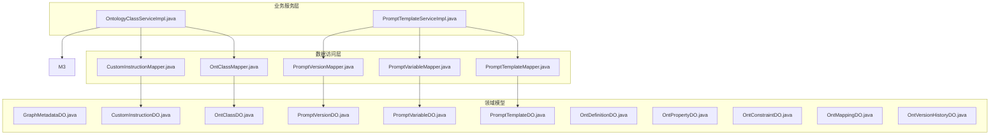
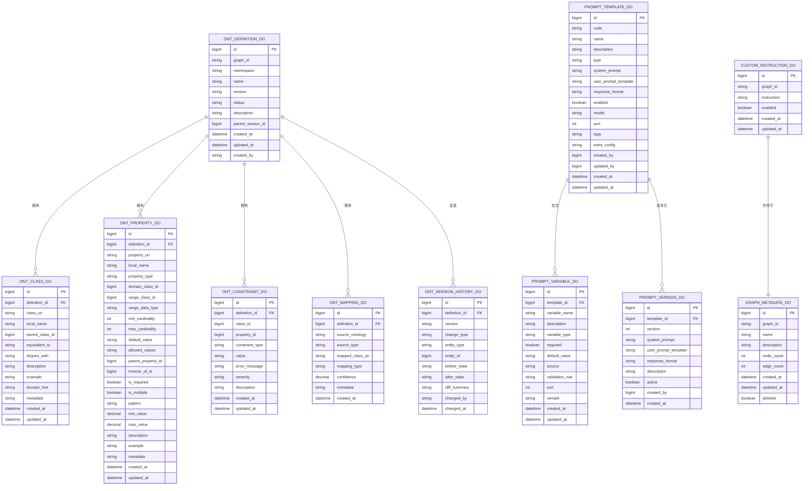
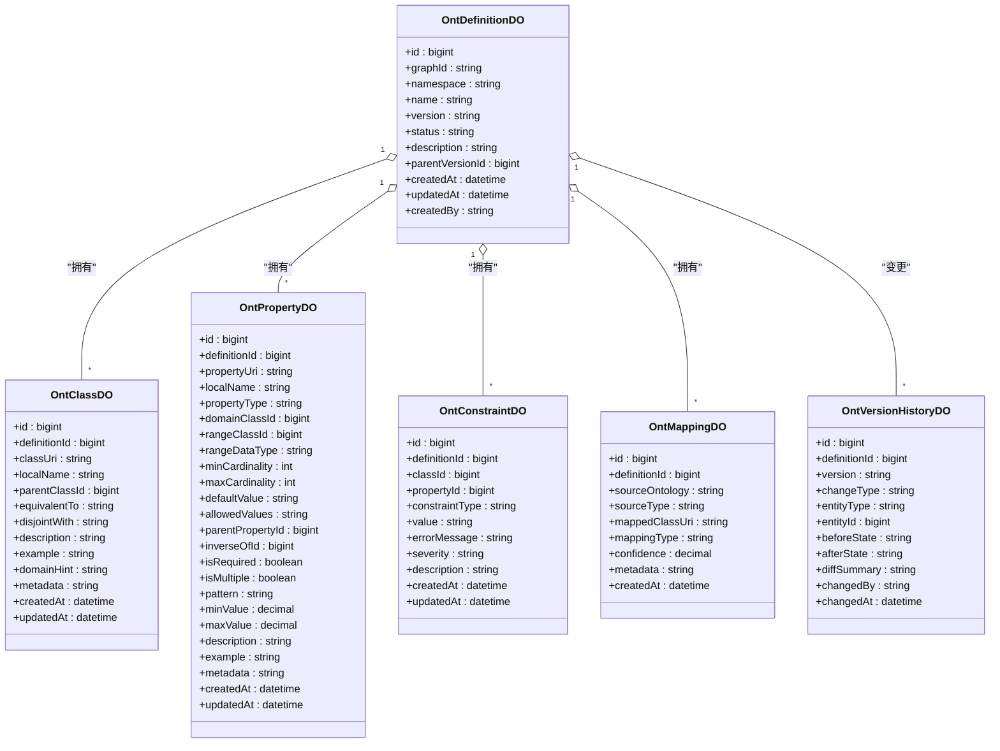
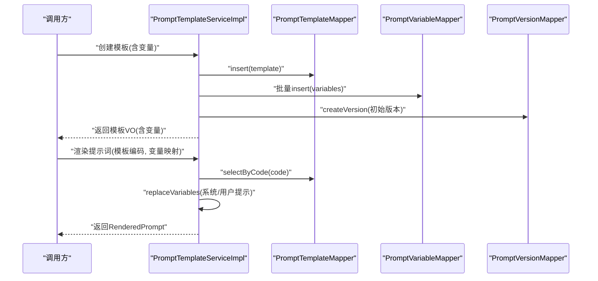
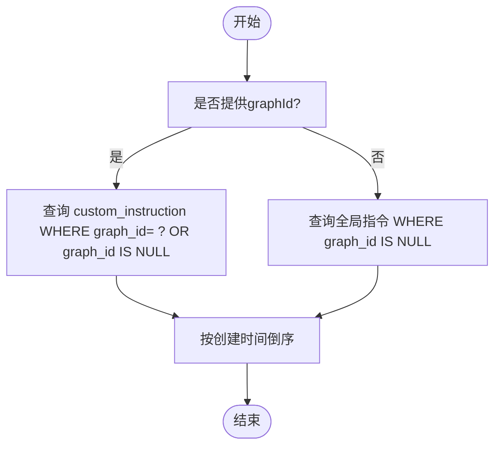
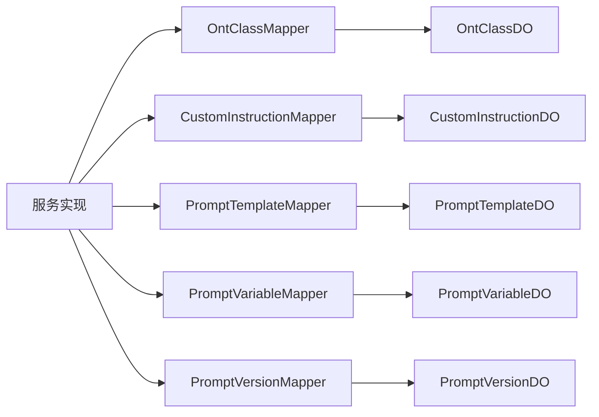

# 核心业务数据模型

<!--<cite>
**本文引用的文件**
- [GraphMetadataDO.java](file://ontograph-module-core/src/main/java/com/graphiti/module/graphiti/dal/dataobject/GraphMetadataDO.java)
- [OntClassDO.java](file://ontograph-module-core/src/main/java/com/graphiti/module/graphiti/dal/dataobject/ont/OntClassDO.java)
- [CustomInstructionDO.java](file://ontograph-module-core/src/main/java/com/graphiti/module/graphiti/dal/dataobject/CustomInstructionDO.java)
- [PromptTemplateDO.java](file://ontograph-module-core/src/main/java/com/graphiti/module/graphiti/dal/dataobject/PromptTemplateDO.java)
- [PromptVariableDO.java](file://ontograph-module-core/src/main/java/com/graphiti/module/graphiti/dal/dataobject/PromptVariableDO.java)
- [PromptVersionDO.java](file://ontograph-module-core/src/main/java/com/graphiti/module/graphiti/dal/dataobject/PromptVersionDO.java)
- [OntDefinitionDO.java](file://ontograph-module-core/src/main/java/com/graphiti/module/graphiti/dal/dataobject/ont/OntDefinitionDO.java)
- [OntPropertyDO.java](file://ontograph-module-core/src/main/java/com/graphiti/module/graphiti/dal/dataobject/ont/OntPropertyDO.java)
- [OntConstraintDO.java](file://ontograph-module-core/src/main/java/com/graphiti/module/graphiti/dal/dataobject/ont/OntConstraintDO.java)
- [OntMappingDO.java](file://ontograph-module-core/src/main/java/com/graphiti/module/graphiti/dal/dataobject/ont/OntMappingDO.java)
- [OntVersionHistoryDO.java](file://ontograph-module-core/src/main/java/com/graphiti/module/graphiti/dal/dataobject/ont/OntVersionHistoryDO.java)
- [OntClassMapper.java](file://ontograph-module-core/src/main/java/com/graphiti/module/graphiti/dal/mysql/ont/OntClassMapper.java)
- [CustomInstructionMapper.java](file://ontograph-module-core/src/main/java/com/graphiti/module/graphiti/dal/mysql/CustomInstructionMapper.java)
- [OntologyClassServiceImpl.java](file://ontograph-module-core/src/main/java/com/graphiti/module/graphiti/service/impl/OntologyClassServiceImpl.java)
- [PromptTemplateServiceImpl.java](file://ontograph-module-core/src/main/java/com/graphiti/module/graphiti/service/impl/PromptTemplateServiceImpl.java)
</cite>-->

## 目录
1. [引言](#引言)
2. [项目结构](#项目结构)
3. [核心组件](#核心组件)
4. [架构总览](#架构总览)
5. [详细组件分析](#详细组件分析)
6. [依赖分析](#依赖分析)
7. [性能考虑](#性能考虑)
8. [故障排查指南](#故障排查指南)
9. [结论](#结论)
10. [附录](#附录)

## 引言
本文件聚焦于OntoGraph项目的核心业务模块数据模型，系统性阐述知识图谱元数据、本体系统、提示词模板与自定义指令等关键实体的数据结构与业务逻辑。重点解析GraphMetadataDO、OntClassDO、CustomInstructionDO等复杂数据对象的字段语义、约束条件与使用场景；梳理本体类层级、属性约束与版本历史管理；阐明提示词模板的变量体系与版本控制机制；并给出实体关系图、数据访问层设计模式（分页、批量、事务）以及面向开发者的实践示例路径。

## 项目结构
核心业务数据模型主要位于ontograph-module-core模块的dal.dataobject与dal.mysql命名空间下，并由对应的service实现承载业务流程与事务控制。整体采用MyBatis-Plus的DO/Mapper/Service三层结构，配合Spring事务管理与Jackson序列化处理JSON字段。

图表来源
- [OntClassMapper.java:1-22](file://ontograph-module-core/src/main/java/com/graphiti/module/graphiti/dal/mysql/ont/OntClassMapper.java#L1-L22)
- [CustomInstructionMapper.java:1-19](file://ontograph-module-core/src/main/java/com/graphiti/module/graphiti/dal/mysql/CustomInstructionMapper.java#L1-L19)
- [OntologyClassServiceImpl.java:1-368](file://ontograph-module-core/src/main/java/com/graphiti/module/graphiti/service/impl/OntologyClassServiceImpl.java#L1-L368)
- [PromptTemplateServiceImpl.java:1-403](file://ontograph-module-core/src/main/java/com/graphiti/module/graphiti/service/impl/PromptTemplateServiceImpl.java#L1-L403)

章节来源
- [GraphMetadataDO.java:1-60](file://ontograph-module-core/src/main/java/com/graphiti/module/graphiti/dal/dataobject/GraphMetadataDO.java#L1-L60)
- [OntClassDO.java:1-49](file://ontograph-module-core/src/main/java/com/graphiti/module/graphiti/dal/dataobject/ont/OntClassDO.java#L1-L49)
- [CustomInstructionDO.java:1-40](file://ontograph-module-core/src/main/java/com/graphiti/module/graphiti/dal/dataobject/CustomInstructionDO.java#L1-L40)
- [PromptTemplateDO.java:1-99](file://ontograph-module-core/src/main/java/com/graphiti/module/graphiti/dal/dataobject/PromptTemplateDO.java#L1-L99)
- [PromptVariableDO.java:1-79](file://ontograph-module-core/src/main/java/com/graphiti/module/graphiti/dal/dataobject/PromptVariableDO.java#L1-L79)
- [PromptVersionDO.java:1-66](file://ontograph-module-core/src/main/java/com/graphiti/module/graphiti/dal/dataobject/PromptVersionDO.java#L1-L66)
- [OntDefinitionDO.java:1-36](file://ontograph-module-core/src/main/java/com/graphiti/module/graphiti/dal/dataobject/ont/OntDefinitionDO.java#L1-L36)
- [OntPropertyDO.java:1-78](file://ontograph-module-core/src/main/java/com/graphiti/module/graphiti/dal/dataobject/ont/OntPropertyDO.java#L1-L78)
- [OntConstraintDO.java:1-43](file://ontograph-module-core/src/main/java/com/graphiti/module/graphiti/dal/dataobject/ont/OntConstraintDO.java#L1-L43)
- [OntMappingDO.java:1-40](file://ontograph-module-core/src/main/java/com/graphiti/module/graphiti/dal/dataobject/ont/OntMappingDO.java#L1-L40)
- [OntVersionHistoryDO.java:1-31](file://ontograph-module-core/src/main/java/com/graphiti/module/graphiti/dal/dataobject/ont/OntVersionHistoryDO.java#L1-L31)

## 核心组件
本节对关键数据对象进行字段级解读与业务逻辑说明，帮助读者快速理解各实体的职责边界与约束条件。

- GraphMetadataDO（图谱元数据）
  - 关键字段：主键id、graphId（UUID）、name、description、nodeCount、edgeCount、createTime、updateTime、deleted（逻辑删除）
  - 业务要点：记录知识图谱的基本统计信息与生命周期，支持软删除与自动时间戳填充

- OntClassDO（本体类定义）
  - 关键字段：definitionId（所属本体定义）、classUri、localName、parentClassId（父子层级）、equivalentTo（等价类JSON数组）、disjointWith（不相交类JSON数组）、description、example、domainHint（域提示）、metadata（JSON元数据）
  - 业务要点：支撑类层级构建与等价/不相交约束表达，metadata用于扩展存储

- CustomInstructionDO（自定义抽取指令）
  - 关键字段：graphId（可为空表示全局）、instruction、enabled、createdAt、updatedAt
  - 业务要点：按图谱维度或全局生效的抽取提示词，支持启用/禁用

- PromptTemplateDO（提示词模板）
  - 关键字段：code（唯一编码）、name、description、type（任务类型）、systemPrompt、userPromptTemplate、responseFormat、enabled、model、sort、tags（JSON数组）、extraConfig、createdBy、updatedBy
  - 业务要点：统一管理提示词模板，支持变量占位符与版本控制

- PromptVariableDO（提示词变量）
  - 关键字段：templateId、variableName、description、variableType（string/list/json/text）、required、defaultValue、source（context/static/llm）、validationRule、sort、remark
  - 业务要点：定义模板可用变量及其约束与来源

- PromptVersionDO（提示词版本）
  - 关键字段：templateId、version、systemPrompt、userPromptTemplate、responseFormat、description、active、createdBy、createdAt
  - 业务要点：记录模板历史版本，支持版本切换与回滚

- OntDefinitionDO（本体定义）
  - 关键字段：graphId、namespace、name、version、status（ACTIVE/DEPRECATED/ARCHIVED）、description、parentVersionId、createdAt、updatedAt、createdBy
  - 业务要点：标识某图谱的本体版本与状态

- OntPropertyDO（本体属性）
  - 关键字段：definitionId、propertyUri、localName、propertyType（OBJECT/DATATYPE/ANNOTATION等）、domainClassId、rangeClassId、rangeDataType、minCardinality、maxCardinality、defaultValue、allowedValues、parentPropertyId、equivalentTo、inverseOfId、isRequired、isMultiple、pattern、minValue、maxValue、description、example、metadata
  - 业务要点：描述属性域/值域、基数约束、默认值与取值范围

- OntConstraintDO（本体约束）
  - 关键字段：definitionId、classId、propertyId、constraintType（CARDINALITY/PATTERN/RANGE/ENUM/NOT_NULL/CUSTOM_SPARQL）、value（JSON）、errorMessage、severity、description
  - 业务要点：对类/属性施加结构化约束，支持错误级别与SPARQL自定义

- OntMappingDO（本体映射）
  - 关键字段：definitionId、sourceOntology、sourceType、mappedClassUri、mappingType、confidence、metadata
  - 业务要点：跨本体映射记录，含置信度与元数据

- OntVersionHistoryDO（本体版本历史）
  - 关键字段：definitionId、version、changeType（CLASS_ADDED/PROPERTY_MODIFIED等）、entityType（CLASS/PROPERTY/CONSTRAINT/DEFINITION）、entityId、beforeState、afterState、diffSummary、changedBy、changedAt
  - 业务要点：记录本体变更轨迹，便于审计与回溯

章节来源
- [GraphMetadataDO.java:14-59](file://ontograph-module-core/src/main/java/com/graphiti/module/graphiti/dal/dataobject/GraphMetadataDO.java#L14-L59)
- [OntClassDO.java:10-48](file://ontograph-module-core/src/main/java/com/graphiti/module/graphiti/dal/dataobject/ont/OntClassDO.java#L10-L48)
- [CustomInstructionDO.java:13-39](file://ontograph-module-core/src/main/java/com/graphiti/module/graphiti/dal/dataobject/CustomInstructionDO.java#L13-L39)
- [PromptTemplateDO.java:14-98](file://ontograph-module-core/src/main/java/com/graphiti/module/graphiti/dal/dataobject/PromptTemplateDO.java#L14-L98)
- [PromptVariableDO.java:14-78](file://ontograph-module-core/src/main/java/com/graphiti/module/graphiti/dal/dataobject/PromptVariableDO.java#L14-L78)
- [PromptVersionDO.java:14-65](file://ontograph-module-core/src/main/java/com/graphiti/module/graphiti/dal/dataobject/PromptVersionDO.java#L14-L65)
- [OntDefinitionDO.java:10-35](file://ontograph-module-core/src/main/java/com/graphiti/module/graphiti/dal/dataobject/ont/OntDefinitionDO.java#L10-L35)
- [OntPropertyDO.java:11-77](file://ontograph-module-core/src/main/java/com/graphiti/module/graphiti/dal/dataobject/ont/OntPropertyDO.java#L11-L77)
- [OntConstraintDO.java:10-42](file://ontograph-module-core/src/main/java/com/graphiti/module/graphiti/dal/dataobject/ont/OntConstraintDO.java#L10-L42)
- [OntMappingDO.java:12-39](file://ontograph-module-core/src/main/java/com/graphiti/module/graphiti/dal/dataobject/ont/OntMappingDO.java#L12-L39)
- [OntVersionHistoryDO.java:9-30](file://ontograph-module-core/src/main/java/com/graphiti/module/graphiti/dal/dataobject/ont/OntVersionHistoryDO.java#L9-L30)

## 架构总览
下图展示核心业务实体之间的关系与依赖方向，强调本体定义驱动类与属性、约束与映射的关系，以及提示词模板与其变量、版本的关联。

图表来源
- [OntDefinitionDO.java:10-35](file://ontograph-module-core/src/main/java/com/graphiti/module/graphiti/dal/dataobject/ont/OntDefinitionDO.java#L10-L35)
- [OntClassDO.java:10-48](file://ontograph-module-core/src/main/java/com/graphiti/module/graphiti/dal/dataobject/ont/OntClassDO.java#L10-L48)
- [OntPropertyDO.java:11-77](file://ontograph-module-core/src/main/java/com/graphiti/module/graphiti/dal/dataobject/ont/OntPropertyDO.java#L11-L77)
- [OntConstraintDO.java:10-42](file://ontograph-module-core/src/main/java/com/graphiti/module/graphiti/dal/dataobject/ont/OntConstraintDO.java#L10-L42)
- [OntMappingDO.java:12-39](file://ontograph-module-core/src/main/java/com/graphiti/module/graphiti/dal/dataobject/ont/OntMappingDO.java#L12-L39)
- [OntVersionHistoryDO.java:9-30](file://ontograph-module-core/src/main/java/com/graphiti/module/graphiti/dal/dataobject/ont/OntVersionHistoryDO.java#L9-L30)
- [PromptTemplateDO.java:14-98](file://ontograph-module-core/src/main/java/com/graphiti/module/graphiti/dal/dataobject/PromptTemplateDO.java#L14-L98)
- [PromptVariableDO.java:14-78](file://ontograph-module-core/src/main/java/com/graphiti/module/graphiti/dal/dataobject/PromptVariableDO.java#L14-L78)
- [PromptVersionDO.java:14-65](file://ontograph-module-core/src/main/java/com/graphiti/module/graphiti/dal/dataobject/PromptVersionDO.java#L14-L65)
- [CustomInstructionDO.java:13-39](file://ontograph-module-core/src/main/java/com/graphiti/module/graphiti/dal/dataobject/CustomInstructionDO.java#L13-L39)
- [GraphMetadataDO.java:14-59](file://ontograph-module-core/src/main/java/com/graphiti/module/graphiti/dal/dataobject/GraphMetadataDO.java#L14-L59)

## 详细组件分析

### 本体类层级与约束设计
- 层级结构
  - 通过parentClassId形成树形层级，根类无父节点；支持遍历与后代收集
  - 支持等价类与不相交类的JSON数组表达，便于推理与一致性校验
- 属性与约束
  - 属性具备域/值域类、数据类型、基数约束、默认值与取值枚举等
  - 约束以JSON形式存储，涵盖基数、正则、数值范围、枚举与自定义SPARQL
- 版本历史
  - 通过变更类型与实体类型区分CLASS/PROPERTY/CONSTRAINT/DEFINITION的变更，记录前后状态快照

图表来源
- [OntDefinitionDO.java:10-35](file://ontograph-module-core/src/main/java/com/graphiti/module/graphiti/dal/dataobject/ont/OntDefinitionDO.java#L10-L35)
- [OntClassDO.java:10-48](file://ontograph-module-core/src/main/java/com/graphiti/module/graphiti/dal/dataobject/ont/OntClassDO.java#L10-L48)
- [OntPropertyDO.java:11-77](file://ontograph-module-core/src/main/java/com/graphiti/module/graphiti/dal/dataobject/ont/OntPropertyDO.java#L11-L77)
- [OntConstraintDO.java:10-42](file://ontograph-module-core/src/main/java/com/graphiti/module/graphiti/dal/dataobject/ont/OntConstraintDO.java#L10-L42)
- [OntMappingDO.java:12-39](file://ontograph-module-core/src/main/java/com/graphiti/module/graphiti/dal/dataobject/ont/OntMappingDO.java#L12-L39)
- [OntVersionHistoryDO.java:9-30](file://ontograph-module-core/src/main/java/com/graphiti/module/graphiti/dal/dataobject/ont/OntVersionHistoryDO.java#L9-L30)

章节来源
- [OntologyClassServiceImpl.java:102-170](file://ontograph-module-core/src/main/java/com/graphiti/module/graphiti/service/impl/OntologyClassServiceImpl.java#L102-L170)
- [OntologyClassServiceImpl.java:217-251](file://ontograph-module-core/src/main/java/com/graphiti/module/graphiti/service/impl/OntologyClassServiceImpl.java#L217-L251)

### 提示词模板系统与变量体系
- 模板与变量
  - 模板定义systemPrompt与userPromptTemplate，支持变量占位符{var}
  - 变量定义variableType、required、defaultValue、validationRule、sort等
- 渲染与版本
  - 渲染时按变量映射替换占位符，返回系统提示与用户提示
  - 版本管理支持创建新版本、查询历史、回滚到指定版本
- 数据流
  - 服务层负责模板创建/更新、变量同步、版本创建与回滚

图表来源
- [PromptTemplateServiceImpl.java:45-94](file://ontograph-module-core/src/main/java/com/graphiti/module/graphiti/service/impl/PromptTemplateServiceImpl.java#L45-L94)
- [PromptTemplateServiceImpl.java:213-236](file://ontograph-module-core/src/main/java/com/graphiti/module/graphiti/service/impl/PromptTemplateServiceImpl.java#L213-L236)
- [PromptTemplateServiceImpl.java:264-334](file://ontograph-module-core/src/main/java/com/graphiti/module/graphiti/service/impl/PromptTemplateServiceImpl.java#L264-L334)

章节来源
- [PromptTemplateServiceImpl.java:1-403](file://ontograph-module-core/src/main/java/com/graphiti/module/graphiti/service/impl/PromptTemplateServiceImpl.java#L1-L403)
- [PromptTemplateDO.java:14-98](file://ontograph-module-core/src/main/java/com/graphiti/module/graphiti/dal/dataobject/PromptTemplateDO.java#L14-L98)
- [PromptVariableDO.java:14-78](file://ontograph-module-core/src/main/java/com/graphiti/module/graphiti/dal/dataobject/PromptVariableDO.java#L14-L78)
- [PromptVersionDO.java:14-65](file://ontograph-module-core/src/main/java/com/graphiti/module/graphiti/dal/dataobject/PromptVersionDO.java#L14-L65)

### 自定义抽取指令
- 作用域
  - graphId为空表示全局指令，否则仅对特定图谱生效
- 查询策略
  - 支持按图谱ID查询，或查询全局指令集，按创建时间倒序排列

图表来源
- [CustomInstructionMapper.java:13-18](file://ontograph-module-core/src/main/java/com/graphiti/module/graphiti/dal/mysql/CustomInstructionMapper.java#L13-L18)

章节来源
- [CustomInstructionDO.java:13-39](file://ontograph-module-core/src/main/java/com/graphiti/module/graphiti/dal/dataobject/CustomInstructionDO.java#L13-L39)
- [CustomInstructionMapper.java:1-19](file://ontograph-module-core/src/main/java/com/graphiti/module/graphiti/dal/mysql/CustomInstructionMapper.java#L1-L19)

### 知识图谱元数据
- 字段与用途
  - graphId唯一标识图谱；name/description提供基本信息；nodeCount/edgeCount用于统计
  - createTime/updateTime与deleted支持审计与软删除

章节来源
- [GraphMetadataDO.java:14-59](file://ontograph-module-core/src/main/java/com/graphiti/module/graphiti/dal/dataobject/GraphMetadataDO.java#L14-L59)

## 依赖分析
- Mapper与DO
  - Mapper基于MyBatis-Plus的BaseMapper，提供通用CRUD与自定义SQL查询
  - DO通过注解映射表字段与逻辑删除，统一时间戳填充
- Service与Mapper
  - 服务层聚合多个Mapper，执行跨表事务，封装业务规则与状态转换
  - 使用ObjectMapper处理JSON字段序列化/反序列化
- 事务与批量
  - 事务注解覆盖创建/更新/删除与版本切换等关键流程
  - 批量操作通过Mapper批量删除与插入实现

图表来源
- [OntologyClassServiceImpl.java:36-41](file://ontograph-module-core/src/main/java/com/graphiti/module/graphiti/service/impl/OntologyClassServiceImpl.java#L36-L41)
- [PromptTemplateServiceImpl.java:36-39](file://ontograph-module-core/src/main/java/com/graphiti/module/graphiti/service/impl/PromptTemplateServiceImpl.java#L36-L39)

章节来源
- [OntClassMapper.java:1-22](file://ontograph-module-core/src/main/java/com/graphiti/module/graphiti/dal/mysql/ont/OntClassMapper.java#L1-L22)
- [CustomInstructionMapper.java:1-19](file://ontograph-module-core/src/main/java/com/graphiti/module/graphiti/dal/mysql/CustomInstructionMapper.java#L1-L19)
- [OntologyClassServiceImpl.java:1-368](file://ontograph-module-core/src/main/java/com/graphiti/module/graphiti/service/impl/OntologyClassServiceImpl.java#L1-L368)
- [PromptTemplateServiceImpl.java:1-403](file://ontograph-module-core/src/main/java/com/graphiti/module/graphiti/service/impl/PromptTemplateServiceImpl.java#L1-L403)

## 性能考虑
- 分页查询
  - 建议在服务层结合Mapper的分页能力（MyBatis-Plus Page）对大列表进行分页加载，避免一次性拉取过多数据
- 批量操作
  - 对变量与版本的批量写入，优先使用Mapper提供的批量插入/删除接口，减少往返次数
- 事务边界
  - 将模板创建/更新、变量重建、版本创建置于同一事务，确保一致性
- JSON字段处理
  - 对metadata、tags、extraConfig等字段，建议在服务层做空值与格式校验，避免数据库层异常
- 索引与查询
  - 为常用过滤字段（如graph_id、code、definition_id）建立索引，提升查询效率

## 故障排查指南
- 本体类删除失败
  - 现象：提示“存在子类型，请先删除子类型”
  - 处理：先删除子类，再删除父类；或在服务层递归删除
  - 参考路径：[OntologyClassServiceImpl.java:153-169](file://ontograph-module-core/src/main/java/com/graphiti/module/graphiti/service/impl/OntologyClassServiceImpl.java#L153-L169)
- 模板编码重复
  - 现象：创建/更新时抛出“模板编码已存在”
  - 处理：修改模板编码或确认唯一性
  - 参考路径：[PromptTemplateServiceImpl.java:48-52](file://ontograph-module-core/src/main/java/com/graphiti/module/graphiti/service/impl/PromptTemplateServiceImpl.java#L48-L52)
- 变量渲染缺失
  - 现象：提示词中占位符未被替换
  - 处理：确认变量名与传入映射一致，检查变量required与defaultValue
  - 参考路径：[PromptTemplateServiceImpl.java:241-260](file://ontograph-module-core/src/main/java/com/graphiti/module/graphiti/service/impl/PromptTemplateServiceImpl.java#L241-L260)
- 版本回滚异常
  - 现象：回滚后其他版本仍标记为活跃
  - 处理：确认服务层逻辑已将除目标版本外的其他版本设为非活跃
  - 参考路径：[PromptTemplateServiceImpl.java:307-334](file://ontograph-module-core/src/main/java/com/graphiti/module/graphiti/service/impl/PromptTemplateServiceImpl.java#L307-L334)

章节来源
- [OntologyClassServiceImpl.java:153-169](file://ontograph-module-core/src/main/java/com/graphiti/module/graphiti/service/impl/OntologyClassServiceImpl.java#L153-L169)
- [PromptTemplateServiceImpl.java:48-52](file://ontograph-module-core/src/main/java/com/graphiti/module/graphiti/service/impl/PromptTemplateServiceImpl.java#L48-L52)
- [PromptTemplateServiceImpl.java:241-260](file://ontograph-module-core/src/main/java/com/graphiti/module/graphiti/service/impl/PromptTemplateServiceImpl.java#L241-L260)
- [PromptTemplateServiceImpl.java:307-334](file://ontograph-module-core/src/main/java/com/graphiti/module/graphiti/service/impl/PromptTemplateServiceImpl.java#L307-L334)

## 结论
本文件系统性梳理了Graphiti核心业务数据模型，明确了本体类层级、属性约束与版本历史管理的设计思路，阐述了提示词模板的变量体系与版本控制机制，并给出了数据访问层的事务与批量操作模式。通过实体关系图与流程图，开发者可以快速定位关键字段与业务流程，指导在知识图谱应用中正确使用这些数据模型。

## 附录
- 开发者实践示例（路径指引）
  - 创建本体定义与类
    - 示例路径：[OntologyClassServiceImpl.java:45-62](file://ontograph-module-core/src/main/java/com/graphiti/module/graphiti/service/impl/OntologyClassServiceImpl.java#L45-L62)
  - 新增/更新本体类
    - 示例路径：[OntologyClassServiceImpl.java:102-151](file://ontograph-module-core/src/main/java/com/graphiti/module/graphiti/service/impl/OntologyClassServiceImpl.java#L102-L151)
  - 删除本体类（含子类检查）
    - 示例路径：[OntologyClassServiceImpl.java:153-169](file://ontograph-module-core/src/main/java/com/graphiti/module/graphiti/service/impl/OntologyClassServiceImpl.java#L153-L169)
  - 查询类层级与后代
    - 示例路径：[OntologyClassServiceImpl.java:187-200](file://ontograph-module-core/src/main/java/com/graphiti/module/graphiti/service/impl/OntologyClassServiceImpl.java#L187-L200)
  - 创建提示词模板与变量
    - 示例路径：[PromptTemplateServiceImpl.java:45-94](file://ontograph-module-core/src/main/java/com/graphiti/module/graphiti/service/impl/PromptTemplateServiceImpl.java#L45-L94)
  - 渲染提示词
    - 示例路径：[PromptTemplateServiceImpl.java:213-236](file://ontograph-module-core/src/main/java/com/graphiti/module/graphiti/service/impl/PromptTemplateServiceImpl.java#L213-L236)
  - 创建版本与回滚
    - 示例路径：[PromptTemplateServiceImpl.java:264-334](file://ontograph-module-core/src/main/java/com/graphiti/module/graphiti/service/impl/PromptTemplateServiceImpl.java#L264-L334)
  - 查询自定义指令（按图谱或全局）
    - 示例路径：[CustomInstructionMapper.java:13-18](file://ontograph-module-core/src/main/java/com/graphiti/module/graphiti/dal/mysql/CustomInstructionMapper.java#L13-L18)