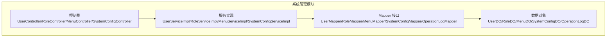
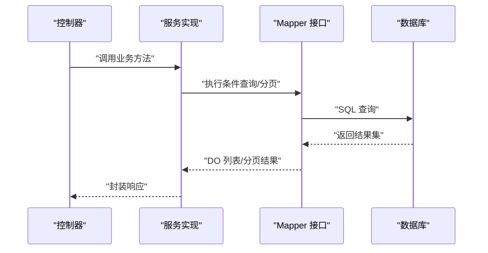
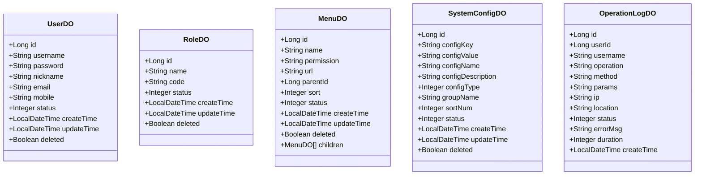
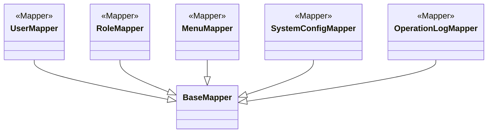
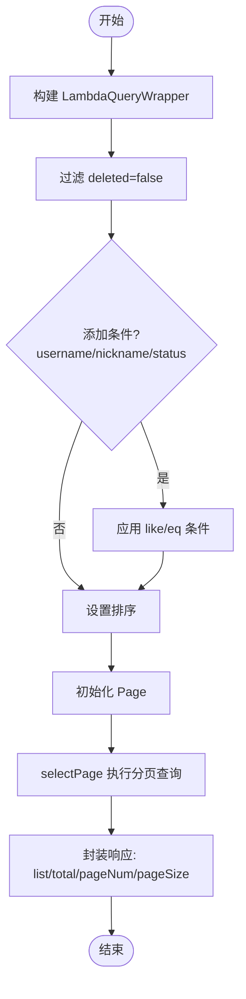
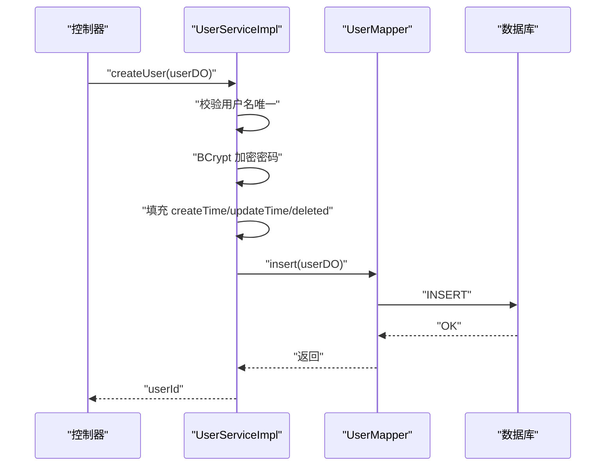
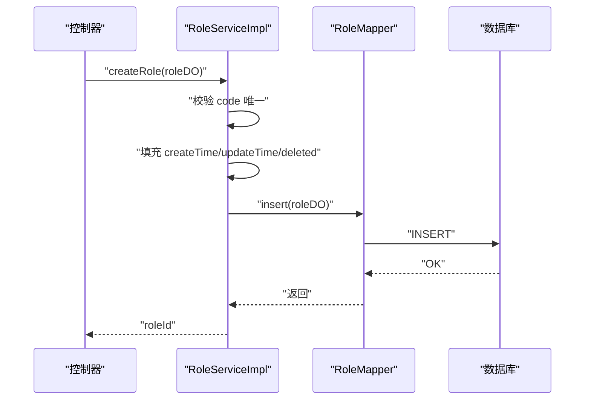
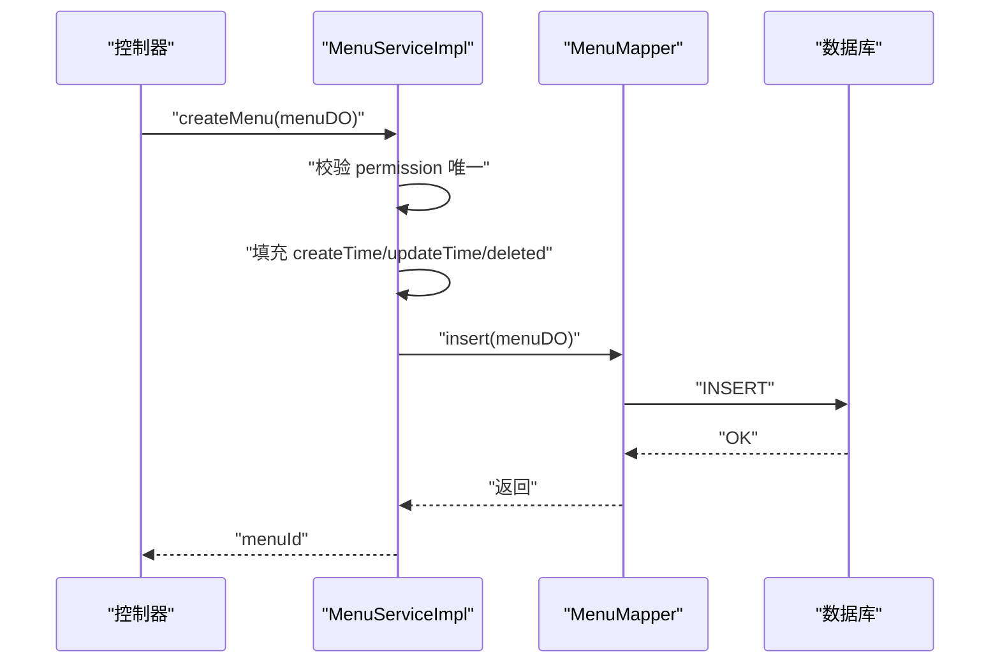
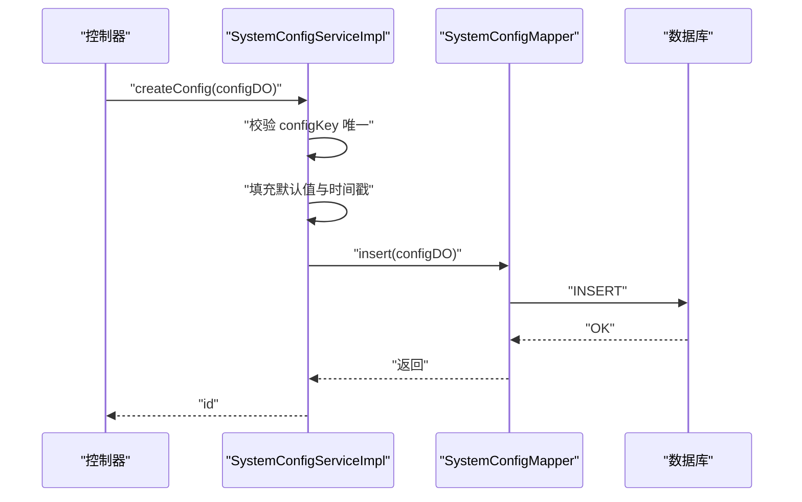
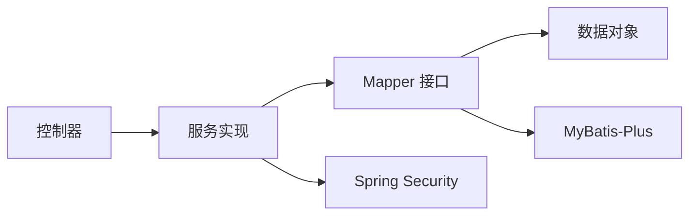

# 系统管理数据模型

<!--<cite>
**本文引用的文件**
- [UserDO.java](file://graphiti-module-system/src/main/java/com/graphiti/system/dal/dataobject/UserDO.java)
- [RoleDO.java](file://graphiti-module-system/src/main/java/com/graphiti/system/dal/dataobject/RoleDO.java)
- [MenuDO.java](file://graphiti-module-system/src/main/java/com/graphiti/system/dal/dataobject/MenuDO.java)
- [SystemConfigDO.java](file://graphiti-module-system/src/main/java/com/graphiti/system/dal/dataobject/SystemConfigDO.java)
- [OperationLogDO.java](file://graphiti-module-system/src/main/java/com/graphiti/system/dal/dataobject/OperationLogDO.java)
- [UserMapper.java](file://graphiti-module-system/src/main/java/com/graphiti/system/dal/mysql/UserMapper.java)
- [RoleMapper.java](file://graphiti-module-system/src/main/java/com/graphiti/system/dal/mysql/RoleMapper.java)
- [MenuMapper.java](file://graphiti-module-system/src/main/java/com/graphiti/system/dal/mysql/MenuMapper.java)
- [SystemConfigMapper.java](file://graphiti-module-system/src/main/java/com/graphiti/system/dal/mysql/SystemConfigMapper.java)
- [OperationLogMapper.java](file://graphiti-module-system/src/main/java/com/graphiti/system/dal/mysql/OperationLogMapper.java)
- [UserServiceImpl.java](file://graphiti-module-system/src/main/java/com/graphiti/system/service/impl/UserServiceImpl.java)
- [RoleServiceImpl.java](file://graphiti-module-system/src/main/java/com/graphiti/system/service/impl/RoleServiceImpl.java)
- [MenuServiceImpl.java](file://graphiti-module-system/src/main/java/com/graphiti/system/service/impl/MenuServiceImpl.java)
- [SystemConfigServiceImpl.java](file://graphiti-module-system/src/main/java/com/graphiti/system/service/impl/SystemConfigServiceImpl.java)
</cite>-->

## 目录
1. [简介](#简介)
2. [项目结构](#项目结构)
3. [核心组件](#核心组件)
4. [架构总览](#架构总览)
5. [详细组件分析](#详细组件分析)
6. [依赖分析](#依赖分析)
7. [性能考虑](#性能考虑)
8. [故障排查指南](#故障排查指南)
9. [结论](#结论)
10. [附录](#附录)

## 简介
本文件聚焦于系统管理模块的数据模型与访问层设计，覆盖用户管理、角色权限、菜单管理与系统配置等核心实体。文档从数据对象字段定义、MyBatis-Plus 注解使用、Mapper 接口设计模式、条件查询与分页策略、实体关系与索引设计等方面进行系统化梳理，并提供面向开发者的最佳实践与排错建议。

## 项目结构
系统管理模块位于 graphiti-module-system，采用按功能域划分的目录组织方式：
- dal/dataobject：持久化实体（DO）
- dal/mysql：MyBatis-Plus Mapper 接口
- service/impl：业务服务实现
- controller：对外接口（用于理解调用链）

**图表来源**
- [UserDO.java:1-38](file://graphiti-module-system/src/main/java/com/graphiti/system/dal/dataobject/UserDO.java#L1-L38)
- [RoleDO.java:1-32](file://graphiti-module-system/src/main/java/com/graphiti/system/dal/dataobject/RoleDO.java#L1-L32)
- [MenuDO.java:1-45](file://graphiti-module-system/src/main/java/com/graphiti/system/dal/dataobject/MenuDO.java#L1-L45)
- [SystemConfigDO.java:1-42](file://graphiti-module-system/src/main/java/com/graphiti/system/dal/dataobject/SystemConfigDO.java#L1-L42)
- [OperationLogDO.java:1-42](file://graphiti-module-system/src/main/java/com/graphiti/system/dal/dataobject/OperationLogDO.java#L1-L42)
- [UserMapper.java:1-13](file://graphiti-module-system/src/main/java/com/graphiti/system/dal/mysql/UserMapper.java#L1-L13)
- [RoleMapper.java:1-13](file://graphiti-module-system/src/main/java/com/graphiti/system/dal/mysql/RoleMapper.java#L1-L13)
- [MenuMapper.java:1-13](file://graphiti-module-system/src/main/java/com/graphiti/system/dal/mysql/MenuMapper.java#L1-L13)
- [SystemConfigMapper.java:1-13](file://graphiti-module-system/src/main/java/com/graphiti/system/dal/mysql/SystemConfigMapper.java#L1-L13)
- [OperationLogMapper.java:1-13](file://graphiti-module-system/src/main/java/com/graphiti/system/dal/mysql/OperationLogMapper.java#L1-L13)
- [UserServiceImpl.java:1-113](file://graphiti-module-system/src/main/java/com/graphiti/system/service/impl/UserServiceImpl.java#L1-L113)
- [RoleServiceImpl.java:1-81](file://graphiti-module-system/src/main/java/com/graphiti/system/service/impl/RoleServiceImpl.java#L1-L81)
- [MenuServiceImpl.java:1-81](file://graphiti-module-system/src/main/java/com/graphiti/system/service/impl/MenuServiceImpl.java#L1-L81)
- [SystemConfigServiceImpl.java:1-123](file://graphiti-module-system/src/main/java/com/graphiti/system/service/impl/SystemConfigServiceImpl.java#L1-L123)

**章节来源**
- [UserDO.java:1-38](file://graphiti-module-system/src/main/java/com/graphiti/system/dal/dataobject/UserDO.java#L1-L38)
- [RoleDO.java:1-32](file://graphiti-module-system/src/main/java/com/graphiti/system/dal/dataobject/RoleDO.java#L1-L32)
- [MenuDO.java:1-45](file://graphiti-module-system/src/main/java/com/graphiti/system/dal/dataobject/MenuDO.java#L1-L45)
- [SystemConfigDO.java:1-42](file://graphiti-module-system/src/main/java/com/graphiti/system/dal/dataobject/SystemConfigDO.java#L1-L42)
- [OperationLogDO.java:1-42](file://graphiti-module-system/src/main/java/com/graphiti/system/dal/dataobject/OperationLogDO.java#L1-L42)
- [UserMapper.java:1-13](file://graphiti-module-system/src/main/java/com/graphiti/system/dal/mysql/UserMapper.java#L1-L13)
- [RoleMapper.java:1-13](file://graphiti-module-system/src/main/java/com/graphiti/system/dal/mysql/RoleMapper.java#L1-L13)
- [MenuMapper.java:1-13](file://graphiti-module-system/src/main/java/com/graphiti/system/dal/mysql/MenuMapper.java#L1-L13)
- [SystemConfigMapper.java:1-13](file://graphiti-module-system/src/main/java/com/graphiti/system/dal/mysql/SystemConfigMapper.java#L1-L13)
- [OperationLogMapper.java:1-13](file://graphiti-module-system/src/main/java/com/graphiti/system/dal/mysql/OperationLogMapper.java#L1-L13)
- [UserServiceImpl.java:1-113](file://graphiti-module-system/src/main/java/com/graphiti/system/service/impl/UserServiceImpl.java#L1-L113)
- [RoleServiceImpl.java:1-81](file://graphiti-module-system/src/main/java/com/graphiti/system/service/impl/RoleServiceImpl.java#L1-L81)
- [MenuServiceImpl.java:1-81](file://graphiti-module-system/src/main/java/com/graphiti/system/service/impl/MenuServiceImpl.java#L1-L81)
- [SystemConfigServiceImpl.java:1-123](file://graphiti-module-system/src/main/java/com/graphiti/system/service/impl/SystemConfigServiceImpl.java#L1-L123)

## 核心组件
本节对关键数据对象进行字段定义、业务语义与注解使用说明，并给出字段映射表与索引设计建议。

- UserDO（系统用户）
  - 字段概览：主键、用户名、密码、昵称、邮箱、手机号、状态、创建/更新时间、逻辑删除标记
  - 关键注解：@TableName("sys_user")、@TableId
  - 业务要点：密码统一使用 BCrypt 加密存储；软删除通过 deleted 字段控制
  - 建议索引：username（唯一）、email、mobile（如需唯一可建立唯一索引）

- RoleDO（系统角色）
  - 字段概览：主键、角色名、角色编码、状态、创建/更新时间、逻辑删除标记
  - 关键注解：@TableName("sys_role")、@TableId
  - 业务要点：角色编码用于权限识别，需唯一性校验
  - 建议索引：code（唯一）

- MenuDO（系统菜单）
  - 字段概览：主键、菜单名、权限标识(permission)、URL、父级ID(parentId)、排序(sort)、状态、创建/更新时间、逻辑删除标记
  - 关键注解：@TableName("sys_menu")、@TableId、@TableField(exist=false) 用于排除数据库列映射
  - 业务要点：permission 作为权限表达式；children 字段用于树形渲染（非持久化）
  - 建议索引：permission（唯一）、parentId、sort

- SystemConfigDO（系统配置）
  - 字段概览：主键、配置键、配置值、配置名称、描述、配置类型、分组名、排序号、状态、创建/更新时间、逻辑删除标记
  - 关键注解：@TableName("sys_system_config")、@TableId
  - 业务要点：配置类型支持文本/数字/布尔/JSON；分组+排序用于前端展示
  - 建议索引：configKey（唯一）、groupName、sortNum

- OperationLogDO（系统操作日志）
  - 字段概览：主键、用户ID/用户名、操作描述、方法、请求参数、IP、位置、状态、错误信息、耗时(ms)、创建时间
  - 关键注解：@TableName("sys_operation_log")、@TableId
  - 业务要点：记录操作结果与异常信息，便于审计与排错
  - 建议索引：userId、username、method、operation、createTime

字段映射表（示例，仅展示关键字段与类型说明）
- sys_user
  - id: 主键
  - username: 唯一标识
  - password: 密文
  - nickname: 昵称
  - email: 邮箱
  - mobile: 手机号
  - status: 状态
  - deleted: 逻辑删除
  - create_time/update_time: 时间戳

- sys_role
  - id: 主键
  - name/code: 角色名/编码
  - status: 状态
  - deleted: 逻辑删除
  - create_time/update_time: 时间戳

- sys_menu
  - id: 主键
  - name/permission/url/parent_id/sort/status: 菜单属性
  - deleted: 逻辑删除
  - create_time/update_time: 时间戳

- sys_system_config
  - id: 主键
  - config_key/config_value/config_name/config_description: 配置项
  - config_type/group_name/sort_num/status: 类型/分组/排序/状态
  - deleted: 逻辑删除
  - create_time/update_time: 时间戳

- sys_operation_log
  - id: 主键
  - user_id/username/operation/method/params/ip/location/status/error_msg/duration: 日志内容
  - create_time: 时间戳

**章节来源**
- [UserDO.java:1-38](file://graphiti-module-system/src/main/java/com/graphiti/system/dal/dataobject/UserDO.java#L1-L38)
- [RoleDO.java:1-32](file://graphiti-module-system/src/main/java/com/graphiti/system/dal/dataobject/RoleDO.java#L1-L32)
- [MenuDO.java:1-45](file://graphiti-module-system/src/main/java/com/graphiti/system/dal/dataobject/MenuDO.java#L1-L45)
- [SystemConfigDO.java:1-42](file://graphiti-module-system/src/main/java/com/graphiti/system/dal/dataobject/SystemConfigDO.java#L1-L42)
- [OperationLogDO.java:1-42](file://graphiti-module-system/src/main/java/com/graphiti/system/dal/dataobject/OperationLogDO.java#L1-L42)

## 架构总览
系统管理模块遵循典型的分层架构：Controller -> Service -> Mapper -> DO。MyBatis-Plus 的 BaseMapper 提供通用 CRUD，结合 LambdaQueryWrapper 实现条件查询与分页。

**图表来源**
- [UserServiceImpl.java:1-113](file://graphiti-module-system/src/main/java/com/graphiti/system/service/impl/UserServiceImpl.java#L1-L113)
- [RoleServiceImpl.java:1-81](file://graphiti-module-system/src/main/java/com/graphiti/system/service/impl/RoleServiceImpl.java#L1-L81)
- [MenuServiceImpl.java:1-81](file://graphiti-module-system/src/main/java/com/graphiti/system/service/impl/MenuServiceImpl.java#L1-L81)
- [SystemConfigServiceImpl.java:1-123](file://graphiti-module-system/src/main/java/com/graphiti/system/service/impl/SystemConfigServiceImpl.java#L1-L123)
- [UserMapper.java:1-13](file://graphiti-module-system/src/main/java/com/graphiti/system/dal/mysql/UserMapper.java#L1-L13)
- [RoleMapper.java:1-13](file://graphiti-module-system/src/main/java/com/graphiti/system/dal/mysql/RoleMapper.java#L1-L13)
- [MenuMapper.java:1-13](file://graphiti-module-system/src/main/java/com/graphiti/system/dal/mysql/MenuMapper.java#L1-L13)
- [SystemConfigMapper.java:1-13](file://graphiti-module-system/src/main/java/com/graphiti/system/dal/mysql/SystemConfigMapper.java#L1-L13)

## 详细组件分析

### 数据对象与注解使用
- MyBatis-Plus 注解
  - @TableName：声明表名映射
  - @TableId：声明主键，支持 ID 生成策略（默认由 MyBatis-Plus 处理）
  - @TableField：声明字段映射或忽略字段（exist=false 表示不映射到数据库列）
  - @JsonIgnore：用于序列化时忽略字段（如 MenuDO 的 children）

- 字段设计要点
  - 逻辑删除 deleted：统一使用布尔值表示是否删除
  - 时间字段：统一使用 LocalDateTime，便于跨时区处理
  - 权限标识 permission：用于菜单与鉴权匹配
  - 配置类型 config_type：枚举化（文本/数字/布尔/JSON），便于前端渲染与校验

**图表来源**
- [UserDO.java:1-38](file://graphiti-module-system/src/main/java/com/graphiti/system/dal/dataobject/UserDO.java#L1-L38)
- [RoleDO.java:1-32](file://graphiti-module-system/src/main/java/com/graphiti/system/dal/dataobject/RoleDO.java#L1-L32)
- [MenuDO.java:1-45](file://graphiti-module-system/src/main/java/com/graphiti/system/dal/dataobject/MenuDO.java#L1-L45)
- [SystemConfigDO.java:1-42](file://graphiti-module-system/src/main/java/com/graphiti/system/dal/dataobject/SystemConfigDO.java#L1-L42)
- [OperationLogDO.java:1-42](file://graphiti-module-system/src/main/java/com/graphiti/system/dal/dataobject/OperationLogDO.java#L1-L42)

**章节来源**
- [UserDO.java:1-38](file://graphiti-module-system/src/main/java/com/graphiti/system/dal/dataobject/UserDO.java#L1-L38)
- [RoleDO.java:1-32](file://graphiti-module-system/src/main/java/com/graphiti/system/dal/dataobject/RoleDO.java#L1-L32)
- [MenuDO.java:1-45](file://graphiti-module-system/src/main/java/com/graphiti/system/dal/dataobject/MenuDO.java#L1-L45)
- [SystemConfigDO.java:1-42](file://graphiti-module-system/src/main/java/com/graphiti/system/dal/dataobject/SystemConfigDO.java#L1-L42)
- [OperationLogDO.java:1-42](file://graphiti-module-system/src/main/java/com/graphiti/system/dal/dataobject/OperationLogDO.java#L1-L42)

### Mapper 接口设计模式
- 统一继承 BaseMapper<T>
  - 提供标准 CRUD、条件构造器、分页查询等能力
- 自定义 SQL
  - 当前实现主要依赖条件构造器与分页插件，未见显式自定义 XML SQL
  - 如需复杂查询，可在对应 Mapper 中扩展方法并通过 XML 或注解方式补充

**图表来源**
- [UserMapper.java:1-13](file://graphiti-module-system/src/main/java/com/graphiti/system/dal/mysql/UserMapper.java#L1-L13)
- [RoleMapper.java:1-13](file://graphiti-module-system/src/main/java/com/graphiti/system/dal/mysql/RoleMapper.java#L1-L13)
- [MenuMapper.java:1-13](file://graphiti-module-system/src/main/java/com/graphiti/system/dal/mysql/MenuMapper.java#L1-L13)
- [SystemConfigMapper.java:1-13](file://graphiti-module-system/src/main/java/com/graphiti/system/dal/mysql/SystemConfigMapper.java#L1-L13)
- [OperationLogMapper.java:1-13](file://graphiti-module-system/src/main/java/com/graphiti/system/dal/mysql/OperationLogMapper.java#L1-L13)

**章节来源**
- [UserMapper.java:1-13](file://graphiti-module-system/src/main/java/com/graphiti/system/dal/mysql/UserMapper.java#L1-L13)
- [RoleMapper.java:1-13](file://graphiti-module-system/src/main/java/com/graphiti/system/dal/mysql/RoleMapper.java#L1-L13)
- [MenuMapper.java:1-13](file://graphiti-module-system/src/main/java/com/graphiti/system/dal/mysql/MenuMapper.java#L1-L13)
- [SystemConfigMapper.java:1-13](file://graphiti-module-system/src/main/java/com/graphiti/system/dal/mysql/SystemConfigMapper.java#L1-L13)
- [OperationLogMapper.java:1-13](file://graphiti-module-system/src/main/java/com/graphiti/system/dal/mysql/OperationLogMapper.java#L1-L13)

### 条件查询与分页流程
- 条件查询
  - 使用 LambdaQueryWrapper 构建查询条件，支持 eq、like、orderBy 等
  - 统一过滤 deleted=false，确保软删除数据不被返回
- 分页
  - 使用 Page 对象与 selectPage 完成分页查询
  - 返回结果包含 records、total、pageNum、pageSize

**图表来源**
- [UserServiceImpl.java:90-111](file://graphiti-module-system/src/main/java/com/graphiti/system/service/impl/UserServiceImpl.java#L90-L111)
- [RoleServiceImpl.java:73-79](file://graphiti-module-system/src/main/java/com/graphiti/system/service/impl/RoleServiceImpl.java#L73-L79)
- [MenuServiceImpl.java:73-79](file://graphiti-module-system/src/main/java/com/graphiti/system/service/impl/MenuServiceImpl.java#L73-L79)
- [SystemConfigServiceImpl.java:28-50](file://graphiti-module-system/src/main/java/com/graphiti/system/service/impl/SystemConfigServiceImpl.java#L28-L50)

**章节来源**
- [UserServiceImpl.java:90-111](file://graphiti-module-system/src/main/java/com/graphiti/system/service/impl/UserServiceImpl.java#L90-L111)
- [RoleServiceImpl.java:73-79](file://graphiti-module-system/src/main/java/com/graphiti/system/service/impl/RoleServiceImpl.java#L73-L79)
- [MenuServiceImpl.java:73-79](file://graphiti-module-system/src/main/java/com/graphiti/system/service/impl/MenuServiceImpl.java#L73-L79)
- [SystemConfigServiceImpl.java:28-50](file://graphiti-module-system/src/main/java/com/graphiti/system/service/impl/SystemConfigServiceImpl.java#L28-L50)

### 具体实体处理流程

#### 用户管理（UserDO）
- 创建用户：校验用户名唯一性、BCrypt 加密密码、设置时间戳与逻辑删除
- 更新/删除：统一设置更新时间与逻辑删除
- 查询：按 ID 获取、按用户名获取、分页列表（支持多条件）

**图表来源**
- [UserServiceImpl.java:30-50](file://graphiti-module-system/src/main/java/com/graphiti/system/service/impl/UserServiceImpl.java#L30-L50)
- [UserMapper.java:1-13](file://graphiti-module-system/src/main/java/com/graphiti/system/dal/mysql/UserMapper.java#L1-L13)

**章节来源**
- [UserServiceImpl.java:30-50](file://graphiti-module-system/src/main/java/com/graphiti/system/service/impl/UserServiceImpl.java#L30-L50)
- [UserMapper.java:1-13](file://graphiti-module-system/src/main/java/com/graphiti/system/dal/mysql/UserMapper.java#L1-L13)

#### 角色管理（RoleDO）
- 创建角色：校验角色编码唯一性，设置时间戳与逻辑删除
- 查询：按 ID、按编码获取，列出所有有效角色

**图表来源**
- [RoleServiceImpl.java:24-39](file://graphiti-module-system/src/main/java/com/graphiti/system/service/impl/RoleServiceImpl.java#L24-L39)
- [RoleMapper.java:1-13](file://graphiti-module-system/src/main/java/com/graphiti/system/dal/mysql/RoleMapper.java#L1-L13)

**章节来源**
- [RoleServiceImpl.java:24-39](file://graphiti-module-system/src/main/java/com/graphiti/system/service/impl/RoleServiceImpl.java#L24-L39)
- [RoleMapper.java:1-13](file://graphiti-module-system/src/main/java/com/graphiti/system/dal/mysql/RoleMapper.java#L1-L13)

#### 菜单管理（MenuDO）
- 创建菜单：校验权限标识唯一性，设置时间戳与逻辑删除
- 查询：按 ID、按权限标识获取，列出所有有效菜单并按 sort 升序

**图表来源**
- [MenuServiceImpl.java:24-39](file://graphiti-module-system/src/main/java/com/graphiti/system/service/impl/MenuServiceImpl.java#L24-L39)
- [MenuMapper.java:1-13](file://graphiti-module-system/src/main/java/com/graphiti/system/dal/mysql/MenuMapper.java#L1-L13)

**章节来源**
- [MenuServiceImpl.java:24-39](file://graphiti-module-system/src/main/java/com/graphiti/system/service/impl/MenuServiceImpl.java#L24-L39)
- [MenuMapper.java:1-13](file://graphiti-module-system/src/main/java/com/graphiti/system/dal/mysql/MenuMapper.java#L1-L13)

#### 系统配置（SystemConfigDO）
- 创建配置：校验配置键唯一性，设置默认值与时间戳
- 查询：按 ID、按键获取，分页列表与全量列表

**图表来源**
- [SystemConfigServiceImpl.java:69-85](file://graphiti-module-system/src/main/java/com/graphiti/system/service/impl/SystemConfigServiceImpl.java#L69-L85)
- [SystemConfigMapper.java:1-13](file://graphiti-module-system/src/main/java/com/graphiti/system/dal/mysql/SystemConfigMapper.java#L1-L13)

**章节来源**
- [SystemConfigServiceImpl.java:69-85](file://graphiti-module-system/src/main/java/com/graphiti/system/service/impl/SystemConfigServiceImpl.java#L69-L85)
- [SystemConfigMapper.java:1-13](file://graphiti-module-system/src/main/java/com/graphiti/system/dal/mysql/SystemConfigMapper.java#L1-L13)

## 依赖分析
- 组件内聚与耦合
  - DO 与 Mapper 之间通过泛型绑定，强类型约束明确
  - Service 层聚合 Mapper 并封装业务规则，避免控制器直接操作数据
- 外部依赖
  - MyBatis-Plus：提供 BaseMapper、LambdaQueryWrapper、分页插件
  - Spring Security：BCryptPasswordEncoder 用于密码加密
  - Lombok：简化 POJO 代码

**图表来源**
- [UserServiceImpl.java:1-113](file://graphiti-module-system/src/main/java/com/graphiti/system/service/impl/UserServiceImpl.java#L1-L113)
- [RoleServiceImpl.java:1-81](file://graphiti-module-system/src/main/java/com/graphiti/system/service/impl/RoleServiceImpl.java#L1-L81)
- [MenuServiceImpl.java:1-81](file://graphiti-module-system/src/main/java/com/graphiti/system/service/impl/MenuServiceImpl.java#L1-L81)
- [SystemConfigServiceImpl.java:1-123](file://graphiti-module-system/src/main/java/com/graphiti/system/service/impl/SystemConfigServiceImpl.java#L1-L123)
- [UserMapper.java:1-13](file://graphiti-module-system/src/main/java/com/graphiti/system/dal/mysql/UserMapper.java#L1-L13)
- [RoleMapper.java:1-13](file://graphiti-module-system/src/main/java/com/graphiti/system/dal/mysql/RoleMapper.java#L1-L13)
- [MenuMapper.java:1-13](file://graphiti-module-system/src/main/java/com/graphiti/system/dal/mysql/MenuMapper.java#L1-L13)
- [SystemConfigMapper.java:1-13](file://graphiti-module-system/src/main/java/com/graphiti/system/dal/mysql/SystemConfigMapper.java#L1-L13)

**章节来源**
- [UserServiceImpl.java:1-113](file://graphiti-module-system/src/main/java/com/graphiti/system/service/impl/UserServiceImpl.java#L1-L113)
- [RoleServiceImpl.java:1-81](file://graphiti-module-system/src/main/java/com/graphiti/system/service/impl/RoleServiceImpl.java#L1-L81)
- [MenuServiceImpl.java:1-81](file://graphiti-module-system/src/main/java/com/graphiti/system/service/impl/MenuServiceImpl.java#L1-L81)
- [SystemConfigServiceImpl.java:1-123](file://graphiti-module-system/src/main/java/com/graphiti/system/service/impl/SystemConfigServiceImpl.java#L1-L123)
- [UserMapper.java:1-13](file://graphiti-module-system/src/main/java/com/graphiti/system/dal/mysql/UserMapper.java#L1-L13)
- [RoleMapper.java:1-13](file://graphiti-module-system/src/main/java/com/graphiti/system/dal/mysql/RoleMapper.java#L1-L13)
- [MenuMapper.java:1-13](file://graphiti-module-system/src/main/java/com/graphiti/system/dal/mysql/MenuMapper.java#L1-L13)
- [SystemConfigMapper.java:1-13](file://graphiti-module-system/src/main/java/com/graphiti/system/dal/mysql/SystemConfigMapper.java#L1-L13)

## 性能考虑
- 索引设计建议
  - sys_user.username：唯一索引
  - sys_role.code：唯一索引
  - sys_menu.permission：唯一索引
  - sys_system_config.config_key：唯一索引
  - sys_system_config.group_name/sort_num：复合索引，提升分组与排序效率
  - sys_operation_log.user_id/username/method/operation/create_time：组合索引，支撑审计查询
- 分页与排序
  - 使用 Page 进行分页，避免一次性加载大量数据
  - 排序字段尽量命中索引，减少排序开销
- 缓存策略
  - 对高频读取的配置项与字典类数据可引入缓存（Redis），降低数据库压力
- 写入优化
  - 批量插入/更新可通过 MyBatis-Plus 扩展或原生 SQL 优化
  - 合理使用逻辑删除，避免大表物理删除带来的锁竞争

## 故障排查指南
- 常见问题与定位
  - 用户名重复：创建用户时抛出业务异常，检查用户名是否已存在
  - 角色编码重复：创建角色时抛出业务异常，检查 code 是否重复
  - 权限标识重复：创建菜单时抛出业务异常，检查 permission 是否重复
  - 配置键重复：创建配置时抛出业务异常，检查 configKey 是否重复
- 日志与审计
  - 操作日志记录成功/失败状态、错误信息与耗时，便于快速定位问题
- 排查步骤
  - 确认 Mapper 条件构造器是否正确拼接（eq/like/orderBy）
  - 检查分页参数（pageNo/pageSize）与排序字段
  - 核对数据库索引是否存在，必要时补充索引

**章节来源**
- [UserServiceImpl.java:34-36](file://graphiti-module-system/src/main/java/com/graphiti/system/service/impl/UserServiceImpl.java#L34-L36)
- [RoleServiceImpl.java:27-30](file://graphiti-module-system/src/main/java/com/graphiti/system/service/impl/RoleServiceImpl.java#L27-L30)
- [MenuServiceImpl.java:27-30](file://graphiti-module-system/src/main/java/com/graphiti/system/service/impl/MenuServiceImpl.java#L27-L30)
- [SystemConfigServiceImpl.java:71-75](file://graphiti-module-system/src/main/java/com/graphiti/system/service/impl/SystemConfigServiceImpl.java#L71-L75)
- [OperationLogDO.java:1-42](file://graphiti-module-system/src/main/java/com/graphiti/system/dal/dataobject/OperationLogDO.java#L1-L42)

## 结论
系统管理模块以清晰的数据对象与简洁的 Mapper 设计为基础，配合服务层的业务规则封装，实现了用户、角色、菜单与系统配置的标准化管理。通过统一的条件查询与分页机制，满足了后台管理系统的常见需求。建议在生产环境中完善索引设计与缓存策略，并持续优化日志与监控体系，以提升整体稳定性与可维护性。

## 附录
- 最佳实践清单
  - 使用 LambdaQueryWrapper 构建条件，避免手写 SQL 字符串
  - 对敏感字段（如密码）必须加密存储
  - 统一使用逻辑删除，保留历史数据以便审计
  - 对高频查询字段建立合适索引
  - 分页查询时限制最大页大小，防止资源滥用
  - 在服务层集中处理业务规则与异常，保持接口简洁