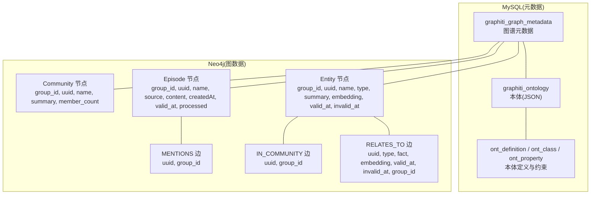
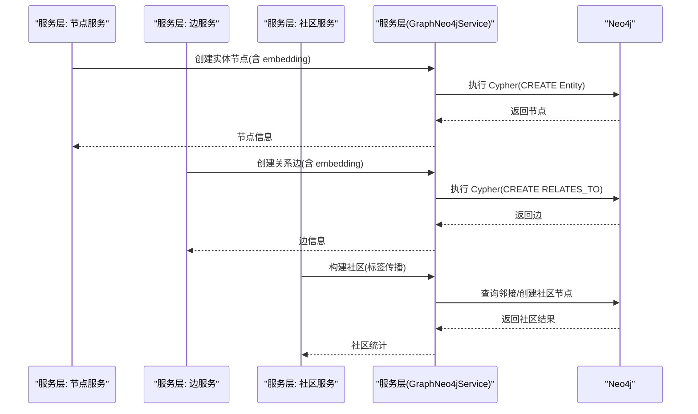
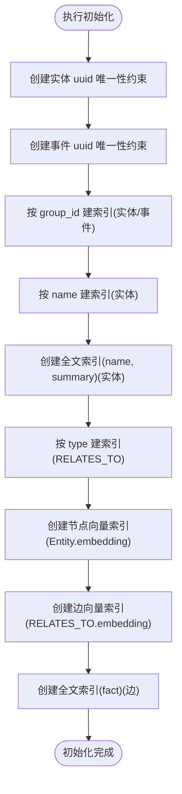
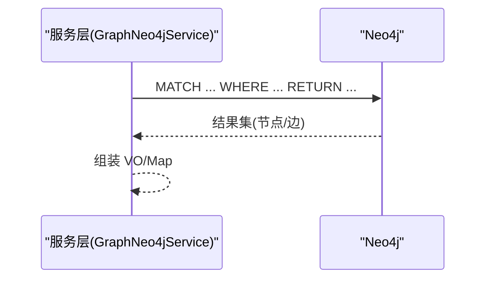
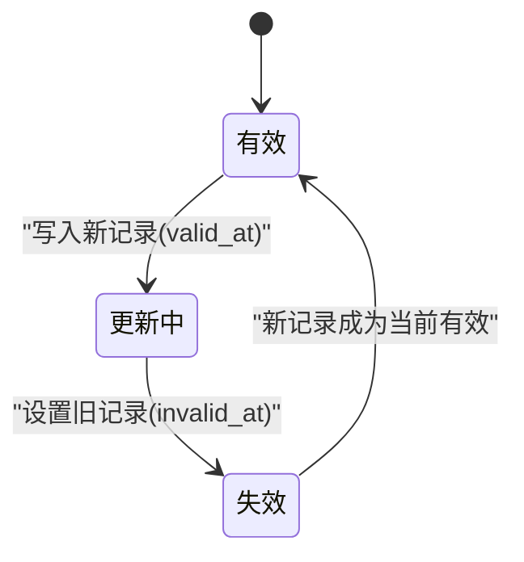
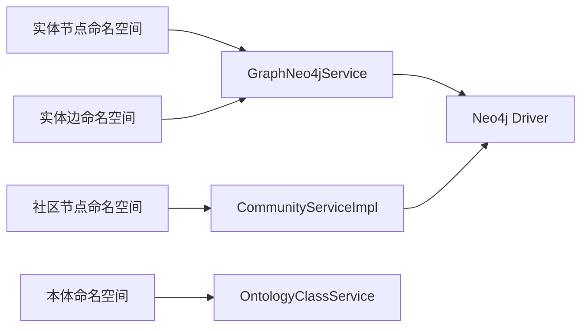

# 图数据库设计

<!--<cite>
**本文引用的文件**
- [init.cypher](file://sql/neo4j/init.cypher)
- [vector-index-init.cypher](file://sql/neo4j/vector-index-init.cypher)
- [GraphNeo4jConfig.java](file://graphiti-module-core/src/main/java/com/graphiti/module/graphiti/config/GraphNeo4jConfig.java)
- [GraphNeo4jService.java](file://graphiti-module-core/src/main/java/com/graphiti/module/graphiti/service/GraphNeo4jService.java)
- [LabelPropagation.java](file://graphiti-module-core/src/main/java/com/graphiti/module/graphiti/util/LabelPropagation.java)
- [UnionFind.java](file://graphiti-module-core/src/main/java/com/graphiti/module/graphiti/util/UnionFind.java)
- [CommunityServiceImpl.java](file://graphiti-module-core/src/main/java/com/graphiti/module/graphiti/service/impl/CommunityServiceImpl.java)
- [SearchService.java](file://graphiti-module-core/src/main/java/com/graphiti/module/graphiti/service/SearchService.java)
- [ontology.md](file://docs/ontology.md)
- [2026-05-11-graphiti-java-full-migration-plan.md](file://docs/superpowers/plans/2026-05-11-graphiti-java-full-migration-plan.md)
- [2026-05-10-ontology-enhancement-design.md](file://docs/superpowers/specs/2026-05-10-ontology-enhancement-design.md)
- [schema.sql](file://sql/mysql/schema.sql)
</cite>-->

## 目录
1. [简介](#简介)
2. [项目结构](#项目结构)
3. [核心组件](#核心组件)
4. [架构总览](#架构总览)
5. [详细组件分析](#详细组件分析)
6. [依赖分析](#依赖分析)
7. [性能考量](#性能考量)
8. [故障排查指南](#故障排查指南)
9. [结论](#结论)
10. [附录](#附录)

## 简介
本文件面向图数据库管理员与算法开发者，系统化阐述基于 Neo4j 的图数据库设计与实现。内容涵盖图数据模型、节点与关系的设计、Cypher 查询模式与图遍历算法、初始化脚本与向量索引配置、数据生命周期与索引优化、查询性能调优、图模式设计原则、数据一致性保障与扩展性考虑，并提供可落地的 Cypher 示例与最佳实践。

## 项目结构
本项目采用“双存储”架构：MySQL 负责元数据与本体定义，Neo4j 负责图数据与向量索引。图数据通过 graphId 实现跨存储关联；本体定义在 MySQL 中版本化管理，Neo4j 节点的 type 字段映射到本体类名，确保类型一致性与可验证性。



图表来源
- [ontology.md:1-448](file://docs/ontology.md#L1-L448)
- [schema.sql:91-111](file://sql/mysql/schema.sql#L91-L111)

章节来源
- [ontology.md:1-448](file://docs/ontology.md#L1-L448)
- [schema.sql:91-111](file://sql/mysql/schema.sql#L91-L111)

## 核心组件
- Neo4j 配置与驱动：负责连接参数注入与 Driver Bean 创建，确保服务层以统一方式访问图数据库。
- 服务层：提供节点/边的创建、更新、查询与向量化能力；封装社区发现与搜索接口。
- 工具与算法：并查集用于实体去重，加权标签传播用于社区发现。
- 初始化与索引：提供 Neo4j 初始化脚本与向量索引配置，支撑全文检索与语义相似度检索。

章节来源
- [GraphNeo4jConfig.java:1-47](file://graphiti-module-core/src/main/java/com/graphiti/module/graphiti/config/GraphNeo4jConfig.java#L1-L47)
- [GraphNeo4jService.java:1-200](file://graphiti-module-core/src/main/java/com/graphiti/module/graphiti/service/GraphNeo4jService.java#L1-L200)
- [UnionFind.java:1-125](file://graphiti-module-core/src/main/java/com/graphiti/module/graphiti/util/UnionFind.java#L1-L125)
- [LabelPropagation.java:1-256](file://graphiti-module-core/src/main/java/com/graphiti/module/graphiti/util/LabelPropagation.java#L1-L256)

## 架构总览
下图展示从服务层到 Neo4j 的调用链路，以及本体校验与向量索引的关键位置。



图表来源
- [GraphNeo4jService.java:41-174](file://graphiti-module-core/src/main/java/com/graphiti/module/graphiti/service/GraphNeo4jService.java#L41-L174)
- [NodeServiceImpl.java:32-125](file://graphiti-module-core/src/main/java/com/graphiti/module/graphiti/service/impl/NodeServiceImpl.java#L32-L125)
- [EdgeServiceImpl.java:31-114](file://graphiti-module-core/src/main/java/com/graphiti/module/graphiti/service/impl/EdgeServiceImpl.java#L31-L114)
- [CommunityServiceImpl.java:25-80](file://graphiti-module-core/src/main/java/com/graphiti/module/graphiti/service/impl/CommunityServiceImpl.java#L25-L80)

## 详细组件分析

### 图数据模型设计
- 节点类型
  - 实体节点：:Entity，核心属性包括 group_id、uuid、name、type、summary、embedding、valid_at、invalid_at。
  - 事件节点：:Episode，用于承载原始文本/消息等非结构化数据。
  - 社区节点：:Community，由社区发现算法生成，聚合语义相近实体。
- 关系类型
  - 实体关系：RELATES_TO，携带 uuid、type、fact、embedding、valid_at、invalid_at、group_id。
  - 提及关系：MENTIONS，Episode 提及实体。
  - 成员关系：IN_COMMUNITY，实体属于社区。

章节来源
- [GraphNeo4jService.java:41-174](file://graphiti-module-core/src/main/java/com/graphiti/module/graphiti/service/GraphNeo4jService.java#L41-L174)
- [NodeServiceImpl.java:32-125](file://graphiti-module-core/src/main/java/com/graphiti/module/graphiti/service/impl/NodeServiceImpl.java#L32-L125)
- [EdgeServiceImpl.java:31-114](file://graphiti-module-core/src/main/java/com/graphiti/module/graphiti/service/impl/EdgeServiceImpl.java#L31-L114)
- [ontology.md:312-356](file://docs/ontology.md#L312-L356)

### 初始化脚本与向量索引配置
- 初始化脚本要点
  - 唯一性约束：实体与事件节点的 uuid 必须唯一。
  - 多租户索引：按 group_id 建索引，支持按图谱隔离。
  - 名称与摘要索引：name 与 summary 的全文索引，支持关键词检索。
  - 关系类型索引：RELATES_TO 的 type 属性索引，便于按关系类型过滤。
- 向量索引配置
  - 节点向量索引：Entity.embedding，维度与相似度函数可配置。
  - 边向量索引：RELATES_TO.embedding。
  - 全文索引：节点名称与摘要、边的事实描述。



图表来源
- [init.cypher:1-33](file://sql/neo4j/init.cypher#L1-L33)
- [vector-index-init.cypher:1-27](file://sql/neo4j/vector-index-init.cypher#L1-L27)

章节来源
- [init.cypher:1-33](file://sql/neo4j/init.cypher#L1-L33)
- [vector-index-init.cypher:1-27](file://sql/neo4j/vector-index-init.cypher#L1-L27)

### Cypher 查询模式与图遍历算法
- 查询模式
  - 节点/边过滤：按 group_id、类型、时间窗口等条件组合 WHERE 子句。
  - 全文检索：利用全文索引对 name/summary 或 fact 进行 CONTAINS 检索。
  - 向量相似度：结合向量索引进行余弦相似度检索（在查询层通过服务方法封装）。
- 图遍历
  - BFS：使用关系路径表达式按深度遍历，返回去重节点。
  - 社区发现：使用加权标签传播算法，统计邻居社区加权得票，收敛后压缩社区 ID。



图表来源
- [GraphNeo4jService.java:1055-1150](file://graphiti-module-core/src/main/java/com/graphiti/module/graphiti/service/GraphNeo4jService.java#L1055-L1150)

```mermaid
flowchart TD
A["开始(构建图)] --> B["统计邻居(加权票数)"]
B --> C{"是否存在更高票社区?"}
C --> |是| D["更新节点社区标签"]
C --> |否| E["检查是否收敛"]
D --> E
E --> |未收敛| B
E --> |已收敛| F["压缩社区ID为连续整数"]
F --> G["输出社区结果"]
```

图表来源
- [LabelPropagation.java:130-189](file://graphiti-module-core/src/main/java/com/graphiti/module/graphiti/util/LabelPropagation.java#L130-L189)

章节来源
- [GraphNeo4jService.java:1031-1150](file://graphiti-module-core/src/main/java/com/graphiti/module/graphiti/service/GraphNeo4jService.java#L1031-L1150)
- [2026-05-11-graphiti-java-full-migration-plan.md:1002-1025](file://docs/superpowers/plans/2026-05-11-graphiti-java-full-migration-plan.md#L1002-L1025)
- [LabelPropagation.java:1-256](file://graphiti-module-core/src/main/java/com/graphiti/module/graphiti/util/LabelPropagation.java#L1-L256)

### 数据生命周期管理与一致性保障
- 双存储架构与本体校验
  - 本体定义在 MySQL 中版本化管理，节点/边写入前经 L1-L4 校验（类型存在、必填属性、数据类型、约束）。
  - 写入 Neo4j 前生成 embedding，确保向量索引可用。
- 时序一致性
  - 节点/边采用 bi-temporal 设计：valid_at 标记生效时间，invalid_at 标记失效时间（null 表示当前有效）。
  - 更新策略：旧记录设置 invalid_at，插入新记录并设置新的 valid_at。
- 去重与规范化
  - 并查集用于批量实体去重，建立规范映射，降低冗余。



图表来源
- [ontology.md:332-344](file://docs/ontology.md#L332-L344)
- [UnionFind.java:1-125](file://graphiti-module-core/src/main/java/com/graphiti/module/graphiti/util/UnionFind.java#L1-L125)

章节来源
- [ontology.md:175-221](file://docs/ontology.md#L175-L221)
- [2026-05-10-ontology-enhancement-design.md:110-116](file://docs/superpowers/specs/2026-05-10-ontology-enhancement-design.md#L110-L116)
- [UnionFind.java:1-125](file://graphiti-module-core/src/main/java/com/graphiti/module/graphiti/util/UnionFind.java#L1-L125)

### 扩展性与最佳实践
- 扩展性
  - 通过命名空间与服务层解耦，新增节点/边类型只需扩展命名空间与服务方法。
  - 预留其他图数据库适配器（如 FalkorDb/Kuzu），保持接口一致。
- 最佳实践
  - 使用 group_id 实现多租户隔离，避免跨图谱污染。
  - 严格遵循本体校验，减少无效写入与后续修复成本。
  - 合理使用索引与向量索引，避免全库扫描。
  - 对高频查询建立复合索引（如 group_id+type、group_id+valid_at）。

章节来源
- [2026-05-11-graphiti-java-full-migration-plan.md:249-279](file://docs/superpowers/plans/2026-05-11-graphiti-java-full-migration-plan.md#L249-L279)
- [ontology.md:345-356](file://docs/ontology.md#L345-L356)

## 依赖分析
- 组件耦合
  - 命名空间层依赖服务层；服务层依赖 Neo4j Driver；本体命名空间依赖本体服务。
- 外部依赖
  - Neo4j Java Driver；嵌入服务（Ollama/OpenAI/Qwen）；可选 APOC（迁移方案提供替代 Cypher）。



图表来源
- [EntityNodeNamespace.java:27-31](file://graphiti-module-core/src/main/java/com/graphiti/module/graphiti/namespace/node/EntityNodeNamespace.java#L27-L31)
- [EntityEdgeNamespace.java:24-26](file://graphiti-module-core/src/main/java/com/graphiti/module/graphiti/namespace/edge/EntityEdgeNamespace.java#L24-L26)
- [CommunityNodeNamespace.java:20-21](file://graphiti-module-core/src/main/java/com/graphiti/module/graphiti/namespace/node/CommunityNodeNamespace.java#L20-L21)
- [GraphNeo4jConfig.java:42-45](file://graphiti-module-core/src/main/java/com/graphiti/module/graphiti/config/GraphNeo4jConfig.java#L42-L45)

章节来源
- [GraphNeo4jConfig.java:1-47](file://graphiti-module-core/src/main/java/com/graphiti/module/graphiti/config/GraphNeo4jConfig.java#L1-L47)
- [GraphNeo4jService.java:1-21](file://graphiti-module-core/src/main/java/com/graphiti/module/graphiti/service/GraphNeo4jService.java#L1-L21)

## 性能考量
- 索引策略
  - 为 group_id、name、RELATES_TO.type 建立索引，满足多租户与类型过滤需求。
  - 为 embedding 建向量索引，支持余弦相似度检索。
  - 为 name/summary、fact 建全文索引，提升关键词检索效率。
- 查询优化
  - 使用 LIMIT 与 SKIP 控制分页规模；对高频过滤字段建立复合索引。
  - 将向量检索与全文检索分离，避免单次查询过多开销。
- 向量维度与相似度
  - 统一向量维度与相似度函数，确保检索一致性与性能。

章节来源
- [init.cypher:11-29](file://sql/neo4j/init.cypher#L11-L29)
- [vector-index-init.cypher:5-18](file://sql/neo4j/vector-index-init.cypher#L5-L18)
- [ontology.md:345-356](file://docs/ontology.md#L345-L356)

## 故障排查指南
- 连接问题
  - 检查 Neo4j 连接参数（URI、用户名、密码）是否正确。
- 唯一性冲突
  - uuid 冲突时，确认是否重复提交或 UUID 生成逻辑异常。
- 索引缺失
  - 若查询变慢，确认初始化脚本是否执行，索引是否创建成功。
- 向量检索异常
  - 确认向量索引是否创建，embedding 是否为空或维度不匹配。
- 本体校验失败
  - 检查节点/边的 type 与属性是否符合本体定义与约束。

章节来源
- [GraphNeo4jConfig.java:22-45](file://graphiti-module-core/src/main/java/com/graphiti/module/graphiti/config/GraphNeo4jConfig.java#L22-L45)
- [ontology.md:175-221](file://docs/ontology.md#L175-L221)

## 结论
本设计以“本体优先、双存储互补、渐进增强、推理分层、版本化管理”为核心原则，通过命名空间与服务层解耦、严格的本体校验、向量与全文索引、以及 bi-temporal 生命周期管理，实现了可扩展、可维护、高性能的图数据库方案。建议在生产环境中持续监控索引与向量质量，定期评估查询性能并迭代优化。

## 附录
- 实际 Cypher 示例（路径）
  - 初始化与索引：[init.cypher:1-33](file://sql/neo4j/init.cypher#L1-L33)
  - 向量索引与全文索引：[vector-index-init.cypher:1-27](file://sql/neo4j/vector-index-init.cypher#L1-L27)
  - 节点创建与更新 embedding：[GraphNeo4jService.java:41-79](file://graphiti-module-core/src/main/java/com/graphiti/module/graphiti/service/GraphNeo4jService.java#L41-L79)
  - 关系创建与更新 embedding：[GraphNeo4jService.java:93-189](file://graphiti-module-core/src/main/java/com/graphiti/module/graphiti/service/GraphNeo4jService.java#L93-L189)
  - 按过滤条件查询节点/边：[GraphNeo4jService.java:1055-1150](file://graphiti-module-core/src/main/java/com/graphiti/module/graphiti/service/GraphNeo4jService.java#L1055-L1150)
  - 社区构建与搜索：[CommunityServiceImpl.java:1064-1198](file://graphiti-module-core/src/main/java/com/graphiti/module/graphiti/service/impl/CommunityServiceImpl.java#L1064-L1198)
  - 加权标签传播算法：[LabelPropagation.java:130-189](file://graphiti-module-core/src/main/java/com/graphiti/module/graphiti/util/LabelPropagation.java#L130-L189)
  - 并查集去重：[UnionFind.java:1-125](file://graphiti-module-core/src/main/java/com/graphiti/module/graphiti/util/UnionFind.java#L1-L125)
  - 搜索服务接口：[SearchService.java:1-54](file://graphiti-module-core/src/main/java/com/graphiti/module/graphiti/service/SearchService.java#L1-L54)