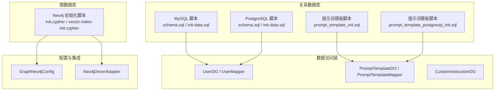
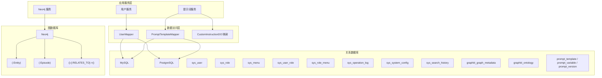
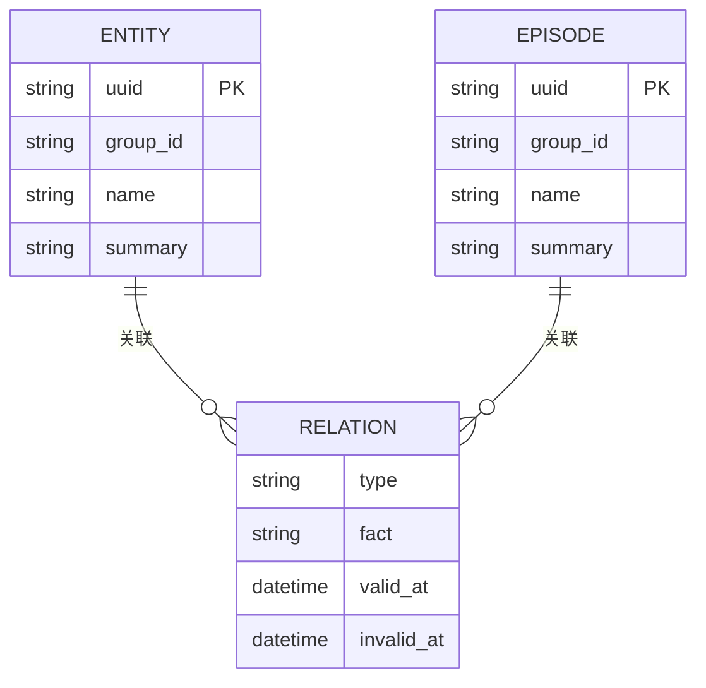
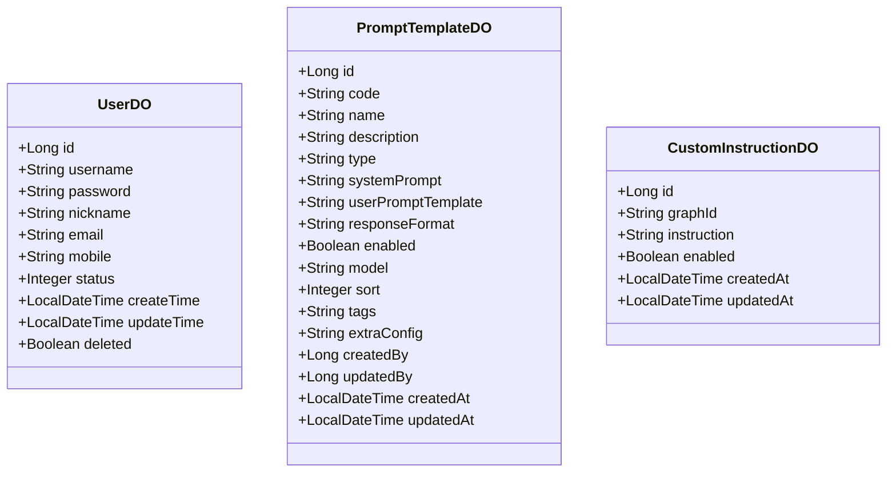
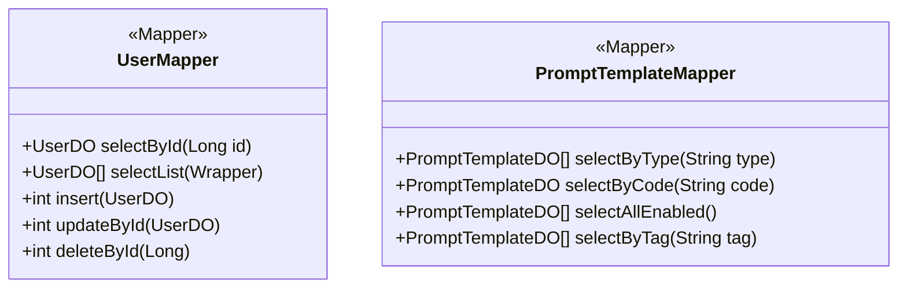
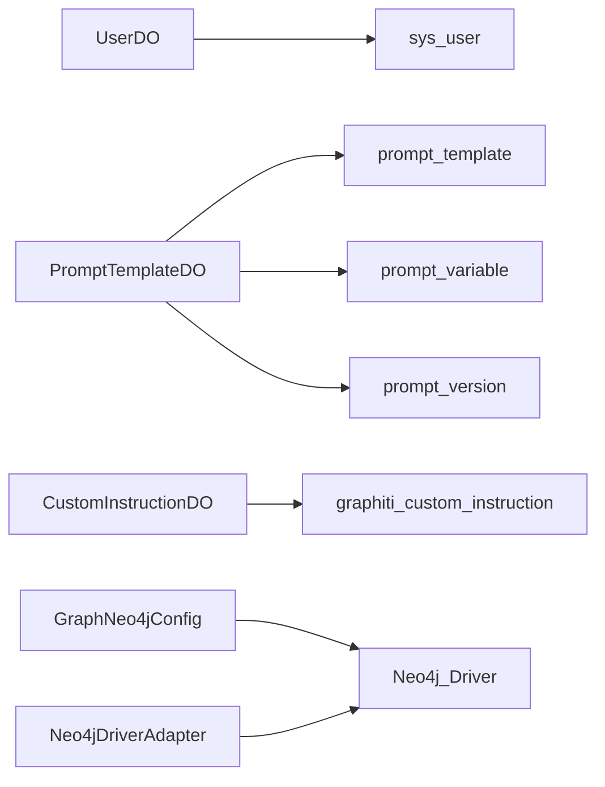

# 数据库设计

<!--<cite>
**本文引用的文件**
- [sql/mysql/schema.sql](file://sql/mysql/schema.sql)
- [sql/mysql/init-data.sql](file://sql/mysql/init-data.sql)
- [sql/postgresql/schema.sql](file://sql/postgresql/schema.sql)
- [sql/postgresql/init-data.sql](file://sql/postgresql/init-data.sql)
- [docs/sql/prompt_template_init.sql](file://docs/sql/prompt_template_init.sql)
- [docs/sql/prompt_template_postgresql_init.sql](file://docs/sql/prompt_template_postgresql_init.sql)
- [docs/database-migration-guide.md](file://docs/database-migration-guide.md)
- [graphiti-module-system/src/main/java/com/graphiti/system/dal/dataobject/UserDO.java](file://graphiti-module-system/src/main/java/com/graphiti/system/dal/dataobject/UserDO.java)
- [graphiti-module-system/src/main/java/com/graphiti/system/dal/mysql/UserMapper.java](file://graphiti-module-system/src/main/java/com/graphiti/system/dal/mysql/UserMapper.java)
- [graphiti-module-core/src/main/java/com/graphiti/module/graphiti/dal/dataobject/PromptTemplateDO.java](file://graphiti-module-core/src/main/java/com/graphiti/module/graphiti/dal/dataobject/PromptTemplateDO.java)
- [graphiti-module-core/src/main/java/com/graphiti/module/graphiti/dal/mysql/PromptTemplateMapper.java](file://graphiti-module-core/src/main/java/com/graphiti/module/graphiti/dal/mysql/PromptTemplateMapper.java)
- [graphiti-module-core/src/main/java/com/graphiti/module/graphiti/dal/dataobject/CustomInstructionDO.java](file://graphiti-module-core/src/main/java/com/graphiti/module/graphiti/dal/dataobject/CustomInstructionDO.java)
- [graphiti-module-core/src/main/java/com/graphiti/module/graphiti/config/GraphNeo4jConfig.java](file://graphiti-module-core/src/main/java/com/graphiti/module/graphiti/config/GraphNeo4jConfig.java)
- [graphiti-module-core/src/main/java/com/graphiti/module/graphiti/service/impl/Neo4jDriverAdapter.java](file://graphiti-module-core/src/main/java/com/graphiti/module/graphiti/service/impl/Neo4jDriverAdapter.java)
- [sql/neo4j/init.cypher](file://sql/neo4j/init.cypher)
- [sql/neo4j/vector-index-init.cypher](file://sql/neo4j/vector-index-init.cypher)
</cite>-->

## 目录
1. [简介](#简介)
2. [项目结构](#项目结构)
3. [核心组件](#核心组件)
4. [架构总览](#架构总览)
5. [详细组件分析](#详细组件分析)
6. [依赖分析](#依赖分析)
7. [性能考虑](#性能考虑)
8. [故障排查指南](#故障排查指南)
9. [结论](#结论)
10. [附录](#附录)

## 简介
本文件面向数据库管理员与后端开发者，系统化梳理 ontograph-java 的数据库设计，覆盖关系型数据库（MySQL 与 PostgreSQL）与图数据库（Neo4j）两套数据模型与实现。内容包括：
- 关系数据库模式：表结构、字段定义、索引与约束
- Neo4j 图模型：节点与关系命名空间、索引与全文检索、向量索引
- 数据访问层：MyBatis-Plus 实体映射与 Mapper 接口设计
- 完整 DDL 与初始化脚本路径
- 数据迁移策略与版本管理建议
- 性能优化与查询优化技巧
- ER 图与数据字典

## 项目结构
数据库相关资源分布于以下位置：
- 关系数据库脚本：sql/mysql 与 sql/postgresql
- 提示词模板脚本：docs/sql 下的 MySQL 与 PostgreSQL 初始化脚本
- Neo4j 初始化脚本：sql/neo4j
- MyBatis-Plus 实体与 Mapper：graphiti-module-system 与 graphiti-module-core 模块
- 迁移指南：docs/database-migration-guide.md

**图表来源**
- [sql/mysql/schema.sql:1-196](file://sql/mysql/schema.sql#L1-L196)
- [sql/postgresql/schema.sql:1-319](file://sql/postgresql/schema.sql#L1-L319)
- [docs/sql/prompt_template_init.sql:1-385](file://docs/sql/prompt_template_init.sql#L1-L385)
- [docs/sql/prompt_template_postgresql_init.sql:1-698](file://docs/sql/prompt_template_postgresql_init.sql#L1-L698)
- [graphiti-module-system/src/main/java/com/graphiti/system/dal/dataobject/UserDO.java:1-38](file://graphiti-module-system/src/main/java/com/graphiti/system/dal/dataobject/UserDO.java#L1-L38)
- [graphiti-module-system/src/main/java/com/graphiti/system/dal/mysql/UserMapper.java:1-13](file://graphiti-module-system/src/main/java/com/graphiti/system/dal/mysql/UserMapper.java#L1-L13)
- [graphiti-module-core/src/main/java/com/graphiti/module/graphiti/dal/dataobject/PromptTemplateDO.java:1-99](file://graphiti-module-core/src/main/java/com/graphiti/module/graphiti/dal/dataobject/PromptTemplateDO.java#L1-L99)
- [graphiti-module-core/src/main/java/com/graphiti/module/graphiti/dal/mysql/PromptTemplateMapper.java:1-40](file://graphiti-module-core/src/main/java/com/graphiti/module/graphiti/dal/mysql/PromptTemplateMapper.java#L1-L40)
- [graphiti-module-core/src/main/java/com/graphiti/module/graphiti/dal/dataobject/CustomInstructionDO.java:1-40](file://graphiti-module-core/src/main/java/com/graphiti/module/graphiti/dal/dataobject/CustomInstructionDO.java#L1-L40)
- [graphiti-module-core/src/main/java/com/graphiti/module/graphiti/config/GraphNeo4jConfig.java:1-47](file://graphiti-module-core/src/main/java/com/graphiti/module/graphiti/config/GraphNeo4jConfig.java#L1-L47)
- [graphiti-module-core/src/main/java/com/graphiti/module/graphiti/service/impl/Neo4jDriverAdapter.java:1-84](file://graphiti-module-core/src/main/java/com/graphiti/module/graphiti/service/impl/Neo4jDriverAdapter.java#L1-L84)
- [sql/neo4j/init.cypher:1-33](file://sql/neo4j/init.cypher#L1-L33)
- [sql/neo4j/vector-index-init.cypher](file://sql/neo4j/vector-index-init.cypher)

**章节来源**
- [sql/mysql/schema.sql:1-196](file://sql/mysql/schema.sql#L1-L196)
- [sql/postgresql/schema.sql:1-319](file://sql/postgresql/schema.sql#L1-L319)
- [docs/sql/prompt_template_init.sql:1-385](file://docs/sql/prompt_template_init.sql#L1-L385)
- [docs/sql/prompt_template_postgresql_init.sql:1-698](file://docs/sql/prompt_template_postgresql_init.sql#L1-L698)
- [docs/database-migration-guide.md:1-218](file://docs/database-migration-guide.md#L1-L218)

## 核心组件
- 关系数据库（MySQL 与 PostgreSQL）
  - 系统管理模块：用户、角色、菜单、用户角色关联、角色菜单关联、操作日志、系统配置、搜索历史
  - 图谱管理模块：图谱元数据、本体定义
  - 提示词模板模块：模板、变量、版本（MySQL 与 PostgreSQL 脚本分别提供）
- 图数据库（Neo4j）
  - 初始化约束与索引：实体与事件节点唯一性约束、全文检索索引、向量索引
  - 驱动与适配：GraphNeo4jConfig 与 Neo4jDriverAdapter
- 数据访问层（MyBatis-Plus）
  - UserDO / UserMapper：系统用户
  - PromptTemplateDO / PromptTemplateMapper：提示词模板
  - CustomInstructionDO：自定义指令

**章节来源**
- [graphiti-module-system/src/main/java/com/graphiti/system/dal/dataobject/UserDO.java:1-38](file://graphiti-module-system/src/main/java/com/graphiti/system/dal/dataobject/UserDO.java#L1-L38)
- [graphiti-module-system/src/main/java/com/graphiti/system/dal/mysql/UserMapper.java:1-13](file://graphiti-module-system/src/main/java/com/graphiti/system/dal/mysql/UserMapper.java#L1-L13)
- [graphiti-module-core/src/main/java/com/graphiti/module/graphiti/dal/dataobject/PromptTemplateDO.java:1-99](file://graphiti-module-core/src/main/java/com/graphiti/module/graphiti/dal/dataobject/PromptTemplateDO.java#L1-L99)
- [graphiti-module-core/src/main/java/com/graphiti/module/graphiti/dal/mysql/PromptTemplateMapper.java:1-40](file://graphiti-module-core/src/main/java/com/graphiti/module/graphiti/dal/mysql/PromptTemplateMapper.java#L1-L40)
- [graphiti-module-core/src/main/java/com/graphiti/module/graphiti/dal/dataobject/CustomInstructionDO.java:1-40](file://graphiti-module-core/src/main/java/com/graphiti/module/graphiti/dal/dataobject/CustomInstructionDO.java#L1-L40)
- [graphiti-module-core/src/main/java/com/graphiti/module/graphiti/config/GraphNeo4jConfig.java:1-47](file://graphiti-module-core/src/main/java/com/graphiti/module/graphiti/config/GraphNeo4jConfig.java#L1-L47)
- [graphiti-module-core/src/main/java/com/graphiti/module/graphiti/service/impl/Neo4jDriverAdapter.java:1-84](file://graphiti-module-core/src/main/java/com/graphiti/module/graphiti/service/impl/Neo4jDriverAdapter.java#L1-L84)

## 架构总览
下图展示关系数据库与图数据库在系统中的角色与交互。

**图表来源**
- [sql/mysql/schema.sql:11-196](file://sql/mysql/schema.sql#L11-L196)
- [sql/postgresql/schema.sql:21-319](file://sql/postgresql/schema.sql#L21-L319)
- [docs/sql/prompt_template_init.sql:5-64](file://docs/sql/prompt_template_init.sql#L5-L64)
- [docs/sql/prompt_template_postgresql_init.sql:5-102](file://docs/sql/prompt_template_postgresql_init.sql#L5-L102)
- [graphiti-module-system/src/main/java/com/graphiti/system/dal/mysql/UserMapper.java:1-13](file://graphiti-module-system/src/main/java/com/graphiti/system/dal/mysql/UserMapper.java#L1-L13)
- [graphiti-module-core/src/main/java/com/graphiti/module/graphiti/dal/mysql/PromptTemplateMapper.java:1-40](file://graphiti-module-core/src/main/java/com/graphiti/module/graphiti/dal/mysql/PromptTemplateMapper.java#L1-L40)
- [sql/neo4j/init.cypher:1-33](file://sql/neo4j/init.cypher#L1-L33)

## 详细组件分析

### 关系数据库模式（MySQL 与 PostgreSQL）

#### 系统管理模块
- sys_user：用户表，包含用户名、密码、昵称、邮箱、手机号、状态、时间戳与逻辑删除字段；唯一索引 username。
- sys_role：角色表，包含角色名称与编码，唯一索引 code。
- sys_menu：菜单表，包含权限标识、URL、父子关系与排序。
- sys_user_role：用户-角色关联表，唯一索引 user_id+role_id。
- sys_role_menu：角色-菜单关联表，唯一索引 role_id+menu_id。
- sys_operation_log：操作日志表，包含请求方法、参数、IP、位置、耗时等。
- sys_system_config：系统配置表，支持文本/数字/布尔/JSON 等类型，分组与排序。
- sys_search_history：搜索历史表，记录用户查询与结果数。

索引与约束要点：
- MySQL：大量二级索引用于高频查询（如 username、operation、create_time），逻辑删除字段 deleted。
- PostgreSQL：使用触发器维护 update_time，提供唯一索引与注释增强可读性。

**章节来源**
- [sql/mysql/schema.sql:11-196](file://sql/mysql/schema.sql#L11-L196)
- [sql/postgresql/schema.sql:21-319](file://sql/postgresql/schema.sql#L21-L319)

#### 图谱管理模块
- graphiti_graph_metadata：图谱元数据，包含 graph_id（UUID）、名称、描述、节点/边计数与时间戳。
- graphiti_ontology：本体定义，以 JSON 存储实体与关系类型定义，支持默认本体标记。

索引与约束要点：
- graph_id 唯一索引（MySQL 与 PostgreSQL 均保证唯一性）。
- 字段类型：MySQL 使用 JSON，PostgreSQL 使用 TEXT 并配合注释。

**章节来源**
- [sql/mysql/schema.sql:89-121](file://sql/mysql/schema.sql#L89-L121)
- [sql/postgresql/schema.sql:109-144](file://sql/postgresql/schema.sql#L109-L144)

#### 提示词模板模块（MySQL 与 PostgreSQL）
- prompt_template：模板主表，包含编码、名称、类型、系统提示词、用户模板、响应格式、启用状态、模型、排序、标签、额外配置、创建/更新人等。
- prompt_variable：模板变量表，包含变量名、类型、是否必需、默认值、来源、验证规则、排序等。
- prompt_version：模板版本表，记录版本号、系统提示词、用户模板、响应格式、描述与活跃状态。

索引与约束要点：
- MySQL：唯一索引 code，类型与启用状态索引；JSON 字段存储。
- PostgreSQL：BIGSERIAL 主键、触发器维护更新时间、唯一与复合索引；注释完善。

**章节来源**
- [docs/sql/prompt_template_init.sql:5-64](file://docs/sql/prompt_template_init.sql#L5-L64)
- [docs/sql/prompt_template_postgresql_init.sql:5-102](file://docs/sql/prompt_template_postgresql_init.sql#L5-L102)

### Neo4j 图数据模型与 Cypher 查询模式

#### 节点与关系命名空间
- 节点标签
  - Entity：实体节点，属性包含 group_id（多租户隔离）、uuid（唯一）、name、summary 等。
  - Episode：事件节点，属性包含 group_id、uuid、name、summary 等。
- 关系类型
  - RELATES_TO：事件与实体之间的关系，属性包含 type、fact、有效时间范围等。

#### 约束与索引
- 唯一性约束：确保 Entity 与 Episode 的 uuid 唯一。
- 索引：实体与事件的 group_id、name；关系的 type。
- 全文索引：实体节点的 name 与 summary 支持全文检索。
- 向量索引：支持基于嵌入向量的相似度检索（需配合向量索引初始化脚本）。

**图表来源**
- [sql/neo4j/init.cypher:1-33](file://sql/neo4j/init.cypher#L1-L33)
- [sql/neo4j/vector-index-init.cypher](file://sql/neo4j/vector-index-init.cypher)

**章节来源**
- [sql/neo4j/init.cypher:1-33](file://sql/neo4j/init.cypher#L1-L33)

#### Cypher 查询模式
- 按 uuid 查询节点/关系
- 全文检索实体节点（基于 name 与 summary）
- 向量相似度检索（基于嵌入向量）
- 删除节点（级联删除）

**章节来源**
- [graphiti-module-core/src/main/java/com/graphiti/module/graphiti/service/impl/Neo4jDriverAdapter.java:36-82](file://graphiti-module-core/src/main/java/com/graphiti/module/graphiti/service/impl/Neo4jDriverAdapter.java#L36-L82)

### 数据访问层设计（MyBatis-Plus）

#### 实体映射
- UserDO：映射 sys_user，包含基础字段与时间戳、逻辑删除。
- PromptTemplateDO：映射 prompt_template，包含模板编码、名称、类型、启用状态、排序、标签、额外配置、创建/更新人等。
- CustomInstructionDO：映射 custom_instruction，包含图谱 ID、指令内容、类型与时间戳。

**图表来源**
- [graphiti-module-system/src/main/java/com/graphiti/system/dal/dataobject/UserDO.java:1-38](file://graphiti-module-system/src/main/java/com/graphiti/system/dal/dataobject/UserDO.java#L1-L38)
- [graphiti-module-core/src/main/java/com/graphiti/module/graphiti/dal/dataobject/PromptTemplateDO.java:1-99](file://graphiti-module-core/src/main/java/com/graphiti/module/graphiti/dal/dataobject/PromptTemplateDO.java#L1-L99)
- [graphiti-module-core/src/main/java/com/graphiti/module/graphiti/dal/dataobject/CustomInstructionDO.java:1-40](file://graphiti-module-core/src/main/java/com/graphiti/module/graphiti/dal/dataobject/CustomInstructionDO.java#L1-L40)

**章节来源**
- [graphiti-module-system/src/main/java/com/graphiti/system/dal/dataobject/UserDO.java:1-38](file://graphiti-module-system/src/main/java/com/graphiti/system/dal/dataobject/UserDO.java#L1-L38)
- [graphiti-module-core/src/main/java/com/graphiti/module/graphiti/dal/dataobject/PromptTemplateDO.java:1-99](file://graphiti-module-core/src/main/java/com/graphiti/module/graphiti/dal/dataobject/PromptTemplateDO.java#L1-L99)
- [graphiti-module-core/src/main/java/com/graphiti/module/graphiti/dal/dataobject/CustomInstructionDO.java:1-40](file://graphiti-module-core/src/main/java/com/graphiti/module/graphiti/dal/dataobject/CustomInstructionDO.java#L1-L40)

#### Mapper 接口设计
- UserMapper：继承 BaseMapper<UserDO>，提供标准 CRUD。
- PromptTemplateMapper：扩展自定义查询，包括按类型、编码、标签查询启用的模板，并返回有序结果。

**图表来源**
- [graphiti-module-system/src/main/java/com/graphiti/system/dal/mysql/UserMapper.java:1-13](file://graphiti-module-system/src/main/java/com/graphiti/system/dal/mysql/UserMapper.java#L1-L13)
- [graphiti-module-core/src/main/java/com/graphiti/module/graphiti/dal/mysql/PromptTemplateMapper.java:1-40](file://graphiti-module-core/src/main/java/com/graphiti/module/graphiti/dal/mysql/PromptTemplateMapper.java#L1-L40)

**章节来源**
- [graphiti-module-system/src/main/java/com/graphiti/system/dal/mysql/UserMapper.java:1-13](file://graphiti-module-system/src/main/java/com/graphiti/system/dal/mysql/UserMapper.java#L1-L13)
- [graphiti-module-core/src/main/java/com/graphiti/module/graphiti/dal/mysql/PromptTemplateMapper.java:1-40](file://graphiti-module-core/src/main/java/com/graphiti/module/graphiti/dal/mysql/PromptTemplateMapper.java#L1-L40)

### 数据初始化方案
- MySQL：使用 schema.sql 创建表结构，init-data.sql 插入初始数据（用户、角色、可选图谱）。
- PostgreSQL：使用 schema.sql 创建表结构与索引，init-data.sql 插入角色、用户、用户角色关联、菜单、角色菜单关联与示例图谱。
- 提示词模板：MySQL 与 PostgreSQL 分别提供初始化脚本，包含模板、变量与版本记录。

**章节来源**
- [sql/mysql/schema.sql:1-196](file://sql/mysql/schema.sql#L1-L196)
- [sql/mysql/init-data.sql:1-17](file://sql/mysql/init-data.sql#L1-L17)
- [sql/postgresql/schema.sql:1-319](file://sql/postgresql/schema.sql#L1-L319)
- [sql/postgresql/init-data.sql:1-110](file://sql/postgresql/init-data.sql#L1-L110)
- [docs/sql/prompt_template_init.sql:1-385](file://docs/sql/prompt_template_init.sql#L1-L385)
- [docs/sql/prompt_template_postgresql_init.sql:1-698](file://docs/sql/prompt_template_postgresql_init.sql#L1-L698)

### 数据迁移策略与版本管理
- 迁移目标：从 MySQL 8.0 迁移到 PostgreSQL 15+。
- 步骤：创建数据库与用户 → 执行 schema.sql → 执行 init-data.sql → 配置应用连接 → 启动应用。
- 工具：推荐使用 pgLoader；也可通过 mysqldump 导出后转换导入。
- 版本管理：迁移指南提供回滚方案（恢复 MySQL 依赖与配置）。

**章节来源**
- [docs/database-migration-guide.md:1-218](file://docs/database-migration-guide.md#L1-L218)

## 依赖分析
- 关系数据库依赖
  - UserMapper 依赖 sys_user 表结构
  - PromptTemplateMapper 依赖 prompt_template、prompt_variable、prompt_version 表结构
  - 图谱与本体依赖 graphiti_graph_metadata、graphiti_ontology
- 图数据库依赖
  - GraphNeo4jConfig 提供 Neo4j Driver Bean
  - Neo4jDriverAdapter 将服务方法映射为 Cypher 操作

**图表来源**
- [graphiti-module-system/src/main/java/com/graphiti/system/dal/dataobject/UserDO.java:1-38](file://graphiti-module-system/src/main/java/com/graphiti/system/dal/dataobject/UserDO.java#L1-L38)
- [graphiti-module-core/src/main/java/com/graphiti/module/graphiti/dal/dataobject/PromptTemplateDO.java:1-99](file://graphiti-module-core/src/main/java/com/graphiti/module/graphiti/dal/dataobject/PromptTemplateDO.java#L1-L99)
- [graphiti-module-core/src/main/java/com/graphiti/module/graphiti/dal/dataobject/CustomInstructionDO.java:1-40](file://graphiti-module-core/src/main/java/com/graphiti/module/graphiti/dal/dataobject/CustomInstructionDO.java#L1-L40)
- [graphiti-module-core/src/main/java/com/graphiti/module/graphiti/config/GraphNeo4jConfig.java:1-47](file://graphiti-module-core/src/main/java/com/graphiti/module/graphiti/config/GraphNeo4jConfig.java#L1-L47)
- [graphiti-module-core/src/main/java/com/graphiti/module/graphiti/service/impl/Neo4jDriverAdapter.java:1-84](file://graphiti-module-core/src/main/java/com/graphiti/module/graphiti/service/impl/Neo4jDriverAdapter.java#L1-L84)

**章节来源**
- [graphiti-module-system/src/main/java/com/graphiti/system/dal/dataobject/UserDO.java:1-38](file://graphiti-module-system/src/main/java/com/graphiti/system/dal/dataobject/UserDO.java#L1-L38)
- [graphiti-module-core/src/main/java/com/graphiti/module/graphiti/dal/dataobject/PromptTemplateDO.java:1-99](file://graphiti-module-core/src/main/java/com/graphiti/module/graphiti/dal/dataobject/PromptTemplateDO.java#L1-L99)
- [graphiti-module-core/src/main/java/com/graphiti/module/graphiti/dal/dataobject/CustomInstructionDO.java:1-40](file://graphiti-module-core/src/main/java/com/graphiti/module/graphiti/dal/dataobject/CustomInstructionDO.java#L1-L40)
- [graphiti-module-core/src/main/java/com/graphiti/module/graphiti/config/GraphNeo4jConfig.java:1-47](file://graphiti-module-core/src/main/java/com/graphiti/module/graphiti/config/GraphNeo4jConfig.java#L1-L47)
- [graphiti-module-core/src/main/java/com/graphiti/module/graphiti/service/impl/Neo4jDriverAdapter.java:1-84](file://graphiti-module-core/src/main/java/com/graphiti/module/graphiti/service/impl/Neo4jDriverAdapter.java#L1-L84)

## 性能考虑
- 关系数据库
  - 索引策略：为高频过滤字段建立二级索引（如 username、operation、create_time、graph_id、group_name 等）。
  - 时间字段：PostgreSQL 使用触发器维护 update_time，避免应用层重复设置。
  - JSON/JSONB：模板相关表使用 JSON/JSONB 存储复杂结构，注意查询时的路径访问与索引策略。
- 图数据库
  - 唯一性约束与索引：确保 uuid 唯一，为 group_id、name、type 建立索引。
  - 全文检索：利用全文索引加速实体名称与摘要检索。
  - 向量检索：结合向量索引与嵌入向量进行相似度搜索。
  - 批量写入：合理控制事务大小，避免大事务阻塞。
- 连接与缓存
  - PostgreSQL 连接池：调整最大连接数、空闲超时与生命周期参数。
  - Redis 缓存：对热点查询结果进行缓存（需结合业务场景）。

[本节为通用指导，无需特定文件来源]

## 故障排查指南
- 连接问题
  - PostgreSQL：检查监听地址、认证方式与防火墙；确认 pg_hba.conf 与 postgresql.conf 配置。
  - Neo4j：确认连接 URI、用户名与密码正确。
- 时区与时戳
  - PostgreSQL：在 JDBC URL 中指定 serverTimezone 参数，避免解析异常。
- JSON/JSONB 类型
  - 确保 MyBatis-Plus 版本兼容 JSONB；必要时引入专用依赖。
- 迁移问题
  - 使用 pgLoader 进行结构与数据迁移；若失败，检查字符集与数据类型差异。

**章节来源**
- [docs/database-migration-guide.md:141-162](file://docs/database-migration-guide.md#L141-L162)

## 结论
ontograph-java 的数据库设计采用“关系型 + 图”的混合架构：关系数据库承载系统管理与提示词模板等结构化数据，Neo4j 承载知识图谱的实体与关系。通过 MyBatis-Plus 的实体映射与 Mapper 接口，实现了清晰的数据访问层；通过迁移指南与初始化脚本，提供了从 MySQL 到 PostgreSQL 的完整迁移路径。建议在生产环境中结合业务查询特征持续优化索引与连接池配置，并充分利用图数据库的全文与向量检索能力提升查询效率。

[本节为总结性内容，无需特定文件来源]

## 附录

### 数据字典（节选）
- sys_user
  - 字段：id、username、password、nickname、email、mobile、status、create_time、update_time、deleted
  - 索引：uk_username
- sys_role
  - 字段：id、name、code、status、create_time、update_time、deleted
  - 索引：uk_code
- sys_menu
  - 字段：id、name、permission、url、parent_id、sort、status、create_time、update_time、deleted
- sys_user_role
  - 字段：id、user_id、role_id
  - 索引：uk_user_role、idx_user_id、idx_role_id
- sys_role_menu
  - 字段：id、role_id、menu_id
  - 索引：uk_role_menu、idx_role_id、idx_menu_id
- sys_operation_log
  - 字段：id、user_id、username、operation、method、params、ip、location、status、error_msg、duration、create_time
  - 索引：idx_username、idx_operation、idx_create_time
- sys_system_config
  - 字段：id、config_key、config_value、config_name、config_description、config_type、group_name、sort_num、status、create_time、update_time、deleted
  - 索引：uk_config_key、idx_group_name
- sys_search_history
  - 字段：id、user_id、query、mode、result_count、create_time
  - 索引：idx_user_id、idx_create_time
- graphiti_graph_metadata
  - 字段：id、graph_id、name、description、node_count、edge_count、create_time、update_time、deleted
  - 索引：uk_graph_id
- graphiti_ontology
  - 字段：id、graph_id、entities、edges、is_default、create_time、update_time、deleted
  - 索引：idx_graph_id
- prompt_template
  - 字段：id、code、name、description、type、system_prompt、user_prompt_template、response_format、enabled、model、sort、tags、extra_config、created_by、updated_by、created_at、updated_at
  - 索引：uk_code、idx_type、idx_enabled
- prompt_variable
  - 字段：id、template_id、variable_name、description、variable_type、required、default_value、source、validation_rule、sort、remark、created_at、updated_at
  - 索引：idx_template_id
- prompt_version
  - 字段：id、template_id、version、system_prompt、user_prompt_template、response_format、description、active、created_by、created_at
  - 索引：idx_template_id、idx_template_version
- graphiti_custom_instruction
  - 字段：id、graph_id、instruction、type、create_time、update_time、deleted
  - 索引：idx_graph_id

**章节来源**
- [sql/mysql/schema.sql:11-196](file://sql/mysql/schema.sql#L11-L196)
- [sql/postgresql/schema.sql:21-319](file://sql/postgresql/schema.sql#L21-L319)
- [docs/sql/prompt_template_init.sql:5-64](file://docs/sql/prompt_template_init.sql#L5-L64)
- [docs/sql/prompt_template_postgresql_init.sql:5-102](file://docs/sql/prompt_template_postgresql_init.sql#L5-L102)