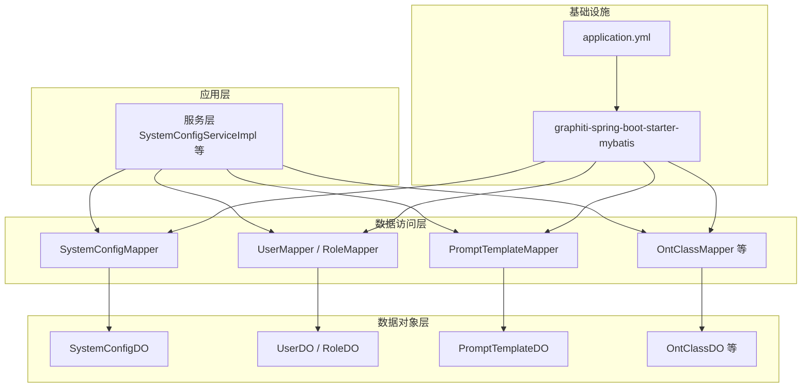
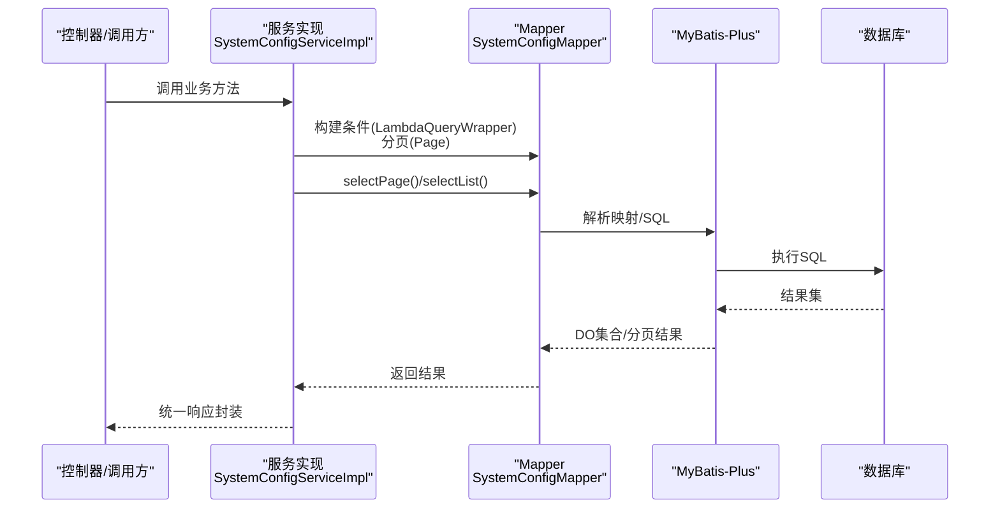
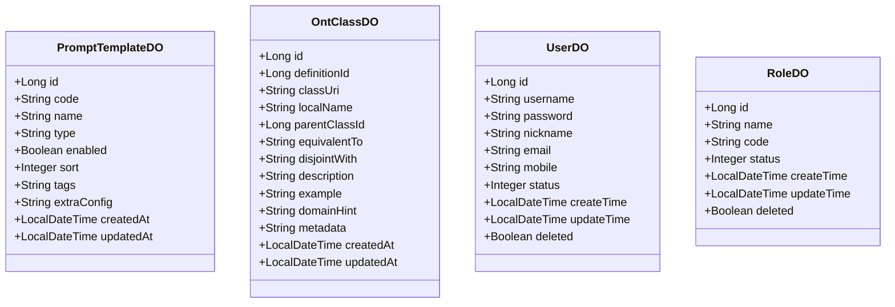
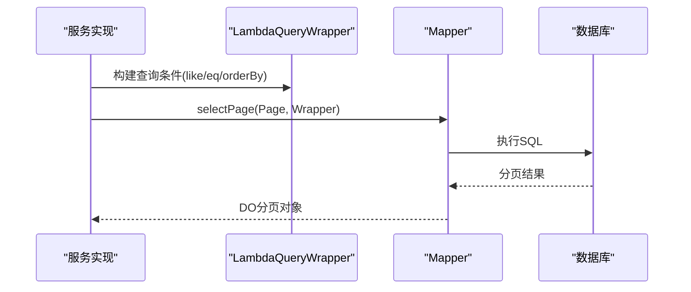
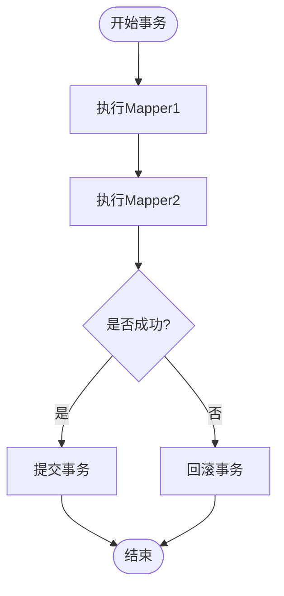
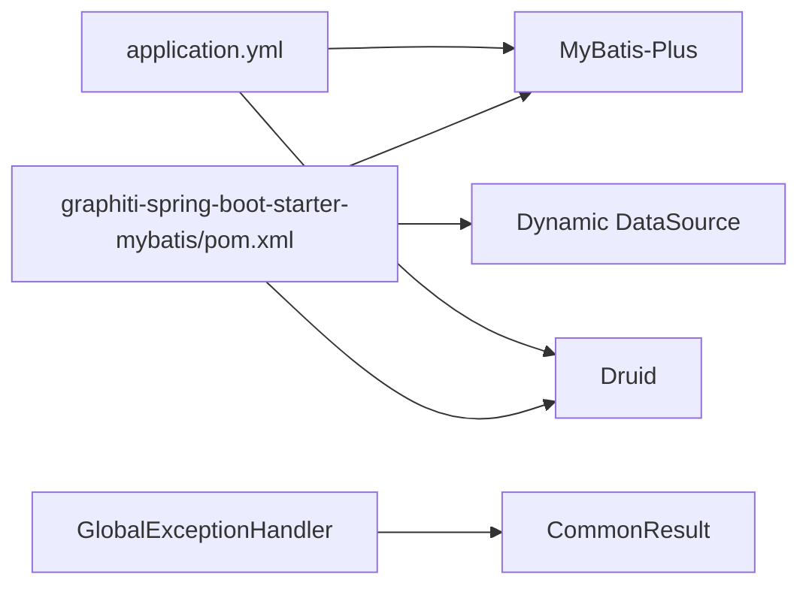

# 数据访问层设计

<cite>
**本文引用的文件**
- [application.yml](file://graphiti-server/src/main/resources/application.yml)
- [graphiti-spring-boot-starter-mybatis/pom.xml](file://graphiti-framework/graphiti-spring-boot-starter-mybatis/pom.xml)
- [PromptTemplateDO.java](file://graphiti-module-core/src/main/java/com/raphiti/module/graphiti/dal/dataobject/PromptTemplateDO.java)
- [PromptTemplateMapper.java](file://graphiti-module-core/src/main/java/com/raphiti/module/graphiti/dal/mysql/PromptTemplateMapper.java)
- [OntClassDO.java](file://graphiti-module-core/src/main/java/com/raphiti/module/graphiti/dal/dataobject/ont/OntClassDO.java)
- [OntClassMapper.java](file://graphiti-module-core/src/main/java/com/raphiti/module/graphiti/dal/mysql/ont/OntClassMapper.java)
- [UserDO.java](file://graphiti-module-system/src/main/java/com/raphiti/system/dal/dataobject/UserDO.java)
- [UserMapper.java](file://graphiti-module-system/src/main/java/com/raphiti/system/dal/mysql/UserMapper.java)
- [RoleDO.java](file://graphiti-module-system/src/main/java/com/raphiti/system/dal/dataobject/RoleDO.java)
- [RoleMapper.java](file://graphiti-module-system/src/main/java/com/raphiti/system/dal/mysql/RoleMapper.java)
- [SystemConfigMapper.java](file://graphiti-module-system/src/main/java/com/raphiti/system/dal/mysql/SystemConfigMapper.java)
- [SystemConfigServiceImpl.java](file://graphiti-module-system/src/main/java/com/raphiti/system/service/impl/SystemConfigServiceImpl.java)
- [OperationLogServiceImpl.java](file://graphiti-module-system/src/main/java/com/raphiti/system/service/impl/OperationLogServiceImpl.java)
- [GlobalExceptionHandler.java](file://graphiti-framework/graphiti-common/src/main/java/com/raphiti/common/exception/GlobalExceptionHandler.java)
- [CommonResult.java](file://graphiti-framework/graphiti-common/src/main/java/com/raphiti/common/response/CommonResult.java)
- [OntMapperTest.java](file://graphiti-module-core/src/test/java/com/raphiti/module/graphiti/dal/mysql/ont/OntMapperTest.java)
- [OntDOTest.java](file://graphiti-module-core/src/test/java/com/raphiti/module/graphiti/dal/OntDOTest.java)
</cite>

## 目录
1. [引言](#引言)
2. [项目结构](#项目结构)
3. [核心组件](#核心组件)
4. [架构总览](#架构总览)
5. [详细组件分析](#详细组件分析)
6. [依赖分析](#依赖分析)
7. [性能考虑](#性能考虑)
8. [故障排查指南](#故障排查指南)
9. [结论](#结论)
10. [附录](#附录)

## 引言
本文件聚焦于Graphiti Java项目的“数据访问层（DAO）”设计与实现，系统阐述MyBatis-Plus在项目中的应用与配置方式，详解数据对象（DO）的设计模式与实体映射规则，分析Mapper接口的设计原则与SQL映射配置，并给出代码生成策略、批量操作实现建议、事务管理与连接池配置、性能优化方案以及最佳实践、错误处理与调试技巧。文档同时提供DAO层实现示例与测试策略，帮助后端开发者快速上手并高质量交付。

## 项目结构
- DAO层位于模块化工程中，按功能域拆分：
  - 核心模块（graphiti-module-core）：包含本体（ontology）相关DO/Mapper以及通用提示词模板等。
  - 系统模块（graphiti-module-system）：包含用户、角色、系统配置、操作日志等系统级DO/Mapper。
- MyBatis-Plus与连接池由自研starter统一装配，集中于graphiti-spring-boot-starter-mybatis模块。
- 应用配置集中在graphiti-server的application.yml中，统一开启驼峰映射、日志输出与全局ID策略等。

图表来源
- [application.yml:11-19](file://graphiti-server/src/main/resources/application.yml#L11-L19)
- [graphiti-spring-boot-starter-mybatis/pom.xml:19-41](file://graphiti-framework/graphiti-spring-boot-starter-mybatis/pom.xml#L19-L41)
- [SystemConfigMapper.java:1-12](file://graphiti-module-system/src/main/java/com/raphiti/system/dal/mysql/SystemConfigMapper.java#L1-L12)
- [UserMapper.java:1-13](file://graphiti-module-system/src/main/java/com/raphiti/system/dal/mysql/UserMapper.java#L1-L13)
- [PromptTemplateMapper.java:1-40](file://graphiti-module-core/src/main/java/com/raphiti/module/graphiti/dal/mysql/PromptTemplateMapper.java#L1-L40)
- [OntClassMapper.java:1-22](file://graphiti-module-core/src/main/java/com/raphiti/module/graphiti/dal/mysql/ont/OntClassMapper.java#L1-L22)

章节来源
- [application.yml:1-67](file://graphiti-server/src/main/resources/application.yml#L1-L67)
- [graphiti-spring-boot-starter-mybatis/pom.xml:1-51](file://graphiti-framework/graphiti-spring-boot-starter-mybatis/pom.xml#L1-L51)

## 核心组件
- 数据对象（DO）：采用MyBatis-Plus注解进行表名与字段映射，统一时间字段填充策略，支持JSON字符串字段（如本体元数据、约束值等），便于序列化/反序列化。
- Mapper接口：以BaseMapper为基础，结合@Mapper注解声明扫描；复杂查询通过@Select注解直接编写SQL，保持灵活性与可维护性。
- 服务层：通过LambdaQueryWrapper构建条件，配合分页Page与selectPage/selectList实现查询、分页与统计；对关键流程使用@Transactional保证一致性。
- 统一异常与响应：全局异常处理器捕获业务异常并返回统一响应结构，便于前端消费与问题定位。

章节来源
- [PromptTemplateDO.java:1-99](file://graphiti-module-core/src/main/java/com/raphiti/module/graphiti/dal/dataobject/PromptTemplateDO.java#L1-L99)
- [PromptTemplateMapper.java:1-40](file://graphiti-module-core/src/main/java/com/raphiti/module/graphiti/dal/mysql/PromptTemplateMapper.java#L1-L40)
- [OntClassDO.java:1-49](file://graphiti-module-core/src/main/java/com/raphiti/module/graphiti/dal/dataobject/ont/OntClassDO.java#L1-L49)
- [OntClassMapper.java:1-22](file://graphiti-module-core/src/main/java/com/raphiti/module/graphiti/dal/mysql/ont/OntClassMapper.java#L1-L22)
- [UserDO.java:1-38](file://graphiti-module-system/src/main/java/com/raphiti/system/dal/dataobject/UserDO.java#L1-L38)
- [UserMapper.java:1-13](file://graphiti-module-system/src/main/java/com/raphiti/system/dal/mysql/UserMapper.java#L1-L13)
- [RoleDO.java:1-32](file://graphiti-module-system/src/main/java/com/raphiti/system/dal/dataobject/RoleDO.java#L1-L32)
- [RoleMapper.java:1-13](file://graphiti-module-system/src/main/java/com/raphiti/system/dal/mysql/RoleMapper.java#L1-L13)
- [SystemConfigServiceImpl.java:1-122](file://graphiti-module-system/src/main/java/com/raphiti/system/service/impl/SystemConfigServiceImpl.java#L1-L122)
- [OperationLogServiceImpl.java:34-71](file://graphiti-module-system/src/main/java/com/raphiti/system/service/impl/OperationLogServiceImpl.java#L34-L71)
- [GlobalExceptionHandler.java:1-74](file://graphiti-framework/graphiti-common/src/main/java/com/raphiti/common/exception/GlobalExceptionHandler.java#L1-L74)
- [CommonResult.java:1-68](file://graphiti-framework/graphiti-common/src/main/java/com/raphiti/common/response/CommonResult.java#L1-L68)

## 架构总览
下图展示DAO层在整体架构中的位置与交互关系：服务层调用Mapper执行数据库操作，Mapper基于MyBatis-Plus与数据库交互；应用配置集中于application.yml，starter负责装配连接池、动态数据源与MyBatis-Plus扩展。

图表来源
- [SystemConfigServiceImpl.java:28-42](file://graphiti-module-system/src/main/java/com/raphiti/system/service/impl/SystemConfigServiceImpl.java#L28-L42)
- [SystemConfigMapper.java:1-12](file://graphiti-module-system/src/main/java/com/raphiti/system/dal/mysql/SystemConfigMapper.java#L1-L12)
- [application.yml:11-19](file://graphiti-server/src/main/resources/application.yml#L11-L19)

## 详细组件分析

### 数据对象（DO）设计与映射规则
- 表名与主键：通过@TableName与@TableId指定，支持AUTO等ID策略。
- 字段映射：@TableField用于非默认映射字段（如definition_id、class_uri等），并可标注插入/更新时自动填充。
- 时间字段：统一使用LocalDateTime并在DO层通过FieldFill策略自动填充createdAt/updatedAt。
- JSON字段：本体元数据、约束值等以字符串存储，便于跨数据库兼容与序列化处理。
- 示例参考：
  - 提示词模板DO：字段覆盖模板编码、类型、启用状态、排序、标签、额外配置等。
  - 本体类DO：包含URI、本地名、父类ID、等价类、不相交类、领域提示、元数据等。
  - 系统用户/角色DO：标准用户信息与状态字段。

图表来源
- [PromptTemplateDO.java:14-98](file://graphiti-module-core/src/main/java/com/raphiti/module/graphiti/dal/dataobject/PromptTemplateDO.java#L14-L98)
- [OntClassDO.java:13-48](file://graphiti-module-core/src/main/java/com/raphiti/module/graphiti/dal/dataobject/ont/OntClassDO.java#L13-L48)
- [UserDO.java:17-36](file://graphiti-module-system/src/main/java/com/raphiti/system/dal/dataobject/UserDO.java#L17-L36)
- [RoleDO.java:17-30](file://graphiti-module-system/src/main/java/com/raphiti/system/dal/dataobject/RoleDO.java#L17-L30)

章节来源
- [PromptTemplateDO.java:1-99](file://graphiti-module-core/src/main/java/com/raphiti/module/graphiti/dal/dataobject/PromptTemplateDO.java#L1-L99)
- [OntClassDO.java:1-49](file://graphiti-module-core/src/main/java/com/raphiti/module/graphiti/dal/dataobject/ont/OntClassDO.java#L1-L49)
- [UserDO.java:1-38](file://graphiti-module-system/src/main/java/com/raphiti/system/dal/dataobject/UserDO.java#L1-L38)
- [RoleDO.java:1-32](file://graphiti-module-system/src/main/java/com/raphiti/system/dal/dataobject/RoleDO.java#L1-L32)

### Mapper接口设计原则与SQL映射
- 基础能力：继承BaseMapper即可获得CRUD与分页能力，减少重复SQL。
- 自定义SQL：通过@Select注解直接编写SQL，适用于复杂筛选、排序与聚合场景。
- 条件构造：服务层使用LambdaQueryWrapper构建查询条件，避免硬编码字符串，提升可读性与安全性。
- 示例参考：
  - 提示词模板Mapper：按类型、编码、标签等维度查询启用模板。
  - 本体类Mapper：按定义ID、父类ID等维度查询树形结构。
  - 系统用户/角色Mapper：基础CRUD接口，无需额外SQL。
  - 系统配置Mapper：基础CRUD接口，配合服务层实现分页与过滤。

图表来源
- [SystemConfigServiceImpl.java:28-42](file://graphiti-module-system/src/main/java/com/raphiti/system/service/impl/SystemConfigServiceImpl.java#L28-L42)
- [SystemConfigMapper.java:1-12](file://graphiti-module-system/src/main/java/com/raphiti/system/dal/mysql/SystemConfigMapper.java#L1-L12)

章节来源
- [PromptTemplateMapper.java:1-40](file://graphiti-module-core/src/main/java/com/raphiti/module/graphiti/dal/mysql/PromptTemplateMapper.java#L1-L40)
- [OntClassMapper.java:1-22](file://graphiti-module-core/src/main/java/com/raphiti/module/graphiti/dal/mysql/ont/OntClassMapper.java#L1-L22)
- [UserMapper.java:1-13](file://graphiti-module-system/src/main/java/com/raphiti/system/dal/mysql/UserMapper.java#L1-L13)
- [RoleMapper.java:1-13](file://graphiti-module-system/src/main/java/com/raphiti/system/dal/mysql/RoleMapper.java#L1-L13)
- [SystemConfigMapper.java:1-12](file://graphiti-module-system/src/main/java/com/raphiti/system/dal/mysql/SystemConfigMapper.java#L1-L12)

### 代码生成策略与批量操作
- 代码生成：推荐使用MyBatis-Plus Generator或第三方工具，结合项目命名规范与注解约定，批量生成DO/Mapper/Service/Controller骨架，确保命名一致与注解齐全。
- 批量操作：
  - 批量插入/更新：利用BaseMapper提供的insertBatchSomeColumn或updateBatchById等方法，减少JDBC往返次数。
  - 批量删除：通过LambdaQueryWrapper构建IN条件或直接delete(null)清空表（谨慎使用）。
  - 分页查询：Page对象+selectPage，结合order by与索引优化，避免全表扫描。
- 事务边界：对涉及多个Mapper的业务流程使用@Transactional，确保原子性与一致性。

章节来源
- [SystemConfigServiceImpl.java:69-102](file://graphiti-module-system/src/main/java/com/raphiti/system/service/impl/SystemConfigServiceImpl.java#L69-L102)
- [OperationLogServiceImpl.java:64-71](file://graphiti-module-system/src/main/java/com/raphiti/system/service/impl/OperationLogServiceImpl.java#L64-L71)

### 事务管理与连接池配置
- 事务：服务层方法标注@Transactional，确保跨多个Mapper的写操作具备ACID特性。
- 连接池：starter引入Druid，提供高并发下的连接复用与监控能力；可在application.yml中进一步细化连接池参数。
- 动态数据源：starter包含dynamic-datasource，支持多数据源切换与路由，满足多租户或多库场景。
- MyBatis-Plus配置：开启下划线到驼峰映射与SQL日志输出，便于开发与排障。

图表来源
- [SystemConfigServiceImpl.java:244-280](file://graphiti-module-system/src/main/java/com/raphiti/system/service/impl/SystemConfigServiceImpl.java#L244-L280)
- [graphiti-spring-boot-starter-mybatis/pom.xml:30-41](file://graphiti-framework/graphiti-spring-boot-starter-mybatis/pom.xml#L30-L41)
- [application.yml:11-19](file://graphiti-server/src/main/resources/application.yml#L11-L19)

章节来源
- [graphiti-spring-boot-starter-mybatis/pom.xml:1-51](file://graphiti-framework/graphiti-spring-boot-starter-mybatis/pom.xml#L1-L51)
- [application.yml:11-19](file://graphiti-server/src/main/resources/application.yml#L11-L19)

### 性能优化方案
- SQL优化：为常用查询字段建立索引；避免SELECT *，只取必要列；合理使用LIMIT与分页。
- 缓存策略：对热点查询结果使用Redis缓存，降低数据库压力；注意缓存失效策略。
- 连接池调优：根据QPS与并发设置最大连接数、空闲连接数与超时时间；开启Druid监控。
- ORM优化：避免N+1查询，优先使用join或批量查询；合理使用selectColumns限制字段。
- 日志与追踪：开启MyBatis SQL日志与慢查询记录，结合APM工具定位瓶颈。

## 依赖分析
- MyBatis-Plus与Druid：starter统一引入，简化配置与升级成本。
- 动态数据源：支持多数据源场景，按需启用。
- 统一异常与响应：全局异常处理器与统一响应体，保证前后端交互一致性。

图表来源
- [graphiti-spring-boot-starter-mybatis/pom.xml:19-41](file://graphiti-framework/graphiti-spring-boot-starter-mybatis/pom.xml#L19-L41)
- [application.yml:11-19](file://graphiti-server/src/main/resources/application.yml#L11-L19)
- [GlobalExceptionHandler.java:1-74](file://graphiti-framework/graphiti-common/src/main/java/com/raphiti/common/exception/GlobalExceptionHandler.java#L1-L74)
- [CommonResult.java:1-68](file://graphiti-framework/graphiti-common/src/main/java/com/raphiti/common/response/CommonResult.java#L1-L68)

章节来源
- [graphiti-spring-boot-starter-mybatis/pom.xml:1-51](file://graphiti-framework/graphiti-spring-boot-starter-mybatis/pom.xml#L1-L51)
- [application.yml:1-67](file://graphiti-server/src/main/resources/application.yml#L1-L67)
- [GlobalExceptionHandler.java:1-74](file://graphiti-framework/graphiti-common/src/main/java/com/raphiti/common/exception/GlobalExceptionHandler.java#L1-L74)
- [CommonResult.java:1-68](file://graphiti-framework/graphiti-common/src/main/java/com/raphiti/common/response/CommonResult.java#L1-L68)

## 性能考虑
- 开发阶段：开启SQL日志，观察慢查询与重复查询；使用分页避免一次性加载大量数据。
- 生产阶段：结合数据库慢查询日志与连接池监控，定期审查热点SQL；对频繁更新的表进行分区或归档。
- 读写分离：在多数据源场景下，将读操作路由至从库，写操作路由至主库。
- 批处理：对导入/导出等批任务使用批处理API与事务块，减少锁竞争与网络往返。

## 故障排查指南
- 参数校验异常：MethodArgumentNotValidException会被全局异常处理器统一拦截并返回400。
- 业务异常：服务层抛出BusinessException，统一返回错误码与消息。
- 数据不存在：服务层对查询结果判空并抛出业务异常，避免空指针传播。
- 日志定位：开启MyBatis SQL日志与Spring Security日志，结合控制台输出快速定位问题。
- 单元测试：针对Mapper接口与DO字段进行编译期与运行期验证，确保映射正确与字段完整。

章节来源
- [GlobalExceptionHandler.java:26-71](file://graphiti-framework/graphiti-common/src/main/java/com/raphiti/common/exception/GlobalExceptionHandler.java#L26-L71)
- [SystemConfigServiceImpl.java:54-58](file://graphiti-module-system/src/main/java/com/raphiti/system/service/impl/SystemConfigServiceImpl.java#L54-L58)
- [OntMapperTest.java:1-43](file://graphiti-module-core/src/test/java/com/raphiti/module/graphiti/dal/mysql/ont/OntMapperTest.java#L1-L43)
- [OntDOTest.java:1-87](file://graphiti-module-core/src/test/java/com/raphiti/module/graphiti/dal/OntDOTest.java#L1-L87)

## 结论
本项目以MyBatis-Plus为核心的数据访问框架，结合自研starter与统一异常/响应体系，实现了清晰的DAO层设计与良好的可维护性。通过规范化的DO/Mapper设计、LambdaQueryWrapper条件构造、分页与事务管理，以及完善的测试策略，能够支撑复杂业务场景下的数据持久化需求。建议在生产环境中持续关注SQL性能、连接池与缓存策略，并结合动态数据源能力满足多数据源需求。

## 附录
- 测试策略建议：
  - DO测试：验证字段setter/getter与JSON字段序列化/反序列化正确性。
  - Mapper接口测试：确保接口编译通过且SQL逻辑符合预期。
  - 服务层集成测试：覆盖分页、条件过滤、事务边界与异常分支。
- 最佳实践清单：
  - 使用BaseMapper基础能力，仅在必要时自定义SQL。
  - 统一使用LambdaQueryWrapper，避免字符串拼接。
  - 对写操作使用@Transactional，明确事务边界。
  - 为高频查询字段建立索引，避免全表扫描。
  - 启用Druid监控与慢查询日志，持续优化性能。