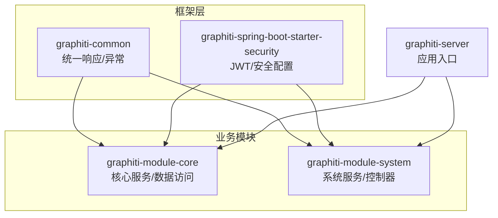
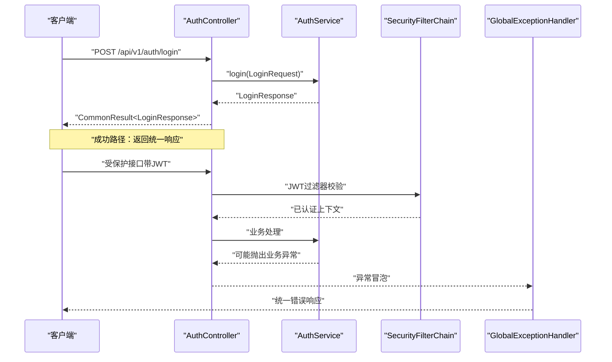
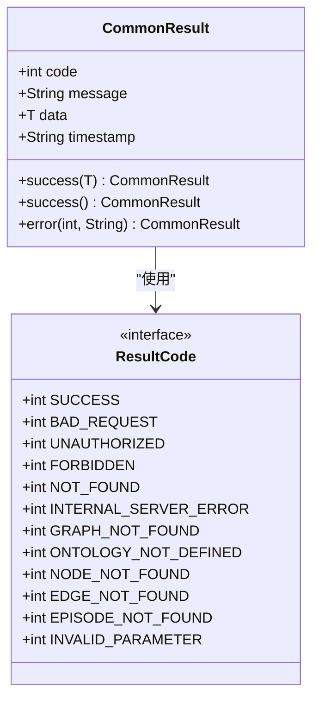
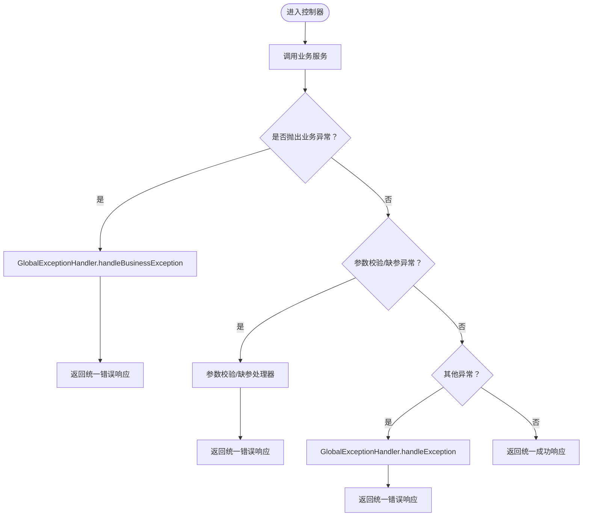
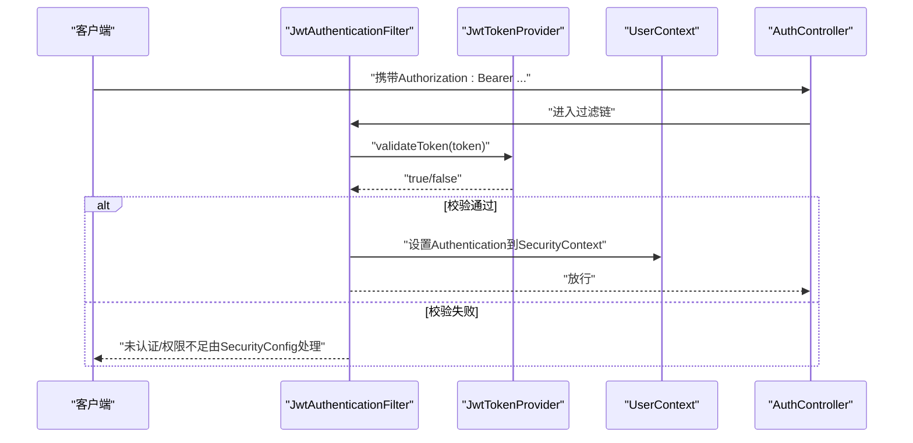
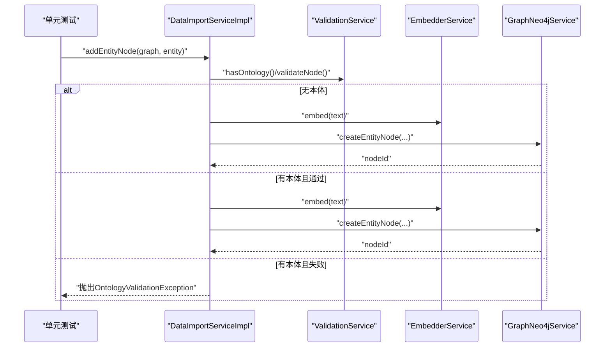
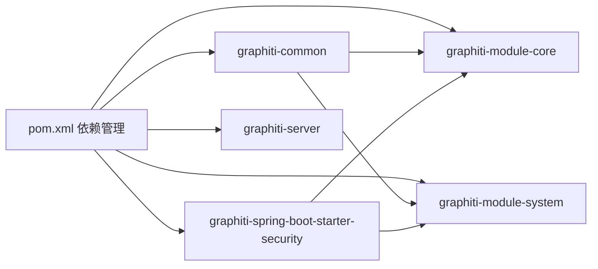

# 代码质量保证

<cite>
**本文引用的文件**
- [ResultCode.java](file://graphiti-framework/graphiti-common/src/main/java/com/Graphiti/common/constants/ResultCode.java)
- [CommonResult.java](file://graphiti-framework/graphiti-common/src/main/java/com/Graphiti/common/response/CommonResult.java)
- [BusinessException.java](file://graphiti-framework/graphiti-common/src/main/java/com/Graphiti/common/exception/BusinessException.java)
- [GlobalExceptionHandler.java](file://graphiti-framework/graphiti-common/src/main/java/com/Graphiti/common/exception/GlobalExceptionHandler.java)
- [JwtAuthenticationFilter.java](file://graphiti-framework/graphiti-spring-boot-starter-security/src/main/java/com/Graphiti/framework/security/jwt/JwtAuthenticationFilter.java)
- [JwtTokenProvider.java](file://graphiti-framework/graphiti-spring-boot-starter-security/src/main/java/com/Graphiti/framework/security/jwt/JwtTokenProvider.java)
- [UserContext.java](file://graphiti-framework/graphiti-spring-boot-starter-security/src/main/java/com/Graphiti/framework/security/util/UserContext.java)
- [SecurityConfig.java](file://graphiti-framework/graphiti-spring-boot-starter-security/src/main/java/com/Graphiti/framework/security/config/SecurityConfig.java)
- [AuthController.java](file://graphiti-module-system/src/main/java/com/Graphiti/system/controller/AuthController.java)
- [DataImportServiceImplTest.java](file://graphiti-module-core/src/test/java/com/Graphiti/module/graphiti/service/DataImportServiceImplTest.java)
- [OntologyValidationServiceImplTest.java](file://graphiti-module-core/src/test/java/com/Graphiti/module/graphiti/service/OntologyValidationServiceImplTest.java)
- [pom.xml](file://pom.xml)
</cite>

## 目录
1. [引言](#引言)
2. [项目结构](#项目结构)
3. [核心组件](#核心组件)
4. [架构总览](#架构总览)
5. [详细组件分析](#详细组件分析)
6. [依赖分析](#依赖分析)
7. [性能考虑](#性能考虑)
8. [故障排查指南](#故障排查指南)
9. [结论](#结论)
10. [附录](#附录)

## 引言
本指南聚焦于Graphiti-Java的代码质量保证最佳实践，围绕统一响应设计、异常与全局错误处理、ResultCode枚举设计与使用、以及测试策略与工具链展开。目标是帮助开发者在保持高一致性的同时，提升可维护性、可测试性与可演进性。

## 项目结构
- 模块划分清晰：框架层(graphiti-framework)提供通用能力（响应、异常、安全），业务模块(graphiti-module-core、graphiti-module-system)承载具体功能，服务入口(graphiti-server)组织运行。
- 质量相关的关键位置：
  - 响应与异常：graphiti-common
  - 安全与鉴权：graphiti-spring-boot-starter-security
  - 控制器示例：graphiti-module-system
  - 单元测试：graphiti-module-core 的 service 与 dal 测试

章节来源
- [pom.xml:15-20](file://pom.xml#L15-L20)

## 核心组件
- 统一响应模型：统一成功/失败响应结构，包含状态码、消息、数据与时间戳，便于前后端一致消费。
- 异常体系：业务异常与全局异常处理器配合，确保所有异常被规范化输出。
- ResultCode：集中定义系统与业务错误码，形成统一语义。
- 安全层：基于JWT的认证过滤、令牌签发与校验、用户上下文获取、安全过滤链与未认证/权限不足的JSON响应。

章节来源
- [CommonResult.java:13-67](file://graphiti-framework/graphiti-common/src/main/java/com/Graphiti/common/response/CommonResult.java#L13-L67)
- [BusinessException.java:10-32](file://graphiti-framework/graphiti-common/src/main/java/com/Graphiti/common/exception/BusinessException.java#L10-L32)
- [GlobalExceptionHandler.java:17-73](file://graphiti-framework/graphiti-common/src/main/java/com/Graphiti/common/exception/GlobalExceptionHandler.java#L17-L73)
- [ResultCode.java:7-22](file://graphiti-framework/graphiti-common/src/main/java/com/Graphiti/common/constants/ResultCode.java#L7-L22)
- [SecurityConfig.java:32-137](file://graphiti-framework/graphiti-spring-boot-starter-security/src/main/java/com/Graphiti/framework/security/config/SecurityConfig.java#L32-L137)

## 架构总览
下图展示从控制器到服务、再到安全与异常处理的整体调用路径与职责边界。

图表来源
- [AuthController.java:27-32](file://graphiti-module-system/src/main/java/com/Graphiti/system/controller/AuthController.java#L27-L32)
- [SecurityConfig.java:115-136](file://graphiti-framework/graphiti-spring-boot-starter-security/src/main/java/com/Graphiti/framework/security/config/SecurityConfig.java#L115-L136)
- [GlobalExceptionHandler.java:26-30](file://graphiti-framework/graphiti-common/src/main/java/com/Graphiti/common/exception/GlobalExceptionHandler.java#L26-L30)

## 详细组件分析

### 统一响应设计与使用规范
- 设计要点
  - 固定字段：code、message、data、timestamp
  - 成功：使用统一的成功工厂方法；失败：使用错误工厂方法
  - 时间戳采用ISO本地时间格式，便于日志与前端解析
- 使用建议
  - 控制器层统一返回CommonResult，避免直接返回原始对象
  - 对空数据场景使用无参success()，对有数据场景传入泛型数据
  - 错误场景优先使用ResultCode中的标准码，必要时扩展业务码

图表来源
- [CommonResult.java:13-67](file://graphiti-framework/graphiti-common/src/main/java/com/Graphiti/common/response/CommonResult.java#L13-L67)
- [ResultCode.java:7-22](file://graphiti-framework/graphiti-common/src/main/java/com/Graphiti/common/constants/ResultCode.java#L7-L22)

章节来源
- [CommonResult.java:13-67](file://graphiti-framework/graphiti-common/src/main/java/com/Graphiti/common/response/CommonResult.java#L13-L67)
- [ResultCode.java:7-22](file://graphiti-framework/graphiti-common/src/main/java/com/Graphiti/common/constants/ResultCode.java#L7-L22)

### 异常处理机制与全局错误处理
- 业务异常 BusinessException
  - 用于承载业务错误码与消息，便于上层统一处理
  - 可指定默认错误码（如内部错误），便于快速兜底
- 全局异常处理器 GlobalExceptionHandler
  - 统一捕获业务异常、参数校验异常、缺失参数异常与未知异常
  - 参数校验异常聚合字段级错误；缺失参数异常明确提示缺失项
  - 未知异常统一返回服务器内部错误
- 安全层异常
  - 未认证与权限不足分别返回401/403 JSON，内容与统一响应风格一致

图表来源
- [BusinessException.java:10-32](file://graphiti-framework/graphiti-common/src/main/java/com/Graphiti/common/exception/BusinessException.java#L10-L32)
- [GlobalExceptionHandler.java:26-72](file://graphiti-framework/graphiti-common/src/main/java/com/Graphiti/common/exception/GlobalExceptionHandler.java#L26-L72)
- [SecurityConfig.java:84-113](file://graphiti-framework/graphiti-spring-boot-starter-security/src/main/java/com/Graphiti/framework/security/config/SecurityConfig.java#L84-L113)

章节来源
- [BusinessException.java:10-32](file://graphiti-framework/graphiti-common/src/main/java/com/Graphiti/common/exception/BusinessException.java#L10-L32)
- [GlobalExceptionHandler.java:17-73](file://graphiti-framework/graphiti-common/src/main/java/com/Graphiti/common/exception/GlobalExceptionHandler.java#L17-L73)
- [SecurityConfig.java:84-113](file://graphiti-framework/graphiti-spring-boot-starter-security/src/main/java/com/Graphiti/framework/security/config/SecurityConfig.java#L84-L113)

### ResultCode枚举设计原则与使用规范
- 设计原则
  - 分层语义：2xx成功、4xx客户端错误、5xx服务端错误、1xxx业务错误
  - 业务码区间预留：为Graphiti业务错误保留1001-1099范围
  - 稳定性：一旦发布，避免随意变更码值
- 使用规范
  - 优先使用标准码；仅在确有需要时新增业务码
  - 与国际化解耦：错误消息由上层或前端根据code进行本地化
  - 前端兼容：统一的code/message/data结构，便于前端统一处理
- 扩展建议
  - 新增业务码时，同步完善异常抛出点与错误消息映射
  - 在文档中维护“错误码-含义-建议动作”的对照表

章节来源
- [ResultCode.java:7-22](file://graphiti-framework/graphiti-common/src/main/java/com/Graphiti/common/constants/ResultCode.java#L7-L22)

### 安全与认证（JWT）
- 认证过滤器 JwtAuthenticationFilter
  - 从Authorization头提取Bearer Token，校验后设置Security上下文
- Token提供器 JwtTokenProvider
  - 生成、解析、校验JWT，使用对称密钥与过期时间配置
- 用户上下文 UserContext
  - 从Security上下文中获取当前用户信息，未认证时抛出业务异常
- 安全配置 SecurityConfig
  - CORS、无状态会话、未认证/权限不足的JSON响应
  - 例外放行：认证、Swagger、Actuator等

图表来源
- [JwtAuthenticationFilter.java:26-59](file://graphiti-framework/graphiti-spring-boot-starter-security/src/main/java/com/Graphiti/framework/security/jwt/JwtAuthenticationFilter.java#L26-L59)
- [JwtTokenProvider.java:40-85](file://graphiti-framework/graphiti-spring-boot-starter-security/src/main/java/com/Graphiti/framework/security/jwt/JwtTokenProvider.java#L40-L85)
- [UserContext.java:19-48](file://graphiti-framework/graphiti-spring-boot-starter-security/src/main/java/com/Graphiti/framework/security/util/UserContext.java#L19-L48)
- [SecurityConfig.java:115-136](file://graphiti-framework/graphiti-spring-boot-starter-security/src/main/java/com/Graphiti/framework/security/config/SecurityConfig.java#L115-L136)

章节来源
- [JwtAuthenticationFilter.java:26-59](file://graphiti-framework/graphiti-spring-boot-starter-security/src/main/java/com/Graphiti/framework/security/jwt/JwtAuthenticationFilter.java#L26-L59)
- [JwtTokenProvider.java:18-85](file://graphiti-framework/graphiti-spring-boot-starter-security/src/main/java/com/Graphiti/framework/security/jwt/JwtTokenProvider.java#L18-L85)
- [UserContext.java:12-49](file://graphiti-framework/graphiti-spring-boot-starter-security/src/main/java/com/Graphiti/framework/security/util/UserContext.java#L12-L49)
- [SecurityConfig.java:32-137](file://graphiti-framework/graphiti-spring-boot-starter-security/src/main/java/com/Graphiti/framework/security/config/SecurityConfig.java#L32-L137)

### 单元测试编写规范与测试策略
- 规范
  - 使用Mockito模拟外部依赖，隔离被测单元
  - 断言覆盖：正常路径、异常路径、边界条件
  - 测试命名：以“条件_行为_期望”描述，提高可读性
- 示例
  - DataImportServiceImplTest：验证无本体/有本体/本体检错三种场景
  - OntologyValidationServiceImplTest：验证结果对象的构造与断言
- 建议
  - 为每个服务至少提供一个成功与一个失败场景
  - 对涉及外部系统（Neo4j、嵌入服务等）使用Mock或容器化测试

图表来源
- [DataImportServiceImplTest.java:42-94](file://graphiti-module-core/src/test/java/com/Graphiti/module/graphiti/service/DataImportServiceImplTest.java#L42-L94)

章节来源
- [DataImportServiceImplTest.java:26-95](file://graphiti-module-core/src/test/java/com/Graphiti/module/graphiti/service/DataImportServiceImplTest.java#L26-L95)
- [OntologyValidationServiceImplTest.java:9-34](file://graphiti-module-core/src/test/java/com/Graphiti/module/graphiti/service/OntologyValidationServiceImplTest.java#L9-L34)

### 集成测试与测试数据管理
- 集成测试建议
  - 使用容器化环境（如Testcontainers）启动数据库/缓存/Neo4j，确保真实依赖可用
  - 对认证流程进行端到端验证，覆盖登录、令牌刷新、权限不足等场景
- 测试数据管理
  - 使用SQL脚本初始化最小化数据集，确保可重复性
  - 将测试数据与测试用例一一对应，便于定位问题

[本节为通用实践建议，不直接分析具体文件]

### 代码审查流程、技术债务与重构策略
- 代码审查
  - 关注点：统一响应使用、异常处理一致性、ResultCode规范、安全过滤链配置
  - 建议引入自动化检查（如SonarQube规则）与人工审查双轨
- 技术债务
  - 优先解决跨模块重复代码、异常处理分散、错误消息硬编码等问题
- 重构策略
  - 小步快跑：先抽取公共逻辑，再统一异常与响应
  - 逐步替换：对历史接口保持向后兼容，新增接口严格遵循新规范

[本节为通用实践建议，不直接分析具体文件]

### IDE配置、代码格式化与注释规范
- IDE与插件
  - Lombok、MapStruct处理器已在编译插件中配置，确保IDE正确识别注解生成
- 代码格式化
  - 统一使用项目级格式化模板（如Google Java Style或Spring官方风格）
- 注释规范
  - 类/方法需有清晰的职责说明与参数/返回说明
  - 对复杂分支与异常路径补充注释，便于后续维护

章节来源
- [pom.xml:200-227](file://pom.xml#L200-L227)

## 依赖分析
- 模块间依赖
  - graphiti-common被业务模块广泛依赖，提供统一响应与异常
  - graphiti-spring-boot-starter-security被系统模块与核心模块共同依赖，提供安全能力
- 外部依赖
  - Spring Boot、MyBatis-Plus、Neo4j Driver、JWT、Lombok、MapStruct、Hutool、SpringDoc、PostgreSQL驱动、Redisson、Druid等

图表来源
- [pom.xml:45-196](file://pom.xml#L45-L196)

章节来源
- [pom.xml:45-196](file://pom.xml#L45-L196)

## 性能考虑
- 响应序列化：统一响应结构简单，序列化开销低
- 异常处理：全局异常处理器避免重复样板代码，减少异常传播成本
- 安全过滤：无状态会话与轻量过滤器，降低鉴权开销
- 建议
  - 对高频接口增加缓存策略（如Redis）
  - 对外部服务调用（LLM、嵌入）增加超时与熔断

[本节为通用性能建议，不直接分析具体文件]

## 故障排查指南
- 常见问题
  - 401未认证：检查Authorization头格式与JWT有效性
  - 403权限不足：确认用户角色与资源权限
  - 400参数错误：查看参数校验异常聚合的消息
  - 业务异常：根据BusinessException的code与message定位
- 排查步骤
  - 查看日志：GlobalExceptionHandler记录了错误码与消息
  - 核对ResultCode：确认错误码是否符合预期
  - 验证安全链路：确认JwtAuthenticationFilter是否正确设置Authentication

章节来源
- [GlobalExceptionHandler.java:26-72](file://graphiti-framework/graphiti-common/src/main/java/com/Graphiti/common/exception/GlobalExceptionHandler.java#L26-L72)
- [SecurityConfig.java:84-113](file://graphiti-framework/graphiti-spring-boot-starter-security/src/main/java/com/Graphiti/framework/security/config/SecurityConfig.java#L84-L113)
- [UserContext.java:19-48](file://graphiti-framework/graphiti-spring-boot-starter-security/src/main/java/com/Graphiti/framework/security/util/UserContext.java#L19-L48)

## 结论
通过统一响应、规范异常与ResultCode、完善的JWT安全链路与严格的测试策略，Graphiti-Java能够在保证一致性的同时提升可维护性与可演进性。建议持续完善测试覆盖、推进代码审查与技术债治理，确保高质量交付。

## 附录
- 最佳实践清单
  - 控制器层一律返回CommonResult
  - 业务异常统一使用BusinessException并绑定ResultCode
  - 未认证/权限不足使用SecurityConfig提供的JSON响应
  - 单元测试覆盖成功/失败/边界场景，使用Mockito
  - 代码注释与文档同步更新，保持一致性