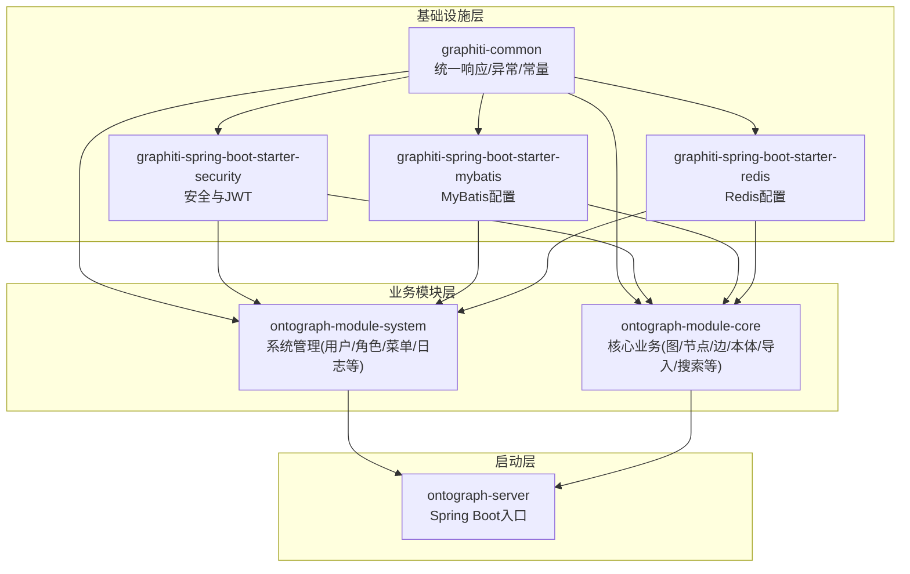
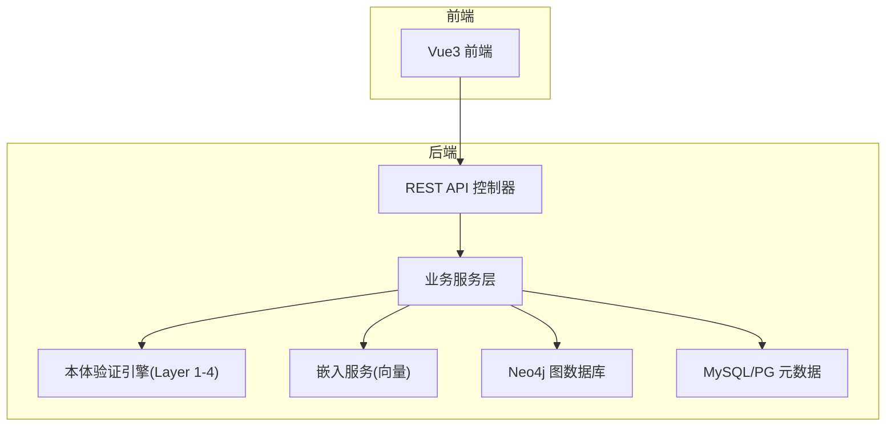
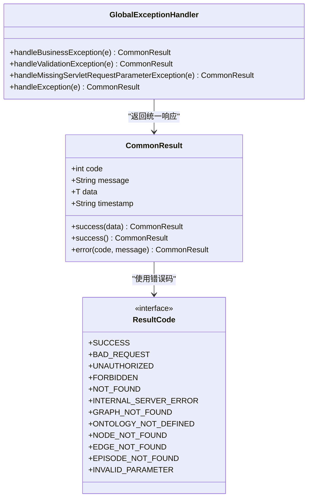
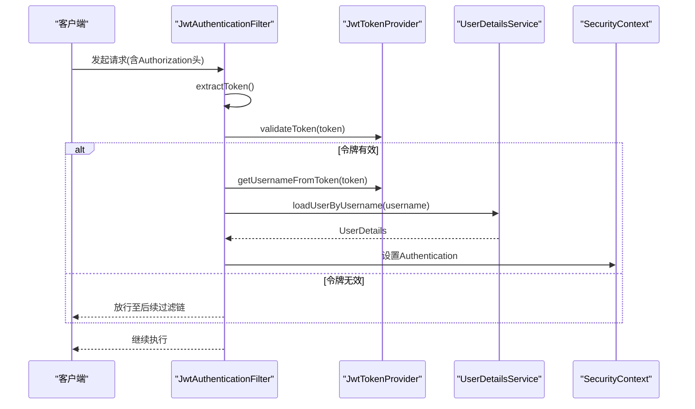
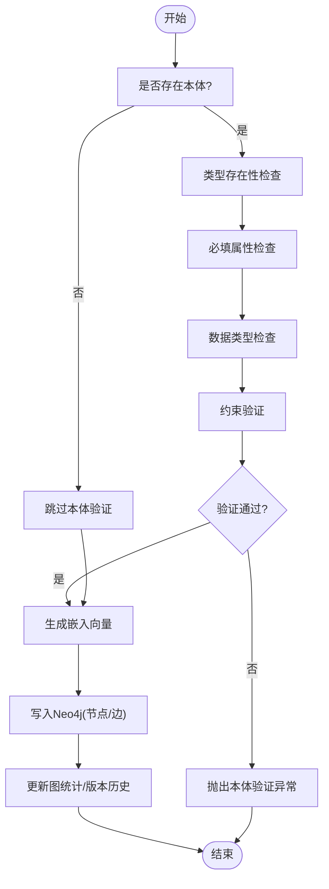
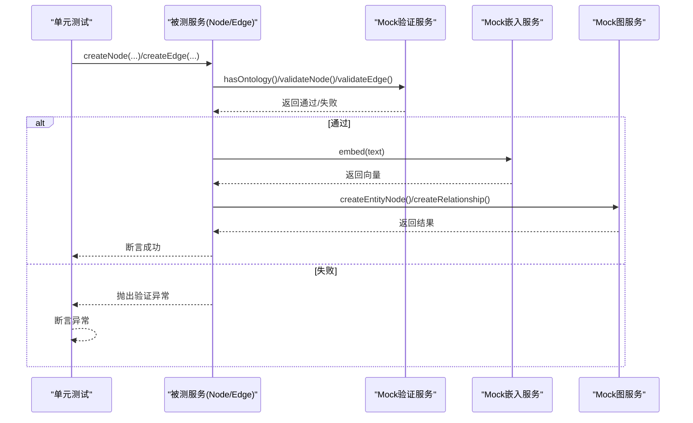
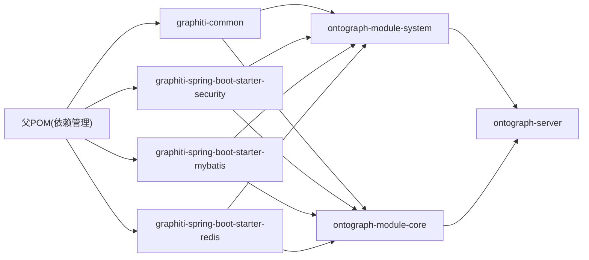

# 团队协作实践

<!--<cite>
**本文引用的文件**
- [README.md](file://README.md)
- [DESIGN.md](file://DESIGN.md)
- [pom.xml](file://pom.xml)
- [commit-msg.txt](file://commit-msg.txt)
- [GraphitiApplication.java](file://ontograph-server/src/main/java/com/Graphiti/GraphitiApplication.java)
- [CommonResult.java](file://ontograph-framework/graphiti-common/src/main/java/com/graphiti/common/response/CommonResult.java)
- [GlobalExceptionHandler.java](file://ontograph-framework/graphiti-common/src/main/java/com/graphiti/common/exception/GlobalExceptionHandler.java)
- [ResultCode.java](file://ontograph-framework/graphiti-common/src/main/java/com/graphiti/common/constants/ResultCode.java)
- [JwtAuthenticationFilter.java](file://ontograph-framework/graphiti-spring-boot-starter-security/src/main/java/com/graphiti/framework/security/jwt/JwtAuthenticationFilter.java)
- [implementation-summary.md](file://docs/implementation-summary.md)
- [ontology.md](file://docs/ontology.md)
- [database-migration-guide.md](file://docs/database-migration-guide.md)
- [pipeline.md](file://docs/pipeline.md)
- [NodeServiceImplTest.java](file://ontograph-module-core/src/test/java/com/Graphiti/module/graphiti/service/NodeServiceImplTest.java)
- [EdgeServiceImplTest.java](file://ontograph-module-core/src/test/java/com/Graphiti/module/graphiti/service/EdgeServiceImplTest.java)
- [OntologyValidationServiceImplTest.java](file://ontograph-module-core/src/test/java/com/Graphiti/module/graphiti/service/OntologyValidationServiceImplTest.java)
</cite>-->

## 目录
1. [简介](#简介)
2. [项目结构](#项目结构)
3. [核心组件](#核心组件)
4. [架构总览](#架构总览)
5. [详细组件分析](#详细组件分析)
6. [依赖分析](#依赖分析)
7. [性能考虑](#性能考虑)
8. [故障排查指南](#故障排查指南)
9. [结论](#结论)
10. [附录](#附录)

## 简介
本指南面向OntoGraph项目团队，聚焦于团队协作最佳实践，覆盖代码审查流程、分支管理策略、合并规范、项目文档维护、知识传承、经验分享机制；提供敏捷实践、迭代规划与需求管理指导；明确跨团队沟通、依赖管理与冲突解决模式；阐述持续集成、自动化测试与发布流程；给出新成员入职培训、技能培养与职业发展支持体系；并提供风险管控、进度跟踪与质量保证协作工具及远程协作、异步沟通与分布式团队管理的最佳实践。

## 项目结构
OntoGraph采用多模块Maven工程，按“基础设施层→业务模块层→启动层”的层次化组织，结合前后端分离架构，形成清晰的职责边界与可演进的扩展路径。

图表来源
- [pom.xml:15-20](file://pom.xml#L15-L20)
- [README.md:113-166](file://README.md#L113-L166)

章节来源
- [pom.xml:15-20](file://pom.xml#L15-L20)
- [README.md:113-166](file://README.md#L113-L166)

## 核心组件
- 统一响应与异常处理：通过统一响应封装与全局异常处理器，确保接口一致性与错误可追踪性。
- 安全与认证：基于JWT的认证过滤器与用户详情服务，保障接口访问安全。
- 业务模块：系统管理与核心业务模块分别承担用户/角色/菜单管理与图谱、节点、边、本体、导入、搜索等能力。
- 启动入口：Spring Boot应用入口类，按需排除第三方自动装配，降低启动噪音与潜在冲突。

章节来源
- [CommonResult.java:1-68](file://ontograph-framework/graphiti-common/src/main/java/com/graphiti/common/response/CommonResult.java#L1-L68)
- [GlobalExceptionHandler.java:1-74](file://ontograph-framework/graphiti-common/src/main/java/com/graphiti/common/exception/GlobalExceptionHandler.java#L1-L74)
- [JwtAuthenticationFilter.java:1-61](file://ontograph-framework/graphiti-spring-boot-starter-security/src/main/java/com/graphiti/framework/security/jwt/JwtAuthenticationFilter.java#L1-L61)
- [GraphitiApplication.java:18-34](file://ontograph-server/src/main/java/com/Graphiti/GraphitiApplication.java#L18-L34)

## 架构总览
系统采用“双存储”架构：MySQL/PG用于元数据与系统配置，Neo4j用于图数据与向量索引；通过graphId进行关联，实现本体与图数据的强一致约束与可演进的版本化管理。

图表来源
- [ontology.md:3-23](file://docs/ontology.md#L3-L23)
- [ontology.md:312-356](file://docs/ontology.md#L312-L356)

章节来源
- [ontology.md:3-23](file://docs/ontology.md#L3-L23)
- [ontology.md:312-356](file://docs/ontology.md#L312-L356)

## 详细组件分析

### 统一响应与异常处理
- 统一响应封装：提供成功/错误两类静态构造方法，统一返回结构与时间戳。
- 全局异常处理：集中捕获业务异常、参数校验异常与通用异常，输出结构化错误响应。
- 结果码常量：定义标准HTTP与业务错误码，便于前后端约定与调试。

图表来源
- [CommonResult.java:14-67](file://ontograph-framework/graphiti-common/src/main/java/com/graphiti/common/response/CommonResult.java#L14-L67)
- [GlobalExceptionHandler.java:26-72](file://ontograph-framework/graphiti-common/src/main/java/com/graphiti/common/exception/GlobalExceptionHandler.java#L26-L72)
- [ResultCode.java:7-22](file://ontograph-framework/graphiti-common/src/main/java/com/graphiti/common/constants/ResultCode.java#L7-L22)

章节来源
- [CommonResult.java:14-67](file://ontograph-framework/graphiti-common/src/main/java/com/graphiti/common/response/CommonResult.java#L14-L67)
- [GlobalExceptionHandler.java:26-72](file://ontograph-framework/graphiti-common/src/main/java/com/graphiti/common/exception/GlobalExceptionHandler.java#L26-L72)
- [ResultCode.java:7-22](file://ontograph-framework/graphiti-common/src/main/java/com/graphiti/common/constants/ResultCode.java#L7-L22)

### JWT认证与授权
- 请求拦截：从Authorization头提取Bearer Token，校验通过后将认证信息写入SecurityContext。
- 用户详情：结合UserDetailsService加载用户权限，支撑后续鉴权与资源访问控制。

图表来源
- [JwtAuthenticationFilter.java:36-58](file://ontograph-framework/graphiti-spring-boot-starter-security/src/main/java/com/graphiti/framework/security/jwt/JwtAuthenticationFilter.java#L36-L58)

章节来源
- [JwtAuthenticationFilter.java:36-58](file://ontograph-framework/graphiti-spring-boot-starter-security/src/main/java/com/graphiti/framework/security/jwt/JwtAuthenticationFilter.java#L36-L58)

### 本体验证与数据导入流程
- 双存储架构：MySQL/PG存储元数据与本体定义，Neo4j存储图数据与向量索引。
- 本体验证：四层验证（类型存在、必填属性、数据类型、约束）在写入前执行，确保数据质量。
- 导入管线：支持Schema.org本体导入、节点/边创建与本体验证、原始数据导入（后续可接入LLM抽取）。

图表来源
- [ontology.md:175-221](file://docs/ontology.md#L175-L221)

章节来源
- [ontology.md:175-221](file://docs/ontology.md#L175-L221)

### 测试策略与质量门禁
- 单元测试：针对Node/Edge/Validation服务的关键场景进行断言，覆盖“无本体绕过验证”“有本体通过/失败验证”等。
- Mock协作：通过Mockito模拟外部依赖（如嵌入服务、图数据库），隔离边界，提高测试稳定性与可重复性。
- 质量门禁：建议在CI中强制执行单元测试与覆盖率检查，确保每次提交均满足质量基线。

图表来源
- [NodeServiceImplTest.java:27-58](file://ontograph-module-core/src/test/java/com/Graphiti/module/graphiti/service/NodeServiceImplTest.java#L27-L58)
- [EdgeServiceImplTest.java:29-60](file://ontograph-module-core/src/test/java/com/Graphiti/module/graphiti/service/EdgeServiceImplTest.java#L29-L60)
- [OntologyValidationServiceImplTest.java:13-38](file://ontograph-module-core/src/test/java/com/Graphiti/module/graphiti/service/OntologyValidationServiceImplTest.java#L13-L38)

章节来源
- [NodeServiceImplTest.java:27-58](file://ontograph-module-core/src/test/java/com/Graphiti/module/graphiti/service/NodeServiceImplTest.java#L27-L58)
- [EdgeServiceImplTest.java:29-60](file://ontograph-module-core/src/test/java/com/Graphiti/module/graphiti/service/EdgeServiceImplTest.java#L29-L60)
- [OntologyValidationServiceImplTest.java:13-38](file://ontograph-module-core/src/test/java/com/Graphiti/module/graphiti/service/OntologyValidationServiceImplTest.java#L13-L38)

## 依赖分析
- 依赖管理：父POM集中声明Spring Boot、Spring AI、MyBatis-Plus、Neo4j、JWT、MapStruct、Hutool、SpringDoc、PostgreSQL、Redisson、Druid、动态数据源等版本，确保各模块依赖一致性。
- 模块耦合：公共模块为系统提供统一响应、异常与安全能力；业务模块依赖公共模块；启动模块聚合业务与公共模块，形成清晰的依赖方向。

图表来源
- [pom.xml:45-196](file://pom.xml#L45-L196)
- [pom.xml:15-20](file://pom.xml#L15-L20)

章节来源
- [pom.xml:45-196](file://pom.xml#L45-L196)
- [pom.xml:15-20](file://pom.xml#L15-L20)

## 性能考虑
- 向量索引与检索：Neo4j向量索引与全文索引配合，支持语义检索与关键词检索；建议在导入与查询路径中合理使用索引，避免全表扫描。
- 批量写入：通过事务封装批量写入，减少网络往返与锁竞争，提升吞吐。
- 嵌入生成：批量生成嵌入向量，避免逐条调用；在验证通过后再生成持久化向量，减少无效计算。
- 数据库连接池：合理配置连接池大小与超时，避免高并发下的连接争用。

## 故障排查指南
- 统一错误响应：通过统一响应与错误码定位问题类型（业务/参数/系统），结合日志快速定位。
- 参数校验异常：关注MethodArgumentNotValidException与MissingServletRequestParameterException，确保请求参数完整与合法。
- 本体验证异常：当节点/边类型不在本体中或属性不符合约束时抛出，需核对本体定义与数据结构。
- 数据迁移问题：若从MySQL迁移到PostgreSQL，注意JSONB类型、时区参数与时钟差异，必要时使用pgloader或手工转换。

章节来源
- [GlobalExceptionHandler.java:37-72](file://ontograph-framework/graphiti-common/src/main/java/com/graphiti/common/exception/GlobalExceptionHandler.java#L37-L72)
- [ResultCode.java:15-22](file://ontograph-framework/graphiti-common/src/main/java/com/graphiti/common/constants/ResultCode.java#L15-L22)
- [database-migration-guide.md:139-162](file://docs/database-migration-guide.md#L139-L162)

## 结论
通过统一响应与异常处理、JWT认证、四层本体验证与双存储架构，OntoGraph在工程化与数据治理方面建立了坚实基础。建议在团队协作中强化CI/CD与自动化测试、完善文档与知识沉淀、建立跨团队沟通与冲突解决机制，持续提升交付效率与质量。

## 附录

### 代码审查流程与合并规范
- 提交前检查：编译通过、单元测试通过、无格式化问题。
- 提交信息规范：遵循约定式提交，明确类型与主题，便于变更追踪与发布归档。
- 代码审查：至少一名Reviewer同意，确保设计一致性、可维护性与安全性。
- 合并策略：优先使用squash合并，保持提交历史整洁；大改动建议分批提交并附带计划文档。

章节来源
- [README.md:514-523](file://README.md#L514-L523)
- [commit-msg.txt:1-27](file://commit-msg.txt#L1-L27)

### 分支管理策略
- 主干保护：master/main仅允许通过受控渠道合并。
- 功能分支：feature/* 开发，完成后通过PR合并。
- 预发分支：release/* 用于预发布验证与回归测试。
- 热修复：hotfix/* 应急修复，快速回滚并同步主干。

### 项目文档维护与知识传承
- 文档分类：技术文档、实施总结、迁移指南、本体与数据模型、流水线说明。
- 版本与追踪：Markdown文件记录版本与状态，配合Git标签与变更日志。
- 知识沉淀：定期回顾与更新，形成“现状—问题—改进—验证”的闭环。

章节来源
- [implementation-summary.md:1-194](file://docs/implementation-summary.md#L1-L194)
- [ontology.md:1-448](file://docs/ontology.md#L1-L448)
- [database-migration-guide.md:1-218](file://docs/database-migration-guide.md#L1-L218)
- [pipeline.md:1-800](file://docs/pipeline.md#L1-L800)

### 敏捷实践与需求管理
- 迭代规划：以两周为周期，明确Sprint目标与验收标准。
- 需求拆解：用户故事→任务→子任务，配套验收条件与风险识别。
- 进度可视化：看板追踪任务状态，每日站会同步阻塞项。

### 跨团队沟通与冲突解决
- 明确接口契约：REST API与VO定义文档化，版本化管理。
- 依赖管理：通过公共模块与依赖管理统一版本，减少冲突。
- 冲突解决：建立升级委员会，按影响面与风险评估决策。

### 持续集成、自动化测试与发布
- CI流水线：编译、测试、覆盖率、静态检查、打包。
- 自动化测试：单元测试与集成测试并行，关键路径强制通过。
- 发布策略：灰度发布与回滚预案，结合监控与告警。

### 新成员入职与技能发展
- 入职培训：项目背景、架构、模块职责、开发与测试流程。
- 导师制度：老员工一对一指导，加速上手。
- 技术成长：定期分享会、外部学习补贴、晋升通道透明化。

### 风险管理与质量保证
- 风险识别：技术债、依赖升级、容量与性能瓶颈。
- 质量工具：SonarQube、SpotBugs、PMD、JUnit覆盖率。
- 进度跟踪：燃尽图、缺陷趋势、回归率与MTTR。

### 远程协作与分布式团队
- 异步沟通：规范回复时效与状态同步，使用共享文档与看板。
- 工具链：统一IDE配置、代码风格、提交模板与PR模板。
- 文化建设：线上技术分享、虚拟咖啡角、跨时区排班与轮值。