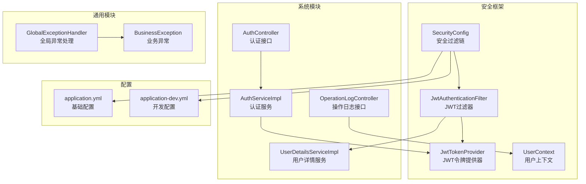
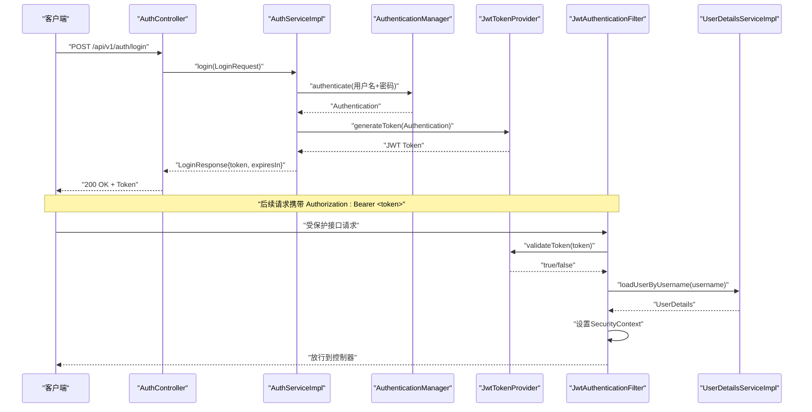
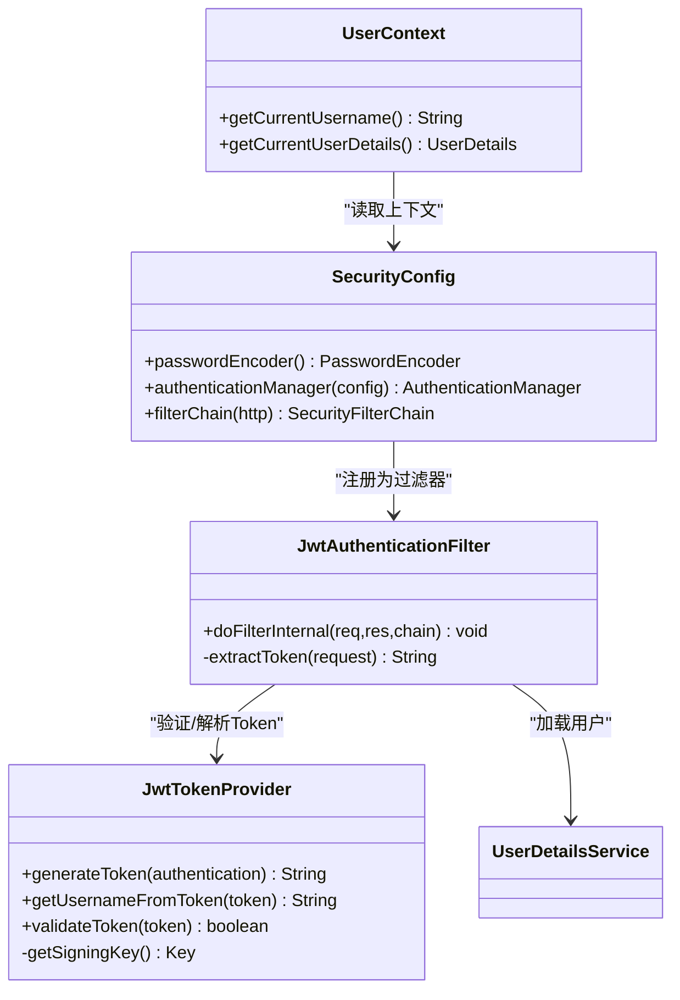
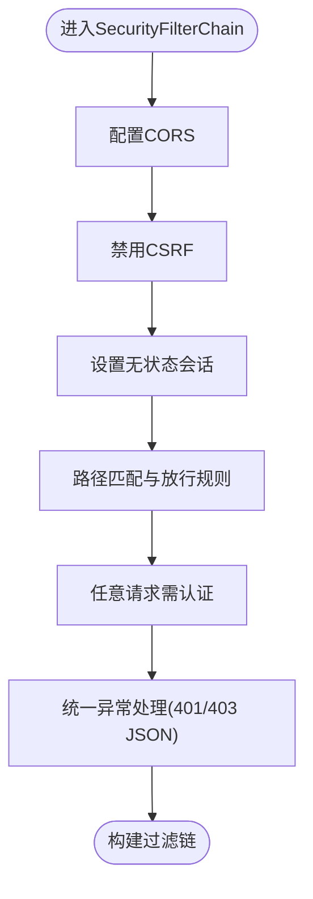
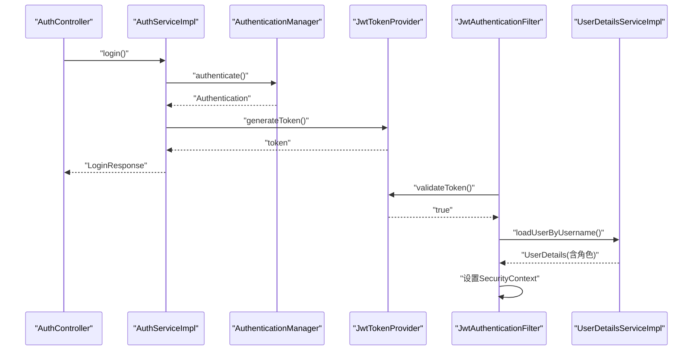
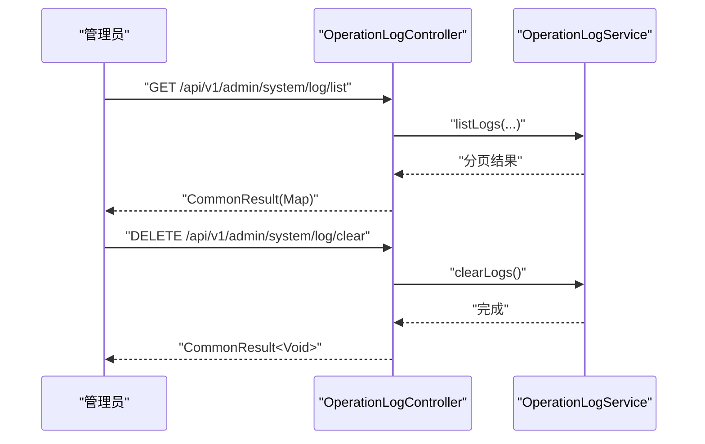
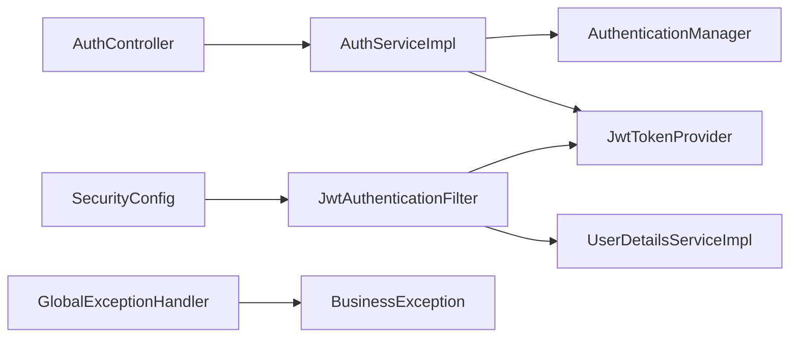

# 安全合规实践

<cite>
**本文引用的文件**
- [SecurityConfig.java](file://graphiti-framework/graphiti-spring-boot-starter-security/src/main/java/com/graphiti/framework/security/config/SecurityConfig.java)
- [JwtAuthenticationFilter.java](file://graphiti-framework/graphiti-spring-boot-starter-security/src/main/java/com/graphiti/framework/security/jwt/JwtAuthenticationFilter.java)
- [JwtTokenProvider.java](file://graphiti-framework/graphiti-spring-boot-starter-security/src/main/java/com/graphiti/framework/security/jwt/JwtTokenProvider.java)
- [UserContext.java](file://graphiti-framework/graphiti-spring-boot-starter-security/src/main/java/com/graphiti/framework/security/util/UserContext.java)
- [AuthController.java](file://graphiti-module-system/src/main/java/com/graphiti/system/controller/AuthController.java)
- [AuthServiceImpl.java](file://graphiti-module-system/src/main/java/com/graphiti/system/service/impl/AuthServiceImpl.java)
- [UserDetailsServiceImpl.java](file://graphiti-module-system/src/main/java/com/graphiti/system/service/UserDetailsServiceImpl.java)
- [LoginRequest.java](file://graphiti-module-system/src/main/java/com/graphiti/system/dto/LoginRequest.java)
- [LoginResponse.java](file://graphiti-module-system/src/main/java/com/graphiti/system/dto/LoginResponse.java)
- [UserDO.java](file://graphiti-module-system/src/main/java/com/graphiti/system/dal/dataobject/UserDO.java)
- [UserMapper.java](file://graphiti-module-system/src/main/java/com/graphiti/system/dal/mysql/UserMapper.java)
- [OperationLogController.java](file://graphiti-module-system/src/main/java/com/graphiti/system/controller/OperationLogController.java)
- [OperationLogDO.java](file://graphiti-module-system/src/main/java/com/graphiti/system/dal/dataobject/OperationLogDO.java)
- [GlobalExceptionHandler.java](file://graphiti-framework/graphiti-common/src/main/java/com/graphiti/common/exception/GlobalExceptionHandler.java)
- [BusinessException.java](file://graphiti-framework/graphiti-common/src/main/java/com/graphiti/common/exception/BusinessException.java)
- [application.yml](file://graphiti-server/src/main/resources/application.yml)
- [application-dev.yml](file://graphiti-server/src/main/resources/application-dev.yml)
</cite>

## 目录
1. [引言](#引言)
2. [项目结构](#项目结构)
3. [核心组件](#核心组件)
4. [架构总览](#架构总览)
5. [详细组件分析](#详细组件分析)
6. [依赖分析](#依赖分析)
7. [性能考虑](#性能考虑)
8. [故障排查指南](#故障排查指南)
9. [结论](#结论)
10. [附录](#附录)

## 引言
本指南面向安全工程师与合规专员，围绕Graphiti-Java后端的安全与合规实践提供系统性方案。内容覆盖JWT令牌机制与密钥管理、令牌刷新策略建议、Spring Security配置最佳实践（含CSRF、XSS、SQL注入防护）、认证授权与权限控制、角色管理、数据加密与传输加密、敏感信息脱敏、审计日志与安全事件监控、漏洞扫描与渗透测试方法、GDPR/CCPA等法规合规要求及实施策略，并给出安全培训、应急响应与事件处置流程。

## 项目结构
后端采用模块化分层设计：
- 安全框架模块：提供Spring Security配置、JWT过滤器与令牌提供器、用户上下文工具。
- 系统模块：提供认证、用户、菜单、角色、操作日志等系统能力。
- 通用模块：统一异常处理与业务异常封装。
- 服务器模块：应用配置与启动入口。

图表来源
- [SecurityConfig.java:115-136](file://graphiti-framework/graphiti-spring-boot-starter-security/src/main/java/com/graphiti/framework/security/config/SecurityConfig.java#L115-L136)
- [JwtAuthenticationFilter.java:26-59](file://graphiti-framework/graphiti-spring-boot-starter-security/src/main/java/com/graphiti/framework/security/jwt/JwtAuthenticationFilter.java#L26-L59)
- [JwtTokenProvider.java:19-86](file://graphiti-framework/graphiti-spring-boot-starter-security/src/main/java/com/graphiti/framework/security/jwt/JwtTokenProvider.java#L19-L86)
- [AuthController.java:16-54](file://graphiti-module-system/src/main/java/com/graphiti/system/controller/AuthController.java#L16-L54)
- [AuthServiceImpl.java:21-66](file://graphiti-module-system/src/main/java/com/graphiti/system/service/impl/AuthServiceImpl.java#L21-L66)
- [UserDetailsServiceImpl.java:21-42](file://graphiti-module-system/src/main/java/com/graphiti/system/service/UserDetailsServiceImpl.java#L21-L42)
- [OperationLogController.java:22-72](file://graphiti-module-system/src/main/java/com/graphiti/system/controller/OperationLogController.java#L22-L72)
- [GlobalExceptionHandler.java:17-73](file://graphiti-framework/graphiti-common/src/main/java/com/graphiti/common/exception/GlobalExceptionHandler.java#L17-L73)
- [application.yml:25-34](file://graphiti-server/src/main/resources/application.yml#L25-L34)
- [application-dev.yml:487-676](file://graphiti-server/src/main/resources/application-dev.yml#L487-L676)

章节来源
- [SecurityConfig.java:115-136](file://graphiti-framework/graphiti-spring-boot-starter-security/src/main/java/com/graphiti/framework/security/config/SecurityConfig.java#L115-L136)
- [application.yml:25-34](file://graphiti-server/src/main/resources/application.yml#L25-L34)
- [application-dev.yml:487-676](file://graphiti-server/src/main/resources/application-dev.yml#L487-L676)

## 核心组件
- 安全过滤链与认证管理：禁用CSRF、无状态会话、基于路径的放行规则、统一认证/鉴权异常处理。
- JWT认证过滤器：从Authorization头提取Bearer Token，校验并通过UserDetailsService加载用户，设置SecurityContext。
- JWT令牌提供器：基于对称密钥生成与验证Token，支持过期时间配置。
- 用户上下文：从SecurityContext获取当前用户信息，未认证时抛出业务异常。
- 认证服务：用户名密码认证后签发JWT，返回Token与过期时间；提供用户信息查询与登出清理。
- 全局异常处理：统一包装业务异常、参数校验异常与系统异常，保证错误输出一致性。

章节来源
- [SecurityConfig.java:37-136](file://graphiti-framework/graphiti-spring-boot-starter-security/src/main/java/com/graphiti/framework/security/config/SecurityConfig.java#L37-L136)
- [JwtAuthenticationFilter.java:26-59](file://graphiti-framework/graphiti-spring-boot-starter-security/src/main/java/com/graphiti/framework/security/jwt/JwtAuthenticationFilter.java#L26-L59)
- [JwtTokenProvider.java:19-86](file://graphiti-framework/graphiti-spring-boot-starter-security/src/main/java/com/graphiti/framework/security/jwt/JwtTokenProvider.java#L19-L86)
- [UserContext.java:13-49](file://graphiti-framework/graphiti-spring-boot-starter-security/src/main/java/com/graphiti/framework/security/util/UserContext.java#L13-L49)
- [AuthServiceImpl.java:21-66](file://graphiti-module-system/src/main/java/com/graphiti/system/service/impl/AuthServiceImpl.java#L21-L66)
- [GlobalExceptionHandler.java:17-73](file://graphiti-framework/graphiti-common/src/main/java/com/graphiti/common/exception/GlobalExceptionHandler.java#L17-L73)

## 架构总览
下图展示认证与安全控制的关键交互：

图表来源
- [AuthController.java:27-32](file://graphiti-module-system/src/main/java/com/graphiti/system/controller/AuthController.java#L27-L32)
- [AuthServiceImpl.java:27-44](file://graphiti-module-system/src/main/java/com/graphiti/system/service/impl/AuthServiceImpl.java#L27-L44)
- [JwtTokenProvider.java:40-53](file://graphiti-framework/graphiti-spring-boot-starter-security/src/main/java/com/graphiti/framework/security/jwt/JwtTokenProvider.java#L40-L53)
- [JwtAuthenticationFilter.java:44-59](file://graphiti-framework/graphiti-spring-boot-starter-security/src/main/java/com/graphiti/framework/security/jwt/JwtAuthenticationFilter.java#L44-L59)
- [UserDetailsServiceImpl.java:24-41](file://graphiti-module-system/src/main/java/com/graphiti/system/service/UserDetailsServiceImpl.java#L24-L41)

## 详细组件分析

### JWT令牌机制与密钥管理
- 令牌生成：基于对称密钥（HMAC-SHA），包含sub、iat、exp声明，过期时间可配置。
- 令牌验证：解析并验证签名，捕获异常以判定有效性。
- 密钥管理：密钥来源于配置文件，应满足最小长度要求并定期轮换；生产环境建议使用密钥管理系统（KMS）或环境变量注入。

图表来源
- [JwtTokenProvider.java:19-86](file://graphiti-framework/graphiti-spring-boot-starter-security/src/main/java/com/graphiti/framework/security/jwt/JwtTokenProvider.java#L19-L86)
- [SecurityConfig.java:37-136](file://graphiti-framework/graphiti-spring-boot-starter-security/src/main/java/com/graphiti/framework/security/config/SecurityConfig.java#L37-L136)
- [JwtAuthenticationFilter.java:26-59](file://graphiti-framework/graphiti-spring-boot-starter-security/src/main/java/com/graphiti/framework/security/jwt/JwtAuthenticationFilter.java#L26-L59)
- [UserContext.java:13-49](file://graphiti-framework/graphiti-spring-boot-starter-security/src/main/java/com/graphiti/framework/security/util/UserContext.java#L13-L49)

章节来源
- [JwtTokenProvider.java:21-25](file://graphiti-framework/graphiti-spring-boot-starter-security/src/main/java/com/graphiti/framework/security/jwt/JwtTokenProvider.java#L21-L25)
- [application.yml:25-30](file://graphiti-server/src/main/resources/application.yml#L25-L30)
- [application-dev.yml:487-676](file://graphiti-server/src/main/resources/application-dev.yml#L487-L676)

### Spring Security配置最佳实践
- CSRF：无状态JWT场景下禁用，避免与前端SPA协作问题。
- Session：STATELESS，防止会话劫持与滥用。
- 路由放行：开放认证、文档与监控端点；其余请求均需认证。
- 统一异常：未认证与权限不足分别返回JSON，便于前端处理。

图表来源
- [SecurityConfig.java:115-136](file://graphiti-framework/graphiti-spring-boot-starter-security/src/main/java/com/graphiti/framework/security/config/SecurityConfig.java#L115-L136)

章节来源
- [SecurityConfig.java:115-136](file://graphiti-framework/graphiti-spring-boot-starter-security/src/main/java/com/graphiti/framework/security/config/SecurityConfig.java#L115-L136)

### 认证授权、权限控制与角色管理
- 认证流程：用户名密码提交至认证管理器，成功后签发JWT。
- 授权流程：JWT过滤器解析Token，加载用户详情，设置Authentication到SecurityContext。
- 角色与权限：UserDetailsServiceImpl示例中演示授予角色；实际项目应从数据库查询用户与角色映射。

图表来源
- [AuthController.java:27-32](file://graphiti-module-system/src/main/java/com/graphiti/system/controller/AuthController.java#L27-L32)
- [AuthServiceImpl.java:27-44](file://graphiti-module-system/src/main/java/com/graphiti/system/service/impl/AuthServiceImpl.java#L27-L44)
- [JwtTokenProvider.java:40-53](file://graphiti-framework/graphiti-spring-boot-starter-security/src/main/java/com/graphiti/framework/security/jwt/JwtTokenProvider.java#L40-L53)
- [JwtAuthenticationFilter.java:44-59](file://graphiti-framework/graphiti-spring-boot-starter-security/src/main/java/com/graphiti/framework/security/jwt/JwtAuthenticationFilter.java#L44-L59)
- [UserDetailsServiceImpl.java:24-41](file://graphiti-module-system/src/main/java/com/graphiti/system/service/UserDetailsServiceImpl.java#L24-L41)

章节来源
- [AuthController.java:16-54](file://graphiti-module-system/src/main/java/com/graphiti/system/controller/AuthController.java#L16-L54)
- [AuthServiceImpl.java:21-66](file://graphiti-module-system/src/main/java/com/graphiti/system/service/impl/AuthServiceImpl.java#L21-L66)
- [UserDetailsServiceImpl.java:21-42](file://graphiti-module-system/src/main/java/com/graphiti/system/service/UserDetailsServiceImpl.java#L21-L42)

### 数据加密存储、传输加密与敏感信息脱敏
- 存储加密：密码采用BCrypt编码存储，确保不可逆。
- 传输加密：建议启用HTTPS/TLS，结合HSTS与安全头部。
- 敏感信息脱敏：日志与响应中避免直接输出明文密码、Token与敏感字段；对日志中的敏感参数进行脱敏处理。

章节来源
- [SecurityConfig.java:44-47](file://graphiti-framework/graphiti-spring-boot-starter-security/src/main/java/com/graphiti/framework/security/config/SecurityConfig.java#L44-L47)
- [UserDetailsServiceImpl.java:34-40](file://graphiti-module-system/src/main/java/com/graphiti/system/service/UserDetailsServiceImpl.java#L34-L40)
- [GlobalExceptionHandler.java:26-30](file://graphiti-framework/graphiti-common/src/main/java/com/graphiti/common/exception/GlobalExceptionHandler.java#L26-L30)

### 审计日志、操作追踪与安全事件监控
- 操作日志：提供分页查询、详情、删除、清空与导出接口，记录用户、方法、参数、IP、耗时、状态与错误信息。
- 安全事件：结合全局异常处理器与安全过滤链，统一记录未认证与权限不足事件。

图表来源
- [OperationLogController.java:27-71](file://graphiti-module-system/src/main/java/com/graphiti/system/controller/OperationLogController.java#L27-L71)
- [OperationLogDO.java:14-41](file://graphiti-module-system/src/main/java/com/graphiti/system/dal/dataobject/OperationLogDO.java#L14-L41)

章节来源
- [OperationLogController.java:18-72](file://graphiti-module-system/src/main/java/com/graphiti/system/controller/OperationLogController.java#L18-L72)
- [OperationLogDO.java:9-41](file://graphiti-module-system/src/main/java/com/graphiti/system/dal/dataobject/OperationLogDO.java#L9-L41)
- [GlobalExceptionHandler.java:67-72](file://graphiti-framework/graphiti-common/src/main/java/com/graphiti/common/exception/GlobalExceptionHandler.java#L67-L72)

### 漏洞扫描、渗透测试与安全评估
- 依赖扫描：定期扫描第三方依赖漏洞，修复高危与严重风险版本。
- 静态分析：启用SpotBugs、SonarQube等静态分析工具，聚焦认证绕过、权限提升、注入与配置缺陷。
- 动态测试：对认证、授权、敏感接口进行渗透测试，重点验证CSRF、XSS、SQL注入、SSRF与越权。
- 配置审计：检查密钥、证书、CORS与跨域配置，确保最小暴露面。

[本节为通用指导，无需列出章节来源]

### 合规要求与实施策略（GDPR/CCPA）
- 数据主体权利：提供访问、更正、删除与可携带权的接口与流程。
- 最小化与目的限制：仅收集必要数据，明确用途并在过期后删除。
- 数据安全：实施加密、访问控制与审计日志，确保数据生命周期安全。
- 响应机制：建立数据泄露通知与影响评估流程，按监管要求时限上报。

[本节为通用指导，无需列出章节来源]

### 安全培训、应急响应与事件处置
- 培训：对开发与运维团队进行OWASP Top 10、认证授权与日志审计专题培训。
- 应急预案：明确事件分级、处置流程、沟通渠道与恢复策略。
- 事件处置：快速隔离、取证分析、修复与复盘，持续改进安全基线。

[本节为通用指导，无需列出章节来源]

## 依赖分析
- 组件耦合：认证链路中控制器依赖服务，服务依赖认证管理器与JWT提供器；过滤器依赖令牌提供器与用户详情服务；全局异常处理器独立于业务模块。
- 外部依赖：Spring Security、Jackson、BCrypt、JWT库、MyBatis-Plus、Actuator与OpenAPI。

图表来源
- [AuthController.java:20-32](file://graphiti-module-system/src/main/java/com/graphiti/system/controller/AuthController.java#L20-L32)
- [AuthServiceImpl.java:23-44](file://graphiti-module-system/src/main/java/com/graphiti/system/service/impl/AuthServiceImpl.java#L23-L44)
- [SecurityConfig.java:132-133](file://graphiti-framework/graphiti-spring-boot-starter-security/src/main/java/com/graphiti/framework/security/config/SecurityConfig.java#L132-L133)
- [JwtAuthenticationFilter.java:28-56](file://graphiti-framework/graphiti-spring-boot-starter-security/src/main/java/com/graphiti/framework/security/jwt/JwtAuthenticationFilter.java#L28-L56)
- [GlobalExceptionHandler.java:26-30](file://graphiti-framework/graphiti-common/src/main/java/com/graphiti/common/exception/GlobalExceptionHandler.java#L26-L30)

章节来源
- [AuthController.java:16-54](file://graphiti-module-system/src/main/java/com/graphiti/system/controller/AuthController.java#L16-L54)
- [AuthServiceImpl.java:21-66](file://graphiti-module-system/src/main/java/com/graphiti/system/service/impl/AuthServiceImpl.java#L21-L66)
- [JwtAuthenticationFilter.java:26-59](file://graphiti-framework/graphiti-spring-boot-starter-security/src/main/java/com/graphiti/framework/security/jwt/JwtAuthenticationFilter.java#L26-L59)
- [GlobalExceptionHandler.java:17-73](file://graphiti-framework/graphiti-common/src/main/java/com/graphiti/common/exception/GlobalExceptionHandler.java#L17-L73)

## 性能考虑
- JWT无状态：减少服务器端会话存储开销，适合水平扩展。
- 过滤器链轻量：仅在必要处解析与验证Token，避免重复计算。
- 日志与指标：开启Actuator与日志采样，关注认证失败率与响应延迟。

[本节为通用指导，无需列出章节来源]

## 故障排查指南
- 未认证/401：检查Authorization头是否为Bearer Token，确认Token未过期且密钥一致。
- 权限不足/403：检查用户角色与接口权限配置，确认SecurityContext已正确设置。
- 参数校验错误：查看全局异常处理器对MethodArgumentNotValidException的统一返回。
- 登录失败：核对UserDetailsServiceImpl中用户名与密码匹配逻辑，确认BCrypt编码一致。

章节来源
- [SecurityConfig.java:84-113](file://graphiti-framework/graphiti-spring-boot-starter-security/src/main/java/com/graphiti/framework/security/config/SecurityConfig.java#L84-L113)
- [GlobalExceptionHandler.java:37-60](file://graphiti-framework/graphiti-common/src/main/java/com/graphiti/common/exception/GlobalExceptionHandler.java#L37-L60)
- [UserDetailsServiceImpl.java:24-41](file://graphiti-module-system/src/main/java/com/graphiti/system/service/UserDetailsServiceImpl.java#L24-L41)

## 结论
Graphiti-Java的安全体系以无状态JWT为核心，结合Spring Security的统一过滤链与异常处理，形成清晰的认证授权与审计闭环。建议在生产环境中强化密钥轮换、传输加密、日志脱敏与合规治理，并持续开展漏洞扫描与渗透测试，确保系统在功能完备的同时满足安全与合规要求。

## 附录
- 配置要点
  - JWT密钥与过期时间：在基础配置中设置，生产环境使用强密钥与短有效期。
  - 开发环境暴露：开发配置中允许Actuator全部端点，生产环境应收紧暴露范围。
  - 数据源与Redis：开发配置中提供示例，生产需启用TLS与最小权限账户。

章节来源
- [application.yml:25-34](file://graphiti-server/src/main/resources/application.yml#L25-L34)
- [application-dev.yml:487-676](file://graphiti-server/src/main/resources/application-dev.yml#L487-L676)