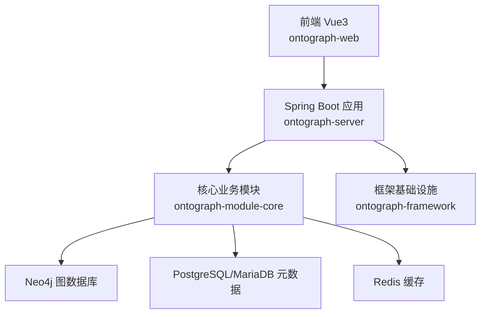
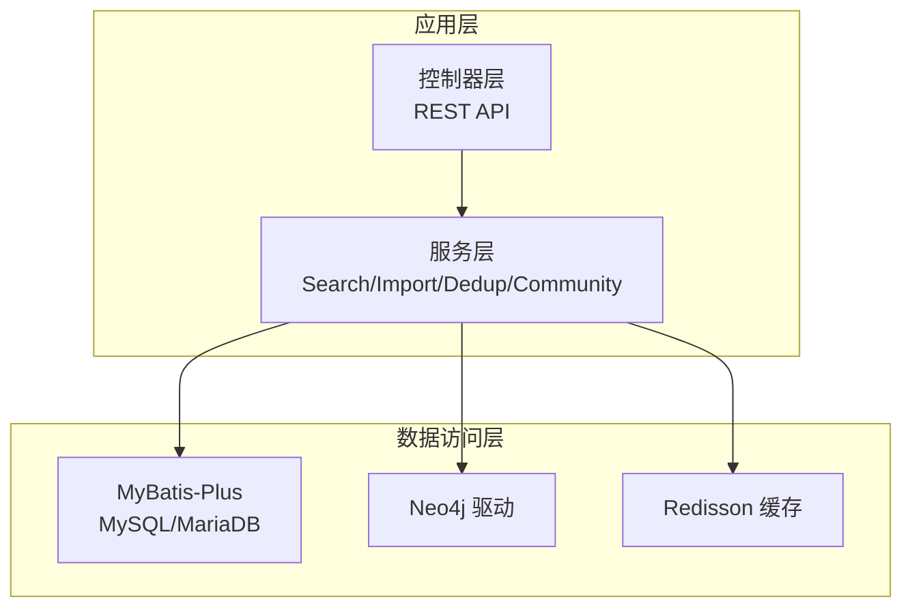
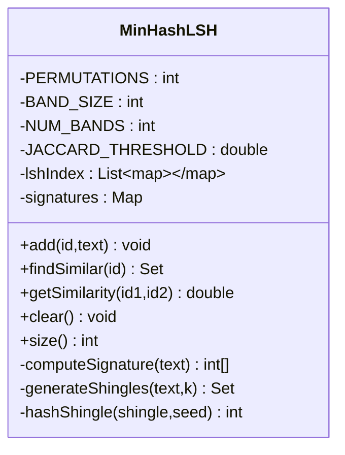
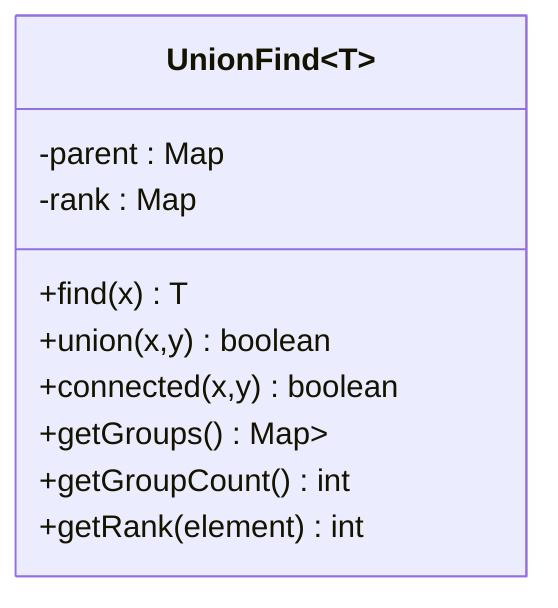
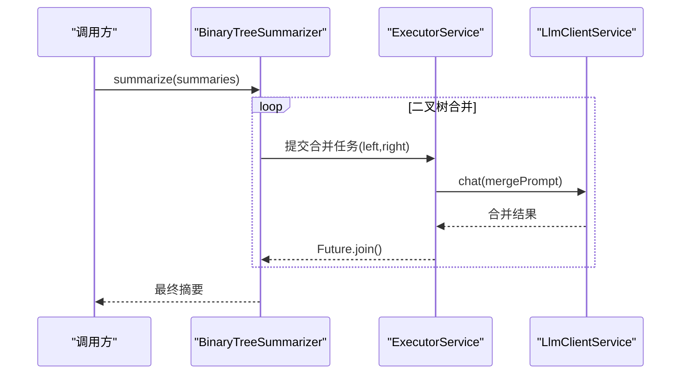
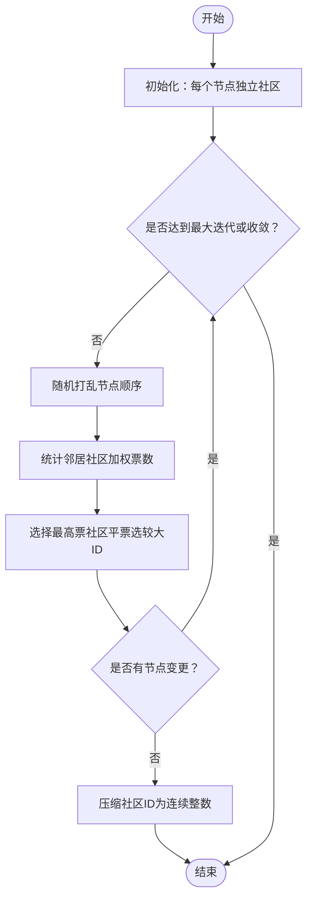
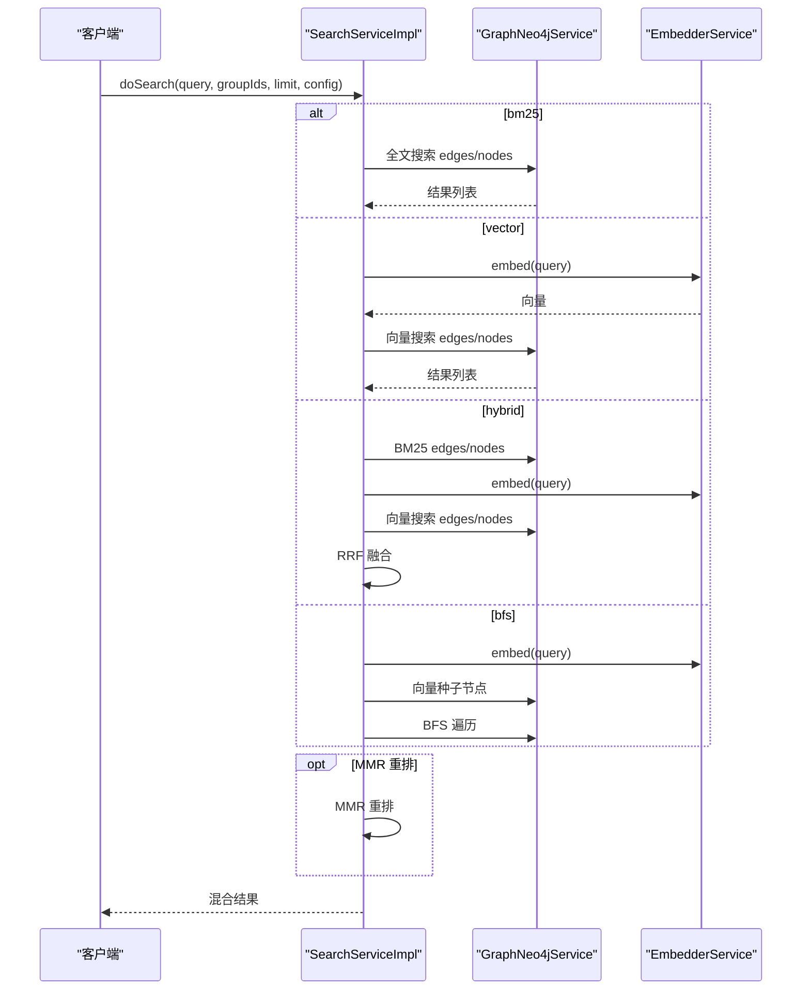
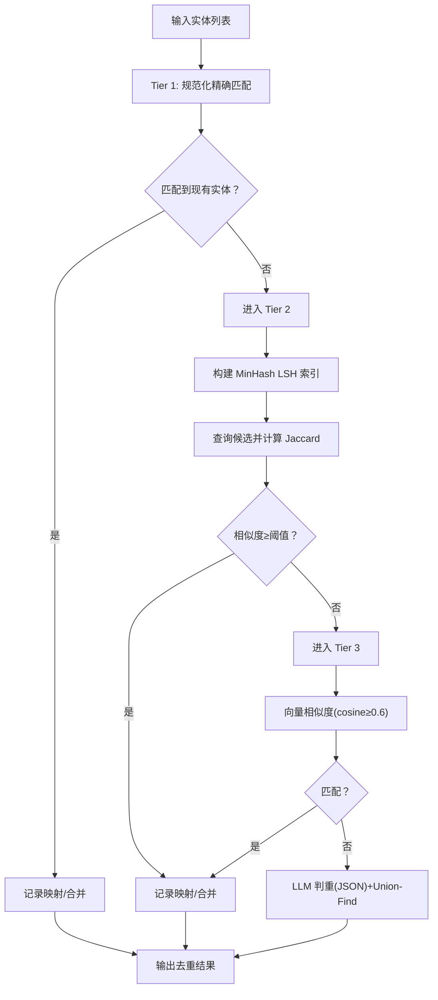
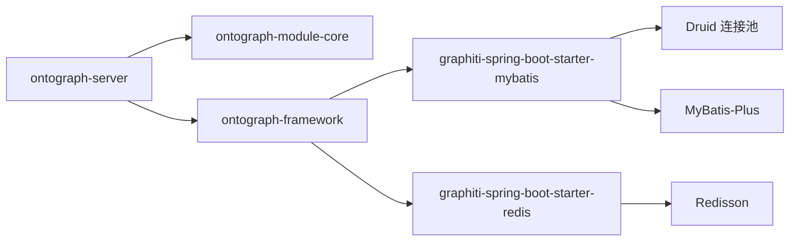

# 性能优化实践

<!--<cite>
**本文档引用的文件**
- [README.md](file://README.md)
- [DESIGN.md](file://DESIGN.md)
- [MinHashLSH.java](file://ontograph-module-core/src/main/java/com/graphiti/module/graphiti/util/MinHashLSH.java)
- [UnionFind.java](file://ontograph-module-core/src/main/java/com/graphiti/module/graphiti/util/UnionFind.java)
- [BinaryTreeSummarizer.java](file://ontograph-module-core/src/main/java/com/graphiti/module/graphiti/util/BinaryTreeSummarizer.java)
- [LabelPropagation.java](file://ontograph-module-core/src/main/java/com/graphiti/module/graphiti/util/LabelPropagation.java)
- [RerankingUtils.java](file://ontograph-module-core/src/main/java/com/graphiti/module/graphiti/util/RerankingUtils.java)
- [SearchServiceImpl.java](file://ontograph-module-core/src/main/java/com/graphiti/module/graphiti/service/impl/SearchServiceImpl.java)
- [DataImportServiceImpl.java](file://ontograph-module-core/src/main/java/com/graphiti/module/graphiti/service/impl/DataImportServiceImpl.java)
- [EntityDedupServiceImpl.java](file://ontograph-module-core/src/main/java/com/graphiti/module/graphiti/service/impl/EntityDedupServiceImpl.java)
- [CommunityServiceImpl.java](file://ontograph-module-core/src/main/java/com/graphiti/module/graphiti/service/impl/CommunityServiceImpl.java)
- [application.yml](file://ontograph-server/src/main/resources/application.yml)
- [graphiti-spring-boot-starter-mybatis/pom.xml](file://ontograph-framework/graphiti-spring-boot-starter-mybatis/pom.xml)
- [graphiti-spring-boot-starter-redis/pom.xml](file://ontograph-framework/graphiti-spring-boot-starter-redis/pom.xml)
</cite>-->

## 目录
1. [简介](#简介)
2. [项目结构](#项目结构)
3. [核心组件](#核心组件)
4. [架构总览](#架构总览)
5. [详细组件分析](#详细组件分析)
6. [依赖分析](#依赖分析)
7. [性能考量](#性能考量)
8. [故障排查指南](#故障排查指南)
9. [结论](#结论)
10. [附录](#附录)

## 简介
本指南面向性能工程师与系统管理员，围绕 ontograph-java 的大数据量处理、搜索引擎性能优化、向量检索加速、图算法并行化、数据库查询优化、缓存与连接池调优、内存与 GC、网络 I/O 与异步处理、资源限制配置、性能监控与容量规划、以及高并发下的限流/熔断/降级策略，提供可操作的优化建议与最佳实践。

## 项目结构
ontograph-java 采用模块化分层架构：前端 Vue3、后端 Spring Boot、核心业务模块 ontograph-module-core、框架基础设施 ontograph-framework、Neo4j 图数据库、PostgreSQL/MariaDB 元数据存储、Redis 缓存。核心算法与性能优化主要集中在 ontograph-module-core 的 util 包与 service 实现类中。

图表来源
- [README.md:71-166](file://README.md#L71-L166)

章节来源
- [README.md:19-166](file://README.md#L19-L166)

## 核心组件
- 大数据量处理算法
  - MinHash LSH 局部敏感哈希：用于实体去重的 Tier 2 语义匹配，降低全量相似度计算成本。
  - 并查集 Union-Find：用于批量实体去重的 UUID 规范映射与分组。
  - 二叉树聚合器：社区摘要生成的并行化策略，减少 LLM 调用次数。
  - 标签传播算法：社区发现的加权标签传播，支持大规模图的快速聚类。
  - 重排工具：RRF、MMR、节点距离、提及次数等多种重排策略。
- 搜索引擎与向量检索
  - 混合检索：BM25 全文 + 向量 + BFS + RRF + MMR。
  - Neo4j 向量索引：启动时自动创建节点/边向量索引。
- 图算法并行化
  - 社区构建并行化：使用固定线程池并行构建社区节点。
- 数据质量与去重
  - 三层去重：精确匹配、MinHash LSH 语义匹配、LLM 决策。
- 数据导入与批处理
  - LLM 实体/关系抽取、嵌入生成、时序失效与批量导入。
- 缓存与连接池
  - Druid 多数据源与连接池、Redisson 缓存封装。
- 监控与可观测性
  - Spring Boot Actuator 指标、Prometheus 导出开关预留。

章节来源
- [README.md:23-68](file://README.md#L23-L68)
- [README.md:477-491](file://README.md#L477-L491)

## 架构总览
后端以 Spring Boot 为核心，通过 MyBatis-Plus 访问关系型数据库，Neo4j 驱动访问图数据库，Redis 缓存热点数据；核心服务实现类负责混合检索、数据导入、实体去重、社区发现等高性能场景。

图表来源
- [README.md:112-166](file://README.md#L112-L166)

## 详细组件分析

### MinHash LSH 局部敏感哈希
- 设计要点
  - 固定 PERMUTATIONS=32、BAND_SIZE=4，形成 8 个 band 的 LSH 索引，Jaccard 阈值 0.9。
  - 3-gram shingles + 带种子的哈希函数，生成 MinHash 签名。
  - 按 band 分桶，查询时仅扫描命中 band 的候选集合，显著降低比较规模。
- 性能影响
  - 索引构建 O(N·K·P)（N 节点数、K shingles、P perm），查询 O(B·P)。
  - 适合大规模实体名称去重，避免 O(N^2) 全量相似度计算。
- 优化建议
  - 预热：启动时批量 add() 构建索引，避免运行时首次查询冷启动。
  - 分片：按 graphId 或命名空间分片，降低单实例索引压力。
  - 阈值调参：结合业务召回/精度需求调整 JACCARD_THRESHOLD。

图表来源
- [MinHashLSH.java:18-196](file://ontograph-module-core/src/main/java/com/graphiti/module/graphiti/util/MinHashLSH.java#L18-L196)

章节来源
- [MinHashLSH.java:18-196](file://ontograph-module-core/src/main/java/com/graphiti/module/graphiti/util/MinHashLSH.java#L18-L196)

### 并查集 Union-Find
- 设计要点
  - 路径压缩与按秩合并，保证 find/union 接近 O(α(N))。
  - 用于实体去重的分组与规范映射，配合 LSH 候选集进行高效合并。
- 性能影响
  - 大规模去重场景下，Union-Find 的分组效率远超逐对比较。
- 优化建议
  - 预分配初始集合，避免动态扩容。
  - 对候选项进行预过滤（如长度、熵值），减少不必要的 union。

图表来源
- [UnionFind.java:15-125](file://ontograph-module-core/src/main/java/com/graphiti/module/graphiti/util/UnionFind.java#L15-L125)

章节来源
- [UnionFind.java:15-125](file://ontograph-module-core/src/main/java/com/graphiti/module/graphiti/util/UnionFind.java#L15-L125)

### 二叉树聚合器（社区摘要并行化）
- 设计要点
  - 二叉树两两合并策略，将 n 个摘要合并为 1 个，复杂度 O(n log n)。
  - 固定最大并发 MAX_CONCURRENCY=10，使用 CompletableFuture 并行执行。
  - 截断策略：最大摘要长度与句/词边界截断。
- 性能影响
  - 显著减少 LLM 调用次数，提升吞吐。
- 优化建议
  - 动态并发：根据 LLM 延迟与令牌消耗自适应调整并发度。
  - 降级回退：LLM 失败时回退到简单拼接，保证可用性。

图表来源
- [BinaryTreeSummarizer.java:30-141](file://ontograph-module-core/src/main/java/com/graphiti/module/graphiti/util/BinaryTreeSummarizer.java#L30-L141)

章节来源
- [BinaryTreeSummarizer.java:30-279](file://ontograph-module-core/src/main/java/com/graphiti/module/graphiti/util/BinaryTreeSummarizer.java#L30-L279)

### 标签传播算法（社区发现）
- 设计要点
  - 加权邻居投票：边数越多权重越大；平票时选择较大社区 ID。
  - 最大迭代次数与收敛阈值控制，避免无限循环。
  - 社区 ID 压缩为连续整数，便于下游处理。
- 性能影响
  - 时间复杂度近似 O(iterations·N)，适合大规模稀疏图。
- 优化建议
  - 邻居采样：对高_degree 节点进行邻居采样，降低计算量。
  - 并行化：节点更新顺序随机化，可在保证正确性前提下并行化。

图表来源
- [LabelPropagation.java:130-233](file://ontograph-module-core/src/main/java/com/graphiti/module/graphiti/util/LabelPropagation.java#L130-L233)

章节来源
- [LabelPropagation.java:20-256](file://ontograph-module-core/src/main/java/com/graphiti/module/graphiti/util/LabelPropagation.java#L20-L256)

### 搜索引擎与向量检索（混合检索）
- 设计要点
  - 模式：bm25、vector、hybrid（RRF）、bfs。
  - RRF：倒数排名融合，k 默认 60；MMR：最大边际相关性，lambda 默认 0.5。
  - BFS：以向量搜索种子节点，按深度与邻居上限遍历。
- 性能影响
  - 启动时创建 Neo4j 向量索引，避免运行时扫描。
  - RRF/MERger 将多路结果融合，提升整体相关性。
- 优化建议
  - 限流与缓存：热门查询结果缓存；对高延迟检索增加超时与取消。
  - 分页与截断：合理设置 limit，避免一次性返回过多结果。
  - 并行：BM25 与向量检索并行执行，再融合。

图表来源
- [SearchServiceImpl.java:94-148](file://ontograph-module-core/src/main/java/com/graphiti/module/graphiti/service/impl/SearchServiceImpl.java#L94-L148)

章节来源
- [SearchServiceImpl.java:18-520](file://ontograph-module-core/src/main/java/com/graphiti/module/graphiti/service/impl/SearchServiceImpl.java#L18-L520)

### 实体去重（三层策略）
- 设计要点
  - Tier 1：规范化字符串精确匹配。
  - Tier 2：MinHash LSH + Jaccard≥0.9 的语义匹配。
  - Tier 3：向量相似度阈值（cosine≥0.6）+ LLM 决策。
  - 并行：Union-Find 分组，LLM 去重使用 JSON 结果与并查集合并。
- 性能影响
  - 三层策略有效降低 LLM 调用次数，提高吞吐。
- 优化建议
  - 预过滤：对低熵名称跳过模糊匹配。
  - 批量：对候选集进行分批处理，避免内存峰值。
  - 缓存：热点实体向量与 LLM 结果缓存。

图表来源
- [EntityDedupServiceImpl.java:54-172](file://ontograph-module-core/src/main/java/com/graphiti/module/graphiti/service/impl/EntityDedupServiceImpl.java#L54-L172)

章节来源
- [EntityDedupServiceImpl.java:38-398](file://ontograph-module-core/src/main/java/com/graphiti/module/graphiti/service/impl/EntityDedupServiceImpl.java#L38-L398)

### 社区构建并行化
- 设计要点
  - 使用 LabelPropagation 检测社区，再用 BinaryTreeSummarizer 并行生成摘要。
  - 固定最大并发，等待所有社区构建完成。
- 性能影响
  - 并行化显著缩短社区构建时间，适合大规模图。
- 优化建议
  - 动态并发：根据 CPU/IO 与 LLM 延迟自适应调整。
  - 错峰：在低峰期执行，避免与导入高峰冲突。

章节来源
- [CommunityServiceImpl.java:42-132](file://ontograph-module-core/src/main/java/com/graphiti/module/graphiti/service/impl/CommunityServiceImpl.java#L42-L132)

### 数据导入与批处理
- 设计要点
  - LLM 实体/关系抽取，生成嵌入向量，创建 Episode、节点与关系。
  - 批量导入：当前为顺序循环，建议改为并行批处理。
- 性能影响
  - 单条导入链路较长，涉及多次外部调用与数据库写入。
- 优化建议
  - 批量写入：使用驱动/ORM 的批量接口。
  - 异步：LLM 抽取与嵌入生成异步化，写入阶段合并提交。
  - 事务：合理拆分事务，避免长事务锁竞争。

章节来源
- [DataImportServiceImpl.java:35-126](file://ontograph-module-core/src/main/java/com/graphiti/module/graphiti/service/impl/DataImportServiceImpl.java#L35-L126)

## 依赖分析
- 技术栈与版本
  - Java 21、Spring Boot 3.5.5、MyBatis-Plus 3.5.12、Neo4j Java Driver 5.26.0、Redisson 3.37.0。
  - LLM 多提供商支持（OpenAI、Anthropic、Qwen、Ollama、Mistral）。
- 框架依赖
  - MyBatis 启动器引入 Druid 连接池与动态多数据源。
  - Redis 启动器引入 Redisson 与 Spring Cache。

图表来源
- [graphiti-spring-boot-starter-mybatis/pom.xml:19-41](file://ontograph-framework/graphiti-spring-boot-starter-mybatis/pom.xml#L19-L41)
- [graphiti-spring-boot-starter-redis/pom.xml:19-36](file://ontograph-framework/graphiti-spring-boot-starter-redis/pom.xml#L19-L36)

章节来源
- [README.md:170-218](file://README.md#L170-L218)

## 性能考量

### 大数据量处理算法优化
- MinHash LSH
  - 预热索引，避免冷启动。
  - 调整 PERMUTATIONS 与 BAND_SIZE 平衡召回与性能。
  - 按 graphId 分片，降低单实例负载。
- 并查集
  - 预分配初始集合，减少扩容开销。
  - 对高基数名称进行预过滤。
- 二叉树聚合器
  - 控制 MAX_CONCURRENCY，避免 LLM 限流。
  - 失败降级为拼接，保证稳定性。

章节来源
- [MinHashLSH.java:18-196](file://ontograph-module-core/src/main/java/com/graphiti/module/graphiti/util/MinHashLSH.java#L18-L196)
- [UnionFind.java:15-125](file://ontograph-module-core/src/main/java/com/graphiti/module/graphiti/util/UnionFind.java#L15-L125)
- [BinaryTreeSummarizer.java:30-279](file://ontograph-module-core/src/main/java/com/graphiti/module/graphiti/util/BinaryTreeSummarizer.java#L30-L279)

### 搜索引擎与向量检索加速
- 启用 Neo4j 向量索引，避免全表扫描。
- RRF 融合与 MMR 重排，提升最终相关性。
- BM25 与向量并行，减少总延迟。
- 合理设置 limit 与 k/lambda 参数，平衡性能与效果。

章节来源
- [README.md:477-491](file://README.md#L477-L491)
- [SearchServiceImpl.java:94-148](file://ontograph-module-core/src/main/java/com/graphiti/module/graphiti/service/impl/SearchServiceImpl.java#L94-L148)

### 图算法并行化
- 社区构建使用固定线程池并行化，注意资源上限。
- 标签传播算法可进一步随机化与采样优化。

章节来源
- [CommunityServiceImpl.java:93-132](file://ontograph-module-core/src/main/java/com/graphiti/module/graphiti/service/impl/CommunityServiceImpl.java#L93-L132)
- [LabelPropagation.java:130-233](file://ontograph-module-core/src/main/java/com/graphiti/module/graphiti/util/LabelPropagation.java#L130-L233)

### 数据库查询优化与连接池调优
- Druid 连接池与动态多数据源：合理配置初始化大小、最小/最大空闲、最大等待时间、连接泄漏检测。
- MyBatis-Plus：开启驼峰映射与日志，利用分页与条件构造器减少 SQL 开销。
- 索引设计：为高频过滤字段建立合适索引，避免全表扫描。
- 事务：拆分长事务，减少锁持有时间。

章节来源
- [graphiti-spring-boot-starter-mybatis/pom.xml:19-41](file://ontograph-framework/graphiti-spring-boot-starter-mybatis/pom.xml#L19-L41)
- [application.yml:12-18](file://ontograph-server/src/main/resources/application.yml#L12-L18)

### 缓存策略
- Redisson：用于分布式缓存与限流，结合 Spring Cache 注解。
- 热点数据：查询结果、向量、LLM 提示词模板等。
- 缓存一致性：写更新时主动失效或延后更新，避免脏读。

章节来源
- [graphiti-spring-boot-starter-redis/pom.xml:19-36](file://ontograph-framework/graphiti-spring-boot-starter-redis/pom.xml#L19-L36)

### 内存管理与垃圾回收
- JVM 参数建议：G1GC、合理堆大小、新生代比例；开启逃逸分析与标量替换。
- 避免大对象常驻：批量处理时及时释放中间集合。
- GC 日志：开启 GC 日志与统计，观察 Full GC 频率与停顿。

章节来源
- [README.md:223-230](file://README.md#L223-L230)

### 网络 I/O 优化与异步处理
- 异步：LLM 抽取与向量生成使用异步接口，减少阻塞。
- 资源限制：线程池大小、队列长度、拒绝策略；对上游依赖设置超时与重试。
- 负载均衡：多实例部署，结合限流与熔断。

章节来源
- [BinaryTreeSummarizer.java:30-44](file://ontograph-module-core/src/main/java/com/graphiti/module/graphiti/util/BinaryTreeSummarizer.java#L30-L44)
- [DataImportServiceImpl.java:35-126](file://ontograph-module-core/src/main/java/com/graphiti/module/graphiti/service/impl/DataImportServiceImpl.java#L35-L126)

### 性能监控指标、瓶颈分析与容量规划
- 指标：请求延迟、吞吐、错误率、线程池排队长度、数据库连接池使用率、Redis 命中率、GC 次数与停顿。
- 工具：Actuator 指标、Prometheus（可启用导出）、APM（如 SkyWalking/OpenTelemetry）。
- 容量规划：基于 P99 延迟与并发度，评估 CPU/内存/IO/网络/数据库/缓存资源。

章节来源
- [application.yml:44-56](file://ontograph-server/src/main/resources/application.yml#L44-L56)

### 高并发限流、熔断与降级
- 限流：令牌桶/滑动窗口，区分不同接口与租户。
- 熔断：对下游依赖（LLM/Embedder/Neo4j/DB/Redis）设置熔断器。
- 降级：在高峰期返回简化结果、关闭非关键功能（如 MMR、BFS）。

章节来源
- [README.md:223-230](file://README.md#L223-L230)

## 故障排查指南
- 搜索结果为空或异常
  - 检查 Neo4j 向量索引是否存在与维度匹配。
  - 核对 RRF/MER 参数与 limit 设置。
- LLM 调用失败
  - 查看 BinaryTreeSummarizer 的降级逻辑与日志。
  - 检查 LLM Provider 配置与网络连通性。
- 去重结果异常
  - 检查 MinHash LSH 阈值与候选集大小。
  - 核对 cosine 阈值与 LLM JSON 输出解析。
- 社区构建缓慢
  - 调整并发度与节点采样策略。
  - 检查 Neo4j 查询性能与索引。
- 数据导入卡顿
  - 检查批处理策略与事务拆分。
  - 关注数据库写入性能与锁竞争。

章节来源
- [README.md:477-491](file://README.md#L477-L491)
- [SearchServiceImpl.java:94-148](file://ontograph-module-core/src/main/java/com/graphiti/module/graphiti/service/impl/SearchServiceImpl.java#L94-L148)
- [EntityDedupServiceImpl.java:54-172](file://ontograph-module-core/src/main/java/com/graphiti/module/graphiti/service/impl/EntityDedupServiceImpl.java#L54-L172)
- [CommunityServiceImpl.java:93-132](file://ontograph-module-core/src/main/java/com/graphiti/module/graphiti/service/impl/CommunityServiceImpl.java#L93-L132)
- [DataImportServiceImpl.java:35-126](file://ontograph-module-core/src/main/java/com/graphiti/module/graphiti/service/impl/DataImportServiceImpl.java#L35-L126)

## 结论
通过 MinHash LSH、Union-Find、二叉树聚合器与标签传播等算法优化，结合混合检索、向量索引、并行化与缓存策略，ontograph-java 在大数据量场景下实现了较好的性能表现。建议在生产环境中结合监控指标持续优化参数与资源配置，并在高并发场景下完善限流、熔断与降级机制，确保系统稳定与用户体验。

## 附录
- 快速启动与配置参考
  - 应用配置：JWT、AI Provider、日志级别、Actuator。
  - 数据库初始化：Neo4j 向量索引、PostgreSQL/MariaDB 表结构与种子数据。
- 技术栈与版本
  - Java 21、Spring Boot 3.5.5、MyBatis-Plus、Neo4j、Redisson、LLM 多提供商。

章节来源
- [README.md:221-312](file://README.md#L221-L312)
- [application.yml:25-66](file://ontograph-server/src/main/resources/application.yml#L25-L66)