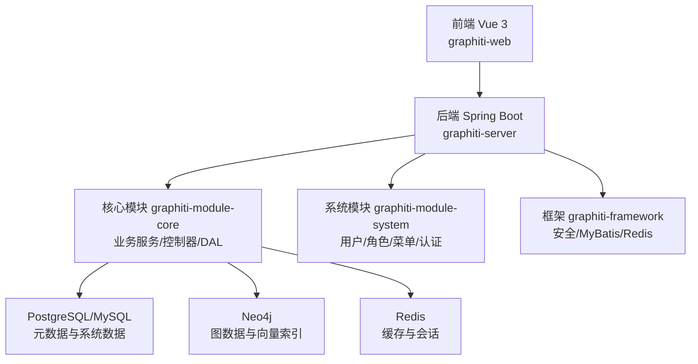
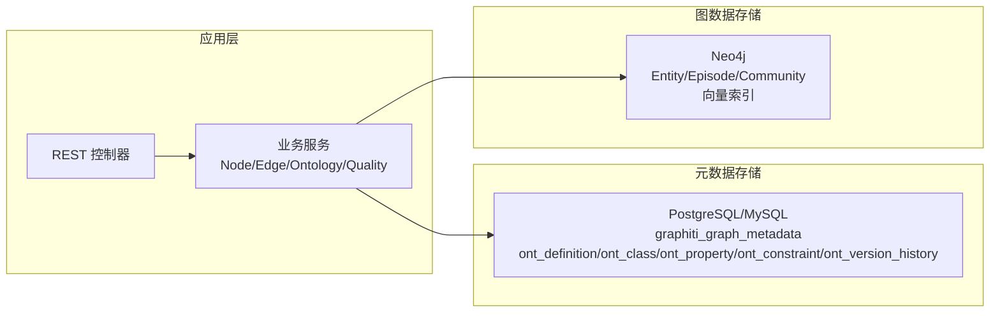
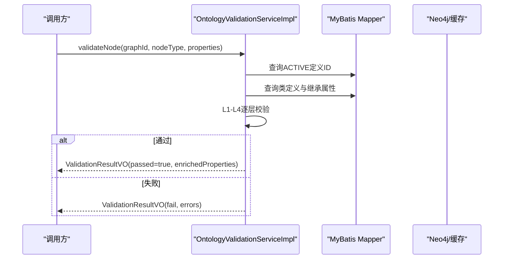
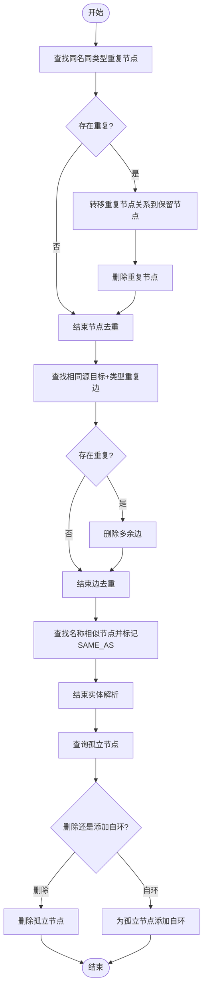
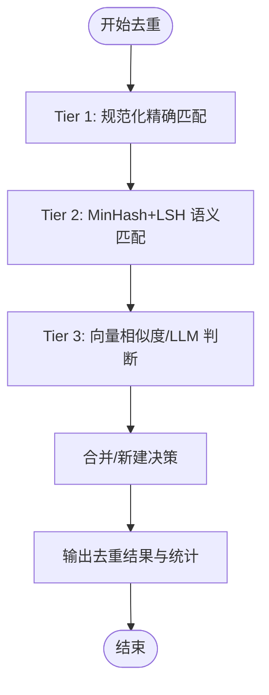
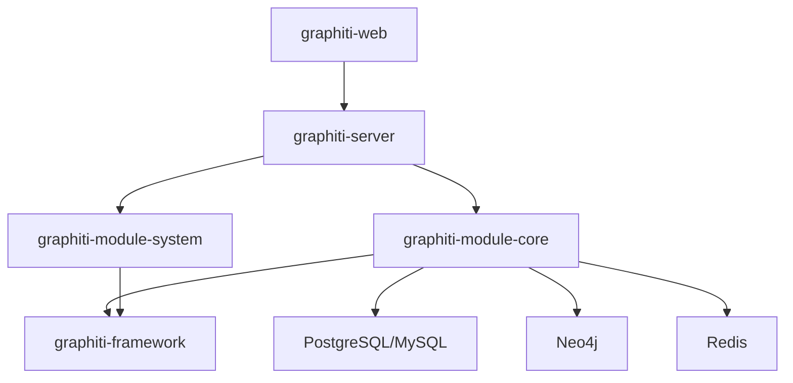

# 数据治理实践

<!--<cite>
**本文引用的文件**
- [README.md](file://README.md)
- [DESIGN.md](file://DESIGN.md)
- [docs/ontology.md](file://docs/ontology.md)
- [docs/pipeline.md](file://docs/pipeline.md)
- [docs/database-migration-guide.md](file://docs/database-migration-guide.md)
- [docs/legal-ontology-migration-guide.md](file://docs/legal-ontology-migration-guide.md)
- [graphiti-module-core/src/main/java/com/graphiti/module/graphiti/service/OntologyValidationService.java](file://graphiti-module-core/src/main/java/com/graphiti/module/graphiti/service/OntologyValidationService.java)
- [graphiti-module-core/src/main/java/com/graphiti/module/graphiti/service/impl/OntologyValidationServiceImpl.java](file://graphiti-module-core/src/main/java/com/graphiti/module/graphiti/service/impl/OntologyValidationServiceImpl.java)
- [graphiti-module-core/src/main/java/com/graphiti/module/graphiti/service/DataQualityService.java](file://graphiti-module-core/src/main/java/com/graphiti/module/graphiti/service/DataQualityService.java)
- [graphiti-module-core/src/main/java/com/graphiti/module/graphiti/service/impl/DataQualityServiceImpl.java](file://graphiti-module-core/src/main/java/com/graphiti/module/graphiti/service/impl/DataQualityServiceImpl.java)
- [graphiti-module-core/src/main/java/com/graphiti/module/graphiti/service/impl/EntityDedupServiceImpl.java](file://graphiti-module-core/src/main/java/com/graphiti/module/graphiti/service/impl/EntityDedupServiceImpl.java)
- [graphiti-module-core/src/main/java/com/graphiti/module/graphiti/service/impl/OntologySyncServiceImpl.java](file://graphiti-module-core/src/main/java/com/graphiti/module/graphiti/service/impl/OntologySyncServiceImpl.java)
- [graphiti-framework/graphiti-spring-boot-starter-security/src/main/java/com/graphiti/framework/security/config/SecurityConfig.java](file://graphiti-framework/graphiti-spring-boot-starter-security/src/main/java/com/graphiti/framework/security/config/SecurityConfig.java)
</cite>-->

## 目录
1. [简介](#简介)
2. [项目结构](#项目结构)
3. [核心组件](#核心组件)
4. [架构总览](#架构总览)
5. [详细组件分析](#详细组件分析)
6. [依赖分析](#依赖分析)
7. [性能考虑](#性能考虑)
8. [故障排查指南](#故障排查指南)
9. [结论](#结论)
10. [附录](#附录)

## 简介
本指南面向数据工程师与DBA，系统阐述Graphiti-Java在知识图谱数据治理方面的最佳实践，覆盖数据模型设计、实体分类体系、属性约束规则、本体验证机制（6层验证引擎）、数据质量评估与清洗、数据标准化与一致性、数据血缘追踪、版本管理与变更控制、数据安全与访问控制、隐私保护、备份恢复与灾难预防、数据迁移方案以及数据字典与元数据管理。文中所有技术要点均来源于仓库内的设计文档与源码实现。

## 项目结构
Graphiti-Java采用模块化分层架构，后端由Spring Boot承载，前端为Vue 3应用，核心业务位于graphiti-module-core，框架基础设施位于graphiti-framework，数据库采用Neo4j（图数据与向量索引）、PostgreSQL/MySQL（元数据与系统数据）、Redis（缓存与会话）。系统通过REST API对外提供知识图谱的创建、导入、查询、本体管理、数据质量治理等功能。

图表来源
- [README.md:71-166](file://README.md#L71-L166)

章节来源
- [README.md:19-166](file://README.md#L19-L166)

## 核心组件
- 本体验证服务：提供6层验证引擎，确保节点与边符合本体定义与约束。
- 数据质量服务：提供节点/边去重、实体解析、孤立节点处理等能力。
- 实体去重服务：基于精确匹配、语义相似（MinHash+LSH）、向量相似度与LLM的三层策略。
- 本体同步服务：将本体定义同步至Neo4j（当前为占位实现，便于后续扩展）。
- 安全配置：基于JWT的无状态认证与授权，统一异常处理返回JSON。

章节来源
- [graphiti-module-core/src/main/java/com/graphiti/module/graphiti/service/OntologyValidationService.java:8-39](file://graphiti-module-core/src/main/java/com/graphiti/module/graphiti/service/OntologyValidationService.java#L8-L39)
- [graphiti-module-core/src/main/java/com/graphiti/module/graphiti/service/DataQualityService.java:6-47](file://graphiti-module-core/src/main/java/com/graphiti/module/graphiti/service/DataQualityService.java#L6-L47)
- [graphiti-module-core/src/main/java/com/graphiti/module/graphiti/service/impl/EntityDedupServiceImpl.java:21-37](file://graphiti-module-core/src/main/java/com/graphiti/module/graphiti/service/impl/EntityDedupServiceImpl.java#L21-L37)
- [graphiti-module-core/src/main/java/com/graphiti/module/graphiti/service/impl/OntologySyncServiceImpl.java:12-32](file://graphiti-module-core/src/main/java/com/graphiti/module/graphiti/service/impl/OntologySyncServiceImpl.java#L12-L32)
- [graphiti-framework/graphiti-spring-boot-starter-security/src/main/java/com/graphiti/framework/security/config/SecurityConfig.java:28-136](file://graphiti-framework/graphiti-spring-boot-starter-security/src/main/java/com/graphiti/framework/security/config/SecurityConfig.java#L28-L136)

## 架构总览
系统采用“双存储”架构：MySQL/PostgreSQL存储图谱元数据、本体定义与版本历史；Neo4j存储图数据（节点、边、Episode）与向量索引，支撑语义检索与图遍历。graphId作为跨存储关联键，保证元数据与图数据的一致性。

图表来源
- [docs/ontology.md:3-22](file://docs/ontology.md#L3-L22)
- [docs/ontology.md:26-138](file://docs/ontology.md#L26-L138)

章节来源
- [docs/ontology.md:1-138](file://docs/ontology.md#L1-L138)

## 详细组件分析

### 本体验证机制（6层验证引擎）
- 层级说明
  - L1：类型存在性（类/边URI与本地名匹配）
  - L2：必填属性检查（isRequired=true）
  - L3：数据类型检查（rangeDataType）
  - L4：约束规则检查（CARDINALITY/PATTERN/RANGE/ENUM/NOT_NULL）
  - L5：OWL约束（预留）
  - L6：推理扩展（预留）

- 实现要点
  - 通过graphId定位ACTIVE版本的ont_definition，查询对应类/属性/约束。
  - 支持批量验证，返回通过/失败与警告信息，并可注入默认值。
  - 边类型验证采用属性定义（ont_property）进行校验，未定义边类型允许通过并给出警告，保障向后兼容。

图表来源
- [graphiti-module-core/src/main/java/com/graphiti/module/graphiti/service/impl/OntologyValidationServiceImpl.java:39-158](file://graphiti-module-core/src/main/java/com/graphiti/module/graphiti/service/impl/OntologyValidationServiceImpl.java#L39-L158)

章节来源
- [graphiti-module-core/src/main/java/com/graphiti/module/graphiti/service/OntologyValidationService.java:8-39](file://graphiti-module-core/src/main/java/com/graphiti/module/graphiti/service/OntologyValidationService.java#L8-L39)
- [graphiti-module-core/src/main/java/com/graphiti/module/graphiti/service/impl/OntologyValidationServiceImpl.java:1-345](file://graphiti-module-core/src/main/java/com/graphiti/module/graphiti/service/impl/OntologyValidationServiceImpl.java#L1-L345)

### 数据质量评估与清洗
- 节点去重：按name+type聚合，保留最新节点，转移关系后删除重复节点。
- 边去重：按源/目标+类型聚合，保留第一条边，删除其余重复边。
- 实体解析：基于CONTAINS近似相似度标记SAME_AS关系，便于后续统一。
- 孤立节点处理：查询无出入边节点，支持删除或添加自环标记。

图表来源
- [graphiti-module-core/src/main/java/com/graphiti/module/graphiti/service/impl/DataQualityServiceImpl.java:26-176](file://graphiti-module-core/src/main/java/com/graphiti/module/graphiti/service/impl/DataQualityServiceImpl.java#L26-L176)

章节来源
- [graphiti-module-core/src/main/java/com/graphiti/module/graphiti/service/DataQualityService.java:6-47](file://graphiti-module-core/src/main/java/com/graphiti/module/graphiti/service/DataQualityService.java#L6-L47)
- [graphiti-module-core/src/main/java/com/graphiti/module/graphiti/service/impl/DataQualityServiceImpl.java:1-219](file://graphiti-module-core/src/main/java/com/graphiti/module/graphiti/service/impl/DataQualityServiceImpl.java#L1-L219)

### 实体去重（三层策略）
- Tier 1：精确匹配（规范化字符串）
- Tier 2：语义匹配（MinHash+LSH，Jaccard阈值≥0.9）
- Tier 3：向量相似度（余弦相似度≥0.6）或LLM判断

图表来源
- [graphiti-module-core/src/main/java/com/graphiti/module/graphiti/service/impl/EntityDedupServiceImpl.java:54-172](file://graphiti-module-core/src/main/java/com/graphiti/module/graphiti/service/impl/EntityDedupServiceImpl.java#L54-L172)

章节来源
- [graphiti-module-core/src/main/java/com/graphiti/module/graphiti/service/impl/EntityDedupServiceImpl.java:1-398](file://graphiti-module-core/src/main/java/com/graphiti/module/graphiti/service/impl/EntityDedupServiceImpl.java#L1-L398)

### 数据标准化与数据清洗实施方法
- 标准化
  - 名称规范化：统一大小写、去除多余空白、标准化缩写。
  - 属性类型统一：按本体定义的rangeDataType进行强制转换。
  - 默认值注入：对缺省的必填属性注入默认值。
- 清洗
  - 去重：结合精确、语义与LLM三层策略。
  - 冲突消解：基于时间窗（valid_at/invalid_at）判定新旧事实，必要时更新旧记录的invalid_at。
  - 孤立节点处理：删除或标记，保持图谱完整性。

章节来源
- [graphiti-module-core/src/main/java/com/graphiti/module/graphiti/service/impl/OntologyValidationServiceImpl.java:207-343](file://graphiti-module-core/src/main/java/com/graphiti/module/graphiti/service/impl/OntologyValidationServiceImpl.java#L207-L343)
- [graphiti-module-core/src/main/java/com/graphiti/module/graphiti/service/impl/DataQualityServiceImpl.java:128-176](file://graphiti-module-core/src/main/java/com/graphiti/module/graphiti/service/impl/DataQualityServiceImpl.java#L128-L176)

### 数据血缘追踪、版本管理与变更控制
- 血缘追踪
  - Episode节点作为原始数据容器，记录来源与内容，支持溯源。
  - 关系边（RELATES_TO）携带fact描述与时间戳，便于回溯事实依据。
- 版本管理
  - ont_definition记录版本与状态（DRAFT/ACTIVE/DEPRECATED/ARCHIVED）。
  - ont_version_history记录每次变更类型、操作者与摘要。
- 变更控制
  - 通过ACTIVE版本控制生效的本体定义；变更时生成版本历史记录，便于审计与回滚。

章节来源
- [docs/ontology.md:125-138](file://docs/ontology.md#L125-L138)
- [docs/ontology.md:253-289](file://docs/ontology.md#L253-L289)

### 数据安全策略、访问控制与隐私保护
- 认证与授权
  - 基于JWT的无状态认证，全局拦截器统一处理未认证与权限不足场景。
  - 支持跨域配置，开发环境放行Swagger与认证相关路径。
- 异常处理
  - 未认证返回401 JSON，权限不足返回403 JSON，统一响应结构。
- 隐私保护
  - 建议对敏感字段进行脱敏与最小化采集；本体中可通过约束限制敏感属性的类型与取值范围。

章节来源
- [graphiti-framework/graphiti-spring-boot-starter-security/src/main/java/com/graphiti/framework/security/config/SecurityConfig.java:81-136](file://graphiti-framework/graphiti-spring-boot-starter-security/src/main/java/com/graphiti/framework/security/config/SecurityConfig.java#L81-L136)

### 数据备份恢复、灾难预防与数据迁移
- 备份与恢复
  - PostgreSQL/MySQL：使用pg_dump/mysqldump导出，恢复时重建库与用户权限。
  - Neo4j：使用apoc.dump或快照备份，配合集群/副本实现高可用。
- 灾难预防
  - 定期全备+增量备份；监控慢查询与索引失效；建立回滚方案（依赖回退）。
- 数据迁移
  - 从MySQL到PostgreSQL：推荐pgLoader；注意JSON/时间类型差异与索引优化。
  - 法律知识图谱本体迁移：按SQL脚本顺序执行，先本体定义再Neo4j示例数据。

章节来源
- [docs/database-migration-guide.md:1-218](file://docs/database-migration-guide.md#L1-L218)
- [docs/legal-ontology-migration-guide.md:78-203](file://docs/legal-ontology-migration-guide.md#L78-L203)

### 数据字典管理、元数据维护与同步
- 数据字典
  - 本体类（ont_class）、属性（ont_property）、约束（ont_constraint）构成数据字典核心。
  - 通过ont_definition管理版本与命名空间，ont_version_history记录变更轨迹。
- 元数据维护
  - graphiti_graph_metadata记录图谱统计信息（节点/边计数）与当前本体版本。
- 同步流程
  - 当前本体同步服务为占位实现，建议扩展为将本体定义映射到Neo4j约束与标签策略，实现Schema驱动的图谱约束落地。

章节来源
- [docs/ontology.md:26-138](file://docs/ontology.md#L26-L138)
- [graphiti-module-core/src/main/java/com/graphiti/module/graphiti/service/impl/OntologySyncServiceImpl.java:12-32](file://graphiti-module-core/src/main/java/com/graphiti/module/graphiti/service/impl/OntologySyncServiceImpl.java#L12-L32)

## 依赖分析
- 模块耦合
  - graphiti-module-core为业务中心，依赖graphiti-framework提供的安全、MyBatis、Redis等基础能力。
  - 与graphiti-module-system模块分离，避免业务与系统管理耦合。
- 外部依赖
  - Neo4j Java Driver、MyBatis-Plus、Spring Security、Redisson、OpenAPI/Swagger等。
- 本体验证与数据质量服务依赖MySQL元数据表，Neo4j用于图数据写入与查询。

图表来源
- [README.md:110-166](file://README.md#L110-L166)

章节来源
- [README.md:170-218](file://README.md#L170-L218)

## 性能考虑
- 查询性能
  - Neo4j：启用向量索引（cosine相似度）、全文索引（Entity.name、RELATES_TO.fact）、复合索引（groupId+type、groupId+validAt）。
  - PostgreSQL：为常用查询字段（如graph_id、name）建立索引，合理配置连接池参数。
- 写入性能
  - 批量导入：使用事务批量写入，减少往返开销；实体/边嵌入采用批量生成。
- 搜索性能
  - 混合检索（BM25+向量+BFS）+RRF融合+MMR重排，平衡召回与多样性。

章节来源
- [docs/ontology.md:345-356](file://docs/ontology.md#L345-L356)
- [README.md:27-58](file://README.md#L27-L58)

## 故障排查指南
- 本体验证失败
  - 检查graphId是否关联ACTIVE版本；确认类/属性URI与本地名；核对必填属性与类型；查看约束值格式（正则、范围、枚举）。
- 数据质量任务异常
  - 节点/边去重：确认group_id与uuid唯一性；检查关系转移逻辑；关注Neo4j Cypher执行权限。
  - 孤立节点：确认查询条件与标签；选择删除或自环策略。
- 安全与鉴权
  - 401：检查JWT是否过期或签名错误；确认请求头Authorization格式。
  - 403：检查用户角色与资源权限；确认访问路径是否受保护。
- 迁移与兼容
  - MySQL→PostgreSQL：关注JSONB、时间类型、索引语法差异；使用pgLoader或手动转换。
  - 法律本体：按顺序执行V5/V6/V7脚本，核对约束与示例数据。

章节来源
- [graphiti-module-core/src/main/java/com/graphiti/module/graphiti/service/impl/OntologyValidationServiceImpl.java:34-158](file://graphiti-module-core/src/main/java/com/graphiti/module/graphiti/service/impl/OntologyValidationServiceImpl.java#L34-L158)
- [graphiti-module-core/src/main/java/com/graphiti/module/graphiti/service/impl/DataQualityServiceImpl.java:26-176](file://graphiti-module-core/src/main/java/com/graphiti/module/graphiti/service/impl/DataQualityServiceImpl.java#L26-L176)
- [graphiti-framework/graphiti-spring-boot-starter-security/src/main/java/com/graphiti/framework/security/config/SecurityConfig.java:81-136](file://graphiti-framework/graphiti-spring-boot-starter-security/src/main/java/com/graphiti/framework/security/config/SecurityConfig.java#L81-L136)
- [docs/database-migration-guide.md:139-218](file://docs/database-migration-guide.md#L139-L218)
- [docs/legal-ontology-migration-guide.md:78-203](file://docs/legal-ontology-migration-guide.md#L78-L203)

## 结论
Graphiti-Java通过“双存储架构+6层本体验证+三层实体去重+数据质量治理”的组合拳，实现了从数据模型设计、本体约束、数据清洗到版本管理与安全访问的全链路数据治理闭环。建议在生产环境中结合实际业务持续完善本体定义、优化索引与查询策略、强化监控与告警，并严格执行变更流程与备份演练，确保知识图谱的高质量与高可用。

## 附录
- 快速参考
  - 本体验证接口：validateNode/validateEdge/validateBatch
  - 数据质量接口：deduplicateNodes/deduplicateEdges/resolveEntities/findOrphanNodes/fixOrphanNodes
  - 实体去重接口：deduplicate/exactMatch/semanticMatch/llmDedup
  - 安全配置：JWT过滤器、CORS、401/403统一异常处理

章节来源
- [graphiti-module-core/src/main/java/com/graphiti/module/graphiti/service/OntologyValidationService.java:18-39](file://graphiti-module-core/src/main/java/com/graphiti/module/graphiti/service/OntologyValidationService.java#L18-L39)
- [graphiti-module-core/src/main/java/com/graphiti/module/graphiti/service/DataQualityService.java:10-47](file://graphiti-module-core/src/main/java/com/graphiti/module/graphiti/service/DataQualityService.java#L10-L47)
- [graphiti-module-core/src/main/java/com/graphiti/module/graphiti/service/impl/EntityDedupServiceImpl.java:41-312](file://graphiti-module-core/src/main/java/com/graphiti/module/graphiti/service/impl/EntityDedupServiceImpl.java#L41-L312)
- [graphiti-framework/graphiti-spring-boot-starter-security/src/main/java/com/graphiti/framework/security/config/SecurityConfig.java:28-136](file://graphiti-framework/graphiti-spring-boot-starter-security/src/main/java/com/graphiti/framework/security/config/SecurityConfig.java#L28-L136)