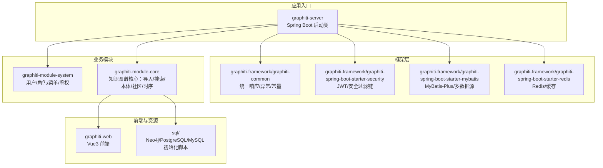
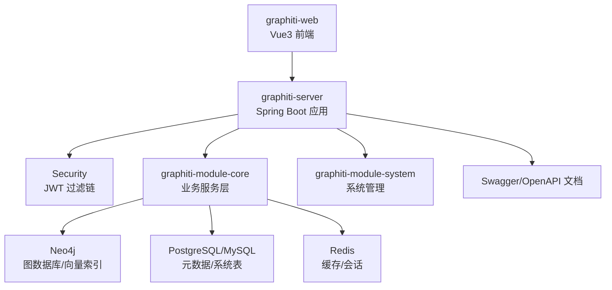
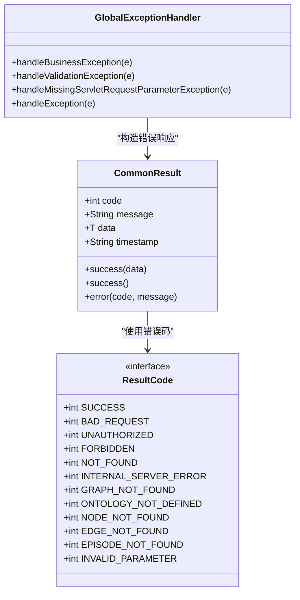
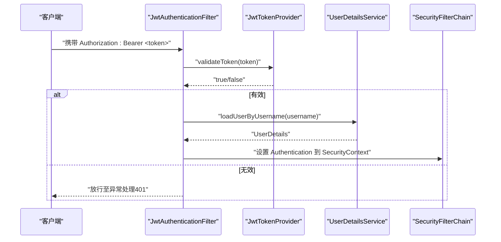
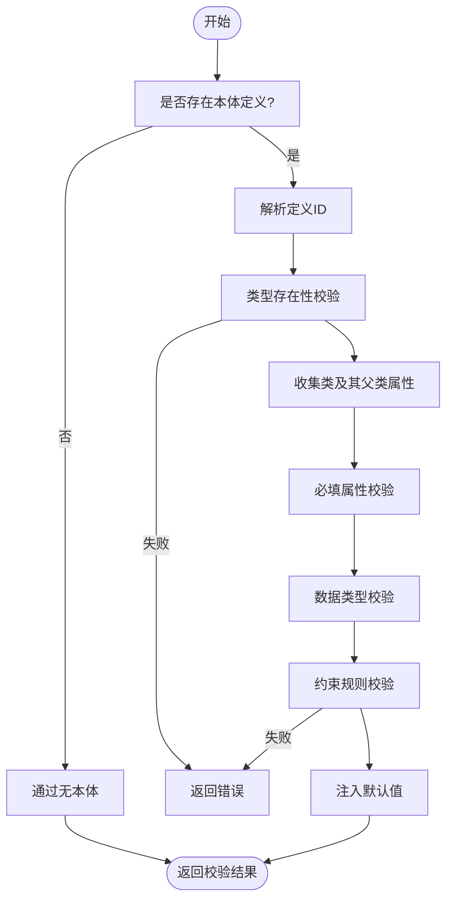
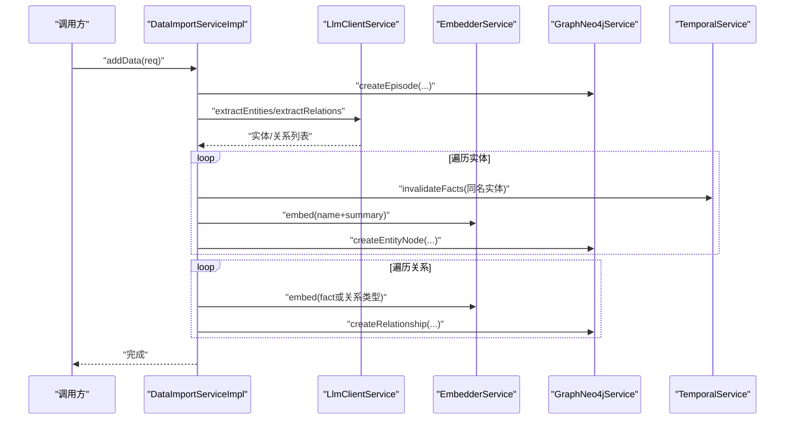
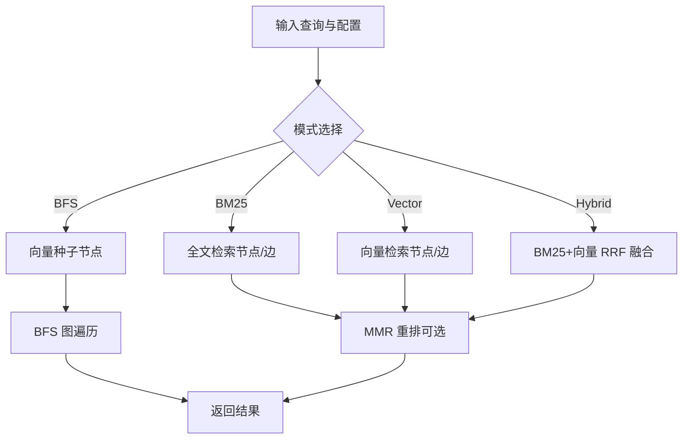
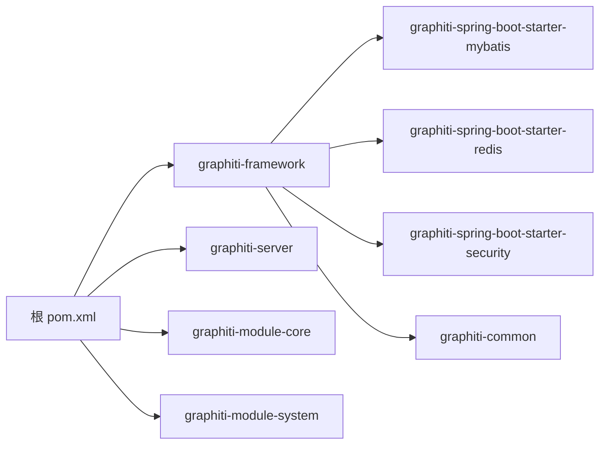

# 最佳实践

<!--<cite>
**本文引用的文件**
- [README.md](file://README.md)
- [DESIGN.md](file://DESIGN.md)
- [pom.xml](file://pom.xml)
- [GraphitiApplication.java](file://graphiti-server/src/main/java/com/Graphiti/GraphitiApplication.java)
- [ResultCode.java](file://graphiti-framework/graphiti-common/src/main/java/com/Graphiti/common/constants/ResultCode.java)
- [CommonResult.java](file://graphiti-framework/graphiti-common/src/main/java/com/Graphiti/common/response/CommonResult.java)
- [GlobalExceptionHandler.java](file://graphiti-framework/graphiti-common/src/main/java/com/Graphiti/common/exception/GlobalExceptionHandler.java)
- [SecurityConfig.java](file://graphiti-framework/graphiti-spring-boot-starter-security/src/main/java/com/Graphiti/framework/security/config/SecurityConfig.java)
- [JwtAuthenticationFilter.java](file://graphiti-framework/graphiti-spring-boot-starter-security/src/main/java/com/Graphiti/framework/security/jwt/JwtAuthenticationFilter.java)
- [OntologyValidationServiceImpl.java](file://graphiti-module-core/src/main/java/com/Graphiti/module/graphiti/service/impl/OntologyValidationServiceImpl.java)
- [DataImportServiceImpl.java](file://graphiti-module-core/src/main/java/com/Graphiti/module/graphiti/service/impl/DataImportServiceImpl.java)
- [SearchServiceImpl.java](file://graphiti-module-core/src/main/java/com/Graphiti/module/graphiti/service/impl/SearchServiceImpl.java)
- [GraphitiController.java](file://graphiti-module-core/src/main/java/com/Graphiti/module/graphiti/controller/admin/GraphitiController.java)
- [graphiti-spring-boot-starter-mybatis/pom.xml](file://graphiti-framework/graphiti-spring-boot-starter-mybatis/pom.xml)
- [graphiti-spring-boot-starter-redis/pom.xml](file://graphiti-framework/graphiti-spring-boot-starter-redis/pom.xml)
</cite>-->

## 目录
1. [引言](#引言)
2. [项目结构](#项目结构)
3. [核心组件](#核心组件)
4. [架构总览](#架构总览)
5. [详细组件分析](#详细组件分析)
6. [依赖分析](#依赖分析)
7. [性能考虑](#性能考虑)
8. [故障排查指南](#故障排查指南)
9. [结论](#结论)
10. [附录](#附录)

## 引言
本指南面向项目经理、架构师与高级开发者，系统总结Graphiti-Java在知识图谱建模、数据治理、本体设计、大规模部署、高并发与一致性保障、团队协作与文档维护、安全与隐私合规等方面的最佳实践。文档以仓库现有实现为依据，结合模块化架构与关键组件，提供可落地的工程化建议。

## 项目结构
Graphiti-Java采用多模块聚合结构，核心由“框架层”“业务模块”“服务入口”组成，并配套前端与数据库初始化脚本。模块职责清晰，便于独立演进与测试。

图表来源
- [pom.xml:15-20](file://pom.xml#L15-L20)
- [GraphitiApplication.java:18-34](file://graphiti-server/src/main/java/com/Graphiti/GraphitiApplication.java#L18-L34)
- [graphiti-spring-boot-starter-mybatis/pom.xml:19-41](file://graphiti-framework/graphiti-spring-boot-starter-mybatis/pom.xml#L19-L41)
- [graphiti-spring-boot-starter-redis/pom.xml:19-37](file://graphiti-framework/graphiti-spring-boot-starter-redis/pom.xml#L19-L37)

章节来源
- [README.md:110-166](file://README.md#L110-L166)
- [pom.xml:15-20](file://pom.xml#L15-L20)

## 核心组件
- 统一响应与异常
  - 统一响应体与错误码常量，确保前后端一致的契约。
  - 全局异常处理器集中处理业务异常、参数校验与通用异常。
- 安全与鉴权
  - 基于JWT的无状态认证，全局过滤器提取令牌并注入认证上下文；安全配置开放必要路径并拒绝未认证/权限不足场景。
- 本体验证引擎
  - 6层验证：类型存在性、必填属性、数据类型、约束、默认值注入与批处理校验。
- 数据导入与抽取
  - 自动化LLM实体/关系抽取、时序失效控制、向量嵌入生成与Neo4j写入。
- 混合检索
  - BM25全文、向量相似、BFS图遍历融合，RRF融合与MMR重排，支持对话记忆检索。

章节来源
- [CommonResult.java:14-67](file://graphiti-framework/graphiti-common/src/main/java/com/Graphiti/common/response/CommonResult.java#L14-L67)
- [ResultCode.java:7-22](file://graphiti-framework/graphiti-common/src/main/java/com/Graphiti/common/constants/ResultCode.java#L7-L22)
- [GlobalExceptionHandler.java:17-73](file://graphiti-framework/graphiti-common/src/main/java/com/Graphiti/common/exception/GlobalExceptionHandler.java#L17-L73)
- [SecurityConfig.java:32-137](file://graphiti-framework/graphiti-spring-boot-starter-security/src/main/java/com/Graphiti/framework/security/config/SecurityConfig.java#L32-L137)
- [JwtAuthenticationFilter.java:23-60](file://graphiti-framework/graphiti-spring-boot-starter-security/src/main/java/com/Graphiti/framework/security/jwt/JwtAuthenticationFilter.java#L23-L60)
- [OntologyValidationServiceImpl.java:26-344](file://graphiti-module-core/src/main/java/com/Graphiti/module/graphiti/service/impl/OntologyValidationServiceImpl.java#L26-L344)
- [DataImportServiceImpl.java:27-126](file://graphiti-module-core/src/main/java/com/Graphiti/module/graphiti/service/impl/DataImportServiceImpl.java#L27-L126)
- [SearchServiceImpl.java:21-148](file://graphiti-module-core/src/main/java/com/Graphiti/module/graphiti/service/impl/SearchServiceImpl.java#L21-L148)

## 架构总览
系统采用“前后端分离 + 多数据库 + LLM插件化”的架构。后端以Spring Boot为核心，Neo4j承载图数据与向量索引，PostgreSQL/MySQL存储元数据与系统表，Redis提供缓存与会话。前端Vue3通过REST API与后端交互，Swagger提供在线文档。

图表来源
- [README.md:71-108](file://README.md#L71-L108)
- [README.md:170-218](file://README.md#L170-L218)
- [GraphitiApplication.java:18-34](file://graphiti-server/src/main/java/com/Graphiti/GraphitiApplication.java#L18-L34)

## 详细组件分析

### 统一响应与异常处理
- 设计要点
  - 统一响应体封装code/message/data/timestamp，便于前端统一处理。
  - 错误码覆盖业务错误与HTTP语义错误，便于监控与定位。
  - 全局异常处理器对业务异常、参数校验缺失与未知异常进行分类处理。
- 实践建议
  - 新增接口必须返回统一响应体，避免直接抛出原始异常。
  - 业务异常需定义明确的错误码与提示，便于前端展示与日志追踪。
  - 参数校验异常统一收集字段级错误，提升调试效率。

图表来源
- [CommonResult.java:14-67](file://graphiti-framework/graphiti-common/src/main/java/com/Graphiti/common/response/CommonResult.java#L14-L67)
- [ResultCode.java:7-22](file://graphiti-framework/graphiti-common/src/main/java/com/Graphiti/common/constants/ResultCode.java#L7-L22)
- [GlobalExceptionHandler.java:17-73](file://graphiti-framework/graphiti-common/src/main/java/com/Graphiti/common/exception/GlobalExceptionHandler.java#L17-L73)

章节来源
- [CommonResult.java:14-67](file://graphiti-framework/graphiti-common/src/main/java/com/Graphiti/common/response/CommonResult.java#L14-L67)
- [ResultCode.java:7-22](file://graphiti-framework/graphiti-common/src/main/java/com/Graphiti/common/constants/ResultCode.java#L7-L22)
- [GlobalExceptionHandler.java:17-73](file://graphiti-framework/graphiti-common/src/main/java/com/Graphiti/common/exception/GlobalExceptionHandler.java#L17-L73)

### 安全与鉴权（JWT）
- 设计要点
  - 无状态会话：基于JWT令牌，禁用服务器端会话。
  - 全局过滤器从Authorization头提取Bearer令牌，验证后注入认证上下文。
  - 安全配置开放公开路径（如Swagger、登录），其余请求均需认证。
- 实践建议
  - 生产环境务必启用HTTPS与安全CORS配置。
  - 令牌过期与刷新策略需与前端配合，避免长时间无操作中断。
  - 对敏感接口增加细粒度RBAC校验。

图表来源
- [JwtAuthenticationFilter.java:23-60](file://graphiti-framework/graphiti-spring-boot-starter-security/src/main/java/com/Graphiti/framework/security/jwt/JwtAuthenticationFilter.java#L23-L60)
- [SecurityConfig.java:84-136](file://graphiti-framework/graphiti-spring-boot-starter-security/src/main/java/com/Graphiti/framework/security/config/SecurityConfig.java#L84-L136)

章节来源
- [SecurityConfig.java:32-137](file://graphiti-framework/graphiti-spring-boot-starter-security/src/main/java/com/Graphiti/framework/security/config/SecurityConfig.java#L32-L137)
- [JwtAuthenticationFilter.java:23-60](file://graphiti-framework/graphiti-spring-boot-starter-security/src/main/java/com/Graphiti/framework/security/jwt/JwtAuthenticationFilter.java#L23-L60)

### 本体验证引擎（6层验证）
- 设计要点
  - 类型存在性：节点类型需在本体中定义。
  - 必填属性：检查required标记的属性是否缺失。
  - 数据类型：对字符串/整数/浮点/布尔/日期/JSON等进行严格校验。
  - 约束规则：支持正则、数值范围、枚举等约束表达。
  - 默认值注入：对缺省属性注入解析后的默认值。
  - 批处理校验：支持节点/边批量校验并汇总结果。
- 实践建议
  - 本体定义应与业务域强绑定，避免过度抽象导致验证复杂度上升。
  - 约束表达尽量简洁，避免在运行期做昂贵的跨属性/跨实体校验。
  - 对边类型未定义的情况允许通过但给出警告，保持向前兼容。

图表来源
- [OntologyValidationServiceImpl.java:39-158](file://graphiti-module-core/src/main/java/com/Graphiti/module/graphiti/service/impl/OntologyValidationServiceImpl.java#L39-L158)

章节来源
- [OntologyValidationServiceImpl.java:26-344](file://graphiti-module-core/src/main/java/com/Graphiti/module/graphiti/service/impl/OntologyValidationServiceImpl.java#L26-L344)

### 数据导入与抽取流程
- 设计要点
  - 自动创建Episode作为时序单元，支持多轮对话合并。
  - LLM抽取实体与关系，生成节点与边，同时生成向量嵌入。
  - 时序管理：同名实体在新Episode中失效旧事实，避免重复。
  - 支持批量导入与消息流导入。
- 实践建议
  - 对大文本分段处理，避免LLM上下文溢出。
  - 导入前先进行本体验证，减少写入失败重试。
  - 批量导入建议异步化并引入幂等与去重策略。

图表来源
- [DataImportServiceImpl.java:35-109](file://graphiti-module-core/src/main/java/com/Graphiti/module/graphiti/service/impl/DataImportServiceImpl.java#L35-L109)

章节来源
- [DataImportServiceImpl.java:27-196](file://graphiti-module-core/src/main/java/com/Graphiti/module/graphiti/service/impl/DataImportServiceImpl.java#L27-L196)

### 混合检索与记忆检索
- 设计要点
  - 支持BM25、向量、BFS三种模式，混合模式采用RRF融合与MMR重排。
  - 对话记忆检索：抽取最后一条非system消息，组合相关知识作为上下文。
- 实践建议
  - 根据场景选择合适的模式：BM25适合关键词检索，向量适合语义近似，BFS适合探索邻域。
  - RRF融合参数与MMR重排参数需结合业务调优，避免过度稀释或过度集中。

图表来源
- [SearchServiceImpl.java:94-148](file://graphiti-module-core/src/main/java/com/Graphiti/module/graphiti/service/impl/SearchServiceImpl.java#L94-L148)

章节来源
- [SearchServiceImpl.java:21-200](file://graphiti-module-core/src/main/java/com/Graphiti/module/graphiti/service/impl/SearchServiceImpl.java#L21-L200)

### 控制器与API组织
- 设计要点
  - 控制器按功能域划分（图谱、节点、边、本体、搜索、数据导入等），统一使用Swagger注解。
  - 使用统一响应包装，便于前端消费。
- 实践建议
  - 接口命名与路径遵循REST规范，避免歧义。
  - 对复杂查询参数使用VO封装，增强可读性与可维护性。

章节来源
- [GraphitiController.java:37-234](file://graphiti-module-core/src/main/java/com/Graphiti/module/graphiti/controller/admin/GraphitiController.java#L37-L234)

## 依赖分析
- 版本与技术栈
  - 后端：Java 21、Spring Boot 3.5.5、Spring AI 1.1.2、MyBatis-Plus 3.5.12、Neo4j驱动5.26、Redisson 3.37、Hutool 5.8.37、SpringDoc 2.8.5。
  - 前端：Vue 3、Vite、Ant Design Vue、Pinia、Axios、ECharts。
  - 数据库：Neo4j（图）、PostgreSQL/MySQL（元数据）、Redis（缓存）。
- 依赖管理
  - 通过Maven聚合管理各模块版本，统一BOM与starter，降低冲突风险。
  - MyBatis与Redis分别封装为starter，便于复用与替换。

图表来源
- [pom.xml:15-20](file://pom.xml#L15-L20)
- [graphiti-spring-boot-starter-mybatis/pom.xml:19-41](file://graphiti-framework/graphiti-spring-boot-starter-mybatis/pom.xml#L19-L41)
- [graphiti-spring-boot-starter-redis/pom.xml:19-37](file://graphiti-framework/graphiti-spring-boot-starter-redis/pom.xml#L19-L37)

章节来源
- [pom.xml:22-43](file://pom.xml#L22-L43)
- [graphiti-spring-boot-starter-mybatis/pom.xml:19-41](file://graphiti-framework/graphiti-spring-boot-starter-mybatis/pom.xml#L19-L41)
- [graphiti-spring-boot-starter-redis/pom.xml:19-37](file://graphiti-framework/graphiti-spring-boot-starter-redis/pom.xml#L19-L37)

## 性能考虑
- 检索性能
  - 向量索引：Neo4j 5.x向量索引用于相似度检索，需在初始化脚本中创建。
  - RRF融合与MMR重排参数需结合数据规模与召回目标调优。
- 写入性能
  - 导入流程中批量创建节点/边，建议分批提交并开启事务边界控制。
  - 向量嵌入生成可并发化，注意LLM限流与超时控制。
- 存储与缓存
  - Redis用于会话与热点数据缓存，需设置合理的TTL与淘汰策略。
  - 元数据与系统表使用MyBatis-Plus，合理使用分页与索引。
- 并发与一致性
  - 无状态JWT与Redis缓存适合高并发场景；写入侧通过事务与幂等键保障一致性。
  - 时序管理通过valid_at/invalid_at自动失效旧事实，避免脏写。

章节来源
- [README.md:477-491](file://README.md#L477-L491)
- [DataImportServiceImpl.java:35-109](file://graphiti-module-core/src/main/java/com/Graphiti/module/graphiti/service/impl/DataImportServiceImpl.java#L35-L109)
- [SearchServiceImpl.java:94-148](file://graphiti-module-core/src/main/java/com/Graphiti/module/graphiti/service/impl/SearchServiceImpl.java#L94-L148)

## 故障排查指南
- 统一响应与错误码
  - 使用统一响应体，便于前端与监控系统识别错误类型。
  - 错误码覆盖常见业务与HTTP语义，快速定位问题。
- 全局异常处理
  - 业务异常：返回自定义错误码与消息。
  - 参数校验异常：收集字段级错误，提升可诊断性。
  - 未知异常：记录堆栈并返回通用500。
- 安全相关
  - 401未认证：检查Authorization头与令牌有效性。
  - 403权限不足：检查用户角色与接口权限。
- 本体验证
  - 类型未定义：确认本体定义是否激活且URI/localName匹配。
  - 约束不满足：核对正则/范围/枚举配置与实际值。
- 导入与检索
  - LLM抽取为空：检查提示词模板与模型配置。
  - 向量检索无结果：确认向量维度与相似函数配置一致。

章节来源
- [CommonResult.java:14-67](file://graphiti-framework/graphiti-common/src/main/java/com/Graphiti/common/response/CommonResult.java#L14-L67)
- [GlobalExceptionHandler.java:17-73](file://graphiti-framework/graphiti-common/src/main/java/com/Graphiti/common/exception/GlobalExceptionHandler.java#L17-L73)
- [SecurityConfig.java:84-136](file://graphiti-framework/graphiti-spring-boot-starter-security/src/main/java/com/Graphiti/framework/security/config/SecurityConfig.java#L84-L136)
- [OntologyValidationServiceImpl.java:34-158](file://graphiti-module-core/src/main/java/com/Graphiti/module/graphiti/service/impl/OntologyValidationServiceImpl.java#L34-L158)
- [DataImportServiceImpl.java:35-109](file://graphiti-module-core/src/main/java/com/Graphiti/module/graphiti/service/impl/DataImportServiceImpl.java#L35-L109)
- [SearchServiceImpl.java:94-148](file://graphiti-module-core/src/main/java/com/Graphiti/module/graphiti/service/impl/SearchServiceImpl.java#L94-L148)

## 结论
Graphiti-Java以模块化架构与清晰的分层设计，提供了从本体建模到数据导入、从混合检索到时序管理的完整能力。通过统一响应、全局异常、JWT鉴权与多数据库支撑，项目具备良好的工程化基础。建议在后续迭代中持续完善本体约束表达、优化导入与检索参数、强化可观测性与安全基线，以支撑更大规模的知识图谱应用。

## 附录
- 快速启动与配置参考
  - 后端：Spring Boot启动类位于graphiti-server，配置文件位于application-dev.yml。
  - 前端：Vue3项目位于graphiti-web，使用Vite构建。
  - 数据库：Neo4j/PostgreSQL/MySQL初始化脚本位于sql目录。
- 开发与贡献
  - 遵循Java 21规范、Lombok与Javadoc约定，提交信息采用约定格式。

章节来源
- [README.md:221-312](file://README.md#L221-L312)
- [GraphitiApplication.java:18-34](file://graphiti-server/src/main/java/com/Graphiti/GraphitiApplication.java#L18-L34)