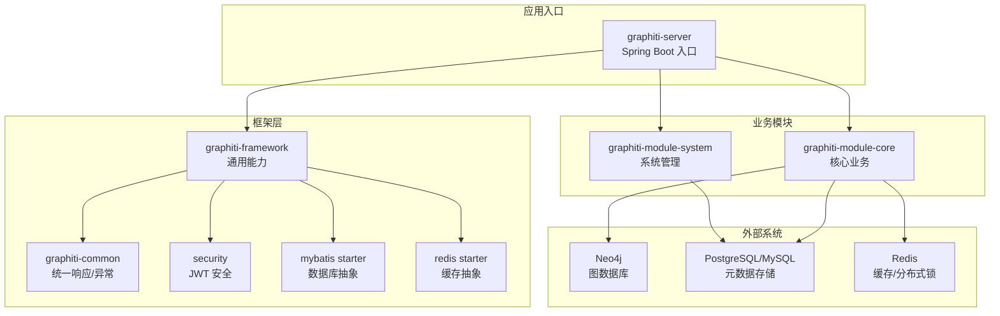
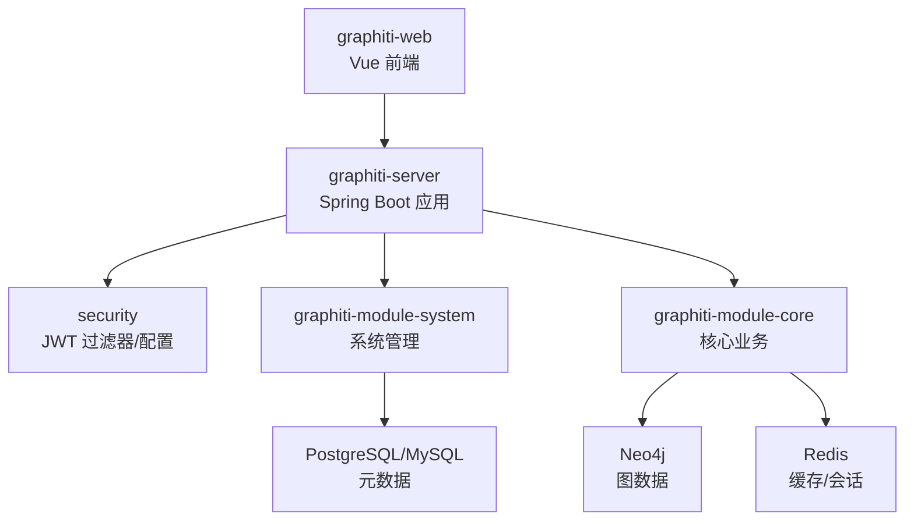
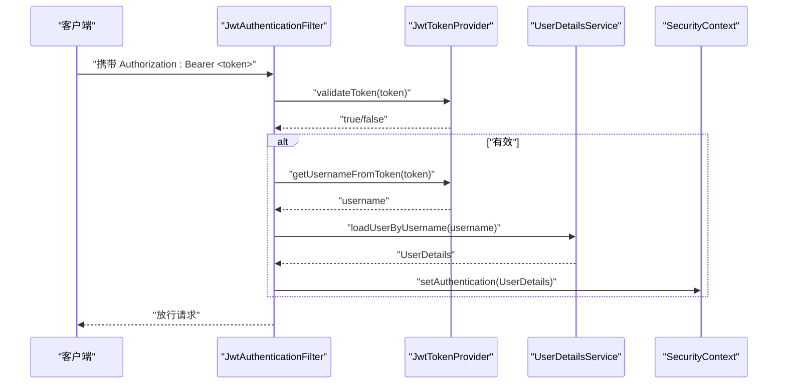
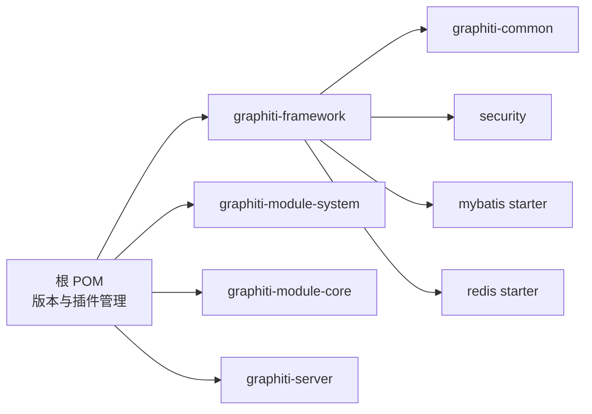

# 架构设计实践

<!--<cite>
**本文引用的文件**
- [README.md](file://README.md)
- [DESIGN.md](file://DESIGN.md)
- [pom.xml](file://pom.xml)
- [GraphitiApplication.java](file://graphiti-server/src/main/java/com/raphiti/GraphitiApplication.java)
- [SecurityConfig.java](file://graphiti-framework/graphiti-spring-boot-starter-security/src/main/java/com/raphiti/framework/security/config/SecurityConfig.java)
- [JwtAuthenticationFilter.java](file://graphiti-framework/graphiti-spring-boot-starter-security/src/main/java/com/raphiti/framework/security/jwt/JwtAuthenticationFilter.java)
- [JwtTokenProvider.java](file://graphiti-framework/graphiti-spring-boot-starter-security/src/main/java/com/raphiti/framework/security/jwt/JwtTokenProvider.java)
- [AuthController.java](file://graphiti-module-system/src/main/java/com/raphiti/system/controller/AuthController.java)
- [GlobalExceptionHandler.java](file://graphiti-framework/graphiti-common/src/main/java/com/raphiti/common/exception/GlobalExceptionHandler.java)
- [CommonResult.java](file://graphiti-framework/graphiti-common/src/main/java/com/raphiti/common/response/CommonResult.java)
- [GraphitiServiceImpl.java](file://graphiti-module-core/src/main/java/com/raphiti/module/graphiti/service/impl/GraphitiServiceImpl.java)
- [SearchServiceImpl.java](file://graphiti-module-core/src/main/java/com/raphiti/module/graphiti/service/impl/SearchServiceImpl.java)
- [DataImportServiceImpl.java](file://graphiti-module-core/src/main/java/com/raphiti/module/graphiti/service/impl/DataImportServiceImpl.java)
- [graphiti-spring-boot-starter-mybatis/pom.xml](file://graphiti-framework/graphiti-spring-boot-starter-mybatis/pom.xml)
- [graphiti-spring-boot-starter-redis/pom.xml](file://graphiti-framework/graphiti-spring-boot-starter-redis/pom.xml)
</cite>-->

## 目录
1. [引言](#引言)
2. [项目结构](#项目结构)
3. [核心组件](#核心组件)
4. [架构总览](#架构总览)
5. [详细组件分析](#详细组件分析)
6. [依赖分析](#依赖分析)
7. [性能考量](#性能考量)
8. [故障排查指南](#故障排查指南)
9. [结论](#结论)
10. [附录](#附录)

## 引言
本指南面向架构师与高级开发者，围绕 Graphiti-Java 的分层架构、模块化组织、依赖注入与安全体系（JWT）、微服务拆分与 API 网关、缓存与异步、数据库连接池与事务、监控与日志、以及容器化与 CI/CD 等主题，提供可落地的设计实践与最佳实践建议。文档以仓库现有实现为依据，结合高层设计原则，给出可操作的改进方向与注意事项。

## 项目结构
Graphiti-Java 采用多模块聚合工程，核心模块包括：
- graphiti-server：Spring Boot 应用入口，负责应用装配与运行
- graphiti-framework：基础设施与通用能力封装（安全、MyBatis、Redis）
- graphiti-module-system：系统管理模块（用户、角色、菜单、认证）
- graphiti-module-core：核心业务模块（知识图谱、搜索、导入、时间序列、本体）

图表来源
- [README.md](file://README.md)
- [pom.xml](file://pom.xml)
- [GraphitiApplication.java](file://graphiti-server/src/main/java/com/raphiti/GraphitiApplication.java)

章节来源
- [README.md](file://README.md)
- [pom.xml](file://pom.xml)

## 核心组件
- 统一响应与异常处理：通过 CommonResult 与 GlobalExceptionHandler 提供一致的错误与返回格式，便于前端与监控系统消费。
- 安全与认证：基于 Spring Security + JWT，提供无状态认证、跨域、未认证/权限不足统一处理。
- 业务服务：GraphitiServiceImpl、SearchServiceImpl、DataImportServiceImpl 等，分别覆盖图谱生命周期、混合检索、LLM 驱动的数据导入。
- 数据访问：MyBatis-Plus + 动态数据源 + Druid 连接池；Neo4j Java Driver 用于图数据读写。
- 缓存与分布式能力：Redisson 提供缓存与分布式锁等能力。

章节来源
- [CommonResult.java](file://graphiti-framework/graphiti-common/src/main/java/com/raphiti/common/response/CommonResult.java)
- [GlobalExceptionHandler.java](file://graphiti-framework/graphiti-common/src/main/java/com/raphiti/common/exception/GlobalExceptionHandler.java)
- [SecurityConfig.java](file://graphiti-framework/graphiti-spring-boot-starter-security/src/main/java/com/raphiti/framework/security/config/SecurityConfig.java)
- [JwtTokenProvider.java](file://graphiti-framework/graphiti-spring-boot-starter-security/src/main/java/com/raphiti/framework/security/jwt/JwtTokenProvider.java)
- [JwtAuthenticationFilter.java](file://graphiti-framework/graphiti-spring-boot-starter-security/src/main/java/com/raphiti/framework/security/jwt/JwtAuthenticationFilter.java)
- [GraphitiServiceImpl.java](file://graphiti-module-core/src/main/java/com/raphiti/module/graphiti/service/impl/GraphitiServiceImpl.java)
- [SearchServiceImpl.java](file://graphiti-module-core/src/main/java/com/raphiti/module/graphiti/service/impl/SearchServiceImpl.java)
- [DataImportServiceImpl.java](file://graphiti-module-core/src/main/java/com/raphiti/module/graphiti/service/impl/DataImportServiceImpl.java)

## 架构总览
整体采用“前后端分离 + 多模块后端”的架构：
- 前端：Vue 3 + Vite + Ant Design Vue
- 后端：Spring Boot 3.5.5，模块化组织，框架层提供安全、数据访问、缓存等通用能力
- 存储：Neo4j（图数据）、PostgreSQL/MySQL（元数据）、Redis（缓存/会话）

图表来源
- [README.md](file://README.md)
- [GraphitiApplication.java](file://graphiti-server/src/main/java/com/raphiti/GraphitiApplication.java)

## 详细组件分析

### 分层架构与模块化组织
- 表现层：REST 控制器位于各模块的 controller 包内，统一返回 CommonResult，异常由全局处理器捕获并格式化。
- 业务层：Service 接口与实现分离，核心业务集中在 graphiti-module-core，系统管理集中在 graphiti-module-system。
- 数据访问层：MyBatis-Plus Mapper + 动态数据源，Neo4j 通过 GraphNeo4jService 封装。
- 框架层：graphiti-framework 提供安全、MyBatis、Redis 等通用能力，graphiti-common 提供统一响应与异常。

最佳实践建议
- 保持接口与实现分离，避免跨模块直接依赖具体实现。
- 通过 VO/DTO 明确接口契约，避免领域对象泄露到表现层。
- 对外暴露的 API 使用统一响应包装，便于监控与前端处理。

章节来源
- [README.md](file://README.md)
- [CommonResult.java](file://graphiti-framework/graphiti-common/src/main/java/com/raphiti/common/response/CommonResult.java)
- [GlobalExceptionHandler.java](file://graphiti-framework/graphiti-common/src/main/java/com/raphiti/common/exception/GlobalExceptionHandler.java)

### 依赖注入与装配
- Spring Boot 自动装配：graphiti-server 作为入口，排除不必要的 AI 自动配置，按需启用所需 LLM。
- 安全装配：SecurityConfig 定义无状态会话、CORS、未认证/权限不足处理，并注册 JWT 过滤器。
- 模块装配：各模块通过 Maven 聚合，框架模块被业务模块依赖，形成清晰的依赖方向。

最佳实践建议
- 显式声明自动配置排除，减少启动开销与潜在冲突。
- 将第三方 SDK 初始化放入 Starter 或配置类，集中管理。
- 使用 @RequiredArgsConstructor + Lombok 注解减少样板代码。

章节来源
- [GraphitiApplication.java](file://graphiti-server/src/main/java/com/raphiti/GraphitiApplication.java)
- [SecurityConfig.java](file://graphiti-framework/graphiti-spring-boot-starter-security/src/main/java/com/raphiti/framework/security/config/SecurityConfig.java)

### JWT 认证机制与会话管理
- 认证流程：客户端携带 Authorization: Bearer <token> 请求，JwtAuthenticationFilter 从请求头提取并验证 Token，成功则设置 SecurityContext。
- Token 生成与校验：JwtTokenProvider 使用对称密钥（HMAC）生成与解析，支持自定义过期时间。
- 异常处理：未认证返回 401 JSON，权限不足返回 403 JSON，统一由 SecurityConfig 的 EntryPoint 与 AccessDeniedHandler 处理。

图表来源
- [JwtAuthenticationFilter.java](file://graphiti-framework/graphiti-spring-boot-starter-security/src/main/java/com/raphiti/framework/security/jwt/JwtAuthenticationFilter.java)
- [JwtTokenProvider.java](file://graphiti-framework/graphiti-spring-boot-starter-security/src/main/java/com/raphiti/framework/security/jwt/JwtTokenProvider.java)
- [SecurityConfig.java](file://graphiti-framework/graphiti-spring-boot-starter-security/src/main/java/com/raphiti/framework/security/config/SecurityConfig.java)

章节来源
- [AuthController.java](file://graphiti-module-system/src/main/java/com/raphiti/system/controller/AuthController.java)
- [SecurityConfig.java](file://graphiti-framework/graphiti-spring-boot-starter-security/src/main/java/com/raphiti/framework/security/config/SecurityConfig.java)
- [JwtAuthenticationFilter.java](file://graphiti-framework/graphiti-spring-boot-starter-security/src/main/java/com/raphiti/framework/security/jwt/JwtAuthenticationFilter.java)
- [JwtTokenProvider.java](file://graphiti-framework/graphiti-spring-boot-starter-security/src/main/java/com/raphiti/framework/security/jwt/JwtTokenProvider.java)

### 微服务拆分、API 网关与负载均衡
现状
- 当前为单体应用，模块间通过依赖耦合，未见独立微服务拆分与 API 网关实现。

建议
- 拆分策略：按业务边界拆分为“认证鉴权服务”“图谱服务”“搜索服务”“导入服务”“系统管理服务”，每个服务独立部署与扩缩容。
- API 网关：采用 Spring Cloud Gateway 或 Nginx，统一路由、限流、鉴权转发。
- 负载均衡：服务注册发现（如 Eureka/Nacos）+ 负载均衡（Ribbon/内置 RestTemplate 负载均衡）。
- 一致性：跨服务事务采用 Saga/事件驱动，避免强一致下的长事务。

[本节为概念性指导，不直接分析具体文件]

### 缓存策略、消息队列与异步处理
现状
- 使用 Redisson 提供缓存与分布式能力，但未见显式的异步消息队列与后台任务调度。

建议
- 缓存策略：热点数据（用户信息、字典、配置）使用 Redis 缓存；缓存键命名规范，带版本号；设置合理过期策略与淘汰策略。
- 异步处理：对耗时操作（LLM 调用、批量导入、向量化）使用消息队列（RabbitMQ/Kafka）异步化，生产者只负责投递，消费者幂等处理。
- 幂等性：为关键操作（导入、删除）设计幂等键，确保重复消费不产生副作用。

章节来源
- [graphiti-spring-boot-starter-redis/pom.xml](file://graphiti-framework/graphiti-spring-boot-starter-redis/pom.xml)

### 数据库连接池、事务管理与分布式锁
现状
- 使用 Druid 连接池与 MyBatis-Plus，动态数据源支持多数据源；事务注解在核心服务中使用。

建议
- 连接池：合理设置初始/最小/最大连接数、空闲超时、获取超时；开启监控与慢查询日志。
- 事务：对写操作使用 @Transactional，注意异常回滚规则；跨服务事务采用 Saga/事件驱动。
- 分布式锁：使用 Redisson 的分布式锁保护并发敏感资源（如导入去重、定时任务互斥）。

章节来源
- [graphiti-spring-boot-starter-mybatis/pom.xml](file://graphiti-framework/graphiti-spring-boot-starter-mybatis/pom.xml)
- [GraphitiServiceImpl.java](file://graphiti-module-core/src/main/java/com/raphiti/module/graphiti/service/impl/GraphitiServiceImpl.java)

### 监控指标、日志规范与性能调优
现状
- 使用 SpringDoc OpenAPI 生成接口文档；未见显式的指标导出与告警配置。

建议
- 指标：引入 Micrometer + Prometheus 暴露 JVM/应用指标；自定义指标（请求耗时、导入速率、向量索引命中率）。
- 日志：统一结构化日志（JSON），区分请求日志与业务日志；接入 ELK 或 Loki 进行采集与检索。
- 性能：对热点查询建立合适索引（Neo4j 向量索引、全文索引）；对批量导入进行分批与并发控制；缓存热点数据。

章节来源
- [README.md](file://README.md)

### 容器化部署、CI/CD 与自动化测试
现状
- 未见容器化与 CI/CD 配置文件。

建议
- 容器化：为每个服务提供 Dockerfile，镜像分层优化，健康检查；使用 docker-compose 或 Helm 进行编排。
- CI/CD：GitOps 流水线（GitHub Actions/GitLab CI），包含代码检查、单元测试、集成测试、构建镜像、发布到预发/生产。
- 自动化测试：单元测试覆盖 Service 层，集成测试覆盖关键流程（导入、搜索、认证），端到端测试覆盖核心场景。

[本节为概念性指导，不直接分析具体文件]

## 依赖分析
- 版本管理：通过父 POM 的 dependencyManagement 统一管理 Spring Boot、Spring AI、MyBatis-Plus、Neo4j、JWT、Redisson、Druid 等版本。
- 模块依赖：业务模块依赖框架模块；框架模块依赖通用模块；避免循环依赖。

图表来源
- [pom.xml](file://pom.xml)

章节来源
- [pom.xml](file://pom.xml)

## 性能考量
- 搜索性能：混合检索（BM25 + 向量 + BFS + RRF + MMR）需关注向量维度、索引与重排序成本；建议对高频查询做缓存与结果集裁剪。
- 写入性能：批量导入与实体/关系创建应分批提交，避免大事务；对 Neo4j 写入使用事务批处理。
- LLM 调用：对 LLM 调用进行限流与熔断，避免下游抖动影响整体稳定性。

[本节提供一般性指导]

## 故障排查指南
- 统一异常处理：GlobalExceptionHandler 将业务异常、参数校验异常、缺失参数异常统一为 CommonResult 格式，便于定位问题。
- 安全异常：未认证/权限不足返回明确的 401/403 JSON，前端据此跳转登录或提示权限不足。
- 日志：控制器与服务层记录关键操作日志，异常栈与上下文信息完整，便于审计与追踪。

章节来源
- [GlobalExceptionHandler.java](file://graphiti-framework/graphiti-common/src/main/java/com/raphiti/common/exception/GlobalExceptionHandler.java)
- [CommonResult.java](file://graphiti-framework/graphiti-common/src/main/java/com/raphiti/common/response/CommonResult.java)
- [SecurityConfig.java](file://graphiti-framework/graphiti-spring-boot-starter-security/src/main/java/com/raphiti/framework/security/config/SecurityConfig.java)

## 结论
Graphiti-Java 已具备清晰的模块化与分层架构基础，配合统一响应、全局异常、JWT 安全与多数据源/缓存等基础设施，能够支撑复杂的知识图谱后端场景。建议在此基础上推进微服务拆分、引入消息队列与异步化、完善监控与日志、加强容器化与 CI/CD，持续提升系统的可扩展性、可观测性与运维效率。

## 附录
- 设计文档风格参考：项目提供了品牌与设计规范文档，可用于前端与文档风格的一致性建设。

章节来源
- [DESIGN.md](file://DESIGN.md)