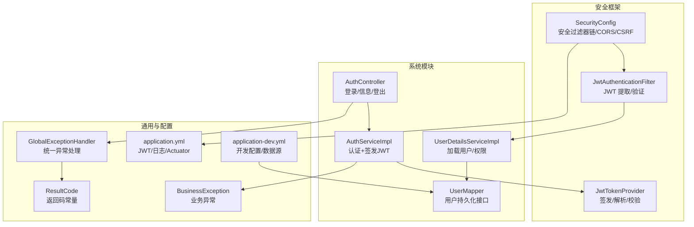
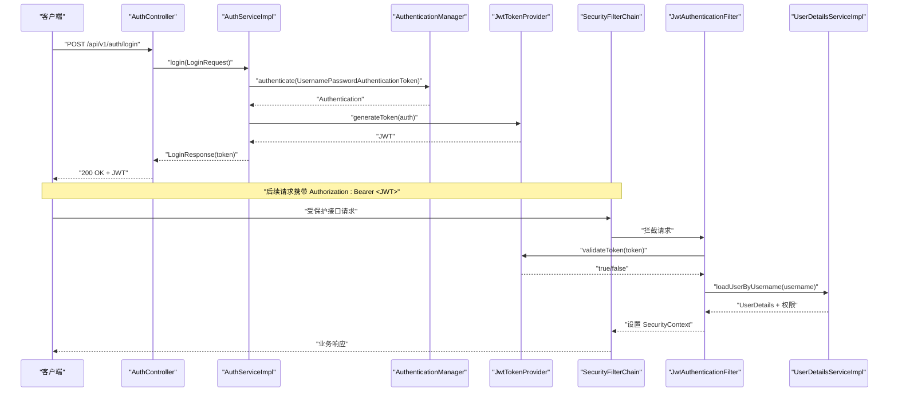
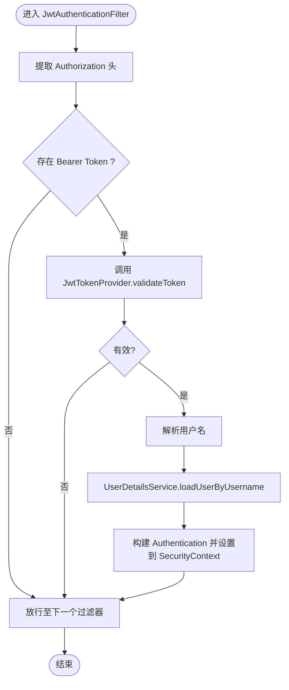
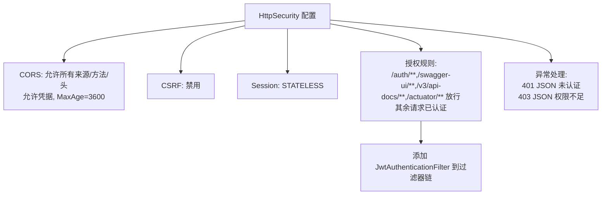
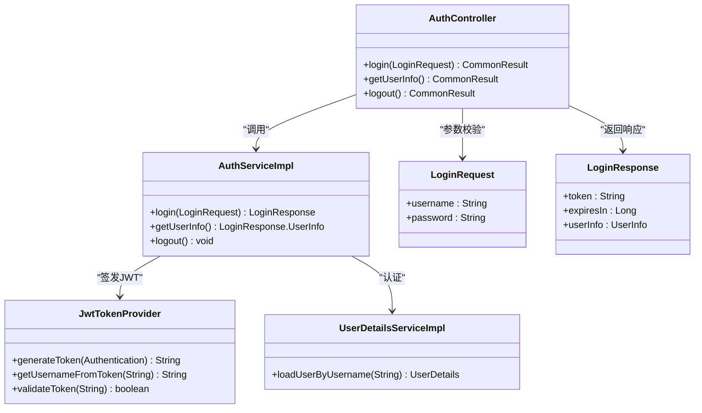
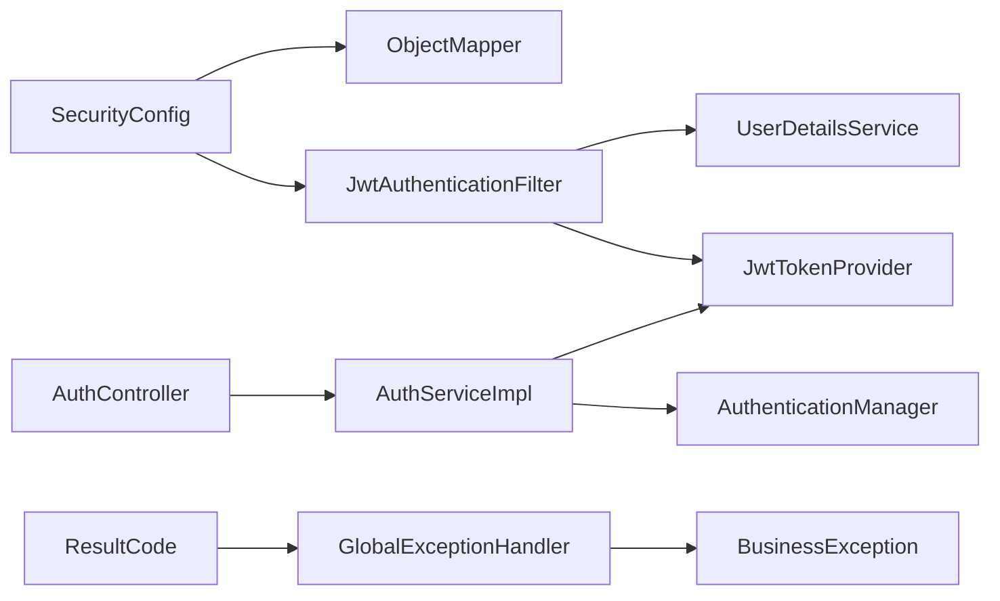

# 安全架构

<!--<cite>
**本文引用的文件**
- [SecurityConfig.java](file://graphiti-framework/graphiti-spring-boot-starter-security/src/main/java/com/graphiti/framework/security/config/SecurityConfig.java)
- [JwtAuthenticationFilter.java](file://graphiti-framework/graphiti-spring-boot-starter-security/src/main/java/com/graphiti/framework/security/jwt/JwtAuthenticationFilter.java)
- [JwtTokenProvider.java](file://graphiti-framework/graphiti-spring-boot-starter-security/src/main/java/com/graphiti/framework/security/jwt/JwtTokenProvider.java)
- [AuthController.java](file://graphiti-module-system/src/main/java/com/graphiti/system/controller/AuthController.java)
- [AuthServiceImpl.java](file://graphiti-module-system/src/main/java/com/graphiti/system/service/impl/AuthServiceImpl.java)
- [UserDetailsServiceImpl.java](file://graphiti-module-system/src/main/java/com/graphiti/system/service/UserDetailsServiceImpl.java)
- [LoginRequest.java](file://graphiti-module-system/src/main/java/com/graphiti/system/dto/LoginRequest.java)
- [LoginResponse.java](file://graphiti-module-system/src/main/java/com/graphiti/system/dto/LoginResponse.java)
- [application.yml](file://graphiti-server/src/main/resources/application.yml)
- [application-dev.yml](file://graphiti-server/src/main/resources/application-dev.yml)
- [GlobalExceptionHandler.java](file://graphiti-framework/graphiti-common/src/main/java/com/graphiti/common/exception/GlobalExceptionHandler.java)
- [BusinessException.java](file://graphiti-framework/graphiti-common/src/main/java/com/graphiti/common/exception/BusinessException.java)
- [ResultCode.java](file://graphiti-framework/graphiti-common/src/main/java/com/graphiti/common/constants/ResultCode.java)
- [UserMapper.java](file://graphiti-module-system/src/main/java/com/graphiti/system/dal/mysql/UserMapper.java)
- [PasswordTest.java](file://graphiti-server/src/test/java/PasswordTest.java)
</cite>-->

## 目录
1. [引言](#引言)
2. [项目结构](#项目结构)
3. [核心组件](#核心组件)
4. [架构总览](#架构总览)
5. [详细组件分析](#详细组件分析)
6. [依赖分析](#依赖分析)
7. [性能考虑](#性能考虑)
8. [故障排查指南](#故障排查指南)
9. [结论](#结论)
10. [附录](#附录)

## 引言
本文件面向安全工程师与开发者，系统性梳理 ontograph-java 的安全架构与防护措施，覆盖以下主题：
- JWT 无状态认证机制的实现原理与配置要点
- Spring Security 安全过滤器链与权限控制策略
- 密码加密存储与用户身份验证流程
- API 接口安全防护：参数校验、SQL 注入防护、XSS 防护等
- 跨域资源共享（CORS）配置与 CSRF 防护
- 角色权限模型与访问控制列表（ACL）设计
- 安全架构图与威胁模型分析
- 安全配置最佳实践与漏洞防护建议

## 项目结构
围绕安全相关的关键模块与文件如下：
- 安全配置与过滤器链：SecurityConfig、JwtAuthenticationFilter、JwtTokenProvider
- 认证与授权：AuthController、AuthServiceImpl、UserDetailsServiceImpl
- 参数校验与异常统一处理：LoginRequest、LoginResponse、GlobalExceptionHandler、BusinessException、ResultCode
- 配置文件：application.yml、application-dev.yml
- 数据访问：UserMapper
- 密码校验测试：PasswordTest

图表来源
- [SecurityConfig.java:115-136](file://graphiti-framework/graphiti-spring-boot-starter-security/src/main/java/com/graphiti/framework/security/config/SecurityConfig.java#L115-L136)
- [JwtAuthenticationFilter.java:26-59](file://graphiti-framework/graphiti-spring-boot-starter-security/src/main/java/com/graphiti/framework/security/jwt/JwtAuthenticationFilter.java#L26-L59)
- [JwtTokenProvider.java:19-86](file://graphiti-framework/graphiti-spring-boot-starter-security/src/main/java/com/graphiti/framework/security/jwt/JwtTokenProvider.java#L19-L86)
- [AuthController.java:20-54](file://graphiti-module-system/src/main/java/com/graphiti/system/controller/AuthController.java#L20-L54)
- [AuthServiceImpl.java:21-66](file://graphiti-module-system/src/main/java/com/graphiti/system/service/impl/AuthServiceImpl.java#L21-L66)
- [UserDetailsServiceImpl.java:21-42](file://graphiti-module-system/src/main/java/com/graphiti/system/service/UserDetailsServiceImpl.java#L21-L42)
- [GlobalExceptionHandler.java:17-73](file://graphiti-framework/graphiti-common/src/main/java/com/graphiti/common/exception/GlobalExceptionHandler.java#L17-L73)
- [BusinessException.java:10-32](file://graphiti-framework/graphiti-common/src/main/java/com/graphiti/common/exception/BusinessException.java#L10-L32)
- [ResultCode.java:7-22](file://graphiti-framework/graphiti-common/src/main/java/com/graphiti/common/constants/ResultCode.java#L7-L22)
- [application.yml:25-34](file://graphiti-server/src/main/resources/application.yml#L25-L34)
- [application-dev.yml:488-502](file://graphiti-server/src/main/resources/application-dev.yml#L488-L502)

章节来源
- [SecurityConfig.java:35-136](file://graphiti-framework/graphiti-spring-boot-starter-security/src/main/java/com/graphiti/framework/security/config/SecurityConfig.java#L35-L136)
- [application.yml:1-67](file://graphiti-server/src/main/resources/application.yml#L1-L67)
- [application-dev.yml:1-676](file://graphiti-server/src/main/resources/application-dev.yml#L1-L676)

## 核心组件
- 安全过滤器链与策略
  - 禁用 CSRF，启用 CORS，无状态会话（STATELESS）
  - 对特定路径放行（认证、Swagger、Actuator），其余请求均需认证
  - 自定义未认证与权限不足的 JSON 响应体
- JWT 无状态认证
  - 从 Authorization 请求头提取 Bearer Token
  - 使用对称密钥验证签名，解析主体（用户名）
  - 加载用户详情与权限，写入 SecurityContext
- 认证流程
  - 登录接口接收用户名/密码，交由 AuthenticationManager 认证
  - 成功后使用 JwtTokenProvider 生成 JWT 并返回
  - 用户信息接口从 SecurityContext 读取当前用户
- 参数校验与异常处理
  - DTO 字段级校验（NotBlank）
  - 统一异常处理，返回标准化错误码与消息
- 密码存储
  - 使用 BCrypt 进行不可逆加密
  - 测试用例验证匹配逻辑

章节来源
- [SecurityConfig.java:65-136](file://graphiti-framework/graphiti-spring-boot-starter-security/src/main/java/com/graphiti/framework/security/config/SecurityConfig.java#L65-L136)
- [JwtAuthenticationFilter.java:26-59](file://graphiti-framework/graphiti-spring-boot-starter-security/src/main/java/com/graphiti/framework/security/jwt/JwtAuthenticationFilter.java#L26-L59)
- [JwtTokenProvider.java:19-86](file://graphiti-framework/graphiti-spring-boot-starter-security/src/main/java/com/graphiti/framework/security/jwt/JwtTokenProvider.java#L19-L86)
- [AuthController.java:27-53](file://graphiti-module-system/src/main/java/com/graphiti/system/controller/AuthController.java#L27-L53)
- [AuthServiceImpl.java:26-65](file://graphiti-module-system/src/main/java/com/graphiti/system/service/impl/AuthServiceImpl.java#L26-L65)
- [LoginRequest.java:10-25](file://graphiti-module-system/src/main/java/com/graphiti/system/dto/LoginRequest.java#L10-L25)
- [GlobalExceptionHandler.java:26-72](file://graphiti-framework/graphiti-common/src/main/java/com/graphiti/common/exception/GlobalExceptionHandler.java#L26-L72)
- [BusinessException.java:20-31](file://graphiti-framework/graphiti-common/src/main/java/com/graphiti/common/exception/BusinessException.java#L20-L31)
- [PasswordTest.java:6-15](file://graphiti-server/src/test/java/PasswordTest.java#L6-L15)

## 架构总览
下图展示从客户端到服务端的认证与授权交互，以及关键安全组件之间的关系。

图表来源
- [AuthController.java:27-53](file://graphiti-module-system/src/main/java/com/graphiti/system/controller/AuthController.java#L27-L53)
- [AuthServiceImpl.java:26-44](file://graphiti-module-system/src/main/java/com/graphiti/system/service/impl/AuthServiceImpl.java#L26-L44)
- [JwtTokenProvider.java:40-53](file://graphiti-framework/graphiti-spring-boot-starter-security/src/main/java/com/graphiti/framework/security/jwt/JwtTokenProvider.java#L40-L53)
- [SecurityConfig.java:115-136](file://graphiti-framework/graphiti-spring-boot-starter-security/src/main/java/com/graphiti/framework/security/config/SecurityConfig.java#L115-L136)
- [JwtAuthenticationFilter.java:44-58](file://graphiti-framework/graphiti-spring-boot-starter-security/src/main/java/com/graphiti/framework/security/jwt/JwtAuthenticationFilter.java#L44-L58)
- [UserDetailsServiceImpl.java:24-41](file://graphiti-module-system/src/main/java/com/graphiti/system/service/UserDetailsServiceImpl.java#L24-L41)

## 详细组件分析

### JWT 无状态认证机制
- Token 结构与签发
  - 使用对称密钥（HMAC-SHA）签发，包含签发时间、过期时间与主体（用户名）
  - 默认有效期可配置，默认 24 小时
- Token 解析与校验
  - 从请求头 Authorization 中提取 Bearer Token
  - 验证签名与过期时间，解析主体（用户名）
- 与 Spring Security 集成
  - 在过滤器中将认证对象写入 SecurityContext，后续接口无需会话状态

图表来源
- [JwtAuthenticationFilter.java:36-58](file://graphiti-framework/graphiti-spring-boot-starter-security/src/main/java/com/graphiti/framework/security/jwt/JwtAuthenticationFilter.java#L36-L58)
- [JwtTokenProvider.java:74-85](file://graphiti-framework/graphiti-spring-boot-starter-security/src/main/java/com/graphiti/framework/security/jwt/JwtTokenProvider.java#L74-L85)
- [UserDetailsServiceImpl.java:24-41](file://graphiti-module-system/src/main/java/com/graphiti/system/service/UserDetailsServiceImpl.java#L24-L41)

章节来源
- [JwtTokenProvider.java:19-86](file://graphiti-framework/graphiti-spring-boot-starter-security/src/main/java/com/graphiti/framework/security/jwt/JwtTokenProvider.java#L19-L86)
- [JwtAuthenticationFilter.java:26-59](file://graphiti-framework/graphiti-spring-boot-starter-security/src/main/java/com/graphiti/framework/security/jwt/JwtAuthenticationFilter.java#L26-L59)
- [application.yml:25-30](file://graphiti-server/src/main/resources/application.yml#L25-L30)

### Spring Security 安全过滤器链与权限控制
- CORS
  - 放行所有来源、方法与头部，允许凭据，缓存时间 1 小时
- CSRF
  - 明确禁用（无状态 JWT）
- Session
  - 无状态会话（STATELESS）
- 授权规则
  - /api/v1/auth/**、/swagger-ui/**、/v3/api-docs/**、/actuator/** 免认证
  - 其他请求必须认证
- 异常处理
  - 未认证返回 401 JSON
  - 权限不足返回 403 JSON

图表来源
- [SecurityConfig.java:68-136](file://graphiti-framework/graphiti-spring-boot-starter-security/src/main/java/com/graphiti/framework/security/config/SecurityConfig.java#L68-L136)

章节来源
- [SecurityConfig.java:65-136](file://graphiti-framework/graphiti-spring-boot-starter-security/src/main/java/com/graphiti/framework/security/config/SecurityConfig.java#L65-L136)

### 密码加密存储与用户身份验证流程
- 密码加密
  - 使用 BCrypt 对密码进行不可逆加密
  - 测试用例验证“明文 vs 哈希”匹配
- 用户加载与权限
  - UserDetailsServiceImpl 从数据库加载用户（当前示例为硬编码演示）
  - 返回包含用户名、密码哈希与权限集合的 UserDetails
- 登录与签发
  - AuthController 接收登录请求，DTO 进行字段级校验
  - AuthServiceImpl 通过 AuthenticationManager 认证，成功后签发 JWT

图表来源
- [AuthController.java:27-53](file://graphiti-module-system/src/main/java/com/graphiti/system/controller/AuthController.java#L27-L53)
- [AuthServiceImpl.java:26-65](file://graphiti-module-system/src/main/java/com/graphiti/system/service/impl/AuthServiceImpl.java#L26-L65)
- [JwtTokenProvider.java:40-85](file://graphiti-framework/graphiti-spring-boot-starter-security/src/main/java/com/graphiti/framework/security/jwt/JwtTokenProvider.java#L40-L85)
- [UserDetailsServiceImpl.java:24-41](file://graphiti-module-system/src/main/java/com/graphiti/system/service/UserDetailsServiceImpl.java#L24-L41)
- [LoginRequest.java:10-25](file://graphiti-module-system/src/main/java/com/graphiti/system/dto/LoginRequest.java#L10-L25)
- [LoginResponse.java:10-38](file://graphiti-module-system/src/main/java/com/graphiti/system/dto/LoginResponse.java#L10-L38)

章节来源
- [PasswordTest.java:6-15](file://graphiti-server/src/test/java/PasswordTest.java#L6-L15)
- [UserDetailsServiceImpl.java:24-41](file://graphiti-module-system/src/main/java/com/graphiti/system/service/UserDetailsServiceImpl.java#L24-L41)
- [LoginRequest.java:10-25](file://graphiti-module-system/src/main/java/com/graphiti/system/dto/LoginRequest.java#L10-L25)

### API 接口安全防护
- 参数校验
  - 登录请求 DTO 使用 @NotBlank 校验用户名与密码非空
  - 全局异常处理器捕获参数校验失败，返回 400 与具体字段提示
- SQL 注入防护
  - 使用 MyBatis-Plus 与实体映射，避免原生 SQL 拼接
  - 数据库连接配置于 application-dev.yml，生产环境应严格限制访问
- XSS 防护
  - 后端未直接渲染用户输入；前端负责渲染与转义（本仓库前端位于 graphiti-web）
  - 建议在网关或反向代理层增加通用安全头（如 Content-Security-Policy）
- 统一错误响应
  - BusinessException 与 GlobalExceptionHandler 提供统一错误码与消息

章节来源
- [LoginRequest.java:17-24](file://graphiti-module-system/src/main/java/com/graphiti/system/dto/LoginRequest.java#L17-L24)
- [GlobalExceptionHandler.java:37-60](file://graphiti-framework/graphiti-common/src/main/java/com/graphiti/common/exception/GlobalExceptionHandler.java#L37-L60)
- [BusinessException.java:20-31](file://graphiti-framework/graphiti-common/src/main/java/com/graphiti/common/exception/BusinessException.java#L20-L31)
- [application-dev.yml:488-502](file://graphiti-server/src/main/resources/application-dev.yml#L488-L502)

### CORS 与 CSRF 防护
- CORS
  - 允许所有来源、方法、头，允许凭据，缓存 1 小时
  - 建议在生产环境限定来源与方法，最小化暴露面
- CSRF
  - 明确禁用，因为采用 JWT 无状态认证
  - 若引入基于会话的表单提交，需重新评估并启用 CSRF 保护

章节来源
- [SecurityConfig.java:68-79](file://graphiti-framework/graphiti-spring-boot-starter-security/src/main/java/com/graphiti/framework/security/config/SecurityConfig.java#L68-L79)
- [SecurityConfig.java:118](file://graphiti-framework/graphiti-spring-boot-starter-security/src/main/java/com/graphiti/framework/security/config/SecurityConfig.java#L118)

### 角色权限模型与 ACL 设计
- 当前实现
  - UserDetailsServiceImpl 返回 ROLE_ADMIN 权限（演示用途）
  - 授权规则对所有受保护接口要求已认证，未区分细粒度权限
- 建议改进
  - 引入 RBAC：Role 与 Permission 关联，接口级权限注解（如 @PreAuthorize）
  - 基于用户角色与资源 ID 构建 ACL，结合方法级安全与表达式控制
  - 将权限从内存/演示迁移到数据库持久化

章节来源
- [UserDetailsServiceImpl.java:37-40](file://graphiti-module-system/src/main/java/com/graphiti/system/service/UserDetailsServiceImpl.java#L37-L40)
- [SecurityConfig.java:121-126](file://graphiti-framework/graphiti-spring-boot-starter-security/src/main/java/com/graphiti/framework/security/config/SecurityConfig.java#L121-L126)

## 依赖分析
- 组件耦合
  - SecurityConfig 依赖 JwtAuthenticationFilter、ObjectMapper
  - JwtAuthenticationFilter 依赖 JwtTokenProvider、UserDetailsService
  - AuthServiceImpl 依赖 AuthenticationManager、JwtTokenProvider
  - AuthController 依赖 AuthService
- 外部依赖
  - JWT 库（io.jsonwebtoken）、BCrypt、Spring Security、MyBatis-Plus
- 潜在风险
  - 当前 UserDetailsServiceImpl 为演示实现，需替换为真实用户查询与权限加载
  - JWT 密钥与过期时间需在配置文件中妥善管理

图表来源
- [SecurityConfig.java:37-38](file://graphiti-framework/graphiti-spring-boot-starter-security/src/main/java/com/graphiti/framework/security/config/SecurityConfig.java#L37-L38)
- [JwtAuthenticationFilter.java:28-29](file://graphiti-framework/graphiti-spring-boot-starter-security/src/main/java/com/graphiti/framework/security/jwt/JwtAuthenticationFilter.java#L28-L29)
- [AuthController.java:21](file://graphiti-module-system/src/main/java/com/graphiti/system/controller/AuthController.java#L21)
- [AuthServiceImpl.java:23-24](file://graphiti-module-system/src/main/java/com/graphiti/system/service/impl/AuthServiceImpl.java#L23-L24)
- [GlobalExceptionHandler.java:26-30](file://graphiti-framework/graphiti-common/src/main/java/com/graphiti/common/exception/GlobalExceptionHandler.java#L26-L30)

章节来源
- [SecurityConfig.java:35-136](file://graphiti-framework/graphiti-spring-boot-starter-security/src/main/java/com/graphiti/framework/security/config/SecurityConfig.java#L35-L136)
- [AuthServiceImpl.java:21-66](file://graphiti-module-system/src/main/java/com/graphiti/system/service/impl/AuthServiceImpl.java#L21-L66)

## 性能考虑
- JWT 无状态优势
  - 无需服务器端会话存储，水平扩展友好
  - 验证开销主要在签名解析与权限加载
- 优化建议
  - 合理设置过期时间，短令牌+刷新机制（需额外实现）
  - 缓存用户权限与常用元数据，减少 UserDetails 查询压力
  - 控制 CORS 放宽范围，降低跨域复杂度

## 故障排查指南
- 401 未认证
  - 检查 Authorization 头是否为 Bearer Token
  - 核对 JWT 密钥与签名算法一致性
  - 查看日志级别以定位问题
- 403 权限不足
  - 确认用户权限集合与接口所需权限匹配
  - 检查授权规则与路径匹配
- 参数校验失败
  - 关注全局异常处理器返回的字段级错误信息
- 密码不匹配
  - 使用 BCrypt 匹配逻辑验证哈希与明文

章节来源
- [SecurityConfig.java:84-113](file://graphiti-framework/graphiti-spring-boot-starter-security/src/main/java/com/graphiti/framework/security/config/SecurityConfig.java#L84-L113)
- [GlobalExceptionHandler.java:37-60](file://graphiti-framework/graphiti-common/src/main/java/com/graphiti/common/exception/GlobalExceptionHandler.java#L37-L60)
- [PasswordTest.java:6-15](file://graphiti-server/src/test/java/PasswordTest.java#L6-L15)

## 结论
ontograph-java 已建立以 JWT 为核心的无状态认证体系，并通过 Spring Security 的过滤器链实现 CORS、CSRF、会话与授权控制。当前实现满足基本安全需求，建议在生产环境中进一步完善：
- 替换演示型用户加载逻辑为真实数据库实现
- 引入细粒度 RBAC 与方法级权限控制
- 限制 CORS 暴露面，强化密钥与配置管理
- 增强日志审计与监控告警

## 附录
- 安全配置最佳实践
  - JWT 密钥长度至少 512 位，定期轮换
  - 生产环境限制 CORS 来源与方法，关闭凭据或谨慎使用
  - 使用 HTTPS 传输，强制 HSTS
  - 对敏感操作增加二次确认与速率限制
- 威胁模型分析
  - 主要威胁：令牌泄露、暴力破解、越权访问、信息泄露
  - 缓解措施：强口令策略、短令牌、最小权限、审计日志、输入校验与输出编码