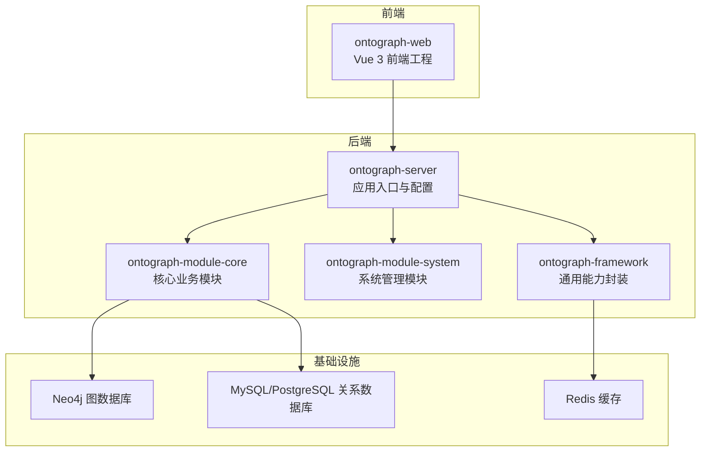
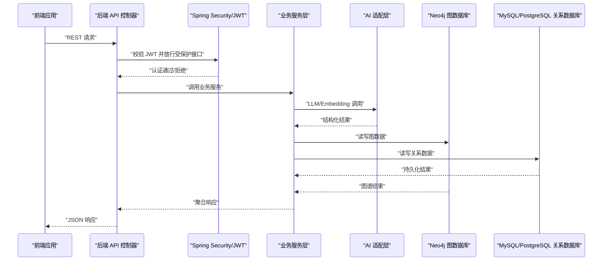
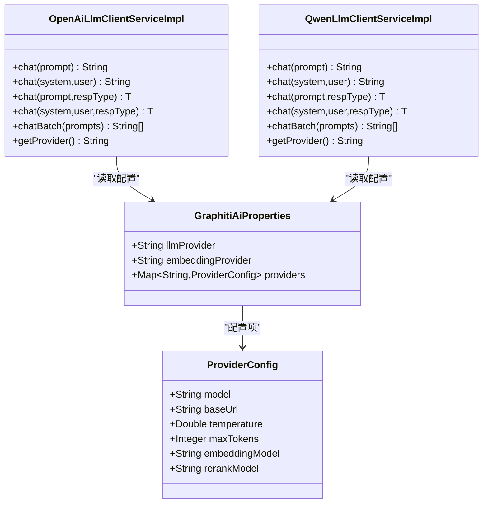
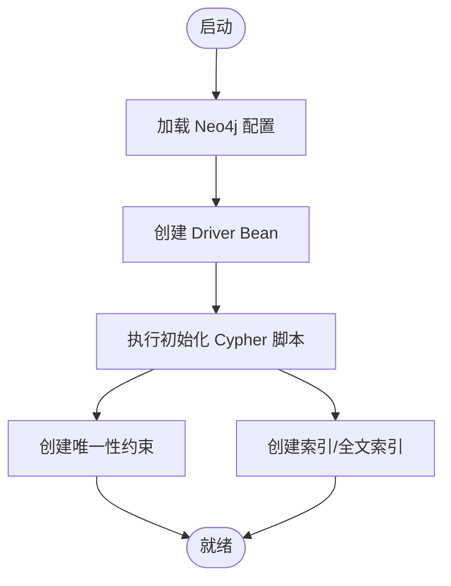
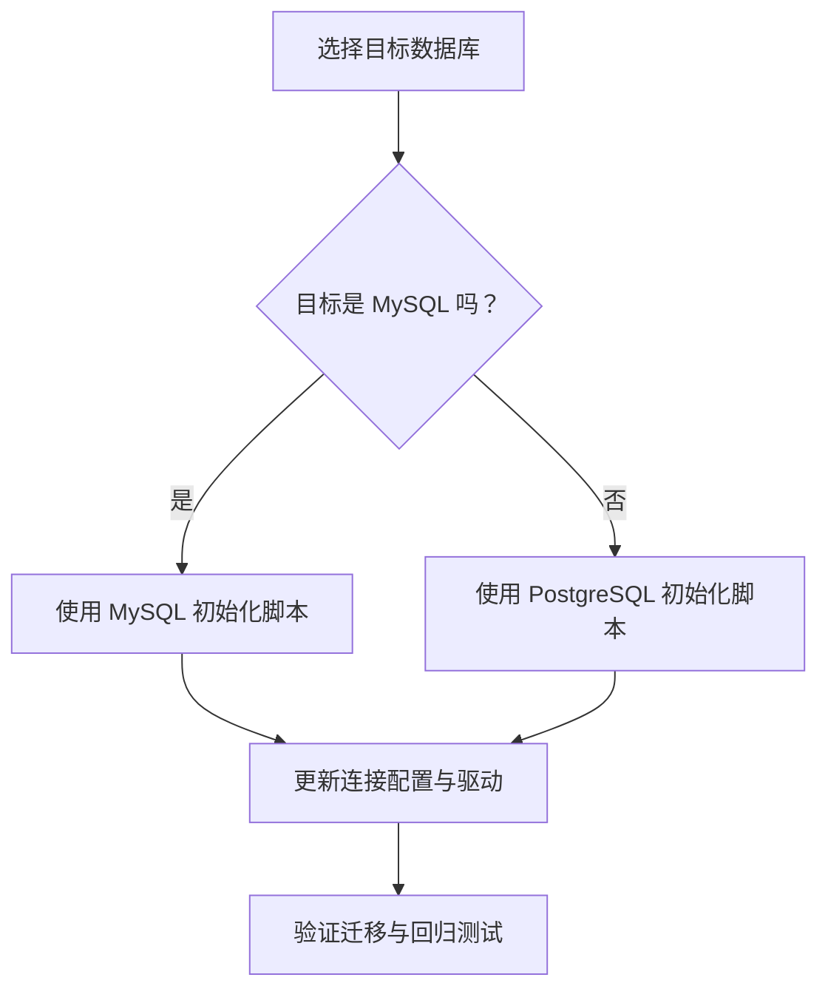
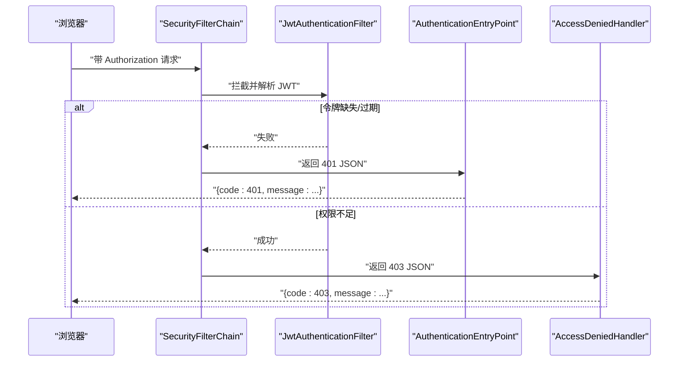
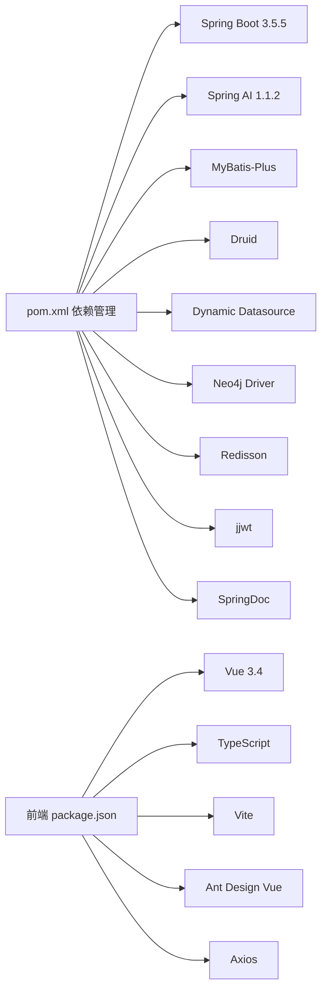

# 技术选型

<!--<cite>
**本文档引用的文件**   
- [pom.xml](file://pom.xml)
- [application.yml](file://ontograph-server/src/main/resources/application.yml)
- [package.json](file://ontograph-web/package.json)
- [SecurityConfig.java](file://ontograph-framework/graphiti-spring-boot-starter-security/src/main/java/com/graphiti/framework/security/config/SecurityConfig.java)
- [graphiti-spring-boot-starter-redis\pom.xml](file://ontograph-framework/graphiti-spring-boot-starter-redis/pom.xml)
- [graphiti-spring-boot-starter-mybatis\pom.xml](file://ontograph-framework/graphiti-spring-boot-starter-mybatis/pom.xml)
- [GraphitiAiProperties.java](file://ontograph-module-core/src/main/java/com/raphiti/module/graphiti/config/GraphitiAiProperties.java)
- [GraphNeo4jConfig.java](file://ontograph-module-core/src/main/java/com/raphiti/module/graphiti/config/GraphNeo4jConfig.java)
- [OpenAiLlmClientServiceImpl.java](file://ontograph-module-core/src/main/java/com/raphiti/module/graphiti/service/impl/ai/OpenAiLlmClientServiceImpl.java)
- [QwenLlmClientServiceImpl.java](file://ontograph-module-core/src/main/java/com/raphiti/module/graphiti/service/impl/ai/QwenLlmClientServiceImpl.java)
- [schema.sql(MySQL)](file://sql/mysql/schema.sql)
- [schema.sql(PostgreSQL)](file://sql/postgresql/schema.sql)
- [init.cypher(Neo4j)](file://sql/neo4j/init.cypher)
</cite>-->

## 目录
1. [简介](#简介)
2. [项目结构](#项目结构)
3. [核心组件](#核心组件)
4. [架构总览](#架构总览)
5. [关键组件深度解析](#关键组件深度解析)
6. [依赖关系分析](#依赖关系分析)
7. [性能与扩展性考虑](#性能与扩展性考虑)
8. [故障排查指南](#故障排查指南)
9. [结论](#结论)
10. [附录：版本兼容性矩阵与升级路径](#附录版本兼容性矩阵与升级路径)

## 简介
本技术选型文档面向技术负责人与架构师，系统梳理 ontograph-java 后端与前端在 Spring Boot 3.5.5、Spring AI 1.1.2、Vue 3.4、Neo4j、MySQL/PostgreSQL、Redis、Spring Security 等关键组件上的技术决策与权衡，并给出替代方案对比、版本兼容性矩阵与升级路径建议，帮助团队在功能演进与长期维护之间取得平衡。

## 项目结构
项目采用多模块 Maven 结构，后端由 framework、module、server 组成，前端独立于后端工程；数据库层同时支持 MySQL 与 PostgreSQL，并以 Neo4j 承载图谱数据。

**图表来源**
- [pom.xml](file://pom.xml)
- [ontograph-server\src\main\resources\application.yml](file://ontograph-server/src/main/resources/application.yml)

**章节来源**
- [pom.xml:15-20](file://pom.xml#L15-L20)
- [ontograph-server\src\main\resources\application.yml:1-67](file://ontograph-server/src/main/resources/application.yml#L1-L67)

## 核心组件
- 后端运行时与依赖管理：基于 Spring Boot 3.5.5，统一依赖版本与插件配置，确保模块间一致性与可维护性。
- AI 能力：通过 Spring AI 1.1.2 提供统一的 LLM/Embedding/Rerank 接口抽象，支持 OpenAI、通义千问、Ollama 等多家供应商。
- 图数据库：Neo4j 5.x 驱动，结合 Cypher 初始化脚本，建立实体/事件节点唯一约束与全文索引，支撑大规模图谱检索与推理。
- 关系数据库：同时提供 MySQL 与 PostgreSQL 的初始化脚本，当前配置优先使用 PostgreSQL，具备平滑迁移能力。
- 缓存：Redisson Spring Boot Starter 提供高性能分布式缓存与限流能力。
- 安全：基于 Spring Security 的无状态 JWT 认证，统一 401/403 返回格式，支持跨域与细粒度权限控制。
- 前端：Vue 3.4 + TypeScript + Vite + Ant Design Vue，构建现代化可视化界面与交互体验。

**章节来源**
- [pom.xml:22-43](file://pom.xml#L22-L43)
- [application.yml:20-34](file://ontograph-server/src/main/resources/application.yml#L20-L34)
- [graphiti-spring-boot-starter-redis\pom.xml:19-37](file://ontograph-framework/graphiti-spring-boot-starter-redis/pom.xml#L19-L37)
- [graphiti-spring-boot-starter-mybatis\pom.xml:19-49](file://ontograph-framework/graphiti-spring-boot-starter-mybatis/pom.xml#L19-L49)
- [SecurityConfig.java:115-136](file://ontograph-framework/graphiti-spring-boot-starter-security/src/main/java/com/graphiti/framework/security/config/SecurityConfig.java#L115-L136)

## 架构总览
下图展示后端服务、AI 适配层、图数据库与关系数据库之间的交互关系，以及前端通过 REST API 与后端通信。

**图表来源**
- [SecurityConfig.java:115-136](file://ontograph-framework/graphiti-spring-boot-starter-security/src/main/java/com/graphiti/framework/security/config/SecurityConfig.java#L115-L136)
- [OpenAiLlmClientServiceImpl.java:36-53](file://ontograph-module-core/src/main/java/com/raphiti/module/graphiti/service/impl/ai/OpenAiLlmClientServiceImpl.java#L36-L53)
- [GraphNeo4jConfig.java:41-45](file://ontograph-module-core/src/main/java/com/raphiti/module/graphiti/config/GraphNeo4jConfig.java#L41-L45)
- [application.yml:20-34](file://ontograph-server/src/main/resources/application.yml#L20-L34)

## 关键组件深度解析

### Spring Boot 3.5.5 选型与优势
- 语言与生态：Java 21 默认支持，与 Spring 生态高度契合，获得长期支持与性能优化。
- 依赖管理：通过 dependencyManagement 统一版本，避免“依赖地狱”，提升构建稳定性。
- 插件体系：编译插件开启 -parameters 与注解处理器，保障反射与映射工具链稳定。

**章节来源**
- [pom.xml:22-43](file://pom.xml#L22-L43)
- [pom.xml:199-236](file://pom.xml#L199-L236)

### Spring AI 1.1.2 与多供应商适配
- 统一抽象：通过 ChatClient/OpenAiChatModel 等抽象屏蔽不同供应商差异，便于切换与私有化部署。
- 配置驱动：GraphitiAiProperties 支持多供应商（OpenAI、通义千问、Ollama、Anthropic、Mistral 等）与私有化 Base URL。
- 实现示例：OpenAI 与通义千问均以 OpenAI 兼容接口实现，简化接入成本。

**图表来源**
- [GraphitiAiProperties.java:15-135](file://ontograph-module-core/src/main/java/com/raphiti/module/graphiti/config/GraphitiAiProperties.java#L15-L135)
- [OpenAiLlmClientServiceImpl.java:36-111](file://ontograph-module-core/src/main/java/com/raphiti/module/graphiti/service/impl/ai/OpenAiLlmClientServiceImpl.java#L36-L111)
- [QwenLlmClientServiceImpl.java:23-98](file://ontograph-module-core/src/main/java/com/raphiti/module/graphiti/service/impl/ai/QwenLlmClientServiceImpl.java#L23-L98)

**章节来源**
- [application.yml:20-34](file://ontograph-server/src/main/resources/application.yml#L20-L34)
- [GraphitiAiProperties.java:15-135](file://ontograph-module-core/src/main/java/com/raphiti/module/graphiti/config/GraphitiAiProperties.java#L15-L135)
- [OpenAiLlmClientServiceImpl.java:36-111](file://ontograph-module-core/src/main/java/com/raphiti/module/graphiti/service/impl/ai/OpenAiLlmClientServiceImpl.java#L36-L111)
- [QwenLlmClientServiceImpl.java:23-98](file://ontograph-module-core/src/main/java/com/raphiti/module/graphiti/service/impl/ai/QwenLlmClientServiceImpl.java#L23-L98)

### Neo4j 图数据库与初始化策略
- 连接与驱动：GraphNeo4jConfig 读取配置并创建 Driver Bean，支持用户名/密码认证。
- 初始化脚本：创建实体/事件节点唯一约束与全文索引，支撑高效检索与去重。
- 适用场景：实体识别、关系抽取、社区发现、时序事件分析等图谱任务。

**图表来源**
- [GraphNeo4jConfig.java:21-45](file://ontograph-module-core/src/main/java/com/raphiti/module/graphiti/config/GraphNeo4jConfig.java#L21-L45)
- [init.cypher(Neo4j):1-33](file://sql/neo4j/init.cypher#L1-L33)

**章节来源**
- [GraphNeo4jConfig.java:21-45](file://ontograph-module-core/src/main/java/com/raphiti/module/graphiti/config/GraphNeo4jConfig.java#L21-L45)
- [init.cypher(Neo4j):1-33](file://sql/neo4j/init.cypher#L1-L33)

### MySQL/PostgreSQL 双栈与迁移策略
- 双栈支持：同时提供 MySQL 与 PostgreSQL 的初始化脚本，满足不同环境偏好。
- 当前配置：application.yml 显式声明使用 PostgreSQL 驱动与连接参数。
- 迁移路径：通过版本化迁移脚本与统一的 MyBatis-Plus 配置，可平滑从 MySQL 切换到 PostgreSQL。

**图表来源**
- [application.yml:142-147](file://ontograph-server/src/main/resources/application.yml#L142-L147)
- [schema.sql(MySQL):1-196](file://sql/mysql/schema.sql#L1-L196)
- [schema.sql(PostgreSQL):1-319](file://sql/postgresql/schema.sql#L1-L319)

**章节来源**
- [application.yml:142-147](file://ontograph-server/src/main/resources/application.yml#L142-L147)
- [schema.sql(MySQL):1-196](file://sql/mysql/schema.sql#L1-L196)
- [schema.sql(PostgreSQL):1-319](file://sql/postgresql/schema.sql#L1-L319)

### 缓存策略（Redis）
- 组件：Redisson Spring Boot Starter + Spring Cache，提供分布式缓存与限流能力。
- 适用场景：热点数据缓存、会话共享、限流与幂等控制。
- 注意事项：需与 Spring Security 的无状态策略配合，避免会话粘连问题。

**章节来源**
- [graphiti-spring-boot-starter-redis\pom.xml:19-37](file://ontograph-framework/graphiti-spring-boot-starter-redis/pom.xml#L19-L37)

### 安全框架（Spring Security + JWT）
- 无状态：SessionCreationPolicy.STATELESS，结合 JWT 实现前后端分离。
- 统一异常：未认证返回 401，权限不足返回 403，JSON 格式一致。
- 跨域：CORS 允许任意来源与凭证，满足前端开发调试需求。
- 过滤链：/api/v1/auth/** 公开，Swagger/Actuator 仅开发环境可用。

**图表来源**
- [SecurityConfig.java:115-136](file://ontograph-framework/graphiti-spring-boot-starter-security/src/main/java/com/graphiti/framework/security/config/SecurityConfig.java#L115-L136)

**章节来源**
- [SecurityConfig.java:68-136](file://ontograph-framework/graphiti-spring-boot-starter-security/src/main/java/com/graphiti/framework/security/config/SecurityConfig.java#L68-L136)

### 前端技术栈（Vue 3.4.0、TypeScript、Vite、Ant Design Vue）
- Vue 3.4：组合式 API 与更好的 Tree-shaking，提升开发体验与包体积。
- TypeScript：强类型保障，降低协作与维护成本。
- Vite：快速冷启与热更新，优化本地开发体验。
- Ant Design Vue：企业级 UI 组件库，与后端 REST API 高度契合。
- Axios：统一请求封装，便于与后端 API 对接。

**章节来源**
- [package.json:11-31](file://ontograph-web/package.json#L11-L31)

## 依赖关系分析
- 后端依赖：Spring Boot BOM + Spring AI BOM 统一版本；MyBatis-Plus + Druid + 动态数据源；Neo4j Java Driver；Redisson；JWT；Lombok/MapStruct/Hutool；SpringDoc。
- 前端依赖：Vue 3 + Router + Pinia + Ant Design Vue + Axios + ECharts + Less。
- 模块耦合：framework 提供通用能力，module-system 与 module-core 分别承担系统管理与核心业务，server 作为装配中心。

**图表来源**
- [pom.xml:45-196](file://pom.xml#L45-L196)
- [package.json:11-31](file://ontograph-web/package.json#L11-L31)

**章节来源**
- [pom.xml:45-196](file://pom.xml#L45-L196)
- [package.json:11-31](file://ontograph-web/package.json#L11-L31)

## 性能与扩展性考虑
- 图计算与检索：Neo4j 全文索引与关系索引显著提升复杂查询性能；建议对高频查询建立向量索引与物化视图。
- 关系数据库：PostgreSQL 在 JSON/全文检索与并发写入方面优于 MySQL；建议开启连接池与慢查询日志。
- 缓存：Redisson 提供分布式锁与限流，建议结合 Spring Cache 注解进行热点数据缓存。
- AI 调用：批量处理与超时重试策略，避免阻塞主线程；私有化部署可降低网络抖动影响。
- 前端：Vite 开发模式热更新，生产构建开启代码分割与懒加载，减少首屏体积。

## 故障排查指南
- 认证失败（401）：检查 JWT 密钥、过期时间与前端携带方式；确认 SecurityConfig 的公开路径配置。
- 权限不足（403）：核对用户角色与菜单权限映射，确认 AccessDeniedHandler 返回体字段。
- Neo4j 连接失败：核对 URI、用户名/密码与初始化脚本执行情况。
- 数据库迁移异常：核对目标数据库版本、驱动与初始化脚本顺序，确保外键与索引顺序正确。
- AI 调用异常：检查 provider 配置、私有化 Base URL 与模型名称，查看日志异常堆栈。

**章节来源**
- [SecurityConfig.java:84-113](file://ontograph-framework/graphiti-spring-boot-starter-security/src/main/java/com/graphiti/framework/security/config/SecurityConfig.java#L84-L113)
- [GraphNeo4jConfig.java:21-45](file://ontograph-module-core/src/main/java/com/raphiti/module/graphiti/config/GraphNeo4jConfig.java#L21-L45)
- [application.yml:20-34](file://ontograph-server/src/main/resources/application.yml#L20-L34)

## 结论
本技术栈在“统一抽象 + 多供应商 + 图数据库 + 双关系库 + 分布式缓存 + 无状态安全”的组合下，兼顾了功能扩展性、可维护性与性能表现。Spring Boot 3.5.5 与 Spring AI 1.1.2 提供了稳定的运行时与强大的 AI 能力；Neo4j 与 PostgreSQL 的双栈设计为后续扩展与迁移提供了弹性空间；Redis 与 Spring Security 的组合满足高并发下的安全与性能需求。建议在后续迭代中持续完善监控告警、压测与灾备演练，确保系统在高负载与复杂业务场景下的稳定性。

## 附录：版本兼容性矩阵与升级路径

### 版本兼容性矩阵
- Java 与 Spring Boot：Java 21 + Spring Boot 3.5.5（推荐 LTS）
- Spring AI：1.1.2 与 Spring Boot 3.5.x 兼容
- Neo4j：驱动版本与 Neo4j 5.x 兼容
- PostgreSQL：驱动版本与 42.7.4 兼容
- Vue：3.4.0 与 Vite 5.x 兼容
- Ant Design Vue：4.x 与 Vue 3 兼容

**章节来源**
- [pom.xml:29-42](file://pom.xml#L29-L42)
- [application.yml:142-147](file://ontograph-server/src/main/resources/application.yml#L142-L147)
- [package.json:11-31](file://ontograph-web/package.json#L11-L31)

### 升级路径建议
- Spring Boot：从 3.5.x 升级至 3.6.x 时，优先验证 Spring AI 与 Neo4j 驱动兼容性，逐步替换依赖版本。
- Spring AI：关注 OpenAI/通义千问等供应商 API 变更，保持 ProviderConfig 的可配置性。
- Neo4j：升级驱动与服务器版本时，先在测试环境验证初始化脚本与查询性能。
- 关系数据库：从 MySQL 迁移至 PostgreSQL 时，优先完成索引与触发器迁移，再切换连接配置。
- 前端：Vue 3.4.x → 3.5.x 时，关注 Composition API 与模板编译差异，逐步升级 Vite 与相关插件。