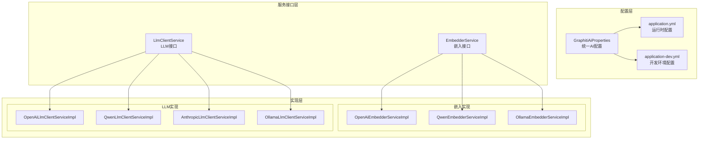
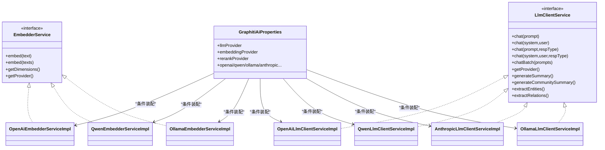
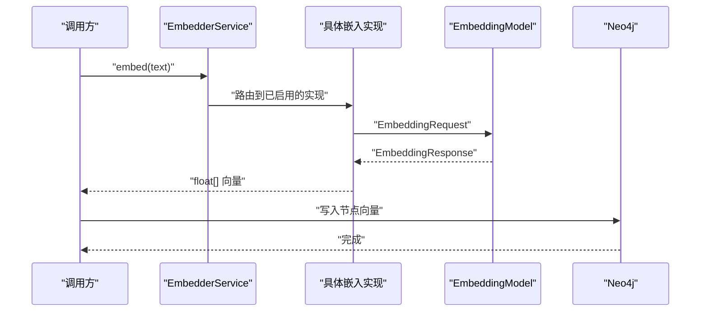
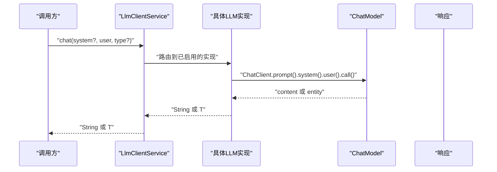
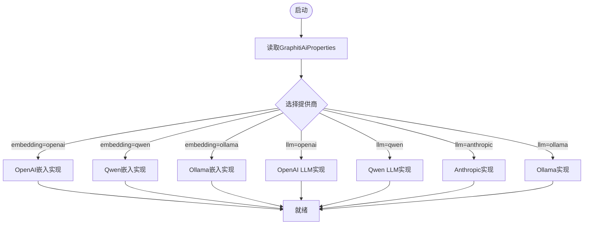
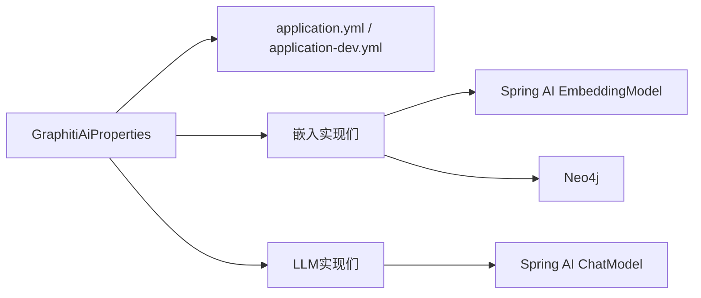

# AI集成数据流

<!--<cite>
**本文引用的文件**
- [GraphitiAiProperties.java](file://graphiti-module-core/src/main/java/com/graphiti/module/graphiti/config/GraphitiAiProperties.java)
- [EmbedderService.java](file://graphiti-module-core/src/main/java/com/graphiti/module/graphiti/service/EmbedderService.java)
- [LlmClientService.java](file://graphiti-module-core/src/main/java/com/graphiti/module/graphiti/service/LlmClientService.java)
- [OpenAiEmbedderServiceImpl.java](file://graphiti-module-core/src/main/java/com/graphiti/module/graphiti/service/impl/ai/OpenAiEmbedderServiceImpl.java)
- [QwenEmbedderServiceImpl.java](file://graphiti-module-core/src/main/java/com/graphiti/module/graphiti/service/impl/ai/QwenEmbedderServiceImpl.java)
- [OllamaEmbedderServiceImpl.java](file://graphiti-module-core/src/main/java/com/graphiti/module/graphiti/service/impl/ai/OllamaEmbedderServiceImpl.java)
- [OpenAiLlmClientServiceImpl.java](file://graphiti-module-core/src/main/java/com/graphiti/module/graphiti/service/impl/ai/OpenAiLlmClientServiceImpl.java)
- [QwenLlmClientServiceImpl.java](file://graphiti-module-core/src/main/java/com/graphiti/module/graphiti/service/impl/ai/QwenLlmClientServiceImpl.java)
- [AnthropicLlmClientServiceImpl.java](file://graphiti-module-core/src/main/java/com/graphiti/module/graphiti/service/impl/ai/AnthropicLlmClientServiceImpl.java)
- [OllamaLlmClientServiceImpl.java](file://graphiti-module-core/src/main/java/com/graphiti/module/graphiti/service/impl/ai/OllamaLlmClientServiceImpl.java)
- [application.yml](file://graphiti-server/src/main/resources/application.yml)
- [application-dev.yml](file://graphiti-server/src/main/resources/application-dev.yml)
- [vector-index-init.cypher](file://sql/neo4j/vector-index-init.cypher)
- [prompt_template_init.sql](file://docs/sql/prompt_template_init.sql)
- [prompt_template_postgresql_init.sql](file://docs/sql/prompt_template_postgresql_init.sql)
</cite>-->

## 目录
1. [简介](#简介)
2. [项目结构](#项目结构)
3. [核心组件](#核心组件)
4. [架构总览](#架构总览)
5. [详细组件分析](#详细组件分析)
6. [依赖分析](#依赖分析)
7. [性能考虑](#性能考虑)
8. [故障排查指南](#故障排查指南)
9. [结论](#结论)
10. [附录](#附录)

## 简介
本文件面向开发者，系统性梳理Graphiti-Java中的AI集成数据流与最佳实践。重点覆盖：
- 向量嵌入数据流：文本预处理 → 模型选择 → 嵌入生成 → 向量存储 → 索引构建
- LLM调用流程：提示词构建 → 模型参数配置 → API调用 → 响应解析 → 错误处理
- 多提供商适配：接口抽象 → 条件装配 → 动态切换 → 负载均衡
- 异步处理机制：任务队列 → 并发控制 → 进度跟踪 → 结果回调
- AI服务监控：调用统计 → 延迟监控 → 成本控制 → 性能分析
- 配置与故障转移策略：统一配置 → 失败重试 → 降级回退

## 项目结构
AI相关能力主要集中在graphiti-module-core模块的服务层与实现层，并通过Spring Boot自动装配与条件注解实现多提供商适配；配置由GraphitiAiProperties统一管理，运行时通过application.yml与application-dev.yml注入。

**图表来源**
- [GraphitiAiProperties.java:1-135](file://graphiti-module-core/src/main/java/com/graphiti/module/graphiti/config/GraphitiAiProperties.java#L1-L135)
- [application.yml](file://graphiti-server/src/main/resources/application.yml)
- [application-dev.yml](file://graphiti-server/src/main/resources/application-dev.yml)
- [EmbedderService.java:1-41](file://graphiti-module-core/src/main/java/com/graphiti/module/graphiti/service/EmbedderService.java#L1-L41)
- [LlmClientService.java:1-158](file://graphiti-module-core/src/main/java/com/graphiti/module/graphiti/service/LlmClientService.java#L1-L158)
- [OpenAiEmbedderServiceImpl.java:1-107](file://graphiti-module-core/src/main/java/com/graphiti/module/graphiti/service/impl/ai/OpenAiEmbedderServiceImpl.java#L1-L107)
- [QwenEmbedderServiceImpl.java:1-66](file://graphiti-module-core/src/main/java/com/graphiti/module/graphiti/service/impl/ai/QwenEmbedderServiceImpl.java#L1-L66)
- [OllamaEmbedderServiceImpl.java:1-78](file://graphiti-module-core/src/main/java/com/graphiti/module/graphiti/service/impl/ai/OllamaEmbedderServiceImpl.java#L1-L78)
- [OpenAiLlmClientServiceImpl.java:1-111](file://graphiti-module-core/src/main/java/com/graphiti/module/graphiti/service/impl/ai/OpenAiLlmClientServiceImpl.java#L1-L111)
- [QwenLlmClientServiceImpl.java:1-98](file://graphiti-module-core/src/main/java/com/graphiti/module/graphiti/service/impl/ai/QwenLlmClientServiceImpl.java#L1-L98)
- [AnthropicLlmClientServiceImpl.java:1-112](file://graphiti-module-core/src/main/java/com/graphiti/module/graphiti/service/impl/ai/AnthropicLlmClientServiceImpl.java#L1-L112)
- [OllamaLlmClientServiceImpl.java:1-98](file://graphiti-module-core/src/main/java/com/graphiti/module/graphiti/service/impl/ai/OllamaLlmClientServiceImpl.java#L1-L98)

**章节来源**
- [GraphitiAiProperties.java:1-135](file://graphiti-module-core/src/main/java/com/graphiti/module/graphiti/config/GraphitiAiProperties.java#L1-L135)
- [application.yml](file://graphiti-server/src/main/resources/application.yml)
- [application-dev.yml](file://graphiti-server/src/main/resources/application-dev.yml)

## 核心组件
- GraphitiAiProperties：集中管理LLM/Embedding/Rerank提供商、模型名、基础URL、温度、最大token等配置项，支持多提供商并行配置。
- EmbedderService：统一嵌入接口，屏蔽不同提供商差异，提供单条/批量嵌入与维度查询。
- LlmClientService：统一LLM调用接口，支持单轮/系统提示词/结构化输出/批量调用，并内置实体抽取与关系抽取默认实现。

**章节来源**
- [GraphitiAiProperties.java:1-135](file://graphiti-module-core/src/main/java/com/graphiti/module/graphiti/config/GraphitiAiProperties.java#L1-L135)
- [EmbedderService.java:1-41](file://graphiti-module-core/src/main/java/com/graphiti/module/graphiti/service/EmbedderService.java#L1-L41)
- [LlmClientService.java:1-158](file://graphiti-module-core/src/main/java/com/graphiti/module/graphiti/service/LlmClientService.java#L1-L158)

## 架构总览
AI集成采用“接口抽象 + 条件装配”的多提供商适配架构。通过GraphitiAiProperties读取配置，结合Spring条件注解按提供商动态启用对应实现；嵌入与LLM分别独立扩展，便于独立演进与替换。

**图表来源**
- [GraphitiAiProperties.java:1-135](file://graphiti-module-core/src/main/java/com/graphiti/module/graphiti/config/GraphitiAiProperties.java#L1-L135)
- [EmbedderService.java:1-41](file://graphiti-module-core/src/main/java/com/graphiti/module/graphiti/service/EmbedderService.java#L1-L41)
- [LlmClientService.java:1-158](file://graphiti-module-core/src/main/java/com/graphiti/module/graphiti/service/LlmClientService.java#L1-L158)
- [OpenAiEmbedderServiceImpl.java:1-107](file://graphiti-module-core/src/main/java/com/graphiti/module/graphiti/service/impl/ai/OpenAiEmbedderServiceImpl.java#L1-L107)
- [QwenEmbedderServiceImpl.java:1-66](file://graphiti-module-core/src/main/java/com/graphiti/module/graphiti/service/impl/ai/QwenEmbedderServiceImpl.java#L1-L66)
- [OllamaEmbedderServiceImpl.java:1-78](file://graphiti-module-core/src/main/java/com/graphiti/module/graphiti/service/impl/ai/OllamaEmbedderServiceImpl.java#L1-L78)
- [OpenAiLlmClientServiceImpl.java:1-111](file://graphiti-module-core/src/main/java/com/graphiti/module/graphiti/service/impl/ai/OpenAiLlmClientServiceImpl.java#L1-L111)
- [QwenLlmClientServiceImpl.java:1-98](file://graphiti-module-core/src/main/java/com/graphiti/module/graphiti/service/impl/ai/QwenLlmClientServiceImpl.java#L1-L98)
- [AnthropicLlmClientServiceImpl.java:1-112](file://graphiti-module-core/src/main/java/com/graphiti/module/graphiti/service/impl/ai/AnthropicLlmClientServiceImpl.java#L1-L112)
- [OllamaLlmClientServiceImpl.java:1-98](file://graphiti-module-core/src/main/java/com/graphiti/module/graphiti/service/impl/ai/OllamaLlmClientServiceImpl.java#L1-L98)

## 详细组件分析

### 向量嵌入数据流
- 文本预处理：调用方负责清洗与分段；嵌入实现不包含预处理逻辑。
- 模型选择：通过GraphitiAiProperties.embeddingProvider与各实现的@ConditionalOnProperty联动，自动选择OpenAI/Qwen/Ollama等。
- 嵌入生成：调用Spring AI提供的EmbeddingModel，返回float[]或List<float[]>。
- 向量存储：将向量写入Neo4j，使用向量索引加速相似检索。
- 索引构建：执行Neo4j向量索引初始化脚本，建立可查询的向量索引。

**图表来源**
- [EmbedderService.java:1-41](file://graphiti-module-core/src/main/java/com/graphiti/module/graphiti/service/EmbedderService.java#L1-L41)
- [OpenAiEmbedderServiceImpl.java:1-107](file://graphiti-module-core/src/main/java/com/graphiti/module/graphiti/service/impl/ai/OpenAiEmbedderServiceImpl.java#L1-L107)
- [QwenEmbedderServiceImpl.java:1-66](file://graphiti-module-core/src/main/java/com/graphiti/module/graphiti/service/impl/ai/QwenEmbedderServiceImpl.java#L1-L66)
- [OllamaEmbedderServiceImpl.java:1-78](file://graphiti-module-core/src/main/java/com/graphiti/module/graphiti/service/impl/ai/OllamaEmbedderServiceImpl.java#L1-L78)
- [vector-index-init.cypher](file://sql/neo4j/vector-index-init.cypher)

**章节来源**
- [EmbedderService.java:1-41](file://graphiti-module-core/src/main/java/com/graphiti/module/graphiti/service/EmbedderService.java#L1-L41)
- [OpenAiEmbedderServiceImpl.java:1-107](file://graphiti-module-core/src/main/java/com/graphiti/module/graphiti/service/impl/ai/OpenAiEmbedderServiceImpl.java#L1-L107)
- [QwenEmbedderServiceImpl.java:1-66](file://graphiti-module-core/src/main/java/com/graphiti/module/graphiti/service/impl/ai/QwenEmbedderServiceImpl.java#L1-L66)
- [OllamaEmbedderServiceImpl.java:1-78](file://graphiti-module-core/src/main/java/com/graphiti/module/graphiti/service/impl/ai/OllamaEmbedderServiceImpl.java#L1-L78)
- [vector-index-init.cypher](file://sql/neo4j/vector-index-init.cypher)

### LLM调用流程
- 提示词构建：支持纯用户提示词与带系统提示词；内置默认摘要与抽取方法，使用classpath下的prompt模板。
- 模型参数配置：通过GraphitiAiProperties与Spring AI配置（如temperature、maxTokens、model、baseUrl）生效。
- API调用：使用ChatClient调用OpenAI/Anthropic/Ollama等模型，支持结构化输出解析。
- 响应解析：默认字符串回复；结构化输出通过Jackson反序列化为指定类型。
- 错误处理：捕获异常并记录日志，抛出运行时异常以便上层治理。

**图表来源**
- [LlmClientService.java:1-158](file://graphiti-module-core/src/main/java/com/graphiti/module/graphiti/service/LlmClientService.java#L1-L158)
- [OpenAiLlmClientServiceImpl.java:1-111](file://graphiti-module-core/src/main/java/com/graphiti/module/graphiti/service/impl/ai/OpenAiLlmClientServiceImpl.java#L1-L111)
- [QwenLlmClientServiceImpl.java:1-98](file://graphiti-module-core/src/main/java/com/graphiti/module/graphiti/service/impl/ai/QwenLlmClientServiceImpl.java#L1-L98)
- [AnthropicLlmClientServiceImpl.java:1-112](file://graphiti-module-core/src/main/java/com/graphiti/module/graphiti/service/impl/ai/AnthropicLlmClientServiceImpl.java#L1-L112)
- [OllamaLlmClientServiceImpl.java:1-98](file://graphiti-module-core/src/main/java/com/graphiti/module/graphiti/service/impl/ai/OllamaLlmClientServiceImpl.java#L1-L98)

**章节来源**
- [LlmClientService.java:1-158](file://graphiti-module-core/src/main/java/com/graphiti/module/graphiti/service/LlmClientService.java#L1-L158)
- [OpenAiLlmClientServiceImpl.java:1-111](file://graphiti-module-core/src/main/java/com/graphiti/module/graphiti/service/impl/ai/OpenAiLlmClientServiceImpl.java#L1-L111)
- [QwenLlmClientServiceImpl.java:1-98](file://graphiti-module-core/src/main/java/com/graphiti/module/graphiti/service/impl/ai/QwenLlmClientServiceImpl.java#L1-L98)
- [AnthropicLlmClientServiceImpl.java:1-112](file://graphiti-module-core/src/main/java/com/graphiti/module/graphiti/service/impl/ai/AnthropicLlmClientServiceImpl.java#L1-L112)
- [OllamaLlmClientServiceImpl.java:1-98](file://graphiti-module-core/src/main/java/com/graphiti/module/graphiti/service/impl/ai/OllamaLlmClientServiceImpl.java#L1-L98)

### 多提供商适配
- 接口抽象：EmbedderService与LlmClientService定义统一契约，屏蔽提供商差异。
- 条件装配：各实现以@ConditionalOnProperty基于GraphitiAiProperties的provider字段启用。
- 动态切换：通过修改配置即可在不同提供商间无缝切换。
- 负载均衡：可在网关或客户端侧实现多实例轮询/权重分配，提升可用性与吞吐。

**图表来源**
- [GraphitiAiProperties.java:1-135](file://graphiti-module-core/src/main/java/com/graphiti/module/graphiti/config/GraphitiAiProperties.java#L1-L135)
- [OpenAiEmbedderServiceImpl.java:1-107](file://graphiti-module-core/src/main/java/com/graphiti/module/graphiti/service/impl/ai/OpenAiEmbedderServiceImpl.java#L1-L107)
- [QwenEmbedderServiceImpl.java:1-66](file://graphiti-module-core/src/main/java/com/graphiti/module/graphiti/service/impl/ai/QwenEmbedderServiceImpl.java#L1-L66)
- [OllamaEmbedderServiceImpl.java:1-78](file://graphiti-module-core/src/main/java/com/graphiti/module/graphiti/service/impl/ai/OllamaEmbedderServiceImpl.java#L1-L78)
- [OpenAiLlmClientServiceImpl.java:1-111](file://graphiti-module-core/src/main/java/com/graphiti/module/graphiti/service/impl/ai/OpenAiLlmClientServiceImpl.java#L1-L111)
- [QwenLlmClientServiceImpl.java:1-98](file://graphiti-module-core/src/main/java/com/graphiti/module/graphiti/service/impl/ai/QwenLlmClientServiceImpl.java#L1-L98)
- [AnthropicLlmClientServiceImpl.java:1-112](file://graphiti-module-core/src/main/java/com/graphiti/module/graphiti/service/impl/ai/AnthropicLlmClientServiceImpl.java#L1-L112)
- [OllamaLlmClientServiceImpl.java:1-98](file://graphiti-module-core/src/main/java/com/graphiti/module/graphiti/service/impl/ai/OllamaLlmClientServiceImpl.java#L1-L98)

**章节来源**
- [GraphitiAiProperties.java:1-135](file://graphiti-module-core/src/main/java/com/graphiti/module/graphiti/config/GraphitiAiProperties.java#L1-L135)

### 异步处理机制
- 任务队列：建议在业务层引入消息队列（如RabbitMQ/Kafka）承载高并发嵌入/LLM请求。
- 并发控制：通过线程池/限流器限制并发，避免提供商限流或资源耗尽。
- 进度跟踪：对批量任务维护任务ID与状态，支持查询进度与重试。
- 结果回调：完成后投递回调事件或写入数据库，触发下游处理（如向量入库、索引更新）。

[本节为概念性说明，未直接分析具体源码文件]

### AI服务监控
- 调用统计：埋点记录成功/失败次数、QPS、错误码分布。
- 延迟监控：记录P50/P95/P99延迟与超时率，定位慢调用。
- 成本控制：统计token用量与费用（按提供商API返回），设置预算阈值告警。
- 性能分析：对比不同提供商/模型的准确率与延迟，持续优化。

[本节为概念性说明，未直接分析具体源码文件]

## 依赖分析
- 配置依赖：GraphitiAiProperties依赖Spring Boot配置绑定；运行时由application.yml与application-dev.yml注入。
- 实现依赖：各实现依赖Spring AI的EmbeddingModel/ChatModel；通过条件注解与提供商配置联动。
- 数据依赖：嵌入结果写入Neo4j，需配合向量索引初始化脚本。

**图表来源**
- [GraphitiAiProperties.java:1-135](file://graphiti-module-core/src/main/java/com/graphiti/module/graphiti/config/GraphitiAiProperties.java#L1-L135)
- [application.yml](file://graphiti-server/src/main/resources/application.yml)
- [application-dev.yml](file://graphiti-server/src/main/resources/application-dev.yml)
- [OpenAiEmbedderServiceImpl.java:1-107](file://graphiti-module-core/src/main/java/com/graphiti/module/graphiti/service/impl/ai/OpenAiEmbedderServiceImpl.java#L1-L107)
- [OpenAiLlmClientServiceImpl.java:1-111](file://graphiti-module-core/src/main/java/com/graphiti/module/graphiti/service/impl/ai/OpenAiLlmClientServiceImpl.java#L1-L111)
- [vector-index-init.cypher](file://sql/neo4j/vector-index-init.cypher)

**章节来源**
- [GraphitiAiProperties.java:1-135](file://graphiti-module-core/src/main/java/com/graphiti/module/graphiti/config/GraphitiAiProperties.java#L1-L135)
- [application.yml](file://graphiti-server/src/main/resources/application.yml)
- [application-dev.yml](file://graphiti-server/src/main/resources/application-dev.yml)

## 性能考虑
- 批量处理：优先使用批量嵌入与批量LLM调用，减少网络往返。
- 缓存策略：对热点提示词与结构化输出结果进行缓存，降低重复计算。
- 模型选择：根据场景选择合适维度与上下文长度的模型，平衡精度与成本。
- 超时与重试：为LLM与嵌入调用设置合理超时与指数退避重试。
- 资源隔离：为不同提供商/模型配置独立线程池与连接池。

[本节为通用指导，未直接分析具体源码文件]

## 故障排查指南
- 嵌入为空或null：检查是否选择了正确的嵌入模型（非reranker），确认模型已在本地服务中加载。
- LLM返回异常：查看日志中的错误信息，核对API Key、Base URL与模型参数。
- 提示词模板缺失：默认抽取方法依赖classpath下的prompt模板，确保资源文件存在且可加载。
- Neo4j向量索引未生效：确认已执行向量索引初始化脚本。

**章节来源**
- [OpenAiEmbedderServiceImpl.java:33-60](file://graphiti-module-core/src/main/java/com/graphiti/module/graphiti/service/impl/ai/OpenAiEmbedderServiceImpl.java#L33-L60)
- [OpenAiLlmClientServiceImpl.java:42-53](file://graphiti-module-core/src/main/java/com/graphiti/module/graphiti/service/impl/ai/OpenAiLlmClientServiceImpl.java#L42-L53)
- [LlmClientService.java:147-156](file://graphiti-module-core/src/main/java/com/graphiti/module/graphiti/service/LlmClientService.java#L147-L156)
- [vector-index-init.cypher](file://sql/neo4j/vector-index-init.cypher)

## 结论
Graphiti-Java通过统一配置与接口抽象，实现了对多家LLM/Embedding提供商的灵活适配；结合Neo4j向量索引，形成了从文本到向量再到检索的完整闭环。建议在生产环境中配套完善的异步处理、监控与故障转移策略，以获得更稳定与高性能的AI集成体验。

## 附录
- 配置参考
  - GraphitiAiProperties：统一管理提供商、模型、基础URL、温度、最大token等。
  - application.yml与application-dev.yml：注入Spring AI相关配置（如base-url、model、options）。
- 数据库与提示词
  - Neo4j向量索引初始化脚本：用于建立可查询的向量索引。
  - 提示词模板SQL：初始化prompt模板表，支撑抽取与摘要功能。

**章节来源**
- [GraphitiAiProperties.java:1-135](file://graphiti-module-core/src/main/java/com/graphiti/module/graphiti/config/GraphitiAiProperties.java#L1-L135)
- [application.yml](file://graphiti-server/src/main/resources/application.yml)
- [application-dev.yml](file://graphiti-server/src/main/resources/application-dev.yml)
- [vector-index-init.cypher](file://sql/neo4j/vector-index-init.cypher)
- [prompt_template_init.sql](file://docs/sql/prompt_template_init.sql)
- [prompt_template_postgresql_init.sql](file://docs/sql/prompt_template_postgresql_init.sql)