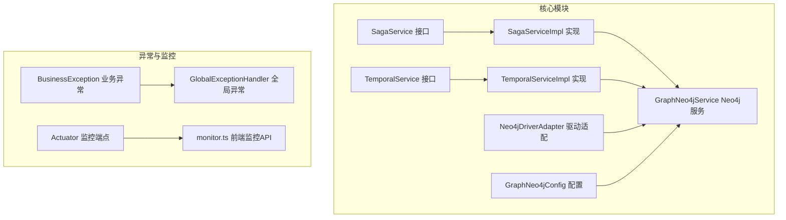
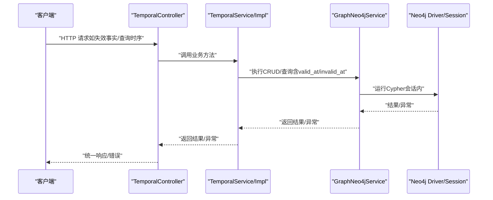
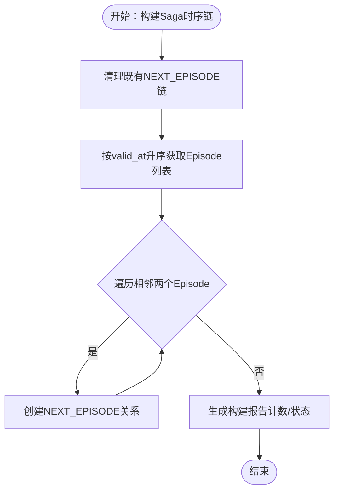
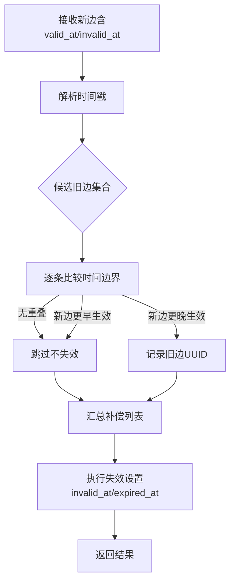
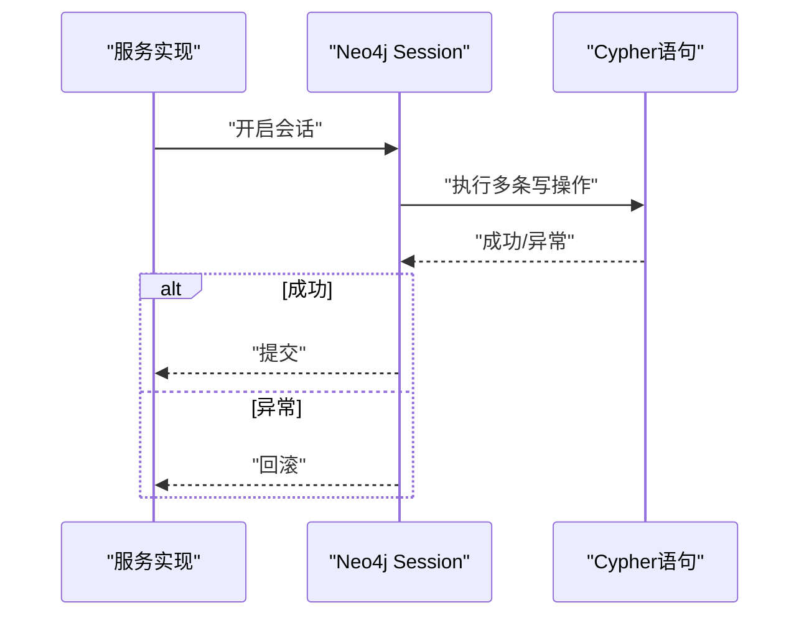
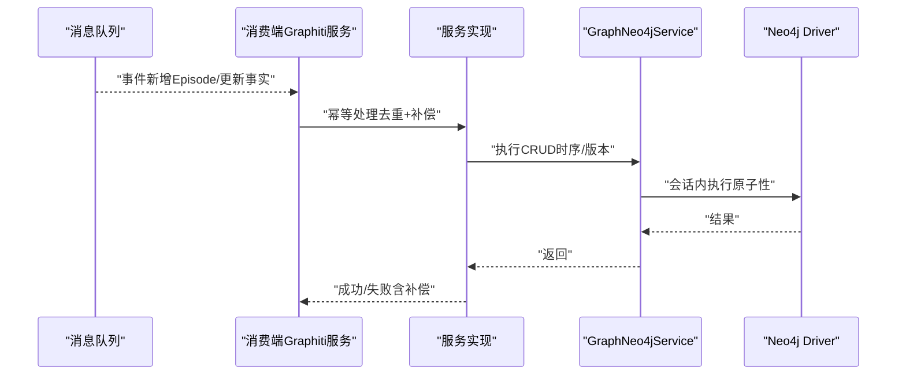
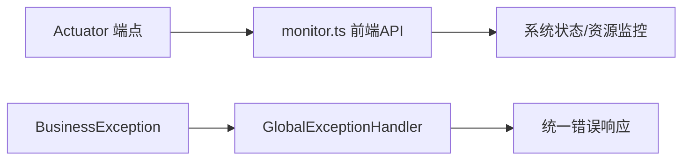
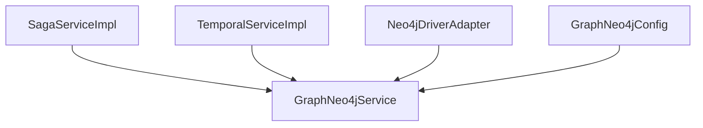

# 事务数据流

<!--<cite>
**本文引用的文件**
- [graphiti-module-core/src/main/java/com/graphiti/module/graphiti/service/SagaService.java](file://graphiti-module-core/src/main/java/com/graphiti/module/graphiti/service/SagaService.java)
- [graphiti-module-core/src/main/java/com/graphiti/module/graphiti/service/impl/SagaServiceImpl.java](file://graphiti-module-core/src/main/java/com/graphiti/module/graphiti/service/impl/SagaServiceImpl.java)
- [graphiti-module-core/src/main/java/com/graphiti/module/graphiti/service/GraphNeo4jService.java](file://graphiti-module-core/src/main/java/com/graphiti/module/graphiti/service/GraphNeo4jService.java)
- [graphiti-module-core/src/main/java/com/graphiti/module/graphiti/service/impl/Neo4jDriverAdapter.java](file://graphiti-module-core/src/main/java/com/graphiti/module/graphiti/service/impl/Neo4jDriverAdapter.java)
- [graphiti-module-core/src/main/java/com/graphiti/module/graphiti/config/GraphNeo4jConfig.java](file://graphiti-module-core/src/main/java/com/graphiti/module/graphiti/config/GraphNeo4jConfig.java)
- [graphiti-module-core/src/main/java/com/graphiti/module/graphiti/service/TemporalService.java](file://graphiti-module-core/src/main/java/com/graphiti/module/graphiti/service/TemporalService.java)
- [graphiti-module-core/src/main/java/com/graphiti/module/graphiti/service/impl/TemporalServiceImpl.java](file://graphiti-module-core/src/main/java/com/graphiti/module/graphiti/service/impl/TemporalServiceImpl.java)
- [graphiti-module-core/src/main/java/com/graphiti/module/graphiti/controller/admin/TemporalController.java](file://graphiti-module-core/src/main/java/com/graphiti/module/graphiti/controller/admin/TemporalController.java)
- [graphiti-framework/graphiti-common/src/main/java/com/raphiti/common/exception/BusinessException.java](file://graphiti-framework/graphiti-common/src/main/java/com/raphiti/common/exception/BusinessException.java)
- [graphiti-framework/graphiti-common/src/main/java/com/raphiti/common/exception/GlobalExceptionHandler.java](file://graphiti-framework/graphiti-common/src/main/java/com/raphiti/common/exception/GlobalExceptionHandler.java)
- [docs/superpowers/specs/2026-05-11-backend-api-impl-design.md](file://docs/superpowers/specs/2026-05-11-backend-api-impl-design.md)
- [graphiti-web/src/api/monitor.ts](file://graphiti-web/src/api/monitor.ts)
- [docs/database-migration-guide.md](file://docs/database-migration-guide.md)
</cite>-->

## 目录
1. [简介](#简介)
2. [项目结构](#项目结构)
3. [核心组件](#核心组件)
4. [架构总览](#架构总览)
5. [详细组件分析](#详细组件分析)
6. [依赖分析](#依赖分析)
7. [性能考虑](#性能考虑)
8. [故障排除指南](#故障排除指南)
9. [结论](#结论)
10. [附录](#附录)

## 简介
本文件聚焦于Graphiti-Java的事务数据流，围绕以下目标展开：
- 分布式事务：以Saga模式为主线，梳理“时序链构建→补偿操作→状态管理→一致性保证”的闭环。
- 本地事务：基于Neo4j Driver的会话级事务语义与ACID特性，说明数据库事务、回滚机制与隔离级别的影响。
- 跨服务事务：通过消息队列与事件驱动实现最终一致性，并结合事务补偿保障一致性。
- 事务监控：覆盖事务日志、状态跟踪、异常处理与恢复机制。
- 性能优化：锁策略、批处理、连接池与超时控制等。
- 调试与故障排除：提供可操作的方法论与最佳实践。

## 项目结构
围绕事务主题，核心代码主要分布在如下模块与文件：
- Saga管理：接口与实现负责Episode时序链的构建与维护。
- Neo4j服务层：封装节点、关系、时序事实的CRUD与查询。
- 时序服务：基于valid_at/invalid_at的时序一致性管理与冲突解决。
- 异常与统一处理：业务异常与全局异常处理，支撑事务失败时的可观测性与恢复。
- 监控与前端：Actuator指标对接与前端监控API。

**图表来源**
- [graphiti-module-core/src/main/java/com/graphiti/module/graphiti/service/SagaService.java:1-40](file://graphiti-module-core/src/main/java/com/graphiti/module/graphiti/service/SagaService.java#L1-L40)
- [graphiti-module-core/src/main/java/com/graphiti/module/graphiti/service/impl/SagaServiceImpl.java:1-147](file://graphiti-module-core/src/main/java/com/graphiti/module/graphiti/service/impl/SagaServiceImpl.java#L1-L147)
- [graphiti-module-core/src/main/java/com/graphiti/module/graphiti/service/GraphNeo4jService.java:1-1347](file://graphiti-module-core/src/main/java/com/graphiti/module/graphiti/service/GraphNeo4jService.java#L1-L1347)
- [graphiti-module-core/src/main/java/com/graphiti/module/graphiti/service/TemporalService.java:1-45](file://graphiti-module-core/src/main/java/com/graphiti/module/graphiti/service/TemporalService.java#L1-L45)
- [graphiti-module-core/src/main/java/com/graphiti/module/graphiti/service/impl/TemporalServiceImpl.java:1-160](file://graphiti-module-core/src/main/java/com/graphiti/module/graphiti/service/impl/TemporalServiceImpl.java#L1-L160)
- [graphiti-module-core/src/main/java/com/graphiti/module/graphiti/service/impl/Neo4jDriverAdapter.java:1-84](file://graphiti-module-core/src/main/java/com/graphiti/module/graphiti/service/impl/Neo4jDriverAdapter.java#L1-L84)
- [graphiti-module-core/src/main/java/com/graphiti/module/graphiti/config/GraphNeo4jConfig.java:1-47](file://graphiti-module-core/src/main/java/com/graphiti/module/graphiti/config/GraphNeo4jConfig.java#L1-L47)
- [graphiti-framework/graphiti-common/src/main/java/com/raphiti/common/exception/BusinessException.java:1-32](file://graphiti-framework/graphiti-common/src/main/java/com/raphiti/common/exception/BusinessException.java#L1-L32)
- [graphiti-framework/graphiti-common/src/main/java/com/raphiti/common/exception/GlobalExceptionHandler.java:1-38](file://graphiti-framework/graphiti-common/src/main/java/com/raphiti/common/exception/GlobalExceptionHandler.java#L1-L38)
- [docs/superpowers/specs/2026-05-11-backend-api-impl-design.md:139-181](file://docs/superpowers/specs/2026-05-11-backend-api-impl-design.md#L139-L181)
- [graphiti-web/src/api/monitor.ts:121-196](file://graphiti-web/src/api/monitor.ts#L121-L196)

**章节来源**
- [graphiti-module-core/src/main/java/com/graphiti/module/graphiti/service/SagaService.java:1-40](file://graphiti-module-core/src/main/java/com/graphiti/module/graphiti/service/SagaService.java#L1-L40)
- [graphiti-module-core/src/main/java/com/graphiti/module/graphiti/service/impl/SagaServiceImpl.java:1-147](file://graphiti-module-core/src/main/java/com/graphiti/module/graphiti/service/impl/SagaServiceImpl.java#L1-L147)
- [graphiti-module-core/src/main/java/com/graphiti/module/graphiti/service/GraphNeo4jService.java:1-1347](file://graphiti-module-core/src/main/java/com/graphiti/module/graphiti/service/GraphNeo4jService.java#L1-L1347)
- [graphiti-module-core/src/main/java/com/graphiti/module/graphiti/service/TemporalService.java:1-45](file://graphiti-module-core/src/main/java/com/graphiti/module/graphiti/service/TemporalService.java#L1-L45)
- [graphiti-module-core/src/main/java/com/graphiti/module/graphiti/service/impl/TemporalServiceImpl.java:1-160](file://graphiti-module-core/src/main/java/com/graphiti/module/graphiti/service/impl/TemporalServiceImpl.java#L1-L160)
- [graphiti-module-core/src/main/java/com/graphiti/module/graphiti/service/impl/Neo4jDriverAdapter.java:1-84](file://graphiti-module-core/src/main/java/com/graphiti/module/graphiti/service/impl/Neo4jDriverAdapter.java#L1-L84)
- [graphiti-module-core/src/main/java/com/graphiti/module/graphiti/config/GraphNeo4jConfig.java:1-47](file://graphiti-module-core/src/main/java/com/graphiti/module/graphiti/config/GraphNeo4jConfig.java#L1-L47)
- [graphiti-framework/graphiti-common/src/main/java/com/raphiti/common/exception/BusinessException.java:1-32](file://graphiti-framework/graphiti-common/src/main/java/com/raphiti/common/exception/BusinessException.java#L1-L32)
- [graphiti-framework/graphiti-common/src/main/java/com/raphiti/common/exception/GlobalExceptionHandler.java:1-38](file://graphiti-framework/graphiti-common/src/main/java/com/raphiti/common/exception/GlobalExceptionHandler.java#L1-L38)
- [docs/superpowers/specs/2026-05-11-backend-api-impl-design.md:139-181](file://docs/superpowers/specs/2026-05-11-backend-api-impl-design.md#L139-L181)
- [graphiti-web/src/api/monitor.ts:121-196](file://graphiti-web/src/api/monitor.ts#L121-L196)

## 核心组件
- SagaService/SagaServiceImpl：负责按valid_at排序构建Episode时序链，维护NEXT_EPISODE关系，提供上下文查询与清理能力。
- GraphNeo4jService：封装Neo4j节点/关系的CRUD、查询、向量索引初始化、全文检索等；为Saga与Temporal提供底层数据访问。
- TemporalService/TemporalServiceImpl：基于valid_at/invalid_at进行时序一致性管理，提供失效标记、历史版本查询与边冲突解决。
- Neo4jDriverAdapter：将GraphNeo4jService适配为通用驱动接口，便于扩展多驱动场景。
- GraphNeo4jConfig：提供Neo4j Driver Bean，集中管理连接参数。
- 异常体系：BusinessException与GlobalExceptionHandler，统一业务异常与参数校验异常的处理，提升事务失败时的可观测性。
- 监控与前端：Actuator指标对接与前端monitor.ts API，用于系统健康、JVM、CPU、内存与数据库连接池状态的可视化。

**章节来源**
- [graphiti-module-core/src/main/java/com/graphiti/module/graphiti/service/SagaService.java:1-40](file://graphiti-module-core/src/main/java/com/graphiti/module/graphiti/service/SagaService.java#L1-L40)
- [graphiti-module-core/src/main/java/com/graphiti/module/graphiti/service/impl/SagaServiceImpl.java:1-147](file://graphiti-module-core/src/main/java/com/graphiti/module/graphiti/service/impl/SagaServiceImpl.java#L1-L147)
- [graphiti-module-core/src/main/java/com/graphiti/module/graphiti/service/GraphNeo4jService.java:1-1347](file://graphiti-module-core/src/main/java/com/graphiti/module/graphiti/service/GraphNeo4jService.java#L1-L1347)
- [graphiti-module-core/src/main/java/com/graphiti/module/graphiti/service/TemporalService.java:1-45](file://graphiti-module-core/src/main/java/com/graphiti/module/graphiti/service/TemporalService.java#L1-L45)
- [graphiti-module-core/src/main/java/com/graphiti/module/graphiti/service/impl/TemporalServiceImpl.java:1-160](file://graphiti-module-core/src/main/java/com/graphiti/module/graphiti/service/impl/TemporalServiceImpl.java#L1-L160)
- [graphiti-module-core/src/main/java/com/graphiti/module/graphiti/service/impl/Neo4jDriverAdapter.java:1-84](file://graphiti-module-core/src/main/java/com/graphiti/module/graphiti/service/impl/Neo4jDriverAdapter.java#L1-L84)
- [graphiti-module-core/src/main/java/com/graphiti/module/graphiti/config/GraphNeo4jConfig.java:1-47](file://graphiti-module-core/src/main/java/com/graphiti/module/graphiti/config/GraphNeo4jConfig.java#L1-L47)
- [graphiti-framework/graphiti-common/src/main/java/com/raphiti/common/exception/BusinessException.java:1-32](file://graphiti-framework/graphiti-common/src/main/java/com/raphiti/common/exception/BusinessException.java#L1-L32)
- [graphiti-framework/graphiti-common/src/main/java/com/raphiti/common/exception/GlobalExceptionHandler.java:1-38](file://graphiti-framework/graphiti-common/src/main/java/com/raphiti/common/exception/GlobalExceptionHandler.java#L1-L38)
- [docs/superpowers/specs/2026-05-11-backend-api-impl-design.md:139-181](file://docs/superpowers/specs/2026-05-11-backend-api-impl-design.md#L139-L181)
- [graphiti-web/src/api/monitor.ts:121-196](file://graphiti-web/src/api/monitor.ts#L121-L196)

## 架构总览
下图展示事务数据流在系统中的位置与交互：请求经由控制器进入服务层，服务层通过Neo4j服务执行数据变更，异常统一由全局处理器捕获，监控通过Actuator暴露指标供前端消费。

**图表来源**
- [graphiti-module-core/src/main/java/com/graphiti/module/graphiti/controller/admin/TemporalController.java:1-67](file://graphiti-module-core/src/main/java/com/graphiti/module/graphiti/controller/admin/TemporalController.java#L1-L67)
- [graphiti-module-core/src/main/java/com/graphiti/module/graphiti/service/TemporalService.java:1-45](file://graphiti-module-core/src/main/java/com/graphiti/module/graphiti/service/TemporalService.java#L1-L45)
- [graphiti-module-core/src/main/java/com/graphiti/module/graphiti/service/impl/TemporalServiceImpl.java:1-160](file://graphiti-module-core/src/main/java/com/graphiti/module/graphiti/service/impl/TemporalServiceImpl.java#L1-L160)
- [graphiti-module-core/src/main/java/com/graphiti/module/graphiti/service/GraphNeo4jService.java:1-1347](file://graphiti-module-core/src/main/java/com/graphiti/module/graphiti/service/GraphNeo4jService.java#L1-L1347)

## 详细组件分析

### Saga模式与时序链数据流
- 触发点：构建时序链（按valid_at升序），生成NEXT_EPISODE链。
- 数据变更：通过GraphNeo4jService在会话内执行匹配与创建关系，形成Episode时序。
- 状态管理：提供上下文查询（前一/后一Episode）、时间线查询与清理接口。
- 一致性保证：通过单次会话内的原子性操作，确保链路的一致性；若中间失败，可回滚该会话（见下一节“本地事务”）。

**图表来源**
- [graphiti-module-core/src/main/java/com/graphiti/module/graphiti/service/impl/SagaServiceImpl.java:28-73](file://graphiti-module-core/src/main/java/com/graphiti/module/graphiti/service/impl/SagaServiceImpl.java#L28-L73)

**章节来源**
- [graphiti-module-core/src/main/java/com/graphiti/module/graphiti/service/SagaService.java:1-40](file://graphiti-module-core/src/main/java/com/graphiti/module/graphiti/service/SagaService.java#L1-L40)
- [graphiti-module-core/src/main/java/com/graphiti/module/graphiti/service/impl/SagaServiceImpl.java:1-147](file://graphiti-module-core/src/main/java/com/graphiti/module/graphiti/service/impl/SagaServiceImpl.java#L1-L147)
- [graphiti-module-core/src/main/java/com/graphiti/module/graphiti/service/GraphNeo4jService.java:1-1347](file://graphiti-module-core/src/main/java/com/graphiti/module/graphiti/service/GraphNeo4jService.java#L1-L1347)

### 时序一致性与补偿操作
- 时序模型：节点与关系具备valid_at/invalid_at字段，用于表达“生效时间”与“失效时间”，支持历史版本查询与任意时刻的事实快照。
- 冲突解决：当新边引入时，依据时间重叠规则判定旧边是否应失效，形成补偿操作（设置invalid_at/expired_at）。
- 服务入口：TemporalController提供统一REST接口，TemporalServiceImpl实现具体逻辑。

**图表来源**
- [graphiti-module-core/src/main/java/com/graphiti/module/graphiti/service/impl/TemporalServiceImpl.java:44-107](file://graphiti-module-core/src/main/java/com/graphiti/module/graphiti/service/impl/TemporalServiceImpl.java#L44-L107)
- [graphiti-module-core/src/main/java/com/graphiti/module/graphiti/controller/admin/TemporalController.java:1-67](file://graphiti-module-core/src/main/java/com/graphiti/module/graphiti/controller/admin/TemporalController.java#L1-L67)

**章节来源**
- [graphiti-module-core/src/main/java/com/graphiti/module/graphiti/service/TemporalService.java:1-45](file://graphiti-module-core/src/main/java/com/graphiti/module/graphiti/service/TemporalService.java#L1-L45)
- [graphiti-module-core/src/main/java/com/graphiti/module/graphiti/service/impl/TemporalServiceImpl.java:1-160](file://graphiti-module-core/src/main/java/com/graphiti/module/graphiti/service/impl/TemporalServiceImpl.java#L1-L160)
- [graphiti-module-core/src/main/java/com/graphiti/module/graphiti/controller/admin/TemporalController.java:1-67](file://graphiti-module-core/src/main/java/com/graphiti/module/graphiti/controller/admin/TemporalController.java#L1-L67)

### 本地事务：Neo4j会话与ACID
- 事务边界：每个服务方法内部使用Session执行一组Cypher，天然具备原子性；失败时回滚该会话，避免部分写入。
- 隔离级别：Neo4j的ACID语义在单个会话内得到保证；跨会话并发需通过上层协调（如幂等设计）与补偿机制。
- 一致性：通过valid_at/invalid_at与NEXT_EPISODE链，确保时序与版本一致性。

**图表来源**
- [graphiti-module-core/src/main/java/com/graphiti/module/graphiti/service/impl/SagaServiceImpl.java:28-73](file://graphiti-module-core/src/main/java/com/graphiti/module/graphiti/service/impl/SagaServiceImpl.java#L28-L73)
- [graphiti-module-core/src/main/java/com/graphiti/module/graphiti/service/impl/TemporalServiceImpl.java:88-107](file://graphiti-module-core/src/main/java/com/graphiti/module/graphiti/service/impl/TemporalServiceImpl.java#L88-L107)
- [graphiti-module-core/src/main/java/com/graphiti/module/graphiti/service/GraphNeo4jService.java:1-1347](file://graphiti-module-core/src/main/java/com/graphiti/module/graphiti/service/GraphNeo4jService.java#L1-L1347)

**章节来源**
- [graphiti-module-core/src/main/java/com/graphiti/module/graphiti/service/impl/SagaServiceImpl.java:1-147](file://graphiti-module-core/src/main/java/com/graphiti/module/graphiti/service/impl/SagaServiceImpl.java#L1-L147)
- [graphiti-module-core/src/main/java/com/graphiti/module/graphiti/service/impl/TemporalServiceImpl.java:1-160](file://graphiti-module-core/src/main/java/com/graphiti/module/graphiti/service/impl/TemporalServiceImpl.java#L1-L160)
- [graphiti-module-core/src/main/java/com/graphiti/module/graphiti/service/GraphNeo4jService.java:1-1347](file://graphiti-module-core/src/main/java/com/graphiti/module/graphiti/service/GraphNeo4jService.java#L1-L1347)

### 跨服务事务：消息队列与最终一致性
- 事件驱动：外部系统通过消息队列发布事件（如“新增Episode”），Graphiti-Java订阅并执行对应Saga/时序更新。
- 最终一致性：通过幂等设计与valid_at/invalid_at实现“先写后补”，在下游消费端进行补偿（如失效旧边、重建链路）。
- 事务补偿：当下游失败时，保留上游事件与重试机制，必要时回放事件以修复不一致。

[本图为概念性流程，无需图表来源]

### 事务监控：日志、状态跟踪与恢复
- Actuator指标：系统健康、JVM内存、CPU使用率、数据库连接池活跃数等，前端monitor.ts通过Actuator端点拉取。
- 日志与异常：统一异常处理BusinessException，记录错误码与消息，便于定位事务失败原因。
- 恢复机制：结合补偿操作与重试策略，对失败的事件进行回放与修复。

**图表来源**
- [docs/superpowers/specs/2026-05-11-backend-api-impl-design.md:139-181](file://docs/superpowers/specs/2026-05-11-backend-api-impl-design.md#L139-L181)
- [graphiti-web/src/api/monitor.ts:121-196](file://graphiti-web/src/api/monitor.ts#L121-L196)
- [graphiti-framework/graphiti-common/src/main/java/com/raphiti/common/exception/BusinessException.java:1-32](file://graphiti-framework/graphiti-common/src/main/java/com/raphiti/common/exception/BusinessException.java#L1-L32)
- [graphiti-framework/graphiti-common/src/main/java/com/raphiti/common/exception/GlobalExceptionHandler.java:1-38](file://graphiti-framework/graphiti-common/src/main/java/com/raphiti/common/exception/GlobalExceptionHandler.java#L1-L38)

**章节来源**
- [docs/superpowers/specs/2026-05-11-backend-api-impl-design.md:139-181](file://docs/superpowers/specs/2026-05-11-backend-api-impl-design.md#L139-L181)
- [graphiti-web/src/api/monitor.ts:121-196](file://graphiti-web/src/api/monitor.ts#L121-L196)
- [graphiti-framework/graphiti-common/src/main/java/com/raphiti/common/exception/BusinessException.java:1-32](file://graphiti-framework/graphiti-common/src/main/java/com/raphiti/common/exception/BusinessException.java#L1-L32)
- [graphiti-framework/graphiti-common/src/main/java/com/raphiti/common/exception/GlobalExceptionHandler.java:1-38](file://graphiti-framework/graphiti-common/src/main/java/com/raphiti/common/exception/GlobalExceptionHandler.java#L1-L38)

## 依赖分析
- SagaServiceImpl依赖GraphNeo4jService，通过Driver在Session内执行Cypher，确保单次构建的原子性。
- TemporalServiceImpl依赖GraphNeo4jService，实现时序一致性与冲突补偿。
- Neo4jDriverAdapter将GraphNeo4jService适配为通用接口，便于未来扩展其他驱动。
- GraphNeo4jConfig提供Driver Bean，集中管理连接参数。

**图表来源**
- [graphiti-module-core/src/main/java/com/graphiti/module/graphiti/service/impl/SagaServiceImpl.java:1-147](file://graphiti-module-core/src/main/java/com/graphiti/module/graphiti/service/impl/SagaServiceImpl.java#L1-L147)
- [graphiti-module-core/src/main/java/com/graphiti/module/graphiti/service/impl/TemporalServiceImpl.java:1-160](file://graphiti-module-core/src/main/java/com/graphiti/module/graphiti/service/impl/TemporalServiceImpl.java#L1-L160)
- [graphiti-module-core/src/main/java/com/graphiti/module/graphiti/service/impl/Neo4jDriverAdapter.java:1-84](file://graphiti-module-core/src/main/java/com/graphiti/module/graphiti/service/impl/Neo4jDriverAdapter.java#L1-L84)
- [graphiti-module-core/src/main/java/com/graphiti/module/graphiti/config/GraphNeo4jConfig.java:1-47](file://graphiti-module-core/src/main/java/com/graphiti/module/graphiti/config/GraphNeo4jConfig.java#L1-L47)

**章节来源**
- [graphiti-module-core/src/main/java/com/graphiti/module/graphiti/service/impl/SagaServiceImpl.java:1-147](file://graphiti-module-core/src/main/java/com/graphiti/module/graphiti/service/impl/SagaServiceImpl.java#L1-L147)
- [graphiti-module-core/src/main/java/com/graphiti/module/graphiti/service/impl/TemporalServiceImpl.java:1-160](file://graphiti-module-core/src/main/java/com/graphiti/module/graphiti/service/impl/TemporalServiceImpl.java#L1-L160)
- [graphiti-module-core/src/main/java/com/graphiti/module/graphiti/service/impl/Neo4jDriverAdapter.java:1-84](file://graphiti-module-core/src/main/java/com/graphiti/module/graphiti/service/impl/Neo4jDriverAdapter.java#L1-L84)
- [graphiti-module-core/src/main/java/com/graphiti/module/graphiti/config/GraphNeo4jConfig.java:1-47](file://graphiti-module-core/src/main/java/com/graphiti/module/graphiti/config/GraphNeo4jConfig.java#L1-L47)

## 性能考虑
- 锁策略：在高并发写入场景，建议对同一graphId加粗粒度锁或采用幂等写入，避免重复创建NEXT_EPISODE链。
- 批处理：构建时序链时尽量减少多次会话往返，合并Cypher或使用事务批处理。
- 连接池：结合HikariCP配置（最大池大小、最小空闲、连接超时、空闲超时、最大生命周期）提升吞吐。
- 超时控制：为长事务设置合理超时，防止长时间占用会话导致资源紧张。
- 索引与查询：为valid_at/invalid_at建立索引，优化时序查询；为group_id建立索引，加速图谱级操作。

**章节来源**
- [docs/database-migration-guide.md:174-190](file://docs/database-migration-guide.md#L174-L190)

## 故障排除指南
- 事务失败排查
  - 检查服务日志与异常栈，定位BusinessException与GlobalExceptionHandler的错误码与消息。
  - 确认会话内是否发生异常导致回滚，核对Cypher执行路径。
- 时序不一致
  - 核查valid_at/invalid_at字段是否正确设置，检查冲突解决逻辑是否生效。
  - 使用历史版本查询接口比对不同时间点的事实快照。
- 监控告警
  - 通过monitor.ts拉取Actuator指标，关注JVM内存、CPU使用率与数据库连接池活跃数。
  - 若Neo4j或MySQL健康状态异常，优先检查连接配置与网络连通性。

**章节来源**
- [graphiti-framework/graphiti-common/src/main/java/com/raphiti/common/exception/BusinessException.java:1-32](file://graphiti-framework/graphiti-common/src/main/java/com/raphiti/common/exception/BusinessException.java#L1-L32)
- [graphiti-framework/graphiti-common/src/main/java/com/raphiti/common/exception/GlobalExceptionHandler.java:1-38](file://graphiti-framework/graphiti-common/src/main/java/com/raphiti/common/exception/GlobalExceptionHandler.java#L1-L38)
- [docs/superpowers/specs/2026-05-11-backend-api-impl-design.md:139-181](file://docs/superpowers/specs/2026-05-11-backend-api-impl-design.md#L139-L181)
- [graphiti-web/src/api/monitor.ts:121-196](file://graphiti-web/src/api/monitor.ts#L121-L196)

## 结论
Graphiti-Java通过Saga模式与时序服务实现了强一致的时序链与版本管理，结合Neo4j的会话级事务保证了本地一致性。跨服务场景下，采用消息队列与事件驱动实现最终一致性，并通过补偿操作与监控体系保障系统的可观测性与可恢复性。配合性能优化与故障排除方法，可满足复杂知识图谱场景下的事务需求。

## 附录
- 建议在生产环境启用：
  - 幂等写入与事件重试
  - 合理的连接池与超时配置
  - 时序字段索引与查询优化
  - 统一日志与异常处理规范

[本节为通用建议，无需章节来源]