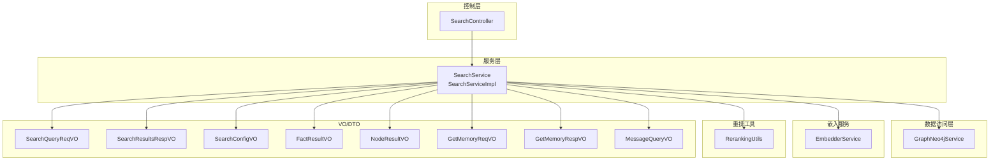
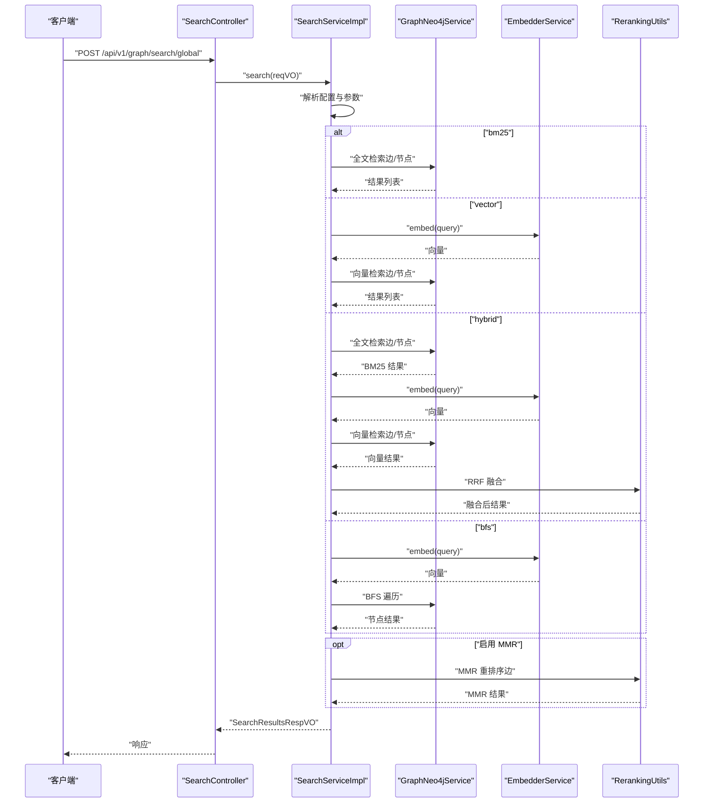
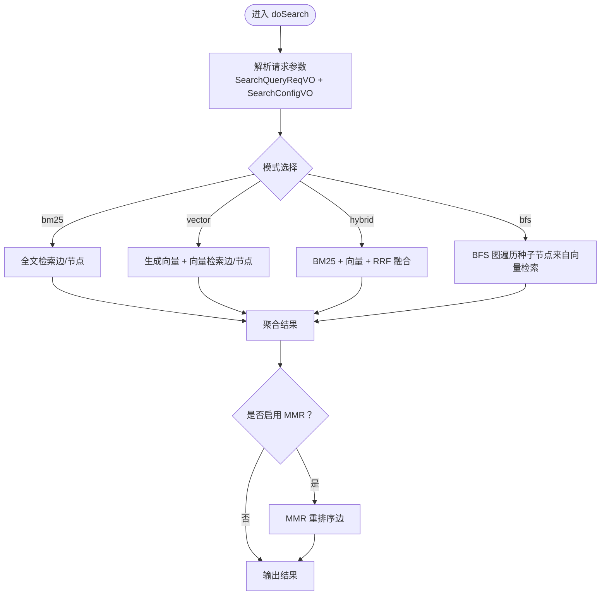
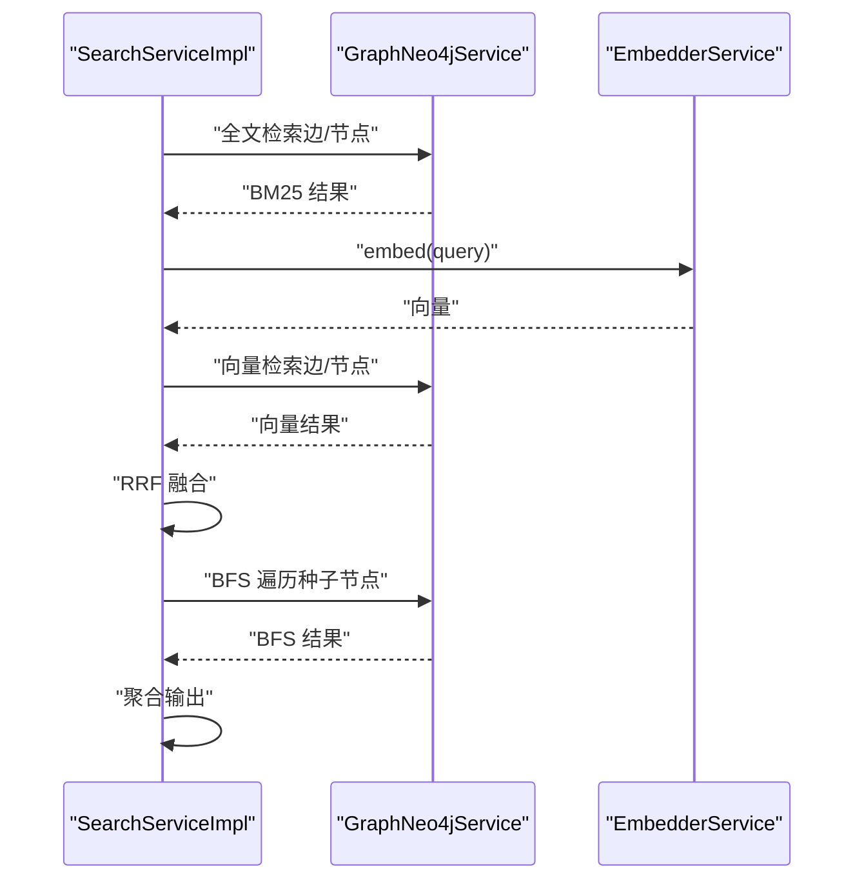
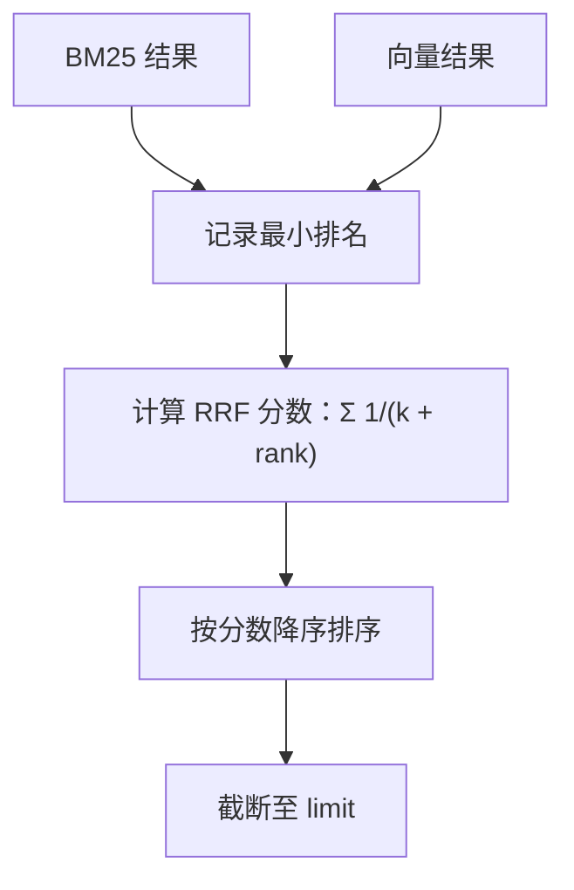
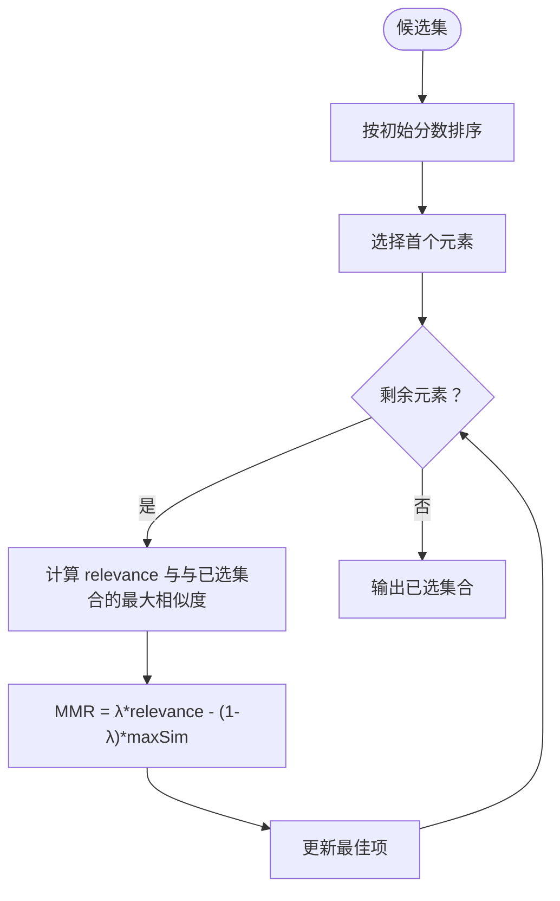
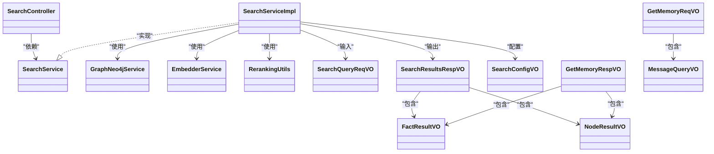

# 搜索数据流

<!--<cite>
**本文引用的文件**
- [SearchServiceImpl.java](file://graphiti-module-core/src/main/java/com/graphiti/module/graphiti/service/impl/SearchServiceImpl.java)
- [SearchService.java](file://graphiti-module-core/src/main/java/com/graphiti/module/graphiti/service/SearchService.java)
- [SearchController.java](file://graphiti-module-core/src/main/java/com/graphiti/module/graphiti/controller/admin/SearchController.java)
- [GraphNeo4jService.java](file://graphiti-module-core/src/main/java/com/graphiti/module/graphiti/service/GraphNeo4jService.java)
- [EmbedderService.java](file://graphiti-module-core/src/main/java/com/graphiti/module/graphiti/service/EmbedderService.java)
- [RerankingUtils.java](file://graphiti-module-core/src/main/java/com/graphiti/module/graphiti/util/RerankingUtils.java)
- [SearchQueryReqVO.java](file://graphiti-module-core/src/main/java/com/graphiti/module/graphiti/vo/search/SearchQueryReqVO.java)
- [SearchResultsRespVO.java](file://graphiti-module-core/src/main/java/com/graphiti/module/graphiti/vo/search/SearchResultsRespVO.java)
- [SearchConfigVO.java](file://graphiti-module-core/src/main/java/com/graphiti/module/graphiti/vo/search/SearchConfigVO.java)
- [FactResultVO.java](file://graphiti-module-core/src/main/java/com/graphiti/module/graphiti/vo/search/FactResultVO.java)
- [NodeResultVO.java](file://graphiti-module-core/src/main/java/com/graphiti/module/graphiti/vo/search/NodeResultVO.java)
- [GetMemoryReqVO.java](file://graphiti-module-core/src/main/java/com/graphiti/module/graphiti/vo/search/GetMemoryReqVO.java)
- [GetMemoryRespVO.java](file://graphiti-module-core/src/main/java/com/graphiti/module/graphiti/vo/search/GetMemoryRespVO.java)
- [MessageQueryVO.java](file://graphiti-module-core/src/main/java/com/graphiti/module/graphiti/vo/search/MessageQueryVO.java)
- [2026-05-11-graphiti-java-full-migration-plan.md](file://docs/superpowers/plans/2026-05-11-graphiti-java-full-migration-plan.md)
- [pipeline.md](file://docs/pipeline.md)
</cite>-->

## 目录
1. [简介](#简介)
2. [项目结构](#项目结构)
3. [核心组件](#核心组件)
4. [架构总览](#架构总览)
5. [详细组件分析](#详细组件分析)
6. [依赖分析](#依赖分析)
7. [性能考虑](#性能考虑)
8. [故障排查指南](#故障排查指南)
9. [结论](#结论)
10. [附录](#附录)

## 简介
本文件面向开发者，系统化梳理 Graphiti-Java 混合搜索系统的数据流与实现细节。文档覆盖以下关键主题：
- 查询解析阶段：查询预处理 → 意图识别 → 参数提取 → 查询转换
- 多数据源检索：BM25 全文检索 → 向量相似度搜索 → 图遍历查询 → 结果聚合
- 结果融合算法：权重计算 → 相关性评分 → 去重处理 → 排序优化
- 重排序机制：reranking 算法 → 上下文感知 → 个性化调整 → 最终排序
- 性能优化策略：索引优化 → 缓存机制 → 并行处理 → 结果限制
- 搜索调试与监控方法

## 项目结构
围绕搜索功能的关键模块与文件如下：
- 控制层：SearchController 提供 REST 接口，支持全局搜索、图谱搜索、混合检索、语义检索、BFS 检索等
- 服务层：SearchService 接口与 SearchServiceImpl 实现，负责混合检索编排与结果聚合
- 数据访问层：GraphNeo4jService 封装 Neo4j 的全文与向量检索、BFS 遍历等
- 嵌入服务：EmbedderService 抽象不同提供商的向量嵌入能力
- 重排工具：RerankingUtils 提供 RRF、MMR、按节点距离与提及次数等重排策略
- VO/DTO：SearchQueryReqVO、SearchResultsRespVO、SearchConfigVO、FactResultVO、NodeResultVO、GetMemoryReqVO、GetMemoryRespVO、MessageQueryVO 定义输入输出结构

图表来源
- [SearchController.java:1-138](file://graphiti-module-core/src/main/java/com/graphiti/module/graphiti/controller/admin/SearchController.java#L1-138)
- [SearchService.java:1-54](file://graphiti-module-core/src/main/java/com/graphiti/module/graphiti/service/SearchService.java#L1-54)
- [SearchServiceImpl.java:1-175](file://graphiti-module-core/src/main/java/com/graphiti/module/graphiti/service/impl/SearchServiceImpl.java#L1-175)
- [GraphNeo4jService.java:608-791](file://graphiti-module-core/src/main/java/com/graphiti/module/graphiti/service/GraphNeo4jService.java#L608-791)
- [EmbedderService.java:1-41](file://graphiti-module-core/src/main/java/com/graphiti/module/graphiti/service/EmbedderService.java#L1-41)
- [RerankingUtils.java:1-386](file://graphiti-module-core/src/main/java/com/graphiti/module/graphiti/util/RerankingUtils.java#L1-386)
- [SearchQueryReqVO.java:1-33](file://graphiti-module-core/src/main/java/com/graphiti/module/graphiti/vo/search/SearchQueryReqVO.java#L1-33)
- [SearchResultsRespVO.java:1-28](file://graphiti-module-core/src/main/java/com/graphiti/module/graphiti/vo/search/SearchResultsRespVO.java#L1-28)
- [SearchConfigVO.java:1-40](file://graphiti-module-core/src/main/java/com/graphiti/module/graphiti/vo/search/SearchConfigVO.java#L1-40)
- [FactResultVO.java:1-59](file://graphiti-module-core/src/main/java/com/graphiti/module/graphiti/vo/search/FactResultVO.java#L1-59)
- [NodeResultVO.java:1-31](file://graphiti-module-core/src/main/java/com/graphiti/module/graphiti/vo/search/NodeResultVO.java#L1-31)
- [GetMemoryReqVO.java:1-29](file://graphiti-module-core/src/main/java/com/graphiti/module/graphiti/vo/search/GetMemoryReqVO.java#L1-29)
- [GetMemoryRespVO.java:1-25](file://graphiti-module-core/src/main/java/com/graphiti/module/graphiti/vo/search/GetMemoryRespVO.java#L1-25)
- [MessageQueryVO.java:1-24](file://graphiti-module-core/src/main/java/com/graphiti/module/graphiti/vo/search/MessageQueryVO.java#L1-24)

章节来源
- [SearchController.java:1-138](file://graphiti-module-core/src/main/java/com/graphiti/module/graphiti/controller/admin/SearchController.java#L1-138)
- [SearchService.java:1-54](file://graphiti-module-core/src/main/java/com/graphiti/module/graphiti/service/SearchService.java#L1-54)
- [SearchServiceImpl.java:1-175](file://graphiti-module-core/src/main/java/com/graphiti/module/graphiti/service/impl/SearchServiceImpl.java#L1-175)
- [GraphNeo4jService.java:608-791](file://graphiti-module-core/src/main/java/com/graphiti/module/graphiti/service/GraphNeo4jService.java#L608-791)
- [EmbedderService.java:1-41](file://graphiti-module-core/src/main/java/com/graphiti/module/graphiti/service/EmbedderService.java#L1-41)
- [RerankingUtils.java:1-386](file://graphiti-module-core/src/main/java/com/graphiti/module/graphiti/util/RerankingUtils.java#L1-386)
- [SearchQueryReqVO.java:1-33](file://graphiti-module-core/src/main/java/com/graphiti/module/graphiti/vo/search/SearchQueryReqVO.java#L1-33)
- [SearchResultsRespVO.java:1-28](file://graphiti-module-core/src/main/java/com/graphiti/module/graphiti/vo/search/SearchResultsRespVO.java#L1-28)
- [SearchConfigVO.java:1-40](file://graphiti-module-core/src/main/java/com/graphiti/module/graphiti/vo/search/SearchConfigVO.java#L1-40)
- [FactResultVO.java:1-59](file://graphiti-module-core/src/main/java/com/graphiti/module/graphiti/vo/search/FactResultVO.java#L1-59)
- [NodeResultVO.java:1-31](file://graphiti-module-core/src/main/java/com/graphiti/module/graphiti/vo/search/NodeResultVO.java#L1-31)
- [GetMemoryReqVO.java:1-29](file://graphiti-module-core/src/main/java/com/graphiti/module/graphiti/vo/search/GetMemoryReqVO.java#L1-29)
- [GetMemoryRespVO.java:1-25](file://graphiti-module-core/src/main/java/com/graphiti/module/graphiti/vo/search/GetMemoryRespVO.java#L1-25)
- [MessageQueryVO.java:1-24](file://graphiti-module-core/src/main/java/com/graphiti/module/graphiti/vo/search/MessageQueryVO.java#L1-24)

## 核心组件
- 控制器层：提供 REST 接口，封装请求参数校验与响应包装，支持全局搜索、图谱搜索、混合检索、语义检索、BFS 检索等场景
- 服务层：实现混合检索编排，根据配置选择 BM25、向量、BFS 等策略，并进行 RRF 融合与 MMR 重排序
- 数据访问层：封装 Neo4j 的全文索引与向量索引查询，以及 BFS 遍历
- 嵌入服务：抽象不同提供商的嵌入能力，统一返回向量
- 重排工具：提供 RRF、MMR、按节点距离与提及次数等重排策略
- VO/DTO：定义请求、响应与配置的数据结构

章节来源
- [SearchController.java:33-136](file://graphiti-module-core/src/main/java/com/graphiti/module/graphiti/controller/admin/SearchController.java#L33-136)
- [SearchService.java:15-53](file://graphiti-module-core/src/main/java/com/graphiti/module/graphiti/service/SearchService.java#L15-53)
- [SearchServiceImpl.java:26-148](file://graphiti-module-core/src/main/java/com/graphiti/module/graphiti/service/impl/SearchServiceImpl.java#L26-148)
- [GraphNeo4jService.java:617-762](file://graphiti-module-core/src/main/java/com/graphiti/module/graphiti/service/GraphNeo4jService.java#L617-762)
- [EmbedderService.java:9-40](file://graphiti-module-core/src/main/java/com/graphiti/module/graphiti/service/EmbedderService.java#L9-40)
- [RerankingUtils.java:32-314](file://graphiti-module-core/src/main/java/com/graphiti/module/graphiti/util/RerankingUtils.java#L32-314)
- [SearchQueryReqVO.java:14-32](file://graphiti-module-core/src/main/java/com/graphiti/module/graphiti/vo/search/SearchQueryReqVO.java#L14-32)
- [SearchResultsRespVO.java:13-27](file://graphiti-module-core/src/main/java/com/graphiti/module/graphiti/vo/search/SearchResultsRespVO.java#L13-27)
- [SearchConfigVO.java:13-39](file://graphiti-module-core/src/main/java/com/graphiti/module/graphiti/vo/search/SearchConfigVO.java#L13-39)

## 架构总览
混合搜索系统采用“控制层 → 服务层 → 数据访问层 → 嵌入服务 → 重排工具”的分层架构。服务层根据配置选择不同的检索策略，将多路结果进行 RRF 融合与 MMR 重排序，最终输出统一的响应结构。

图表来源
- [SearchController.java:33-136](file://graphiti-module-core/src/main/java/com/graphiti/module/graphiti/controller/admin/SearchController.java#L33-136)
- [SearchServiceImpl.java:97-148](file://graphiti-module-core/src/main/java/com/graphiti/module/graphiti/service/impl/SearchServiceImpl.java#L97-148)
- [GraphNeo4jService.java:617-762](file://graphiti-module-core/src/main/java/com/graphiti/module/graphiti/service/GraphNeo4jService.java#L617-762)
- [EmbedderService.java:17-25](file://graphiti-module-core/src/main/java/com/graphiti/module/graphiti/service/EmbedderService.java#L17-25)
- [RerankingUtils.java:47-86](file://graphiti-module-core/src/main/java/com/graphiti/module/graphiti/util/RerankingUtils.java#L47-86)

## 详细组件分析

### 查询解析阶段
- 查询预处理：控制器层对请求进行参数校验与安全包装；服务层解析 SearchQueryReqVO，合并默认配置 SearchConfigVO
- 意图识别：通过 SearchConfigVO.mode 识别检索模式（bm25/vector/hybrid/bfs）
- 参数提取：从请求中提取 query、groupIds、maxFacts、enableRerank、config 等关键参数
- 查询转换：将自然语言查询转换为嵌入向量（向量模式），或直接作为全文检索关键词（BM25 模式）

图表来源
- [SearchServiceImpl.java:97-148](file://graphiti-module-core/src/main/java/com/graphiti/module/graphiti/service/impl/SearchServiceImpl.java#L97-148)
- [SearchQueryReqVO.java:14-32](file://graphiti-module-core/src/main/java/com/graphiti/module/graphiti/vo/search/SearchQueryReqVO.java#L14-32)
- [SearchConfigVO.java:13-39](file://graphiti-module-core/src/main/java/com/graphiti/module/graphiti/vo/search/SearchConfigVO.java#L13-39)

章节来源
- [SearchController.java:33-136](file://graphiti-module-core/src/main/java/com/graphiti/module/graphiti/controller/admin/SearchController.java#L33-136)
- [SearchServiceImpl.java:26-148](file://graphiti-module-core/src/main/java/com/graphiti/module/graphiti/service/impl/SearchServiceImpl.java#L26-148)
- [SearchQueryReqVO.java:14-32](file://graphiti-module-core/src/main/java/com/graphiti/module/graphiti/vo/search/SearchQueryReqVO.java#L14-32)
- [SearchConfigVO.java:13-39](file://graphiti-module-core/src/main/java/com/graphiti/module/graphiti/vo/search/SearchConfigVO.java#L13-39)

### 多数据源检索
- BM25 全文检索：GraphNeo4jService 调用 Neo4j 全文索引查询节点与边，返回带分数的结果
- 向量相似度搜索：EmbedderService 生成查询向量，GraphNeo4jService 调用向量索引查询节点与边
- 图遍历查询：以 BM25/向量检索得到的节点作为种子，执行 BFS 遍历，扩展邻域节点
- 结果聚合：将各路结果合并为统一的响应结构，分别统计事实与节点数量

图表来源
- [SearchServiceImpl.java:152-174](file://graphiti-module-core/src/main/java/com/graphiti/module/graphiti/service/impl/SearchServiceImpl.java#L152-174)
- [GraphNeo4jService.java:617-762](file://graphiti-module-core/src/main/java/com/graphiti/module/graphiti/service/GraphNeo4jService.java#L617-762)
- [EmbedderService.java:17-25](file://graphiti-module-core/src/main/java/com/graphiti/module/graphiti/service/EmbedderService.java#L17-25)

章节来源
- [GraphNeo4jService.java:617-762](file://graphiti-module-core/src/main/java/com/graphiti/module/graphiti/service/GraphNeo4jService.java#L617-762)
- [EmbedderService.java:17-25](file://graphiti-module-core/src/main/java/com/graphiti/module/graphiti/service/EmbedderService.java#L17-25)
- [SearchServiceImpl.java:152-174](file://graphiti-module-core/src/main/java/com/graphiti/module/graphiti/service/impl/SearchServiceImpl.java#L152-174)

### 结果融合算法
- RRF（倒数排名融合）：对多路检索结果按首次出现排名计算分数，再综合排序
- 权重计算：可通过 SearchConfigVO 的 bm25Weight、vectorWeight 控制不同策略权重（当前实现以 RRF 为主）
- 相关性评分：BM25 返回分数，向量检索返回相似度分数
- 去重处理：按 UUID 去重，保留最高 RRF 分数
- 排序优化：按 RRF 分数降序，限制输出数量

图表来源
- [SearchServiceImpl.java:255-284](file://graphiti-module-core/src/main/java/com/graphiti/module/graphiti/service/impl/SearchServiceImpl.java#L255-284)
- [RerankingUtils.java:47-86](file://graphiti-module-core/src/main/java/com/graphiti/module/graphiti/util/RerankingUtils.java#L47-86)

章节来源
- [SearchServiceImpl.java:115-124](file://graphiti-module-core/src/main/java/com/graphiti/module/graphiti/service/impl/SearchServiceImpl.java#L115-124)
- [RerankingUtils.java:47-86](file://graphiti-module-core/src/main/java/com/graphiti/module/graphiti/util/RerankingUtils.java#L47-86)

### 重排序机制
- MMR（最大边际相关性）：在候选集中选择与已选集合最不相似的项，平衡相关性与多样性
- 上下文感知：当前实现通过文本相似度与向量相似度结合，提升上下文一致性
- 个性化调整：通过 SearchConfigVO.mmrLambda 调整相关性与多样性的权衡
- 最终排序：按 MMR 分数降序输出

图表来源
- [RerankingUtils.java:188-254](file://graphiti-module-core/src/main/java/com/graphiti/module/graphiti/util/RerankingUtils.java#L188-254)
- [SearchServiceImpl.java:136-139](file://graphiti-module-core/src/main/java/com/graphiti/module/graphiti/service/impl/SearchServiceImpl.java#L136-139)

章节来源
- [RerankingUtils.java:88-174](file://graphiti-module-core/src/main/java/com/graphiti/module/graphiti/util/RerankingUtils.java#L88-174)
- [SearchServiceImpl.java:136-139](file://graphiti-module-core/src/main/java/com/graphiti/module/graphiti/service/impl/SearchServiceImpl.java#L136-139)

### 搜索性能优化策略
- 索引优化：Neo4j 向量索引与全文索引需在启动时初始化，确保检索效率
- 缓存机制：可结合 Redis 或应用内缓存对热点查询结果进行缓存（当前实现未直接体现，建议在服务层增加缓存层）
- 并行处理：对多图谱 groupIds 的检索可并行执行，减少总延迟
- 结果限制：通过 SearchConfigVO.limit 控制每路检索与最终输出的数量

章节来源
- [GraphNeo4jService.java:768-791](file://graphiti-module-core/src/main/java/com/graphiti/module/graphiti/service/GraphNeo4jService.java#L768-791)
- [SearchConfigVO.java:13-39](file://graphiti-module-core/src/main/java/com/graphiti/module/graphiti/vo/search/SearchConfigVO.java#L13-39)
- [SearchServiceImpl.java:101-134](file://graphiti-module-core/src/main/java/com/graphiti/module/graphiti/service/impl/SearchServiceImpl.java#L101-134)

### 搜索调试与监控方法
- 日志记录：服务层使用日志记录查询、配置与中间结果，便于定位问题
- 异常处理：控制器层对资源不存在等情况抛出业务异常，便于前端提示
- 监控指标：建议在服务层埋点统计检索耗时、命中率、错误率等指标（当前实现未直接体现，建议扩展）

章节来源
- [SearchController.java:70-75](file://graphiti-module-core/src/main/java/com/graphiti/module/graphiti/controller/admin/SearchController.java#L70-75)
- [SearchServiceImpl.java:97-148](file://graphiti-module-core/src/main/java/com/graphiti/module/graphiti/service/impl/SearchServiceImpl.java#L97-148)

## 依赖分析
- SearchController 依赖 SearchService
- SearchServiceImpl 依赖 GraphNeo4jService、EmbedderService、RerankingUtils
- GraphNeo4jService 依赖 Neo4j Driver 与配置
- VO/DTO 之间存在一对一映射关系，保证请求与响应结构清晰

图表来源
- [SearchController.java:30-31](file://graphiti-module-core/src/main/java/com/graphiti/module/graphiti/controller/admin/SearchController.java#L30-31)
- [SearchService.java:15-53](file://graphiti-module-core/src/main/java/com/graphiti/module/graphiti/service/SearchService.java#L15-53)
- [SearchServiceImpl.java:23-24](file://graphiti-module-core/src/main/java/com/graphiti/module/graphiti/service/impl/SearchServiceImpl.java#L23-24)
- [GraphNeo4jService.java:23-24](file://graphiti-module-core/src/main/java/com/graphiti/module/graphiti/service/GraphNeo4jService.java#L23-24)
- [EmbedderService.java:9-40](file://graphiti-module-core/src/main/java/com/graphiti/module/graphiti/service/EmbedderService.java#L9-40)
- [RerankingUtils.java](file://graphiti-module-core/src/main/java/com/graphiti/module/graphiti/util/RerankingUtils.java#L19)
- [SearchQueryReqVO.java:14-32](file://graphiti-module-core/src/main/java/com/graphiti/module/graphiti/vo/search/SearchQueryReqVO.java#L14-32)
- [SearchResultsRespVO.java:13-27](file://graphiti-module-core/src/main/java/com/graphiti/module/graphiti/vo/search/SearchResultsRespVO.java#L13-27)
- [SearchConfigVO.java:13-39](file://graphiti-module-core/src/main/java/com/graphiti/module/graphiti/vo/search/SearchConfigVO.java#L13-39)
- [FactResultVO.java:13-58](file://graphiti-module-core/src/main/java/com/graphiti/module/graphiti/vo/search/FactResultVO.java#L13-58)
- [NodeResultVO.java:12-30](file://graphiti-module-core/src/main/java/com/graphiti/module/graphiti/vo/search/NodeResultVO.java#L12-30)
- [GetMemoryReqVO.java:15-28](file://graphiti-module-core/src/main/java/com/graphiti/module/graphiti/vo/search/GetMemoryReqVO.java#L15-28)
- [GetMemoryRespVO.java:12-24](file://graphiti-module-core/src/main/java/com/graphiti/module/graphiti/vo/search/GetMemoryRespVO.java#L12-24)
- [MessageQueryVO.java:12-23](file://graphiti-module-core/src/main/java/com/graphiti/module/graphiti/vo/search/MessageQueryVO.java#L12-23)

章节来源
- [SearchController.java:30-31](file://graphiti-module-core/src/main/java/com/graphiti/module/graphiti/controller/admin/SearchController.java#L30-31)
- [SearchService.java:15-53](file://graphiti-module-core/src/main/java/com/graphiti/module/graphiti/service/SearchService.java#L15-53)
- [SearchServiceImpl.java:23-24](file://graphiti-module-core/src/main/java/com/graphiti/module/graphiti/service/impl/SearchServiceImpl.java#L23-24)
- [GraphNeo4jService.java:23-24](file://graphiti-module-core/src/main/java/com/graphiti/module/graphiti/service/GraphNeo4jService.java#L23-24)
- [EmbedderService.java:9-40](file://graphiti-module-core/src/main/java/com/graphiti/module/graphiti/service/EmbedderService.java#L9-40)
- [RerankingUtils.java](file://graphiti-module-core/src/main/java/com/graphiti/module/graphiti/util/RerankingUtils.java#L19)
- [SearchQueryReqVO.java:14-32](file://graphiti-module-core/src/main/java/com/graphiti/module/graphiti/vo/search/SearchQueryReqVO.java#L14-32)
- [SearchResultsRespVO.java:13-27](file://graphiti-module-core/src/main/java/com/graphiti/module/graphiti/vo/search/SearchResultsRespVO.java#L13-27)
- [SearchConfigVO.java:13-39](file://graphiti-module-core/src/main/java/com/graphiti/module/graphiti/vo/search/SearchConfigVO.java#L13-39)
- [FactResultVO.java:13-58](file://graphiti-module-core/src/main/java/com/graphiti/module/graphiti/vo/search/FactResultVO.java#L13-58)
- [NodeResultVO.java:12-30](file://graphiti-module-core/src/main/java/com/graphiti/module/graphiti/vo/search/NodeResultVO.java#L12-30)
- [GetMemoryReqVO.java:15-28](file://graphiti-module-core/src/main/java/com/graphiti/module/graphiti/vo/search/GetMemoryReqVO.java#L15-28)
- [GetMemoryRespVO.java:12-24](file://graphiti-module-core/src/main/java/com/graphiti/module/graphiti/vo/search/GetMemoryRespVO.java#L12-24)
- [MessageQueryVO.java:12-23](file://graphiti-module-core/src/main/java/com/graphiti/module/graphiti/vo/search/MessageQueryVO.java#L12-23)

## 性能考虑
- 索引初始化：启动时调用向量索引初始化，避免运行时首次查询的冷启动开销
- 并行检索：对多图谱 groupIds 的检索可并行执行，缩短总延迟
- 结果限制：合理设置 limit，避免返回过多数据造成内存与网络压力
- 缓存策略：建议引入缓存层（如 Redis）对热点查询结果进行缓存，降低重复查询成本

章节来源
- [GraphNeo4jService.java:768-791](file://graphiti-module-core/src/main/java/com/graphiti/module/graphiti/service/GraphNeo4jService.java#L768-791)
- [SearchServiceImpl.java:101-134](file://graphiti-module-core/src/main/java/com/graphiti/module/graphiti/service/impl/SearchServiceImpl.java#L101-134)
- [SearchConfigVO.java:13-39](file://graphiti-module-core/src/main/java/com/graphiti/module/graphiti/vo/search/SearchConfigVO.java#L13-39)

## 故障排查指南
- 全文/向量索引缺失：当检索失败时，检查 Neo4j 是否已创建全文索引与向量索引
- 向量维度不匹配：确保嵌入维度与向量索引配置一致
- 查询为空或参数非法：控制器层对必填字段进行校验，若报错需检查请求体
- 结果为空：确认 groupIds 是否正确、数据是否已导入、索引是否已建立

章节来源
- [GraphNeo4jService.java:645-647](file://graphiti-module-core/src/main/java/com/graphiti/module/graphiti/service/GraphNeo4jService.java#L645-647)
- [SearchController.java:70-75](file://graphiti-module-core/src/main/java/com/graphiti/module/graphiti/controller/admin/SearchController.java#L70-75)

## 结论
Graphiti-Java 的混合搜索系统通过清晰的分层设计与可插拔的检索策略，实现了 BM25、向量与图遍历的有机融合。借助 RRF 与 MMR 等重排算法，系统在准确性与多样性之间取得良好平衡。建议后续增强缓存与监控能力，进一步提升性能与可观测性。

## 附录
- 参考迁移计划与管道文档，了解 RRF 与 MMR 的设计思路与配置示例

章节来源
- [2026-05-11-graphiti-java-full-migration-plan.md:839-974](file://docs/superpowers/plans/2026-05-11-graphiti-java-full-migration-plan.md#L839-974)
- [pipeline.md:1126-1311](file://docs/pipeline.md#L1126-1311)