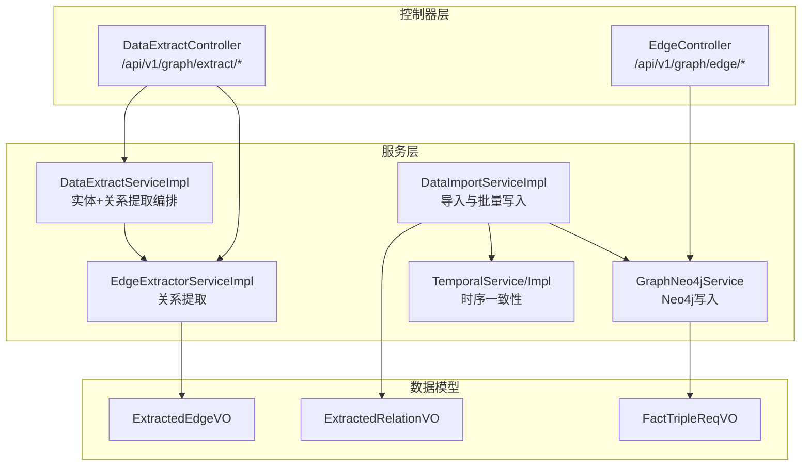
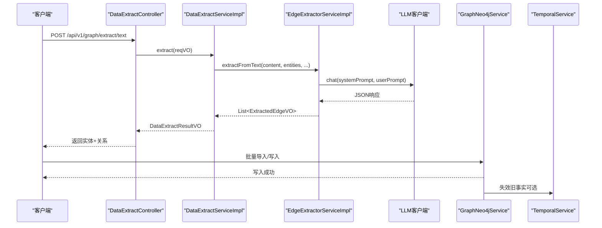
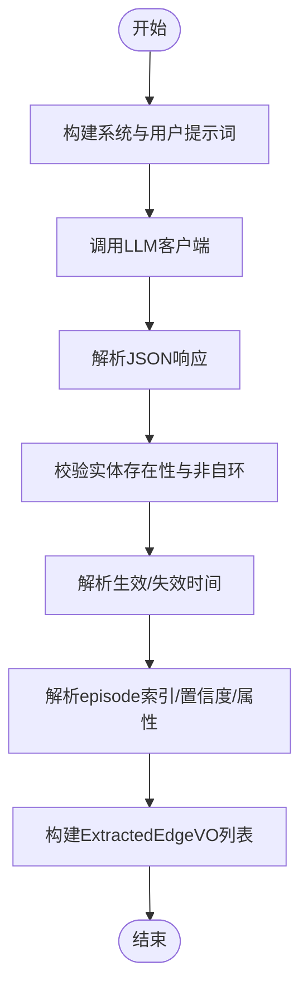
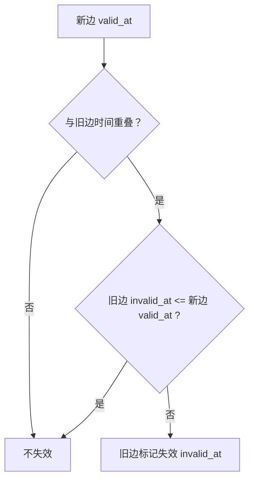
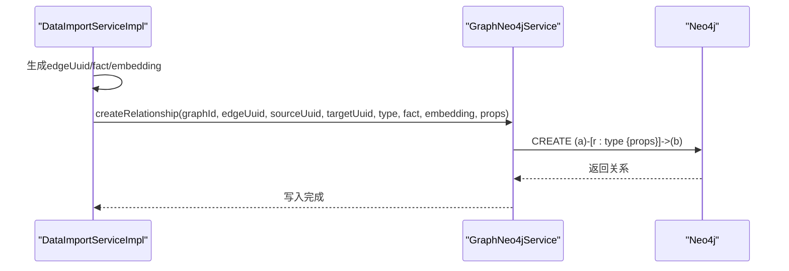
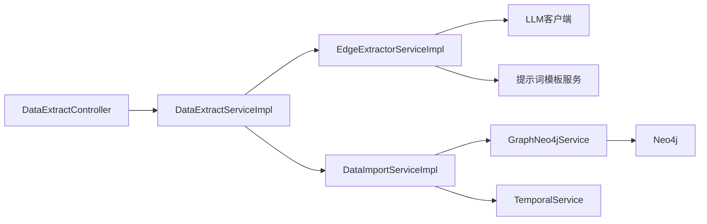

# 关系抽取管道

<!--<cite>
**本文引用的文件**
- [ExtractedRelationVO.java](file://ontograph-module-core/src/main/java/com/graphiti/module/graphiti/vo/llm/ExtractedRelationVO.java)
- [ExtractedEdgeVO.java](file://ontograph-module-core/src/main/java/com/graphiti/module/graphiti/vo/extractor/ExtractedEdgeVO.java)
- [EdgeExtractorService.java](file://ontograph-module-core/src/main/java/com/graphiti/module/graphiti/service/EdgeExtractorService.java)
- [EdgeExtractorServiceImpl.java](file://ontograph-module-core/src/main/java/com/graphiti/module/graphiti/service/impl/EdgeExtractorServiceImpl.java)
- [DataExtractController.java](file://ontograph-module-core/src/main/java/com/graphiti/module/graphiti/controller/admin/DataExtractController.java)
- [DataExtractServiceImpl.java](file://ontograph-module-core/src/main/java/com/graphiti/module/graphiti/service/impl/DataExtractServiceImpl.java)
- [DataImportServiceImpl.java](file://ontograph-module-core/src/main/java/com/graphiti/module/graphiti/service/impl/DataImportServiceImpl.java)
- [GraphNeo4jService.java](file://ontograph-module-core/src/main/java/com/graphiti/module/graphiti/service/GraphNeo4jService.java)
- [TemporalService.java](file://ontograph-module-core/src/main/java/com/graphiti/module/graphiti/service/TemporalService.java)
- [TemporalServiceImpl.java](file://docs/superpowers/plans/2026-05-10-ontograph-java-full-alignment-plan.md)
- [FactTripleReqVO.java](file://ontograph-module-core/src/main/java/com/graphiti/module/graphiti/vo/import/FactTripleReqVO.java)
- [vector-index-init.cypher](file://sql/neo4j/vector-index-init.cypher)
- [2026-05-11-neo4j-relation-type-consistency.md](file://docs/superpowers/plans/2026-05-11-neo4j-relation-type-consistency.md)
- [prompt_template_init.sql](file://docs/sql/prompt_template_init.sql)
- [prompt_template_postgresql_init.sql](file://docs/sql/prompt_template_postgresql_init.sql)
- [monitor.ts](file://ontograph-web/src/api/monitor.ts)
- [index.vue](file://ontograph-web/src/views/monitor/index.vue)
</cite>-->

## 目录
1. [简介](#简介)
2. [项目结构](#项目结构)
3. [核心组件](#核心组件)
4. [架构总览](#架构总览)
5. [详细组件分析](#详细组件分析)
6. [依赖分析](#依赖分析)
7. [性能考虑](#性能考虑)
8. [故障排除指南](#故障排除指南)
9. [结论](#结论)
10. [附录](#附录)

## 简介
本文件面向OntoGraph的关系抽取管道，提供从“实体对生成→关系类型分类→事实描述提取→置信度计算→关系验证→Neo4j图数据库存储”的完整技术文档。重点覆盖：
- ExtractedRelationVO结构与关系三元组表示法
- 关系去重机制（基于实体对与关系类型的策略）
- EdgeExtractorServiceImpl的核心算法（关系强度评估、冲突解决、批量插入优化）
- 关系本体验证、时序一致性检查、向量嵌入生成
- 配置参数、性能监控与故障排除

## 项目结构
关系抽取管道主要分布在模块core的服务层与控制器层，并通过Neo4j服务持久化到图数据库。关键目录与文件：
- 控制器：DataExtractController、EdgeController
- 服务：EdgeExtractorService/Impl、DataExtractServiceImpl、DataImportServiceImpl、GraphNeo4jService、TemporalService/Impl
- VO模型：ExtractedEdgeVO、ExtractedRelationVO、FactTripleReqVO
- 提示词模板：SQL初始化脚本中定义了关系提取模板
- Neo4j向量索引：初始化脚本定义节点与边的向量索引

**图表来源**
- [DataExtractController.java:31-279](file://ontograph-module-core/src/main/java/com/graphiti/module/graphiti/controller/admin/DataExtractController.java#L31-L279)
- [EdgeController.java:23-91](file://ontograph-module-core/src/main/java/com/graphiti/module/graphiti/controller/admin/EdgeController.java#L23-L91)
- [EdgeExtractorServiceImpl.java:19-362](file://ontograph-module-core/src/main/java/com/graphiti/module/graphiti/service/impl/EdgeExtractorServiceImpl.java#L19-L362)
- [DataExtractServiceImpl.java:64-155](file://ontograph-module-core/src/main/java/com/graphiti/module/graphiti/service/impl/DataExtractServiceImpl.java#L64-L155)
- [DataImportServiceImpl.java:165-216](file://ontograph-module-core/src/main/java/com/graphiti/module/graphiti/service/impl/DataImportServiceImpl.java#L165-L216)
- [GraphNeo4jService.java:93-174](file://ontograph-module-core/src/main/java/com/graphiti/module/graphiti/service/GraphNeo4jService.java#L93-L174)
- [TemporalService.java:19-45](file://ontograph-module-core/src/main/java/com/graphiti/module/graphiti/service/TemporalService.java#L19-L45)

**章节来源**
- [DataExtractController.java:31-279](file://ontograph-module-core/src/main/java/com/graphiti/module/graphiti/controller/admin/DataExtractController.java#L31-L279)
- [EdgeController.java:23-91](file://ontograph-module-core/src/main/java/com/graphiti/module/graphiti/controller/admin/EdgeController.java#L23-L91)

## 核心组件
- 关系提取服务接口与实现：EdgeExtractorService/Impl，负责构建提示词、调用大模型、解析JSON响应、时间与置信度解析、属性提取。
- 实体+关系提取编排：DataExtractServiceImpl，先提取实体再基于实体提取关系。
- 导入与批量写入：DataImportServiceImpl，将ExtractedRelationVO转换为三元组并写入Neo4j。
- Neo4j写入服务：GraphNeo4jService，创建节点与关系，设置有效时间戳、向量嵌入等。
- 时序一致性：TemporalService/Impl，失效旧事实、按时间窗口查询有效边。
- 数据模型：ExtractedEdgeVO（提取结果）、ExtractedRelationVO（导入三元组）、FactTripleReqVO（导入请求）。

**章节来源**
- [EdgeExtractorService.java:9-64](file://ontograph-module-core/src/main/java/com/graphiti/module/graphiti/service/EdgeExtractorService.java#L9-L64)
- [EdgeExtractorServiceImpl.java:19-362](file://ontograph-module-core/src/main/java/com/graphiti/module/graphiti/service/impl/EdgeExtractorServiceImpl.java#L19-L362)
- [DataExtractServiceImpl.java:64-155](file://ontograph-module-core/src/main/java/com/graphiti/module/graphiti/service/impl/DataExtractServiceImpl.java#L64-L155)
- [DataImportServiceImpl.java:165-216](file://ontograph-module-core/src/main/java/com/graphiti/module/graphiti/service/impl/DataImportServiceImpl.java#L165-L216)
- [GraphNeo4jService.java:93-174](file://ontograph-module-core/src/main/java/com/graphiti/module/graphiti/service/GraphNeo4jService.java#L93-L174)
- [TemporalService.java:19-45](file://ontograph-module-core/src/main/java/com/graphiti/module/graphiti/service/TemporalService.java#L19-L45)

## 架构总览
关系抽取管道的端到端流程如下：

**图表来源**
- [DataExtractController.java:48-58](file://ontograph-module-core/src/main/java/com/graphiti/module/graphiti/controller/admin/DataExtractController.java#L48-L58)
- [DataExtractServiceImpl.java:64-92](file://ontograph-module-core/src/main/java/com/graphiti/module/graphiti/service/impl/DataExtractServiceImpl.java#L64-L92)
- [EdgeExtractorServiceImpl.java:58-71](file://ontograph-module-core/src/main/java/com/graphiti/module/graphiti/service/impl/EdgeExtractorServiceImpl.java#L58-L71)
- [GraphNeo4jService.java:93-174](file://ontograph-module-core/src/main/java/com/graphiti/module/graphiti/service/GraphNeo4jService.java#L93-L174)

## 详细组件分析

### ExtractedRelationVO 结构与三元组表示
- 字段含义
  - source：源实体名称
  - target：目标实体名称
  - type：关系类型
  - fact：事实描述
- 三元组表示法
  - (source, type, target) 表示一条关系边
  - fact用于语义描述与向量嵌入
- 用途
  - 作为导入阶段的输入载体，由DataImportServiceImpl将其转换为Neo4j关系并生成embedding

**章节来源**
- [ExtractedRelationVO.java:13-39](file://ontograph-module-core/src/main/java/com/graphiti/module/graphiti/vo/llm/ExtractedRelationVO.java#L13-L39)

### ExtractedEdgeVO 与关系提取结果
- 字段含义
  - sourceEntityName/targetEntityName：源/目标实体名称
  - relationType：关系类型
  - fact：事实描述
  - validAt/invalidAt：生效/失效时间
  - episodeIndices：来源episode索引
  - confidence：置信度
  - attributes：其他属性
- 作用
  - EdgeExtractorServiceImpl解析LLM输出为该结构，后续写入Neo4j时会映射到关系属性

**章节来源**
- [ExtractedEdgeVO.java:12-40](file://ontograph-module-core/src/main/java/com/graphiti/module/graphiti/vo/extractor/ExtractedEdgeVO.java#L12-L40)

### EdgeExtractorServiceImpl 核心算法
- 输入输出
  - 输入：content、entities、referenceTime、edgeTypesConfig、customInstructions
  - 输出：List<ExtractedEdgeVO>
- 主要步骤
  1) 构建系统提示词与用户提示词（含默认关系类型、自定义指令、JSON响应约束）
  2) 调用LLM客户端获取响应
  3) 从响应中提取JSON（支持代码块与普通对象）
  4) 解析edges数组，校验实体名称存在性与非自环
  5) 解析valid_at/invalid_at、episode_indices、confidence、attributes
  6) 返回ExtractedEdgeVO列表
- 关键特性
  - 实体名称大小写不敏感匹配
  - 自动跳过不存在实体与自环关系
  - 支持多种提示词模板（文本/消息/模板）

**图表来源**
- [EdgeExtractorServiceImpl.java:128-165](file://ontograph-module-core/src/main/java/com/graphiti/module/graphiti/service/impl/EdgeExtractorServiceImpl.java#L128-L165)
- [EdgeExtractorServiceImpl.java:341-360](file://ontograph-module-core/src/main/java/com/graphiti/module/graphiti/service/impl/EdgeExtractorServiceImpl.java#L341-L360)
- [EdgeExtractorServiceImpl.java:231-282](file://ontograph-module-core/src/main/java/com/graphiti/module/graphiti/service/impl/EdgeExtractorServiceImpl.java#L231-L282)

**章节来源**
- [EdgeExtractorServiceImpl.java:58-124](file://ontograph-module-core/src/main/java/com/graphiti/module/graphiti/service/impl/EdgeExtractorServiceImpl.java#L58-L124)
- [EdgeExtractorServiceImpl.java:231-360](file://ontograph-module-core/src/main/java/com/graphiti/module/graphiti/service/impl/EdgeExtractorServiceImpl.java#L231-L360)

### 关系去重机制
- 去重策略（与Python版本对齐）
  - Tier 1：Exact Match（规范化字符串匹配）
  - Tier 2：Semantic Match（MinHash + LSH，Jaccard阈值≥0.9）
  - Tier 3：LLM Resolution（LLM判断是否重复）
- 实际应用
  - 实体去重：EntityDedupServiceImpl实现三层策略
  - 边去重：DataQualityServiceImpl查找同组内重复边并删除冗余
- 去重效果
  - 保留主实体/关系，删除重复项，转移关联边，降低图冗余

**章节来源**
- [EntityDedupService.java:8-38](file://ontograph-module-core/src/main/java/com/graphiti/module/graphiti/service/EntityDedupService.java#L8-L38)
- [EntityDedupServiceImpl.java:21-35](file://ontograph-module-core/src/main/java/com/graphiti/module/graphiti/service/impl/EntityDedupServiceImpl.java#L21-L35)
- [DataQualityServiceImpl.java:66-90](file://ontograph-module-core/src/main/java/com/graphiti/module/graphiti/service/impl/DataQualityServiceImpl.java#L66-L90)

### 时序一致性与冲突解决
- 核心概念
  - valid_at：事实开始有效时间
  - invalid_at：事实失效时间
  - expired_at：边被明确失效的时间戳
- 冲突解决策略
  - Case 1：无时间重叠 → 不失效
  - Case 2：旧边 invalid_at ≤ 新边 valid_at → 不失效
  - Case 3：新边 valid_at 更晚 → 旧边失效
- 实现要点
  - TemporalServiceImpl提供按参考时间查询有效节点/边的能力
  - DataImportServiceImpl在写入前调用invalidateFacts使旧事实失效

**图表来源**
- [TemporalService.java:35-45](file://ontograph-module-core/src/main/java/com/graphiti/module/graphiti/service/TemporalService.java#L35-L45)
- [TemporalServiceImpl.java:644-787](file://docs/superpowers/plans/2026-05-10-ontograph-java-full-alignment-plan.md#L644-L787)
- [DataImportServiceImpl.java:168](file://ontograph-module-core/src/main/java/com/graphiti/module/graphiti/service/impl/DataImportServiceImpl.java#L168)

**章节来源**
- [TemporalService.java:19-45](file://ontograph-module-core/src/main/java/com/graphiti/module/graphiti/service/TemporalService.java#L19-L45)
- [TemporalServiceImpl.java:644-787](file://docs/superpowers/plans/2026-05-10-ontograph-java-full-alignment-plan.md#L644-L787)
- [DataImportServiceImpl.java:168](file://ontograph-module-core/src/main/java/com/graphiti/module/graphiti/service/impl/DataImportServiceImpl.java#L168)

### Neo4j图数据库存储与向量嵌入
- 存储流程
  - DataImportServiceImpl将ExtractedRelationVO映射为三元组，生成edgeUuid与fact
  - GraphNeo4jService.createRelationship创建关系，设置type、fact、embedding、valid_at、invalid_at等属性
  - 关系类型一致性：确保传入的关系类型被正确使用，避免硬编码RELATES_TO
- 向量嵌入
  - 使用EmbedderService生成节点与关系的embedding
  - Neo4j向量索引初始化脚本定义节点与边的向量索引（维度1536，余弦相似度）
- 关系类型一致性修复
  - 修复createRelationship中关系类型参数化问题，确保relationType生效

**图表来源**
- [DataImportServiceImpl.java:180-196](file://ontograph-module-core/src/main/java/com/graphiti/module/graphiti/service/impl/DataImportServiceImpl.java#L180-L196)
- [GraphNeo4jService.java:93-174](file://ontograph-module-core/src/main/java/com/graphiti/module/graphiti/service/GraphNeo4jService.java#L93-L174)
- [2026-05-11-neo4j-relation-type-consistency.md:50-116](file://docs/superpowers/plans/2026-05-11-neo4j-relation-type-consistency.md#L50-L116)

**章节来源**
- [DataImportServiceImpl.java:180-196](file://ontograph-module-core/src/main/java/com/graphiti/module/graphiti/service/impl/DataImportServiceImpl.java#L180-L196)
- [GraphNeo4jService.java:93-174](file://ontograph-module-core/src/main/java/com/graphiti/module/graphiti/service/GraphNeo4jService.java#L93-L174)
- [vector-index-init.cypher:1-26](file://sql/neo4j/vector-index-init.cypher#L1-L26)
- [2026-05-11-neo4j-relation-type-consistency.md:50-116](file://docs/superpowers/plans/2026-05-11-neo4j-relation-type-consistency.md#L50-L116)

### 提示词模板与关系类型配置
- 默认关系类型
  - EdgeExtractorServiceImpl提供常见关系类型清单（SCREAMING_SNAKE_CASE）
- 提示词模板
  - SQL初始化脚本中定义了关系提取模板（EXTRACT_EDGES），包含系统提示词与用户模板
  - 支持通过模板渲染生成最终提示词，兼容文本/消息/JSON三种数据源

**章节来源**
- [EdgeExtractorServiceImpl.java:36-54](file://ontograph-module-core/src/main/java/com/graphiti/module/graphiti/service/impl/EdgeExtractorServiceImpl.java#L36-L54)
- [prompt_template_init.sql:100-117](file://docs/sql/prompt_template_init.sql#L100-L117)
- [prompt_template_postgresql_init.sql:187-208](file://docs/sql/prompt_template_postgresql_init.sql#L187-L208)

## 依赖分析
- 组件耦合
  - DataExtractController依赖DataExtractServiceImpl
  - DataExtractServiceImpl依赖EdgeExtractorServiceImpl
  - EdgeExtractorServiceImpl依赖LLM客户端与提示词模板服务
  - DataImportServiceImpl依赖GraphNeo4jService与TemporalService
  - GraphNeo4jService依赖Neo4j驱动
- 外部依赖
  - Neo4j向量索引与全文索引
  - LLM服务（OpenAI/Qwen/Ollama等实现）
  - Redis/MySQL（框架级依赖，非本管道直接使用）

**图表来源**
- [DataExtractController.java:38-58](file://ontograph-module-core/src/main/java/com/graphiti/module/graphiti/controller/admin/DataExtractController.java#L38-L58)
- [DataExtractServiceImpl.java:64-92](file://ontograph-module-core/src/main/java/com/graphiti/module/graphiti/service/impl/DataExtractServiceImpl.java#L64-L92)
- [EdgeExtractorServiceImpl.java:28-30](file://ontograph-module-core/src/main/java/com/graphiti/module/graphiti/service/impl/EdgeExtractorServiceImpl.java#L28-L30)
- [DataImportServiceImpl.java:180-196](file://ontograph-module-core/src/main/java/com/graphiti/module/graphiti/service/impl/DataImportServiceImpl.java#L180-L196)
- [GraphNeo4jService.java:93-174](file://ontograph-module-core/src/main/java/com/graphiti/module/graphiti/service/GraphNeo4jService.java#L93-L174)

**章节来源**
- [DataExtractController.java:38-58](file://ontograph-module-core/src/main/java/com/graphiti/module/graphiti/controller/admin/DataExtractController.java#L38-L58)
- [DataExtractServiceImpl.java:64-92](file://ontograph-module-core/src/main/java/com/graphiti/module/graphiti/service/impl/DataExtractServiceImpl.java#L64-L92)
- [EdgeExtractorServiceImpl.java:28-30](file://ontograph-module-core/src/main/java/com/graphiti/module/graphiti/service/impl/EdgeExtractorServiceImpl.java#L28-L30)
- [DataImportServiceImpl.java:180-196](file://ontograph-module-core/src/main/java/com/graphiti/module/graphiti/service/impl/DataImportServiceImpl.java#L180-L196)
- [GraphNeo4jService.java:93-174](file://ontograph-module-core/src/main/java/com/graphiti/module/graphiti/service/GraphNeo4jService.java#L93-L174)

## 性能考虑
- 批量写入优化
  - DataImportServiceImpl按批次处理实体与关系，减少事务开销
  - GraphNeo4jService统一创建关系，合并属性写入
- 向量索引
  - 初始化节点与关系的向量索引，提升相似度检索性能
- 日志与监控
  - Web前端提供系统状态、性能指标与API日志查看页面
  - Actuator接口聚合CPU、内存、线程等指标

**章节来源**
- [DataImportServiceImpl.java:165-196](file://ontograph-module-core/src/main/java/com/graphiti/module/graphiti/service/impl/DataImportServiceImpl.java#L165-L196)
- [vector-index-init.cypher:1-26](file://sql/neo4j/vector-index-init.cypher#L1-L26)
- [monitor.ts:103-122](file://ontograph-web/src/api/monitor.ts#L103-L122)
- [index.vue:267-288](file://ontograph-web/src/views/monitor/index.vue#L267-L288)

## 故障排除指南
- LLM响应解析失败
  - 现象：日志出现解析失败警告
  - 排查：确认提示词模板返回严格JSON；检查代码块与对象边界
  - 参考：EdgeExtractorServiceImpl的JSON提取逻辑
- 实体名称不匹配
  - 现象：跳过关系（实体名称不在列表中或自环）
  - 排查：确保entities与LLM输出名称一致（大小写不敏感）；避免自环
- 关系类型不生效
  - 现象：关系始终为默认类型
  - 排查：检查GraphNeo4jService的参数化关系类型；确保传入的relationType非空
- 时序冲突未解决
  - 现象：旧边未失效
  - 排查：确认TemporalServiceImpl的冲突判定逻辑；检查valid_at/invalid_at设置
- 向量检索性能差
  - 现象：相似度查询慢
  - 排查：确认向量索引已初始化；检查embedding维度与相似度函数

**章节来源**
- [EdgeExtractorServiceImpl.java:277-282](file://ontograph-module-core/src/main/java/com/graphiti/module/graphiti/service/impl/EdgeExtractorServiceImpl.java#L277-L282)
- [EdgeExtractorServiceImpl.java:249-259](file://ontograph-module-core/src/main/java/com/graphiti/module/graphiti/service/impl/EdgeExtractorServiceImpl.java#L249-L259)
- [2026-05-11-neo4j-relation-type-consistency.md:50-116](file://docs/superpowers/plans/2026-05-11-neo4j-relation-type-consistency.md#L50-L116)
- [TemporalServiceImpl.java:644-787](file://docs/superpowers/plans/2026-05-10-ontograph-java-full-alignment-plan.md#L644-L787)
- [vector-index-init.cypher:1-26](file://sql/neo4j/vector-index-init.cypher#L1-L26)

## 结论
OntoGraph的关系抽取管道以EdgeExtractorServiceImpl为核心，结合提示词模板与LLM实现高质量的关系提取；通过DataImportServiceImpl与GraphNeo4jService完成向量化与持久化；TemporalService保障时序一致性；DataQualityServiceImpl与三层去重策略降低图冗余。整体设计在可扩展性、可维护性与性能之间取得平衡，适合大规模知识图谱构建与运营。

## 附录

### 关系抽取配置参数
- 关系类型配置
  - 默认关系类型清单（SCREAMING_SNAKE_CASE）
  - 自定义关系类型可通过edgeTypesConfig传入
- 自定义指令
  - customInstructions用于细化提取规则
- 提示词模板
  - EXTRACT_EDGES模板定义系统提示词与用户模板
  - 支持文本/消息/JSON三种数据源类型

**章节来源**
- [EdgeExtractorServiceImpl.java:36-54](file://ontograph-module-core/src/main/java/com/graphiti/module/graphiti/service/impl/EdgeExtractorServiceImpl.java#L36-L54)
- [prompt_template_init.sql:100-117](file://docs/sql/prompt_template_init.sql#L100-L117)
- [prompt_template_postgresql_init.sql:187-208](file://docs/sql/prompt_template_postgresql_init.sql#L187-L208)

### 关系三元组与本体验证
- 三元组表示
  - (source, type, target)，其中type来自relationType，fact为描述
- 本体验证
  - 建议在导入前对type进行本体检索（如OntologyService），确保类型合法
  - 本体一致性检查可参考ConsistencyResultVO结构

**章节来源**
- [FactTripleReqVO.java:14-38](file://ontograph-module-core/src/main/java/com/graphiti/module/graphiti/vo/import/FactTripleReqVO.java#L14-L38)
- [ConsistencyResultVO.java:9-14](file://ontograph-module-core/src/main/java/com/graphiti/module/graphiti/vo/ontology/ConsistencyResultVO.java#L9-L14)