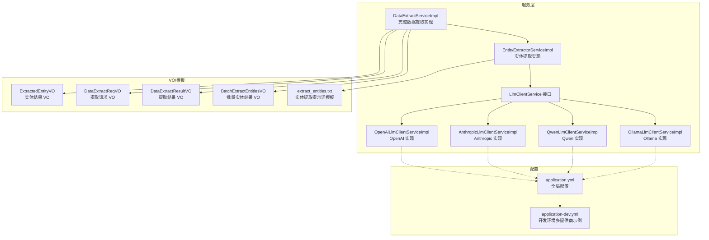
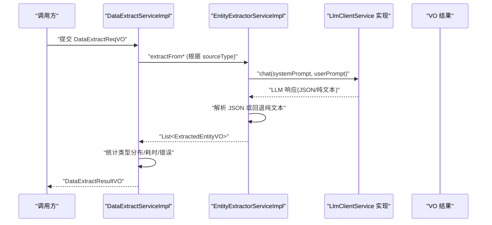
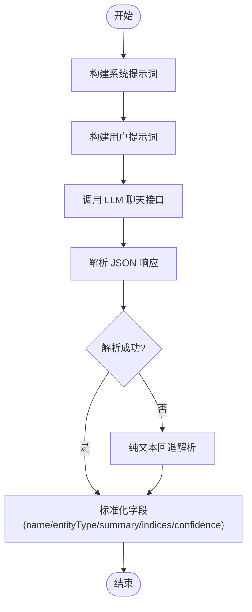
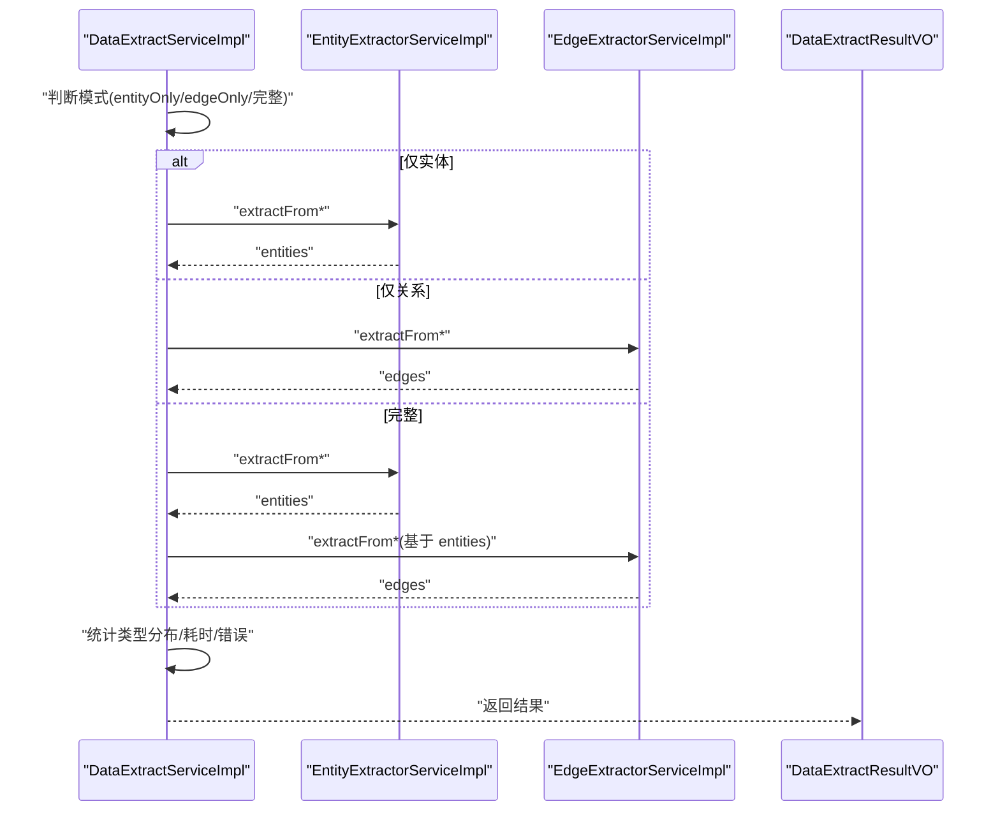
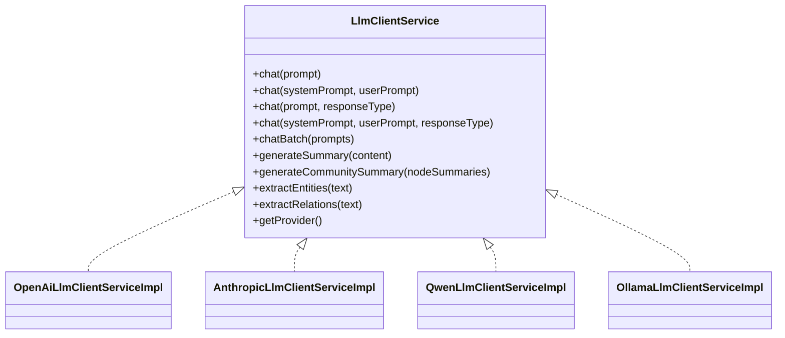
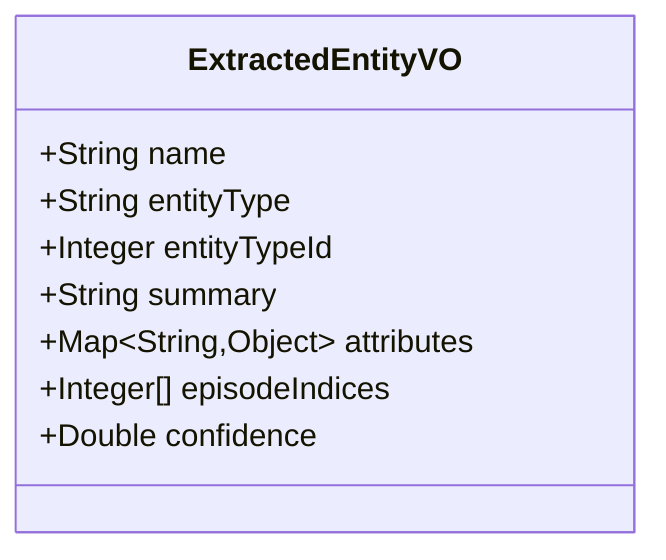
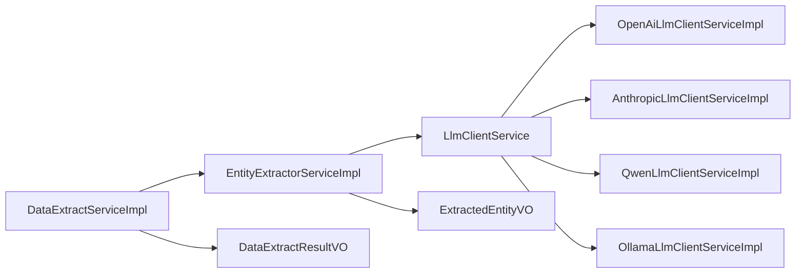

# 实体抽取管道

<cite>
**本文引用的文件**
- [EntityExtractorServiceImpl.java](file://graphiti-module-core/src/main/java/com/graphiti/module/graphiti/service/impl/EntityExtractorServiceImpl.java)
- [DataExtractServiceImpl.java](file://graphiti-module-core/src/main/java/com/graphiti/module/graphiti/service/impl/DataExtractServiceImpl.java)
- [LlmClientService.java](file://graphiti-module-core/src/main/java/com/graphiti/module/graphiti/service/LlmClientService.java)
- [OpenAiLlmClientServiceImpl.java](file://graphiti-module-core/src/main/java/com/graphiti/module/graphiti/service/impl/ai/OpenAiLlmClientServiceImpl.java)
- [AnthropicLlmClientServiceImpl.java](file://graphiti-module-core/src/main/java/com/graphiti/module/graphiti/service/impl/ai/AnthropicLlmClientServiceImpl.java)
- [QwenLlmClientServiceImpl.java](file://graphiti-module-core/src/main/java/com/graphiti/module/graphiti/service/impl/ai/QwenLlmClientServiceImpl.java)
- [OllamaLlmClientServiceImpl.java](file://graphiti-module-core/src/main/java/com/graphiti/module/graphiti/service/impl/ai/OllamaLlmClientServiceImpl.java)
- [ExtractedEntityVO.java](file://graphiti-module-core/src/main/java/com/graphiti/module/graphiti/vo/extractor/ExtractedEntityVO.java)
- [DataExtractReqVO.java](file://graphiti-module-core/src/main/java/com/graphiti/module/graphiti/vo/extractor/DataExtractReqVO.java)
- [DataExtractResultVO.java](file://graphiti-module-core/src/main/java/com/graphiti/module/graphiti/vo/extractor/DataExtractResultVO.java)
- [BatchExtractEntitiesVO.java](file://graphiti-module-core/src/main/java/com/graphiti/module/graphiti/vo/extractor/BatchExtractEntitiesVO.java)
- [application.yml](file://graphiti-server/src/main/resources/application.yml)
- [application-dev.yml](file://graphiti-server/src/main/resources/application-dev.yml)
- [extract_entities.txt](file://graphiti-module-core/src/main/resources/prompts/extract_entities.txt)
</cite>

## 目录
1. [简介](#简介)
2. [项目结构](#项目结构)
3. [核心组件](#核心组件)
4. [架构总览](#架构总览)
5. [详细组件分析](#详细组件分析)
6. [依赖分析](#依赖分析)
7. [性能考虑](#性能考虑)
8. [故障排查指南](#故障排查指南)
9. [结论](#结论)
10. [附录](#附录)

## 简介
本技术文档围绕 Graphiti-Java 的实体抽取管道进行系统化梳理与说明，覆盖从“文本预处理 → LLM 调用 → 实体识别 → 属性提取 → 标准化处理 → 去重合并 → Neo4j 存储”的完整链路。文档重点包括：
- 实体抽取流程与控制流
- ExtractedEntityVO 数据结构与字段语义
- 多 LLM 提供商（OpenAI、Anthropic、Qwen、Ollama）的集成方式与差异
- 实体类型分类、置信度评估、批量处理优化
- 配置项、性能调优与错误处理策略
- 面向开发者的实现指南

## 项目结构
实体抽取相关代码主要位于 graphiti-module-core 模块的服务与 VO 层，并通过统一的 LlmClientService 抽象屏蔽不同 LLM 提供商的差异；配置集中在 graphiti-server 的 application.yml 与 application-dev.yml。

**图表来源**
- [EntityExtractorServiceImpl.java:1-306](file://graphiti-module-core/src/main/java/com/graphiti/module/graphiti/service/impl/EntityExtractorServiceImpl.java#L1-L306)
- [DataExtractServiceImpl.java:1-261](file://graphiti-module-core/src/main/java/com/graphiti/module/graphiti/service/impl/DataExtractServiceImpl.java#L1-L261)
- [LlmClientService.java:1-158](file://graphiti-module-core/src/main/java/com/graphiti/module/graphiti/service/LlmClientService.java#L1-L158)
- [OpenAiLlmClientServiceImpl.java:1-111](file://graphiti-module-core/src/main/java/com/graphiti/module/graphiti/service/impl/ai/OpenAiLlmClientServiceImpl.java#L1-L111)
- [AnthropicLlmClientServiceImpl.java:1-111](file://graphiti-module-core/src/main/java/com/graphiti/module/graphiti/service/impl/ai/AnthropicLlmClientServiceImpl.java#L1-L111)
- [QwenLlmClientServiceImpl.java:1-97](file://graphiti-module-core/src/main/java/com/graphiti/module/graphiti/service/impl/ai/QwenLlmClientServiceImpl.java#L1-L97)
- [OllamaLlmClientServiceImpl.java:1-98](file://graphiti-module-core/src/main/java/com/graphiti/module/graphiti/service/impl/ai/OllamaLlmClientServiceImpl.java#L1-L98)
- [ExtractedEntityVO.java:1-36](file://graphiti-module-core/src/main/java/com/graphiti/module/graphiti/vo/extractor/ExtractedEntityVO.java#L1-L36)
- [DataExtractReqVO.java:1-74](file://graphiti-module-core/src/main/java/com/graphiti/module/graphiti/vo/extractor/DataExtractReqVO.java#L1-L74)
- [DataExtractResultVO.java:1-41](file://graphiti-module-core/src/main/java/com/graphiti/module/graphiti/vo/extractor/DataExtractResultVO.java#L1-L41)
- [BatchExtractEntitiesVO.java:1-22](file://graphiti-module-core/src/main/java/com/graphiti/module/graphiti/vo/extractor/BatchExtractEntitiesVO.java#L1-L22)
- [application.yml:1-67](file://graphiti-server/src/main/resources/application.yml#L1-L67)
- [application-dev.yml:89-261](file://graphiti-server/src/main/resources/application-dev.yml#L89-L261)
- [extract_entities.txt:1-28](file://graphiti-module-core/src/main/resources/prompts/extract_entities.txt#L1-L28)

**章节来源**
- [application.yml:20-34](file://graphiti-server/src/main/resources/application.yml#L20-L34)
- [application-dev.yml:89-261](file://graphiti-server/src/main/resources/application-dev.yml#L89-L261)

## 核心组件
- 实体提取服务实现：负责构建提示词、调用 LLM、解析 JSON 响应、回退纯文本解析、标准化输出。
- 完整数据提取服务实现：编排实体与关系提取，聚合统计信息，记录耗时与错误。
- LLM 客户端服务接口与实现：统一聊天接口，支持结构化 JSON 返回、批量调用、摘要生成、实体/关系抽取模板方法。
- VO 与模板：定义实体、提取请求/结果、批量实体结果 VO，以及实体抽取提示词模板。

**章节来源**
- [EntityExtractorServiceImpl.java:52-95](file://graphiti-module-core/src/main/java/com/graphiti/module/graphiti/service/impl/EntityExtractorServiceImpl.java#L52-L95)
- [DataExtractServiceImpl.java:44-97](file://graphiti-module-core/src/main/java/com/graphiti/module/graphiti/service/impl/DataExtractServiceImpl.java#L44-L97)
- [LlmClientService.java:17-70](file://graphiti-module-core/src/main/java/com/graphiti/module/graphiti/service/LlmClientService.java#L17-L70)

## 架构总览
实体抽取管道采用“服务编排 + LLM 抽象 + VO 标准化”的分层设计，通过 LlmClientService 屏蔽不同提供商差异，DataExtractServiceImpl 统一调度实体与关系提取，最终在导入阶段写入 Neo4j。

**图表来源**
- [DataExtractServiceImpl.java:153-188](file://graphiti-module-core/src/main/java/com/graphiti/module/graphiti/service/impl/DataExtractServiceImpl.java#L153-L188)
- [EntityExtractorServiceImpl.java:52-95](file://graphiti-module-core/src/main/java/com/graphiti/module/graphiti/service/impl/EntityExtractorServiceImpl.java#L52-L95)
- [LlmClientService.java:25-55](file://graphiti-module-core/src/main/java/com/graphiti/module/graphiti/service/LlmClientService.java#L25-L55)

## 详细组件分析

### 实体抽取服务实现（EntityExtractorServiceImpl）
- 功能要点
  - 默认实体类型配置（Person、Organization、Location、Event、Concept、Product、Document、Entity）
  - 支持文本、JSON、消息三种输入源，分别构建系统提示词与用户提示词
  - 结构化 JSON 解析与纯文本回退解析
  - episode_indices、confidence 等字段的提取与标准化
- 关键流程
  - 构建系统提示词（含实体类型定义、自定义指令、JSON 输出约束）
  - 构建用户提示词（文本/JSON/消息）
  - LLM 调用并解析响应，回退到纯文本解析
  - 标准化输出为 ExtractedEntityVO 列表

**图表来源**
- [EntityExtractorServiceImpl.java:132-196](file://graphiti-module-core/src/main/java/com/graphiti/module/graphiti/service/impl/EntityExtractorServiceImpl.java#L132-L196)
- [EntityExtractorServiceImpl.java:200-283](file://graphiti-module-core/src/main/java/com/graphiti/module/graphiti/service/impl/EntityExtractorServiceImpl.java#L200-L283)

**章节来源**
- [EntityExtractorServiceImpl.java:36-48](file://graphiti-module-core/src/main/java/com/graphiti/module/graphiti/service/impl/EntityExtractorServiceImpl.java#L36-L48)
- [EntityExtractorServiceImpl.java:52-95](file://graphiti-module-core/src/main/java/com/graphiti/module/graphiti/service/impl/EntityExtractorServiceImpl.java#L52-L95)
- [EntityExtractorServiceImpl.java:200-283](file://graphiti-module-core/src/main/java/com/graphiti/module/graphiti/service/impl/EntityExtractorServiceImpl.java#L200-L283)

### 完整数据提取服务实现（DataExtractServiceImpl）
- 功能要点
  - 编排实体与关系提取，支持仅实体、仅关系、完整提取三种模式
  - 将 previousEpisodes 转换为 Map 列表作为上下文
  - 计算实体类型与关系类型的统计分布
  - 记录耗时与错误列表
- 控制流
  - 根据 sourceType 分派到实体或关系提取
  - 若仅关系模式且未提供实体，抛出参数异常
  - 聚合统计与耗时，封装为 DataExtractResultVO

**图表来源**
- [DataExtractServiceImpl.java:44-97](file://graphiti-module-core/src/main/java/com/graphiti/module/graphiti/service/impl/DataExtractServiceImpl.java#L44-L97)
- [DataExtractServiceImpl.java:153-188](file://graphiti-module-core/src/main/java/com/graphiti/module/graphiti/service/impl/DataExtractServiceImpl.java#L153-L188)

**章节来源**
- [DataExtractServiceImpl.java:44-97](file://graphiti-module-core/src/main/java/com/graphiti/module/graphiti/service/impl/DataExtractServiceImpl.java#L44-L97)
- [DataExtractServiceImpl.java:153-188](file://graphiti-module-core/src/main/java/com/graphiti/module/graphiti/service/impl/DataExtractServiceImpl.java#L153-L188)
- [DataExtractServiceImpl.java:235-259](file://graphiti-module-core/src/main/java/com/graphiti/module/graphiti/service/impl/DataExtractServiceImpl.java#L235-L259)

### LLM 客户端服务接口与实现
- LlmClientService 接口
  - 统一聊天接口：支持纯文本与带系统提示词的聊天
  - 结构化返回：将 LLM 响应解析为指定类型
  - 批量调用：对提示词列表进行批处理
  - 摘要生成：内容摘要与社区摘要
  - 实体/关系抽取：内置模板方法，加载 extract_entities.txt 与 extract_relations.txt
- OpenAI 实现
  - 基于 OpenAiChatModel，支持私有化部署（通过 base-url）
- Anthropic 实现
  - 基于 AnthropicChatModel，支持私有化部署（通过 base-url）
- Qwen 实现
  - 通过 OpenAI 兼容 API 调用 DashScope 的 Qwen 模型
- Ollama 实现
  - 基于 OllamaChatModel，适合本地推理

**图表来源**
- [LlmClientService.java:17-70](file://graphiti-module-core/src/main/java/com/graphiti/module/graphiti/service/LlmClientService.java#L17-L70)
- [OpenAiLlmClientServiceImpl.java:35-36](file://graphiti-module-core/src/main/java/com/graphiti/module/graphiti/service/impl/ai/OpenAiLlmClientServiceImpl.java#L35-L36)
- [AnthropicLlmClientServiceImpl.java:36-37](file://graphiti-module-core/src/main/java/com/graphiti/module/graphiti/service/impl/ai/AnthropicLlmClientServiceImpl.java#L36-L37)
- [QwenLlmClientServiceImpl.java:22-23](file://graphiti-module-core/src/main/java/com/graphiti/module/graphiti/service/impl/ai/QwenLlmClientServiceImpl.java#L22-L23)
- [OllamaLlmClientServiceImpl.java:22-23](file://graphiti-module-core/src/main/java/com/graphiti/module/graphiti/service/impl/ai/OllamaLlmClientServiceImpl.java#L22-L23)

**章节来源**
- [LlmClientService.java:17-70](file://graphiti-module-core/src/main/java/com/graphiti/module/graphiti/service/LlmClientService.java#L17-L70)
- [OpenAiLlmClientServiceImpl.java:35-36](file://graphiti-module-core/src/main/java/com/graphiti/module/graphiti/service/impl/ai/OpenAiLlmClientServiceImpl.java#L35-L36)
- [AnthropicLlmClientServiceImpl.java:36-37](file://graphiti-module-core/src/main/java/com/graphiti/module/graphiti/service/impl/ai/AnthropicLlmClientServiceImpl.java#L36-L37)
- [QwenLlmClientServiceImpl.java:22-23](file://graphiti-module-core/src/main/java/com/graphiti/module/graphiti/service/impl/ai/QwenLlmClientServiceImpl.java#L22-L23)
- [OllamaLlmClientServiceImpl.java:22-23](file://graphiti-module-core/src/main/java/com/graphiti/module/graphiti/service/impl/ai/OllamaLlmClientServiceImpl.java#L22-L23)

### ExtractedEntityVO 数据结构与字段语义
- 字段说明
  - name：实体名称
  - entityType：实体类型（如 Person、Organization、Location 等）
  - entityTypeId：实体类型 ID（可选）
  - summary：实体摘要
  - attributes：实体属性映射（键值对）
  - episodeIndices：该实体出现的 episode 索引列表
  - confidence：置信度（可空）

**图表来源**
- [ExtractedEntityVO.java:14-36](file://graphiti-module-core/src/main/java/com/graphiti/module/graphiti/vo/extractor/ExtractedEntityVO.java#L14-L36)

**章节来源**
- [ExtractedEntityVO.java:14-36](file://graphiti-module-core/src/main/java/com/graphiti/module/graphiti/vo/extractor/ExtractedEntityVO.java#L14-L36)

### 提示词模板与默认实体类型
- extract_entities.txt：定义实体抽取的输出格式与示例，要求严格 JSON 输出
- EntityExtractorServiceImpl.getDefaultEntityTypes：提供默认实体类型清单

**章节来源**
- [extract_entities.txt:1-28](file://graphiti-module-core/src/main/resources/prompts/extract_entities.txt#L1-L28)
- [EntityExtractorServiceImpl.java:36-48](file://graphiti-module-core/src/main/java/com/graphiti/module/graphiti/service/impl/EntityExtractorServiceImpl.java#L36-L48)

## 依赖分析
- 组件耦合
  - DataExtractServiceImpl 依赖 EntityExtractorService 与 EdgeExtractorService（接口），通过 sourceType 与模式参数进行分支调度
  - EntityExtractorServiceImpl 依赖 LlmClientService 与 PromptTemplateService（模板渲染）
  - LlmClientService 的多个实现类通过条件注解按配置启用
- 外部依赖
  - Spring AI OpenAI、Anthropic、Ollama 客户端模型
  - 配置文件 application.yml 与 application-dev.yml 提供提供商切换与私有化部署地址

**图表来源**
- [DataExtractServiceImpl.java:39-41](file://graphiti-module-core/src/main/java/com/graphiti/module/graphiti/service/impl/DataExtractServiceImpl.java#L39-L41)
- [EntityExtractorServiceImpl.java:28-29](file://graphiti-module-core/src/main/java/com/graphiti/module/graphiti/service/impl/EntityExtractorServiceImpl.java#L28-L29)
- [LlmClientService.java:17-70](file://graphiti-module-core/src/main/java/com/graphiti/module/graphiti/service/LlmClientService.java#L17-L70)
- [OpenAiLlmClientServiceImpl.java:35-36](file://graphiti-module-core/src/main/java/com/graphiti/module/graphiti/service/impl/ai/OpenAiLlmClientServiceImpl.java#L35-L36)
- [AnthropicLlmClientServiceImpl.java:36-37](file://graphiti-module-core/src/main/java/com/graphiti/module/graphiti/service/impl/ai/AnthropicLlmClientServiceImpl.java#L36-L37)
- [QwenLlmClientServiceImpl.java:22-23](file://graphiti-module-core/src/main/java/com/graphiti/module/graphiti/service/impl/ai/QwenLlmClientServiceImpl.java#L22-L23)
- [OllamaLlmClientServiceImpl.java:22-23](file://graphiti-module-core/src/main/java/com/graphiti/module/graphiti/service/impl/ai/OllamaLlmClientServiceImpl.java#L22-L23)

**章节来源**
- [application.yml:20-34](file://graphiti-server/src/main/resources/application.yml#L20-L34)
- [application-dev.yml:89-261](file://graphiti-server/src/main/resources/application-dev.yml#L89-L261)

## 性能考虑
- 批量处理优化
  - LlmClientService 提供 chatBatch 方法，便于对提示词列表进行批处理调用
  - DataExtractServiceImpl 在实体/关系提取阶段可结合批量调用减少往返次数
- 提示词与模板
  - 使用 extract_entities.txt 等模板确保 LLM 输出结构化，降低解析成本
  - 通过自定义指令与实体类型配置减少无关实体，提高命中率
- 配置与私有化
  - OpenAI/Anthropic/Qwen/Ollama 均支持私有化部署，可通过 base-url 指向本地或企业网关，降低网络延迟
- 统计与监控
  - DataExtractResultVO 记录耗时与错误，便于定位瓶颈与异常

**章节来源**
- [LlmClientService.java:63-63](file://graphiti-module-core/src/main/java/com/graphiti/module/graphiti/service/LlmClientService.java#L63-L63)
- [DataExtractServiceImpl.java:91-91](file://graphiti-module-core/src/main/java/com/graphiti/module/graphiti/service/impl/DataExtractServiceImpl.java#L91-L91)
- [application.yml:20-34](file://graphiti-server/src/main/resources/application.yml#L20-L34)
- [application-dev.yml:89-261](file://graphiti-server/src/main/resources/application-dev.yml#L89-L261)

## 故障排查指南
- LLM 调用失败
  - OpenAI/Anthropic/Qwen/Ollama 实现均捕获异常并记录日志，必要时抛出运行时异常
  - 检查配置文件中的 api-key、base-url、model、temperature、max-tokens 等参数
- JSON 解析失败
  - EntityExtractorServiceImpl 在解析失败时回退到纯文本解析，若仍失败，检查提示词模板与 LLM 输出格式
- 参数校验
  - DataExtractReqVO 对 graphId 与 content 进行非空校验；仅关系提取模式需提供 existingEntities
- 错误收集
  - DataExtractServiceImpl 捕获异常并记录到 errors 列表，便于前端展示与审计

**章节来源**
- [OpenAiLlmClientServiceImpl.java:49-52](file://graphiti-module-core/src/main/java/com/graphiti/module/graphiti/service/impl/ai/OpenAiLlmClientServiceImpl.java#L49-L52)
- [AnthropicLlmClientServiceImpl.java:79-82](file://graphiti-module-core/src/main/java/com/graphiti/module/graphiti/service/impl/ai/AnthropicLlmClientServiceImpl.java#L79-L82)
- [QwenLlmClientServiceImpl.java:65-68](file://graphiti-module-core/src/main/java/com/graphiti/module/graphiti/service/impl/ai/QwenLlmClientServiceImpl.java#L65-L68)
- [OllamaLlmClientServiceImpl.java:65-68](file://graphiti-module-core/src/main/java/com/graphiti/module/graphiti/service/impl/ai/OllamaLlmClientServiceImpl.java#L65-L68)
- [EntityExtractorServiceImpl.java:218-222](file://graphiti-module-core/src/main/java/com/graphiti/module/graphiti/service/impl/EntityExtractorServiceImpl.java#L218-L222)
- [DataExtractServiceImpl.java:85-88](file://graphiti-module-core/src/main/java/com/graphiti/module/graphiti/service/impl/DataExtractServiceImpl.java#L85-L88)
- [DataExtractReqVO.java:17-23](file://graphiti-module-core/src/main/java/com/graphiti/module/graphiti/vo/extractor/DataExtractReqVO.java#L17-L23)

## 结论
Graphiti-Java 的实体抽取管道通过统一的 LLM 客户端抽象与标准 VO 结构，实现了对多提供商的无缝适配与可扩展的实体/关系抽取流程。结合提示词模板、批量处理与完善的错误处理机制，能够在保证输出质量的同时提升吞吐与稳定性。开发者可依据本文档快速完成配置与集成，并针对业务场景进行定制化优化。

## 附录

### LLM 提供商集成要点对比
- OpenAI
  - 适用：云端与私有化部署（base-url）
  - 特性：支持结构化 JSON 返回、批量调用
- Anthropic
  - 适用：Claude 系列模型，支持私有化部署
  - 特性：结构化返回、批量调用
- Qwen（DashScope）
  - 适用：通过 OpenAI 兼容 API 调用
  - 特性：结构化返回、批量调用
- Ollama
  - 适用：本地推理与私有化部署
  - 特性：结构化返回、批量调用

**章节来源**
- [OpenAiLlmClientServiceImpl.java:19-31](file://graphiti-module-core/src/main/java/com/graphiti/module/graphiti/service/impl/ai/OpenAiLlmClientServiceImpl.java#L19-L31)
- [AnthropicLlmClientServiceImpl.java:15-32](file://graphiti-module-core/src/main/java/com/graphiti/module/graphiti/service/impl/ai/AnthropicLlmClientServiceImpl.java#L15-L32)
- [QwenLlmClientServiceImpl.java:15-19](file://graphiti-module-core/src/main/java/com/graphiti/module/graphiti/service/impl/ai/QwenLlmClientServiceImpl.java#L15-L19)
- [OllamaLlmClientServiceImpl.java:15-19](file://graphiti-module-core/src/main/java/com/graphiti/module/graphiti/service/impl/ai/OllamaLlmClientServiceImpl.java#L15-L19)

### 配置选项与切换
- 切换 LLM 提供商
  - graphiti.ai.llm-provider：openai | anthropic | qwen | ollama
  - graphiti.ai.embedding-provider：openai | anthropic | qwen | ollama
- OpenAI/Anthropic/Qwen/Ollama 的 API Key 与 Base URL
  - 参见 application.yml 与 application-dev.yml 中的示例

**章节来源**
- [application.yml:31-34](file://graphiti-server/src/main/resources/application.yml#L31-L34)
- [application-dev.yml:89-261](file://graphiti-server/src/main/resources/application-dev.yml#L89-L261)

### 实体类型分类与置信度评估
- 实体类型分类
  - 默认类型：Person、Organization、Location、Event、Concept、Product、Document、Entity
  - 可通过 entityTypesConfig 自定义类型定义
- 置信度评估
  - LLM 响应可包含 confidence 字段，解析后写入 ExtractedEntityVO.confidence
  - 若未提供，保持为空，后续可由业务逻辑补充

**章节来源**
- [EntityExtractorServiceImpl.java:36-48](file://graphiti-module-core/src/main/java/com/graphiti/module/graphiti/service/impl/EntityExtractorServiceImpl.java#L36-L48)
- [EntityExtractorServiceImpl.java:251-256](file://graphiti-module-core/src/main/java/com/graphiti/module/graphiti/service/impl/EntityExtractorServiceImpl.java#L251-L256)

### 批量处理与导出
- 批量实体结果 VO：BatchExtractEntitiesVO 包含 entities、totalCount、typeStatistics
- 导出与导入
  - DataExtractResultVO 提供实体与关系统计、原始响应、错误列表、耗时
  - 可结合导入服务将实体写入 Neo4j（节点与关系）

**章节来源**
- [BatchExtractEntitiesVO.java:12-22](file://graphiti-module-core/src/main/java/com/graphiti/module/graphiti/vo/extractor/BatchExtractEntitiesVO.java#L12-L22)
- [DataExtractResultVO.java:13-41](file://graphiti-module-core/src/main/java/com/graphiti/module/graphiti/vo/extractor/DataExtractResultVO.java#L13-L41)