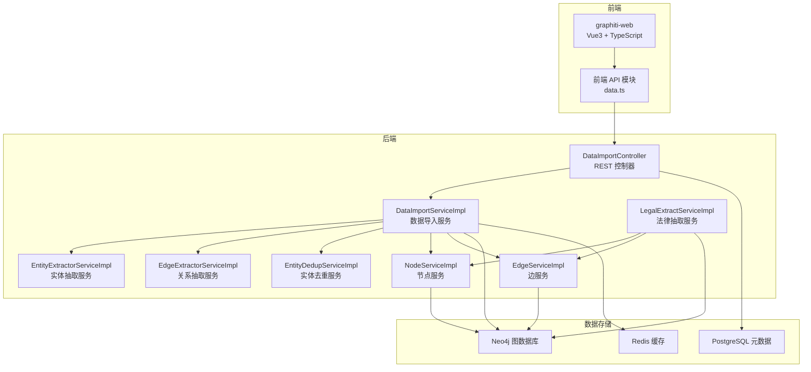
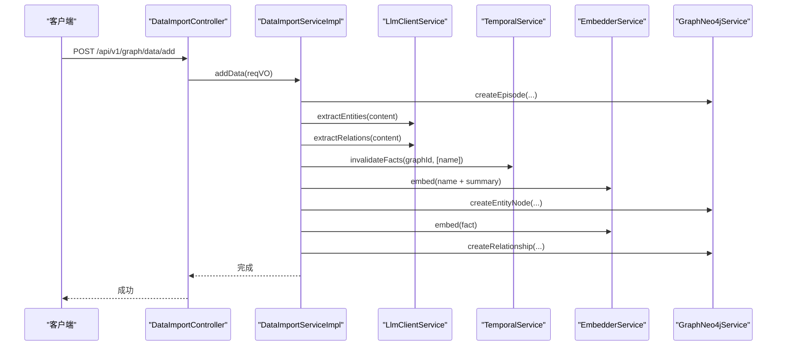
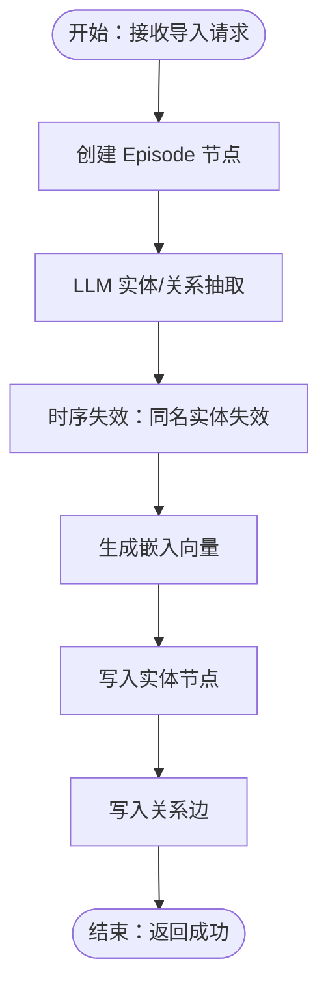
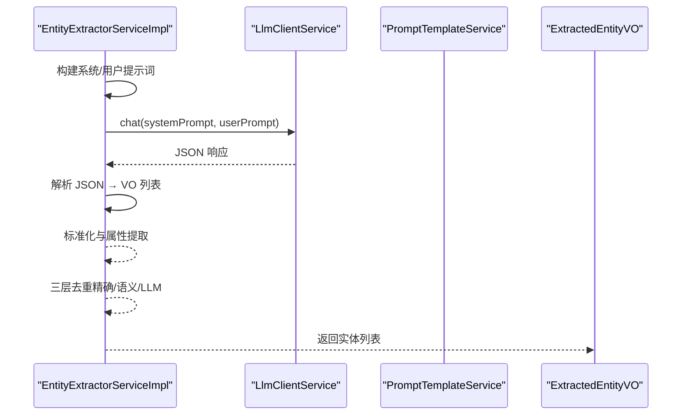
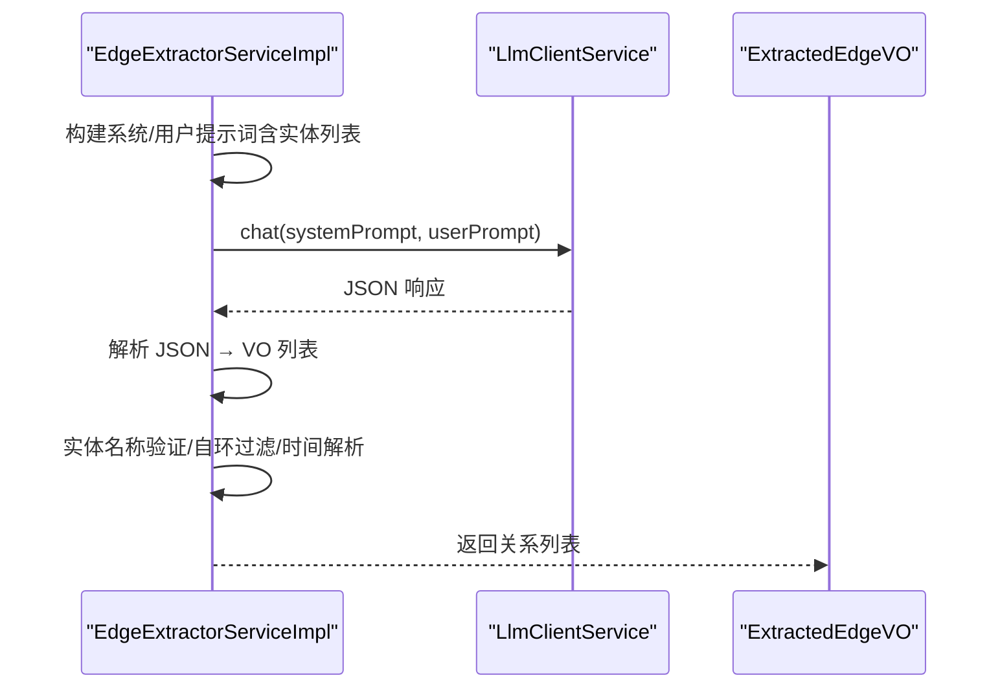
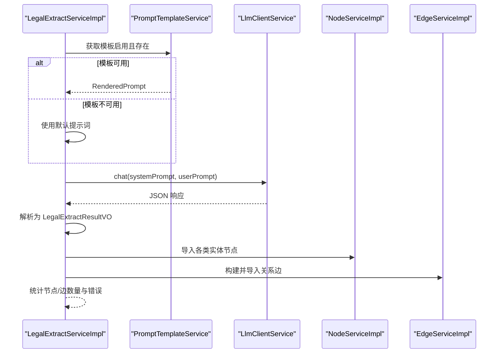
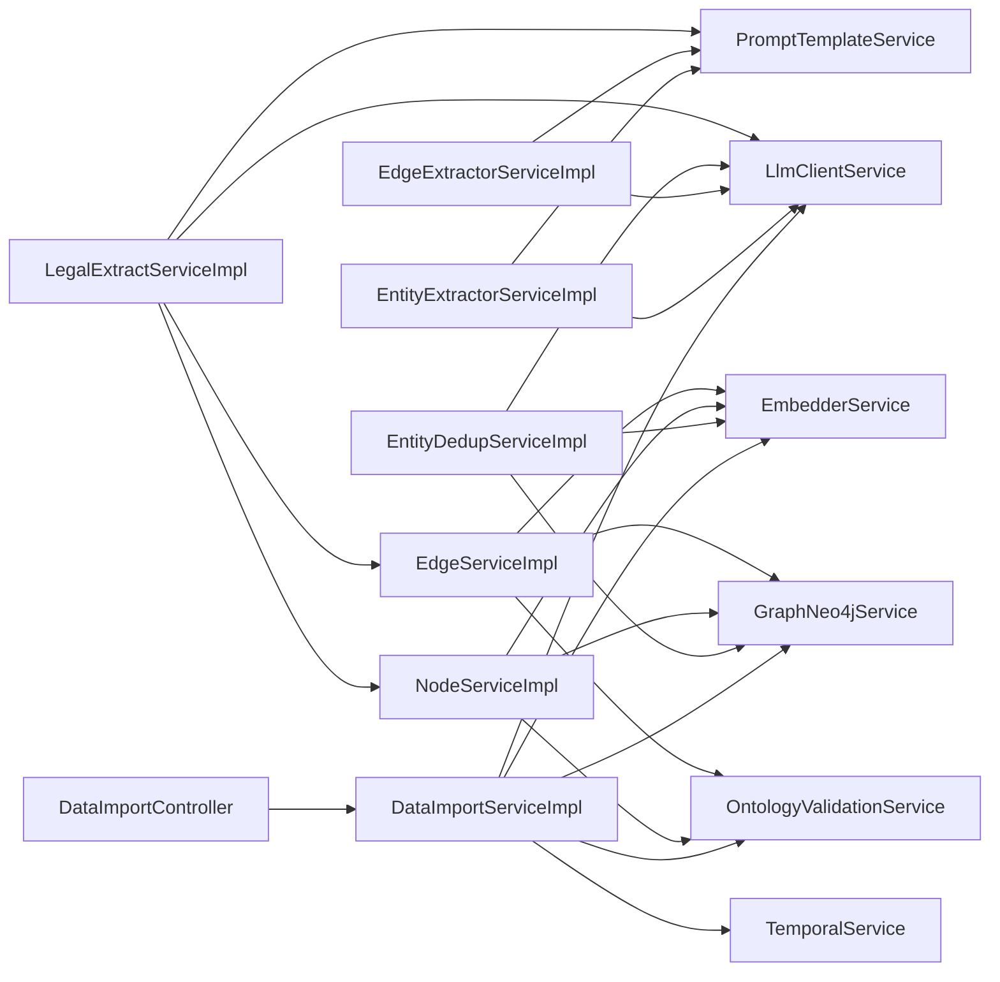

# 数据处理管道

<!--<cite>
**本文引用的文件**
- [README_CN.md](file://README_CN.md)
- [DataImportController.java](file://graphiti-module-core/src/main/java/com/graphiti/module/graphiti/controller/admin/DataImportController.java)
- [DataImportServiceImpl.java](file://graphiti-module-core/src/main/java/com/graphiti/module/graphiti/service/impl/DataImportServiceImpl.java)
- [EntityExtractorServiceImpl.java](file://graphiti-module-core/src/main/java/com/graphiti/module/graphiti/service/impl/EntityExtractorServiceImpl.java)
- [EdgeExtractorServiceImpl.java](file://graphiti-module-core/src/main/java/com/graphiti/module/graphiti/service/impl/EdgeExtractorServiceImpl.java)
- [EntityDedupServiceImpl.java](file://graphiti-module-core/src/main/java/com/graphiti/module/graphiti/service/impl/EntityDedupServiceImpl.java)
- [NodeServiceImpl.java](file://graphiti-module-core/src/main/java/com/graphiti/module/graphiti/service/impl/NodeServiceImpl.java)
- [EdgeServiceImpl.java](file://graphiti-module-core/src/main/java/com/graphiti/module/graphiti/service/impl/EdgeServiceImpl.java)
- [LegalExtractServiceImpl.java](file://graphiti-module-core/src/main/java/com/graphiti/module/graphiti/service/impl/LegalExtractServiceImpl.java)
- [ExtractedEntityVO.java](file://graphiti-module-core/src/main/java/com/graphiti/module/graphiti/vo/extractor/ExtractedEntityVO.java)
- [BatchExtractEntitiesVO.java](file://graphiti-module-core/src/main/java/com/graphiti/module/graphiti/vo/extractor/BatchExtractEntitiesVO.java)
- [LegalExtractResultVO.java](file://graphiti-module-core/src/main/java/com/graphiti/module/graphiti/vo/legal/LegalExtractResultVO.java)
- [data.ts](file://graphiti-web/src/api/data.ts)
</cite>-->

## 目录
1. [简介](#简介)
2. [项目结构](#项目结构)
3. [核心组件](#核心组件)
4. [架构总览](#架构总览)
5. [详细组件分析](#详细组件分析)
6. [依赖分析](#依赖分析)
7. [性能考虑](#性能考虑)
8. [故障排查指南](#故障排查指南)
9. [结论](#结论)
10. [附录](#附录)

## 简介
本文件系统化梳理 Graphiti-Java 的数据处理管道，覆盖三大核心流程：
- 数据导入管道：文件上传 → 格式验证 → 数据解析 → 批量处理 → 数据库写入
- 实体抽取管道：文本预处理 → LLM 调用 → 实体识别 → 标准化 → 去重 → 存储
- 关系抽取管道：实体对生成 → 关系分类 → 置信度评估 → 关系验证 → 图数据库存储
- 法律数据抽取流程：法律文本解析 → 要素提取 → 结构化存储 → 本体映射

文档同时给出各流程的输入输出格式、处理步骤、错误处理机制、性能监控与优化建议，并提供面向开发者的完整实现指南。

## 项目结构
Graphiti-Java 采用模块化分层设计，核心数据处理逻辑集中在 graphiti-module-core 模块的服务层，控制器负责对外暴露 REST API，前端通过 graphiti-web 提供可视化导入与监控界面。

**图表来源**
- [DataImportController.java:22-111](file://graphiti-module-core/src/main/java/com/graphiti/module/graphiti/controller/admin/DataImportController.java#L22-L111)
- [DataImportServiceImpl.java:27-323](file://graphiti-module-core/src/main/java/com/graphiti/module/graphiti/service/impl/DataImportServiceImpl.java#L27-L323)
- [EntityExtractorServiceImpl.java:26-306](file://graphiti-module-core/src/main/java/com/graphiti/module/graphiti/service/impl/EntityExtractorServiceImpl.java#L26-L306)
- [EdgeExtractorServiceImpl.java:26-362](file://graphiti-module-core/src/main/java/com/graphiti/module/graphiti/service/impl/EdgeExtractorServiceImpl.java#L26-L362)
- [EntityDedupServiceImpl.java:41-398](file://graphiti-module-core/src/main/java/com/graphiti/module/graphiti/service/impl/EntityDedupServiceImpl.java#L41-L398)
- [NodeServiceImpl.java:26-214](file://graphiti-module-core/src/main/java/com/graphiti/module/graphiti/service/impl/NodeServiceImpl.java#L26-L214)
- [EdgeServiceImpl.java:25-172](file://graphiti-module-core/src/main/java/com/graphiti/module/graphiti/service/impl/EdgeServiceImpl.java#L25-L172)
- [LegalExtractServiceImpl.java:22-820](file://graphiti-module-core/src/main/java/com/graphiti/module/graphiti/service/impl/LegalExtractServiceImpl.java#L22-L820)

**章节来源**
- [README_CN.md:110-166](file://README_CN.md#L110-L166)

## 核心组件
- 控制器层：DataImportController 提供 /api/v1/graph/data 下的导入接口，包括单条、批量、消息、三元组、实体节点直写等。
- 服务层：
  - DataImportServiceImpl：集成 LLM 实体/关系抽取，创建 Episode、节点与关系，生成嵌入向量，写入 Neo4j。
  - EntityExtractorServiceImpl：基于 LLM 的实体抽取，支持文本、JSON、消息三种输入，输出 ExtractedEntityVO。
  - EdgeExtractorServiceImpl：基于 LLM 的关系抽取，支持文本、消息输入，输出 ExtractedEdgeVO。
  - EntityDedupServiceImpl：三层去重策略（精确匹配、MinHash+LSH 语义匹配、LLM 判重），输出 DedupResultVO。
  - NodeServiceImpl/EdgeServiceImpl：节点/边的创建、查询、删除，内置本体校验与嵌入生成。
  - LegalExtractServiceImpl：法律知识图谱抽取与导入，支持模板化提示词与字段映射。
- 视图对象（VO）：ExtractedEntityVO、BatchExtractEntitiesVO、LegalExtractResultVO 等，承载抽取结果与统计信息。
- 前端 API：data.ts 提供导入任务执行、预览与错误展示。

**章节来源**
- [DataImportController.java:22-111](file://graphiti-module-core/src/main/java/com/graphiti/module/graphiti/controller/admin/DataImportController.java#L22-L111)
- [DataImportServiceImpl.java:27-323](file://graphiti-module-core/src/main/java/com/graphiti/module/graphiti/service/impl/DataImportServiceImpl.java#L27-L323)
- [EntityExtractorServiceImpl.java:26-306](file://graphiti-module-core/src/main/java/com/graphiti/module/graphiti/service/impl/EntityExtractorServiceImpl.java#L26-L306)
- [EdgeExtractorServiceImpl.java:26-362](file://graphiti-module-core/src/main/java/com/graphiti/module/graphiti/service/impl/EdgeExtractorServiceImpl.java#L26-L362)
- [EntityDedupServiceImpl.java:41-398](file://graphiti-module-core/src/main/java/com/graphiti/module/graphiti/service/impl/EntityDedupServiceImpl.java#L41-L398)
- [NodeServiceImpl.java:26-214](file://graphiti-module-core/src/main/java/com/graphiti/module/graphiti/service/impl/NodeServiceImpl.java#L26-L214)
- [EdgeServiceImpl.java:25-172](file://graphiti-module-core/src/main/java/com/graphiti/module/graphiti/service/impl/EdgeServiceImpl.java#L25-L172)
- [LegalExtractServiceImpl.java:22-820](file://graphiti-module-core/src/main/java/com/graphiti/module/graphiti/service/impl/LegalExtractServiceImpl.java#L22-L820)
- [ExtractedEntityVO.java:14-37](file://graphiti-module-core/src/main/java/com/graphiti/module/graphiti/vo/extractor/ExtractedEntityVO.java#L14-L37)
- [BatchExtractEntitiesVO.java:12-23](file://graphiti-module-core/src/main/java/com/graphiti/module/graphiti/vo/extractor/BatchExtractEntitiesVO.java#L12-L23)
- [LegalExtractResultVO.java:18-81](file://graphiti-module-core/src/main/java/com/graphiti/module/graphiti/vo/legal/LegalExtractResultVO.java#L18-L81)
- [data.ts:132-201](file://graphiti-web/src/api/data.ts#L132-L201)

## 架构总览
下图展示了从“添加单条数据”到“实体/关系写入”的完整调用链路，体现 LLM 驱动的抽取与 Neo4j 存储的协作关系。

**图表来源**
- [DataImportController.java:32-38](file://graphiti-module-core/src/main/java/com/graphiti/module/graphiti/controller/admin/DataImportController.java#L32-L38)
- [DataImportServiceImpl.java:36-109](file://graphiti-module-core/src/main/java/com/graphiti/module/graphiti/service/impl/DataImportServiceImpl.java#L36-L109)

**章节来源**
- [README_CN.md:406-431](file://README_CN.md#L406-L431)

## 详细组件分析

### 数据导入管道（文件上传→格式验证→数据解析→批量处理→数据库写入）
- 输入
  - 单条数据：AddDataReqVO（graphId、name、content、sourceType、sourceDescription）
  - 批量数据：AddDataBatchReqVO（items: List<AddDataReqVO>）
  - 消息数据：AddMessagesReqVO（messages: List<{role, content}>）
  - 三元组：FactTripleReqVO（sourceNodeName、relationType、targetNodeName、fact、properties）
  - 实体节点直写：Map<String, Object>（name、type、summary、properties）
- 处理步骤
  - 创建 Episode 节点，记录来源与内容
  - LLM 实体抽取与关系抽取
  - 时序失效（同名实体）与嵌入生成
  - 写入实体节点与关系边至 Neo4j
- 输出
  - 成功标志（CommonResult<Boolean>）
  - 前端任务状态（data.ts 中的 ImportTask）
- 错误处理
  - 控制器层：@Valid 参数校验，统一返回 CommonResult
  - 服务层：业务异常 BusinessException、本体检错 OntologyValidationException
  - 前端：data.ts 返回错误信息与进度

**图表来源**
- [DataImportServiceImpl.java:36-109](file://graphiti-module-core/src/main/java/com/graphiti/module/graphiti/service/impl/DataImportServiceImpl.java#L36-L109)
- [DataImportController.java:32-72](file://graphiti-module-core/src/main/java/com/graphiti/module/graphiti/controller/admin/DataImportController.java#L32-L72)
- [data.ts:139-185](file://graphiti-web/src/api/data.ts#L139-L185)

**章节来源**
- [DataImportController.java:22-111](file://graphiti-module-core/src/main/java/com/graphiti/module/graphiti/controller/admin/DataImportController.java#L22-L111)
- [DataImportServiceImpl.java:27-323](file://graphiti-module-core/src/main/java/com/graphiti/module/graphiti/service/impl/DataImportServiceImpl.java#L27-L323)
- [data.ts:132-201](file://graphiti-web/src/api/data.ts#L132-L201)

### 实体抽取管道（文本预处理→LLM调用→实体识别→标准化→去重→存储）
- 输入
  - 文本：extractFromText(content, entityTypesConfig, customInstructions)
  - JSON：extractFromJson(jsonContent, sourceDescription, entityTypesConfig, customInstructions)
  - 消息：extractFromMessage(content, previousEpisodes, entityTypesConfig, customInstructions)
  - 模板：extractWithTemplate(content, sourceType, templateCode, variables)
- 处理步骤
  - 构建系统提示词与用户提示词（包含实体类型定义、自定义指令、上下文）
  - LLM chat 返回 JSON，解析为 ExtractedEntityVO 列表
  - 标准化（名称规范化、摘要生成、属性提取）
  - 三层去重：精确匹配 → 语义匹配（MinHash+LSH，Jaccard≥0.9）→ LLM 判重
- 输出
  - List<ExtractedEntityVO>
  - BatchExtractEntitiesVO（批量统计）
- 错误处理
  - 响应解析失败时回退到纯文本解析
  - 日志记录解析异常与跳过项

**图表来源**
- [EntityExtractorServiceImpl.java:52-128](file://graphiti-module-core/src/main/java/com/graphiti/module/graphiti/service/impl/EntityExtractorServiceImpl.java#L52-L128)
- [ExtractedEntityVO.java:14-37](file://graphiti-module-core/src/main/java/com/graphiti/module/graphiti/vo/extractor/ExtractedEntityVO.java#L14-L37)
- [BatchExtractEntitiesVO.java:12-23](file://graphiti-module-core/src/main/java/com/graphiti/module/graphiti/vo/extractor/BatchExtractEntitiesVO.java#L12-L23)

**章节来源**
- [EntityExtractorServiceImpl.java:26-306](file://graphiti-module-core/src/main/java/com/graphiti/module/graphiti/service/impl/EntityExtractorServiceImpl.java#L26-L306)
- [ExtractedEntityVO.java:14-37](file://graphiti-module-core/src/main/java/com/graphiti/module/graphiti/vo/extractor/ExtractedEntityVO.java#L14-L37)
- [BatchExtractEntitiesVO.java:12-23](file://graphiti-module-core/src/main/java/com/graphiti/module/graphiti/vo/extractor/BatchExtractEntitiesVO.java#L12-L23)

### 关系抽取管道（实体对生成→关系分类→置信度评估→关系验证→图数据库存储）
- 输入
  - 文本：extractFromText(content, entities, referenceTime, edgeTypesConfig, customInstructions)
  - 消息：extractFromMessage(content, entities, previousEpisodes, referenceTime, edgeTypesConfig, customInstructions)
  - 模板：extractWithTemplate(content, entities, sourceType, templateCode, variables)
- 处理步骤
  - 构建关系类型定义与实体上下文提示词
  - LLM 返回 JSON，解析为 ExtractedEdgeVO 列表
  - 实体名称验证（必须存在于 entities）、自环过滤、时间字段解析
  - 嵌入生成与关系创建
- 输出
  - List<ExtractedEdgeVO>
- 错误处理
  - 实体名称不在列表或自环关系会被跳过
  - 日期解析失败时记录日志并忽略时间字段

**图表来源**
- [EdgeExtractorServiceImpl.java:58-89](file://graphiti-module-core/src/main/java/com/graphiti/module/graphiti/service/impl/EdgeExtractorServiceImpl.java#L58-L89)

**章节来源**
- [EdgeExtractorServiceImpl.java:26-362](file://graphiti-module-core/src/main/java/com/graphiti/module/graphiti/service/impl/EdgeExtractorServiceImpl.java#L26-L362)

### 法律数据抽取流程（法律文本解析→要素提取→结构化存储→本体映射）
- 输入
  - JSON：extractFromJson(graphId, jsonContent, fieldMapping, sourceFileName)
  - 模板：extractWithTemplate(graphId, jsonContent, templateCode, sourceFileName)
- 处理步骤
  - 尝试加载配置化提示词模板（启用且存在），否则回退默认提示词
  - LLM 返回 JSON，解析 LegalExtractResultVO
  - 导入节点：Case、Party、Court、Judge、LegalProvision、Lawyer、Evidence、JudgmentDocument
  - 构建并导入边：案件-当事人、案件-法院、案件-法官等
- 输出
  - LegalExtractResultVO（包含各类实体列表、错误信息、总数统计）
- 错误处理
  - 模板获取失败或禁用时回退默认提示词
  - 导入过程中捕获异常并追加到 errors

**图表来源**
- [LegalExtractServiceImpl.java:76-206](file://graphiti-module-core/src/main/java/com/graphiti/module/graphiti/service/impl/LegalExtractServiceImpl.java#L76-L206)
- [LegalExtractResultVO.java:18-81](file://graphiti-module-core/src/main/java/com/graphiti/module/graphiti/vo/legal/LegalExtractResultVO.java#L18-L81)

**章节来源**
- [LegalExtractServiceImpl.java:22-820](file://graphiti-module-core/src/main/java/com/graphiti/module/graphiti/service/impl/LegalExtractServiceImpl.java#L22-L820)
- [LegalExtractResultVO.java:18-81](file://graphiti-module-core/src/main/java/com/graphiti/module/graphiti/vo/legal/LegalExtractResultVO.java#L18-L81)

## 依赖分析
- 控制器依赖服务：DataImportController 依赖 DataImportServiceImpl
- 服务内部依赖：DataImportServiceImpl 依赖 LlmClientService、EmbedderService、GraphNeo4jService、TemporalService、OntologyValidationService
- 实体/关系抽取：EntityExtractorServiceImpl、EdgeExtractorServiceImpl 依赖 LlmClientService、PromptTemplateService
- 去重与存储：EntityDedupServiceImpl 依赖 EmbedderService、LlmClientService、GraphNeo4jService
- 节点/边服务：NodeServiceImpl、EdgeServiceImpl 依赖 GraphNeo4jService、EmbedderService、OntologyValidationService
- 前端依赖：data.ts 依赖后端导入接口，负责任务状态与错误展示

**图表来源**
- [DataImportServiceImpl.java:29-33](file://graphiti-module-core/src/main/java/com/graphiti/module/graphiti/service/impl/DataImportServiceImpl.java#L29-L33)
- [EntityExtractorServiceImpl.java:28-30](file://graphiti-module-core/src/main/java/com/graphiti/module/graphiti/service/impl/EntityExtractorServiceImpl.java#L28-L30)
- [EdgeExtractorServiceImpl.java:28-30](file://graphiti-module-core/src/main/java/com/graphiti/module/graphiti/service/impl/EdgeExtractorServiceImpl.java#L28-L30)
- [EntityDedupServiceImpl.java:43-45](file://graphiti-module-core/src/main/java/com/graphiti/module/graphiti/service/impl/EntityDedupServiceImpl.java#L43-L45)
- [NodeServiceImpl.java:28-30](file://graphiti-module-core/src/main/java/com/graphiti/module/graphiti/service/impl/NodeServiceImpl.java#L28-L30)
- [EdgeServiceImpl.java:27-29](file://graphiti-module-core/src/main/java/com/graphiti/module/graphiti/service/impl/EdgeServiceImpl.java#L27-L29)
- [LegalExtractServiceImpl.java:24-29](file://graphiti-module-core/src/main/java/com/graphiti/module/graphiti/service/impl/LegalExtractServiceImpl.java#L24-L29)

**章节来源**
- [README_CN.md:170-218](file://README_CN.md#L170-L218)

## 性能考虑
- 批量处理
  - DataImportServiceImpl.addDataBatch 当前为顺序循环调用 addData，建议引入并行处理（线程池/异步）与批量写入事务，减少 LLM 调用次数与数据库往返。
- 嵌入生成
  - 实体/关系嵌入在创建前后多次生成，建议缓存已生成向量并复用，避免重复计算。
- 去重策略
  - MinHash+LSH 与余弦相似度查询可配合向量化索引与并发查询，降低 O(n^2) 复杂度。
- LLM 调用
  - 合理拆分提示词长度，控制上下文窗口；对重复内容进行去重与合并，减少冗余调用。
- 存储写入
  - 使用事务批量写入（Neo4j 的批量语句或驱动提供的批量 API），减少网络开销与锁竞争。
- 监控指标
  - 建议埋点：LLM 调用耗时、嵌入生成耗时、去重命中率、写入吞吐、错误率、队列长度与重试次数。

[本节为通用指导，无需具体文件引用]

## 故障排查指南
- 控制器层
  - 参数校验失败：检查请求体格式与必填字段（如 graphId、content），查看统一返回的错误码与消息。
- 服务层
  - 业务异常 BusinessException：常见于节点名称为空、边源/目标为空、创建失败等，需根据异常码定位问题。
  - 本体检错 OntologyValidationException：检查实体类型与属性是否符合本体定义，必要时开启 enrichedProperties 合并。
- 实体/关系抽取
  - LLM 响应解析失败：查看日志中“解析响应失败”，确认提示词模板与 LLM 返回格式一致性。
  - 实体名称不在列表或自环：属于预期过滤行为，检查上游实体抽取是否正确。
- 法律抽取
  - 模板未启用或获取失败：回退默认提示词，检查模板状态与变量渲染。
  - 导入异常：errors 列表包含具体错误，逐条排查实体/边导入逻辑。
- 前端任务
  - data.ts 中 ImportTask.status 与 errorMessage 反映后端处理状态与错误详情，便于用户侧定位问题。

**章节来源**
- [DataImportController.java:32-111](file://graphiti-module-core/src/main/java/com/graphiti/module/graphiti/controller/admin/DataImportController.java#L32-L111)
- [DataImportServiceImpl.java:267-279](file://graphiti-module-core/src/main/java/com/graphiti/module/graphiti/service/impl/DataImportServiceImpl.java#L267-L279)
- [EntityExtractorServiceImpl.java:218-222](file://graphiti-module-core/src/main/java/com/graphiti/module/graphiti/service/impl/EntityExtractorServiceImpl.java#L218-L222)
- [EdgeExtractorServiceImpl.java:249-259](file://graphiti-module-core/src/main/java/com/graphiti/module/graphiti/service/impl/EdgeExtractorServiceImpl.java#L249-L259)
- [LegalExtractServiceImpl.java:114-121](file://graphiti-module-core/src/main/java/com/graphiti/module/graphiti/service/impl/LegalExtractServiceImpl.java#L114-L121)
- [data.ts:139-185](file://graphiti-web/src/api/data.ts#L139-L185)

## 结论
Graphiti-Java 的数据处理管道以 LLM 为核心，结合本体校验、嵌入向量与 Neo4j 存储，形成从非结构化到结构化知识图谱的完整流水线。通过三层实体去重策略与严格的本体检错，确保数据质量与一致性。建议在生产环境中进一步优化批量处理、嵌入缓存与存储写入，并完善性能监控与告警体系，以支撑大规模知识图谱构建与检索需求。

[本节为总结性内容，无需具体文件引用]

## 附录
- API 分组与路径
  - 数据导入：/api/v1/graph/data/*
  - 节点/边/图谱管理：/api/v1/nodes/*、/api/v1/edges/*、/api/v1/graph/*
- 关键 VO 类型
  - 实体：ExtractedEntityVO、BatchExtractEntitiesVO
  - 关系：ExtractedEdgeVO（由 EdgeExtractorServiceImpl 生成）
  - 法律：LegalExtractResultVO
- 前端导入任务
  - data.ts 提供导入执行、预览与任务状态展示

**章节来源**
- [README_CN.md:415-431](file://README_CN.md#L415-L431)
- [ExtractedEntityVO.java:14-37](file://graphiti-module-core/src/main/java/com/graphiti/module/graphiti/vo/extractor/ExtractedEntityVO.java#L14-L37)
- [BatchExtractEntitiesVO.java:12-23](file://graphiti-module-core/src/main/java/com/graphiti/module/graphiti/vo/extractor/BatchExtractEntitiesVO.java#L12-L23)
- [LegalExtractResultVO.java:18-81](file://graphiti-module-core/src/main/java/com/graphiti/module/graphiti/vo/legal/LegalExtractResultVO.java#L18-L81)
- [data.ts:132-201](file://graphiti-web/src/api/data.ts#L132-L201)