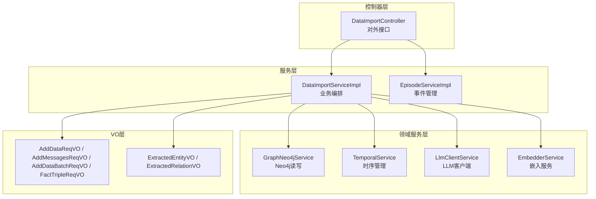
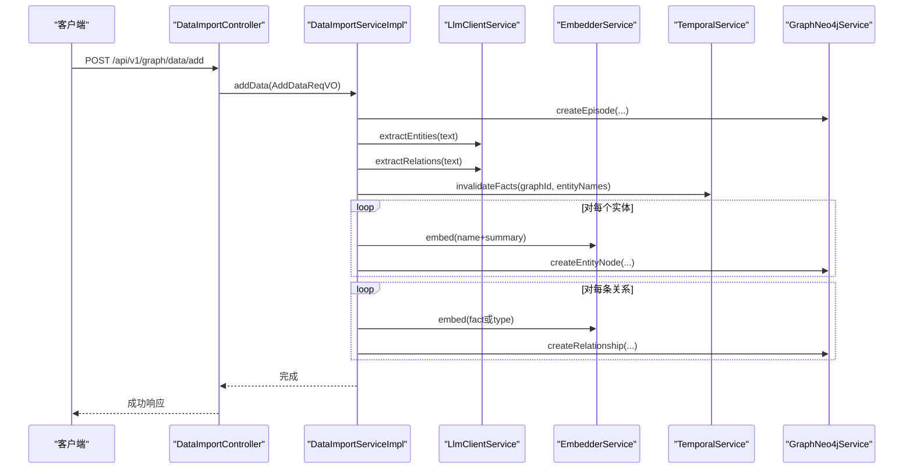
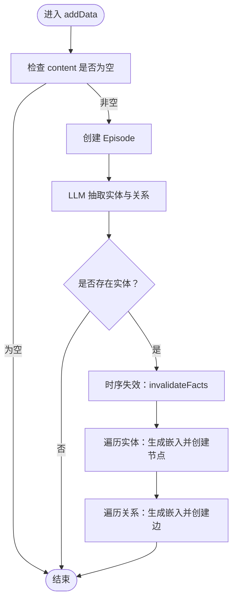
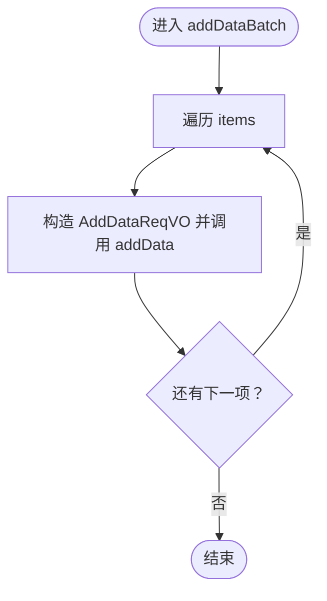
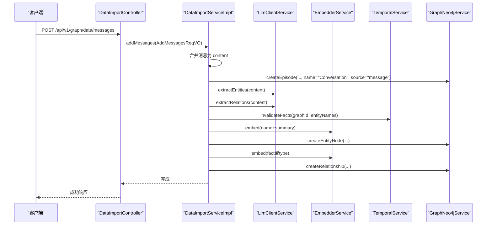
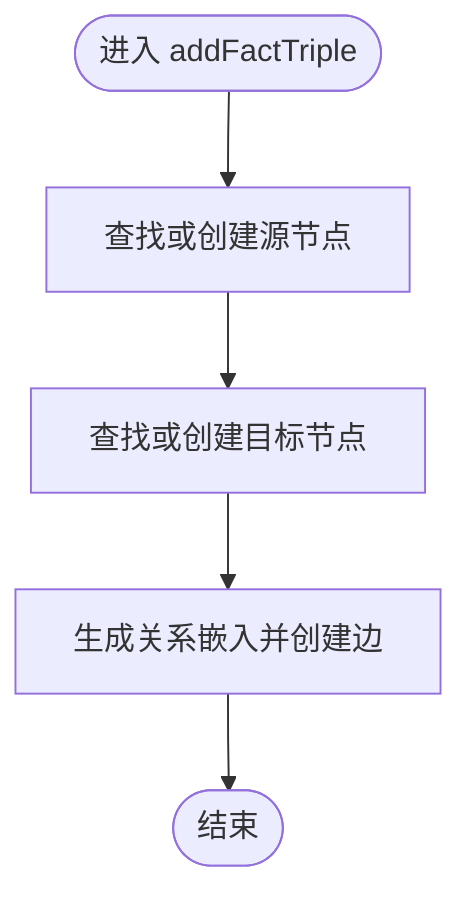
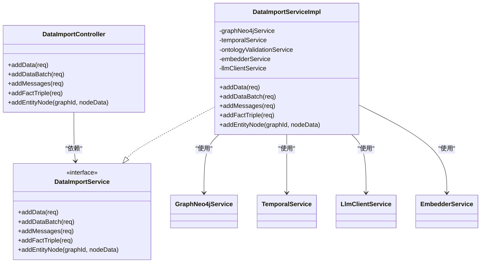

# 数据导入管道

<!--<cite>
**本文引用的文件**
- [DataImportController.java](file://graphiti-module-core/src/main/java/com/graphiti/module/graphiti/controller/admin/DataImportController.java)
- [DataImportServiceImpl.java](file://graphiti-module-core/src/main/java/com/graphiti/module/graphiti/service/impl/DataImportServiceImpl.java)
- [AddDataReqVO.java](file://graphiti-module-core/src/main/java/com/graphiti/module/graphiti/vo/import/AddDataReqVO.java)
- [AddMessagesReqVO.java](file://graphiti-module-core/src/main/java/com/graphiti/module/graphiti/vo/import/AddMessagesReqVO.java)
- [AddDataBatchReqVO.java](file://graphiti-module-core/src/main/java/com/graphiti/module/graphiti/vo/imports/AddDataBatchReqVO.java)
- [BatchDataItemVO.java](file://graphiti-module-core/src/main/java/com/graphiti/module/graphiti/vo/import/BatchDataItemVO.java)
- [FactTripleReqVO.java](file://graphiti-module-core/src/main/java/com/graphiti/module/graphiti/vo/import/FactTripleReqVO.java)
- [ExtractedEntityVO.java](file://graphiti-module-core/src/main/java/com/graphiti/module/graphiti/vo/llm/ExtractedEntityVO.java)
- [ExtractedRelationVO.java](file://graphiti-module-core/src/main/java/com/graphiti/module/graphiti/vo/llm/ExtractedRelationVO.java)
- [DataImportService.java](file://graphiti-module-core/src/main/java/com/graphiti/module/graphiti/service/DataImportService.java)
- [TemporalService.java](file://graphiti-module-core/src/main/java/com/graphiti/module/graphiti/service/TemporalService.java)
- [GraphNeo4jService.java](file://graphiti-module-core/src/main/java/com/graphiti/module/graphiti/service/GraphNeo4jService.java)
- [LlmClientService.java](file://graphiti-module-core/src/main/java/com/graphiti/module/graphiti/service/LlmClientService.java)
- [EmbedderService.java](file://graphiti-module-core/src/main/java/com/graphiti/module/graphiti/service/EmbedderService.java)
</cite>-->

## 目录
1. [简介](#简介)
2. [项目结构](#项目结构)
3. [核心组件](#核心组件)
4. [架构总览](#架构总览)
5. [详细组件分析](#详细组件分析)
6. [依赖分析](#依赖分析)
7. [性能考虑](#性能考虑)
8. [故障排查指南](#故障排查指南)
9. [结论](#结论)
10. [附录](#附录)

## 简介
本文件面向Graphiti-Java的数据导入管道，围绕“单条数据导入”“批量数据导入”“消息对话导入”三大场景，系统梳理从请求参数校验、Episode事件创建、LLM实体与关系抽取、嵌入向量生成、节点与关系创建，到时序管理失效处理的完整流程，并给出并行优化策略、错误处理机制、API使用示例与最佳实践。

## 项目结构
数据导入相关代码主要位于模块graphiti-module-core中，采用“控制器-服务-领域服务-VO/接口”的分层设计：
- 控制器层：对外暴露REST接口，负责参数校验与响应封装
- 服务层：实现业务编排，协调LLM、嵌入、图数据库与时间序列服务
- 领域服务层：封装Neo4j读写、时序管理、嵌入与LLM客户端等能力
- VO层：定义请求与响应的数据结构

图表来源
- [DataImportController.java:1-112](file://graphiti-module-core/src/main/java/com/graphiti/module/graphiti/controller/admin/DataImportController.java#L1-L112)
- [DataImportServiceImpl.java:1-323](file://graphiti-module-core/src/main/java/com/graphiti/module/graphiti/service/impl/DataImportServiceImpl.java#L1-L323)
- [GraphNeo4jService.java:18-1346](file://graphiti-module-core/src/main/java/com/graphiti/module/graphiti/service/GraphNeo4jService.java#L18-L1346)
- [TemporalService.java:1-95](file://graphiti-module-core/src/main/java/com/graphiti/module/graphiti/service/TemporalService.java#L1-L95)
- [LlmClientService.java:1-158](file://graphiti-module-core/src/main/java/com/graphiti/module/graphiti/service/LlmClientService.java#L1-L158)
- [EmbedderService.java:1-41](file://graphiti-module-core/src/main/java/com/graphiti/module/graphiti/service/EmbedderService.java#L1-L41)
- [AddDataReqVO.java:1-40](file://graphiti-module-core/src/main/java/com/graphiti/module/graphiti/vo/import/AddDataReqVO.java#L1-L40)
- [AddMessagesReqVO.java:1-46](file://graphiti-module-core/src/main/java/com/graphiti/module/graphiti/vo/import/AddMessagesReqVO.java#L1-L46)
- [AddDataBatchReqVO.java:1-36](file://graphiti-module-core/src/main/java/com/graphiti/module/graphiti/vo/imports/AddDataBatchReqVO.java#L1-L36)
- [FactTripleReqVO.java:1-39](file://graphiti-module-core/src/main/java/com/graphiti/module/graphiti/vo/import/FactTripleReqVO.java#L1-L39)
- [ExtractedEntityVO.java:1-41](file://graphiti-module-core/src/main/java/com/graphiti/module/graphiti/vo/llm/ExtractedEntityVO.java#L1-L41)
- [ExtractedRelationVO.java:1-40](file://graphiti-module-core/src/main/java/com/graphiti/module/graphiti/vo/llm/ExtractedRelationVO.java#L1-L40)

章节来源
- [DataImportController.java:1-112](file://graphiti-module-core/src/main/java/com/graphiti/module/graphiti/controller/admin/DataImportController.java#L1-L112)
- [DataImportServiceImpl.java:1-323](file://graphiti-module-core/src/main/java/com/graphiti/module/graphiti/service/impl/DataImportServiceImpl.java#L1-L323)

## 核心组件
- 数据导入控制器：提供/add、/batch、/messages、/fact-triple等接口，统一参数校验与响应包装
- 数据导入服务：实现单条/批量/对话/三元组导入的完整编排逻辑
- 图数据库服务：封装节点、关系、Episode的创建、查询与清理
- 时序服务：负责实体与关系在时间维度上的有效性与失效处理
- LLM客户端服务：封装实体与关系抽取的提示词模板与调用
- 嵌入服务：提供文本向量化能力，支撑相似度检索与语义搜索

章节来源
- [DataImportController.java:22-112](file://graphiti-module-core/src/main/java/com/graphiti/module/graphiti/controller/admin/DataImportController.java#L22-L112)
- [DataImportService.java:1-75](file://graphiti-module-core/src/main/java/com/graphiti/module/graphiti/service/DataImportService.java#L1-L75)
- [GraphNeo4jService.java:18-1346](file://graphiti-module-core/src/main/java/com/graphiti/module/graphiti/service/GraphNeo4jService.java#L18-L1346)
- [TemporalService.java:19-95](file://graphiti-module-core/src/main/java/com/graphiti/module/graphiti/service/TemporalService.java#L19-L95)
- [LlmClientService.java:17-158](file://graphiti-module-core/src/main/java/com/graphiti/module/graphiti/service/LlmClientService.java#L17-L158)
- [EmbedderService.java:9-41](file://graphiti-module-core/src/main/java/com/graphiti/module/graphiti/service/EmbedderService.java#L9-L41)

## 架构总览
下图展示数据导入的总体调用链路与组件交互：

图表来源
- [DataImportController.java:32-38](file://graphiti-module-core/src/main/java/com/graphiti/module/graphiti/controller/admin/DataImportController.java#L32-L38)
- [DataImportServiceImpl.java:35-109](file://graphiti-module-core/src/main/java/com/graphiti/module/graphiti/service/impl/DataImportServiceImpl.java#L35-L109)
- [LlmClientService.java:110-142](file://graphiti-module-core/src/main/java/com/graphiti/module/graphiti/service/LlmClientService.java#L110-L142)
- [EmbedderService.java:17-25](file://graphiti-module-core/src/main/java/com/graphiti/module/graphiti/service/EmbedderService.java#L17-L25)
- [TemporalService.java:26](file://graphiti-module-core/src/main/java/com/graphiti/module/graphiti/service/TemporalService.java#L26)
- [GraphNeo4jService.java:41-127](file://graphiti-module-core/src/main/java/com/graphiti/module/graphiti/service/GraphNeo4jService.java#L41-L127)

## 详细组件分析

### 单条数据导入流程（AddDataReqVO）
- 参数校验：graphId、content必填；name、sourceType、sourceDescription、referenceTime、updateCommunities可选
- Episode创建：为本次导入创建一个Episode，记录来源、描述与内容
- LLM抽取：分别调用实体与关系抽取，得到结构化结果
- 时序失效：针对同名实体执行失效处理，避免历史事实污染
- 嵌入生成：对实体名称+摘要生成向量，对关系事实或类型生成向量
- 节点与关系创建：写入实体节点与关系边，统一设置valid_at、embedding等属性

图表来源
- [DataImportServiceImpl.java:35-109](file://graphiti-module-core/src/main/java/com/graphiti/module/graphiti/service/impl/DataImportServiceImpl.java#L35-L109)
- [AddDataReqVO.java:17-39](file://graphiti-module-core/src/main/java/com/graphiti/module/graphiti/vo/import/AddDataReqVO.java#L17-L39)
- [TemporalService.java:26](file://graphiti-module-core/src/main/java/com/graphiti/module/graphiti/service/TemporalService.java#L26)
- [GraphNeo4jService.java:41-127](file://graphiti-module-core/src/main/java/com/graphiti/module/graphiti/service/GraphNeo4jService.java#L41-L127)
- [LlmClientService.java:110-142](file://graphiti-module-core/src/main/java/com/graphiti/module/graphiti/service/LlmClientService.java#L110-L142)
- [EmbedderService.java:17-25](file://graphiti-module-core/src/main/java/com/graphiti/module/graphiti/service/EmbedderService.java#L17-L25)

章节来源
- [DataImportServiceImpl.java:35-109](file://graphiti-module-core/src/main/java/com/graphiti/module/graphiti/service/impl/DataImportServiceImpl.java#L35-L109)
- [AddDataReqVO.java:17-39](file://graphiti-module-core/src/main/java/com/graphiti/module/graphiti/vo/import/AddDataReqVO.java#L17-L39)

### 批量数据导入（AddDataBatchReqVO）
- 循环处理：遍历items，逐条调用单条导入逻辑
- 并行优化：当前实现为顺序循环；建议在保证幂等与一致性前提下，引入线程池与批量写入以提升吞吐
- 错误处理：建议在批量内部增加单项失败隔离与重试策略，避免“一错全挂”

图表来源
- [DataImportServiceImpl.java:112-126](file://graphiti-module-core/src/main/java/com/graphiti/module/graphiti/service/impl/DataImportServiceImpl.java#L112-L126)
- [AddDataBatchReqVO.java:22-35](file://graphiti-module-core/src/main/java/com/graphiti/module/graphiti/vo/imports/AddDataBatchReqVO.java#L22-L35)
- [BatchDataItemVO.java:16-28](file://graphiti-module-core/src/main/java/com/graphiti/module/graphiti/vo/import/BatchDataItemVO.java#L16-L28)

章节来源
- [DataImportServiceImpl.java:112-126](file://graphiti-module-core/src/main/java/com/graphiti/module/graphiti/service/impl/DataImportServiceImpl.java#L112-L126)
- [AddDataBatchReqVO.java:22-35](file://graphiti-module-core/src/main/java/com/graphiti/module/graphiti/vo/imports/AddDataBatchReqVO.java#L22-L35)

### 消息对话导入（AddMessagesReqVO）
- 合并对话：将多轮消息拼接为单一文本，作为一次Episode的内容
- 整体抽取：对合并后的内容进行实体与关系抽取，统一创建节点与关系
- Episode创建：以“Conversation”命名，标记为多轮对话来源

图表来源
- [DataImportController.java:48-54](file://graphiti-module-core/src/main/java/com/graphiti/module/graphiti/controller/admin/DataImportController.java#L48-L54)
- [DataImportServiceImpl.java:128-196](file://graphiti-module-core/src/main/java/com/graphiti/module/graphiti/service/impl/DataImportServiceImpl.java#L128-L196)
- [AddMessagesReqVO.java:18-27](file://graphiti-module-core/src/main/java/com/graphiti/module/graphiti/vo/import/AddMessagesReqVO.java#L18-L27)

章节来源
- [DataImportServiceImpl.java:128-196](file://graphiti-module-core/src/main/java/com/graphiti/module/graphiti/service/impl/DataImportServiceImpl.java#L128-L196)
- [AddMessagesReqVO.java:18-46](file://graphiti-module-core/src/main/java/com/graphiti/module/graphiti/vo/import/AddMessagesReqVO.java#L18-L46)

### 事实三元组导入（FactTripleReqVO）
- 节点查找或创建：若源/目标节点不存在则先创建
- 关系创建：生成关系嵌入，写入关系边，支持自定义属性

图表来源
- [DataImportServiceImpl.java:198-224](file://graphiti-module-core/src/main/java/com/graphiti/module/graphiti/service/impl/DataImportServiceImpl.java#L198-L224)
- [FactTripleReqVO.java:17-38](file://graphiti-module-core/src/main/java/com/graphiti/module/graphiti/vo/import/FactTripleReqVO.java#L17-L38)
- [GraphNeo4jService.java:229-243](file://graphiti-module-core/src/main/java/com/graphiti/module/graphiti/service/GraphNeo4jService.java#L229-L243)

章节来源
- [DataImportServiceImpl.java:198-224](file://graphiti-module-core/src/main/java/com/graphiti/module/graphiti/service/impl/DataImportServiceImpl.java#L198-L224)
- [FactTripleReqVO.java:17-38](file://graphiti-module-core/src/main/java/com/graphiti/module/graphiti/vo/import/FactTripleReqVO.java#L17-L38)

### 实体节点直写（addEntityNode）
- 本功能绕过LLM抽取，直接写入实体节点
- 可选的本体校验：若图谱配置了本体，则对节点类型与属性进行校验与增强
- 时序失效：同名实体存在时先失效旧实体
- 嵌入生成与节点创建

章节来源
- [DataImportServiceImpl.java:245-280](file://graphiti-module-core/src/main/java/com/graphiti/module/graphiti/service/impl/DataImportServiceImpl.java#L245-L280)

## 依赖分析
- 控制器依赖服务接口，服务实现依赖多个领域服务（Neo4j、时序、LLM、嵌入）
- VO层为纯数据载体，无业务逻辑耦合
- 服务层通过组合方式解耦具体实现，便于替换Provider与扩展能力

图表来源
- [DataImportController.java:29-30](file://graphiti-module-core/src/main/java/com/graphiti/module/graphiti/controller/admin/DataImportController.java#L29-L30)
- [DataImportService.java:20-75](file://graphiti-module-core/src/main/java/com/graphiti/module/graphiti/service/DataImportService.java#L20-L75)
- [DataImportServiceImpl.java:29-34](file://graphiti-module-core/src/main/java/com/graphiti/module/graphiti/service/impl/DataImportServiceImpl.java#L29-L34)

章节来源
- [DataImportController.java:29-30](file://graphiti-module-core/src/main/java/com/graphiti/module/graphiti/controller/admin/DataImportController.java#L29-L30)
- [DataImportService.java:20-75](file://graphiti-module-core/src/main/java/com/graphiti/module/graphiti/service/DataImportService.java#L20-L75)
- [DataImportServiceImpl.java:29-34](file://graphiti-module-core/src/main/java/com/graphiti/module/graphiti/service/impl/DataImportServiceImpl.java#L29-L34)

## 性能考虑
- 批量导入并行化
  - 当前实现为顺序循环，建议引入线程池与批量写入（如批量创建节点/关系），并确保幂等性与一致性
  - 对LLM调用可采用批处理接口（若Provider支持），降低网络开销
- 嵌入向量生成
  - 将实体名称+摘要、关系事实或类型作为输入，注意控制文本长度与重复度，减少无效计算
  - 若嵌入维度较大，建议在写入前做去重与缓存
- 时序管理
  - 同名实体失效会触发历史边的潜在冲突，建议在批量导入时集中处理，避免频繁扫描
- 图数据库写入
  - 使用参数化Cypher，避免字符串拼接；合理分页与限制返回量，避免内存压力
- 缓存与索引
  - Neo4j全文索引与向量索引需预先初始化，以提升检索性能

[本节为通用性能建议，无需特定文件来源]

## 故障排查指南
- 参数校验失败
  - graphId、content、messages等字段为空或格式不正确会导致校验异常
  - 建议前端在提交前进行基础校验，后端返回明确错误码与提示
- Episode创建失败
  - content为空或数据库异常可能导致创建失败，需检查日志与连接状态
- LLM抽取异常
  - 提示词模板加载失败或JSON解析异常会导致抽取为空；建议增加降级策略（如回退为简单规则或固定结构）
- 嵌入向量异常
  - 嵌入服务不可用或维度不匹配会导致写入失败；建议增加重试与降级
- 时序失效与边冲突
  - 同名实体多次导入时，需确认失效逻辑是否按预期执行；必要时手动清理或回滚
- 删除操作
  - 删除边/图谱/Episode时需确认资源存在性，否则抛出业务异常

章节来源
- [DataImportServiceImpl.java:35-109](file://graphiti-module-core/src/main/java/com/graphiti/module/graphiti/service/impl/DataImportServiceImpl.java#L35-L109)
- [LlmClientService.java:147-156](file://graphiti-module-core/src/main/java/com/graphiti/module/graphiti/service/LlmClientService.java#L147-L156)
- [GraphNeo4jService.java:510-546](file://graphiti-module-core/src/main/java/com/graphiti/module/graphiti/service/GraphNeo4jService.java#L510-L546)

## 结论
Graphiti-Java的数据导入管道以清晰的分层与职责划分实现了从文本到知识图谱的自动化构建。通过Episode事件、LLM抽取、嵌入向量与Neo4j写入的协同，结合时序管理的失效处理，能够稳定地维护图谱的时效性与一致性。建议在批量导入场景中引入并行优化与错误隔离策略，持续完善监控与告警体系，以获得更佳的吞吐与可靠性。

[本节为总结性内容，无需特定文件来源]

## 附录

### API使用示例与最佳实践
- 单条数据导入
  - 接口：POST /api/v1/graph/data/add
  - 请求体：AddDataReqVO（graphId、content必填；name、sourceType、sourceDescription可选）
  - 最佳实践：为content提供上下文与结构化信息，有助于LLM抽取质量
- 批量数据导入
  - 接口：POST /api/v1/graph/data/batch
  - 请求体：AddDataBatchReqVO（items为BatchDataItemVO列表）
  - 最佳实践：控制单批次大小，结合并行与重试策略；对失败项单独记录与重放
- 消息对话导入
  - 接口：POST /api/v1/graph/data/messages
  - 请求体：AddMessagesReqVO（messages为MessageItemVO列表）
  - 最佳实践：统一消息格式（role、content），合并后的内容应具备连贯性
- 事实三元组导入
  - 接口：POST /api/v1/graph/data/fact-triple
  - 请求体：FactTripleReqVO（sourceNodeName、relationType、targetNodeName必填）
  - 最佳实践：确保节点存在或允许自动创建；为关系补充fact与属性
- 实体节点直写
  - 接口：POST /api/v1/graph/data/entity-node（配合graphId与节点数据）
  - 请求体：节点Map（name、type、summary、properties）
  - 最佳实践：启用本体校验时，提前准备符合约束的属性集

章节来源
- [DataImportController.java:32-72](file://graphiti-module-core/src/main/java/com/graphiti/module/graphiti/controller/admin/DataImportController.java#L32-L72)
- [AddDataReqVO.java:17-39](file://graphiti-module-core/src/main/java/com/graphiti/module/graphiti/vo/import/AddDataReqVO.java#L17-L39)
- [AddDataBatchReqVO.java:22-35](file://graphiti-module-core/src/main/java/com/graphiti/module/graphiti/vo/imports/AddDataBatchReqVO.java#L22-L35)
- [BatchDataItemVO.java:16-28](file://graphiti-module-core/src/main/java/com/graphiti/module/graphiti/vo/import/BatchDataItemVO.java#L16-L28)
- [AddMessagesReqVO.java:18-46](file://graphiti-module-core/src/main/java/com/graphiti/module/graphiti/vo/import/AddMessagesReqVO.java#L18-L46)
- [FactTripleReqVO.java:17-38](file://graphiti-module-core/src/main/java/com/graphiti/module/graphiti/vo/import/FactTripleReqVO.java#L17-L38)