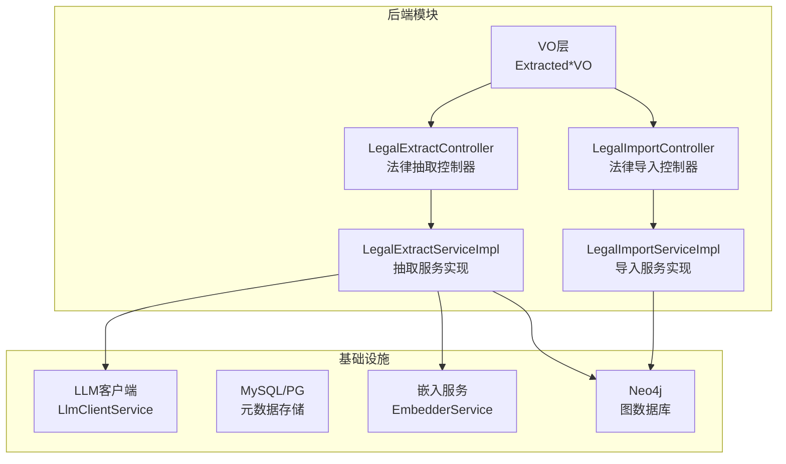
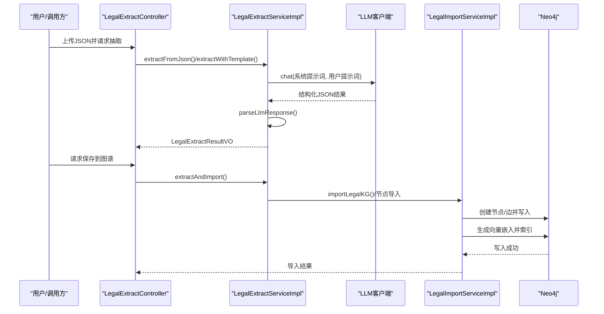
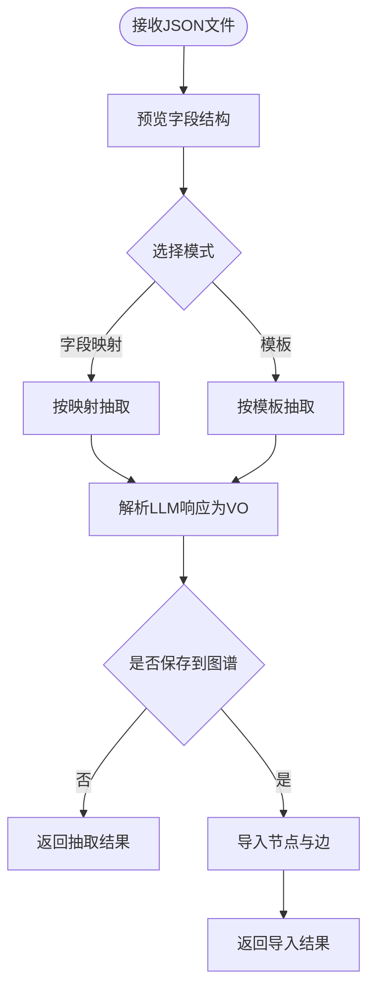
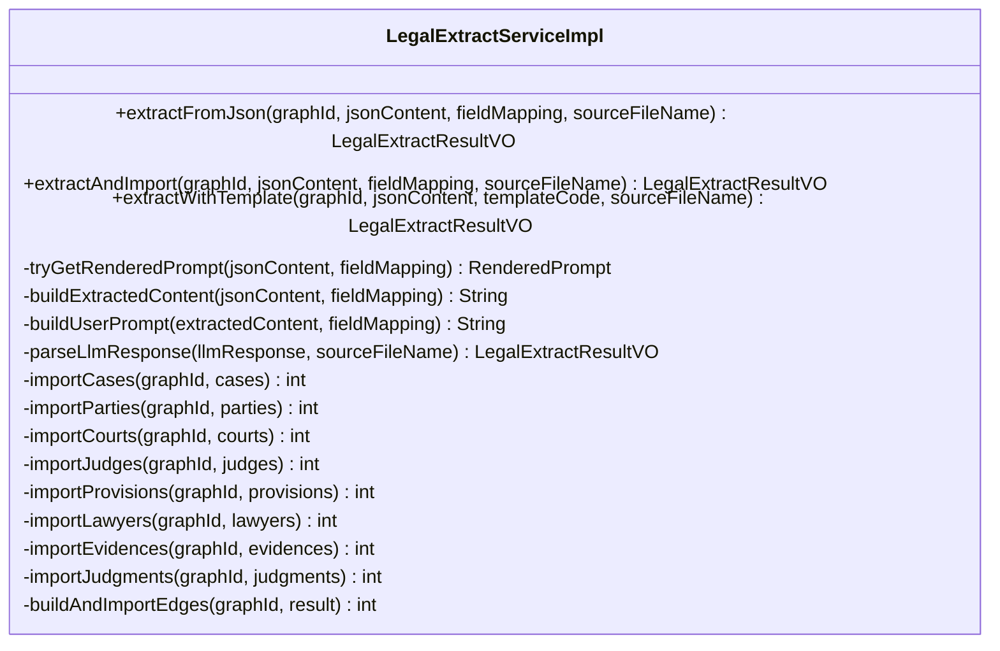
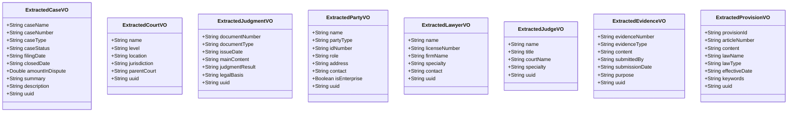
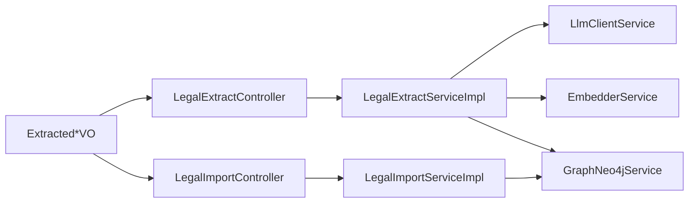

# 法律数据抽取管道

<!--<cite>
**本文档引用的文件**
- [LegalExtractController.java](file://ontograph-module-core/src/main/java/com/graphiti/module/graphiti/controller/admin/LegalExtractController.java)
- [LegalImportController.java](file://ontograph-module-core/src/main/java/com/graphiti/module/graphiti/controller/admin/LegalImportController.java)
- [LegalExtractServiceImpl.java](file://ontograph-module-core/src/main/java/com/graphiti/module/graphiti/service/impl/LegalExtractServiceImpl.java)
- [LegalImportServiceImpl.java](file://ontograph-module-core/src/main/java/com/graphiti/module/graphiti/service/impl/LegalImportServiceImpl.java)
- [ExtractedCaseVO.java](file://ontograph-module-core/src/main/java/com/graphiti/module/graphiti/vo/legal/ExtractedCaseVO.java)
- [ExtractedCourtVO.java](file://ontograph-module-core/src/main/java/com/graphiti/module/graphiti/vo/legal/ExtractedCourtVO.java)
- [ExtractedJudgmentVO.java](file://ontograph-module-core/src/main/java/com/graphiti/module/graphiti/vo/legal/ExtractedJudgmentVO.java)
- [ExtractedPartyVO.java](file://ontograph-module-core/src/main/java/com/graphiti/module/graphiti/vo/legal/ExtractedPartyVO.java)
- [ExtractedLawyerVO.java](file://ontograph-module-core/src/main/java/com/graphiti/module/graphiti/vo/legal/ExtractedLawyerVO.java)
- [ExtractedJudgeVO.java](file://ontograph-module-core/src/main/java/com/graphiti/module/graphiti/vo/legal/ExtractedJudgeVO.java)
- [ExtractedEvidenceVO.java](file://ontograph-module-core/src/main/java/com/graphiti/module/graphiti/vo/legal/ExtractedEvidenceVO.java)
- [ExtractedProvisionVO.java](file://ontograph-module-core/src/main/java/com/graphiti/module/graphiti/vo/legal/ExtractedProvisionVO.java)
- [ontology.md](file://docs/ontology.md)
- [pipeline.md](file://docs/pipeline.md)
- [README.md](file://README.md)
</cite>-->

## 目录
1. [简介](#简介)
2. [项目结构](#项目结构)
3. [核心组件](#核心组件)
4. [架构总览](#架构总览)
5. [详细组件分析](#详细组件分析)
6. [依赖关系分析](#依赖关系分析)
7. [性能考量](#性能考量)
8. [故障排查指南](#故障排查指南)
9. [结论](#结论)
10. [附录](#附录)

## 简介
本文件面向法律数据处理专家，系统化阐述OntoGraph的法律数据抽取与导入管道，覆盖从法律文书解析、要素识别、结构化提取、本体映射、Neo4j存储到质量控制与合规性的完整流程。文档同时深入分析ExtractedCaseVO、ExtractedCourtVO、ExtractedJudgmentVO等法律实体的数据结构，解释法律本体系统的术语标准化、关系约束验证与案例相似性分析能力，并提供API接口、批量处理策略与合规性建议。

## 项目结构
- 后端采用Spring Boot模块化设计，核心业务位于ontograph-module-core，包含控制器、服务层、数据访问层与视图对象（VO）。
- 法律知识图谱相关功能集中在admin包下的LegalExtractController与LegalImportController，配套LegalExtractServiceImpl与LegalImportServiceImpl实现具体业务逻辑。
- 视图对象（VO）位于ontograph-module-core/src/main/java/.../vo/legal，定义了法律实体的结构化输出。
- 文档docs/ontology.md与docs/pipeline.md分别描述本体与通用数据处理流程，为法律场景提供理论基础与实践参考。

**图表来源**
- [LegalExtractController.java:1-408](file://ontograph-module-core/src/main/java/com/graphiti/module/graphiti/controller/admin/LegalExtractController.java#L1-L408)
- [LegalImportController.java:1-136](file://ontograph-module-core/src/main/java/com/graphiti/module/graphiti/controller/admin/LegalImportController.java#L1-L136)
- [LegalExtractServiceImpl.java:1-820](file://ontograph-module-core/src/main/java/com/graphiti/module/graphiti/service/impl/LegalExtractServiceImpl.java#L1-L820)
- [LegalImportServiceImpl.java:1-467](file://ontograph-module-core/src/main/java/com/graphiti/module/graphiti/service/impl/LegalImportServiceImpl.java#L1-L467)

**章节来源**
- [README.md:110-166](file://README.md#L110-L166)

## 核心组件
- 法律抽取控制器：提供JSON文件预览、字段映射、模板化抽取与直接保存到图谱的接口。
- 法律导入控制器：提供批量导入节点/边、一键导入法条与示例案例、导出图谱数据的接口。
- 抽取服务实现：封装LLM提示词模板渲染、JSON字段映射、实体解析与节点/边导入。
- 导入服务实现：封装节点/边批量导入、名称到UUID映射、嵌入生成与关系创建。
- 法律实体VO：定义ExtractedCaseVO、ExtractedCourtVO、ExtractedJudgmentVO等结构化输出字段。

**章节来源**
- [LegalExtractController.java:25-152](file://ontograph-module-core/src/main/java/com/graphiti/module/graphiti/controller/admin/LegalExtractController.java#L25-L152)
- [LegalImportController.java:20-121](file://ontograph-module-core/src/main/java/com/graphiti/module/graphiti/controller/admin/LegalImportController.java#L20-L121)
- [LegalExtractServiceImpl.java:16-35](file://ontograph-module-core/src/main/java/com/graphiti/module/graphiti/service/impl/LegalExtractServiceImpl.java#L16-L35)
- [LegalImportServiceImpl.java:13-27](file://ontograph-module-core/src/main/java/com/graphiti/module/graphiti/service/impl/LegalImportServiceImpl.java#L13-L27)

## 架构总览
法律数据抽取与导入的整体架构围绕“控制器-服务-嵌入-图数据库”的链路展开。抽取阶段通过LLM将非结构化JSON映射为结构化实体，导入阶段将实体与关系写入Neo4j，同时生成向量嵌入以支持语义检索。

**图表来源**
- [LegalExtractController.java:86-152](file://ontograph-module-core/src/main/java/com/graphiti/module/graphiti/controller/admin/LegalExtractController.java#L86-L152)
- [LegalExtractServiceImpl.java:75-206](file://ontograph-module-core/src/main/java/com/graphiti/module/graphiti/service/impl/LegalExtractServiceImpl.java#L75-L206)
- [LegalImportServiceImpl.java:28-61](file://ontograph-module-core/src/main/java/com/graphiti/module/graphiti/service/impl/LegalImportServiceImpl.java#L28-L61)

## 详细组件分析

### 法律抽取控制器（LegalExtractController）
- 功能要点
  - JSON文件预览：递归构建字段树、统计字段数与节点数、提取样本数据。
  - 字段映射抽取：根据用户提供的JSON字段到本体字段映射，调用LLM提取结构化实体。
  - 模板化抽取：优先使用数据库中的提示词模板，回退到系统默认提示词。
  - 本体字段列表：返回所有法律实体的字段定义，便于前端映射。
  - 可用模板列表：返回模板编码与默认提示词。
- 关键接口
  - POST /api/v1/graph/legal/extract/preview：预览JSON字段结构
  - POST /api/v1/graph/legal/extract：抽取（不保存）
  - POST /api/v1/graph/legal/extract/save：抽取并保存
  - GET /api/v1/graph/legal/extract/ontology-fields：获取本体字段列表
  - GET /api/v1/graph/legal/extract/templates：获取可用模板

**图表来源**
- [LegalExtractController.java:48-152](file://ontograph-module-core/src/main/java/com/graphiti/module/graphiti/controller/admin/LegalExtractController.java#L48-L152)

**章节来源**
- [LegalExtractController.java:25-284](file://ontograph-module-core/src/main/java/com/graphiti/module/graphiti/controller/admin/LegalExtractController.java#L25-L284)

### 法律导入控制器（LegalImportController）
- 功能要点
  - 批量导入：一次性导入节点与边，或分别导入节点/边。
  - 一键导入：导入商事调解条例法条数据与示例案例。
  - 导出：将图谱数据导出为JSON，便于备份与迁移。
- 关键接口
  - POST /api/v1/graph/legal/import：批量导入法律图谱
  - POST /api/v1/graph/legal/nodes：批量导入节点
  - POST /api/v1/graph/legal/edges：批量导入边
  - POST /api/v1/graph/legal/provisions：导入商事调解条例
  - POST /api/v1/graph/legal/cases：导入示例案例
  - GET /api/v1/graph/legal/export：导出法律图谱数据

**章节来源**
- [LegalImportController.java:20-135](file://ontograph-module-core/src/main/java/com/graphiti/module/graphiti/controller/admin/LegalImportController.java#L20-L135)

### 法律抽取服务实现（LegalExtractServiceImpl）
- 功能要点
  - 提示词模板：优先从数据库获取模板并渲染变量，否则使用系统默认提示词。
  - 字段映射：支持从JSON路径提取字段值，构建抽取内容。
  - LLM调用：chat接口返回结构化JSON，parseLlmResponse解析为LegalExtractResultVO。
  - 节点导入：逐类导入Extracted*VO为Neo4j节点，跳过本体校验以便快速落地。
  - 边导入：基于名称映射构建边，生成fact文本与向量嵌入后写入Neo4j。
- 关键流程
  - extractFromJson：模板/默认提示词 → LLM → 解析 → 返回LegalExtractResultVO
  - extractAndImport：在extractFromJson基础上执行节点与边导入
  - buildAndImportEdges：构建案件-当事人/法院/法官等关系边

**图表来源**
- [LegalExtractServiceImpl.java:16-820](file://ontograph-module-core/src/main/java/com/graphiti/module/graphiti/service/impl/LegalExtractServiceImpl.java#L16-L820)

**章节来源**
- [LegalExtractServiceImpl.java:75-787](file://ontograph-module-core/src/main/java/com/graphiti/module/graphiti/service/impl/LegalExtractServiceImpl.java#L75-L787)

### 法律导入服务实现（LegalImportServiceImpl）
- 功能要点
  - importLegalKG：统一入口，分别导入节点与边，并收集错误信息。
  - importLegalNodes：逐条调用NodeService.createNode创建节点。
  - importLegalEdges：先构建名称到UUID映射，再创建关系并生成向量嵌入。
  - 导入预置数据：buildCommercialMediationProvisions与buildSample*系列方法提供示例数据。
  - 导出：listNodes/listEdges聚合节点与边，形成可导出的JSON结构。
- 关键流程
  - importLegalEdges：名称映射 → 构造fact → 嵌入 → 创建关系

**章节来源**
- [LegalImportServiceImpl.java:28-202](file://ontograph-module-core/src/main/java/com/graphiti/module/graphiti/service/impl/LegalImportServiceImpl.java#L28-L202)

### 法律实体VO结构分析
- ExtractedCaseVO：案件基本信息（名称、编号、类型、状态、日期、金额、摘要、描述、UUID）
- ExtractedCourtVO：法院信息（名称、级别、地点、管辖范围、上级法院、UUID）
- ExtractedJudgmentVO：裁判文书（编号、类型、日期、摘要、结果、法律依据、UUID）
- ExtractedPartyVO：当事人（名称、类型、证件号、角色、地址、联系方式、是否企业、UUID）
- ExtractedLawyerVO：律师（姓名、执照号、律所、专业、联系方式、UUID）
- ExtractedJudgeVO：法官（姓名、职务、法院、专业、UUID）
- ExtractedEvidenceVO：证据（编号、类型、内容摘要、提交方、日期、目的、UUID）
- ExtractedProvisionVO：法律条文（条文编号、条款序号、内容、法律名称、类型、生效日期、关键词、UUID）

**图表来源**
- [ExtractedCaseVO.java:10-40](file://ontograph-module-core/src/main/java/com/graphiti/module/graphiti/vo/legal/ExtractedCaseVO.java#L10-L40)
- [ExtractedCourtVO.java:10-32](file://ontograph-module-core/src/main/java/com/graphiti/module/graphiti/vo/legal/ExtractedCourtVO.java#L10-L32)
- [ExtractedJudgmentVO.java:10-34](file://ontograph-module-core/src/main/java/com/graphiti/module/graphiti/vo/legal/ExtractedJudgmentVO.java#L10-L34)
- [ExtractedPartyVO.java:10-36](file://ontograph-module-core/src/main/java/com/graphiti/module/graphiti/vo/legal/ExtractedPartyVO.java#L10-L36)
- [ExtractedLawyerVO.java:10-31](file://ontograph-module-core/src/main/java/com/graphiti/module/graphiti/vo/legal/ExtractedLawyerVO.java#L10-L31)
- [ExtractedJudgeVO.java:10-29](file://ontograph-module-core/src/main/java/com/graphiti/module/graphiti/vo/legal/ExtractedJudgeVO.java#L10-L29)
- [ExtractedEvidenceVO.java:10-33](file://ontograph-module-core/src/main/java/com/graphiti/module/graphiti/vo/legal/ExtractedEvidenceVO.java#L10-L33)
- [ExtractedProvisionVO.java:10-35](file://ontograph-module-core/src/main/java/com/graphiti/module/graphiti/vo/legal/ExtractedProvisionVO.java#L10-L35)

**章节来源**
- [ExtractedCaseVO.java:10-40](file://ontograph-module-core/src/main/java/com/graphiti/module/graphiti/vo/legal/ExtractedCaseVO.java#L10-L40)
- [ExtractedCourtVO.java:10-32](file://ontograph-module-core/src/main/java/com/graphiti/module/graphiti/vo/legal/ExtractedCourtVO.java#L10-L32)
- [ExtractedJudgmentVO.java:10-34](file://ontograph-module-core/src/main/java/com/graphiti/module/graphiti/vo/legal/ExtractedJudgmentVO.java#L10-L34)
- [ExtractedPartyVO.java:10-36](file://ontograph-module-core/src/main/java/com/graphiti/module/graphiti/vo/legal/ExtractedPartyVO.java#L10-L36)
- [ExtractedLawyerVO.java:10-31](file://ontograph-module-core/src/main/java/com/graphiti/module/graphiti/vo/legal/ExtractedLawyerVO.java#L10-L31)
- [ExtractedJudgeVO.java:10-29](file://ontograph-module-core/src/main/java/com/graphiti/module/graphiti/vo/legal/ExtractedJudgeVO.java#L10-L29)
- [ExtractedEvidenceVO.java:10-33](file://ontograph-module-core/src/main/java/com/graphiti/module/graphiti/vo/legal/ExtractedEvidenceVO.java#L10-L33)
- [ExtractedProvisionVO.java:10-35](file://ontograph-module-core/src/main/java/com/graphiti/module/graphiti/vo/legal/ExtractedProvisionVO.java#L10-L35)

### 法律本体系统与关系约束验证
- 术语标准化：通过本体定义（类、属性、约束）确保实体与关系的命名一致性与类型正确性。
- 关系约束验证：在写入Neo4j前，依据本体规则进行类型存在性、必填属性、数据类型与约束（基数、模式、范围、枚举、非空）校验。
- 案例相似性分析：结合向量嵌入与图遍历，支持基于语义与结构的相似性检索与聚类。

**章节来源**
- [ontology.md:141-250](file://docs/ontology.md#L141-L250)

### 法律数据质量控制
- 事实核查：通过LLM生成的结构化描述与本体约束进行交叉验证，减少不一致与错误。
- 引用标注：在节点与边属性中保留sourceUuid等溯源字段，便于追踪原始数据来源。
- 时效性管理：利用valid_at/invalid_at时间戳实现事实的生物时间版本控制，支持历史追溯与自动失效。

**章节来源**
- [pipeline.md:332-344](file://docs/pipeline.md#L332-L344)

## 依赖关系分析
- 控制器依赖服务：LegalExtractController与LegalImportController分别依赖LegalExtractServiceImpl与LegalImportServiceImpl。
- 服务依赖外部组件：抽取/导入服务依赖LLM客户端与嵌入服务，最终写入Neo4j。
- VO与控制器/服务：LegalExtractController与LegalImportController均消费/产出VO，形成清晰的数据契约。

**图表来源**
- [LegalExtractController.java:43-46](file://ontograph-module-core/src/main/java/com/graphiti/module/graphiti/controller/admin/LegalExtractController.java#L43-L46)
- [LegalImportController.java:39-40](file://ontograph-module-core/src/main/java/com/graphiti/module/graphiti/controller/admin/LegalImportController.java#L39-L40)
- [LegalExtractServiceImpl.java:24-29](file://ontograph-module-core/src/main/java/com/graphiti/module/graphiti/service/impl/LegalExtractServiceImpl.java#L24-L29)
- [LegalImportServiceImpl.java:21-24](file://ontograph-module-core/src/main/java/com/graphiti/module/graphiti/service/impl/LegalImportServiceImpl.java#L21-L24)

**章节来源**
- [LegalExtractServiceImpl.java:16-35](file://ontograph-module-core/src/main/java/com/graphiti/module/graphiti/service/impl/LegalExtractServiceImpl.java#L16-L35)
- [LegalImportServiceImpl.java:13-27](file://ontograph-module-core/src/main/java/com/graphiti/module/graphiti/service/impl/LegalImportServiceImpl.java#L13-L27)

## 性能考量
- 批量导入：服务端提供批量节点/边导入接口，减少网络往返与事务开销。
- 嵌入生成：在导入边时生成fact向量，结合Neo4j向量索引提升语义检索性能。
- 模板化提示词：通过数据库模板减少重复构造提示词的成本，提升吞吐。

[本节为通用指导，无需特定文件引用]

## 故障排查指南
- JSON解析失败：检查文件编码与结构，控制器会捕获IOException并返回错误信息。
- LLM响应解析失败：服务端会尝试提取JSON片段，若仍失败，返回解析错误。
- 节点/边导入失败：记录失败节点/边的名称与错误原因，可在返回结果中查看错误列表。
- 模板缺失：若指定模板不存在或禁用，自动回退到默认提示词。

**章节来源**
- [LegalExtractController.java:79-82](file://ontograph-module-core/src/main/java/com/graphiti/module/graphiti/controller/admin/LegalExtractController.java#L79-L82)
- [LegalExtractServiceImpl.java:114-121](file://ontograph-module-core/src/main/java/com/graphiti/module/graphiti/service/impl/LegalExtractServiceImpl.java#L114-L121)
- [LegalImportServiceImpl.java:185-202](file://ontograph-module-core/src/main/java/com/graphiti/module/graphiti/service/impl/LegalImportServiceImpl.java#L185-L202)

## 结论
OntoGraph为法律数据抽取与导入提供了完整的端到端解决方案：从JSON预处理与字段映射，到LLM结构化抽取与本体约束验证，再到Neo4j存储与向量索引，最终形成可检索、可审计、可扩展的法律知识图谱。通过控制器-服务-嵌入-图数据库的清晰分层，系统既保证了工程化落地的可行性，也为后续的法律本体增强与相似性分析奠定了坚实基础。

## 附录

### API接口清单（法律抽取）
- POST /api/v1/graph/legal/extract/preview：预览JSON字段结构
- POST /api/v1/graph/legal/extract：抽取（不保存）
- POST /api/v1/graph/legal/extract/save：抽取并保存
- GET /api/v1/graph/legal/extract/ontology-fields：获取本体字段列表
- GET /api/v1/graph/legal/extract/templates：获取可用模板

**章节来源**
- [LegalExtractController.java:48-284](file://ontograph-module-core/src/main/java/com/graphiti/module/graphiti/controller/admin/LegalExtractController.java#L48-L284)

### API接口清单（法律导入）
- POST /api/v1/graph/legal/import：批量导入法律图谱
- POST /api/v1/graph/legal/nodes：批量导入节点
- POST /api/v1/graph/legal/edges：批量导入边
- POST /api/v1/graph/legal/provisions：导入商事调解条例
- POST /api/v1/graph/legal/cases：导入示例案例
- GET /api/v1/graph/legal/export：导出法律图谱数据

**章节来源**
- [LegalImportController.java:42-135](file://ontograph-module-core/src/main/java/com/graphiti/module/graphiti/controller/admin/LegalImportController.java#L42-L135)

### 批量处理策略
- 节点批量导入：按批次调用NodeService.createNode，记录成功/失败数量。
- 边批量导入：先构建名称→UUID映射，再批量创建关系并生成向量嵌入。
- 模板化提示词：优先使用数据库模板，减少重复构造成本。

**章节来源**
- [LegalImportServiceImpl.java:63-127](file://ontograph-module-core/src/main/java/com/graphiti/module/graphiti/service/impl/LegalImportServiceImpl.java#L63-L127)
- [LegalExtractServiceImpl.java:126-164](file://ontograph-module-core/src/main/java/com/graphiti/module/graphiti/service/impl/LegalExtractServiceImpl.java#L126-L164)

### 合规性考虑
- 数据最小化：仅抽取JSON中存在且与本体字段映射对应的字段，避免虚构数据。
- 日期与金额格式：统一YYYY-MM-DD与数值类型，确保跨系统一致性。
- 溯源与审计：保留sourceUuid与文件名，便于审计与回溯。
- 模板治理：通过数据库模板集中管理提示词，确保抽取规则的一致性与可追溯性。

**章节来源**
- [LegalExtractServiceImpl.java:44-73](file://ontograph-module-core/src/main/java/com/graphiti/module/graphiti/service/impl/LegalExtractServiceImpl.java#L44-L73)
- [LegalExtractController.java:160-268](file://ontograph-module-core/src/main/java/com/graphiti/module/graphiti/controller/admin/LegalExtractController.java#L160-L268)