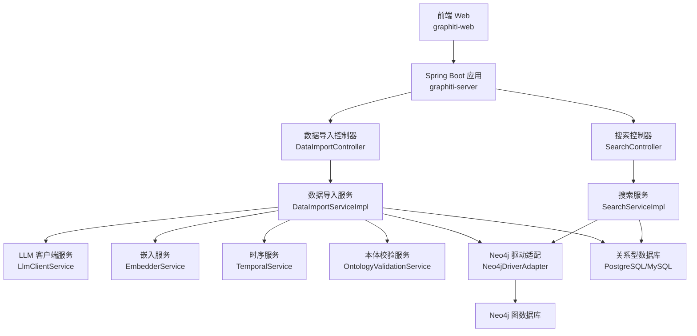
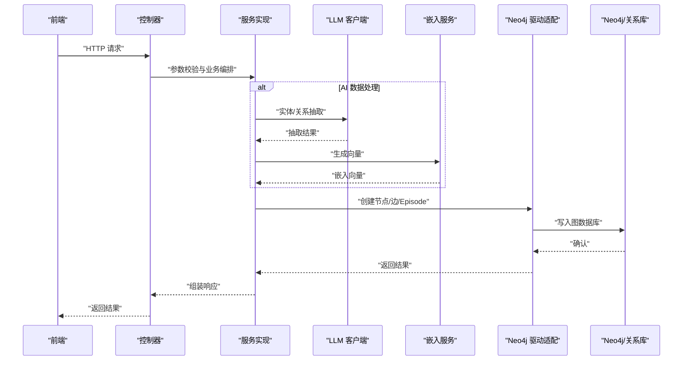
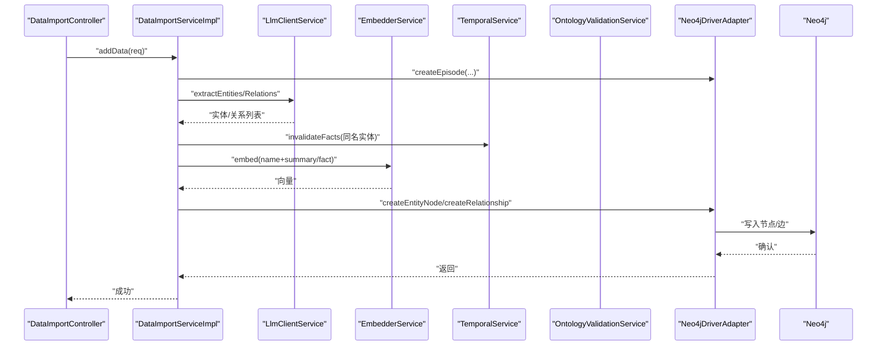
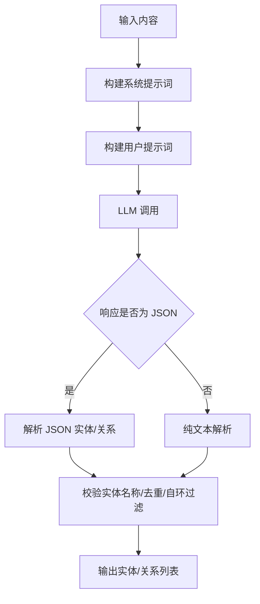
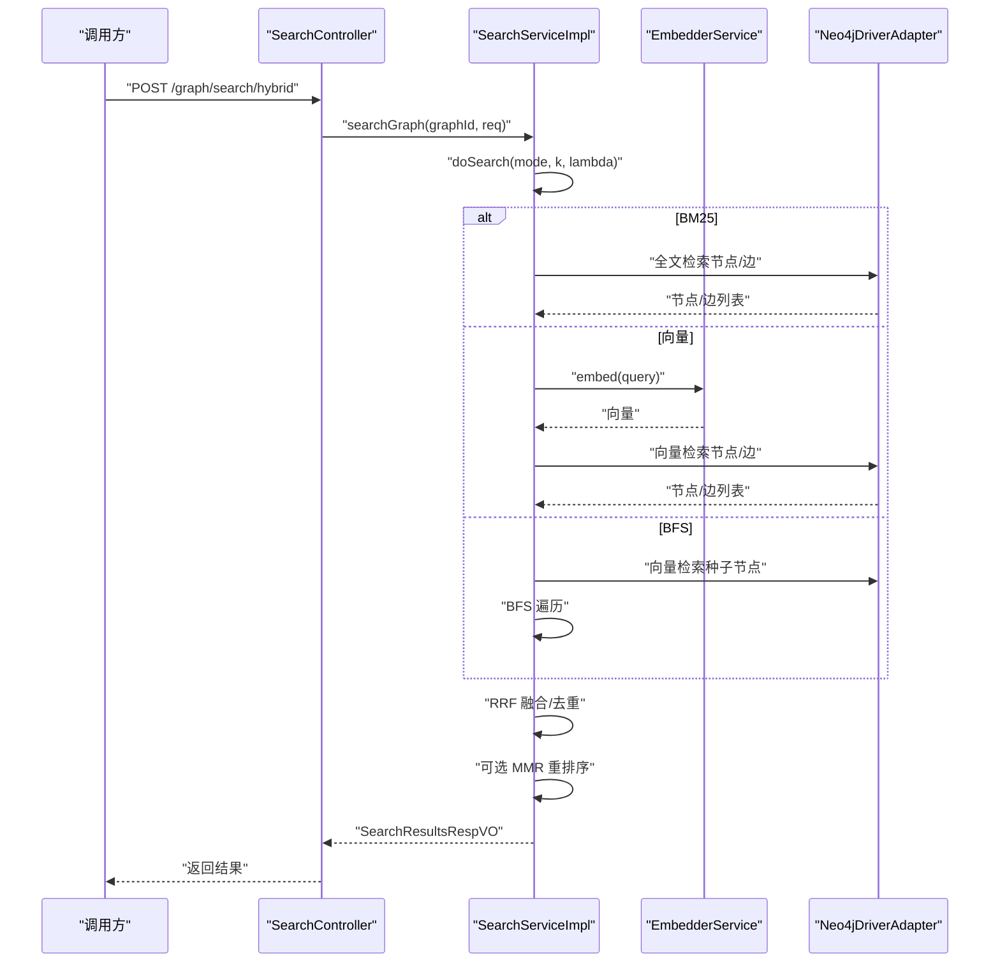
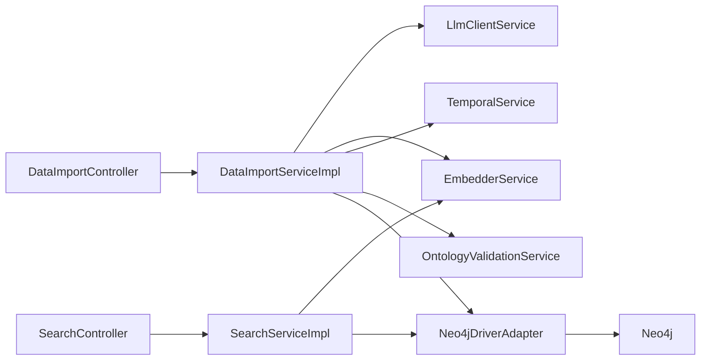

# 数据流设计

<cite>
**本文引用的文件**
- [README.md](file://README.md)
- [DataImportController.java](file://graphiti-module-core/src/main/java/com/graphiti/module/graphiti/controller/admin/DataImportController.java)
- [SearchController.java](file://graphiti-module-core/src/main/java/com/graphiti/module/graphiti/controller/admin/SearchController.java)
- [DataImportServiceImpl.java](file://graphiti-module-core/src/main/java/com/graphiti/module/graphiti/service/impl/DataImportServiceImpl.java)
- [SearchServiceImpl.java](file://graphiti-module-core/src/main/java/com/graphiti/module/graphiti/service/impl/SearchServiceImpl.java)
- [EntityExtractorServiceImpl.java](file://graphiti-module-core/src/main/java/com/graphiti/module/graphiti/service/impl/EntityExtractorServiceImpl.java)
- [EdgeExtractorServiceImpl.java](file://graphiti-module-core/src/main/java/com/graphiti/module/graphiti/service/impl/EdgeExtractorServiceImpl.java)
- [Neo4jDriverAdapter.java](file://graphiti-module-core/src/main/java/com/graphiti/module/graphiti/service/impl/Neo4jDriverAdapter.java)
- [SearchQueryReqVO.java](file://graphiti-module-core/src/main/java/com/graphiti/module/graphiti/vo/search/SearchQueryReqVO.java)
- [vector-index-init.cypher](file://sql/neo4j/vector-index-init.cypher)
- [pipeline.md](file://docs/pipeline.md)
</cite>

## 目录
1. [简介](#简介)
2. [项目结构](#项目结构)
3. [核心组件](#核心组件)
4. [架构总览](#架构总览)
5. [详细组件分析](#详细组件分析)
6. [依赖分析](#依赖分析)
7. [性能考虑](#性能考虑)
8. [故障排查指南](#故障排查指南)
9. [结论](#结论)
10. [附录](#附录)

## 简介
本文件面向开发者，系统化梳理 Graphiti-Java 的数据流设计，覆盖从用户输入到数据持久化的完整路径，以及 AI 数据处理、混合搜索与数据导入的专项流程。重点包括：
- 前端请求 → 控制器 → 服务层 → 数据访问层 → Neo4j/PostgreSQL 的标准数据流
- AI 数据处理：原始文本 → LLM 实体/关系抽取 → 向量嵌入 → Neo4j 存储
- 混合搜索：查询解析 → 多数据源检索（BM25/向量/BFS）→ 结果融合（RRF）→ 重排序（MMR）→ 输出
- 数据导入：文件上传/消息输入 → 格式解析 → 实体/关系抽取 → 批量导入 → 时序与本体校验
- 数据一致性与事务策略、性能优化与调优建议

## 项目结构
Graphiti-Java 采用分层模块化架构，后端以 Spring Boot 为核心，业务集中在 graphiti-module-core，数据访问通过 Neo4j 与关系型数据库协同，框架层提供安全、缓存与基础设施支持。

图表来源
- [README.md:71-108](file://README.md#L71-L108)
- [DataImportController.java:22-27](file://graphiti-module-core/src/main/java/com/graphiti/module/graphiti/controller/admin/DataImportController.java#L22-L27)
- [SearchController.java:23-28](file://graphiti-module-core/src/main/java/com/graphiti/module/graphiti/controller/admin/SearchController.java#L23-L28)

章节来源
- [README.md:71-108](file://README.md#L71-L108)

## 核心组件
- 控制器层：负责接收请求、参数校验与鉴权，转发至服务层；分别提供数据导入与搜索两大入口。
- 服务层：封装业务逻辑，协调 LLM、嵌入、时序、本体校验与 Neo4j 访问。
- 数据访问层：统一通过 Neo4jDriverAdapter 抽象底层驱动，提供节点/边/全文/向量检索与写入。
- 搜索服务：实现混合检索（BM25/向量/RBF）、RRF 融合与 MMR 重排序。
- AI 提取服务：实体与关系抽取，支持模板化提示词与多种数据源。
- 向量索引：Neo4j 5.x 向量索引与全文索引初始化脚本。

章节来源
- [DataImportController.java:22-72](file://graphiti-module-core/src/main/java/com/graphiti/module/graphiti/controller/admin/DataImportController.java#L22-L72)
- [SearchController.java:23-137](file://graphiti-module-core/src/main/java/com/graphiti/module/graphiti/controller/admin/SearchController.java#L23-L137)
- [DataImportServiceImpl.java:27-109](file://graphiti-module-core/src/main/java/com/graphiti/module/graphiti/service/impl/DataImportServiceImpl.java#L27-L109)
- [SearchServiceImpl.java:21-148](file://graphiti-module-core/src/main/java/com/graphiti/module/graphiti/service/impl/SearchServiceImpl.java#L21-L148)
- [Neo4jDriverAdapter.java:33-83](file://graphiti-module-core/src/main/java/com/graphiti/module/graphiti/service/impl/Neo4jDriverAdapter.java#L33-L83)
- [vector-index-init.cypher:1-26](file://sql/neo4j/vector-index-init.cypher#L1-L26)

## 架构总览
下图展示典型请求在系统内的流转与组件交互：

图表来源
- [DataImportServiceImpl.java:36-109](file://graphiti-module-core/src/main/java/com/graphiti/module/graphiti/service/impl/DataImportServiceImpl.java#L36-L109)
- [SearchServiceImpl.java:94-148](file://graphiti-module-core/src/main/java/com/graphiti/module/graphiti/service/impl/SearchServiceImpl.java#L94-L148)
- [Neo4jDriverAdapter.java:33-83](file://graphiti-module-core/src/main/java/com/graphiti/module/graphiti/service/impl/Neo4jDriverAdapter.java#L33-L83)

## 详细组件分析

### 数据导入：从用户输入到图数据库
- 控制器入口：提供单条数据添加、批量导入、消息导入、事实三元组与实体节点直写等接口。
- 业务流程：
  1) 创建 Episode 记录，承载来源与内容；
  2) LLM 抽取实体与关系；
  3) 时序服务失效同名实体，避免命名冲突；
  4) 嵌入服务生成向量；
  5) Neo4j 写入节点/边，附带属性与向量；
  6) 可选：本体校验与属性补全。
- 关键点：批量导入目前逐条调用，具备扩展为事务批处理的空间；实体查找采用分页扫描，生产环境建议引入名称索引或缓存。

图表来源
- [DataImportController.java:32-62](file://graphiti-module-core/src/main/java/com/graphiti/module/graphiti/controller/admin/DataImportController.java#L32-L62)
- [DataImportServiceImpl.java:36-109](file://graphiti-module-core/src/main/java/com/graphiti/module/graphiti/service/impl/DataImportServiceImpl.java#L36-L109)

章节来源
- [DataImportController.java:22-112](file://graphiti-module-core/src/main/java/com/graphiti/module/graphiti/controller/admin/DataImportController.java#L22-L112)
- [DataImportServiceImpl.java:27-323](file://graphiti-module-core/src/main/java/com/graphiti/module/graphiti/service/impl/DataImportServiceImpl.java#L27-L323)

### AI 数据处理：实体/关系抽取与向量嵌入
- 实体抽取：支持文本、JSON、消息三种输入，内置默认实体类型，支持自定义指令与模板渲染。
- 关系抽取：基于已抽取实体集合，生成 SCREAMING_SNAKE_CASE 的关系类型与自然语言事实陈述，支持时间窗口与属性扩展。
- 响应解析：优先解析 JSON 结构，回退纯文本；对实体名称大小写不敏感匹配，过滤自环与缺失实体。
- 与导入服务协作：在导入流程中作为前置步骤，生成节点与边的初始数据集。

图表来源
- [EntityExtractorServiceImpl.java:52-128](file://graphiti-module-core/src/main/java/com/graphiti/module/graphiti/service/impl/EntityExtractorServiceImpl.java#L52-L128)
- [EdgeExtractorServiceImpl.java:58-124](file://graphiti-module-core/src/main/java/com/graphiti/module/graphiti/service/impl/EdgeExtractorServiceImpl.java#L58-L124)

章节来源
- [EntityExtractorServiceImpl.java:26-306](file://graphiti-module-core/src/main/java/com/graphiti/module/graphiti/service/impl/EntityExtractorServiceImpl.java#L26-L306)
- [EdgeExtractorServiceImpl.java:26-362](file://graphiti-module-core/src/main/java/com/graphiti/module/graphiti/service/impl/EdgeExtractorServiceImpl.java#L26-L362)

### 混合搜索：查询解析→多源检索→融合→重排序
- 查询解析：SearchController 接收 SearchQueryReqVO，支持全局/图谱级搜索、记忆检索与便捷接口。
- 多源检索：
  - BM25：基于 Neo4j 全文索引的节点/边检索；
  - 向量：对查询生成向量，利用 Neo4j 向量索引检索；
  - BFS：以向量检索结果为种子，按深度与邻居上限进行图遍历。
- 结果融合：RRF（Reciprocal Rank Fusion）对不同来源结果进行打分融合，去重合并。
- 重排序：可选 MMR（Maximal Marginal Relevance），在文本相似度与多样性之间平衡。
- 输出：统一包装为 SearchResultsRespVO，包含节点与事实列表。

图表来源
- [SearchController.java:88-137](file://graphiti-module-core/src/main/java/com/graphiti/module/graphiti/controller/admin/SearchController.java#L88-L137)
- [SearchServiceImpl.java:94-308](file://graphiti-module-core/src/main/java/com/graphiti/module/graphiti/service/impl/SearchServiceImpl.java#L94-L308)
- [SearchQueryReqVO.java:14-32](file://graphiti-module-core/src/main/java/com/graphiti/module/graphiti/vo/search/SearchQueryReqVO.java#L14-L32)
- [pipeline.md:1126-1156](file://docs/pipeline.md#L1126-L1156)

章节来源
- [SearchController.java:23-137](file://graphiti-module-core/src/main/java/com/graphiti/module/graphiti/controller/admin/SearchController.java#L23-L137)
- [SearchServiceImpl.java:21-520](file://graphiti-module-core/src/main/java/com/graphiti/module/graphiti/service/impl/SearchServiceImpl.java#L21-L520)
- [SearchQueryReqVO.java:14-32](file://graphiti-module-core/src/main/java/com/graphiti/module/graphiti/vo/search/SearchQueryReqVO.java#L14-L32)
- [pipeline.md:1126-1156](file://docs/pipeline.md#L1126-L1156)

### 数据导入：文件上传→格式解析→实体/关系抽取→批量导入
- 文件上传：前端提交 JSON/文本/消息，后端以相应解析器处理。
- 格式解析：根据数据源类型（文本/JSON/消息）构建提示词与变量，调用模板渲染。
- 实体/关系抽取：复用 AI 提取服务，确保抽取质量与一致性。
- 批量导入：逐条写入，建议后续引入事务批处理与并发控制，提升吞吐。
- 时序与本体：导入前进行时序失效与本体校验，保证数据一致性。

章节来源
- [EntityExtractorServiceImpl.java:67-95](file://graphiti-module-core/src/main/java/com/graphiti/module/graphiti/service/impl/EntityExtractorServiceImpl.java#L67-L95)
- [EdgeExtractorServiceImpl.java:75-89](file://graphiti-module-core/src/main/java/com/graphiti/module/graphiti/service/impl/EdgeExtractorServiceImpl.java#L75-L89)
- [DataImportServiceImpl.java:112-126](file://graphiti-module-core/src/main/java/com/graphiti/module/graphiti/service/impl/DataImportServiceImpl.java#L112-L126)

### 数据一致性与事务策略
- 当前实现要点：
  - 导入流程：节点/边写入与时序失效在单次请求内完成，未显式开启数据库事务。
  - Neo4j 写入：通过驱动适配器执行，建议在批量导入场景中使用事务批处理减少往返开销。
  - 搜索流程：读取操作不涉及事务，但需注意向量/全文索引的一致性。
- 建议：
  - 批量导入：将实体/关系创建置于同一事务，失败回滚，保障 ACID。
  - 时序与本体：在事务边界内执行，避免中间状态污染。
  - 并发控制：对同名实体的创建与嵌入生成加锁或幂等策略，防止重复写入。

章节来源
- [DataImportServiceImpl.java:36-109](file://graphiti-module-core/src/main/java/com/graphiti/module/graphiti/service/impl/DataImportServiceImpl.java#L36-L109)
- [Neo4jDriverAdapter.java:33-83](file://graphiti-module-core/src/main/java/com/graphiti/module/graphiti/service/impl/Neo4jDriverAdapter.java#L33-L83)

## 依赖分析
- 控制器依赖服务接口，服务实现依赖驱动适配器与外部服务（LLM/嵌入/时序/本体）。
- 搜索服务依赖嵌入服务与 Neo4j 驱动，实现多源检索与融合重排序。
- 驱动适配器统一封装 Neo4j 操作，便于替换与扩展。

图表来源
- [DataImportController.java:29-30](file://graphiti-module-core/src/main/java/com/graphiti/module/graphiti/controller/admin/DataImportController.java#L29-L30)
- [SearchController.java:31-32](file://graphiti-module-core/src/main/java/com/graphiti/module/graphiti/controller/admin/SearchController.java#L31-L32)
- [DataImportServiceImpl.java:29-33](file://graphiti-module-core/src/main/java/com/graphiti/module/graphiti/service/impl/DataImportServiceImpl.java#L29-L33)
- [SearchServiceImpl.java:23-24](file://graphiti-module-core/src/main/java/com/graphiti/module/graphiti/service/impl/SearchServiceImpl.java#L23-L24)
- [Neo4jDriverAdapter.java:33-83](file://graphiti-module-core/src/main/java/com/graphiti/module/graphiti/service/impl/Neo4jDriverAdapter.java#L33-L83)

章节来源
- [DataImportController.java:22-112](file://graphiti-module-core/src/main/java/com/graphiti/module/graphiti/controller/admin/DataImportController.java#L22-L112)
- [SearchController.java:23-137](file://graphiti-module-core/src/main/java/com/graphiti/module/graphiti/controller/admin/SearchController.java#L23-L137)
- [DataImportServiceImpl.java:27-323](file://graphiti-module-core/src/main/java/com/graphiti/module/graphiti/service/impl/DataImportServiceImpl.java#L27-L323)
- [SearchServiceImpl.java:21-520](file://graphiti-module-core/src/main/java/com/graphiti/module/graphiti/service/impl/SearchServiceImpl.java#L21-L520)
- [Neo4jDriverAdapter.java:33-83](file://graphiti-module-core/src/main/java/com/graphiti/module/graphiti/service/impl/Neo4jDriverAdapter.java#L33-L83)

## 性能考虑
- 向量索引与全文索引：确保 Neo4j 向量维度与相似度函数配置正确，避免检索性能退化。
- 检索参数调优：合理设置 RRF 的 k 值与 MMR 的 lambda，平衡召回与多样性。
- 批量导入：合并写入、减少网络往返；必要时启用事务批处理。
- 缓存策略：对热点实体/边的查询结果进行短期缓存，降低重复检索成本。
- 并发与限流：对外部 LLM 与嵌入服务增加超时与重试策略，避免雪崩效应。

章节来源
- [vector-index-init.cypher:1-26](file://sql/neo4j/vector-index-init.cypher#L1-L26)
- [SearchServiceImpl.java:115-148](file://graphiti-module-core/src/main/java/com/graphiti/module/graphiti/service/impl/SearchServiceImpl.java#L115-L148)
- [README.md:477-491](file://README.md#L477-L491)

## 故障排查指南
- LLM/嵌入异常：检查提供商配置与网络连通性；查看服务日志定位解析失败原因。
- Neo4j 写入失败：确认驱动适配器参数与节点/边属性完整性；核对向量维度与索引配置。
- 搜索结果为空：检查全文/向量索引是否创建；确认查询文本长度与停用词处理。
- 本体校验失败：根据返回的校验结果调整实体属性与类型，确保满足约束。
- 批量导入卡顿：评估批量大小与并发度，必要时拆分批次并启用事务。

章节来源
- [DataImportServiceImpl.java:254-279](file://graphiti-module-core/src/main/java/com/graphiti/module/graphiti/service/impl/DataImportServiceImpl.java#L254-L279)
- [SearchServiceImpl.java:227-284](file://graphiti-module-core/src/main/java/com/graphiti/module/graphiti/service/impl/SearchServiceImpl.java#L227-L284)
- [Neo4jDriverAdapter.java:33-83](file://graphiti-module-core/src/main/java/com/graphiti/module/graphiti/service/impl/Neo4jDriverAdapter.java#L33-L83)

## 结论
Graphiti-Java 通过清晰的分层架构与模块化设计，实现了从用户输入到图数据库的高效数据流。AI 驱动的实体/关系抽取与向量嵌入，结合 Neo4j 的向量与全文索引，支撑了强大的混合搜索能力。建议在批量导入与并发写入场景中引入事务批处理与缓存策略，持续优化检索参数与索引配置，以获得更佳的性能与稳定性。

## 附录
- 向量索引初始化脚本：包含节点与边的向量索引、节点与边的全文索引创建语句，确保启动时自动建立索引。
- RRF 与 MMR：RRF 用于多源检索结果融合，MMR 用于重排序提升多样性与代表性。

章节来源
- [vector-index-init.cypher:1-26](file://sql/neo4j/vector-index-init.cypher#L1-L26)
- [pipeline.md:1126-1156](file://docs/pipeline.md#L1126-L1156)