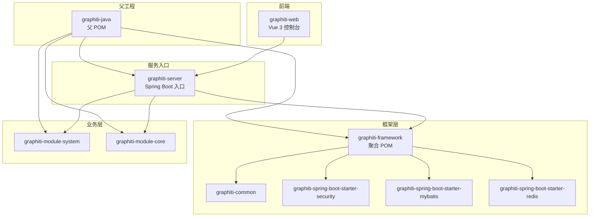
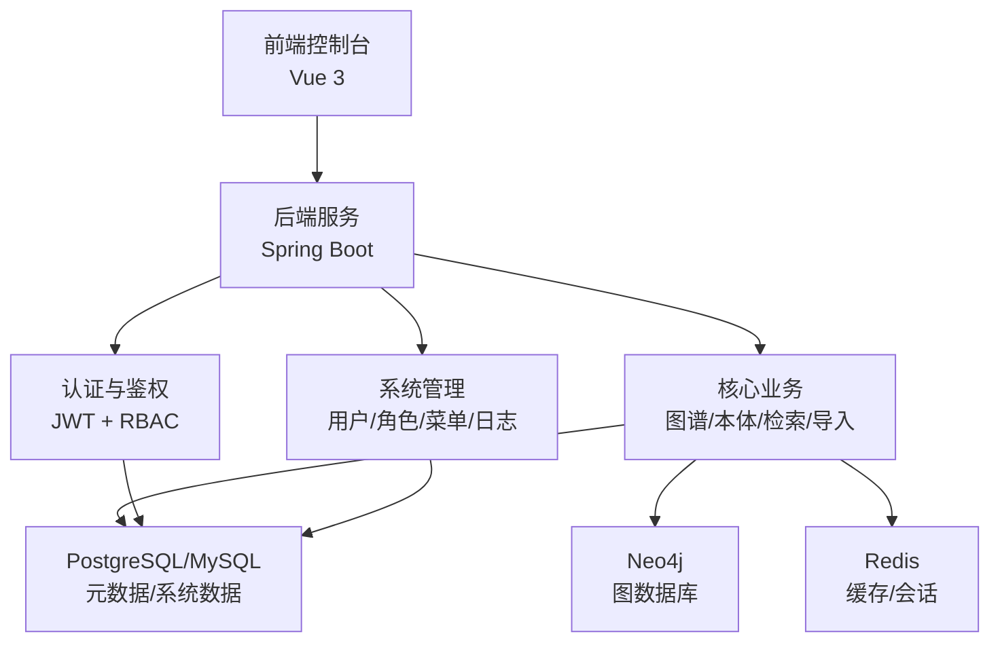
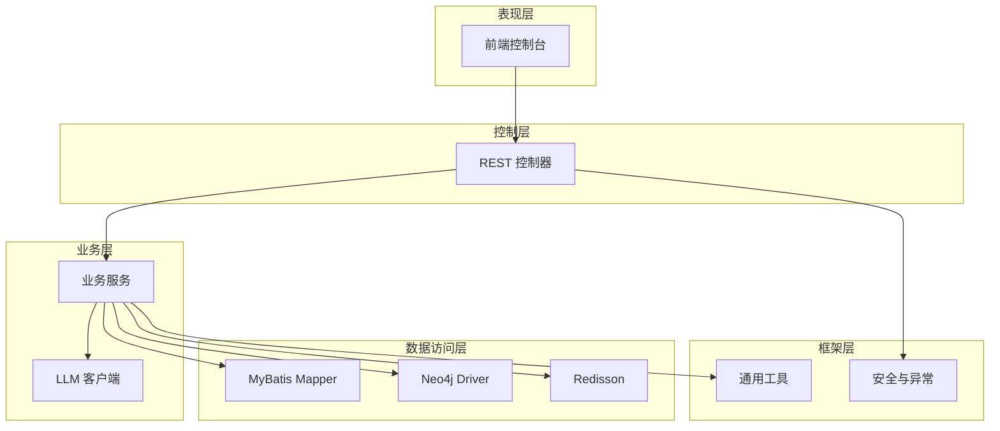
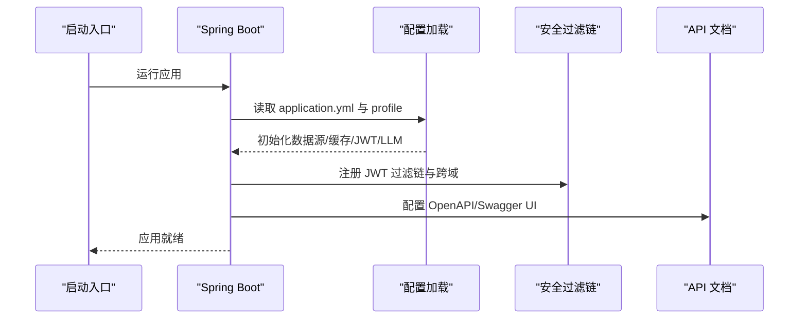
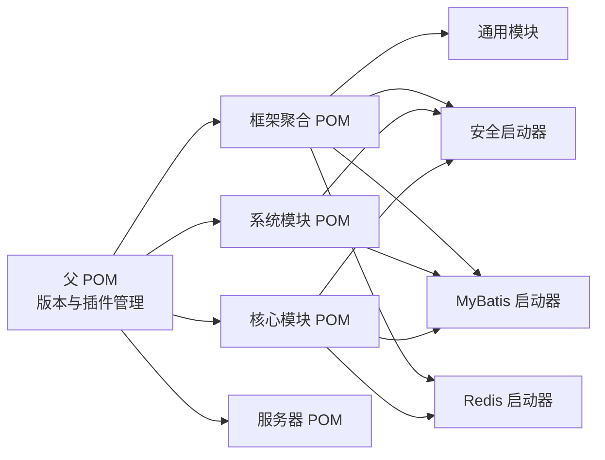
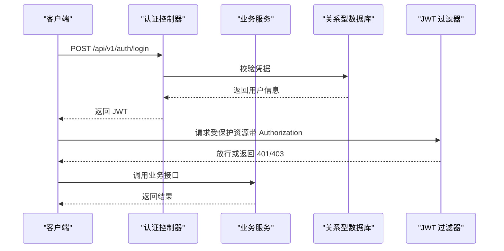
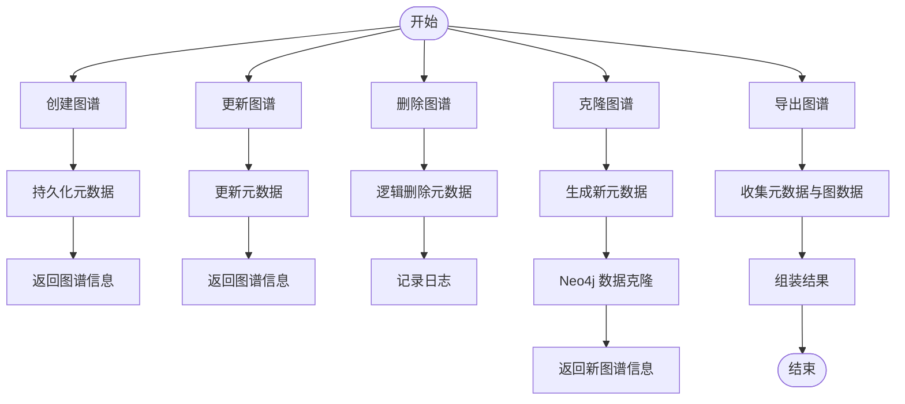
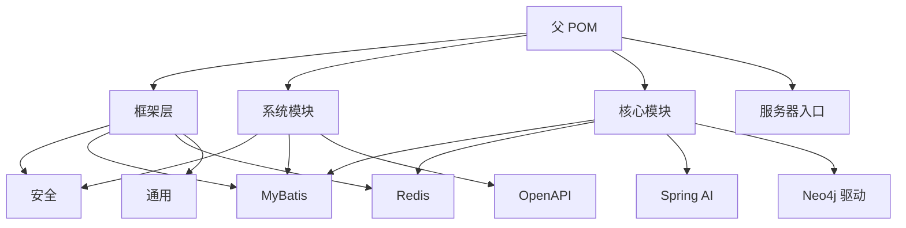

# 整体架构

<cite>
**本文引用的文件**
- [根 POM](file://pom.xml)
- [服务器入口](file://graphiti-server/src/main/java/com/GraphitiApplication.java)
- [服务器配置](file://graphiti-server/src/main/resources/application.yml)
- [模块说明](file://README.md)
- [框架聚合 POM](file://graphiti-framework/pom.xml)
- [通用模块 POM](file://graphiti-framework/graphiti-common/pom.xml)
- [安全启动器 POM](file://graphiti-framework/graphiti-spring-boot-starter-security/pom.xml)
- [MyBatis 启动器 POM](file://graphiti-framework/graphiti-spring-boot-starter-mybatis/pom.xml)
- [Redis 启动器 POM](file://graphiti-framework/graphiti-spring-boot-starter-redis/pom.xml)
- [核心模块 POM](file://graphiti-module-core/pom.xml)
- [系统模块 POM](file://graphiti-module-system/pom.xml)
- [图谱服务实现](file://graphiti-module-core/src/main/java/com/graphiti/module/graphiti/service/impl/GraphitiServiceImpl.java)
- [认证控制器](file://graphiti-module-system/src/main/java/com/graphiti/system/controller/AuthController.java)
- [安全配置](file://graphiti-framework/graphiti-spring-boot-starter-security/src/main/java/com/graphiti/framework/security/config/SecurityConfig.java)
</cite>

## 目录
1. [引言](#引言)
2. [项目结构](#项目结构)
3. [核心组件](#核心组件)
4. [架构总览](#架构总览)
5. [详细组件分析](#详细组件分析)
6. [依赖分析](#依赖分析)
7. [性能考量](#性能考量)
8. [故障排查指南](#故障排查指南)
9. [结论](#结论)
10. [附录](#附录)

## 引言
本架构文档面向架构师与高级开发者，系统化阐述 Graphiti-Java 的整体设计与实现。项目采用前后端分离与微服务化思想，通过 Maven 多模块聚合构建，结合 Spring Boot 作为统一入口，实现知识图谱的实体抽取、本体校验、混合检索与时间事实管理等能力。系统同时支持多 LLM 提供商与多种数据库形态，具备良好的可扩展性与可维护性。

## 项目结构
项目采用“父工程 + 多模块”的 Maven 结构，模块划分遵循“框架基础设施 + 业务模块 + 服务入口 + 前端”的组织方式：
- 父工程负责版本与依赖管理、编译插件与打包策略
- 框架层提供通用工具、安全、MyBatis、Redis 等基础设施封装
- 业务层分为系统管理模块与核心知识图谱模块
- 服务入口为 Spring Boot 应用，承担启动与配置加载
- 前端采用 Vue 3 + Vite，提供可视化控制台与图谱浏览

图表来源
- [根 POM:15-20](file://pom.xml#L15-L20)
- [框架聚合 POM:22-27](file://graphiti-framework/pom.xml#L22-L27)
- [核心模块 POM:17-40](file://graphiti-module-core/pom.xml#L17-L40)
- [系统模块 POM:16-31](file://graphiti-module-system/pom.xml#L16-L31)
- [服务器入口:18-34](file://graphiti-server/src/main/java/com/GraphitiApplication.java#L18-L34)

章节来源
- [模块说明:110-166](file://README.md#L110-L166)
- [根 POM:15-20](file://pom.xml#L15-L20)

## 核心组件
- 框架基础设施
  - 通用模块：提供统一响应、异常与常用工具
  - 安全启动器：集成 Spring Security + JWT，提供认证过滤与跨域配置
  - MyBatis 启动器：封装多数据源、动态数据源与 MyBatis-Plus
  - Redis 启动器：基于 Redisson 的缓存与分布式能力
- 业务模块
  - 系统模块：用户、角色、菜单、通知、操作日志等 RBAC 能力
  - 核心模块：图谱生命周期、节点/边管理、本体校验、检索、数据导入、社区发现、时间事实与数据质量等
- 服务入口
  - Spring Boot 应用，扫描 com.graphiti 包，按需排除第三方 AI 自动装配
- 前端控制台
  - Vue 3 + Vite，提供登录、图谱管理、实体/关系管理、本体检索、数据导入、监控等页面

章节来源
- [通用模块 POM:16-38](file://graphiti-framework/graphiti-common/pom.xml#L16-L38)
- [安全启动器 POM:16-47](file://graphiti-framework/graphiti-spring-boot-starter-security/pom.xml#L16-L47)
- [MyBatis 启动器 POM:19-49](file://graphiti-framework/graphiti-spring-boot-starter-mybatis/pom.xml#L19-L49)
- [Redis 启动器 POM:19-37](file://graphiti-framework/graphiti-spring-boot-starter-redis/pom.xml#L19-L37)
- [系统模块 POM:16-49](file://graphiti-module-system/pom.xml#L16-L49)
- [核心模块 POM:17-145](file://graphiti-module-core/pom.xml#L17-L145)
- [服务器入口:18-34](file://graphiti-server/src/main/java/com/GraphitiApplication.java#L18-L34)

## 架构总览
系统采用“前后端分离 + 微服务化思想”的模块化组织，核心数据库采用“Neo4j + 关系型数据库 + 缓存”的组合：
- 前端：Vue 3 控制台，通过 REST 接口与后端交互
- 后端：Spring Boot 单体入口，承载业务编排与对外 API
- 存储：Neo4j 存放知识图谱（节点/边/向量索引），关系型数据库存储元数据与系统数据，Redis 提供缓存与会话
- AI：通过 Spring AI 支持多提供商（OpenAI、Anthropic、Qwen、Ollama、Mistral、Azure OpenAI、Bedrock）

图表来源
- [模块说明:71-108](file://README.md#L71-L108)
- [服务器配置:25-34](file://graphiti-server/src/main/resources/application.yml#L25-L34)
- [核心模块 POM:42-45](file://graphiti-module-core/pom.xml#L42-L45)
- [MyBatis 启动器 POM:26-41](file://graphiti-framework/graphiti-spring-boot-starter-mybatis/pom.xml#L26-L41)
- [Redis 启动器 POM:25-32](file://graphiti-framework/graphiti-spring-boot-starter-redis/pom.xml#L25-L32)

## 详细组件分析

### 分层架构与职责边界
- 表现层（前端）
  - 职责：用户交互、页面路由、状态管理、图表渲染
  - 交互：调用后端 REST 接口，携带 JWT 访问受保护资源
- 控制层（后端）
  - 职责：请求接入、参数校验、鉴权、编排业务、返回统一响应
  - 示例：认证控制器提供登录/登出/用户信息接口
- 业务层
  - 职责：领域逻辑、工作流编排、外部服务调用（LLM/Neo4j/缓存）
  - 示例：图谱服务实现负责图谱生命周期、统计与克隆导出
- 数据访问层
  - 职责：ORM 映射、多数据源切换、缓存读写
  - 组件：MyBatis-Plus Mapper、Redisson、Neo4j Java Driver
- 框架层
  - 职责：统一异常、安全、配置、工具库
  - 组件：通用响应/异常、JWT 过滤链、MyBatis/Redis 启动器

图表来源
- [认证控制器:16-54](file://graphiti-module-system/src/main/java/com/graphiti/system/controller/AuthController.java#L16-L54)
- [图谱服务实现:24-256](file://graphiti-module-core/src/main/java/com/graphiti/module/graphiti/service/impl/GraphitiServiceImpl.java#L24-L256)
- [安全配置:32-137](file://graphiti-framework/graphiti-spring-boot-starter-security/src/main/java/com/graphiti/framework/security/config/SecurityConfig.java#L32-L137)

章节来源
- [认证控制器:16-54](file://graphiti-module-system/src/main/java/com/graphiti/system/controller/AuthController.java#L16-L54)
- [图谱服务实现:24-256](file://graphiti-module-core/src/main/java/com/graphiti/module/graphiti/service/impl/GraphitiServiceImpl.java#L24-L256)
- [安全配置:32-137](file://graphiti-framework/graphiti-spring-boot-starter-security/src/main/java/com/graphiti/framework/security/config/SecurityConfig.java#L32-L137)

### Spring Boot 启动流程与配置管理
- 启动流程
  - 服务器入口类启用 Spring Boot，并指定扫描包与排除第三方自动装配
  - 加载 application.yml 及激活的 profile，初始化 Bean、安全过滤链、OpenAPI 文档
- 配置要点
  - MyBatis-Plus：下划线转驼峰、日志输出、主键策略
  - JWT：密钥与过期时间
  - LLM 提供商：通过属性选择 OpenAI/Anthropic/Qwen/Ollama/Mistral/Azure/OpenAI Bedrock 等
  - Actuator：暴露健康与指标端点
  - Swagger：OpenAPI 文档路径与 UI

图表来源
- [服务器入口:18-34](file://graphiti-server/src/main/java/com/GraphitiApplication.java#L18-L34)
- [服务器配置:12-67](file://graphiti-server/src/main/resources/application.yml#L12-L67)
- [安全配置:68-136](file://graphiti-framework/graphiti-spring-boot-starter-security/src/main/java/com/graphiti/framework/security/config/SecurityConfig.java#L68-L136)

章节来源
- [服务器入口:18-34](file://graphiti-server/src/main/java/com/GraphitiApplication.java#L18-L34)
- [服务器配置:12-67](file://graphiti-server/src/main/resources/application.yml#L12-L67)

### Maven 多模块依赖与构建策略
- 依赖管理
  - 父 POM 使用 Spring Boot 与 Spring AI BOM 管理版本，集中声明各子模块依赖
  - 框架模块以 starter 形式提供可复用能力，业务模块按需引入
- 构建策略
  - 父 POM 统一编译参数与注解处理器，确保 Lombok 与 MapStruct 正常生效
  - 各模块独立打包，核心模块包含测试与 Actuator，系统模块包含 OpenAPI

图表来源
- [根 POM:45-196](file://pom.xml#L45-L196)
- [框架聚合 POM:22-27](file://graphiti-framework/pom.xml#L22-L27)
- [系统模块 POM:16-49](file://graphiti-module-system/pom.xml#L16-L49)
- [核心模块 POM:17-145](file://graphiti-module-core/pom.xml#L17-L145)

章节来源
- [根 POM:22-43](file://pom.xml#L22-L43)
- [根 POM:45-196](file://pom.xml#L45-L196)
- [框架聚合 POM:22-27](file://graphiti-framework/pom.xml#L22-L27)

### 安全与鉴权流程
- 认证机制
  - 登录成功签发 JWT，后续请求在拦截器中解析并注入上下文
  - 未认证与权限不足分别返回 401/403 JSON
- 资源访问
  - 认证相关接口与文档接口无需鉴权
  - 其余接口均需携带有效 JWT

图表来源
- [认证控制器:27-52](file://graphiti-module-system/src/main/java/com/graphiti/system/controller/AuthController.java#L27-L52)
- [安全配置:84-136](file://graphiti-framework/graphiti-spring-boot-starter-security/src/main/java/com/graphiti/framework/security/config/SecurityConfig.java#L84-L136)

章节来源
- [认证控制器:16-54](file://graphiti-module-system/src/main/java/com/graphiti/system/controller/AuthController.java#L16-L54)
- [安全配置:32-137](file://graphiti-framework/graphiti-spring-boot-starter-security/src/main/java/com/graphiti/framework/security/config/SecurityConfig.java#L32-L137)

### 核心业务流程：图谱生命周期
- 创建/更新/删除/克隆/导出/统计
- 与关系型数据库（元数据）与 Neo4j（图数据）协同
- 事务保证与错误处理

图表来源
- [图谱服务实现:30-205](file://graphiti-module-core/src/main/java/com/graphiti/module/graphiti/service/impl/GraphitiServiceImpl.java#L30-L205)

章节来源
- [图谱服务实现:24-256](file://graphiti-module-core/src/main/java/com/graphiti/module/graphiti/service/impl/GraphitiServiceImpl.java#L24-L256)

## 依赖分析
- 模块内聚与耦合
  - 框架模块高内聚、低耦合，通过 starter 形式被业务模块复用
  - 核心模块依赖系统模块以获得认证与基础能力
- 外部依赖
  - Spring 生态：Boot、AI、Security、Actuator、OpenAPI
  - Neo4j 驱动与向量索引
  - MyBatis-Plus 与动态数据源
  - Redisson 与 Druid
  - LLM 提供商适配器

图表来源
- [根 POM:45-196](file://pom.xml#L45-L196)
- [系统模块 POM:16-49](file://graphiti-module-system/pom.xml#L16-L49)
- [核心模块 POM:17-145](file://graphiti-module-core/pom.xml#L17-L145)

章节来源
- [根 POM:45-196](file://pom.xml#L45-L196)
- [系统模块 POM:16-49](file://graphiti-module-system/pom.xml#L16-L49)
- [核心模块 POM:17-145](file://graphiti-module-core/pom.xml#L17-L145)

## 性能考量
- 数据库层面
  - Neo4j 向量索引与标签索引配合，提升语义检索与图遍历性能
  - 关系型数据库使用 Druid 连接池与 MyBatis-Plus 批处理/分页
- 缓存层面
  - Redisson 提供分布式缓存与会话，降低重复计算与数据库压力
- 并发与限流
  - 建议在网关或反向代理层增加限流与熔断策略
- 监控与可观测性
  - Actuator 暴露健康与指标，结合 Prometheus/Grafana 实现监控

## 故障排查指南
- 认证失败（401/403）
  - 检查 JWT 是否正确携带与未过期；确认安全过滤链配置
- 数据访问异常
  - 核对数据源配置、驱动版本与连接串；检查动态数据源路由
- Neo4j 连接问题
  - 校验 URI、凭据与向量索引初始化脚本是否执行
- LLM 调用失败
  - 检查提供商 API Key、Base URL 与网络连通性
- Swagger 文档不可见
  - 确认开放的路径与权限配置

章节来源
- [安全配置:84-136](file://graphiti-framework/graphiti-spring-boot-starter-security/src/main/java/com/graphiti/framework/security/config/SecurityConfig.java#L84-L136)
- [服务器配置:44-67](file://graphiti-server/src/main/resources/application.yml#L44-L67)

## 结论
Graphiti-Java 通过清晰的模块化与分层设计，实现了知识图谱领域的完整能力闭环：从 LLM 驱动的数据抽取，到本体校验、混合检索与时间事实管理，再到系统级的认证与运维监控。框架层的抽象与业务层的聚焦，使得系统在保持高可维护性的同时，具备良好的扩展性与演进空间。

## 附录
- 快速启动与配置参考见项目自述文件
- 数据库初始化脚本位于 sql 目录