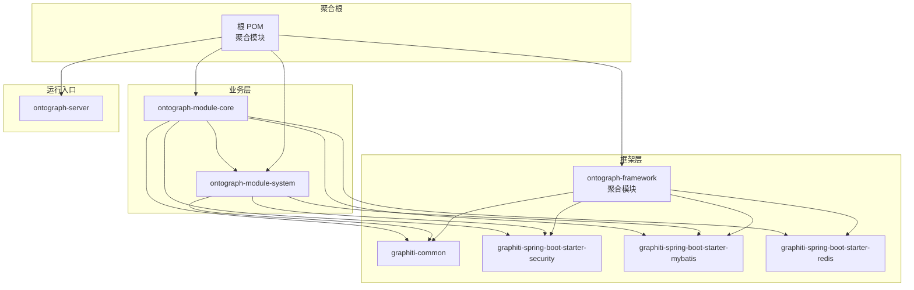
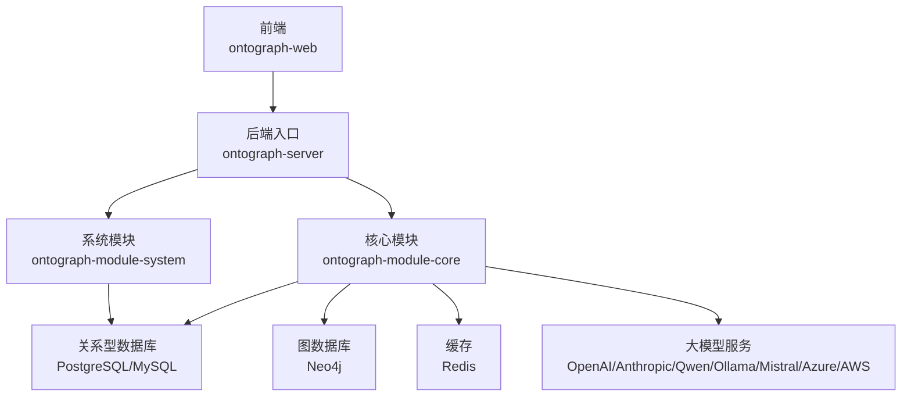
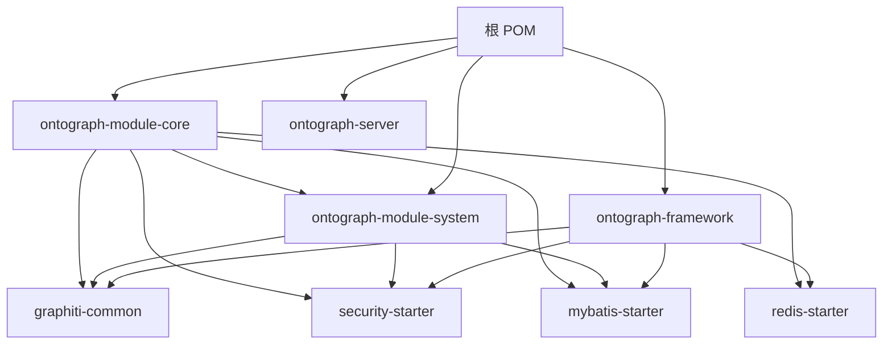
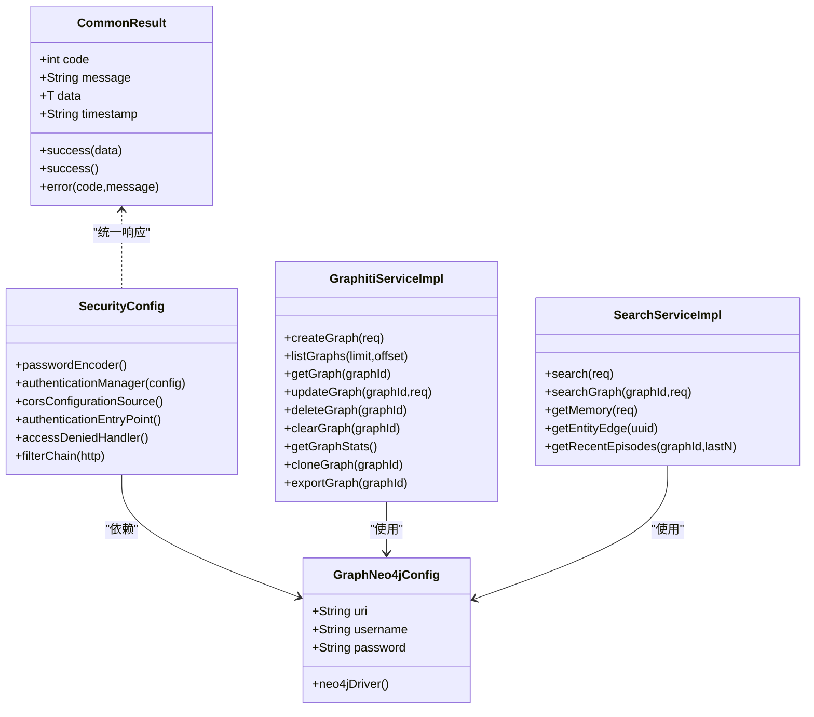
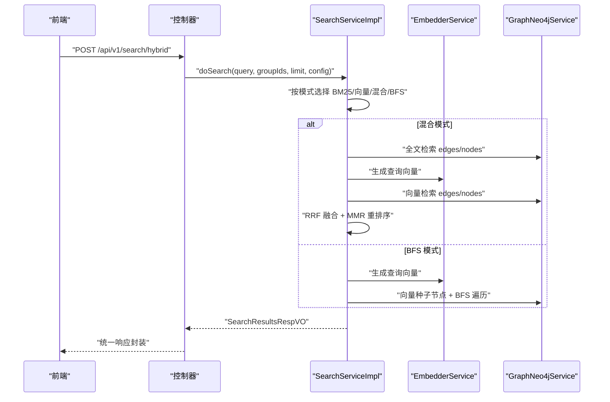
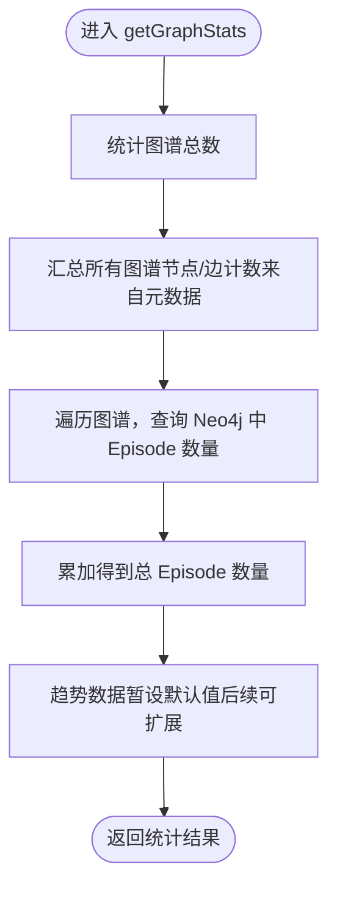
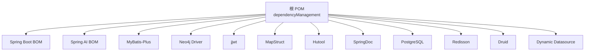

# 架构设计

<!--<cite>
**本文引用的文件**
- [根 POM 文件](file://pom.xml)
- [服务入口应用](file://ontograph-server/src/main/java/com/GraphitiApplication.java)
- [模块说明与架构概览](file://README.md)
- [框架聚合模块 POM](file://ontograph-framework/pom.xml)
- [核心业务模块 POM](file://ontograph-module-core/pom.xml)
- [系统管理模块 POM](file://ontograph-module-system/pom.xml)
- [通用模块 POM](file://ontograph-framework/graphiti-common/pom.xml)
- [安全 Starter POM](file://ontograph-framework/graphiti-spring-boot-starter-security/pom.xml)
- [MyBatis Starter POM](file://ontograph-framework/graphiti-spring-boot-starter-mybatis/pom.xml)
- [统一响应封装](file://ontograph-framework/graphiti-common/src/main/java/com/graphiti/common/response/CommonResult.java)
- [安全配置类](file://ontograph-framework/graphiti-spring-boot-starter-security/src/main/java/com/graphiti/framework/security/config/SecurityConfig.java)
- [Neo4j 配置类](file://ontograph-module-core/src/main/java/com/graphiti/module/graphiti/config/GraphNeo4jConfig.java)
- [图谱服务实现](file://ontograph-module-core/src/main/java/com/graphiti/module/graphiti/service/impl/GraphitiServiceImpl.java)
- [搜索服务实现](file://ontograph-module-core/src/main/java/com/graphiti/module/graphiti/service/impl/SearchServiceImpl.java)
</cite>-->

## 目录
1. [引言](#引言)
2. [项目结构](#项目结构)
3. [核心组件](#核心组件)
4. [架构总览](#架构总览)
5. [详细组件分析](#详细组件分析)
6. [依赖分析](#依赖分析)
7. [性能考虑](#性能考虑)
8. [故障排查指南](#故障排查指南)
9. [结论](#结论)
10. [附录](#附录)

## 引言
本文件为 ontograph-java 的架构设计文档，面向架构师与高级开发者，系统阐述系统的整体架构、模块化设计原则、分层架构模式（表现层、业务层、数据访问层）、Maven 多模块组织与依赖关系、核心设计模式的应用、技术选型与权衡、系统边界与外部依赖管理、集成点设计、可扩展性与性能安全设计，并提供架构图与组件交互图，帮助读者快速理解并高效扩展该知识图谱后端系统。

## 项目结构
ontograph-java 采用 Maven 多模块聚合结构，顶层 POM 聚合四大模块：
- ontograph-framework：框架基础设施层，提供通用工具、安全、MyBatis、Redis 等 Starter。
- ontograph-module-system：系统管理模块，提供用户、角色、菜单、通知、日志等基础能力。
- ontograph-module-core：核心业务模块，涵盖图谱管理、本体、检索、导入、社区检测、数据质量等。
- ontograph-server：Spring Boot 启动模块，作为应用入口，负责装配各模块与对外暴露 API。
- ontograph-web：前端模块（Vue 3），非本文重点，用于调用后端 API。

模块间依赖关系遵循“上层模块依赖下层模块”的原则，避免反向依赖，确保职责清晰与可测试性。

**图表来源**
- [根 POM 文件:15-20](file://pom.xml#L15-L20)
- [框架聚合模块 POM:22-27](file://ontograph-framework/pom.xml#L22-L27)
- [系统管理模块 POM:16-31](file://ontograph-module-system/pom.xml#L16-L31)
- [核心业务模块 POM:17-40](file://ontograph-module-core/pom.xml#L17-L40)

**章节来源**
- [根 POM 文件:15-20](file://pom.xml#L15-L20)
- [模块说明与架构概览:71-166](file://README.md#L71-L166)

## 核心组件
- 统一响应封装：提供统一的响应结构，便于前后端契约一致与错误处理。
- 安全配置：基于 Spring Security + JWT 的无状态认证体系，支持跨域、未认证与权限不足的统一错误输出。
- Neo4j 配置：通过配置类读取连接参数，创建 Driver Bean，集中管理图数据库连接。
- 图谱服务：负责图谱生命周期管理（创建、列表、详情、更新、删除、克隆、导出、统计等），并与 Neo4j 与关系型数据库协同。
- 搜索服务：实现混合检索（BM25 全文 + 向量 + BFS），支持 RRF 融合与 MMR 重排序，提供上下文记忆与最近事件查询。

**章节来源**
- [统一响应封装:13-67](file://ontograph-framework/graphiti-common/src/main/java/com/graphiti/common/response/CommonResult.java#L13-L67)
- [安全配置类:32-136](file://ontograph-framework/graphiti-spring-boot-starter-security/src/main/java/com/graphiti/framework/security/config/SecurityConfig.java#L32-L136)
- [Neo4j 配置类:17-46](file://ontograph-module-core/src/main/java/com/graphiti/module/graphiti/config/GraphNeo4jConfig.java#L17-L46)
- [图谱服务实现:24-200](file://ontograph-module-core/src/main/java/com/graphiti/module/graphiti/service/impl/GraphitiServiceImpl.java#L24-L200)
- [搜索服务实现:18-200](file://ontograph-module-core/src/main/java/com/graphiti/module/graphiti/service/impl/SearchServiceImpl.java#L18-L200)

## 架构总览
系统采用分层架构与模块化设计：
- 表现层：ontograph-server 作为 Spring Boot 应用入口，装配各模块并暴露 REST API；前端 ontograph-web 通过 API 调用后端。
- 业务层：ontograph-module-core 提供核心业务逻辑（图谱、本体、检索、导入、社区、数据质量等）；ontograph-module-system 提供系统管理能力（用户、角色、菜单、通知、日志等）。
- 数据访问层：ontograph-module-core 通过 MyBatis-Plus 访问关系型数据库（PostgreSQL/MySQL），通过 Neo4j Java Driver 访问图数据库；缓存使用 Redisson。
- 基础设施层：ontograph-framework 提供通用模块与各技术组件 Starter（安全、MyBatis、Redis），统一配置与依赖版本。

**图表来源**
- [模块说明与架构概览:71-108](file://README.md#L71-L108)
- [核心业务模块 POM:41-80](file://ontograph-module-core/pom.xml#L41-L80)
- [系统管理模块 POM:16-31](file://ontograph-module-system/pom.xml#L16-L31)

## 详细组件分析

### 分层架构与职责划分
- 表现层（ontograph-server）：应用启动、自动装配、路由与控制器暴露。
- 业务层（ontograph-module-system、ontograph-module-core）：以 Service 接口与实现为核心，封装领域逻辑与流程编排。
- 数据访问层（MyBatis-Plus、Neo4j Driver、Redisson）：DAO/Repository 层负责数据持久化与缓存。
- 基础设施层（ontograph-framework）：提供通用工具、安全、MyBatis、Redis 等 Starter，统一依赖与配置。

设计决策与实现方式：
- 业务逻辑集中在 Service 层，Controller 仅做参数校验与调用，便于单元测试与复用。
- Neo4j 与关系型数据库分离存储，图谱与事实使用 Neo4j，元数据与系统数据使用关系型数据库，提升查询效率与一致性。
- 通过统一响应封装与安全配置，保证接口一致性与安全性。

**章节来源**
- [模块说明与架构概览:71-166](file://README.md#L71-L166)
- [统一响应封装:13-67](file://ontograph-framework/graphiti-common/src/main/java/com/graphiti/common/response/CommonResult.java#L13-L67)
- [安全配置类:32-136](file://ontograph-framework/graphiti-spring-boot-starter-security/src/main/java/com/graphiti/framework/security/config/SecurityConfig.java#L32-L136)

### Maven 多模块组织与依赖关系
- 顶层 POM 聚合四大模块，统一版本与依赖管理。
- ontograph-framework 聚合通用模块与各技术 Starter，被其他业务模块复用。
- ontograph-module-system 依赖 graphiti-common、security、mybatis。
- ontograph-module-core 依赖 system 模块以及 framework 下的 mybatis、redis、security，并引入多种 LLM Starter 以支持多提供商。
- ontograph-server 作为运行入口，不直接依赖业务代码，通过 Spring 自动装配加载模块。

**图表来源**
- [根 POM 文件:15-20](file://pom.xml#L15-L20)
- [框架聚合模块 POM:22-27](file://ontograph-framework/pom.xml#L22-L27)
- [系统管理模块 POM:16-31](file://ontograph-module-system/pom.xml#L16-L31)
- [核心业务模块 POM:17-40](file://ontograph-module-core/pom.xml#L17-L40)

**章节来源**
- [根 POM 文件:45-196](file://pom.xml#L45-L196)
- [框架聚合模块 POM:22-27](file://ontograph-framework/pom.xml#L22-L27)
- [系统管理模块 POM:16-31](file://ontograph-module-system/pom.xml#L16-L31)
- [核心业务模块 POM:17-40](file://ontograph-module-core/pom.xml#L17-L40)

### 核心设计模式应用
- 工厂模式：通过 Spring Starter 与配置类（如 Neo4j 配置）集中创建与管理驱动实例，降低耦合。
- 策略模式：搜索服务对不同检索模式（BM25、向量、混合、BFS）进行策略化封装，支持动态切换与组合。
- 适配器模式：通过 EmbedderService 适配不同 LLM 提供商的嵌入生成能力，统一接口以支持多提供商。
- 单例与依赖注入：统一响应封装、安全配置、Neo4j 配置均通过 Spring Bean 管理，确保全局一致性与可替换性。

**图表来源**
- [统一响应封装:13-67](file://ontograph-framework/graphiti-common/src/main/java/com/graphiti/common/response/CommonResult.java#L13-L67)
- [安全配置类:32-136](file://ontograph-framework/graphiti-spring-boot-starter-security/src/main/java/com/graphiti/framework/security/config/SecurityConfig.java#L32-L136)
- [Neo4j 配置类:17-46](file://ontograph-module-core/src/main/java/com/graphiti/module/graphiti/config/GraphNeo4jConfig.java#L17-L46)
- [图谱服务实现:24-200](file://ontograph-module-core/src/main/java/com/graphiti/module/graphiti/service/impl/GraphitiServiceImpl.java#L24-L200)
- [搜索服务实现:18-200](file://ontograph-module-core/src/main/java/com/graphiti/module/graphiti/service/impl/SearchServiceImpl.java#L18-L200)

**章节来源**
- [统一响应封装:13-67](file://ontograph-framework/graphiti-common/src/main/java/com/graphiti/common/response/CommonResult.java#L13-L67)
- [安全配置类:32-136](file://ontograph-framework/graphiti-spring-boot-starter-security/src/main/java/com/graphiti/framework/security/config/SecurityConfig.java#L32-L136)
- [Neo4j 配置类:17-46](file://ontograph-module-core/src/main/java/com/graphiti/module/graphiti/config/GraphNeo4jConfig.java#L17-L46)
- [图谱服务实现:24-200](file://ontograph-module-core/src/main/java/com/graphiti/module/graphiti/service/impl/GraphitiServiceImpl.java#L24-L200)
- [搜索服务实现:18-200](file://ontograph-module-core/src/main/java/com/graphiti/module/graphiti/service/impl/SearchServiceImpl.java#L18-L200)

### API 工作流（以搜索为例）

**图表来源**
- [搜索服务实现:94-200](file://ontograph-module-core/src/main/java/com/graphiti/module/graphiti/service/impl/SearchServiceImpl.java#L94-L200)

**章节来源**
- [搜索服务实现:94-200](file://ontograph-module-core/src/main/java/com/graphiti/module/graphiti/service/impl/SearchServiceImpl.java#L94-L200)

### 复杂逻辑流程（图谱统计）

**图表来源**
- [图谱服务实现:118-158](file://ontograph-module-core/src/main/java/com/graphiti/module/graphiti/service/impl/GraphitiServiceImpl.java#L118-L158)

**章节来源**
- [图谱服务实现:118-158](file://ontograph-module-core/src/main/java/com/graphiti/module/graphiti/service/impl/GraphitiServiceImpl.java#L118-L158)

## 依赖分析
- 版本与依赖管理：顶层 POM 使用 dependencyManagement 管理 Spring Boot、Spring AI、MyBatis-Plus、Neo4j、JWT、MapStruct、Hutool、SpringDoc、PostgreSQL、Redisson、Druid、动态数据源等版本，确保一致性。
- 模块间依赖：业务模块依赖框架模块与系统模块，避免循环依赖；核心模块引入多种 LLM Starter 以支持多提供商。
- 外部依赖：Neo4j、PostgreSQL/MySQL、Redis、各类 LLM 提供商 SDK。

**图表来源**
- [根 POM 文件:45-196](file://pom.xml#L45-L196)

**章节来源**
- [根 POM 文件:45-196](file://pom.xml#L45-L196)

## 性能考虑
- 检索性能：混合检索结合 BM25、向量与 BFS，通过 RRF 融合与 MMR 重排序平衡召回与多样性；建议合理设置 rrfK 与 MMR Lambda 参数。
- 缓存策略：使用 Redisson 作为缓存与会话存储，建议对热点查询结果与用户会话进行缓存，降低数据库压力。
- 数据库优化：关系型数据库使用 Druid 连接池与 MyBatis-Plus，建议开启 SQL 日志与慢查询监控；Neo4j 使用向量索引与合适的索引策略。
- 并发与无状态：基于 JWT 的无状态认证减少会话开销，适合水平扩展。

[本节为通用性能指导，无需特定文件引用]

## 故障排查指南
- 统一错误输出：安全配置类提供未认证与权限不足的统一 JSON 输出，便于前端识别与提示。
- 统一响应封装：后端统一返回 code、message、data、timestamp，便于问题定位与日志追踪。
- 常见问题定位：
  - 认证失败：检查 JWT Token 是否有效、是否携带在请求头中。
  - 权限不足：确认用户角色与资源权限映射。
  - 检索异常：检查 LLM 提供商配置、向量维度与相似度函数、Neo4j 索引是否正确创建。
  - 数据库连接：检查 Druid 连接池配置与动态数据源配置。

**章节来源**
- [安全配置类:84-113](file://ontograph-framework/graphiti-spring-boot-starter-security/src/main/java/com/graphiti/framework/security/config/SecurityConfig.java#L84-L113)
- [统一响应封装:13-67](file://ontograph-framework/graphiti-common/src/main/java/com/graphiti/common/response/CommonResult.java#L13-L67)

## 结论
ontograph-java 通过清晰的分层架构与模块化设计，实现了知识图谱后端的高内聚、低耦合与可扩展性。框架层提供统一的安全、数据访问与缓存能力，业务层聚焦于图谱、本体、检索与数据质量等核心能力，配合多 LLM 提供商支持与混合检索策略，满足复杂场景下的知识管理需求。建议在生产环境中完善监控与缓存策略，持续优化检索参数与索引配置，以获得更佳的性能与稳定性。

[本节为总结性内容，无需特定文件引用]

## 附录
- 技术栈与版本：详见模块说明与架构概览中的技术栈表格。
- 快速开始与配置：参考模块说明与架构概览中的 Quick Start 与配置章节。
- API 文档：Swagger/OpenAPI 地址与 API 分组详见模块说明与架构概览。

**章节来源**
- [模块说明与架构概览:170-493](file://README.md#L170-L493)