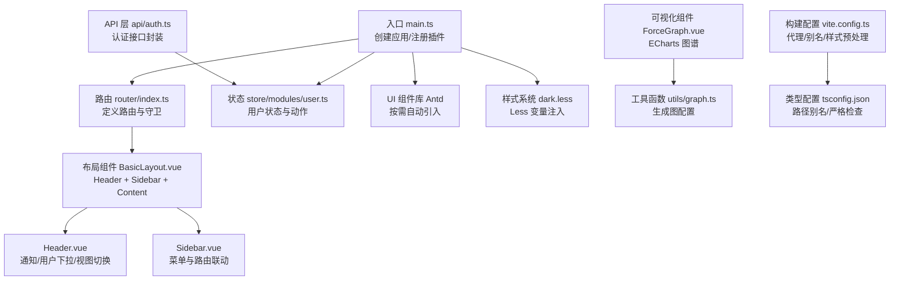
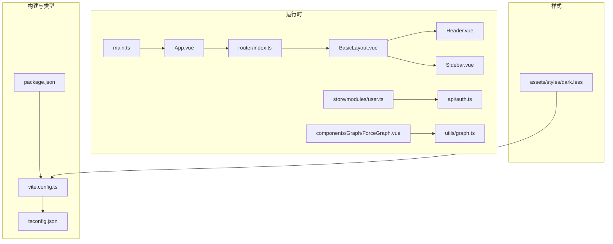
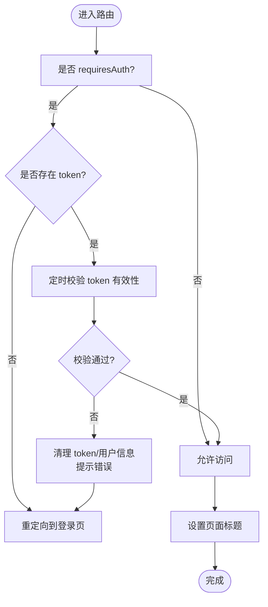
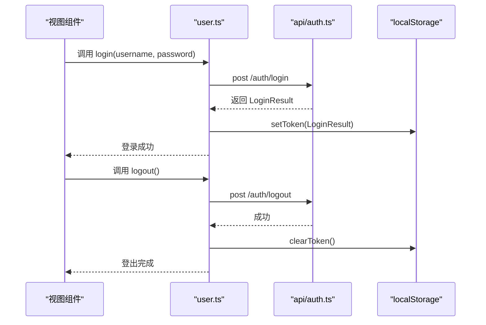
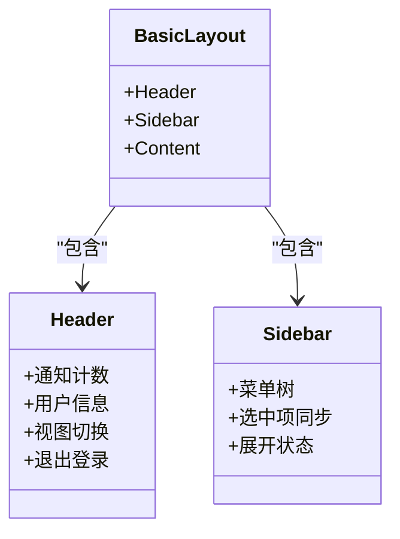
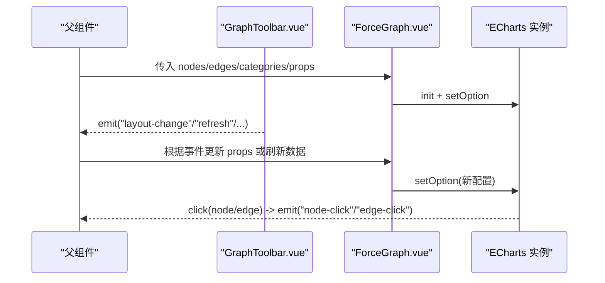
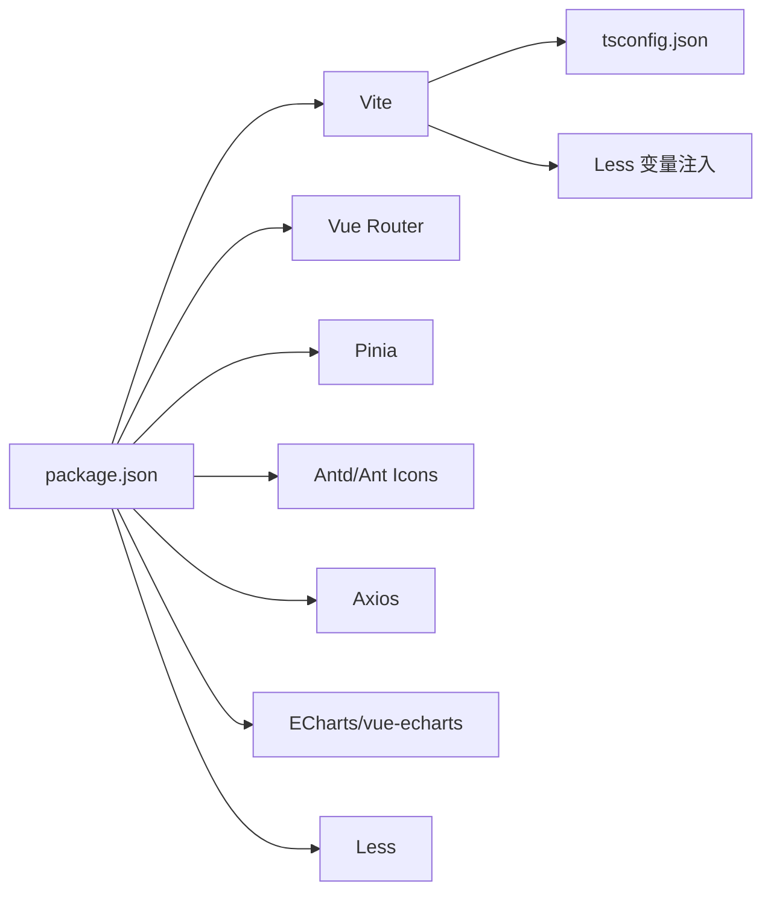

# 前端应用模块 (ontograph-web)

<!--<cite>
**本文引用的文件**
- [package.json](file://ontograph-web/package.json)
- [vite.config.ts](file://ontograph-web/vite.config.ts)
- [tsconfig.json](file://ontograph-web/tsconfig.json)
- [src/main.ts](file://ontograph-web/src/main.ts)
- [src/App.vue](file://ontograph-web/src/App.vue)
- [src/router/index.ts](file://ontograph-web/src/router/index.ts)
- [src/store/modules/user.ts](file://ontograph-web/src/store/modules/user.ts)
- [src/utils/auth.ts](file://ontograph-web/src/utils/auth.ts)
- [src/api/auth.ts](file://ontograph-web/src/api/auth.ts)
- [src/components/Layout/BasicLayout.vue](file://ontograph-web/src/components/Layout/BasicLayout.vue)
- [src/components/Layout/Header.vue](file://ontograph-web/src/components/Layout/Header.vue)
- [src/components/Layout/Sidebar.vue](file://ontograph-web/src/components/Layout/Sidebar.vue)
- [src/components/Graph/ForceGraph.vue](file://ontograph-web/src/components/Graph/ForceGraph.vue)
- [src/components/Graph/GraphToolbar.vue](file://ontograph-web/src/components/Graph/GraphToolbar.vue)
- [src/assets/styles/dark.less](file://ontograph-web/src/assets/styles/dark.less)
</cite>-->

## 目录
1. [简介](#简介)
2. [项目结构](#项目结构)
3. [核心组件](#核心组件)
4. [架构总览](#架构总览)
5. [详细组件分析](#详细组件分析)
6. [依赖分析](#依赖分析)
7. [性能考虑](#性能考虑)
8. [故障排查指南](#故障排查指南)
9. [结论](#结论)
10. [附录](#附录)

## 简介
本文件为 ontograph-java 前端应用模块（ontograph-web）的系统化技术文档，覆盖 Vue.js 3 应用的架构设计、组件体系、状态管理、路由配置、构建与类型系统、样式系统、认证与权限、页面布局与可视化组件、API 调用与错误处理、加载与缓存策略，并提供组件开发指南、页面开发示例与样式定制方案，以及开发环境搭建、调试技巧与性能优化建议。

## 项目结构
ontograph-web 采用 Vite + Vue 3 + TypeScript + Pinia + Vue Router + Ant Design Vue + Less 的现代前端栈。项目通过 Vite 进行开发与打包，使用 Less 全局变量统一主题，Ant Design Vue 提供 UI 组件库，Pinia 管理全局状态，Vue Router 提供路由与鉴权守卫，Axios 封装请求。

**图表来源**
- [src/main.ts:1-25](file://ontograph-web/src/main.ts#L1-L25)
- [src/router/index.ts:1-233](file://ontograph-web/src/router/index.ts#L1-L233)
- [src/store/modules/user.ts:1-67](file://ontograph-web/src/store/modules/user.ts#L1-L67)
- [src/components/Layout/BasicLayout.vue:1-51](file://ontograph-web/src/components/Layout/BasicLayout.vue#L1-L51)
- [src/components/Layout/Header.vue:1-212](file://ontograph-web/src/components/Layout/Header.vue#L1-L212)
- [src/components/Layout/Sidebar.vue:1-311](file://ontograph-web/src/components/Layout/Sidebar.vue#L1-L311)
- [src/api/auth.ts:1-53](file://ontograph-web/src/api/auth.ts#L1-L53)
- [src/components/Graph/ForceGraph.vue:1-133](file://ontograph-web/src/components/Graph/ForceGraph.vue#L1-L133)
- [vite.config.ts:1-41](file://ontograph-web/vite.config.ts#L1-L41)
- [tsconfig.json:1-25](file://ontograph-web/tsconfig.json#L1-L25)

**章节来源**
- [package.json:1-32](file://ontograph-web/package.json#L1-L32)
- [vite.config.ts:1-41](file://ontograph-web/vite.config.ts#L1-L41)
- [tsconfig.json:1-25](file://ontograph-web/tsconfig.json#L1-L25)
- [src/main.ts:1-25](file://ontograph-web/src/main.ts#L1-L25)
- [src/App.vue:1-16](file://ontograph-web/src/App.vue#L1-L16)

## 核心组件
- 应用入口与插件注册：在入口中创建 Vue 应用，安装 Pinia、Router、Ant Design Vue，并挂载到 DOM。
- 路由与鉴权：集中定义页面路由，使用 beforeEach 守卫进行登录态校验与页面标题设置。
- 状态管理：Pinia 用户模块负责 token、用户信息、登录/登出、获取用户信息等。
- 布局组件：BasicLayout 包含 Header 与 Sidebar；Header 负责通知、用户菜单与视图切换；Sidebar 负责菜单项与路由联动。
- 图可视化：ForceGraph 使用 ECharts 渲染图谱，支持多种布局与交互；GraphToolbar 提供图操作工具条。
- 样式系统：通过 Less 变量统一主题，Vite 注入全局样式与变量。

**章节来源**
- [src/main.ts:1-25](file://ontograph-web/src/main.ts#L1-L25)
- [src/router/index.ts:1-233](file://ontograph-web/src/router/index.ts#L1-L233)
- [src/store/modules/user.ts:1-67](file://ontograph-web/src/store/modules/user.ts#L1-L67)
- [src/components/Layout/BasicLayout.vue:1-51](file://ontograph-web/src/components/Layout/BasicLayout.vue#L1-L51)
- [src/components/Layout/Header.vue:1-212](file://ontograph-web/src/components/Layout/Header.vue#L1-L212)
- [src/components/Layout/Sidebar.vue:1-311](file://ontograph-web/src/components/Layout/Sidebar.vue#L1-L311)
- [src/components/Graph/ForceGraph.vue:1-133](file://ontograph-web/src/components/Graph/ForceGraph.vue#L1-L133)
- [src/components/Graph/GraphToolbar.vue:1-157](file://ontograph-web/src/components/Graph/GraphToolbar.vue#L1-L157)
- [src/assets/styles/dark.less:1-49](file://ontograph-web/src/assets/styles/dark.less#L1-L49)

## 架构总览
应用采用“入口 -> 插件注册 -> 路由/状态/布局 -> 页面与组件 -> API -> 可视化”的分层架构。路由守卫贯穿认证与页面标题；Pinia 管理用户会话；Antd 提供 UI；Less 提供主题；Vite 提供开发与构建能力。

**图表来源**
- [src/main.ts:1-25](file://ontograph-web/src/main.ts#L1-L25)
- [src/App.vue:1-16](file://ontograph-web/src/App.vue#L1-L16)
- [src/router/index.ts:1-233](file://ontograph-web/src/router/index.ts#L1-L233)
- [src/components/Layout/BasicLayout.vue:1-51](file://ontograph-web/src/components/Layout/BasicLayout.vue#L1-L51)
- [src/components/Layout/Header.vue:1-212](file://ontograph-web/src/components/Layout/Header.vue#L1-L212)
- [src/components/Layout/Sidebar.vue:1-311](file://ontograph-web/src/components/Layout/Sidebar.vue#L1-L311)
- [src/store/modules/user.ts:1-67](file://ontograph-web/src/store/modules/user.ts#L1-L67)
- [src/api/auth.ts:1-53](file://ontograph-web/src/api/auth.ts#L1-L53)
- [src/components/Graph/ForceGraph.vue:1-133](file://ontograph-web/src/components/Graph/ForceGraph.vue#L1-L133)
- [vite.config.ts:1-41](file://ontograph-web/vite.config.ts#L1-L41)
- [tsconfig.json:1-25](file://ontograph-web/tsconfig.json#L1-L25)
- [src/assets/styles/dark.less:1-49](file://ontograph-web/src/assets/styles/dark.less#L1-L49)

## 详细组件分析

### 路由与权限控制
- 路由定义：包含登录页与受保护页面，受保护页面 meta.requiresAuth 为 true。
- 鉴权守卫：beforeEach 中判断是否需要认证、token 是否存在；对已登录用户访问登录页进行重定向；定期校验 token 有效性，异常时清理本地状态并跳转登录。
- 页面标题：根据 meta.title 动态设置 document.title。

**图表来源**
- [src/router/index.ts:181-230](file://ontograph-web/src/router/index.ts#L181-L230)

**章节来源**
- [src/router/index.ts:1-233](file://ontograph-web/src/router/index.ts#L1-L233)

### 状态管理（Pinia）
- 用户状态：token、userInfo、登录/登出、获取用户信息。
- 与本地存储交互：登录成功写入 token 与用户信息；登出清理；初始化从本地恢复。
- 与 API 协作：登录调用后端接口，更新状态；登出主动调用后端接口。

**图表来源**
- [src/store/modules/user.ts:21-44](file://ontograph-web/src/store/modules/user.ts#L21-L44)
- [src/api/auth.ts:31-41](file://ontograph-web/src/api/auth.ts#L31-L41)
- [src/utils/auth.ts:14-30](file://ontograph-web/src/utils/auth.ts#L14-L30)

**章节来源**
- [src/store/modules/user.ts:1-67](file://ontograph-web/src/store/modules/user.ts#L1-L67)
- [src/utils/auth.ts:1-41](file://ontograph-web/src/utils/auth.ts#L1-L41)
- [src/api/auth.ts:1-53](file://ontograph-web/src/api/auth.ts#L1-L53)

### 布局组件体系
- BasicLayout：整体布局容器，包含 Header、Sidebar 与内容区域。
- Header：Logo、通知气泡、用户头像与下拉菜单（个人中心、退出登录），支持视图模式切换。
- Sidebar：多级菜单，根据当前路由高亮选中项与展开父级菜单，点击跳转对应路由。

**图表来源**
- [src/components/Layout/BasicLayout.vue:1-51](file://ontograph-web/src/components/Layout/BasicLayout.vue#L1-L51)
- [src/components/Layout/Header.vue:1-212](file://ontograph-web/src/components/Layout/Header.vue#L1-L212)
- [src/components/Layout/Sidebar.vue:1-311](file://ontograph-web/src/components/Layout/Sidebar.vue#L1-L311)

**章节来源**
- [src/components/Layout/BasicLayout.vue:1-51](file://ontograph-web/src/components/Layout/BasicLayout.vue#L1-L51)
- [src/components/Layout/Header.vue:1-212](file://ontograph-web/src/components/Layout/Header.vue#L1-L212)
- [src/components/Layout/Sidebar.vue:1-311](file://ontograph-web/src/components/Layout/Sidebar.vue#L1-L311)

### 图可视化组件
- ForceGraph：基于 ECharts 的力导向/环形/树形图渲染，支持标签显隐、节点高亮、点击事件透传、响应式尺寸。
- GraphToolbar：提供缩放、标签开关、布局切换、刷新、全屏等操作，向父组件发出事件。

**图表来源**
- [src/components/Graph/ForceGraph.vue:39-96](file://ontograph-web/src/components/Graph/ForceGraph.vue#L39-L96)
- [src/components/Graph/GraphToolbar.vue:86-122](file://ontograph-web/src/components/Graph/GraphToolbar.vue#L86-L122)

**章节来源**
- [src/components/Graph/ForceGraph.vue:1-133](file://ontograph-web/src/components/Graph/ForceGraph.vue#L1-L133)
- [src/components/Graph/GraphToolbar.vue:1-157](file://ontograph-web/src/components/Graph/GraphToolbar.vue#L1-L157)

### 样式系统与主题
- Less 变量：统一主色、背景、文字、边框、阴影、圆角、状态色等。
- Vite 注入：在构建阶段将 dark.less 变量注入到所有样式中，支持全局覆盖。
- 组件样式：使用 scoped + less，结合变量实现深色主题一致性。

**章节来源**
- [src/assets/styles/dark.less:1-49](file://ontograph-web/src/assets/styles/dark.less#L1-L49)
- [vite.config.ts:27-39](file://ontograph-web/vite.config.ts#L27-L39)

### API 接口与请求封装
- 认证相关：登录、登出、获取当前用户信息。
- 请求封装：统一通过 request（位于 src/api/request.ts）发起，配合路由守卫与状态管理使用。
- 错误处理：路由守卫中捕获 401 等错误并清理状态；组件内通过消息提示反馈。

**章节来源**
- [src/api/auth.ts:1-53](file://ontograph-web/src/api/auth.ts#L1-L53)
- [src/router/index.ts:194-216](file://ontograph-web/src/router/index.ts#L194-L216)

## 依赖分析
- 运行时依赖：Vue 3、Vue Router、Pinia、Ant Design Vue、Axios、ECharts、vue-echarts、Less。
- 开发依赖：Vite、Vue 插件、TypeScript、vue-tsc、unplugin-vue-components、unplugin-auto-import。
- 构建目标：ES2015，CSS 目标 chrome61，开发服务器端口 3000，/api 代理到后端 8080。

**图表来源**
- [package.json:1-32](file://ontograph-web/package.json#L1-L32)
- [vite.config.ts:1-41](file://ontograph-web/vite.config.ts#L1-L41)
- [tsconfig.json:1-25](file://ontograph-web/tsconfig.json#L1-L25)

**章节来源**
- [package.json:1-32](file://ontograph-web/package.json#L1-L32)
- [vite.config.ts:1-41](file://ontograph-web/vite.config.ts#L1-L41)
- [tsconfig.json:1-25](file://ontograph-web/tsconfig.json#L1-L25)

## 性能考虑
- 图渲染优化：ForceGraph 使用 canvas 渲染器，避免过度重绘；监听 props 深度变化后异步更新配置。
- 路由守卫节流：token 校验间隔 1 分钟，减少频繁请求。
- 样式体积：Less 变量集中管理，避免重复定义；生产构建按需引入组件。
- 构建目标：ES2015，确保兼容性同时保持较小包体；CSS 目标 chrome61，兼顾旧浏览器。

[本节为通用性能建议，不直接分析具体文件]

## 故障排查指南
- 登录后无法访问受保护页面
  - 检查路由守卫逻辑与 token 存储；确认后端 /auth/info 返回正常。
- 登录状态异常或频繁掉线
  - 查看路由守卫中的定时校验与错误分支；确认服务端 JWT 有效时间与刷新策略。
- 图表不显示或空白
  - 检查容器尺寸与 ECharts 初始化时机；确认传入 nodes/edges 非空；监听 props 变化触发 update。
- 样式主题不生效
  - 确认 Vite 的 Less 变量注入与 @import 路径正确；检查组件 scoped 样式是否覆盖变量。

**章节来源**
- [src/router/index.ts:181-230](file://ontograph-web/src/router/index.ts#L181-L230)
- [src/components/Graph/ForceGraph.vue:39-96](file://ontograph-web/src/components/Graph/ForceGraph.vue#L39-L96)
- [vite.config.ts:27-39](file://ontograph-web/vite.config.ts#L27-L39)

## 结论
ontograph-web 以 Vue 3 为核心，结合 Pinia、Vue Router、Antd 与 ECharts，构建了现代化、可扩展的前端控制台。通过集中式的路由守卫与状态管理保障安全与一致性，通过 Less 变量与 Vite 配置实现主题统一与构建优化。组件层面提供可复用的布局与可视化能力，便于快速迭代与功能扩展。

[本节为总结性内容，不直接分析具体文件]

## 附录

### 开发环境搭建
- 安装依赖：使用包管理器安装依赖后，执行 dev 启动开发服务器。
- 开发服务器：默认端口 3000，/api 代理到后端 8080。
- 类型检查：脚本提供 type-check，可在 CI 中启用严格类型检查。

**章节来源**
- [package.json:5-10](file://ontograph-web/package.json#L5-L10)
- [vite.config.ts:18-26](file://ontograph-web/vite.config.ts#L18-L26)
- [tsconfig.json:14-17](file://ontograph-web/tsconfig.json#L14-L17)

### 调试技巧
- 在 main.ts 中打印环境与 URL，定位部署与代理问题。
- 利用浏览器开发者工具观察网络请求与路由跳转。
- 在 Header 中切换视图模式，验证路由与菜单联动。

**章节来源**
- [src/main.ts:9-25](file://ontograph-web/src/main.ts#L9-L25)
- [src/components/Layout/Header.vue:89-100](file://ontograph-web/src/components/Layout/Header.vue#L89-L100)

### 组件开发指南
- 新增页面：在 router 中添加路由记录，页面组件放置于 views 下对应目录。
- 新增布局组件：遵循 BasicLayout 的 Header/Sidebar/Content 结构，保持样式变量一致。
- 新增可视化组件：参考 ForceGraph 的生命周期与 props 监听模式，确保响应式更新与资源释放。

**章节来源**
- [src/router/index.ts:7-174](file://ontograph-web/src/router/index.ts#L7-L174)
- [src/components/Layout/BasicLayout.vue:1-51](file://ontograph-web/src/components/Layout/BasicLayout.vue#L1-L51)
- [src/components/Graph/ForceGraph.vue:103-122](file://ontograph-web/src/components/Graph/ForceGraph.vue#L103-L122)

### 页面开发示例
- 登录页：使用 Antd 表单与按钮，调用 userStore.login 并处理消息提示。
- 图谱列表页：组合 GraphToolbar 与 ForceGraph，监听布局与刷新事件，动态更新图数据。
- 系统管理页：基于 Sidebar 菜单项，路由到对应 views 下的页面组件。

**章节来源**
- [src/store/modules/user.ts:21-33](file://ontograph-web/src/store/modules/user.ts#L21-L33)
- [src/components/Graph/GraphToolbar.vue:86-122](file://ontograph-web/src/components/Graph/GraphToolbar.vue#L86-L122)
- [src/components/Layout/Sidebar.vue:225-227](file://ontograph-web/src/components/Layout/Sidebar.vue#L225-L227)

### 样式定制方案
- 主题变量：修改 dark.less 中的 @primary-color、@bg-*、@text-* 等变量，影响全局。
- 组件样式：在组件 scoped 样式中使用变量，避免污染其他组件。
- Less 注入：通过 Vite 的 preprocessorOptions.additionalData 注入全局变量，无需逐文件 import。

**章节来源**
- [src/assets/styles/dark.less:1-49](file://ontograph-web/src/assets/styles/dark.less#L1-L49)
- [vite.config.ts:27-39](file://ontograph-web/vite.config.ts#L27-L39)