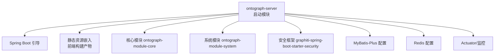
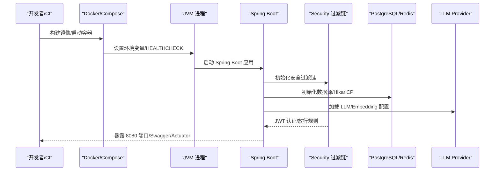
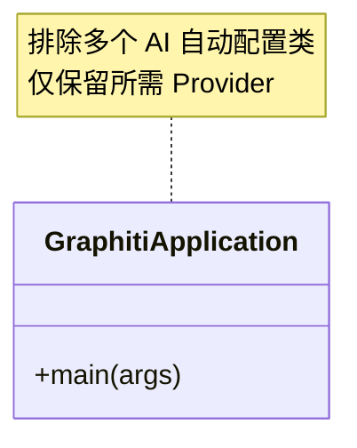
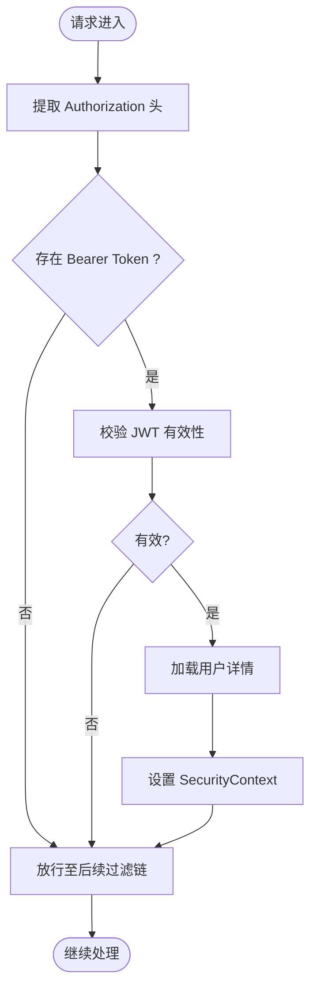
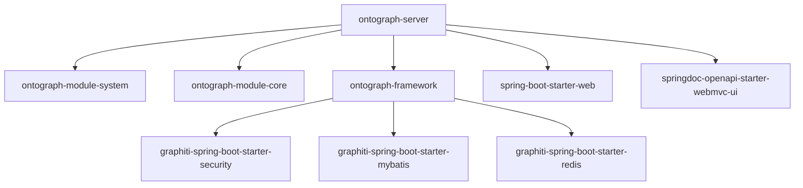

# 应用启动模块 (ontograph-server)

<!--<cite>
**本文引用的文件**
- [GraphitiApplication.java](file://ontograph-server/src/main/java/com/graphiti/GraphitiApplication.java)
- [application.yml](file://ontograph-server/src/main/resources/application.yml)
- [application-dev.yml](file://ontograph-server/src/main/resources/application-dev.yml)
- [pom.xml](file://ontograph-server/pom.xml)
- [SecurityConfig.java](file://ontograph-framework/graphiti-spring-boot-starter-security/src/main/java/com/graphiti/framework/security/config/SecurityConfig.java)
- [JwtAuthenticationFilter.java](file://ontograph-framework/graphiti-spring-boot-starter-security/src/main/java/com/graphiti/framework/security/jwt/JwtAuthenticationFilter.java)
- [JwtTokenProvider.java](file://ontograph-framework/graphiti-spring-boot-starter-security/src/main/java/com/graphiti/framework/security/jwt/JwtTokenProvider.java)
- [Dockerfile](file://docker/Dockerfile)
- [docker-compose.yml](file://docker-compose.yml)
- [docker-compose.prod.yml](file://docker-compose.prod.yml)
- [README.md](file://README.md)
</cite>-->

## 目录
1. [简介](#简介)
2. [项目结构](#项目结构)
3. [核心组件](#核心组件)
4. [架构总览](#架构总览)
5. [详细组件分析](#详细组件分析)
6. [依赖分析](#依赖分析)
7. [性能考虑](#性能考虑)
8. [故障排查指南](#故障排查指南)
9. [结论](#结论)
10. [附录](#附录)

## 简介
本文件为 ontograph-java 应用启动模块（ontograph-server）的权威部署与配置指南。内容覆盖：
- Spring Boot 启动配置与主程序入口
- 环境配置管理（开发/生产）
- application.yml 与 application-dev.yml 参数详解
- 数据库连接池与日志系统配置
- 应用启动流程、Bean 装配与自动配置机制
- Docker 容器化部署、健康检查与监控指标
- 完整部署指南、环境变量与配置模板
- 常见问题与性能调优、安全最佳实践

## 项目结构
ontograph-server 作为 Spring Boot 启动模块，负责：
- 应用引导与自动配置
- 资源与静态页面嵌入（前端构建产物）
- 与核心模块、框架模块的装配集成

图表来源
- [pom.xml:17-40](file://ontograph-server/pom.xml#L17-L40)
- [GraphitiApplication.java:12-38](file://ontograph-server/src/main/java/com/graphiti/GraphitiApplication.java#L12-L38)

章节来源
- [pom.xml:17-40](file://ontograph-server/pom.xml#L17-L40)
- [README.md:114-166](file://README.md#L114-L166)

## 核心组件
- 启动类：负责激活扫描包与排除不必要的自动配置，统一引导应用启动。
- 配置体系：基础配置 application.yml + 开发配置 application-dev.yml；通过 profiles 切换环境。
- 安全框架：基于 Spring Security + JWT 的认证与授权过滤链。
- Docker 化：多阶段构建、健康检查、JVM 调优与容器资源限制。

章节来源
- [GraphitiApplication.java:18-38](file://ontograph-server/src/main/java/com/graphiti/GraphitiApplication.java#L18-L38)
- [application.yml:1-67](file://ontograph-server/src/main/resources/application.yml#L1-L67)
- [application-dev.yml:1-676](file://ontograph-server/src/main/resources/application-dev.yml#L1-L676)
- [SecurityConfig.java:32-136](file://ontograph-framework/graphiti-spring-boot-starter-security/src/main/java/com/graphiti/framework/security/config/SecurityConfig.java#L32-L136)

## 架构总览
应用启动流程与关键配置交互如下：

图表来源
- [Dockerfile:61-74](file://docker/Dockerfile#L61-L74)
- [docker-compose.yml:23-51](file://docker-compose.yml#L23-L51)
- [application-dev.yml:487-593](file://ontograph-server/src/main/resources/application-dev.yml#L487-L593)
- [SecurityConfig.java:115-136](file://ontograph-framework/graphiti-spring-boot-starter-security/src/main/java/com/graphiti/framework/security/config/SecurityConfig.java#L115-L136)

## 详细组件分析

### 启动类与自动配置
- 扫描范围：限定在 com.graphiti 包内，避免跨模块误扫描。
- 自动配置排除：显式排除多个第三方 AI 供应商的自动配置类，确保由应用自行选择所需 Provider。
- 主程序入口：通过 SpringApplication.run 启动。

图表来源
- [GraphitiApplication.java:18-38](file://ontograph-server/src/main/java/com/graphiti/GraphitiApplication.java#L18-L38)

章节来源
- [GraphitiApplication.java:18-38](file://ontograph-server/src/main/java/com/graphiti/GraphitiApplication.java#L18-L38)

### 配置文件与环境管理
- application.yml：基础配置，包含应用名称、MyBatis-Plus、JWT、日志、Actuator、OpenAPI。
- application-dev.yml：开发环境完整模板，覆盖所有主流 LLM Provider 的配置示例与当前使用配置，以及开发期 Actuator、日志、静态资源等。

关键要点
- Profile 切换：application.yml 指定默认 dev；生产通过 docker-compose.prod.yml 覆盖为 prod。
- LLM Provider 选择：graphiti.ai.llm-provider / embedding-provider / rerank-provider。
- 数据源：Dynamic DataSource + HikariCP 连接池参数。
- Redis：本地开发默认配置。
- Neo4j：bolt 连接参数。
- Actuator：生产默认关闭敏感端点，开发默认全部暴露。

章节来源
- [application.yml:1-67](file://ontograph-server/src/main/resources/application.yml#L1-L67)
- [application-dev.yml:1-676](file://ontograph-server/src/main/resources/application-dev.yml#L1-L676)
- [docker-compose.yml:24-48](file://docker-compose.yml#L24-L48)
- [docker-compose.prod.yml:26-42](file://docker-compose.prod.yml#L26-L42)

### 安全与认证（JWT）
- 过滤链：CORS、禁用 CSRF、无状态会话。
- 放行路径：鉴权接口、Swagger、Actuator。
- JWT：从 Authorization 头解析 Bearer Token，校验并注入 Authentication。

图表来源
- [JwtAuthenticationFilter.java:36-59](file://ontograph-framework/graphiti-spring-boot-starter-security/src/main/java/com/graphiti/framework/security/jwt/JwtAuthenticationFilter.java#L36-L59)
- [JwtTokenProvider.java:40-85](file://ontograph-framework/graphiti-spring-boot-starter-security/src/main/java/com/graphiti/framework/security/jwt/JwtTokenProvider.java#L40-L85)
- [SecurityConfig.java:115-136](file://ontograph-framework/graphiti-spring-boot-starter-security/src/main/java/com/graphiti/framework/security/config/SecurityConfig.java#L115-L136)

章节来源
- [SecurityConfig.java:32-136](file://ontograph-framework/graphiti-spring-boot-starter-security/src/main/java/com/graphiti/framework/security/config/SecurityConfig.java#L32-L136)
- [JwtAuthenticationFilter.java:26-60](file://ontograph-framework/graphiti-spring-boot-starter-security/src/main/java/com/graphiti/framework/security/jwt/JwtAuthenticationFilter.java#L26-L60)
- [JwtTokenProvider.java:21-85](file://ontograph-framework/graphiti-spring-boot-starter-security/src/main/java/com/graphiti/framework/security/jwt/JwtTokenProvider.java#L21-L85)

### 数据源与连接池（HikariCP）
- Dynamic DataSource：多数据源支持，主库 master。
- HikariCP 参数：最大池大小、最小空闲、连接超时等。
- 开发默认：本地 PostgreSQL；生产默认在 compose.prod 中调整。

章节来源
- [application-dev.yml:487-502](file://ontograph-server/src/main/resources/application-dev.yml#L487-L502)
- [application-dev.yml:656-670](file://ontograph-server/src/main/resources/application-dev.yml#L656-L670)
- [docker-compose.prod.yml:36-37](file://docker-compose.prod.yml#L36-L37)

### 日志系统
- 控制台格式：时间戳、线程、级别、Logger、消息。
- 开发默认：com.graphiti 与 Spring Security 等 DEBUG 级别。
- 生产默认：INFO 级别，减少噪声。

章节来源
- [application.yml:35-42](file://ontograph-server/src/main/resources/application.yml#L35-L42)
- [application-dev.yml:636-643](file://ontograph-server/src/main/resources/application-dev.yml#L636-L643)
- [docker-compose.prod.yml:29-32](file://docker-compose.prod.yml#L29-L32)

### Actuator 与监控
- 开放端点：health、metrics、info（开发默认全部开放）。
- 健康探测：liveness/readiness/probes/db/redis。
- Prometheus：默认关闭，可按需开启。

章节来源
- [application.yml:43-67](file://ontograph-server/src/main/resources/application.yml#L43-L67)
- [application-dev.yml:615-635](file://ontograph-server/src/main/resources/application-dev.yml#L615-L635)
- [docker-compose.prod.yml:33-34](file://docker-compose.prod.yml#L33-L34)

### 前端静态资源嵌入
- 构建流程：前端 pnpm 安装与构建，产物拷贝至后端静态资源目录。
- 运行时：Spring MVC 静态资源映射，支持本地开发与打包后访问。

章节来源
- [pom.xml:82-128](file://ontograph-server/pom.xml#L82-L128)
- [application-dev.yml:644-655](file://ontograph-server/src/main/resources/application-dev.yml#L644-L655)

## 依赖分析
ontograph-server 对模块与框架的依赖关系如下：

图表来源
- [pom.xml:17-40](file://ontograph-server/pom.xml#L17-L40)

章节来源
- [pom.xml:17-40](file://ontograph-server/pom.xml#L17-L40)

## 性能考虑
- JVM 调优
  - 容器内存感知：UseContainerSupport + MaxRAMPercentage。
  - 生产默认 75% 内存上限，结合 CPU 限制与重启策略。
- 数据库连接池
  - 生产建议增大最大池大小与最小空闲，结合业务并发。
- Redis
  - LRU 策略与持久化配置，控制内存占用。
- LLM Provider
  - 选择合适模型与温度，避免过度计算；私有部署时注意网络延迟与吞吐。

章节来源
- [Dockerfile:68-71](file://docker/Dockerfile#L68-L71)
- [docker-compose.prod.yml:16-23](file://docker-compose.prod.yml#L16-L23)
- [docker-compose.prod.yml:36-37](file://docker-compose.prod.yml#L36-L37)
- [docker-compose.prod.yml:103-111](file://docker-compose.prod.yml#L103-L111)

## 故障排查指南
- 启动失败
  - 检查 Actuator 健康端点：/actuator/health/liveness。
  - 查看容器日志：docker-compose logs -f。
- 数据库连接
  - 确认 PostgreSQL 健康状态与凭据。
  - 检查 HikariCP 连接池参数与最大连接数。
- Redis 连接
  - 确认 Redis 健康与持久化策略。
- LLM Provider
  - 校验 API Key 与 Base URL；确认模型名称与温度设置。
- Swagger/接口
  - 确认 Swagger 路径与放行规则；检查认证是否正确传递 Token。

章节来源
- [docker-compose.yml:78-82](file://docker-compose.yml#L78-L82)
- [docker-compose.yml:98-102](file://docker-compose.yml#L98-L102)
- [docker-compose.yml:60-61](file://docker-compose.yml#L60-L61)
- [docker-compose.prod.yml:43-48](file://docker-compose.prod.yml#L43-L48)

## 结论
ontograph-server 启动模块以清晰的配置分层与容器化部署为核心，结合 Spring Security + JWT 提供安全边界，并通过 Actuator 与 Docker 健康检查实现可观测性。生产环境通过资源限制与 JVM 调优保障稳定性，开发环境提供丰富的 LLM Provider 模板便于快速试用。

## 附录

### 部署指南（单机/容器）
- 开发环境
  - 使用 docker-compose，默认 dev profile，启动后访问：
    - Swagger UI：http://localhost:8080/swagger-ui.html
    - OpenAPI：http://localhost:8080/v3/api-docs
    - Actuator：http://localhost:8080/actuator
- 生产环境
  - 使用 docker-compose.prod.yml，启用 prod profile，设置 JAVA_OPTS 与资源限制。

章节来源
- [README.md:293-312](file://README.md#L293-L312)
- [docker-compose.yml:1-112](file://docker-compose.yml#L1-L112)
- [docker-compose.prod.yml:1-122](file://docker-compose.prod.yml#L1-L122)

### 环境变量清单（关键项）
- Profile 与日志
  - SPRING_PROFILES_ACTIVE
  - LOGGING_LEVEL_ROOT
  - LOGGING_LEVEL_COM_GRAPHTI
- 数据源
  - SPRING_DATASOURCE_DYNAMIC_DATASOURCE_MASTER_URL
  - SPRING_DATASOURCE_DYNAMIC_DATASOURCE_MASTER_USERNAME
  - SPRING_DATASOURCE_DYNAMIC_DATASOURCE_MASTER_PASSWORD
- Redis
  - SPRING_DATA_REDIS_HOST
  - SPRING_DATA_REDIS_PORT
- Neo4j
  - NEO4J_URI
  - NEO4J_USERNAME
  - NEO4J_PASSWORD
- LLM Provider
  - SPRING_AI_OPENAI_API-KEY
  - SPRING_AI_OPENAI_BASE-URL
  - SPRING_AI_OLLAMA_BASE-URL
  - SPRING_AI_AZURE_OPENAI_API-KEY
  - SPRING_AI_AZURE_OPENAI_ENDPOINT
  - GRAPHTI_AI_LLM_PROVIDER
  - GRAPHTI_AI_EMBEDDING_PROVIDER
  - GRAPHTI_AI_RERANK_PROVIDER
- JWT
  - GRAPHTI_SECURITY_JWT_SECRET
  - GRAPHTI_SECURITY_JWT_EXPIRATION

章节来源
- [docker-compose.yml:23-51](file://docker-compose.yml#L23-L51)
- [docker-compose.prod.yml:24-42](file://docker-compose.prod.yml#L24-L42)

### 配置文件模板（节选）
- application.yml（基础）
  - 应用名、MyBatis-Plus、JWT、日志、Actuator、OpenAPI
- application-dev.yml（开发）
  - LLM Provider 完整模板（含 OpenAI/Azure/Ollama/Qwen/Anthropic/Mistral 等）
  - 当前使用配置（示例：OpenAI 兼容本地 LM Studio）
  - 数据源与 Redis 开发默认
  - Actuator 开发全暴露
  - 日志级别与静态资源映射

章节来源
- [application.yml:1-67](file://ontograph-server/src/main/resources/application.yml#L1-L67)
- [application-dev.yml:1-676](file://ontograph-server/src/main/resources/application-dev.yml#L1-L676)

### 安全配置最佳实践
- JWT
  - 使用足够长度的密钥；合理设置过期时间。
  - 在网关或反向代理层统一校验与转发。
- 放行规则
  - 仅对必要路径放行（鉴权、Swagger、Actuator），其余均需认证。
- CORS
  - 明确 AllowedOriginPatterns 与 Credentials 策略，避免通配符滥用。

章节来源
- [SecurityConfig.java:68-79](file://ontograph-framework/graphiti-spring-boot-starter-security/src/main/java/com/graphiti/framework/security/config/SecurityConfig.java#L68-L79)
- [SecurityConfig.java:115-136](file://ontograph-framework/graphiti-spring-boot-starter-security/src/main/java/com/graphiti/framework/security/config/SecurityConfig.java#L115-L136)
- [JwtTokenProvider.java:21-25](file://ontograph-framework/graphiti-spring-boot-starter-security/src/main/java/com/graphiti/framework/security/jwt/JwtTokenProvider.java#L21-L25)