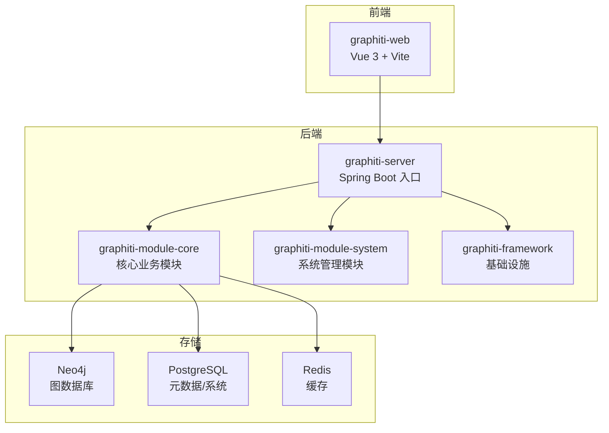
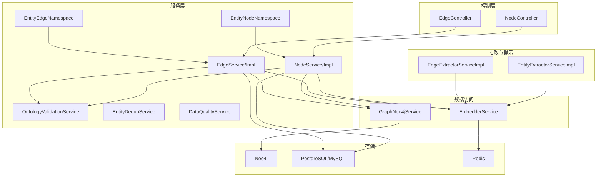
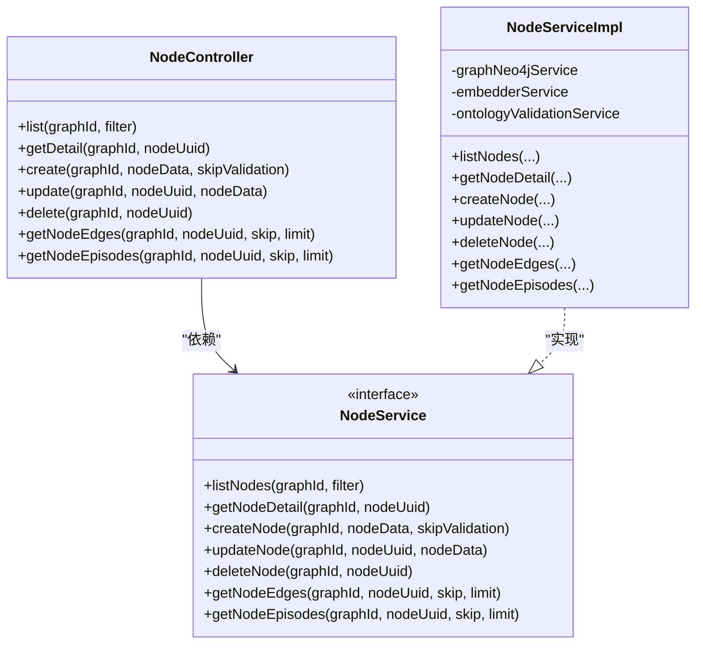
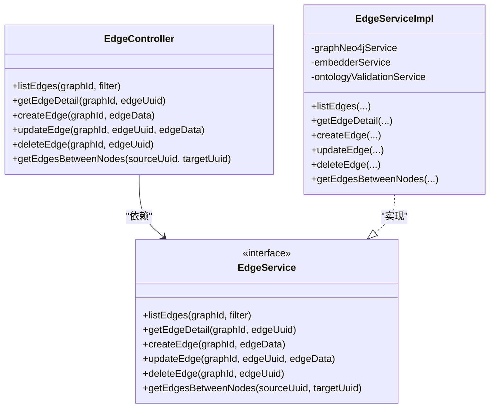
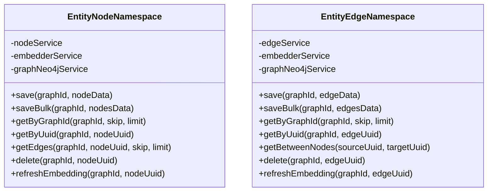
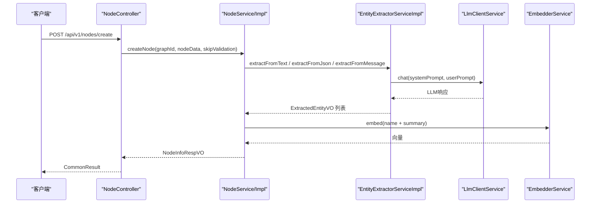
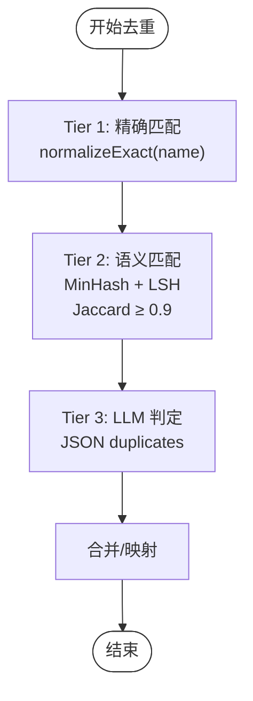
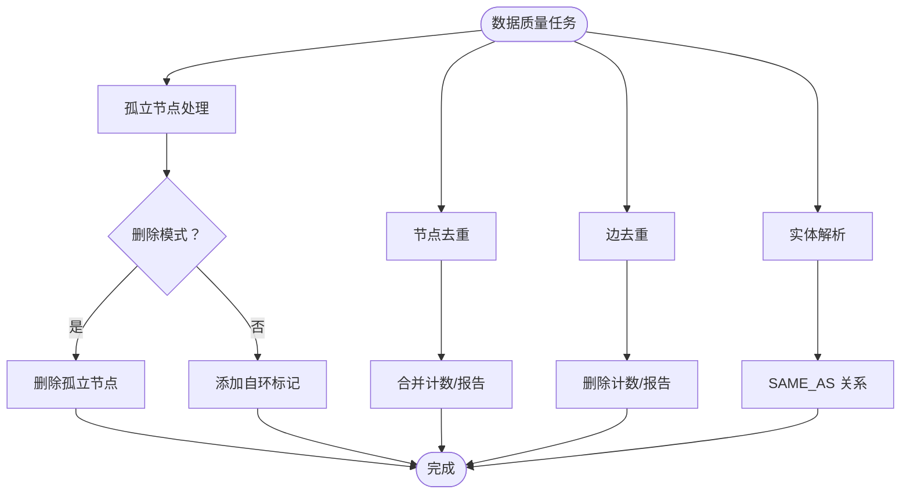
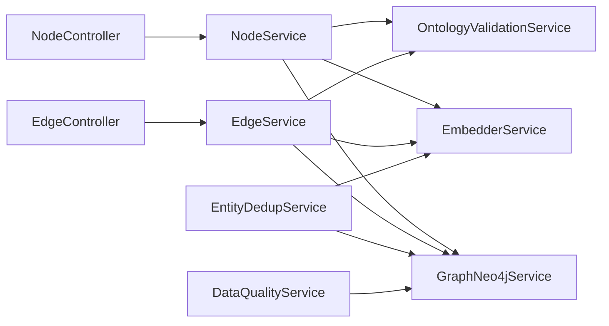

# 实体关系管理

<cite>
**本文引用的文件**
- [README.md](file://README.md)
- [DESIGN.md](file://DESIGN.md)
- [NodeController.java](file://graphiti-module-core/src/main/java/com/Graphiti/module/graphiti/controller/admin/NodeController.java)
- [EdgeController.java](file://graphiti-module-core/src/main/java/com/Graphiti/module/graphiti/controller/admin/EdgeController.java)
- [NodeService.java](file://graphiti-module-core/src/main/java/com/Graphiti/module/graphiti/service/NodeService.java)
- [EdgeService.java](file://graphiti-module-core/src/main/java/com/Graphiti/module/graphiti/service/EdgeService.java)
- [NodeServiceImpl.java](file://graphiti-module-core/src/main/java/com/Graphiti/module/graphiti/service/impl/NodeServiceImpl.java)
- [EdgeServiceImpl.java](file://graphiti-module-core/src/main/java/com/Graphiti/module/graphiti/service/impl/EdgeServiceImpl.java)
- [EntityNodeNamespace.java](file://graphiti-module-core/src/main/java/com/Graphiti/module/graphiti/namespace/node/EntityNodeNamespace.java)
- [EntityEdgeNamespace.java](file://graphiti-module-core/src/main/java/com/Graphiti/module/graphiti/namespace/edge/EntityEdgeNamespace.java)
- [EntityExtractorServiceImpl.java](file://graphiti-module-core/src/main/java/com/Graphiti/module/graphiti/service/impl/EntityExtractorServiceImpl.java)
- [EdgeExtractorServiceImpl.java](file://graphiti-module-core/src/main/java/com/Graphiti/module/graphiti/service/impl/EdgeExtractorServiceImpl.java)
- [DataQualityServiceImpl.java](file://graphiti-module-core/src/main/java/com/Graphiti/module/graphiti/service/impl/DataQualityServiceImpl.java)
- [EntityDedupServiceImpl.java](file://graphiti-module-core/src/main/java/com/Graphiti/module/graphiti/service/impl/EntityDedupServiceImpl.java)
- [StringNormalizer.java](file://graphiti-module-core/src/main/java/com/Graphiti/module/graphiti/util/StringNormalizer.java)
- [MinHashLSH.java](file://graphiti-module-core/src/main/java/com/Graphiti/module/graphiti/util/MinHashLSH.java)
- [OntologyValidationService.java](file://graphiti-module-core/src/main/java/com/Graphiti/module/graphiti/service/OntologyValidationService.java)
- [OntologyFullVO.java](file://graphiti-module-core/src/main/java/com/Graphiti/module/graphiti/vo/ontology/OntologyFullVO.java)
</cite>

## 目录
1. [简介](#简介)
2. [项目结构](#项目结构)
3. [核心组件](#核心组件)
4. [架构总览](#架构总览)
5. [详细组件分析](#详细组件分析)
6. [依赖分析](#依赖分析)
7. [性能考虑](#性能考虑)
8. [故障排查指南](#故障排查指南)
9. [结论](#结论)
10. [附录](#附录)

## 简介
本文件面向开发者，系统化阐述 Graphiti-Java 实体关系管理子系统的设计与实现，覆盖节点与边的管理、实体识别与关系抽取、实体去重与关系验证、命名空间与本体类映射、数据质量保障机制，并提供 API 接口文档、处理流程图与实践案例，帮助快速理解与扩展。

## 项目结构
- 后端采用模块化分层：graphiti-server（入口）、graphiti-module-core（核心业务）、graphiti-module-system（系统管理）、graphiti-framework（基础设施）
- 实体关系管理主要集中在 graphiti-module-core 的 controller、service、namespace、util、vo、resources/prompts 等包
- 前端 graphiti-web 通过 API 与后端交互，后端通过 Swagger 提供在线接口文档

图表来源
- [README.md:71-108](file://README.md#L71-L108)
- [README.md:110-166](file://README.md#L110-L166)

章节来源
- [README.md:19-166](file://README.md#L19-L166)

## 核心组件
- 控制器层：NodeController、EdgeController 提供 REST API，统一返回 CommonResult 包装
- 服务层：NodeService/EdgeService 接口与 NodeServiceImpl/EdgeServiceImpl 实现，负责业务编排与调用底层能力
- 命名空间层：EntityNodeNamespace、EntityEdgeNamespace 将业务逻辑与数据操作解耦，便于扩展
- 抽取与验证：EntityExtractorServiceImpl、EdgeExtractorServiceImpl 负责 LLM 驱动的实体/关系抽取；OntologyValidationService 负责本体六层验证
- 数据质量：DataQualityServiceImpl 提供节点/边去重、实体解析、孤立节点处理；EntityDedupServiceImpl 提供三层去重策略（精确/语义/LLM）
- 工具库：StringNormalizer、MinHashLSH 等支撑去重与相似度计算

章节来源
- [NodeController.java:1-143](file://graphiti-module-core/src/main/java/com/Graphiti/module/graphiti/controller/admin/NodeController.java#L1-L143)
- [EdgeController.java:1-91](file://graphiti-module-core/src/main/java/com/Graphiti/module/graphiti/controller/admin/EdgeController.java#L1-L91)
- [NodeService.java:1-79](file://graphiti-module-core/src/main/java/com/Graphiti/module/graphiti/service/NodeService.java#L1-L79)
- [EdgeService.java:1-61](file://graphiti-module-core/src/main/java/com/Graphiti/module/graphiti/service/EdgeService.java#L1-L61)
- [NodeServiceImpl.java:1-214](file://graphiti-module-core/src/main/java/com/Graphiti/module/graphiti/service/impl/NodeServiceImpl.java#L1-L214)
- [EdgeServiceImpl.java:1-172](file://graphiti-module-core/src/main/java/com/Graphiti/module/graphiti/service/impl/EdgeServiceImpl.java#L1-L172)
- [EntityNodeNamespace.java:1-96](file://graphiti-module-core/src/main/java/com/Graphiti/module/graphiti/namespace/node/EntityNodeNamespace.java#L1-L96)
- [EntityEdgeNamespace.java:1-88](file://graphiti-module-core/src/main/java/com/Graphiti/module/graphiti/namespace/edge/EntityEdgeNamespace.java#L1-L88)
- [EntityExtractorServiceImpl.java:1-306](file://graphiti-module-core/src/main/java/com/Graphiti/module/graphiti/service/impl/EntityExtractorServiceImpl.java#L1-L306)
- [EdgeExtractorServiceImpl.java:1-362](file://graphiti-module-core/src/main/java/com/Graphiti/module/graphiti/service/impl/EdgeExtractorServiceImpl.java#L1-L362)
- [DataQualityServiceImpl.java:1-219](file://graphiti-module-core/src/main/java/com/Graphiti/module/graphiti/service/impl/DataQualityServiceImpl.java#L1-L219)
- [EntityDedupServiceImpl.java:1-398](file://graphiti-module-core/src/main/java/com/Graphiti/module/graphiti/service/impl/EntityDedupServiceImpl.java#L1-L398)
- [StringNormalizer.java:1-82](file://graphiti-module-core/src/main/java/com/Graphiti/module/graphiti/util/StringNormalizer.java#L1-L82)
- [MinHashLSH.java:1-196](file://graphiti-module-core/src/main/java/com/Graphiti/module/graphiti/util/MinHashLSH.java#L1-L196)
- [OntologyValidationService.java:1-40](file://graphiti-module-core/src/main/java/com/Graphiti/module/graphiti/service/OntologyValidationService.java#L1-L40)
- [OntologyFullVO.java:1-37](file://graphiti-module-core/src/main/java/com/Graphiti/module/graphiti/vo/ontology/OntologyFullVO.java#L1-L37)

## 架构总览
系统采用“控制器-服务-命名空间-数据访问”的分层架构，结合 Neo4j 与 PostgreSQL/Redis，实现实体关系的全生命周期管理。

图表来源
- [NodeController.java:23-28](file://graphiti-module-core/src/main/java/com/Graphiti/module/graphiti/controller/admin/NodeController.java#L23-L28)
- [EdgeController.java:23-31](file://graphiti-module-core/src/main/java/com/Graphiti/module/graphiti/controller/admin/EdgeController.java#L23-L31)
- [NodeServiceImpl.java:26-31](file://graphiti-module-core/src/main/java/com/Graphiti/module/graphiti/service/impl/NodeServiceImpl.java#L26-L31)
- [EdgeServiceImpl.java:25-29](file://graphiti-module-core/src/main/java/com/Graphiti/module/graphiti/service/impl/EdgeServiceImpl.java#L25-L29)
- [EntityNodeNamespace.java:27-31](file://graphiti-module-core/src/main/java/com/Graphiti/module/graphiti/namespace/node/EntityNodeNamespace.java#L27-L31)
- [EntityEdgeNamespace.java:22-26](file://graphiti-module-core/src/main/java/com/Graphiti/module/graphiti/namespace/edge/EntityEdgeNamespace.java#L22-L26)
- [EntityExtractorServiceImpl.java:26-30](file://graphiti-module-core/src/main/java/com/Graphiti/module/graphiti/service/impl/EntityExtractorServiceImpl.java#L26-L30)
- [EdgeExtractorServiceImpl.java:25-30](file://graphiti-module-core/src/main/java/com/Graphiti/module/graphiti/service/impl/EdgeExtractorServiceImpl.java#L25-L30)
- [DataQualityServiceImpl.java:22-24](file://graphiti-module-core/src/main/java/com/Graphiti/module/graphiti/service/impl/DataQualityServiceImpl.java#L22-L24)
- [EntityDedupServiceImpl.java:41-45](file://graphiti-module-core/src/main/java/com/Graphiti/module/graphiti/service/impl/EntityDedupServiceImpl.java#L41-L45)

## 详细组件分析

### 节点管理（NodeController 与 NodeServiceImpl）
- API 设计
  - 列表/详情/创建/更新/删除/关联边/关联 Episode
  - 统一鉴权：Bearer Authentication
  - 过滤与分页：NodeFilterReqVO
- 服务实现要点
  - 本体校验（L1-L4）：hasOntology + validateNode
  - 嵌入生成：name + summary 组合文本经 EmbedderService 生成向量
  - 元数据更新：创建/删除节点后更新图谱节点计数（占位）

图表来源
- [NodeController.java:23-142](file://graphiti-module-core/src/main/java/com/Graphiti/module/graphiti/controller/admin/NodeController.java#L23-L142)
- [NodeService.java:13-78](file://graphiti-module-core/src/main/java/com/Graphiti/module/graphiti/service/NodeService.java#L13-L78)
- [NodeServiceImpl.java:26-214](file://graphiti-module-core/src/main/java/com/Graphiti/module/graphiti/service/impl/NodeServiceImpl.java#L26-L214)

章节来源
- [NodeController.java:23-142](file://graphiti-module-core/src/main/java/com/Graphiti/module/graphiti/controller/admin/NodeController.java#L23-L142)
- [NodeService.java:13-78](file://graphiti-module-core/src/main/java/com/Graphiti/module/graphiti/service/NodeService.java#L13-L78)
- [NodeServiceImpl.java:32-125](file://graphiti-module-core/src/main/java/com/Graphiti/module/graphiti/service/impl/NodeServiceImpl.java#L32-L125)

### 边管理（EdgeController 与 EdgeServiceImpl）
- API 设计
  - 列表/详情/创建/更新/删除/两节点间边查询
  - 统一鉴权：Bearer Authentication
  - 过滤与分页：EdgeFilterReqVO
- 服务实现要点
  - 本体校验（L1-L4）：validateEdge
  - 嵌入生成：fact 或 type 关系描述经 EmbedderService 生成向量
  - 关联查询：按源/目标节点 UUID 查询边

图表来源
- [EdgeController.java:23-90](file://graphiti-module-core/src/main/java/com/Graphiti/module/graphiti/controller/admin/EdgeController.java#L23-L90)
- [EdgeService.java:12-60](file://graphiti-module-core/src/main/java/com/Graphiti/module/graphiti/service/EdgeService.java#L12-L60)
- [EdgeServiceImpl.java:25-171](file://graphiti-module-core/src/main/java/com/Graphiti/module/graphiti/service/impl/EdgeServiceImpl.java#L25-L171)

章节来源
- [EdgeController.java:23-90](file://graphiti-module-core/src/main/java/com/Graphiti/module/graphiti/controller/admin/EdgeController.java#L23-L90)
- [EdgeService.java:12-60](file://graphiti-module-core/src/main/java/com/Graphiti/module/graphiti/service/EdgeService.java#L12-L60)
- [EdgeServiceImpl.java:31-114](file://graphiti-module-core/src/main/java/com/Graphiti/module/graphiti/service/impl/EdgeServiceImpl.java#L31-L114)

### 命名空间设计（EntityNodeNamespace 与 EntityEdgeNamespace）
- 职责分离：命名空间持有服务引用，封装业务前置逻辑（如 embedding 生成），并将数据操作委托给服务层
- 能力范围：保存/批量保存/按图谱/UUID 查询/删除/刷新 embedding

图表来源
- [EntityNodeNamespace.java:27-95](file://graphiti-module-core/src/main/java/com/Graphiti/module/graphiti/namespace/node/EntityNodeNamespace.java#L27-L95)
- [EntityEdgeNamespace.java:22-87](file://graphiti-module-core/src/main/java/com/Graphiti/module/graphiti/namespace/edge/EntityEdgeNamespace.java#L22-L87)

章节来源
- [EntityNodeNamespace.java:14-95](file://graphiti-module-core/src/main/java/com/Graphiti/module/graphiti/namespace/node/EntityNodeNamespace.java#L14-L95)
- [EntityEdgeNamespace.java:13-87](file://graphiti-module-core/src/main/java/com/Graphiti/module/graphiti/namespace/edge/EntityEdgeNamespace.java#L13-L87)

### 实体识别与关系抽取（LLM 驱动）
- 实体抽取
  - 支持文本/JSON/消息三种输入，支持模板化提示词
  - 默认实体类型配置与自定义指令
  - 响应解析：优先 JSON，回退纯文本
- 关系抽取
  - 基于已识别实体列表抽取关系，支持时间属性 valid_at/invalid_at
  - 模板化提示词与历史消息上下文
  - 响应解析：校验实体名称、排除自环、解析时间与属性

图表来源
- [NodeController.java:66-72](file://graphiti-module-core/src/main/java/com/Graphiti/module/graphiti/controller/admin/NodeController.java#L66-L72)
- [NodeServiceImpl.java:58-111](file://graphiti-module-core/src/main/java/com/Graphiti/module/graphiti/service/impl/NodeServiceImpl.java#L58-L111)
- [EntityExtractorServiceImpl.java:52-63](file://graphiti-module-core/src/main/java/com/Graphiti/module/graphiti/service/impl/EntityExtractorServiceImpl.java#L52-L63)

章节来源
- [EntityExtractorServiceImpl.java:34-128](file://graphiti-module-core/src/main/java/com/Graphiti/module/graphiti/service/impl/EntityExtractorServiceImpl.java#L34-L128)
- [EdgeExtractorServiceImpl.java:34-124](file://graphiti-module-core/src/main/java/com/Graphiti/module/graphiti/service/impl/EdgeExtractorServiceImpl.java#L34-L124)

### 实体去重与关系验证
- 三层去重策略（与 Python 版本对齐）
  - Tier 1：精确匹配（规范化字符串）
  - Tier 2：语义匹配（MinHash + LSH，Jaccard ≥ 0.9）
  - Tier 3：LLM 判定（JSON 输出结构）
- 工具支撑
  - StringNormalizer：规范化与熵值判断
  - MinHashLSH：32 个置换、4 位带宽、8 段桶
- 关系验证
  - 本体六层验证：类型存在性、属性必填、数据类型、约束规则、OWL 约束（预留）、推理扩展（预留）
  - 节点/边分别校验，支持跳过本体校验（批量导入）

图表来源
- [EntityDedupServiceImpl.java:54-172](file://graphiti-module-core/src/main/java/com/Graphiti/module/graphiti/service/impl/EntityDedupServiceImpl.java#L54-L172)
- [StringNormalizer.java:18-80](file://graphiti-module-core/src/main/java/com/Graphiti/module/graphiti/util/StringNormalizer.java#L18-L80)
- [MinHashLSH.java:18-128](file://graphiti-module-core/src/main/java/com/Graphiti/module/graphiti/util/MinHashLSH.java#L18-L128)

章节来源
- [EntityDedupServiceImpl.java:21-172](file://graphiti-module-core/src/main/java/com/Graphiti/module/graphiti/service/impl/EntityDedupServiceImpl.java#L21-L172)
- [StringNormalizer.java:7-81](file://graphiti-module-core/src/main/java/com/Graphiti/module/graphiti/util/StringNormalizer.java#L7-L81)
- [MinHashLSH.java:18-196](file://graphiti-module-core/src/main/java/com/Graphiti/module/graphiti/util/MinHashLSH.java#L18-L196)
- [OntologyValidationService.java:18-39](file://graphiti-module-core/src/main/java/com/Graphiti/module/graphiti/service/OntologyValidationService.java#L18-L39)

### 数据质量保障机制
- 节点去重：同名同类型聚合，保留最新，转移关系，删除重复
- 边去重：相同源/目标/类型聚合，保留一条，删除其余
- 实体解析：基于 CONTAINS 近似相似，建立 SAME_AS 关系
- 孤立节点：检测无出/入边节点，可删除或自环标记

图表来源
- [DataQualityServiceImpl.java:26-176](file://graphiti-module-core/src/main/java/com/Graphiti/module/graphiti/service/impl/DataQualityServiceImpl.java#L26-L176)

章节来源
- [DataQualityServiceImpl.java:15-219](file://graphiti-module-core/src/main/java/com/Graphiti/module/graphiti/service/impl/DataQualityServiceImpl.java#L15-L219)

### API 接口文档（节选）
- 节点管理
  - GET /api/v1/nodes/list?graphId=...&name=...&type=...
  - GET /api/v1/nodes/{nodeUuid}?graphId=...
  - POST /api/v1/nodes/create?graphId=...&skipValidation=false
  - PUT /api/v1/nodes/{nodeUuid}?graphId=...
  - DELETE /api/v1/nodes/{nodeUuid}?graphId=...
  - GET /api/v1/nodes/{nodeUuid}/edges?graphId=...&skip=&limit=
  - GET /api/v1/nodes/{nodeUuid}/episodes?graphId=...&skip=&limit=
- 边管理
  - POST /api/v1/graph/edge/list/{graphId}
  - GET /api/v1/graph/edge/{graphId}/{edgeUuid}
  - POST /api/v1/graph/edge/{graphId}
  - PUT /api/v1/graph/edge/{graphId}/{edgeUuid}
  - DELETE /api/v1/graph/edge/{graphId}/{edgeUuid}
  - GET /api/v1/graph/edge/between/{sourceUuid}/{targetUuid}

章节来源
- [NodeController.java:35-141](file://graphiti-module-core/src/main/java/com/Graphiti/module/graphiti/controller/admin/NodeController.java#L35-L141)
- [EdgeController.java:33-89](file://graphiti-module-core/src/main/java/com/Graphiti/module/graphiti/controller/admin/EdgeController.java#L33-L89)
- [README.md:406-431](file://README.md#L406-L431)

## 依赖分析
- 控制器依赖服务接口，服务实现依赖 GraphNeo4jService、EmbedderService、OntologyValidationService
- 命名空间依赖服务与嵌入服务，负责业务前置处理
- 去重与质量保障依赖 Neo4j Driver 与嵌入服务
- 本体验证提供统一的 validateNode/validateEdge 接口

图表来源
- [NodeController.java:23-28](file://graphiti-module-core/src/main/java/com/Graphiti/module/graphiti/controller/admin/NodeController.java#L23-L28)
- [EdgeController.java:23-31](file://graphiti-module-core/src/main/java/com/Graphiti/module/graphiti/controller/admin/EdgeController.java#L23-L31)
- [NodeServiceImpl.java:28-30](file://graphiti-module-core/src/main/java/com/Graphiti/module/graphiti/service/impl/NodeServiceImpl.java#L28-L30)
- [EdgeServiceImpl.java:27-29](file://graphiti-module-core/src/main/java/com/Graphiti/module/graphiti/service/impl/EdgeServiceImpl.java#L27-L29)
- [EntityDedupServiceImpl.java:43-45](file://graphiti-module-core/src/main/java/com/Graphiti/module/graphiti/service/impl/EntityDedupServiceImpl.java#L43-L45)
- [DataQualityServiceImpl.java](file://graphiti-module-core/src/main/java/com/Graphiti/module/graphiti/service/impl/DataQualityServiceImpl.java#L24)

章节来源
- [NodeServiceImpl.java:26-30](file://graphiti-module-core/src/main/java/com/Graphiti/module/graphiti/service/impl/NodeServiceImpl.java#L26-L30)
- [EdgeServiceImpl.java:25-29](file://graphiti-module-core/src/main/java/com/Graphiti/module/graphiti/service/impl/EdgeServiceImpl.java#L25-L29)
- [EntityDedupServiceImpl.java:41-45](file://graphiti-module-core/src/main/java/com/Graphiti/module/graphiti/service/impl/EntityDedupServiceImpl.java#L41-L45)
- [DataQualityServiceImpl.java:22-24](file://graphiti-module-core/src/main/java/com/Graphiti/module/graphiti/service/impl/DataQualityServiceImpl.java#L22-L24)

## 性能考虑
- 嵌入生成批量化：在批量导入场景可考虑 skipValidation 以减少本体校验开销
- MinHash + LSH：合理设置 PERMUTATIONS 与 BAND_SIZE，在大规模实体去重时平衡召回与性能
- 去重阈值：NODE_DEDUP_COSINE_MIN_SCORE、FUZZY_JACCARD_THRESHOLD 需结合数据分布调优
- Neo4j 索引：确保节点/边向量索引与常用查询字段索引完备
- 缓存：利用 Redis 缓存热点查询与会话信息

## 故障排查指南
- 本体校验失败：检查 OntologyValidationService 返回的 ValidationResultVO，确认类型/属性/约束
- LLM 响应解析失败：查看 EntityExtractorServiceImpl/EdgeExtractorServiceImpl 的解析回退逻辑
- 去重异常：检查 EntityDedupServiceImpl 的三层策略日志与阈值配置
- 数据质量任务失败：查看 DataQualityServiceImpl 的 Cypher 执行与异常日志

章节来源
- [NodeServiceImpl.java:74-87](file://graphiti-module-core/src/main/java/com/Graphiti/module/graphiti/service/impl/NodeServiceImpl.java#L74-L87)
- [EdgeServiceImpl.java:82-87](file://graphiti-module-core/src/main/java/com/Graphiti/module/graphiti/service/impl/EdgeServiceImpl.java#L82-L87)
- [EntityExtractorServiceImpl.java:200-225](file://graphiti-module-core/src/main/java/com/Graphiti/module/graphiti/service/impl/EntityExtractorServiceImpl.java#L200-L225)
- [EdgeExtractorServiceImpl.java:231-282](file://graphiti-module-core/src/main/java/com/Graphiti/module/graphiti/service/impl/EdgeExtractorServiceImpl.java#L231-L282)
- [EntityDedupServiceImpl.java:54-172](file://graphiti-module-core/src/main/java/com/Graphiti/module/graphiti/service/impl/EntityDedupServiceImpl.java#L54-L172)
- [DataQualityServiceImpl.java:26-176](file://graphiti-module-core/src/main/java/com/Graphiti/module/graphiti/service/impl/DataQualityServiceImpl.java#L26-L176)

## 结论
本系统通过清晰的分层架构与完善的算法实现，提供了从实体识别、关系抽取、本体验证到数据质量保障的全链路能力。命名空间与服务层的职责分离提升了可维护性，三层去重与 LLM 判定兼顾了准确性与效率。建议在生产环境中结合业务数据分布调优阈值与批处理策略，并完善监控与告警体系。

## 附录
- 本体类映射与完整本体信息 VO：OntologyFullVO 包含 definition、classes、classHierarchy、properties、constraints
- 实践案例
  - 自动抽取：POST /api/v1/graph/data/add（系统自动创建 Episode、实体节点与关系边）
  - 本体定义：POST /api/v1/graph/{graphId}/ontology（定义类/属性/约束）
  - 去重与清洗：调用数据质量相关接口清理脏数据

章节来源
- [OntologyFullVO.java:15-36](file://graphiti-module-core/src/main/java/com/Graphiti/module/graphiti/vo/ontology/OntologyFullVO.java#L15-L36)
- [README.md:315-403](file://README.md#L315-L403)