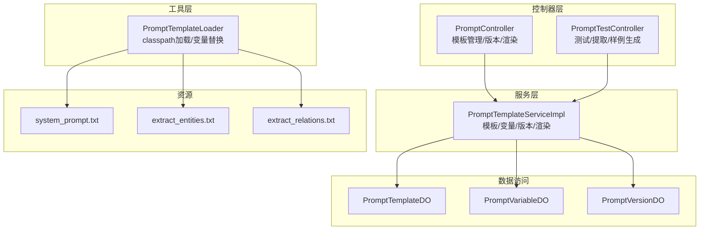
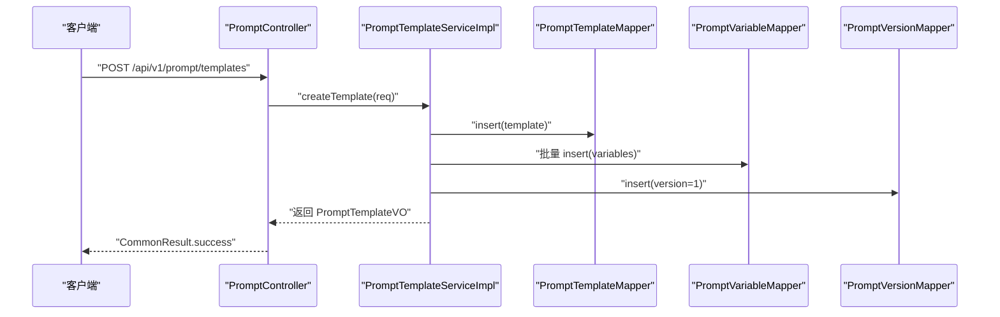
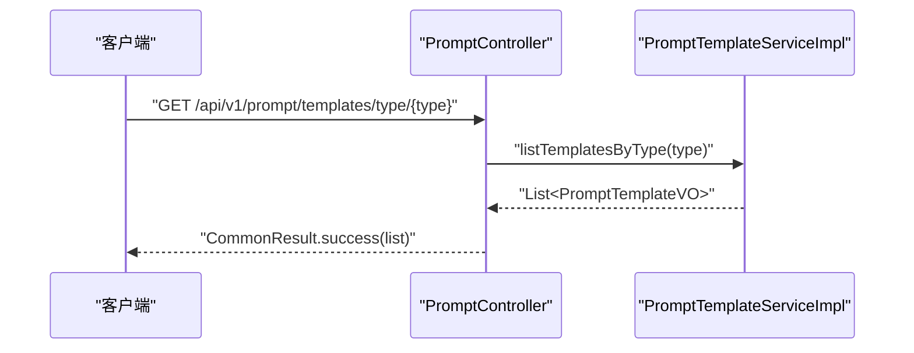
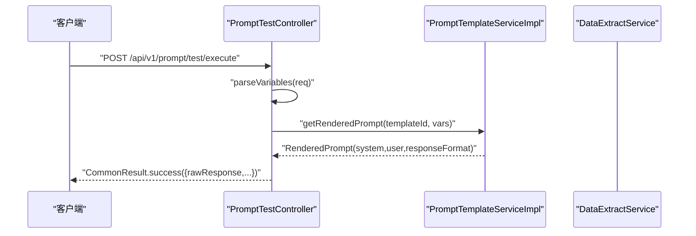
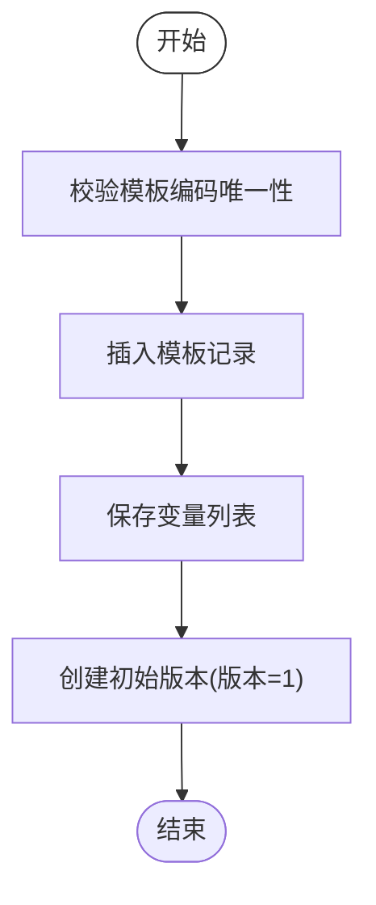
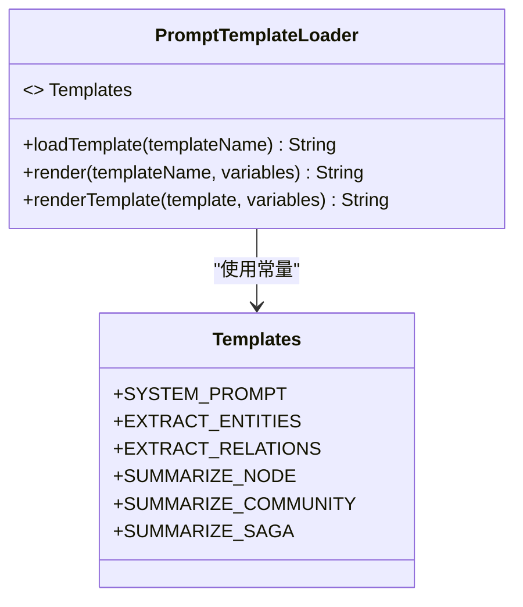
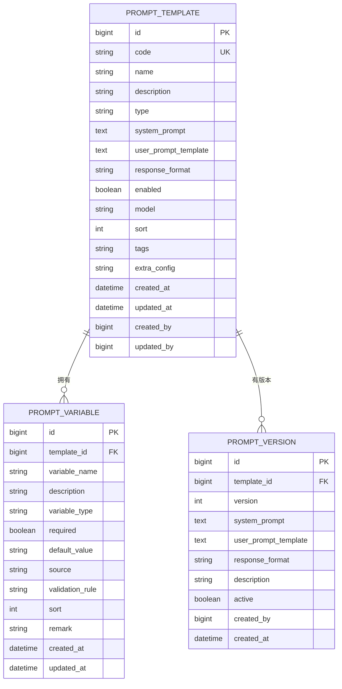
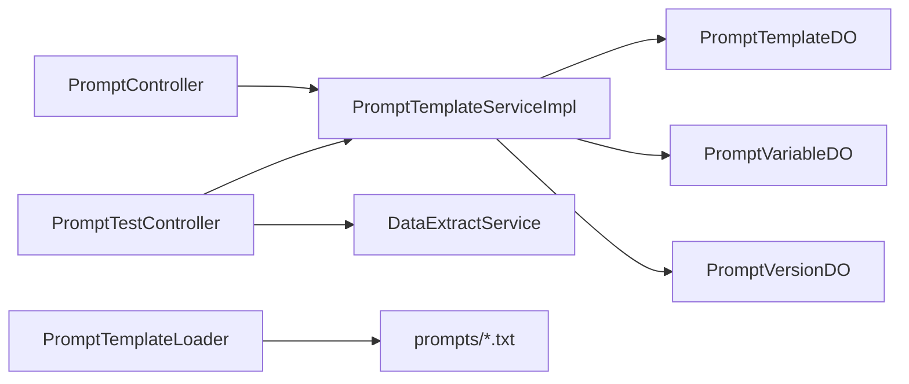

# 提示词管理

<!--<cite>
**本文引用的文件**
- [PromptController.java](file://ontograph-module-core/src/main/java/com/graphiti/module/graphiti/controller/admin/PromptController.java)
- [PromptTestController.java](file://ontograph-module-core/src/main/java/com/graphiti/module/graphiti/controller/admin/PromptTestController.java)
- [PromptTemplateServiceImpl.java](file://ontograph-module-core/src/main/java/com/graphiti/module/graphiti/service/impl/PromptTemplateServiceImpl.java)
- [PromptTemplateService.java](file://ontograph-module-core/src/main/java/com/graphiti/module/graphiti/service/PromptTemplateService.java)
- [PromptTemplateLoader.java](file://ontograph-module-core/src/main/java/com/graphiti/module/graphiti/util/PromptTemplateLoader.java)
- [PromptTemplateDO.java](file://ontograph-module-core/src/main/java/com/graphiti/module/graphiti/dal/dataobject/PromptTemplateDO.java)
- [PromptVariableDO.java](file://ontograph-module-core/src/main/java/com/graphiti/module/graphiti/dal/dataobject/PromptVariableDO.java)
- [PromptVersionDO.java](file://ontograph-module-core/src/main/java/com/graphiti/module/graphiti/dal/dataobject/PromptVersionDO.java)
- [CreatePromptTemplateReqVO.java](file://ontograph-module-core/src/main/java/com/graphiti/module/graphiti/vo/prompt/CreatePromptTemplateReqVO.java)
- [PromptTemplateVO.java](file://ontograph-module-core/src/main/java/com/graphiti/module/graphiti/vo/prompt/PromptTemplateVO.java)
- [PromptVariableVO.java](file://ontograph-module-core/src/main/java/com/graphiti/module/graphiti/vo/prompt/PromptVariableVO.java)
- [PromptTestReqVO.java](file://ontograph-module-core/src/main/java/com/graphiti/module/graphiti/vo/prompt/PromptTestReqVO.java)
- [system_prompt.txt](file://ontograph-module-core/src/main/resources/prompts/system_prompt.txt)
- [extract_entities.txt](file://ontograph-module-core/src/main/resources/prompts/extract_entities.txt)
- [extract_relations.txt](file://ontograph-module-core/src/main/resources/prompts/extract_relations.txt)
</cite>-->

## 目录
1. [简介](#简介)
2. [项目结构](#项目结构)
3. [核心组件](#核心组件)
4. [架构总览](#架构总览)
5. [详细组件分析](#详细组件分析)
6. [依赖分析](#依赖分析)
7. [性能考虑](#性能考虑)
8. [故障排查指南](#故障排查指南)
9. [结论](#结论)
10. [附录](#附录)

## 简介
本文件面向开发者与产品人员，系统化梳理提示词管理系统的实现与使用。重点覆盖提示词模板管理、提示词测试、提示词加载器三大能力；深入解析 PromptController 与 PromptTestController 的 API 设计、PromptTemplateServiceImpl 的模板管理与变量替换逻辑、PromptTemplateLoader 的模板加载机制；阐述模板设计原则、变量替换机制、版本控制策略；并给出提示词编辑器、测试运行器、模板库等工具的使用说明与最佳实践。

## 项目结构
提示词管理相关代码主要位于模块 core 的 admin 控制器层、service 层、util 工具层以及资源目录 prompts 中。核心文件包括：
- 控制器：PromptController（模板 CRUD、版本管理、渲染预览）、PromptTestController（测试执行、提取测试、样例数据生成）
- 服务：PromptTemplateServiceImpl（模板持久化、变量管理、版本管理、渲染）
- 实体与 VO：PromptTemplateDO、PromptVariableDO、PromptVersionDO、CreatePromptTemplateReqVO、PromptTemplateVO、PromptVariableVO、PromptTestReqVO
- 工具：PromptTemplateLoader（classpath 模板加载与变量替换）
- 资源：prompts 目录下的系统提示词与抽取模板

图表来源
- [PromptController.java:30-242](file://ontograph-module-core/src/main/java/com/graphiti/module/graphiti/controller/admin/PromptController.java#L30-L242)
- [PromptTestController.java:36-349](file://ontograph-module-core/src/main/java/com/graphiti/module/graphiti/controller/admin/PromptTestController.java#L36-L349)
- [PromptTemplateServiceImpl.java:34-403](file://ontograph-module-core/src/main/java/com/graphiti/module/graphiti/service/impl/PromptTemplateServiceImpl.java#L34-L403)
- [PromptTemplateLoader.java:18-87](file://ontograph-module-core/src/main/java/com/graphiti/module/graphiti/util/PromptTemplateLoader.java#L18-L87)
- [system_prompt.txt:1-11](file://ontograph-module-core/src/main/resources/prompts/system_prompt.txt#L1-L11)
- [extract_entities.txt:1-28](file://ontograph-module-core/src/main/resources/prompts/extract_entities.txt#L1-L28)
- [extract_relations.txt:1-33](file://ontograph-module-core/src/main/resources/prompts/extract_relations.txt#L1-L33)

章节来源
- [PromptController.java:30-242](file://ontograph-module-core/src/main/java/com/graphiti/module/graphiti/controller/admin/PromptController.java#L30-L242)
- [PromptTestController.java:36-349](file://ontograph-module-core/src/main/java/com/graphiti/module/graphiti/controller/admin/PromptTestController.java#L36-L349)
- [PromptTemplateServiceImpl.java:34-403](file://ontograph-module-core/src/main/java/com/graphiti/module/graphiti/service/impl/PromptTemplateServiceImpl.java#L34-L403)
- [PromptTemplateLoader.java:18-87](file://ontograph-module-core/src/main/java/com/graphiti/module/graphiti/util/PromptTemplateLoader.java#L18-L87)

## 核心组件
- PromptController：提供模板的创建、更新、删除、查询、启用/禁用、版本创建/查询/回滚，以及模板渲染预览与模板类型枚举查询。
- PromptTestController：提供模板测试执行（仅渲染）、提取测试（结合实体/关系抽取服务）、样例数据生成（构建生成提示词并解析 LLM 输出）。
- PromptTemplateServiceImpl：实现模板持久化、变量管理、版本管理、渲染（基于 {变量} 的替换）、标签序列化/反序列化。
- PromptTemplateLoader：从 classpath 加载模板文件并支持 {{变量}} 替换，提供常用模板常量。
- 数据模型：PromptTemplateDO、PromptVariableDO、PromptVersionDO；请求/响应 VO：CreatePromptTemplateReqVO、PromptTemplateVO、PromptVariableVO、PromptTestReqVO。

章节来源
- [PromptController.java:30-242](file://ontograph-module-core/src/main/java/com/graphiti/module/graphiti/controller/admin/PromptController.java#L30-L242)
- [PromptTestController.java:36-349](file://ontograph-module-core/src/main/java/com/graphiti/module/graphiti/controller/admin/PromptTestController.java#L36-L349)
- [PromptTemplateServiceImpl.java:34-403](file://ontograph-module-core/src/main/java/com/graphiti/module/graphiti/service/impl/PromptTemplateServiceImpl.java#L34-L403)
- [PromptTemplateLoader.java:18-87](file://ontograph-module-core/src/main/java/com/graphiti/module/graphiti/util/PromptTemplateLoader.java#L18-L87)
- [PromptTemplateDO.java:14-99](file://ontograph-module-core/src/main/java/com/graphiti/module/graphiti/dal/dataobject/PromptTemplateDO.java#L14-L99)
- [PromptVariableDO.java:13-79](file://ontograph-module-core/src/main/java/com/graphiti/module/graphiti/dal/dataobject/PromptVariableDO.java#L13-L79)
- [PromptVersionDO.java:13-66](file://ontograph-module-core/src/main/java/com/graphiti/module/graphiti/dal/dataobject/PromptVersionDO.java#L13-L66)
- [CreatePromptTemplateReqVO.java:15-64](file://ontograph-module-core/src/main/java/com/graphiti/module/graphiti/vo/prompt/CreatePromptTemplateReqVO.java#L15-L64)
- [PromptTemplateVO.java:15-70](file://ontograph-module-core/src/main/java/com/graphiti/module/graphiti/vo/prompt/PromptTemplateVO.java#L15-L70)
- [PromptVariableVO.java:13-50](file://ontograph-module-core/src/main/java/com/graphiti/module/graphiti/vo/prompt/PromptVariableVO.java#L13-L50)
- [PromptTestReqVO.java:12-40](file://ontograph-module-core/src/main/java/com/graphiti/module/graphiti/vo/prompt/PromptTestReqVO.java#L12-L40)

## 架构总览
提示词管理采用“控制器-服务-数据访问-资源”的分层架构。控制器负责 API 输入校验与响应封装，服务层承担业务逻辑与事务控制，数据访问层通过 MyBatis-Plus 操作数据库，工具层负责模板文件加载与简单变量替换，资源层提供默认模板。

图表来源
- [PromptController.java:42-50](file://ontograph-module-core/src/main/java/com/graphiti/module/graphiti/controller/admin/PromptController.java#L42-L50)
- [PromptTemplateServiceImpl.java:47-94](file://ontograph-module-core/src/main/java/com/graphiti/module/graphiti/service/impl/PromptTemplateServiceImpl.java#L47-L94)

## 详细组件分析

### PromptController：模板管理与测试入口
- 模板管理接口
  - 创建模板：/api/v1/prompt/templates（POST）
  - 更新模板：/api/v1/prompt/templates/{id}（PUT）
  - 删除模板：/api/v1/prompt/templates/{id}（DELETE）
  - 查询模板：/api/v1/prompt/templates/{id}（GET），/api/v1/prompt/templates/code/{code}（GET）
  - 列表查询：/api/v1/prompt/templates（GET），/api/v1/prompt/templates/type/{type}（GET）
  - 启用/禁用：/api/v1/prompt/templates/{id}/toggle（PUT）
- 版本管理接口
  - 创建版本：/api/v1/prompt/templates/{id}/versions（POST）
  - 查询版本历史：/api/v1/prompt/templates/{id}/versions（GET）
  - 回滚版本：/api/v1/prompt/templates/{id}/rollback（POST）
- 渲染预览接口
  - 渲染提示词：/api/v1/prompt/templates/{id}/render（POST），返回 systemPrompt、userPrompt、responseFormat
- 模板类型枚举：/api/v1/prompt/types（GET）

图表来源
- [PromptController.java:129-135](file://ontograph-module-core/src/main/java/com/graphiti/module/graphiti/controller/admin/PromptController.java#L129-L135)
- [PromptTemplateServiceImpl.java:189-194](file://ontograph-module-core/src/main/java/com/graphiti/module/graphiti/service/impl/PromptTemplateServiceImpl.java#L189-L194)

章节来源
- [PromptController.java:30-242](file://ontograph-module-core/src/main/java/com/graphiti/module/graphiti/controller/admin/PromptController.java#L30-L242)

### PromptTestController：测试与样例生成
- 测试执行（渲染预览）
  - POST /api/v1/prompt/test/execute：解析变量、渲染模板、返回 system+user 组合
- 提取测试
  - POST /api/v1/prompt/test/extract：构造 DataExtractReqVO，调用 DataExtractService，聚合实体/关系统计与错误信息
- 样例数据生成
  - POST /api/v1/prompt/test/generate-sample：构建生成提示词，调用 LLM（占位），解析 JSON/XML 样例

图表来源
- [PromptTestController.java:54-89](file://ontograph-module-core/src/main/java/com/graphiti/module/graphiti/controller/admin/PromptTestController.java#L54-L89)
- [PromptTemplateServiceImpl.java:229-236](file://ontograph-module-core/src/main/java/com/graphiti/module/graphiti/service/impl/PromptTemplateServiceImpl.java#L229-L236)

章节来源
- [PromptTestController.java:36-349](file://ontograph-module-core/src/main/java/com/graphiti/module/graphiti/controller/admin/PromptTestController.java#L36-L349)

### PromptTemplateServiceImpl：模板管理与渲染
- 模板管理
  - createTemplate：校验编码唯一性、写入模板、保存变量、创建初始版本
  - updateTemplate：校验编码变更唯一性、更新模板、删除旧变量并重新写入、返回最新模板
  - deleteTemplate：删除模板、级联删除变量与版本
  - toggleTemplate：切换启用状态
- 渲染机制
  - renderPrompt(templateCode, variables)：按编码查找模板并渲染
  - renderPrompt(template, variables)：直接基于模板对象渲染
  - getRenderedPrompt(templateId, variables)：按 ID 查找并渲染
  - replaceVariables：使用正则匹配 {变量名} 并替换
- 版本管理
  - createVersion：计算新版本号、将旧活跃版本置为非活跃、插入新版本
  - getVersionHistory：查询版本列表
  - rollbackToVersion：定位目标版本、回写模板字段、激活目标版本、关闭其他版本
- 辅助
  - toVO/toVariableVO：DO/VO 转换
  - 标签序列化/反序列化：JSON 字符串与 List<String> 互转

图表来源
- [PromptTemplateServiceImpl.java:47-94](file://ontograph-module-core/src/main/java/com/graphiti/module/graphiti/service/impl/PromptTemplateServiceImpl.java#L47-L94)

章节来源
- [PromptTemplateServiceImpl.java:34-403](file://ontograph-module-core/src/main/java/com/graphiti/module/graphiti/service/impl/PromptTemplateServiceImpl.java#L34-L403)

### PromptTemplateLoader：模板加载与替换
- loadTemplate：从 classpath: prompts/ 加载模板文件
- render：先加载再替换 {{key}} 变量
- renderTemplate：对模板字符串逐个替换变量
- Templates 常量：SYSTEM_PROMPT、EXTRACT_ENTITIES、EXTRACT_RELATIONS、SUMMARIZE_NODE、SUMMARIZE_COMMUNITY、SUMMARIZE_SAGA

图表来源
- [PromptTemplateLoader.java:18-87](file://ontograph-module-core/src/main/java/com/graphiti/module/graphiti/util/PromptTemplateLoader.java#L18-L87)

章节来源
- [PromptTemplateLoader.java:18-87](file://ontograph-module-core/src/main/java/com/graphiti/module/graphiti/util/PromptTemplateLoader.java#L18-L87)
- [system_prompt.txt:1-11](file://ontograph-module-core/src/main/resources/prompts/system_prompt.txt#L1-L11)
- [extract_entities.txt:1-28](file://ontograph-module-core/src/main/resources/prompts/extract_entities.txt#L1-L28)
- [extract_relations.txt:1-33](file://ontograph-module-core/src/main/resources/prompts/extract_relations.txt#L1-L33)

### 数据模型与 VO
- PromptTemplateDO：模板主表，包含 code、name、description、type、systemPrompt、userPromptTemplate、responseFormat、enabled、model、sort、tags、extraConfig 等
- PromptVariableDO：模板变量表，包含 variableName、description、variableType、required、defaultValue、source、validationRule、sort、remark 等
- PromptVersionDO：模板版本表，包含 version、systemPrompt、userPromptTemplate、responseFormat、description、active、createdBy 等
- VO 类：CreatePromptTemplateReqVO、PromptTemplateVO、PromptVariableVO、PromptTestReqVO，用于 API 请求/响应

图表来源
- [PromptTemplateDO.java:14-99](file://ontograph-module-core/src/main/java/com/graphiti/module/graphiti/dal/dataobject/PromptTemplateDO.java#L14-L99)
- [PromptVariableDO.java:13-79](file://ontograph-module-core/src/main/java/com/graphiti/module/graphiti/dal/dataobject/PromptVariableDO.java#L13-L79)
- [PromptVersionDO.java:13-66](file://ontograph-module-core/src/main/java/com/graphiti/module/graphiti/dal/dataobject/PromptVersionDO.java#L13-L66)

章节来源
- [PromptTemplateDO.java:14-99](file://ontograph-module-core/src/main/java/com/graphiti/module/graphiti/dal/dataobject/PromptTemplateDO.java#L14-L99)
- [PromptVariableDO.java:13-79](file://ontograph-module-core/src/main/java/com/graphiti/module/graphiti/dal/dataobject/PromptVariableDO.java#L13-L79)
- [PromptVersionDO.java:13-66](file://ontograph-module-core/src/main/java/com/graphiti/module/graphiti/dal/dataobject/PromptVersionDO.java#L13-L66)
- [CreatePromptTemplateReqVO.java:15-64](file://ontograph-module-core/src/main/java/com/graphiti/module/graphiti/vo/prompt/CreatePromptTemplateReqVO.java#L15-L64)
- [PromptTemplateVO.java:15-70](file://ontograph-module-core/src/main/java/com/graphiti/module/graphiti/vo/prompt/PromptTemplateVO.java#L15-L70)
- [PromptVariableVO.java:13-50](file://ontograph-module-core/src/main/java/com/graphiti/module/graphiti/vo/prompt/PromptVariableVO.java#L13-L50)
- [PromptTestReqVO.java:12-40](file://ontograph-module-core/src/main/java/com/graphiti/module/graphiti/vo/prompt/PromptTestReqVO.java#L12-L40)

## 依赖分析
- 控制器依赖服务接口，服务实现依赖 Mapper 与 ObjectMapper
- PromptTestController 同时依赖 PromptTemplateService 与 DataExtractService
- PromptTemplateLoader 依赖 Spring 的 ClassPathResource 与 IO 工具
- 数据模型之间通过外键关联（模板-变量、模板-版本）

图表来源
- [PromptController.java:30-242](file://ontograph-module-core/src/main/java/com/graphiti/module/graphiti/controller/admin/PromptController.java#L30-L242)
- [PromptTestController.java:36-349](file://ontograph-module-core/src/main/java/com/graphiti/module/graphiti/controller/admin/PromptTestController.java#L36-L349)
- [PromptTemplateServiceImpl.java:34-403](file://ontograph-module-core/src/main/java/com/graphiti/module/graphiti/service/impl/PromptTemplateServiceImpl.java#L34-L403)
- [PromptTemplateLoader.java:18-87](file://ontograph-module-core/src/main/java/com/graphiti/module/graphiti/util/PromptTemplateLoader.java#L18-L87)

章节来源
- [PromptController.java:30-242](file://ontograph-module-core/src/main/java/com/graphiti/module/graphiti/controller/admin/PromptController.java#L30-L242)
- [PromptTestController.java:36-349](file://ontograph-module-core/src/main/java/com/graphiti/module/graphiti/controller/admin/PromptTestController.java#L36-L349)
- [PromptTemplateServiceImpl.java:34-403](file://ontograph-module-core/src/main/java/com/graphiti/module/graphiti/service/impl/PromptTemplateServiceImpl.java#L34-L403)
- [PromptTemplateLoader.java:18-87](file://ontograph-module-core/src/main/java/com/graphiti/module/graphiti/util/PromptTemplateLoader.java#L18-L87)

## 性能考虑
- 模板渲染
  - 正则替换 replaceVariables 在大模板/多变量场景下需关注时间复杂度；建议限制变量规模、避免重复渲染相同模板
- 版本管理
  - 回滚时会更新模板主表并更新多个版本记录，建议在高并发场景下配合事务与索引优化
- 分页与过滤
  - 列表查询建议结合数据库分页与索引（如 type、enabled、sort），避免一次性加载过多模板
- 缓存策略
  - 对热点模板与变量可引入缓存（如 Redis），减少数据库压力；注意版本回滚后的缓存失效

## 故障排查指南
- 模板不存在
  - 控制器与服务在查询/渲染时均可能抛出“模板不存在”异常，需确认模板 ID 或编码正确
- 编码冲突
  - 创建/更新模板时若编码重复会抛出异常，需确保全局唯一
- 变量缺失
  - 渲染时未提供的变量将被忽略；建议在前端或测试阶段校验必填变量
- 提取失败
  - 提取测试返回错误信息字符串，可据此定位输入格式、变量或 LLM 返回问题
- 样例生成解析失败
  - 解析 JSON/XML 样例失败时会降级输出空集合，需检查 LLM 输出格式与解析逻辑

章节来源
- [PromptController.java:88-109](file://ontograph-module-core/src/main/java/com/graphiti/module/graphiti/controller/admin/PromptController.java#L88-L109)
- [PromptTemplateServiceImpl.java:214-236](file://ontograph-module-core/src/main/java/com/graphiti/module/graphiti/service/impl/PromptTemplateServiceImpl.java#L214-L236)
- [PromptTestController.java:79-83](file://ontograph-module-core/src/main/java/com/graphiti/module/graphiti/controller/admin/PromptTestController.java#L79-L83)

## 结论
提示词管理系统以清晰的分层架构实现了模板全生命周期管理、变量与版本控制、渲染与测试能力。通过 PromptController 与 PromptTestController 提供了完善的 API 与工具链，PromptTemplateServiceImpl 保证了业务逻辑的健壮性，PromptTemplateLoader 则提供了便捷的模板加载与替换能力。建议在生产环境中结合缓存、索引与事务优化，持续完善模板设计与测试策略。

## 附录

### API 设计要点与最佳实践
- 模板设计原则
  - 明确 type 与 tags，便于检索与分类
  - 使用 {变量} 作为占位符，变量来源与类型清晰标注
  - responseFormat 明确 JSON Schema 或格式约束
- 变量替换机制
  - 优先使用 PromptTemplateServiceImpl 的 {变量} 替换；classpath 模板使用 {{变量}} 替换
  - 必填变量应在变量定义中标记 required，并提供合理默认值
- 版本控制
  - 每次重要修改创建新版本，保留历史快照，支持快速回滚
  - 回滚前建议备份当前模板，回滚后通知使用者
- 测试策略
  - 使用 PromptTestController 的 /execute 与 /extract 快速验证模板效果
  - 使用 /generate-sample 生成样例数据，辅助前端与集成测试
- 模板库与工具
  - system_prompt.txt、extract_entities.txt、extract_relations.txt 作为系统默认模板参考
  - 建议在前端提供提示词编辑器，支持变量可视化与实时渲染预览

章节来源
- [PromptTemplateServiceImpl.java:241-260](file://ontograph-module-core/src/main/java/com/graphiti/module/graphiti/service/impl/PromptTemplateServiceImpl.java#L241-L260)
- [PromptTemplateLoader.java:63-73](file://ontograph-module-core/src/main/java/com/graphiti/module/graphiti/util/PromptTemplateLoader.java#L63-L73)
- [system_prompt.txt:1-11](file://ontograph-module-core/src/main/resources/prompts/system_prompt.txt#L1-L11)
- [extract_entities.txt:1-28](file://ontograph-module-core/src/main/resources/prompts/extract_entities.txt#L1-L28)
- [extract_relations.txt:1-33](file://ontograph-module-core/src/main/resources/prompts/extract_relations.txt#L1-L33)