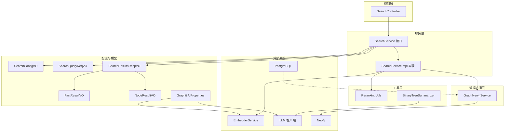
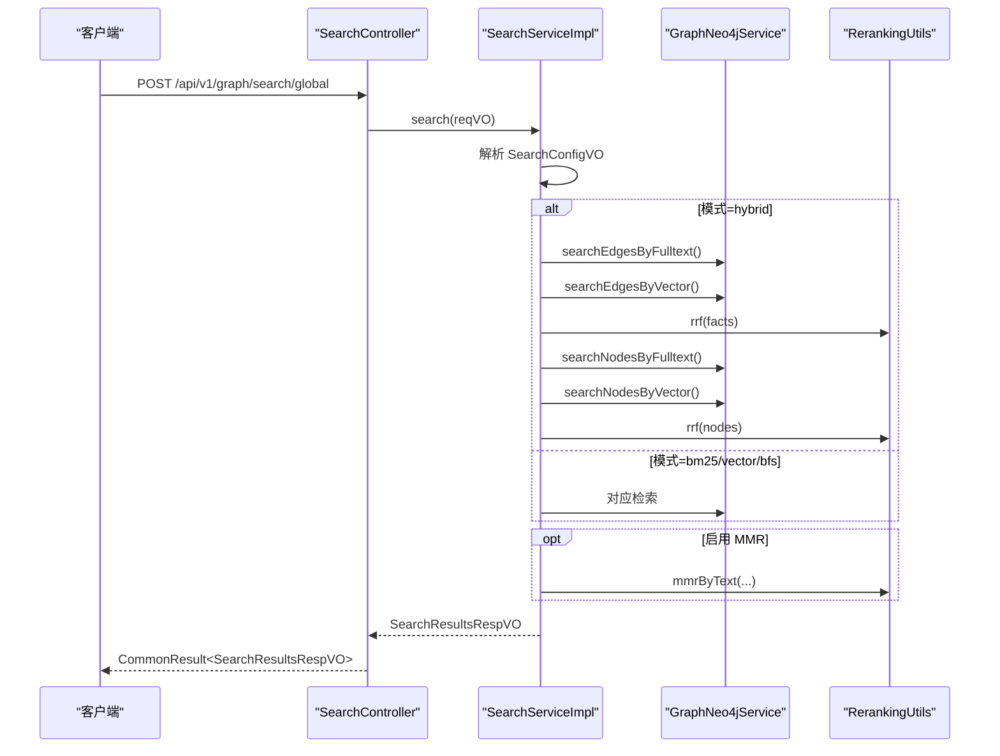
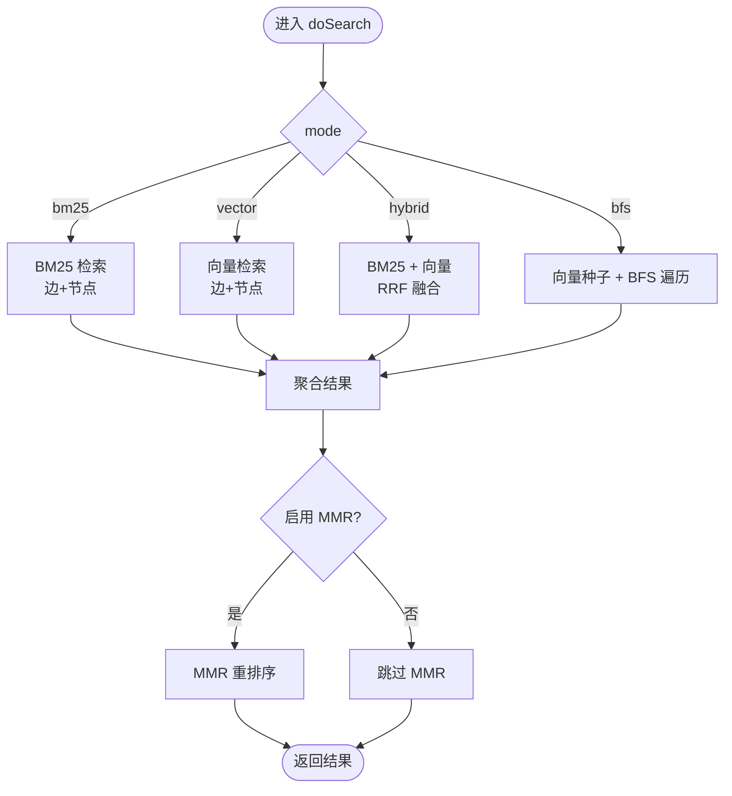
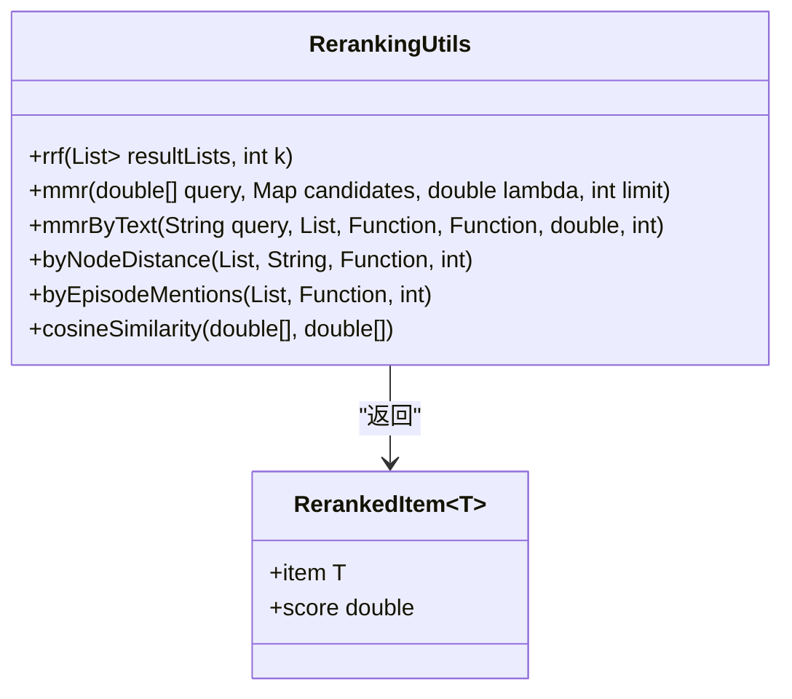
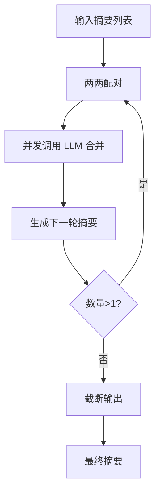
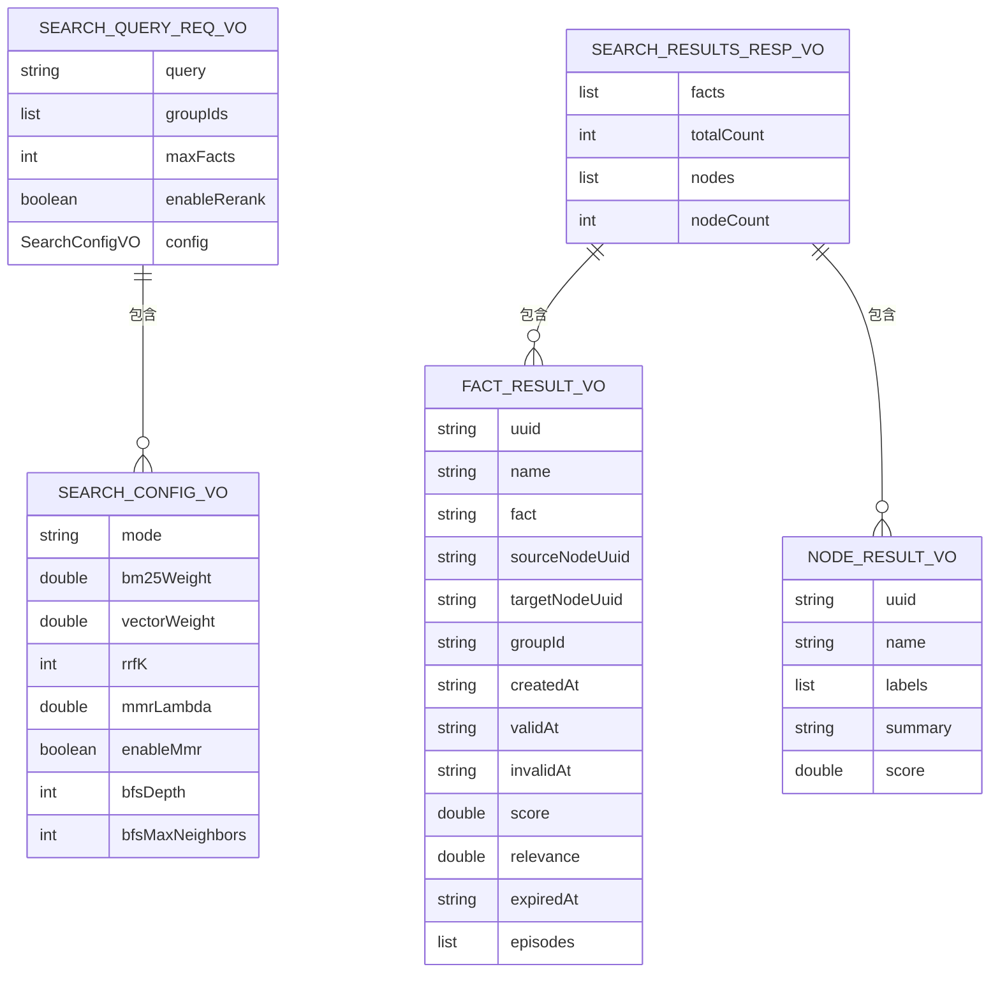
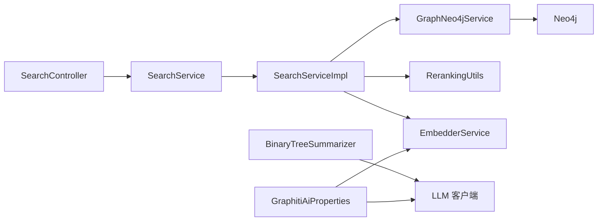
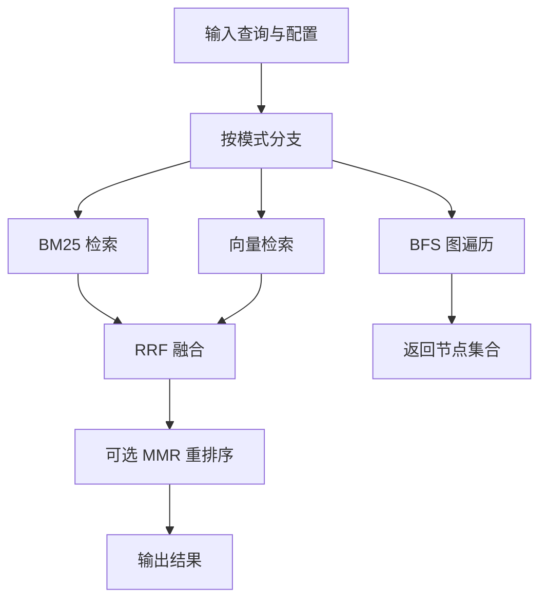

# 搜索引擎

<!--<cite>
**本文档引用的文件**
- [SearchController.java](file://graphiti-module-core/src/main/java/com/graphiti/module/graphiti/controller/admin/SearchController.java)
- [SearchServiceImpl.java](file://graphiti-module-core/src/main/java/com/graphiti/module/graphiti/service/impl/SearchServiceImpl.java)
- [SearchService.java](file://graphiti-module-core/src/main/java/com/graphiti/module/graphiti/service/SearchService.java)
- [RerankingUtils.java](file://graphiti-module-core/src/main/java/com/graphiti/module/graphiti/util/RerankingUtils.java)
- [BinaryTreeSummarizer.java](file://graphiti-module-core/src/main/java/com/graphiti/module/graphiti/util/BinaryTreeSummarizer.java)
- [GraphNeo4jService.java](file://graphiti-module-core/src/main/java/com/graphiti/module/graphiti/service/GraphNeo4jService.java)
- [EmbedderService.java](file://graphiti-module-core/src/main/java/com/graphiti/module/graphiti/service/EmbedderService.java)
- [SearchQueryReqVO.java](file://graphiti-module-core/src/main/java/com/graphiti/module/graphiti/vo/search/SearchQueryReqVO.java)
- [SearchConfigVO.java](file://graphiti-module-core/src/main/java/com/graphiti/module/graphiti/vo/search/SearchConfigVO.java)
- [SearchResultsRespVO.java](file://graphiti-module-core/src/main/java/com/graphiti/module/graphiti/vo/search/SearchResultsRespVO.java)
- [FactResultVO.java](file://graphiti-module-core/src/main/java/com/graphiti/module/graphiti/vo/search/FactResultVO.java)
- [NodeResultVO.java](file://graphiti-module-core/src/main/java/com/graphiti/module/graphiti/vo/search/NodeResultVO.java)
- [GraphitiAiProperties.java](file://graphiti-module-core/src/main/java/com/graphiti/module/graphiti/config/GraphitiAiProperties.java)
- [schema.sql](file://sql/postgresql/schema.sql)
- [init.cypher](file://sql/neo4j/init.cypher)
- [vector-index-init.cypher](file://sql/neo4j/vector-index-init.cypher)
</cite>-->

## 目录
1. [简介](#简介)
2. [项目结构](#项目结构)
3. [核心组件](#核心组件)
4. [架构总览](#架构总览)
5. [详细组件分析](#详细组件分析)
6. [依赖分析](#依赖分析)
7. [性能考虑](#性能考虑)
8. [故障排查指南](#故障排查指南)
9. [结论](#结论)
10. [附录](#附录)

## 简介
本项目提供一套完整的知识图谱搜索引擎，支持混合检索（BM25 全文 + 向量相似度）、语义搜索（向量）、BFS 图遍历、RRF 融合与 MMR 重排序，并提供记忆检索、事实与节点结果聚合、以及基于 LLM 的摘要生成能力。本文档面向开发者，深入解析 SearchController 的 API 设计、SearchServiceImpl 的混合搜索逻辑、RerankingUtils 的重排序算法、BinaryTreeSummarizer 的摘要生成策略，同时给出多数据源融合策略、搜索配置优化、性能调优建议与实际案例。

## 项目结构
围绕搜索功能的关键模块与文件如下：
- 控制层：SearchController 提供全局搜索、图谱搜索、便捷检索接口（混合/语义/BFS）与记忆检索
- 服务层：SearchService 接口与 SearchServiceImpl 实现，负责混合检索、BM25、向量、BFS、RRF、MMR、节点距离与提及次数重排序
- 工具层：RerankingUtils 提供 RRF、MMR、节点距离与提及次数重排序；BinaryTreeSummarizer 提供二叉树合并摘要生成
- 数据访问层：GraphNeo4jService 封装 Neo4j 的全文与向量检索、节点/边查询、向量索引初始化
- 配置与模型：SearchQueryReqVO、SearchConfigVO、SearchResultsRespVO、FactResultVO、NodeResultVO；GraphitiAiProperties 提供 AI 供应商配置
- 数据库与索引：PostgreSQL schema 与 Neo4j 初始化脚本（约束、索引、全文与向量索引）

**图表来源**
- [SearchController.java:23-137](file://graphiti-module-core/src/main/java/com/graphiti/module/graphiti/controller/admin/SearchController.java#L23-L137)
- [SearchServiceImpl.java:21-519](file://graphiti-module-core/src/main/java/com/graphiti/module/graphiti/service/impl/SearchServiceImpl.java#L21-L519)
- [RerankingUtils.java:19-385](file://graphiti-module-core/src/main/java/com/graphiti/module/graphiti/util/RerankingUtils.java#L19-L385)
- [BinaryTreeSummarizer.java:30-278](file://graphiti-module-core/src/main/java/com/graphiti/module/graphiti/util/BinaryTreeSummarizer.java#L30-L278)
- [GraphNeo4jService.java:21-791](file://graphiti-module-core/src/main/java/com/graphiti/module/graphiti/service/GraphNeo4jService.java#L21-L791)
- [SearchQueryReqVO.java:14-32](file://graphiti-module-core/src/main/java/com/graphiti/module/graphiti/vo/search/SearchQueryReqVO.java#L14-L32)
- [SearchConfigVO.java:13-39](file://graphiti-module-core/src/main/java/com/graphiti/module/graphiti/vo/search/SearchConfigVO.java#L13-L39)
- [SearchResultsRespVO.java:13-27](file://graphiti-module-core/src/main/java/com/graphiti/module/graphiti/vo/search/SearchResultsRespVO.java#L13-L27)
- [FactResultVO.java:13-58](file://graphiti-module-core/src/main/java/com/graphiti/module/graphiti/vo/search/FactResultVO.java#L13-L58)
- [NodeResultVO.java:13-30](file://graphiti-module-core/src/main/java/com/graphiti/module/graphiti/vo/search/NodeResultVO.java#L13-L30)
- [GraphitiAiProperties.java:16-134](file://graphiti-module-core/src/main/java/com/graphiti/module/graphiti/config/GraphitiAiProperties.java#L16-L134)

**章节来源**
- [SearchController.java:23-137](file://graphiti-module-core/src/main/java/com/graphiti/module/graphiti/controller/admin/SearchController.java#L23-L137)
- [SearchServiceImpl.java:21-519](file://graphiti-module-core/src/main/java/com/graphiti/module/graphiti/service/impl/SearchServiceImpl.java#L21-L519)
- [GraphNeo4jService.java:608-791](file://graphiti-module-core/src/main/java/com/graphiti/module/graphiti/service/GraphNeo4jService.java#L608-L791)

## 核心组件
- SearchController：提供全局搜索、图谱搜索、记忆检索、检索入口与便捷接口（混合/语义/BFS），统一返回 CommonResult 包裹的 VO
- SearchService/SearchServiceImpl：实现混合检索（BM25 + 向量 + RRF 融合 + MMR 重排序）、BFS 图遍历、节点距离与提及次数重排序、记忆构建
- RerankingUtils：提供 RRF、MMR、节点距离与提及次数重排序的通用工具
- BinaryTreeSummarizer：二叉树合并策略的摘要生成器，支持上下文增强与并发控制
- GraphNeo4jService：封装 Neo4j 的全文检索、向量检索、节点/边查询、向量索引初始化
- 配置与模型：SearchConfigVO 控制检索模式与参数；SearchQueryReqVO/VOs 定义请求与响应结构
- GraphitiAiProperties：统一管理 LLM/Embedding/Rerank 供应商配置

**章节来源**
- [SearchController.java:33-137](file://graphiti-module-core/src/main/java/com/graphiti/module/graphiti/controller/admin/SearchController.java#L33-L137)
- [SearchService.java:15-53](file://graphiti-module-core/src/main/java/com/graphiti/module/graphiti/service/SearchService.java#L15-L53)
- [SearchServiceImpl.java:26-148](file://graphiti-module-core/src/main/java/com/graphiti/module/graphiti/service/impl/SearchServiceImpl.java#L26-L148)
- [RerankingUtils.java:32-314](file://graphiti-module-core/src/main/java/com/graphiti/module/graphiti/util/RerankingUtils.java#L32-L314)
- [BinaryTreeSummarizer.java:46-141](file://graphiti-module-core/src/main/java/com/graphiti/module/graphiti/util/BinaryTreeSummarizer.java#L46-L141)
- [GraphNeo4jService.java:617-762](file://graphiti-module-core/src/main/java/com/graphiti/module/graphiti/service/GraphNeo4jService.java#L617-L762)
- [SearchConfigVO.java:13-39](file://graphiti-module-core/src/main/java/com/graphiti/module/graphiti/vo/search/SearchConfigVO.java#L13-L39)
- [SearchQueryReqVO.java:14-32](file://graphiti-module-core/src/main/java/com/graphiti/module/graphiti/vo/search/SearchQueryReqVO.java#L14-L32)
- [GraphitiAiProperties.java:16-134](file://graphiti-module-core/src/main/java/com/graphiti/module/graphiti/config/GraphitiAiProperties.java#L16-L134)

## 架构总览
搜索系统采用“控制层-服务层-工具层-数据访问层”的分层架构，结合 Neo4j 的全文与向量索引，实现高性能的混合检索与图遍历。对外通过 SearchController 暴露 REST API，内部通过 SearchServiceImpl 组织检索流程，利用 GraphNeo4jService 执行具体查询，借助 RerankingUtils 完成多路结果融合与重排序，最终以 VO 形式返回。

**图表来源**
- [SearchController.java:33-54](file://graphiti-module-core/src/main/java/com/graphiti/module/graphiti/controller/admin/SearchController.java#L33-L54)
- [SearchServiceImpl.java:94-148](file://graphiti-module-core/src/main/java/com/graphiti/module/graphiti/service/impl/SearchServiceImpl.java#L94-L148)
- [GraphNeo4jService.java:617-762](file://graphiti-module-core/src/main/java/com/graphiti/module/graphiti/service/GraphNeo4jService.java#L617-L762)
- [RerankingUtils.java:188-254](file://graphiti-module-core/src/main/java/com/graphiti/module/graphiti/util/RerankingUtils.java#L188-L254)

## 详细组件分析

### SearchController API 设计
- 全局搜索：POST /api/v1/graph/search/global，支持多图谱（groupIds）与最大返回数
- 图谱搜索：POST /api/v1/graph/search/graph/{graphId}，限定在指定图谱内检索
- 记忆检索：POST /api/v1/graph/search/memory，基于对话历史重建上下文
- 检索入口：POST /api/v1/graph/search/retrieve/search，独立检索入口
- 实体边检索：GET /api/v1/graph/search/retrieve/entity-edge/{uuid}
- 最近 Episode：GET /api/v1/graph/search/retrieve/episodes/{graphId}?last_n
- 便捷接口：
  - 混合检索：POST /api/v1/graph/search/hybrid/{graphId}?query&limit
  - 语义搜索：POST /api/v1/graph/search/semantic/{graphId}?query&limit
  - BFS 搜索：POST /api/v1/graph/search/bfs/{graphId}?query&depth&limit

这些接口均通过 CommonResult 包裹响应，便于前端统一处理。

**章节来源**
- [SearchController.java:33-137](file://graphiti-module-core/src/main/java/com/graphiti/module/graphiti/controller/admin/SearchController.java#L33-L137)

### SearchServiceImpl 混合搜索逻辑
- doSearch：根据 SearchConfigVO 的 mode 决定检索分支（bm25/vector/hybrid/bfs）
- BM25：GraphNeo4jService.searchEdgesByFulltext 与 searchNodesByFulltext
- 向量：EmbedderService.embed 生成查询向量，GraphNeo4jService.searchEdgesByVector 与 searchNodesByVector
- RRF 融合：fuseByRrf/fuseNodesByRrf，基于倒数排名融合，去重合并后按分数排序
- MMR 重排序：rerankByMmr，基于 RerankingUtils.mmrByText，平衡相关性与多样性
- BFS 图遍历：searchNodesByBfs，先向量搜索种子节点，再按深度与邻居上限进行广度优先遍历
- 节点距离重排序：rerankByNodeDistance，基于 BFS 计算中心节点到候选节点的距离
- 提及次数重排序：rerankByEpisodeMentions，统计 Episode 中 MENTIONS 关系的出现次数

**图表来源**
- [SearchServiceImpl.java:94-148](file://graphiti-module-core/src/main/java/com/graphiti/module/graphiti/service/impl/SearchServiceImpl.java#L94-L148)
- [SearchServiceImpl.java:227-284](file://graphiti-module-core/src/main/java/com/graphiti/module/graphiti/service/impl/SearchServiceImpl.java#L227-L284)
- [SearchServiceImpl.java:288-308](file://graphiti-module-core/src/main/java/com/graphiti/module/graphiti/service/impl/SearchServiceImpl.java#L288-L308)
- [SearchServiceImpl.java:178-223](file://graphiti-module-core/src/main/java/com/graphiti/module/graphiti/service/impl/SearchServiceImpl.java#L178-L223)

**章节来源**
- [SearchServiceImpl.java:94-308](file://graphiti-module-core/src/main/java/com/graphiti/module/graphiti/service/impl/SearchServiceImpl.java#L94-L308)

### RerankingUtils 重排序算法
- RRF（Reciprocal Rank Fusion）：对多个候选列表进行倒数排名融合，k 默认 60
- MMR（Maximal Marginal Relevance）：平衡相关性与多样性，lambda 控制权重
- 节点距离重排序：基于图距离评分
- 提及次数重排序：统计 Episode 中 MENTIONS 关系的出现次数

**图表来源**
- [RerankingUtils.java:47-86](file://graphiti-module-core/src/main/java/com/graphiti/module/graphiti/util/RerankingUtils.java#L47-L86)
- [RerankingUtils.java:106-174](file://graphiti-module-core/src/main/java/com/graphiti/module/graphiti/util/RerankingUtils.java#L106-L174)
- [RerankingUtils.java:188-254](file://graphiti-module-core/src/main/java/com/graphiti/module/graphiti/util/RerankingUtils.java#L188-L254)
- [RerankingUtils.java:270-286](file://graphiti-module-core/src/main/java/com/graphiti/module/graphiti/util/RerankingUtils.java#L270-L286)
- [RerankingUtils.java:301-314](file://graphiti-module-core/src/main/java/com/graphiti/module/graphiti/util/RerankingUtils.java#L301-L314)
- [RerankingUtils.java:371-384](file://graphiti-module-core/src/main/java/com/graphiti/module/graphiti/util/RerankingUtils.java#L371-L384)

**章节来源**
- [RerankingUtils.java:32-314](file://graphiti-module-core/src/main/java/com/graphiti/module/graphiti/util/RerankingUtils.java#L32-L314)

### BinaryTreeSummarizer 摘要生成
- 二叉树合并策略：两两配对摘要，异步并发调用 LLM 合并，直至只剩一个摘要
- 支持带上下文的合并与社区名称生成
- 截断策略：在句号或空格处安全截断，避免长摘要

**图表来源**
- [BinaryTreeSummarizer.java:52-94](file://graphiti-module-core/src/main/java/com/graphiti/module/graphiti/util/BinaryTreeSummarizer.java#L52-L94)
- [BinaryTreeSummarizer.java:103-141](file://graphiti-module-core/src/main/java/com/graphiti/module/graphiti/util/BinaryTreeSummarizer.java#L103-L141)
- [BinaryTreeSummarizer.java:248-270](file://graphiti-module-core/src/main/java/com/graphiti/module/graphiti/util/BinaryTreeSummarizer.java#L248-L270)

**章节来源**
- [BinaryTreeSummarizer.java:46-278](file://graphiti-module-core/src/main/java/com/graphiti/module/graphiti/util/BinaryTreeSummarizer.java#L46-L278)

### 数据模型与 VO
- SearchQueryReqVO：查询文本、限定图谱、最大返回数、是否启用重排序、配置对象
- SearchConfigVO：检索模式（bm25/vector/hybrid/bfs）、BM25/向量权重、RRF k、MMR lambda、是否启用 MMR、BFS 深度与邻居上限
- SearchResultsRespVO：事实列表、总数、节点列表、节点数
- FactResultVO：边 UUID、名称、事实描述、源/目标节点 UUID、所属图谱、时间范围、得分、相关性、过期时间、关联 Episode
- NodeResultVO：节点 UUID、名称、标签、摘要、得分

**图表来源**
- [SearchQueryReqVO.java:14-32](file://graphiti-module-core/src/main/java/com/graphiti/module/graphiti/vo/search/SearchQueryReqVO.java#L14-L32)
- [SearchConfigVO.java:13-39](file://graphiti-module-core/src/main/java/com/graphiti/module/graphiti/vo/search/SearchConfigVO.java#L13-L39)
- [SearchResultsRespVO.java:13-27](file://graphiti-module-core/src/main/java/com/graphiti/module/graphiti/vo/search/SearchResultsRespVO.java#L13-L27)
- [FactResultVO.java:13-58](file://graphiti-module-core/src/main/java/com/graphiti/module/graphiti/vo/search/FactResultVO.java#L13-L58)
- [NodeResultVO.java:13-30](file://graphiti-module-core/src/main/java/com/graphiti/module/graphiti/vo/search/NodeResultVO.java#L13-L30)

**章节来源**
- [SearchQueryReqVO.java:14-32](file://graphiti-module-core/src/main/java/com/graphiti/module/graphiti/vo/search/SearchQueryReqVO.java#L14-L32)
- [SearchConfigVO.java:13-39](file://graphiti-module-core/src/main/java/com/graphiti/module/graphiti/vo/search/SearchConfigVO.java#L13-L39)
- [SearchResultsRespVO.java:13-27](file://graphiti-module-core/src/main/java/com/graphiti/module/graphiti/vo/search/SearchResultsRespVO.java#L13-L27)
- [FactResultVO.java:13-58](file://graphiti-module-core/src/main/java/com/graphiti/module/graphiti/vo/search/FactResultVO.java#L13-L58)
- [NodeResultVO.java:13-30](file://graphiti-module-core/src/main/java/com/graphiti/module/graphiti/vo/search/NodeResultVO.java#L13-L30)

### 搜索配置与优化
- 检索模式与参数
  - mode：bm25/vector/hybrid/bfs
  - rrfK：RRF 融合参数，默认 60
  - mmrLambda：MMR 平衡参数，默认 0.5
  - enableMmr：是否启用 MMR
  - bfsDepth/bfsMaxNeighbors：BFS 遍历深度与每节点最大邻居数
- 向量索引与全文索引
  - Neo4j：节点/边向量索引、节点/边全文索引
  - PostgreSQL：搜索历史、系统配置等表结构
- AI 供应商配置
  - GraphitiAiProperties：统一管理 LLM/Embedding/Rerank 供应商与模型参数

**章节来源**
- [SearchConfigVO.java:13-39](file://graphiti-module-core/src/main/java/com/graphiti/module/graphiti/vo/search/SearchConfigVO.java#L13-L39)
- [GraphitiAiProperties.java:16-134](file://graphiti-module-core/src/main/java/com/graphiti/module/graphiti/config/GraphitiAiProperties.java#L16-L134)
- [vector-index-init.cypher:4-26](file://sql/neo4j/vector-index-init.cypher#L4-L26)
- [init.cypher:3-32](file://sql/neo4j/init.cypher#L3-L32)
- [schema.sql:302-318](file://sql/postgresql/schema.sql#L302-L318)

## 依赖分析
- SearchController 依赖 SearchService
- SearchServiceImpl 依赖 GraphNeo4jService、EmbedderService、RerankingUtils
- GraphNeo4jService 依赖 Neo4j Driver 与配置
- BinaryTreeSummarizer 依赖 LLM 客户端服务
- SearchService/SearchServiceImpl 依赖 VO 与配置对象

**图表来源**
- [SearchController.java:30-31](file://graphiti-module-core/src/main/java/com/graphiti/module/graphiti/controller/admin/SearchController.java#L30-L31)
- [SearchServiceImpl.java:23-24](file://graphiti-module-core/src/main/java/com/graphiti/module/graphiti/service/impl/SearchServiceImpl.java#L23-L24)
- [GraphNeo4jService.java:23-24](file://graphiti-module-core/src/main/java/com/graphiti/module/graphiti/service/GraphNeo4jService.java#L23-L24)
- [BinaryTreeSummarizer.java:38-43](file://graphiti-module-core/src/main/java/com/graphiti/module/graphiti/util/BinaryTreeSummarizer.java#L38-L43)
- [GraphitiAiProperties.java:20-31](file://graphiti-module-core/src/main/java/com/graphiti/module/graphiti/config/GraphitiAiProperties.java#L20-L31)

**章节来源**
- [SearchController.java:30-31](file://graphiti-module-core/src/main/java/com/graphiti/module/graphiti/controller/admin/SearchController.java#L30-L31)
- [SearchServiceImpl.java:23-24](file://graphiti-module-core/src/main/java/com/graphiti/module/graphiti/service/impl/SearchServiceImpl.java#L23-L24)
- [GraphNeo4jService.java:23-24](file://graphiti-module-core/src/main/java/com/graphiti/module/graphiti/service/GraphNeo4jService.java#L23-L24)
- [BinaryTreeSummarizer.java:38-43](file://graphiti-module-core/src/main/java/com/graphiti/module/graphiti/util/BinaryTreeSummarizer.java#L38-L43)
- [GraphitiAiProperties.java:20-31](file://graphiti-module-core/src/main/java/com/graphiti/module/graphiti/config/GraphitiAiProperties.java#L20-L31)

## 性能考虑
- 索引与向量维度
  - Neo4j 节点/边向量索引需与嵌入维度一致，相似度函数推荐余弦
  - 全文索引用于 BM25 检索，提升关键词匹配效率
- 并发与批处理
  - RRF/MergePair 使用固定并发线程池，避免过度并发导致资源争用
  - 向量检索与全文检索可并行执行，再由 RRF 融合
- 重排序成本
  - MMR 与节点距离计算为二次复杂度，建议限制 maxFacts 与 BFS 邻居数
- 缓存与预热
  - 向量索引初始化应在应用启动时完成，避免首次查询延迟
- 数据库与图数据库分离
  - PostgreSQL 存储系统配置与搜索历史，Neo4j 负责大规模图检索

[本节为通用性能建议，不直接分析具体文件]

## 故障排查指南
- 全文/向量索引缺失
  - 现象：BM25 或向量检索返回空或警告
  - 处理：执行 Neo4j 初始化脚本创建全文与向量索引
- 向量维度不匹配
  - 现象：向量检索异常或报错
  - 处理：确保 GraphNeo4jService.initVectorIndexes 的维度与嵌入模型一致
- MMR 重排序无效
  - 现象：结果未按 MMR 重新排序
  - 处理：检查 SearchConfigVO.enableMmr 与 mmrLambda 是否正确设置
- BFS 遍历结果过少
  - 现象：BFS 结果为空或稀疏
  - 处理：增大 bfsMaxNeighbors 与 bfsDepth，或调整种子节点数量
- 记忆检索为空
  - 现象：getMemory 返回空上下文
  - 处理：检查消息历史是否包含非 system 角色消息，确认 hybrid 模式已启用

**章节来源**
- [GraphNeo4jService.java:768-791](file://graphiti-module-core/src/main/java/com/graphiti/module/graphiti/service/GraphNeo4jService.java#L768-L791)
- [vector-index-init.cypher:4-18](file://sql/neo4j/vector-index-init.cypher#L4-L18)
- [init.cypher:19-32](file://sql/neo4j/init.cypher#L19-L32)
- [SearchServiceImpl.java:62-75](file://graphiti-module-core/src/main/java/com/graphiti/module/graphiti/service/impl/SearchServiceImpl.java#L62-L75)

## 结论
本搜索引擎通过混合检索（BM25 + 向量）、RRF 融合与 MMR 重排序，结合 BFS 图遍历与记忆检索，实现了高效且可定制的知识图谱搜索体验。配合完善的索引策略与并发优化，能够在大规模图数据上保持良好性能。开发者可通过 SearchConfigVO 与 GraphitiAiProperties 精细调参，满足不同场景需求。

[本节为总结性内容，不直接分析具体文件]

## 附录

### 搜索算法流程图（混合检索）

**图表来源**
- [SearchServiceImpl.java:94-148](file://graphiti-module-core/src/main/java/com/graphiti/module/graphiti/service/impl/SearchServiceImpl.java#L94-L148)
- [SearchServiceImpl.java:227-284](file://graphiti-module-core/src/main/java/com/graphiti/module/graphiti/service/impl/SearchServiceImpl.java#L227-L284)
- [SearchServiceImpl.java:288-308](file://graphiti-module-core/src/main/java/com/graphiti/module/graphiti/service/impl/SearchServiceImpl.java#L288-L308)

### 性能基准测试建议
- 测试集：构造不同规模的图谱（节点/边数量）、不同查询长度与复杂度
- 指标：首次查询延迟、吞吐量、RRF/MergePair 并发下的稳定性
- 场景：BM25 vs 向量 vs 混合 vs BFS，不同 rrfK 与 mmrLambda 的效果对比
- 建议：在生产环境预热向量索引，监控 Neo4j 与 PostgreSQL 的资源占用

[本节为通用测试建议，不直接分析具体文件]

### 配置参数说明
- SearchConfigVO
  - mode：检索模式（bm25/vector/hybrid/bfs）
  - bm25Weight/vectorWeight：BM25 与向量结果的加权（混合模式）
  - rrfK：RRF 融合参数，默认 60
  - mmrLambda：MMR 平衡参数（0-1），默认 0.5
  - enableMmr：是否启用 MMR
  - bfsDepth/bfsMaxNeighbors：BFS 遍历深度与每节点最大邻居数
- GraphitiAiProperties
  - llmProvider/embeddingProvider/rerankProvider：供应商选择
  - providerConfig.model/baseUrl/temperature/maxTokens/embeddingModel/rerankModel：各供应商模型参数

**章节来源**
- [SearchConfigVO.java:13-39](file://graphiti-module-core/src/main/java/com/graphiti/module/graphiti/vo/search/SearchConfigVO.java#L13-L39)
- [GraphitiAiProperties.java:16-134](file://graphiti-module-core/src/main/java/com/graphiti/module/graphiti/config/GraphitiAiProperties.java#L16-L134)

### 实际搜索案例
- 案例 1：法律知识图谱
  - 查询：某案件的当事人与法律条文关联
  - 模式：hybrid，rrfK=60，enableMmr=true，mmrLambda=0.5
  - 结果：融合 BM25（法条全文）与向量（语义）检索，MMR 去重并突出相关性
- 案例 2：图谱探索
  - 查询：某个实体的邻域关系
  - 模式：bfs，depth=2，maxNeighbors=5
  - 结果：从种子实体出发，按层级扩展，返回实体节点集合
- 案例 3：记忆检索
  - 查询：基于对话历史重建上下文
  - 模式：hybrid，maxFacts=10
  - 结果：返回 facts 与 entities，并生成上下文字符串

[本节为使用示例，不直接分析具体文件]

### 查询优化建议
- 优化 BM25：合理使用关键词与布尔组合，避免过长或无意义查询
- 优化向量：使用高质量嵌入模型，确保维度与索引一致
- 优化 RRF：适当调整 k 值，使不同来源结果权重更均衡
- 优化 MMR：根据业务目标调节 lambda，偏向相关性或多样性
- 优化 BFS：控制深度与邻居数，避免图爆炸

[本节为通用优化建议，不直接分析具体文件]

### 结果解释指南
- 得分含义：BM25 返回的是全文索引评分；向量返回的是相似度分数；RRF/MergePair 返回融合/重排序后的综合分数
- 相关性：FactResultVO.relevance 可作为人工可读的相关性估计
- 节点标签：NodeResultVO.labels 有助于理解节点类型与上下文
- Episode 关联：FactResultVO.episodes 显示该事实被哪些 Episode 提及

**章节来源**
- [FactResultVO.java:43-58](file://graphiti-module-core/src/main/java/com/graphiti/module/graphiti/vo/search/FactResultVO.java#L43-L58)
- [NodeResultVO.java:22-30](file://graphiti-module-core/src/main/java/com/graphiti/module/graphiti/vo/search/NodeResultVO.java#L22-L30)