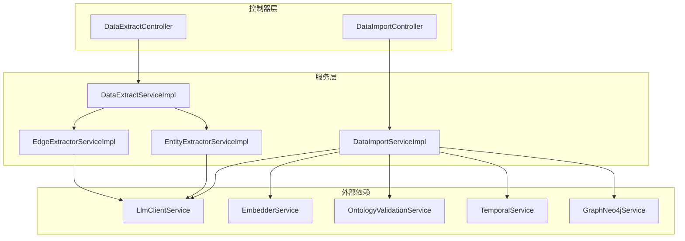
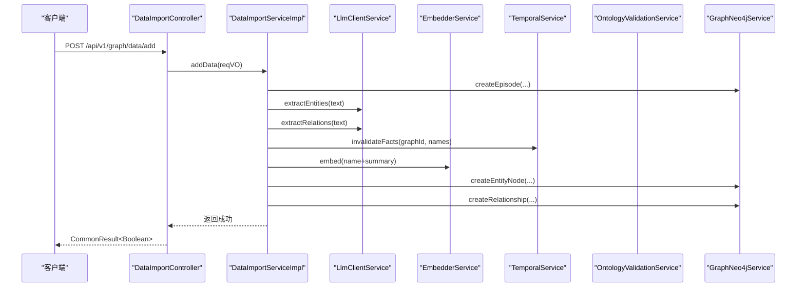
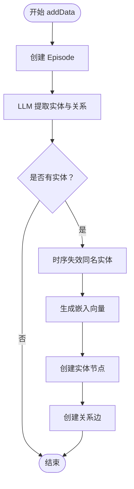
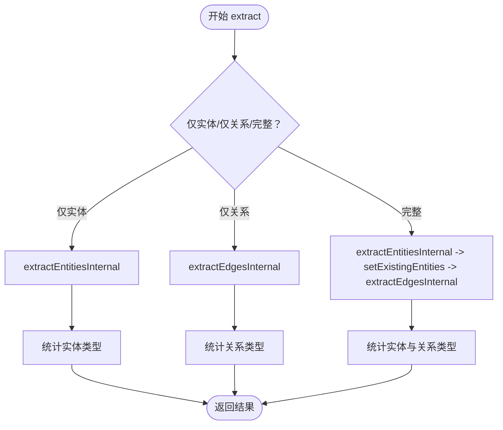
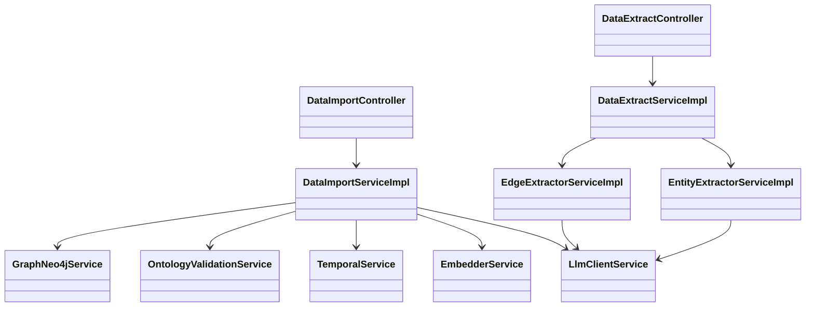
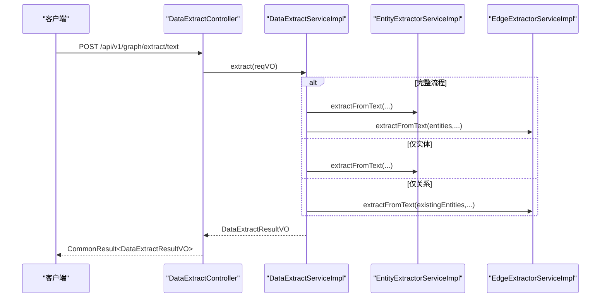
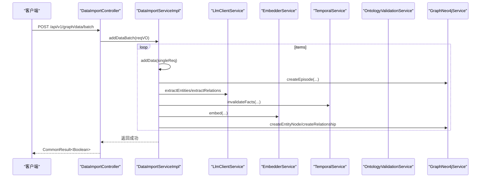

# 数据处理

<!--<cite>
**本文引用的文件**
- [DataImportController.java](file://graphiti-module-core/src/main/java/com/graphiti/module/graphiti/controller/admin/DataImportController.java)
- [DataExtractController.java](file://graphiti-module-core/src/main/java/com/graphiti/module/graphiti/controller/admin/DataExtractController.java)
- [DataImportServiceImpl.java](file://graphiti-module-core/src/main/java/com/graphiti/module/graphiti/service/impl/DataImportServiceImpl.java)
- [DataExtractServiceImpl.java](file://graphiti-module-core/src/main/java/com/graphiti/module/graphiti/service/impl/DataExtractServiceImpl.java)
- [EntityExtractorServiceImpl.java](file://graphiti-module-core/src/main/java/com/graphiti/module/graphiti/service/impl/EntityExtractorServiceImpl.java)
- [EdgeExtractorServiceImpl.java](file://graphiti-module-core/src/main/java/com/graphiti/module/graphiti/service/impl/EdgeExtractorServiceImpl.java)
- [DataImportService.java](file://graphiti-module-core/src/main/java/com/graphiti/module/graphiti/service/DataImportService.java)
- [DataExtractService.java](file://graphiti-module-core/src/main/java/com/graphiti/module/graphiti/service/DataExtractService.java)
- [EntityExtractorService.java](file://graphiti-module-core/src/main/java/com/graphiti/module/graphiti/service/EntityExtractorService.java)
- [EdgeExtractorService.java](file://graphiti-module-core/src/main/java/com/graphiti/module/graphiti/service/EdgeExtractorService.java)
- [DataExtractReqVO.java](file://graphiti-module-core/src/main/java/com/graphiti/module/graphiti/vo/extractor/DataExtractReqVO.java)
- [ExtractedEntityVO.java](file://graphiti-module-core/src/main/java/com/graphiti/module/graphiti/vo/extractor/ExtractedEntityVO.java)
- [ExtractedEdgeVO.java](file://graphiti-module-core/src/main/java/com/graphiti/module/graphiti/vo/extractor/ExtractedEdgeVO.java)
- [GraphitiAiProperties.java](file://graphiti-module-core/src/main/java/com/graphiti/module/graphiti/config/GraphitiAiProperties.java)
- [GraphNeo4jConfig.java](file://graphiti-module-core/src/main/java/com/graphiti/module/graphiti/config/GraphNeo4jConfig.java)
- [extract_entities.txt](file://graphiti-module-core/src/main/resources/prompts/extract_entities.txt)
- [extract_relations.txt](file://graphiti-module-core/src/main/resources/prompts/extract_relations.txt)
</cite>-->

## 目录
1. [简介](#简介)
2. [项目结构](#项目结构)
3. [核心组件](#核心组件)
4. [架构总览](#架构总览)
5. [详细组件分析](#详细组件分析)
6. [依赖分析](#依赖分析)
7. [性能考虑](#性能考虑)
8. [故障排查指南](#故障排查指南)
9. [结论](#结论)
10. [附录](#附录)

## 简介
本文件面向开发者，系统性梳理数据处理子系统的设计与实现，覆盖数据导入导出、实体抽取、关系抽取、数据质量保证等核心能力。重点说明：
- 控制器层：DataImportController 与 DataExtractController 的 API 设计与安全控制
- 服务层：DataImportServiceImpl 与 DataExtractServiceImpl 的业务编排与错误处理
- 抽取算法：EntityExtractorServiceImpl 与 EdgeExtractorServiceImpl 的提示词工程与解析策略
- 数据格式与批量处理：输入输出结构、批量导入策略与错误恢复机制
- 数据清洗与质量评估：时序失效、本体校验、置信度与统计指标
- 高级功能：提示词模板、时间参考、上下文 Episodes、向量化嵌入
- 实战案例：从文本到图谱的端到端流程、性能优化与安全策略

## 项目结构
围绕“控制器-服务-抽取-配置”的分层组织，核心模块位于 graphiti-module-core 下：
- controller/admin：对外暴露 REST API，负责鉴权与参数校验
- service/impl：实现业务流程，协调 LLM、嵌入、Neo4j、本体校验等
- vo/extractor：抽取请求/结果的值对象
- config：AI 与数据库连接配置
- resources/prompts：抽取提示词模板

图表来源
- [DataImportController.java:1-112](file://graphiti-module-core/src/main/java/com/graphiti/module/graphiti/controller/admin/DataImportController.java#L1-L112)
- [DataExtractController.java:1-279](file://graphiti-module-core/src/main/java/com/graphiti/module/graphiti/controller/admin/DataExtractController.java#L1-L279)
- [DataImportServiceImpl.java:1-323](file://graphiti-module-core/src/main/java/com/graphiti/module/graphiti/service/impl/DataImportServiceImpl.java#L1-L323)
- [DataExtractServiceImpl.java:1-261](file://graphiti-module-core/src/main/java/com/graphiti/module/graphiti/service/impl/DataExtractServiceImpl.java#L1-L261)
- [EntityExtractorServiceImpl.java:1-306](file://graphiti-module-core/src/main/java/com/graphiti/module/graphiti/service/impl/EntityExtractorServiceImpl.java#L1-L306)
- [EdgeExtractorServiceImpl.java:1-362](file://graphiti-module-core/src/main/java/com/graphiti/module/graphiti/service/impl/EdgeExtractorServiceImpl.java#L1-L362)

章节来源
- [DataImportController.java:1-112](file://graphiti-module-core/src/main/java/com/graphiti/module/graphiti/controller/admin/DataImportController.java#L1-L112)
- [DataExtractController.java:1-279](file://graphiti-module-core/src/main/java/com/graphiti/module/graphiti/controller/admin/DataExtractController.java#L1-L279)

## 核心组件
- 控制器层
  - DataImportController：提供单条/批量数据写入、消息写入、事实三元组写入、实体节点直写、以及删除操作；统一鉴权与参数校验
  - DataExtractController：提供文本/JSON/仅实体/仅关系/预览/默认类型配置等接口；支持多数据源与上下文 Episodes
- 服务层
  - DataImportServiceImpl：封装 Episode 创建、LLM 实体/关系提取、Neo4j 写入、嵌入向量生成、时序失效、本体校验与批量循环
  - DataExtractServiceImpl：编排实体与关系抽取，聚合统计与耗时，支持仅实体/仅关系/完整流程
  - EntityExtractorServiceImpl：构建系统/用户提示词，调用 LLM 并解析 JSON 或纯文本，支持模板渲染
  - EdgeExtractorServiceImpl：基于实体列表与参考时间提取关系，解析 JSON/纯文本，支持模板渲染
- 配置与模型
  - GraphitiAiProperties：LLM/Embedding/Rerank 提供商与模型参数
  - GraphNeo4jConfig：Neo4j 连接驱动配置
  - VO：DataExtractReqVO、ExtractedEntityVO、ExtractedEdgeVO 描述输入输出结构

章节来源
- [DataImportService.java:1-75](file://graphiti-module-core/src/main/java/com/graphiti/module/graphiti/service/DataImportService.java#L1-L75)
- [DataExtractService.java:1-36](file://graphiti-module-core/src/main/java/com/graphiti/module/graphiti/service/DataExtractService.java#L1-L36)
- [EntityExtractorService.java:1-63](file://graphiti-module-core/src/main/java/com/graphiti/module/graphiti/service/EntityExtractorService.java#L1-L63)
- [EdgeExtractorService.java:1-64](file://graphiti-module-core/src/main/java/com/graphiti/module/graphiti/service/EdgeExtractorService.java#L1-L64)
- [DataExtractReqVO.java:1-74](file://graphiti-module-core/src/main/java/com/graphiti/module/graphiti/vo/extractor/DataExtractReqVO.java#L1-L74)
- [ExtractedEntityVO.java:1-37](file://graphiti-module-core/src/main/java/com/graphiti/module/graphiti/vo/extractor/ExtractedEntityVO.java#L1-L37)
- [ExtractedEdgeVO.java:1-41](file://graphiti-module-core/src/main/java/com/graphiti/module/graphiti/vo/extractor/ExtractedEdgeVO.java#L1-L41)
- [GraphitiAiProperties.java:1-135](file://graphiti-module-core/src/main/java/com/graphiti/module/graphiti/config/GraphitiAiProperties.java#L1-L135)
- [GraphNeo4jConfig.java:1-47](file://graphiti-module-core/src/main/java/com/graphiti/module/graphiti/config/GraphNeo4jConfig.java#L1-L47)

## 架构总览
系统采用“控制器-服务-抽取-外部组件”分层，服务层通过 LLM 与嵌入服务生成结构化结果，并写入 Neo4j；同时结合时序与本体校验保障数据一致性。

图表来源
- [DataImportController.java:32-62](file://graphiti-module-core/src/main/java/com/graphiti/module/graphiti/controller/admin/DataImportController.java#L32-L62)
- [DataImportServiceImpl.java:35-109](file://graphiti-module-core/src/main/java/com/graphiti/module/graphiti/service/impl/DataImportServiceImpl.java#L35-L109)

## 详细组件分析

### 控制器：DataImportController
- 功能概览
  - 单条数据写入：自动提取实体与关系并写入图谱
  - 批量写入：逐项调用单条流程
  - 消息写入：合并多轮对话为一个 Episode，再进行抽取与写入
  - 事实三元组：直接写入关系，自动查找/创建节点
  - 实体节点直写：跳过 LLM，直接写入节点并进行本体校验与时序失效
  - 删除操作：删除实体边、删除图谱、删除 Episode
- 安全与鉴权
  - 所有接口声明 Bearer 鉴权
- 错误处理
  - 清空全局数据接口返回 501 并引导使用按图谱清理

章节来源
- [DataImportController.java:19-112](file://graphiti-module-core/src/main/java/com/graphiti/module/graphiti/controller/admin/DataImportController.java#L19-L112)

### 控制器：DataExtractController
- 功能概览
  - 文本提取：完整流程（实体+关系）
  - JSON 提取：从上传文件读取内容并提取
  - 仅实体：设置 entityOnly=true
  - 仅关系：需提供 existingEntities，设置 edgeOnly=true
  - 预览 JSON：解析结构、采样字段与长度
  - 默认类型配置：返回实体/关系类型定义
- 输入输出
  - 请求：DataExtractReqVO（graphId、content、sourceType、entityTypesConfig、edgeTypesConfig、customInstructions、previousEpisodes、referenceTime、entityOnly、edgeOnly、existingEntities 等）
  - 结果：DataExtractResultVO（entities、edges、统计、耗时、错误列表）

章节来源
- [DataExtractController.java:27-279](file://graphiti-module-core/src/main/java/com/graphiti/module/graphiti/controller/admin/DataExtractController.java#L27-L279)
- [DataExtractReqVO.java:1-74](file://graphiti-module-core/src/main/java/com/graphiti/module/graphiti/vo/extractor/DataExtractReqVO.java#L1-L74)

### 服务：DataImportServiceImpl
- 流程要点
  - Episode 创建：为每次写入创建唯一 UUID 的事件容器
  - LLM 抽取：对内容调用实体/关系抽取
  - 节点写入：生成嵌入向量，调用 Neo4j 创建实体节点
  - 关系写入：基于实体名称映射创建关系边
  - 时序管理：对同名实体执行失效，避免重复
  - 本体校验：若图谱启用本体，对节点属性进行校验与增强
  - 批量处理：当前为顺序循环，预留优化空间
  - 删除操作：支持按 UUID 删除边、按图谱清理、按 Episode 删除
- 错误处理
  - 未找到边/Episode 时抛出业务异常
  - 删除兜底：通过 UUID 全局匹配删除边

图表来源
- [DataImportServiceImpl.java:35-109](file://graphiti-module-core/src/main/java/com/graphiti/module/graphiti/service/impl/DataImportServiceImpl.java#L35-L109)

章节来源
- [DataImportServiceImpl.java:19-323](file://graphiti-module-core/src/main/java/com/graphiti/module/graphiti/service/impl/DataImportServiceImpl.java#L19-L323)

### 服务：DataExtractServiceImpl
- 流程要点
  - 完整流程：先实体后关系，基于 existingEntities 提取关系
  - 仅实体/仅关系：分别调用对应内部方法
  - 配置选择：优先使用请求中的 entityTypesConfig/edgeTypesConfig，否则回退到默认
  - 上下文 Episodes：将 previousEpisodes 转换为 Map 列表传入抽取器
  - 统计与耗时：计算实体/关系类型分布与总耗时
- 错误处理
  - 捕获异常并记录错误，返回包含错误列表的结果

图表来源
- [DataExtractServiceImpl.java:43-97](file://graphiti-module-core/src/main/java/com/graphiti/module/graphiti/service/impl/DataExtractServiceImpl.java#L43-L97)
- [DataExtractServiceImpl.java:153-188](file://graphiti-module-core/src/main/java/com/graphiti/module/graphiti/service/impl/DataExtractServiceImpl.java#L153-L188)

章节来源
- [DataExtractServiceImpl.java:22-261](file://graphiti-module-core/src/main/java/com/graphiti/module/graphiti/service/impl/DataExtractServiceImpl.java#L22-L261)

### 抽取：EntityExtractorServiceImpl
- 提示词工程
  - 系统提示词：定义抽取规则、实体类型定义、自定义指令与 JSON 输出约束
  - 用户提示词：针对 text/json/message 构造不同输入
  - 模板提取：支持按模板编码渲染提示词，自动回退默认模板
- 响应解析
  - 优先解析 JSON 结构，失败时尝试纯文本“名称(类型)”格式
  - 支持提取 episode_indices、confidence 等字段
- 默认实体类型：提供常见类型定义（人物、组织、地点、事件、概念、产品、文档、通用）

章节来源
- [EntityExtractorServiceImpl.java:19-306](file://graphiti-module-core/src/main/java/com/graphiti/module/graphiti/service/impl/EntityExtractorServiceImpl.java#L19-L306)
- [extract_entities.txt:1-28](file://graphiti-module-core/src/main/resources/prompts/extract_entities.txt#L1-L28)

### 抽取：EdgeExtractorServiceImpl
- 提示词工程
  - 系统提示词：强调关系类型格式、实体名称一致性、fact 陈述规范
  - 用户提示词：包含参考时间、历史 Episodes、实体列表与当前内容
  - 模板提取：注入 nodes、reference_time 等变量
- 响应解析
  - 严格校验实体名称存在于实体列表且非自环
  - 解析 validAt/invalidAt 时间字段，提取 attributes
- 默认关系类型：提供常用关系类型与中文释义

章节来源
- [EdgeExtractorServiceImpl.java:19-362](file://graphiti-module-core/src/main/java/com/graphiti/module/graphiti/service/impl/EdgeExtractorServiceImpl.java#L19-L362)
- [extract_relations.txt:1-33](file://graphiti-module-core/src/main/resources/prompts/extract_relations.txt#L1-L33)

### 数据模型与接口
- DataExtractReqVO：输入参数载体，支持多数据源、上下文 Episodes、仅实体/仅关系标志
- ExtractedEntityVO：实体结果，包含名称、类型、摘要、属性、索引与置信度
- ExtractedEdgeVO：关系结果，包含源/标、类型、fact、生效/失效时间、索引与置信度

章节来源
- [DataExtractReqVO.java:1-74](file://graphiti-module-core/src/main/java/com/graphiti/module/graphiti/vo/extractor/DataExtractReqVO.java#L1-L74)
- [ExtractedEntityVO.java:1-37](file://graphiti-module-core/src/main/java/com/graphiti/module/graphiti/vo/extractor/ExtractedEntityVO.java#L1-L37)
- [ExtractedEdgeVO.java:1-41](file://graphiti-module-core/src/main/java/com/graphiti/module/graphiti/vo/extractor/ExtractedEdgeVO.java#L1-L41)

## 依赖分析
- 控制器依赖服务接口，服务实现依赖 LLM、嵌入、时序、本体与 Neo4j
- 抽取服务依赖 LLM 与提示词模板服务
- 配置层提供 AI 与数据库连接参数

图表来源
- [DataImportController.java:27-30](file://graphiti-module-core/src/main/java/com/graphiti/module/graphiti/controller/admin/DataImportController.java#L27-L30)
- [DataExtractController.java:38-41](file://graphiti-module-core/src/main/java/com/graphiti/module/graphiti/controller/admin/DataExtractController.java#L38-L41)
- [DataImportServiceImpl.java:29-33](file://graphiti-module-core/src/main/java/com/graphiti/module/graphiti/service/impl/DataImportServiceImpl.java#L29-L33)
- [DataExtractServiceImpl.java:39-41](file://graphiti-module-core/src/main/java/com/graphiti/module/graphiti/service/impl/DataExtractServiceImpl.java#L39-L41)
- [EntityExtractorServiceImpl.java:28-30](file://graphiti-module-core/src/main/java/com/graphiti/module/graphiti/service/impl/EntityExtractorServiceImpl.java#L28-L30)
- [EdgeExtractorServiceImpl.java:28-30](file://graphiti-module-core/src/main/java/com/graphiti/module/graphiti/service/impl/EdgeExtractorServiceImpl.java#L28-L30)

章节来源
- [DataImportService.java:1-75](file://graphiti-module-core/src/main/java/com/graphiti/module/graphiti/service/DataImportService.java#L1-L75)
- [DataExtractService.java:1-36](file://graphiti-module-core/src/main/java/com/graphiti/module/graphiti/service/DataExtractService.java#L1-L36)
- [EntityExtractorService.java:1-63](file://graphiti-module-core/src/main/java/com/graphiti/module/graphiti/service/EntityExtractorService.java#L1-L63)
- [EdgeExtractorService.java:1-64](file://graphiti-module-core/src/main/java/com/graphiti/module/graphiti/service/EdgeExtractorService.java#L1-L64)

## 性能考虑
- 批量导入优化
  - 当前实现为顺序循环，建议引入线程池与批处理事务，减少 LLM 调用次数与数据库往返
  - 对实体去重与名称标准化可前置缓存，降低重复计算
- 嵌入向量生成
  - 合理批量化 embed 调用，避免单条高频触发
- Neo4j 写入
  - 使用 UNWIND/参数化批量写入，减少 Cypher 解析开销
- LLM 调用
  - 合理设置温度与最大 tokens，避免超长上下文导致延迟
  - 对重复内容进行缓存或去重
- 时序与本体检验证
  - 在批量场景下合并失效与校验操作，减少多次扫描

## 故障排查指南
- 常见错误与定位
  - “请先提供实体列表”：仅关系提取接口缺少 existingEntities
  - “边不存在/Episode 不存在”：删除接口传入的 UUID 无效
  - “读取JSON文件失败/JSON文件解析失败”：文件编码或格式问题
  - “节点名称不能为空”：直写实体节点时未提供 name
- 日志与监控
  - 控制器与服务均记录关键步骤与耗时，便于定位瓶颈
  - 建议在网关或中间件层增加请求追踪 ID，串联链路日志
- 错误恢复
  - 单条数据写入失败不影响其他条目；批量场景建议幂等与重试策略
  - 删除操作提供兜底 SQL（按 UUID 全局匹配），确保资源回收

章节来源
- [DataExtractController.java:129-131](file://graphiti-module-core/src/main/java/com/graphiti/module/graphiti/controller/admin/DataExtractController.java#L129-L131)
- [DataImportController.java:108-110](file://graphiti-module-core/src/main/java/com/graphiti/module/graphiti/controller/admin/DataImportController.java#L108-L110)
- [DataImportServiceImpl.java:283-296](file://graphiti-module-core/src/main/java/com/graphiti/module/graphiti/service/impl/DataImportServiceImpl.java#L283-L296)
- [DataExtractServiceImpl.java:85-88](file://graphiti-module-core/src/main/java/com/graphiti/module/graphiti/service/impl/DataExtractServiceImpl.java#L85-L88)

## 结论
该数据处理系统以清晰的分层架构实现了从文本到图谱的自动化抽取与写入，具备良好的扩展性与可维护性。建议在批量导入、LLM 调用与数据库写入方面进一步优化，以满足高吞吐场景需求；同时完善提示词模板体系与质量评估指标，持续提升抽取准确性与稳定性。

## 附录

### API 设计与调用序列（DataExtractController）

图表来源
- [DataExtractController.java:48-58](file://graphiti-module-core/src/main/java/com/graphiti/module/graphiti/controller/admin/DataExtractController.java#L48-L58)
- [DataExtractServiceImpl.java:44-97](file://graphiti-module-core/src/main/java/com/graphiti/module/graphiti/service/impl/DataExtractServiceImpl.java#L44-L97)

### 数据处理管道（DataImportController）

图表来源
- [DataImportController.java:40-46](file://graphiti-module-core/src/main/java/com/graphiti/module/graphiti/controller/admin/DataImportController.java#L40-L46)
- [DataImportServiceImpl.java:112-126](file://graphiti-module-core/src/main/java/com/graphiti/module/graphiti/service/impl/DataImportServiceImpl.java#L112-L126)

### 配置说明
- GraphitiAiProperties：支持多种 LLM/Embedding 提供商，可配置模型、Base URL、温度、最大 tokens、Embedding/Rerank 模型
- GraphNeo4jConfig：提供 Neo4j 连接参数，创建 Driver Bean

章节来源
- [GraphitiAiProperties.java:13-135](file://graphiti-module-core/src/main/java/com/graphiti/module/graphiti/config/GraphitiAiProperties.java#L13-L135)
- [GraphNeo4jConfig.java:17-46](file://graphiti-module-core/src/main/java/com/graphiti/module/graphiti/config/GraphNeo4jConfig.java#L17-L46)