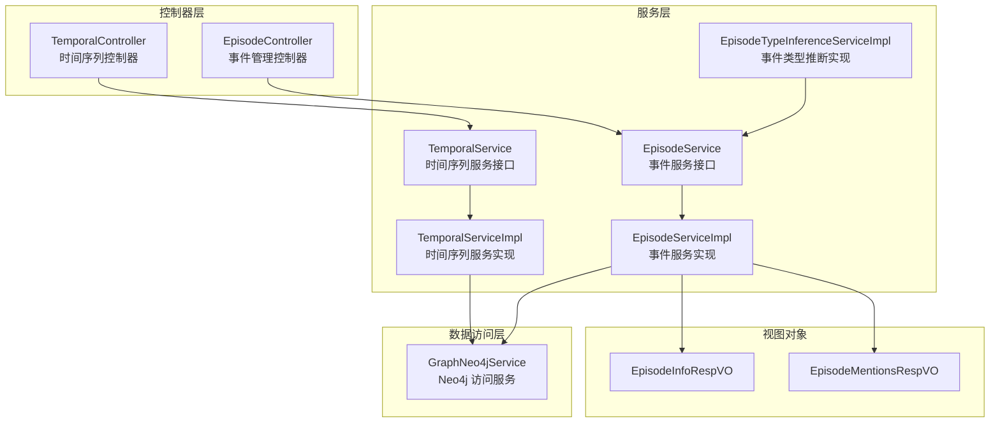
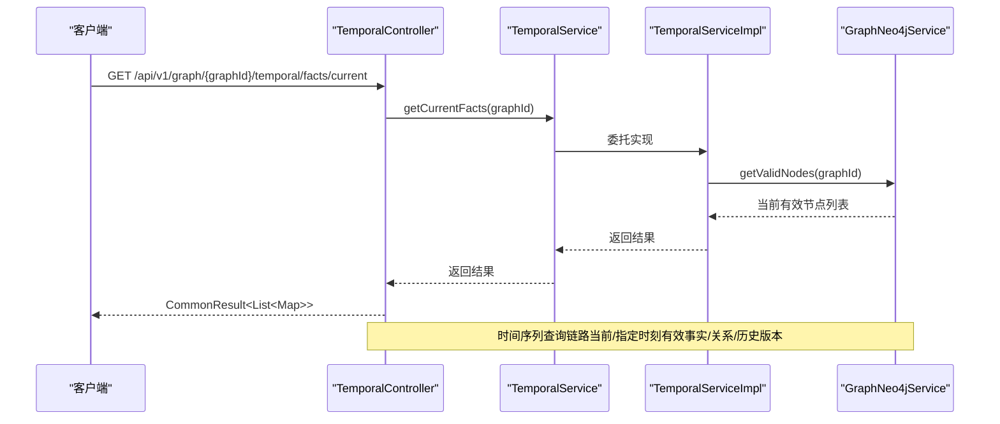
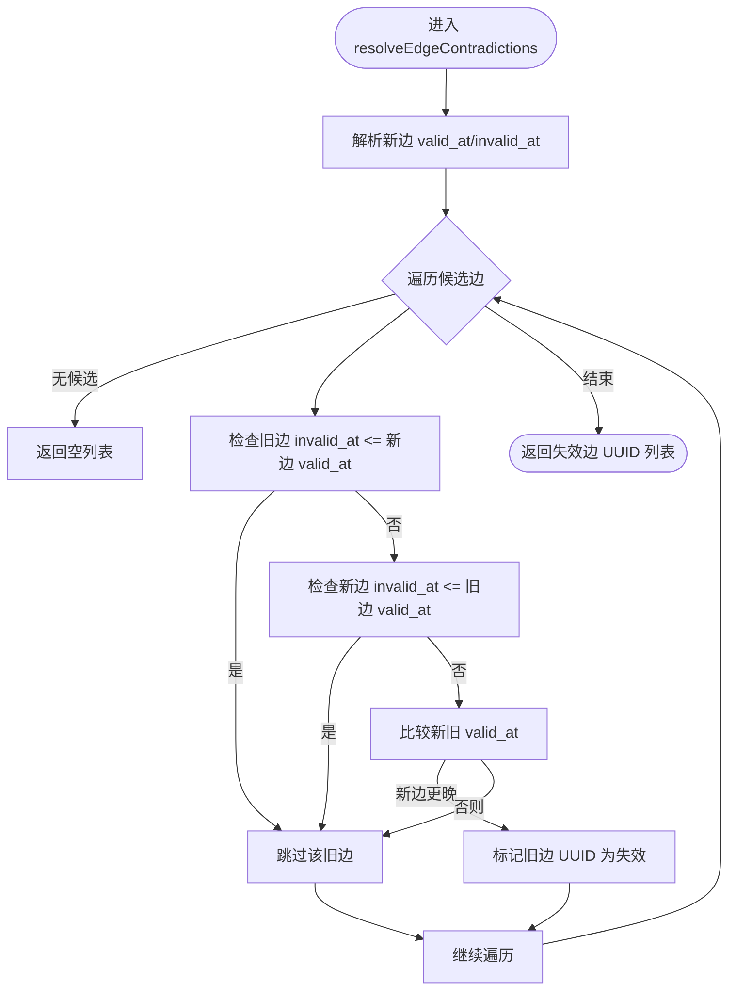
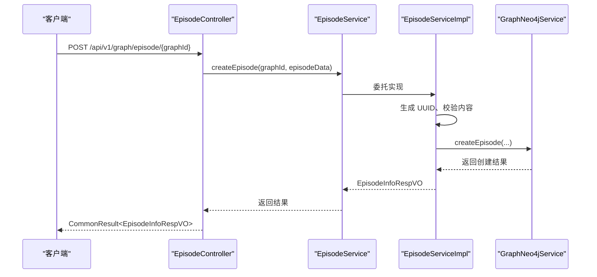
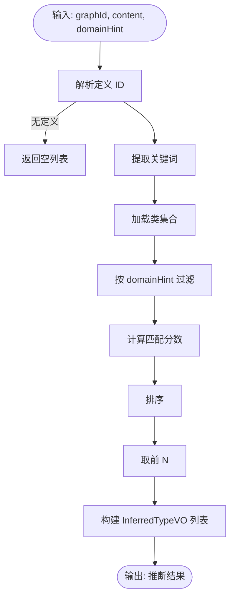
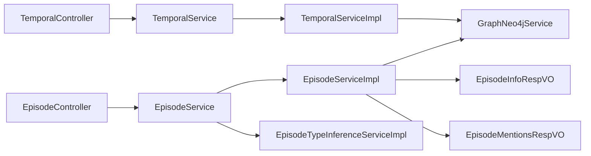

# 时间序列管理

<!--<cite>
**本文引用的文件**
- [TemporalController.java](file://graphiti-module-core/src/main/java/com/graphiti/module/graphiti/controller/admin/TemporalController.java)
- [TemporalService.java](file://graphiti-module-core/src/main/java/com/graphiti/module/graphiti/service/TemporalService.java)
- [TemporalServiceImpl.java](file://graphiti-module-core/src/main/java/com/graphiti/module/graphiti/service/impl/TemporalServiceImpl.java)
- [EpisodeController.java](file://graphiti-module-core/src/main/java/com/graphiti/module/graphiti/controller/admin/EpisodeController.java)
- [EpisodeService.java](file://graphiti-module-core/src/main/java/com/graphiti/module/graphiti/service/EpisodeService.java)
- [EpisodeServiceImpl.java](file://graphiti-module-core/src/main/java/com/graphiti/module/graphiti/service/impl/EpisodeServiceImpl.java)
- [EpisodeTypeInferenceServiceImpl.java](file://graphiti-module-core/src/main/java/com/graphiti/module/graphiti/service/impl/EpisodeTypeInferenceServiceImpl.java)
- [EpisodeInfoRespVO.java](file://graphiti-module-core/src/main/java/com/graphiti/module/graphiti/vo/episode/EpisodeInfoRespVO.java)
- [EpisodeMentionsRespVO.java](file://graphiti-module-core/src/main/java/com/graphiti/module/graphiti/vo/episode/EpisodeMentionsRespVO.java)
- [GraphNeo4jService.java](file://graphiti-module-core/src/main/java/com/graphiti/module/graphiti/service/GraphNeo4jService.java)
</cite>-->

## 目录
1. [简介](#简介)
2. [项目结构](#项目结构)
3. [核心组件](#核心组件)
4. [架构总览](#架构总览)
5. [详细组件分析](#详细组件分析)
6. [依赖分析](#依赖分析)
7. [性能考虑](#性能考虑)
8. [故障排查指南](#故障排查指南)
9. [结论](#结论)
10. [附录](#附录)

## 简介
本文件围绕时间序列管理系统进行深入文档化，重点覆盖以下方面：
- 事件时间线管理：通过 Episode（事件）作为时间序列的基本单元，记录事实随时间的变化。
- 事实追踪与时间戳处理：基于 Neo4j 的 valid_at/invalid_at/expired_at 三段式时间戳，实现事实的有效性判定与历史版本追踪。
- TemporalController 的时间序列 API 设计：提供“当前有效事实”“指定时刻有效事实/关系”“实体历史版本”“批量失效”等接口。
- TemporalServiceImpl 的时间处理逻辑：统一解析时间戳、解决边的时间冲突、批量失效边。
- EpisodeController 的事件管理接口：事件的增删查、事件提及的节点/边查询。
- EpisodeServiceImpl 的事件类型推断、事件提及检测、时间线构建等算法思路与实现要点。
- 时间序列数据模型、事件关系推理、时序查询优化策略。
- 时间轴可视化、事件检索、历史回溯的使用场景与最佳实践。

## 项目结构
本系统采用典型的分层架构：
- 控制器层：暴露 REST 接口，负责请求参数校验与返回值封装。
- 服务层：定义领域服务接口与实现，封装业务规则与数据访问。
- 数据访问层：通过 GraphNeo4jService 封装对 Neo4j 的读写操作，包括节点、边、事件、全文/向量索引等。
- 视图对象层：VO 定义响应结构，确保对外输出字段一致且语义清晰。

图表来源
- [TemporalController.java:1-67](file://graphiti-module-core/src/main/java/com/graphiti/module/graphiti/controller/admin/TemporalController.java#L1-L67)
- [TemporalService.java:1-95](file://graphiti-module-core/src/main/java/com/graphiti/module/graphiti/service/TemporalService.java#L1-L95)
- [TemporalServiceImpl.java:1-160](file://graphiti-module-core/src/main/java/com/graphiti/module/graphiti/service/impl/TemporalServiceImpl.java#L1-L160)
- [EpisodeController.java:1-79](file://graphiti-module-core/src/main/java/com/graphiti/module/graphiti/controller/admin/EpisodeController.java#L1-L79)
- [EpisodeService.java:1-53](file://graphiti-module-core/src/main/java/com/graphiti/module/graphiti/service/EpisodeService.java#L1-L53)
- [EpisodeServiceImpl.java:1-161](file://graphiti-module-core/src/main/java/com/graphiti/module/graphiti/service/impl/EpisodeServiceImpl.java#L1-L161)
- [EpisodeTypeInferenceServiceImpl.java:1-113](file://graphiti-module-core/src/main/java/com/graphiti/module/graphiti/service/impl/EpisodeTypeInferenceServiceImpl.java#L1-L113)
- [GraphNeo4jService.java:1200-1347](file://graphiti-module-core/src/main/java/com/graphiti/module/graphiti/service/GraphNeo4jService.java#L1200-L1347)

章节来源
- [TemporalController.java:1-67](file://graphiti-module-core/src/main/java/com/graphiti/module/graphiti/controller/admin/TemporalController.java#L1-L67)
- [EpisodeController.java:1-79](file://graphiti-module-core/src/main/java/com/graphiti/module/graphiti/controller/admin/EpisodeController.java#L1-L79)

## 核心组件
- 时间序列服务接口与实现
  - 接口定义了“失效事实/边”“解决边冲突”“批量失效边”“当前/指定时刻有效事实/关系”“实体历史版本”等能力。
  - 实现负责时间戳解析、冲突判定、Cypher 执行与日志记录。
- 事件管理服务接口与实现
  - 提供事件列表、详情、提及查询、创建、删除等能力；内部通过 GraphNeo4jService 完成数据持久化与查询。
- 事件类型推断服务
  - 基于本体定义与关键词匹配，给出候选类型及其置信度与理由。
- 视图对象
  - EpisodeInfoRespVO：事件详情响应结构。
  - EpisodeMentionsRespVO：事件提及的节点/边响应结构。

章节来源
- [TemporalService.java:1-95](file://graphiti-module-core/src/main/java/com/graphiti/module/graphiti/service/TemporalService.java#L1-L95)
- [TemporalServiceImpl.java:1-160](file://graphiti-module-core/src/main/java/com/graphiti/module/graphiti/service/impl/TemporalServiceImpl.java#L1-L160)
- [EpisodeService.java:1-53](file://graphiti-module-core/src/main/java/com/graphiti/module/graphiti/service/EpisodeService.java#L1-L53)
- [EpisodeServiceImpl.java:1-161](file://graphiti-module-core/src/main/java/com/graphiti/module/graphiti/service/impl/EpisodeServiceImpl.java#L1-L161)
- [EpisodeTypeInferenceServiceImpl.java:1-113](file://graphiti-module-core/src/main/java/com/graphiti/module/graphiti/service/impl/EpisodeTypeInferenceServiceImpl.java#L1-L113)
- [EpisodeInfoRespVO.java:1-53](file://graphiti-module-core/src/main/java/com/graphiti/module/graphiti/vo/episode/EpisodeInfoRespVO.java#L1-L53)
- [EpisodeMentionsRespVO.java:1-67](file://graphiti-module-core/src/main/java/com/graphiti/module/graphiti/vo/episode/EpisodeMentionsRespVO.java#L1-L67)

## 架构总览
系统围绕“事件（Episode）—实体（Entity）—关系（RELATES_TO）”构建时间序列，通过三段式时间戳维护事实有效性，并以控制器-服务-数据访问三层协同完成时间序列的管理与查询。

图表来源
- [TemporalController.java:24-29](file://graphiti-module-core/src/main/java/com/graphiti/module/graphiti/controller/admin/TemporalController.java#L24-L29)
- [TemporalServiceImpl.java:110-112](file://graphiti-module-core/src/main/java/com/graphiti/module/graphiti/service/impl/TemporalServiceImpl.java#L110-L112)
- [GraphNeo4jService.java:865-895](file://graphiti-module-core/src/main/java/com/graphiti/module/graphiti/service/GraphNeo4jService.java#L865-L895)

## 详细组件分析

### 时间序列控制器：TemporalController
- 功能概览
  - 获取当前有效事实（节点）
  - 获取指定时间点的有效事实（节点）
  - 获取指定时间点的有效关系（边）
  - 获取实体的历史版本
  - 批量失效事实（按实体名称）
- 设计要点
  - 统一返回包装结构，便于前端消费。
  - 路径参数 graphId 用于多图谱隔离。
  - 时间点参数 referenceTime 采用毫秒级时间戳。

章节来源
- [TemporalController.java:24-65](file://graphiti-module-core/src/main/java/com/graphiti/module/graphiti/controller/admin/TemporalController.java#L24-L65)

### 时间序列服务接口与实现：TemporalService/TemporalServiceImpl
- 接口职责
  - 失效事实/边：支持按实体名称或节点 UUID 失效。
  - 边冲突解决：根据 valid_at/invalid_at 判定是否需要失效旧边。
  - 批量失效边：设置 invalid_at 与 expired_at。
  - 时序查询：当前有效、指定时刻有效节点/边、实体历史版本。
- 实现细节
  - 时间戳解析：支持数值与 ISO 8601 字符串，异常时记录告警并忽略。
  - 冲突判定三步法：无重叠、新边在旧边失效前无效、新边 valid_at 更晚则旧边失效。
  - Cypher 批量更新失效边，确保事务性与幂等性。

图表来源
- [TemporalServiceImpl.java:44-85](file://graphiti-module-core/src/main/java/com/graphiti/module/graphiti/service/impl/TemporalServiceImpl.java#L44-L85)

章节来源
- [TemporalService.java:21-93](file://graphiti-module-core/src/main/java/com/graphiti/module/graphiti/service/TemporalService.java#L21-L93)
- [TemporalServiceImpl.java:27-127](file://graphiti-module-core/src/main/java/com/graphiti/module/graphiti/service/impl/TemporalServiceImpl.java#L27-L127)

### 事件管理控制器：EpisodeController
- 功能概览
  - 分页列出事件
  - 获取事件详情
  - 获取事件提及（节点/边）
  - 创建事件
  - 删除事件
- 安全与参数
  - 使用 Bearer 认证。
  - 支持 limit/offset 分页查询。

章节来源
- [EpisodeController.java:32-77](file://graphiti-module-core/src/main/java/com/graphiti/module/graphiti/controller/admin/EpisodeController.java#L32-L77)

### 事件服务接口与实现：EpisodeService/EpisodeServiceImpl
- 接口职责
  - 事件列表、详情、提及、创建、删除。
- 实现要点
  - 事件 UUID 自动生成。
  - 事件内容非空校验。
  - 通过 GraphNeo4jService 完成事件创建、删除、提及查询与分页统计。
  - VO 转换：EpisodeInfoRespVO、EpisodeMentionsRespVO。

图表来源
- [EpisodeController.java:63-66](file://graphiti-module-core/src/main/java/com/graphiti/module/graphiti/controller/admin/EpisodeController.java#L63-L66)
- [EpisodeServiceImpl.java:72-96](file://graphiti-module-core/src/main/java/com/graphiti/module/graphiti/service/impl/EpisodeServiceImpl.java#L72-L96)
- [GraphNeo4jService.java:508-546](file://graphiti-module-core/src/main/java/com/graphiti/module/graphiti/service/GraphNeo4jService.java#L508-L546)

章节来源
- [EpisodeService.java:14-51](file://graphiti-module-core/src/main/java/com/graphiti/module/graphiti/service/EpisodeService.java#L14-L51)
- [EpisodeServiceImpl.java:29-102](file://graphiti-module-core/src/main/java/com/graphiti/module/graphiti/service/impl/EpisodeServiceImpl.java#L29-L102)

### 事件类型推断：EpisodeTypeInferenceServiceImpl
- 输入
  - graphId：用于定位本体定义。
  - content：事件内容，提取关键词。
  - domainHint：可选领域提示，过滤候选类。
- 算法流程
  - 解析定义 ID（ACTIVE 状态）。
  - 关键词清洗与去重，限制数量。
  - 对每个类计算匹配分数（本地名与描述包含关键词的加权）。
  - 排序取前 N 结果，构造 InferredTypeVO（含理由）。

图表来源
- [EpisodeTypeInferenceServiceImpl.java:28-68](file://graphiti-module-core/src/main/java/com/graphiti/module/graphiti/service/impl/EpisodeTypeInferenceServiceImpl.java#L28-L68)

章节来源
- [EpisodeTypeInferenceServiceImpl.java:28-113](file://graphiti-module-core/src/main/java/com/graphiti/module/graphiti/service/impl/EpisodeTypeInferenceServiceImpl.java#L28-L113)

### 时间序列数据模型与查询
- 节点与边
  - 实体节点：包含 group_id、uuid、name、type、summary、embedding、valid_at、invalid_at 等。
  - 关系边：默认 RELATES_TO 类型，包含 uuid、type、fact、embedding、valid_at、invalid_at、expired_at 等。
- 时序查询
  - 当前有效：有效期内（valid_at ≤ now 且 now < invalid_at 或 invalid_at 为空）。
  - 指定时刻有效：valid_at ≤ t 且 t < invalid_at。
  - 历史版本：按时间倒序返回实体的所有版本。
- 事件与提及
  - 事件（Episode）与实体（Entity）之间通过 MENTIONS 关系建立提及。
  - 事件可直接提及边（非实体/事件的其他关系）。

章节来源
- [GraphNeo4jService.java:41-127](file://graphiti-module-core/src/main/java/com/graphiti/module/graphiti/service/GraphNeo4jService.java#L41-L127)
- [GraphNeo4jService.java:426-495](file://graphiti-module-core/src/main/java/com/graphiti/module/graphiti/service/GraphNeo4jService.java#L426-L495)
- [TemporalServiceImpl.java:109-127](file://graphiti-module-core/src/main/java/com/graphiti/module/graphiti/service/impl/TemporalServiceImpl.java#L109-L127)

## 依赖分析
- 控制器到服务：TemporalController 与 EpisodeController 仅依赖服务接口，解耦良好。
- 服务到数据访问：TemporalServiceImpl 与 EpisodeServiceImpl 依赖 GraphNeo4jService，集中处理 Neo4j 交互。
- 事件类型推断：EpisodeTypeInferenceServiceImpl 依赖本体映射器，与事件服务解耦。
- 视图对象：EpisodeServiceImpl 负责将底层 Map 转换为 VO，保证接口稳定性。

图表来源
- [TemporalController.java:22](file://graphiti-module-core/src/main/java/com/graphiti/module/graphiti/controller/admin/TemporalController.java#L22)
- [EpisodeController.java:29](file://graphiti-module-core/src/main/java/com/graphiti/module/graphiti/controller/admin/EpisodeController.java#L29)
- [TemporalServiceImpl.java:25](file://graphiti-module-core/src/main/java/com/graphiti/module/graphiti/service/impl/TemporalServiceImpl.java#L25)
- [EpisodeServiceImpl.java:27](file://graphiti-module-core/src/main/java/com/graphiti/module/graphiti/service/impl/EpisodeServiceImpl.java#L27)

章节来源
- [TemporalController.java:22](file://graphiti-module-core/src/main/java/com/graphiti/module/graphiti/controller/admin/TemporalController.java#L22)
- [EpisodeController.java:29](file://graphiti-module-core/src/main/java/com/graphiti/module/graphiti/controller/admin/EpisodeController.java#L29)
- [TemporalServiceImpl.java:25](file://graphiti-module-core/src/main/java/com/graphiti/module/graphiti/service/impl/TemporalServiceImpl.java#L25)
- [EpisodeServiceImpl.java:27](file://graphiti-module-core/src/main/java/com/graphiti/module/graphiti/service/impl/EpisodeServiceImpl.java#L27)

## 性能考虑
- 时间戳解析与转换
  - 在 TemporalServiceImpl 中统一解析时间戳，避免重复转换与格式不一致导致的错误。
- 边冲突判定
  - 使用单次遍历与常量条件判断，时间复杂度 O(n)，适合中小规模候选集。
- 批量失效边
  - 使用 Cypher 参数化批量 SET，减少网络往返与解析开销。
- 查询优化
  - 有效事实查询：在 valid_at/invalid_at 上建立索引可显著提升范围查询性能。
  - 事件提及查询：利用 MENTIONS 关系与标签过滤，避免全库扫描。
- 向量与全文索引
  - GraphNeo4jService 提供向量与全文索引查询方法，建议在高并发检索场景启用相应索引。
- 日志与可观测性
  - 冲突解决与批量失效均记录日志，便于问题定位与性能审计。

[本节为通用性能建议，无需特定文件来源]

## 故障排查指南
- 事件创建失败
  - 现象：创建接口返回失败。
  - 排查：确认事件内容非空；查看服务端异常抛出与日志。
  - 参考路径：[EpisodeServiceImpl.java:83-93](file://graphiti-module-core/src/main/java/com/graphiti/module/graphiti/service/impl/EpisodeServiceImpl.java#L83-L93)
- 时间戳解析失败
  - 现象：时间相关查询结果异常或为空。
  - 排查：检查传入时间戳格式（数值或 ISO 8601），查看日志告警。
  - 参考路径：[TemporalServiceImpl.java:134-158](file://graphiti-module-core/src/main/java/com/graphiti/module/graphiti/service/impl/TemporalServiceImpl.java#L134-L158)
- 边冲突未生效
  - 现象：新边未使旧边失效。
  - 排查：核对 valid_at/invalid_at 设置；确认候选边集合是否正确；查看日志中的冲突判定分支。
  - 参考路径：[TemporalServiceImpl.java:44-85](file://graphiti-module-core/src/main/java/com/graphiti/module/graphiti/service/impl/TemporalServiceImpl.java#L44-L85)
- 事件提及为空
  - 现象：获取事件提及返回空列表。
  - 排查：确认事件 UUID 正确；检查 MENTIONS 关系是否存在；验证节点/边标签过滤逻辑。
  - 参考路径：[GraphNeo4jService.java:426-495](file://graphiti-module-core/src/main/java/com/graphiti/module/graphiti/service/GraphNeo4jService.java#L426-L495)

章节来源
- [EpisodeServiceImpl.java:83-93](file://graphiti-module-core/src/main/java/com/graphiti/module/graphiti/service/impl/EpisodeServiceImpl.java#L83-L93)
- [TemporalServiceImpl.java:134-158](file://graphiti-module-core/src/main/java/com/graphiti/module/graphiti/service/impl/TemporalServiceImpl.java#L134-L158)
- [TemporalServiceImpl.java:44-85](file://graphiti-module-core/src/main/java/com/graphiti/module/graphiti/service/impl/TemporalServiceImpl.java#L44-L85)
- [GraphNeo4jService.java:426-495](file://graphiti-module-core/src/main/java/com/graphiti/module/graphiti/service/GraphNeo4jService.java#L426-L495)

## 结论
本时间序列管理系统以 Episode 为核心，结合三段式时间戳与 Neo4j 的图模型，实现了从事件管理、事实追踪到时序查询的完整闭环。TemporalController 与 EpisodeController 提供简洁稳定的 API；TemporalServiceImpl 与 EpisodeServiceImpl 将业务规则与数据访问解耦；GraphNeo4jService 抽象了复杂的图操作与索引查询。通过合理的索引与查询优化，系统可在大规模知识图谱上保持良好的性能与可维护性。

[本节为总结性内容，无需特定文件来源]

## 附录
- 使用案例
  - 时间轴可视化：基于“当前有效事实/关系”与“历史版本”，渲染事件时间线。
  - 事件检索：通过全文/向量索引快速定位事件与提及。
  - 历史回溯：按 referenceTime 查询某一时刻的图快照，支持审计与复盘。
- 时间索引优化建议
  - 在 valid_at/invalid_at 上建立索引，加速时序范围查询。
  - 在 fact/type/name/summary 等字段上建立全文索引，提升检索效率。
  - 在 embedding 上建立向量索引，支撑相似度检索。
- 性能调优建议
  - 批量操作使用参数化 Cypher，减少解析与网络开销。
  - 合理设置分页大小与游标，避免一次性返回过多数据。
  - 对高频查询建立物化视图或缓存（需结合业务场景评估）。

[本节为通用指导，无需特定文件来源]