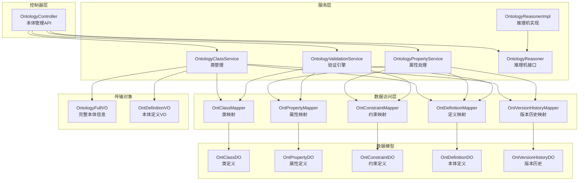
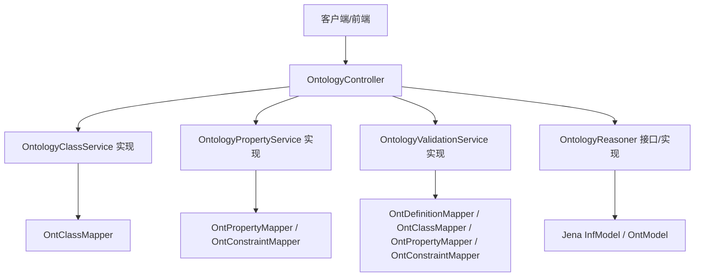
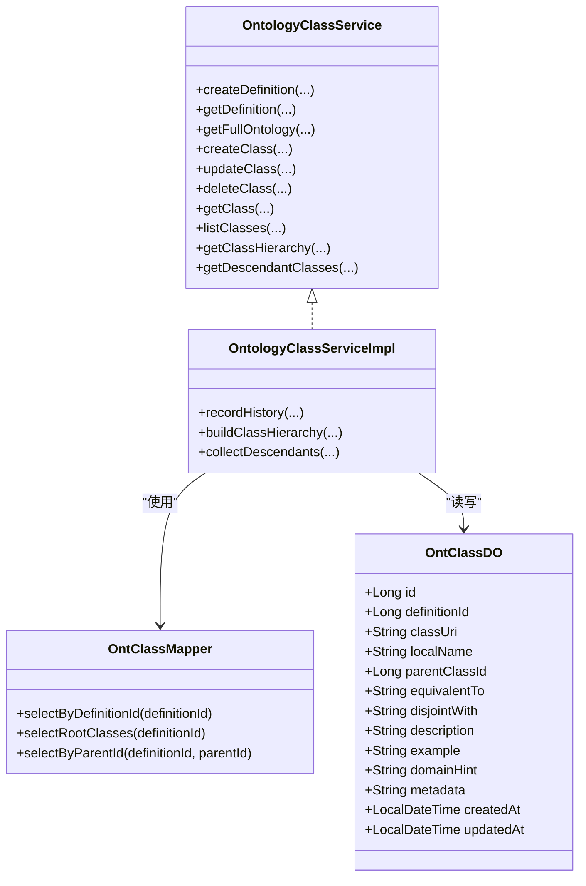
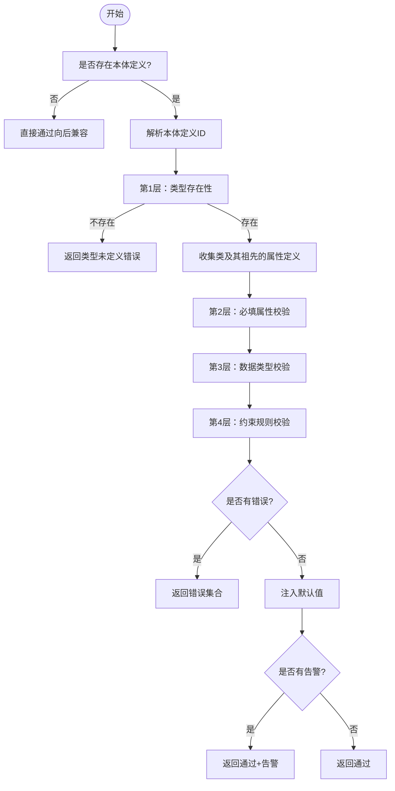
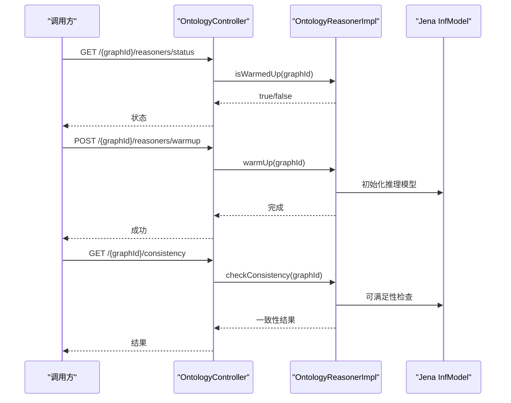
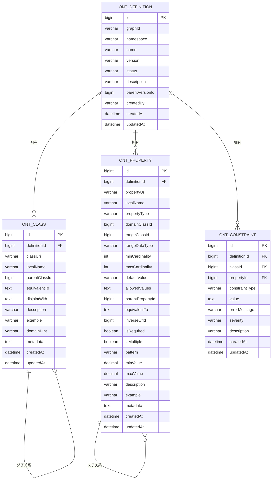
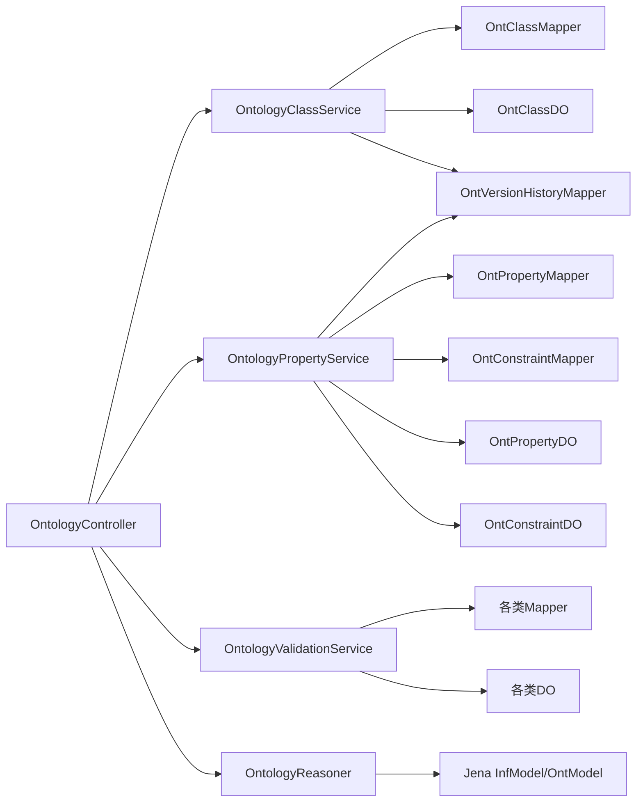

# 本体系统

<cite>
**本文档引用的文件**
- [OntologyController.java](file://graphiti-module-core/src/main/java/com/graphiti/module/graphiti/controller/admin/OntologyController.java)
- [OntologyClassServiceImpl.java](file://graphiti-module-core/src/main/java/com/graphiti/module/graphiti/service/impl/OntologyClassServiceImpl.java)
- [OntologyPropertyServiceImpl.java](file://graphiti-module-core/src/main/java/com/graphiti/module/graphiti/service/impl/OntologyPropertyServiceImpl.java)
- [OntologyValidationServiceImpl.java](file://graphiti-module-core/src/main/java/com/graphiti/module/graphiti/service/impl/OntologyValidationServiceImpl.java)
- [OntologyReasonerImpl.java](file://graphiti-module-core/src/main/java/com/graphiti/module/graphiti/service/impl/OntologyReasonerImpl.java)
- [OntologyClassService.java](file://graphiti-module-core/src/main/java/com/graphiti/module/graphiti/service/OntologyClassService.java)
- [OntologyPropertyService.java](file://graphiti-module-core/src/main/java/com/graphiti/module/graphiti/service/OntologyPropertyService.java)
- [OntologyValidationService.java](file://graphiti-module-core/src/main/java/com/graphiti/module/graphiti/service/OntologyValidationService.java)
- [OntologyReasoner.java](file://graphiti-module-core/src/main/java/com/graphiti/module/graphiti/service/OntologyReasoner.java)
- [OntologyFullVO.java](file://graphiti-module-core/src/main/java/com/graphiti/module/graphiti/vo/ontology/OntologyFullVO.java)
- [OntDefinitionVO.java](file://graphiti-module-core/src/main/java/com/graphiti/module/graphiti/vo/ontology/OntDefinitionVO.java)
- [OntClassDO.java](file://graphiti-module-core/src/main/java/com/graphiti/module/graphiti/dal/dataobject/ont/OntClassDO.java)
- [OntPropertyDO.java](file://graphiti-module-core/src/main/java/com/graphiti/module/graphiti/dal/dataobject/ont/OntPropertyDO.java)
- [OntConstraintDO.java](file://graphiti-module-core/src/main/java/com/graphiti/module/graphiti/dal/dataobject/ont/OntConstraintDO.java)
- [OntClassMapper.java](file://graphiti-module-core/src/main/java/com/graphiti/module/graphiti/dal/mysql/ont/OntClassMapper.java)
</cite>

## 目录
1. [简介](#简介)
2. [项目结构](#项目结构)
3. [核心组件](#核心组件)
4. [架构总览](#架构总览)
5. [详细组件分析](#详细组件分析)
6. [依赖分析](#依赖分析)
7. [性能考虑](#性能考虑)
8. [故障排查指南](#故障排查指南)
9. [结论](#结论)
10. [附录](#附录)

## 简介
本体系统围绕“知识图谱本体定义与治理”构建，提供完整的本体生命周期管理能力：本体定义、类与属性建模、约束规则、版本历史、6层验证引擎、OWL 2 RL 推理机、Schema.org 导入、以及配套的控制台与工具支持。系统采用分层架构，控制器负责对外暴露REST API，服务层封装业务逻辑，DAO层负责持久化访问，VO层承载传输对象。

## 项目结构
- 控制器层：集中于 admin 包下的 OntologyController，统一暴露本体管理相关接口，涵盖定义、类、属性、约束、版本历史、推理机状态与一致性检查等。
- 服务层：包含类管理、属性处理、验证引擎、推理机、Schema.org 导入等实现类；接口定义位于 service 包。
- 数据访问层：基于 MyBatis-Plus 的 Mapper 接口，对应 ont_* 数据表。
- VO/DO 层：VO 用于 API 传输，DO 用于数据库持久化。
- 前端：提供本体编辑器、版本历史视图、一致性检查与推理结果展示等界面。

图表来源
- [OntologyController.java:1-232](file://graphiti-module-core/src/main/java/com/graphiti/module/graphiti/controller/admin/OntologyController.java#L1-L232)
- [OntologyClassServiceImpl.java:1-368](file://graphiti-module-core/src/main/java/com/graphiti/module/graphiti/service/impl/OntologyClassServiceImpl.java#L1-L368)
- [OntologyPropertyServiceImpl.java:1-374](file://graphiti-module-core/src/main/java/com/graphiti/module/graphiti/service/impl/OntologyPropertyServiceImpl.java#L1-L374)
- [OntologyValidationServiceImpl.java:1-345](file://graphiti-module-core/src/main/java/com/graphiti/module/graphiti/service/impl/OntologyValidationServiceImpl.java#L1-L345)
- [OntologyReasonerImpl.java:1-161](file://graphiti-module-core/src/main/java/com/graphiti/module/graphiti/service/impl/OntologyReasonerImpl.java#L1-L161)
- [OntologyClassMapper.java:1-22](file://graphiti-module-core/src/main/java/com/graphiti/module/graphiti/dal/mysql/ont/OntClassMapper.java#L1-L22)
- [OntologyFullVO.java:1-37](file://graphiti-module-core/src/main/java/com/graphiti/module/graphiti/vo/ontology/OntologyFullVO.java#L1-L37)
- [OntDefinitionVO.java:1-64](file://graphiti-module-core/src/main/java/com/graphiti/module/graphiti/vo/ontology/OntDefinitionVO.java#L1-L64)

章节来源
- [OntologyController.java:1-232](file://graphiti-module-core/src/main/java/com/graphiti/module/graphiti/controller/admin/OntologyController.java#L1-L232)

## 核心组件
- OntologyController：对外提供本体管理API，包括本体定义、类、属性、约束、版本历史、Schema.org导入、推理机状态与一致性检查等。
- OntologyClassServiceImpl：负责本体定义、类的增删改查、类层次树构建、后代类收集、版本历史记录。
- OntologyPropertyServiceImpl：负责属性的增删改查、属性祖先链收集、约束管理、版本历史记录。
- OntologyValidationServiceImpl：实现6层验证引擎（类型存在性、必填属性、数据类型、约束规则、OWL约束预留、推理扩展预留），支持节点/边验证与批量验证。
- OntologyReasonerImpl：基于 Apache Jena 的 OWL 2 RL 推理机实现，提供预热、一致性检查、祖先/后代类查询等能力。

章节来源
- [OntologyController.java:16-232](file://graphiti-module-core/src/main/java/com/graphiti/module/graphiti/controller/admin/OntologyController.java#L16-L232)
- [OntologyClassServiceImpl.java:34-368](file://graphiti-module-core/src/main/java/com/graphiti/module/graphiti/service/impl/OntologyClassServiceImpl.java#L34-L368)
- [OntologyPropertyServiceImpl.java:26-374](file://graphiti-module-core/src/main/java/com/graphiti/module/graphiti/service/impl/OntologyPropertyServiceImpl.java#L26-L374)
- [OntologyValidationServiceImpl.java:26-345](file://graphiti-module-core/src/main/java/com/graphiti/module/graphiti/service/impl/OntologyValidationServiceImpl.java#L26-L345)
- [OntologyReasonerImpl.java:21-161](file://graphiti-module-core/src/main/java/com/graphiti/module/graphiti/service/impl/OntologyReasonerImpl.java#L21-L161)

## 架构总览
系统采用典型的分层架构：
- 表现层：Spring MVC 控制器统一入口，Swagger 注解提供API文档。
- 领域服务层：类/属性/验证/推理等服务实现，封装业务规则与流程。
- 数据访问层：MyBatis-Plus Mapper，按本体维度拆分（类、属性、约束、定义、历史）。
- 数据模型层：DO/VO 映射数据库与传输对象，确保职责分离。
- 外部集成：Jena 推理机、Schema.org 导入服务。

图表来源
- [OntologyController.java:24-232](file://graphiti-module-core/src/main/java/com/graphiti/module/graphiti/controller/admin/OntologyController.java#L24-L232)
- [OntologyClassServiceImpl.java:36-41](file://graphiti-module-core/src/main/java/com/graphiti/module/graphiti/service/impl/OntologyClassServiceImpl.java#L36-L41)
- [OntologyPropertyServiceImpl.java:28-33](file://graphiti-module-core/src/main/java/com/graphiti/module/graphiti/service/impl/OntologyPropertyServiceImpl.java#L28-L33)
- [OntologyValidationServiceImpl.java:28-32](file://graphiti-module-core/src/main/java/com/graphiti/module/graphiti/service/impl/OntologyValidationServiceImpl.java#L28-L32)
- [OntologyReasonerImpl.java:23-42](file://graphiti-module-core/src/main/java/com/graphiti/module/graphiti/service/impl/OntologyReasonerImpl.java#L23-L42)

## 详细组件分析

### 类层次结构定义与管理
- 类定义模型：OntClassDO 支持 URI、本地名、父类、等价类、不相交类、领域提示、元数据等字段；VO 中补充父类URI等导航信息。
- 层次树构建：通过根节点筛选与子节点分组递归构建 ClassHierarchyVO 树形结构。
- 后代类收集：使用递归遍历收集指定类的所有后代类名列表。
- 版本历史：每次增删改均记录到 OntVersionHistoryDO，保留前后状态快照与变更摘要。

图表来源
- [OntClassDO.java:1-49](file://graphiti-module-core/src/main/java/com/graphiti/module/graphiti/dal/dataobject/ont/OntClassDO.java#L1-L49)
- [OntClassMapper.java:1-22](file://graphiti-module-core/src/main/java/com/graphiti/module/graphiti/dal/mysql/ont/OntClassMapper.java#L1-L22)
- [OntologyClassService.java:9-35](file://graphiti-module-core/src/main/java/com/graphiti/module/graphiti/service/OntologyClassService.java#L9-L35)
- [OntologyClassServiceImpl.java:34-368](file://graphiti-module-core/src/main/java/com/graphiti/module/graphiti/service/impl/OntologyClassServiceImpl.java#L34-L368)

章节来源
- [OntologyClassServiceImpl.java:102-251](file://graphiti-module-core/src/main/java/com/graphiti/module/graphiti/service/impl/OntologyClassServiceImpl.java#L102-L251)
- [OntologyClassServiceImpl.java:217-251](file://graphiti-module-core/src/main/java/com/graphiti/module/graphiti/service/impl/OntologyClassServiceImpl.java#L217-L251)
- [OntologyClassServiceImpl.java:349-366](file://graphiti-module-core/src/main/java/com/graphiti/module/graphiti/service/impl/OntologyClassServiceImpl.java#L349-L366)

### 属性约束验证与6层验证引擎
- 6层验证流程：
  - 第1层：类型存在性（节点类型必须在本体中定义）
  - 第2层：必填属性（isRequired=true 的属性必须提供非空值）
  - 第3层：数据类型（根据 rangeDataType 进行类型匹配）
  - 第4层：约束规则（枚举、范围、正则等）
  - 第5层：OWL 约束（预留）
  - 第6层：推理扩展（预留）
- 边验证：边作为属性处理，优先按 URI 匹配，否则回退到 localName 或 propertyUri。
- 批量验证：聚合节点/边验证结果，统计有效数量与错误详情。
- 默认值注入：在通过校验后，按属性默认值与数据类型进行解析注入。

图表来源
- [OntologyValidationServiceImpl.java:39-158](file://graphiti-module-core/src/main/java/com/graphiti/module/graphiti/service/impl/OntologyValidationServiceImpl.java#L39-L158)
- [OntologyValidationServiceImpl.java:207-343](file://graphiti-module-core/src/main/java/com/graphiti/module/graphiti/service/impl/OntologyValidationServiceImpl.java#L207-L343)

章节来源
- [OntologyValidationServiceImpl.java:34-87](file://graphiti-module-core/src/main/java/com/graphiti/module/graphiti/service/impl/OntologyValidationServiceImpl.java#L34-L87)
- [OntologyValidationServiceImpl.java:89-129](file://graphiti-module-core/src/main/java/com/graphiti/module/graphiti/service/impl/OntologyValidationServiceImpl.java#L89-L129)
- [OntologyValidationServiceImpl.java:131-158](file://graphiti-module-core/src/main/java/com/graphiti/module/graphiti/service/impl/OntologyValidationServiceImpl.java#L131-L158)

### 推理引擎（OWL 2 RL）
- 预热：为每个 graphId 创建独立的 Jena InfModel 与 OntModel，绑定 OWL 2 RL Reasoner。
- 一致性检查：针对核心类（如 owl:Thing、rdfs:Resource）进行可满足性检查，输出一致/不一致结果与可满足/不可满足类清单。
- 类关系查询：支持祖先类与后代类的递归收集，便于上层应用进行类型推断与可视化。
- 生命周期：提供 warmUp/shutdown，避免资源泄漏。

图表来源
- [OntologyController.java:204-230](file://graphiti-module-core/src/main/java/com/graphiti/module/graphiti/controller/admin/OntologyController.java#L204-L230)
- [OntologyReasonerImpl.java:26-133](file://graphiti-module-core/src/main/java/com/graphiti/module/graphiti/service/impl/OntologyReasonerImpl.java#L26-L133)

章节来源
- [OntologyReasonerImpl.java:21-161](file://graphiti-module-core/src/main/java/com/graphiti/module/graphiti/service/impl/OntologyReasonerImpl.java#L21-L161)

### 本体定义模型与约束规则设计
- 本体定义：OntDefinitionVO/OntDefinitionDO 记录命名空间、名称、版本、状态、创建者、统计信息等。
- 类定义：支持等价类、不相交类、领域提示、元数据等扩展字段。
- 属性定义：支持属性类型（对象/数据/注解/函数等）、域/范围类、最小/最大基数、默认值、允许值、正则、数值范围、父属性、逆属性等。
- 约束定义：支持枚举、范围、正则、基数等类型，错误消息与严重级别可配置。

图表来源
- [OntDefinitionVO.java:20-63](file://graphiti-module-core/src/main/java/com/graphiti/module/graphiti/vo/ontology/OntDefinitionVO.java#L20-L63)
- [OntClassDO.java:10-48](file://graphiti-module-core/src/main/java/com/graphiti/module/graphiti/dal/dataobject/ont/OntClassDO.java#L10-L48)
- [OntPropertyDO.java:11-77](file://graphiti-module-core/src/main/java/com/graphiti/module/graphiti/dal/dataobject/ont/OntPropertyDO.java#L11-L77)
- [OntConstraintDO.java:9-42](file://graphiti-module-core/src/main/java/com/graphiti/module/graphiti/dal/dataobject/ont/OntConstraintDO.java#L9-L42)

章节来源
- [OntologyFullVO.java:20-36](file://graphiti-module-core/src/main/java/com/graphiti/module/graphiti/vo/ontology/OntologyFullVO.java#L20-L36)
- [OntologyPropertyServiceImpl.java:217-275](file://graphiti-module-core/src/main/java/com/graphiti/module/graphiti/service/impl/OntologyPropertyServiceImpl.java#L217-L275)

### 版本历史管理
- 记录点：类/属性/约束的新增、修改、删除均触发版本历史记录。
- 内容：定义ID、实体类型与ID、变更前/后状态JSON、变更摘要、变更人、版本号等。
- 查询：按定义ID查询变更历史，支持审计与回滚准备。

章节来源
- [OntologyClassServiceImpl.java:349-366](file://graphiti-module-core/src/main/java/com/graphiti/module/graphiti/service/impl/OntologyClassServiceImpl.java#L349-L366)
- [OntologyPropertyServiceImpl.java:355-372](file://graphiti-module-core/src/main/java/com/graphiti/module/graphiti/service/impl/OntologyPropertyServiceImpl.java#L355-L372)

### 本体同步策略、一致性检查与冲突解决
- 同步策略：通过 Schema.org 导入接口将外部本体映射到系统内定义，结合版本历史进行对比与合并。
- 一致性检查：推理机对核心类进行可满足性检查，识别不一致的类集合，辅助快速定位问题。
- 冲突解决：基于版本历史的 before/after 差异摘要，结合严重级别（ERROR/WARNING/INFO）进行分级处理；必要时回滚或人工介入修正。

章节来源
- [OntologyController.java:193-200](file://graphiti-module-core/src/main/java/com/graphiti/module/graphiti/controller/admin/OntologyController.java#L193-L200)
- [OntologyReasonerImpl.java:89-118](file://graphiti-module-core/src/main/java/com/graphiti/module/graphiti/service/impl/OntologyReasonerImpl.java#L89-L118)

### 工具与界面说明
- 本体编辑器：提供类/属性/约束的可视化编辑与层级浏览。
- 验证报告：展示节点/边验证结果、错误码、错误消息与告警信息。
- 推理结果：显示祖先/后代类关系、一致性检查结果、可满足性状态。
- 版本历史：记录每次变更的差异摘要与状态快照，支持审计追踪。

章节来源
- [OntologyController.java:32-230](file://graphiti-module-core/src/main/java/com/graphiti/module/graphiti/controller/admin/OntologyController.java#L32-L230)
- [OntologyFullVO.java:20-36](file://graphiti-module-core/src/main/java/com/graphiti/module/graphiti/vo/ontology/OntologyFullVO.java#L20-L36)

## 依赖分析
- 控制器依赖服务接口，服务实现依赖 DO/Mapper 与 ObjectMapper。
- 验证服务依赖类/属性/约束/定义的 DAO，推理服务依赖 Jena。
- VO 与 DO 解耦，通过服务层转换，保证API稳定性。

图表来源
- [OntologyController.java:25-29](file://graphiti-module-core/src/main/java/com/graphiti/module/graphiti/controller/admin/OntologyController.java#L25-L29)
- [OntologyClassServiceImpl.java:36-41](file://graphiti-module-core/src/main/java/com/graphiti/module/graphiti/service/impl/OntologyClassServiceImpl.java#L36-L41)
- [OntologyPropertyServiceImpl.java:28-33](file://graphiti-module-core/src/main/java/com/graphiti/module/graphiti/service/impl/OntologyPropertyServiceImpl.java#L28-L33)
- [OntologyValidationServiceImpl.java:28-32](file://graphiti-module-core/src/main/java/com/graphiti/module/graphiti/service/impl/OntologyValidationServiceImpl.java#L28-L32)
- [OntologyReasonerImpl.java:23-42](file://graphiti-module-core/src/main/java/com/graphiti/module/graphiti/service/impl/OntologyReasonerImpl.java#L23-L42)

章节来源
- [OntologyClassServiceImpl.java:36-41](file://graphiti-module-core/src/main/java/com/graphiti/module/graphiti/service/impl/OntologyClassServiceImpl.java#L36-L41)
- [OntologyPropertyServiceImpl.java:28-33](file://graphiti-module-core/src/main/java/com/graphiti/module/graphiti/service/impl/OntologyPropertyServiceImpl.java#L28-L33)
- [OntologyValidationServiceImpl.java:28-32](file://graphiti-module-core/src/main/java/com/graphiti/module/graphiti/service/impl/OntologyValidationServiceImpl.java#L28-L32)
- [OntologyReasonerImpl.java:23-42](file://graphiti-module-core/src/main/java/com/graphiti/module/graphiti/service/impl/OntologyReasonerImpl.java#L23-L42)

## 性能考虑
- 缓存与预热：推理机按 graphId 缓存，避免重复初始化开销；建议在系统启动或首次使用时主动 warmUp。
- 查询优化：类/属性/约束按 definition_id 过滤，层次树构建使用分组与递归，注意大数据量时的深度限制与超时控制。
- 序列化成本：历史记录与复杂字段（JSON数组/对象）使用 ObjectMapper，建议在批量操作时减少序列化次数。
- 并发安全：推理机缓存使用并发容器，warmUp/shutdown 加同步块，确保线程安全。

## 故障排查指南
- 类删除失败：若存在子类，会抛出“请先删除子类型”的业务异常，需先清理后代类再删除。
- 属性删除失败：若存在约束引用该属性，会抛出“存在约束引用此属性”的业务异常，需先删除相关约束。
- 本体未定义：当 graphId 未关联 ACTIVE 状态的本体定义时，验证将直接通过（向后兼容），可通过 getDefinition 或 createDefinition 修复。
- 推理机未初始化：一致性检查返回“推理机未初始化”，需先调用 warmUp。

章节来源
- [OntologyClassServiceImpl.java:153-169](file://graphiti-module-core/src/main/java/com/graphiti/module/graphiti/service/impl/OntologyClassServiceImpl.java#L153-L169)
- [OntologyPropertyServiceImpl.java:88-103](file://graphiti-module-core/src/main/java/com/graphiti/module/graphiti/service/impl/OntologyPropertyServiceImpl.java#L88-L103)
- [OntologyValidationServiceImpl.java:41-48](file://graphiti-module-core/src/main/java/com/graphiti/module/graphiti/service/impl/OntologyValidationServiceImpl.java#L41-L48)
- [OntologyReasonerImpl.java:89-96](file://graphiti-module-core/src/main/java/com/graphiti/module/graphiti/service/impl/OntologyReasonerImpl.java#L89-L96)

## 结论
本体系统提供了从定义、建模、验证到推理与审计的全栈能力。通过清晰的分层设计与完善的VO/DO模型，系统既满足当前需求，又为未来扩展（如自定义SPARQL约束、更丰富的推理规则）预留了接口与实现空间。建议在生产环境中启用推理机预热、完善约束规则与默认值配置，并结合版本历史进行持续审计与演进。

## 附录
- 实际本体设计案例：可参考法律知识图谱示例数据，了解类/属性/约束的实际落地方式。
- 验证规则配置：通过约束类型（枚举/范围/正则/基数）与严重级别组合，形成可维护的规则集。
- 推理优化建议：合理划分图谱与本体版本，避免单实例推理模型过大；对高频查询建立索引与缓存策略。