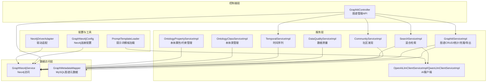
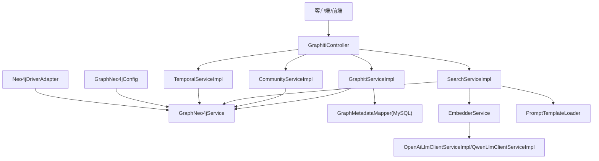
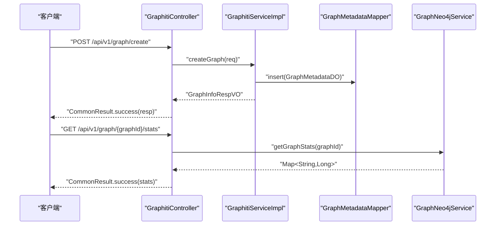
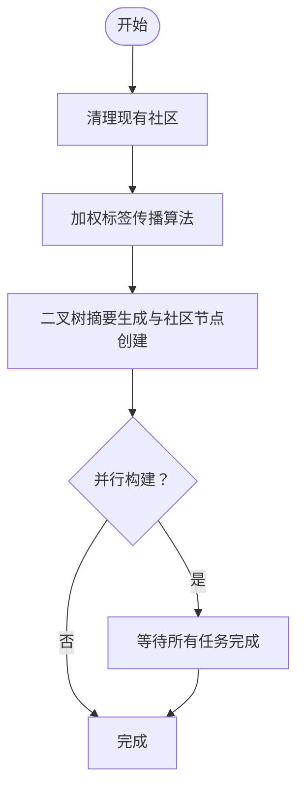
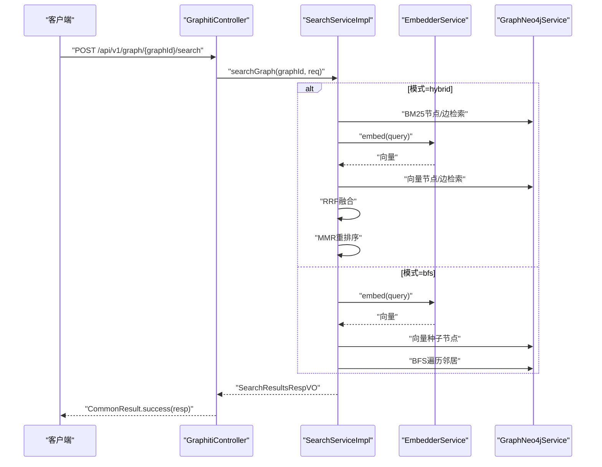
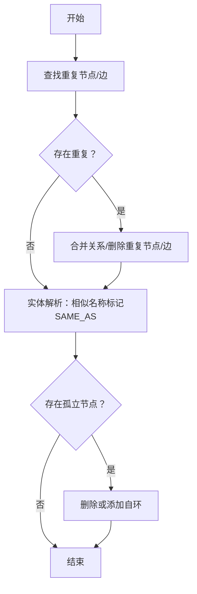
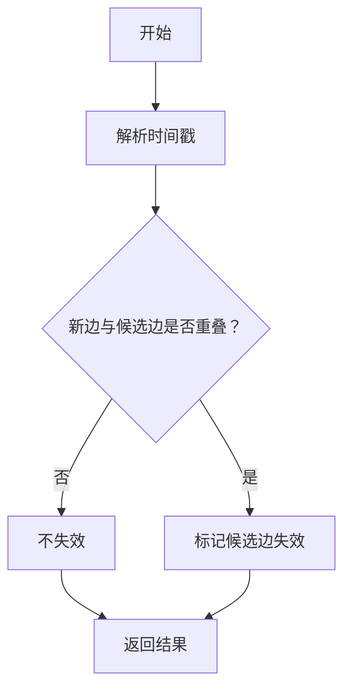
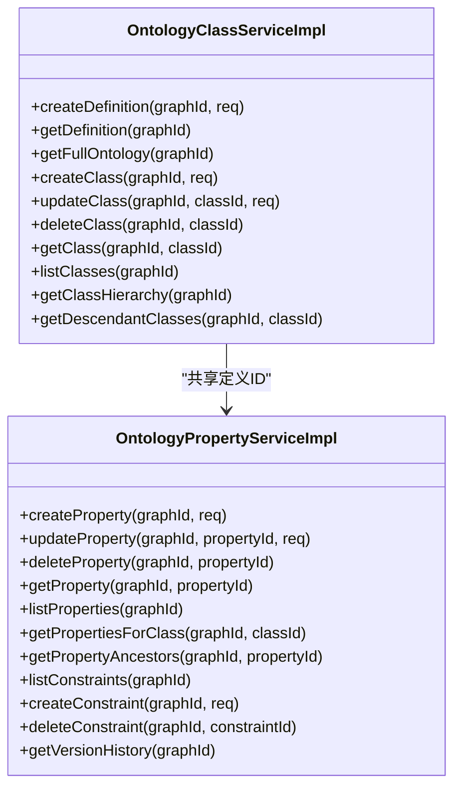
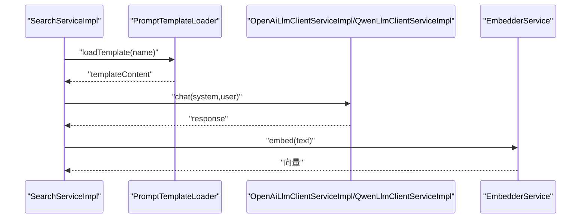
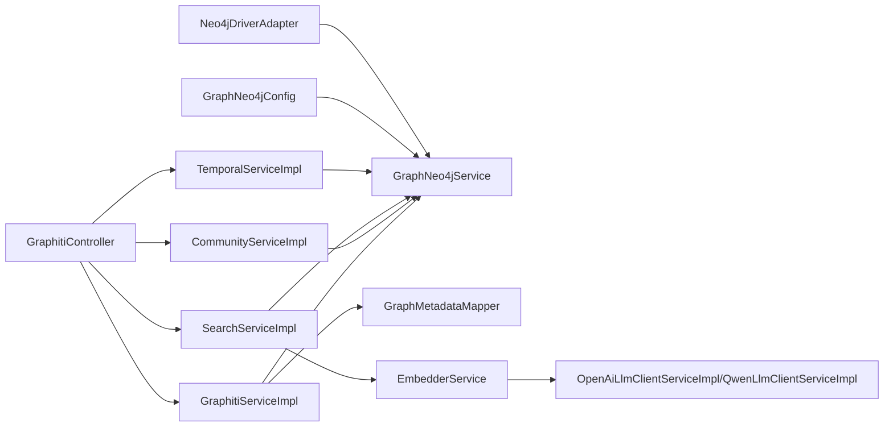

# 核心业务模块 (ontograph-module-core)

<!--<cite>
**本文档引用的文件**
- [GraphitiController.java](file://ontograph-module-core/src/main/java/com/graphiti/module/graphiti/controller/admin/GraphitiController.java)
- [GraphitiServiceImpl.java](file://ontograph-module-core/src/main/java/com/graphiti/module/graphiti/service/impl/GraphitiServiceImpl.java)
- [GraphNeo4jConfig.java](file://ontograph-module-core/src/main/java/com/graphiti/module/graphiti/config/GraphNeo4jConfig.java)
- [Neo4jDriverAdapter.java](file://ontograph-module-core/src/main/java/com/graphiti/module/graphiti/service/impl/Neo4jDriverAdapter.java)
- [CommunityServiceImpl.java](file://ontograph-module-core/src/main/java/com/graphiti/module/graphiti/service/impl/CommunityServiceImpl.java)
- [OpenAiLlmClientServiceImpl.java](file://ontograph-module-core/src/main/java/com/graphiti/module/graphiti/service/impl/ai/OpenAiLlmClientServiceImpl.java)
- [QwenLlmClientServiceImpl.java](file://ontograph-module-core/src/main/java/com/graphiti/module/graphiti/service/impl/ai/QwenLlmClientServiceImpl.java)
- [PromptTemplateLoader.java](file://ontograph-module-core/src/main/java/com/graphiti/module/graphiti/util/PromptTemplateLoader.java)
- [DataQualityServiceImpl.java](file://ontograph-module-core/src/main/java/com/graphiti/module/graphiti/service/impl/DataQualityServiceImpl.java)
- [SearchServiceImpl.java](file://ontograph-module-core/src/main/java/com/graphiti/module/graphiti/service/impl/SearchServiceImpl.java)
- [EmbedderService.java](file://ontograph-module-core/src/main/java/com/graphiti/module/graphiti/service/EmbedderService.java)
- [OntologyClassServiceImpl.java](file://ontograph-module-core/src/main/java/com/graphiti/module/graphiti/service/impl/OntologyClassServiceImpl.java)
- [OntologyPropertyServiceImpl.java](file://ontograph-module-core/src/main/java/com/graphiti/module/graphiti/service/impl/OntologyPropertyServiceImpl.java)
- [TemporalServiceImpl.java](file://ontograph-module-core/src/main/java/com/graphiti/module/graphiti/service/impl/TemporalServiceImpl.java)
</cite>-->

## 目录
1. [简介](#简介)
2. [项目结构](#项目结构)
3. [核心组件](#核心组件)
4. [架构总览](#架构总览)
5. [详细组件分析](#详细组件分析)
6. [依赖分析](#依赖分析)
7. [性能考虑](#性能考虑)
8. [故障排查指南](#故障排查指南)
9. [结论](#结论)
10. [附录](#附录)

## 简介
本文件为 ontograph-java 核心业务模块的深度技术文档，聚焦知识图谱管理、实体关系抽取、社区发现、时间序列管理、本体系统、搜索引擎等核心功能，系统阐述控制器层 Admin 控制器设计、服务层复杂业务逻辑、数据访问层多数据库支持，并深入解释 Neo4j 图数据库集成、向量嵌入系统、AI 服务提供商集成等关键技术。文档同时覆盖提示词模板管理、数据质量保证、搜索算法优化等高级能力，提供完整的 API 接口说明、业务流程图与数据流图，包含实际使用案例、性能优化建议与故障排查指南，面向开发者提供可操作的实现细节与扩展开发指导。

## 项目结构
核心模块采用分层架构：控制器层负责对外暴露 REST API；服务层封装复杂业务逻辑；数据访问层对接 MySQL 与 Neo4j；工具与适配层提供通用算法与驱动适配。关键目录与职责如下：
- controller/admin：Admin 控制器，提供图谱管理、实体/边管理、社区发现、搜索、时间序列等接口
- service/impl：服务实现，包含图谱管理、社区发现、数据质量、搜索、本体、时间序列、AI 适配等
- config：外部系统配置，如 Neo4j 连接配置
- util：通用工具，如提示词模板加载、向量检索辅助等
- vo/dal：视图对象与数据访问对象，支撑服务层与数据库交互

图表来源
- [GraphitiController.java:1-235](file://ontograph-module-core/src/main/java/com/graphiti/module/graphiti/controller/admin/GraphitiController.java#L1-L235)
- [GraphitiServiceImpl.java:1-256](file://ontograph-module-core/src/main/java/com/graphiti/module/graphiti/service/impl/GraphitiServiceImpl.java#L1-L256)
- [CommunityServiceImpl.java:1-289](file://ontograph-module-core/src/main/java/com/graphiti/module/graphiti/service/impl/CommunityServiceImpl.java#L1-L289)
- [SearchServiceImpl.java:1-520](file://ontograph-module-core/src/main/java/com/graphiti/module/graphiti/service/impl/SearchServiceImpl.java#L1-L520)
- [DataQualityServiceImpl.java:1-219](file://ontograph-module-core/src/main/java/com/graphiti/module/graphiti/service/impl/DataQualityServiceImpl.java#L1-L219)
- [TemporalServiceImpl.java:1-160](file://ontograph-module-core/src/main/java/com/graphiti/module/graphiti/service/impl/TemporalServiceImpl.java#L1-L160)
- [OntologyClassServiceImpl.java:1-368](file://ontograph-module-core/src/main/java/com/graphiti/module/graphiti/service/impl/OntologyClassServiceImpl.java#L1-L368)
- [OntologyPropertyServiceImpl.java:1-374](file://ontograph-module-core/src/main/java/com/graphiti/module/graphiti/service/impl/OntologyPropertyServiceImpl.java#L1-L374)
- [OpenAiLlmClientServiceImpl.java:1-111](file://ontograph-module-core/src/main/java/com/graphiti/module/graphiti/service/impl/ai/OpenAiLlmClientServiceImpl.java#L1-L111)
- [QwenLlmClientServiceImpl.java:1-98](file://ontograph-module-core/src/main/java/com/graphiti/module/graphiti/service/impl/ai/QwenLlmClientServiceImpl.java#L1-L98)
- [GraphNeo4jConfig.java:1-47](file://ontograph-module-core/src/main/java/com/graphiti/module/graphiti/config/GraphNeo4jConfig.java#L1-L47)
- [Neo4jDriverAdapter.java:1-84](file://ontograph-module-core/src/main/java/com/graphiti/module/graphiti/service/impl/Neo4jDriverAdapter.java#L1-L84)
- [PromptTemplateLoader.java:1-87](file://ontograph-module-core/src/main/java/com/graphiti/module/graphiti/util/PromptTemplateLoader.java#L1-L87)

章节来源
- [GraphitiController.java:1-235](file://ontograph-module-core/src/main/java/com/graphiti/module/graphiti/controller/admin/GraphitiController.java#L1-L235)
- [GraphitiServiceImpl.java:1-256](file://ontograph-module-core/src/main/java/com/graphiti/module/graphiti/service/impl/GraphitiServiceImpl.java#L1-L256)

## 核心组件
- 知识图谱管理：提供图谱的创建、查询、更新、删除、清空、克隆、导出与统计，结合 MySQL 元数据与 Neo4j 图数据双轨存储
- 实体关系抽取：通过 AI 客户端与提示词模板加载器，结合向量嵌入与全文检索，实现实体与关系抽取
- 社区发现：基于加权标签传播与二叉树摘要生成，构建社区节点并建立成员关联
- 时间序列管理：维护实体/关系的有效性时间窗口，支持历史快照查询与矛盾消解
- 本体系统：提供本体定义、类层次、属性与约束的全生命周期管理，并记录版本历史
- 搜索引擎：混合检索（BM25 + 向量 + RRF + MMR + BFS），支持上下文记忆与重排序
- 数据质量保证：节点/边去重、实体解析、孤立节点处理等清洗能力
- 多数据库支持：MySQL 存储元数据与本体定义，Neo4j 存储图数据与向量索引

章节来源
- [GraphitiServiceImpl.java:1-256](file://ontograph-module-core/src/main/java/com/graphiti/module/graphiti/service/impl/GraphitiServiceImpl.java#L1-L256)
- [CommunityServiceImpl.java:1-289](file://ontograph-module-core/src/main/java/com/graphiti/module/graphiti/service/impl/CommunityServiceImpl.java#L1-L289)
- [SearchServiceImpl.java:1-520](file://ontograph-module-core/src/main/java/com/graphiti/module/graphiti/service/impl/SearchServiceImpl.java#L1-L520)
- [DataQualityServiceImpl.java:1-219](file://ontograph-module-core/src/main/java/com/graphiti/module/graphiti/service/impl/DataQualityServiceImpl.java#L1-L219)
- [TemporalServiceImpl.java:1-160](file://ontograph-module-core/src/main/java/com/graphiti/module/graphiti/service/impl/TemporalServiceImpl.java#L1-L160)
- [OntologyClassServiceImpl.java:1-368](file://ontograph-module-core/src/main/java/com/graphiti/module/graphiti/service/impl/OntologyClassServiceImpl.java#L1-L368)
- [OntologyPropertyServiceImpl.java:1-374](file://ontograph-module-core/src/main/java/com/graphiti/module/graphiti/service/impl/OntologyPropertyServiceImpl.java#L1-L374)

## 架构总览
下图展示核心模块的系统架构与组件交互关系，突出控制器、服务、数据访问与外部系统（Neo4j、AI Provider）之间的协作。

图表来源
- [GraphitiController.java:1-235](file://ontograph-module-core/src/main/java/com/graphiti/module/graphiti/controller/admin/GraphitiController.java#L1-L235)
- [GraphitiServiceImpl.java:1-256](file://ontograph-module-core/src/main/java/com/graphiti/module/graphiti/service/impl/GraphitiServiceImpl.java#L1-L256)
- [CommunityServiceImpl.java:1-289](file://ontograph-module-core/src/main/java/com/graphiti/module/graphiti/service/impl/CommunityServiceImpl.java#L1-L289)
- [SearchServiceImpl.java:1-520](file://ontograph-module-core/src/main/java/com/graphiti/module/graphiti/service/impl/SearchServiceImpl.java#L1-L520)
- [TemporalServiceImpl.java:1-160](file://ontograph-module-core/src/main/java/com/graphiti/module/graphiti/service/impl/TemporalServiceImpl.java#L1-L160)
- [GraphNeo4jConfig.java:1-47](file://ontograph-module-core/src/main/java/com/graphiti/module/graphiti/config/GraphNeo4jConfig.java#L1-L47)
- [Neo4jDriverAdapter.java:1-84](file://ontograph-module-core/src/main/java/com/graphiti/module/graphiti/service/impl/Neo4jDriverAdapter.java#L1-L84)
- [OpenAiLlmClientServiceImpl.java:1-111](file://ontograph-module-core/src/main/java/com/graphiti/module/graphiti/service/impl/ai/OpenAiLlmClientServiceImpl.java#L1-L111)
- [QwenLlmClientServiceImpl.java:1-98](file://ontograph-module-core/src/main/java/com/graphiti/module/graphiti/service/impl/ai/QwenLlmClientServiceImpl.java#L1-L98)
- [PromptTemplateLoader.java:1-87](file://ontograph-module-core/src/main/java/com/graphiti/module/graphiti/util/PromptTemplateLoader.java#L1-L87)
- [EmbedderService.java:1-41](file://ontograph-module-core/src/main/java/com/graphiti/module/graphiti/service/EmbedderService.java#L1-L41)

## 详细组件分析

### 知识图谱管理（GraphitiController 与 GraphitiServiceImpl）
- 控制器层提供图谱的创建、列表、详情、更新、删除、清空、统计、克隆、导出、节点/边列表、社区构建与搜索、历史状态查询等接口
- 服务层实现图谱元数据的持久化与统计聚合，调用 Neo4j 服务完成数据克隆与导出
- 统一返回结构由公共响应包装类提供，确保前后端一致的契约

图表来源
- [GraphitiController.java:50-139](file://ontograph-module-core/src/main/java/com/graphiti/module/graphiti/controller/admin/GraphitiController.java#L50-L139)
- [GraphitiServiceImpl.java:30-158](file://ontograph-module-core/src/main/java/com/graphiti/module/graphiti/service/impl/GraphitiServiceImpl.java#L30-L158)

章节来源
- [GraphitiController.java:1-235](file://ontograph-module-core/src/main/java/com/graphiti/module/graphiti/controller/admin/GraphitiController.java#L1-L235)
- [GraphitiServiceImpl.java:1-256](file://ontograph-module-core/src/main/java/com/graphiti/module/graphiti/service/impl/GraphitiServiceImpl.java#L1-L256)

### 社区发现（CommunityServiceImpl）
- 算法流程：加权标签传播检测社区，二叉树合并策略生成摘要并创建社区节点，支持并行构建与错误处理
- 与 LLM 协作：摘要生成与社区命名由 LLM 客户端完成，提升语义一致性
- 与 Neo4j 协作：通过 Cypher 查询构建图结构、写入社区节点与成员关系

图表来源
- [CommunityServiceImpl.java:41-132](file://ontograph-module-core/src/main/java/com/graphiti/module/graphiti/service/impl/CommunityServiceImpl.java#L41-L132)

章节来源
- [CommunityServiceImpl.java:1-289](file://ontograph-module-core/src/main/java/com/graphiti/module/graphiti/service/impl/CommunityServiceImpl.java#L1-L289)

### 搜索引擎（SearchServiceImpl）
- 混合检索模式：BM25 全文检索、向量相似度检索、RRF 融合、MMR 重排序、BFS 图遍历
- 上下文记忆：根据对话消息提取查询，融合检索结果生成上下文
- 重排序策略：基于节点距离与提及次数的二次重排序

图表来源
- [GraphitiController.java:212-219](file://ontograph-module-core/src/main/java/com/graphiti/module/graphiti/controller/admin/GraphitiController.java#L212-L219)
- [SearchServiceImpl.java:94-148](file://ontograph-module-core/src/main/java/com/graphiti/module/graphiti/service/impl/SearchServiceImpl.java#L94-L148)

章节来源
- [SearchServiceImpl.java:1-520](file://ontograph-module-core/src/main/java/com/graphiti/module/graphiti/service/impl/SearchServiceImpl.java#L1-L520)

### 数据质量保证（DataQualityServiceImpl）
- 节点去重：同名同类型节点合并，关系迁移与重复节点删除
- 边去重：相同源目标+类型边合并为一条
- 实体解析：基于包含关系近似相似度标记 SAME_AS
- 孤立节点处理：删除或添加自环以标识孤立

图表来源
- [DataQualityServiceImpl.java:26-176](file://ontograph-module-core/src/main/java/com/graphiti/module/graphiti/service/impl/DataQualityServiceImpl.java#L26-L176)

章节来源
- [DataQualityServiceImpl.java:1-219](file://ontograph-module-core/src/main/java/com/graphiti/module/graphiti/service/impl/DataQualityServiceImpl.java#L1-L219)

### 时间序列管理（TemporalServiceImpl）
- 有效区间管理：维护实体/关系的有效时间窗口，支持失效标记与历史查询
- 矛盾消解：根据时间重叠规则判断并失效冲突边
- 历史快照：按参考时间点查询有效节点与关系集合

图表来源
- [TemporalServiceImpl.java:44-85](file://ontograph-module-core/src/main/java/com/graphiti/module/graphiti/service/impl/TemporalServiceImpl.java#L44-L85)

章节来源
- [TemporalServiceImpl.java:1-160](file://ontograph-module-core/src/main/java/com/graphiti/module/graphiti/service/impl/TemporalServiceImpl.java#L1-L160)

### 本体系统（OntologyClassServiceImpl / OntologyPropertyServiceImpl）
- 本体定义：命名空间、版本、状态与描述管理
- 类管理：URI/本地名、父类、域提示、元数据与示例
- 属性管理：域/值域类、数据类型、基数、正则/范围约束、等价/反向属性
- 约束管理：类型、值、错误信息、严重级别与描述
- 版本历史：变更类型、实体类型、前后状态与差异摘要

图表来源
- [OntologyClassServiceImpl.java:45-98](file://ontograph-module-core/src/main/java/com/graphiti/module/graphiti/service/impl/OntologyClassServiceImpl.java#L45-L98)
- [OntologyPropertyServiceImpl.java:37-182](file://ontograph-module-core/src/main/java/com/graphiti/module/graphiti/service/impl/OntologyPropertyServiceImpl.java#L37-L182)

章节来源
- [OntologyClassServiceImpl.java:1-368](file://ontograph-module-core/src/main/java/com/graphiti/module/graphiti/service/impl/OntologyClassServiceImpl.java#L1-L368)
- [OntologyPropertyServiceImpl.java:1-374](file://ontograph-module-core/src/main/java/com/graphiti/module/graphiti/service/impl/OntologyPropertyServiceImpl.java#L1-L374)

### AI 服务与提示词模板（OpenAiLlmClientServiceImpl / QwenLlmClientServiceImpl / PromptTemplateLoader）
- AI 客户端：统一 ChatClient 调用，支持系统提示与结构化输出，支持批处理
- 提示词模板：从 classpath 加载模板文件，支持变量替换，提供常用模板常量
- 驱动适配：Neo4jDriverAdapter 将图服务适配为通用驱动接口，便于扩展

图表来源
- [SearchServiceImpl.java:44-76](file://ontograph-module-core/src/main/java/com/graphiti/module/graphiti/service/impl/SearchServiceImpl.java#L44-L76)
- [PromptTemplateLoader.java:28-73](file://ontograph-module-core/src/main/java/com/graphiti/module/graphiti/util/PromptTemplateLoader.java#L28-L73)
- [OpenAiLlmClientServiceImpl.java:41-97](file://ontograph-module-core/src/main/java/com/graphiti/module/graphiti/service/impl/ai/OpenAiLlmClientServiceImpl.java#L41-L97)
- [QwenLlmClientServiceImpl.java:28-91](file://ontograph-module-core/src/main/java/com/graphiti/module/graphiti/service/impl/ai/QwenLlmClientServiceImpl.java#L28-L91)

章节来源
- [OpenAiLlmClientServiceImpl.java:1-111](file://ontograph-module-core/src/main/java/com/graphiti/module/graphiti/service/impl/ai/OpenAiLlmClientServiceImpl.java#L1-L111)
- [QwenLlmClientServiceImpl.java:1-98](file://ontograph-module-core/src/main/java/com/graphiti/module/graphiti/service/impl/ai/QwenLlmClientServiceImpl.java#L1-L98)
- [PromptTemplateLoader.java:1-87](file://ontograph-module-core/src/main/java/com/graphiti/module/graphiti/util/PromptTemplateLoader.java#L1-L87)
- [EmbedderService.java:1-41](file://ontograph-module-core/src/main/java/com/graphiti/module/graphiti/service/EmbedderService.java#L1-L41)
- [Neo4jDriverAdapter.java:1-84](file://ontograph-module-core/src/main/java/com/graphiti/module/graphiti/service/impl/Neo4jDriverAdapter.java#L1-L84)

## 依赖分析
- 控制器与服务：控制器依赖多个服务接口，服务间通过接口解耦，降低耦合度
- 服务与数据访问：服务层依赖 MySQL Mapper 与 Neo4j 服务，实现元数据与图数据的协同
- 外部系统：Neo4j 驱动通过配置类注入，AI 客户端通过条件装配选择不同提供商
- 工具与适配：提示词模板加载器与驱动适配器提供横切能力

图表来源
- [GraphitiController.java:41-48](file://ontograph-module-core/src/main/java/com/graphiti/module/graphiti/controller/admin/GraphitiController.java#L41-L48)
- [GraphitiServiceImpl.java:28-29](file://ontograph-module-core/src/main/java/com/graphiti/module/graphiti/service/impl/GraphitiServiceImpl.java#L28-L29)
- [GraphNeo4jConfig.java:41-45](file://ontograph-module-core/src/main/java/com/graphiti/module/graphiti/config/GraphNeo4jConfig.java#L41-L45)
- [Neo4jDriverAdapter.java:21-22](file://ontograph-module-core/src/main/java/com/graphiti/module/graphiti/service/impl/Neo4jDriverAdapter.java#L21-L22)

章节来源
- [GraphitiController.java:1-235](file://ontograph-module-core/src/main/java/com/graphiti/module/graphiti/controller/admin/GraphitiController.java#L1-L235)
- [GraphitiServiceImpl.java:1-256](file://ontograph-module-core/src/main/java/com/graphiti/module/graphiti/service/impl/GraphitiServiceImpl.java#L1-L256)
- [GraphNeo4jConfig.java:1-47](file://ontograph-module-core/src/main/java/com/graphiti/module/graphiti/config/GraphNeo4jConfig.java#L1-L47)
- [Neo4jDriverAdapter.java:1-84](file://ontograph-module-core/src/main/java/com/graphiti/module/graphiti/service/impl/Neo4jDriverAdapter.java#L1-L84)

## 性能考虑
- 搜索性能
  - 向量检索：确保向量维度与索引匹配，合理设置 limit 与 k 参数
  - RRF 融合：控制列表规模，避免过度融合导致的性能损耗
  - MMR 重排序：仅在必要场景启用，减少计算开销
  - BFS 遍历：限制深度与最大邻居数，防止图遍历爆炸
- 社区发现
  - 并发控制：通过 MAX_CONCURRENCY 控制社区构建并发度，避免资源争用
  - 二叉树摘要：批量摘要生成建议分批处理，避免长耗时阻塞
- 数据质量
  - 去重与解析：批量处理时注意事务边界，避免长时间锁表
  - 孤立节点：优先采用自环策略，减少大规模删除带来的图破坏
- Neo4j
  - 会话复用：驱动适配器统一使用会话执行 Cypher，减少连接开销
  - 索引与向量索引：确保全文索引与向量索引命中率，定期维护
- AI 与嵌入
  - 批量调用：利用批处理接口减少往返开销
  - 缓存与降级：对频繁请求的结果进行缓存，异常时快速降级

## 故障排查指南
- Neo4j 连接失败
  - 检查连接配置项（URI、用户名、密码）是否正确
  - 确认网络连通性与防火墙策略
  - 查看驱动适配器是否正常注入
- 搜索结果为空
  - 确认查询模式与 groupIds 是否正确传入
  - 检查向量嵌入服务可用性与维度匹配
  - 核对 BM25/向量索引是否建立
- 社区构建异常
  - 查看标签传播迭代次数与社区规模阈值
  - 检查 LLM 客户端可用性与超时设置
- 数据质量任务失败
  - 检查重复节点/边的匹配条件与删除策略
  - 确认关系迁移的原子性与一致性
- 本体管理异常
  - 校验定义状态与父子关系完整性
  - 检查约束引用与版本历史记录
- 时间序列问题
  - 核对时间戳解析与毫秒单位一致性
  - 检查失效标记与历史查询逻辑

章节来源
- [GraphNeo4jConfig.java:21-45](file://ontograph-module-core/src/main/java/com/graphiti/module/graphiti/config/GraphNeo4jConfig.java#L21-L45)
- [Neo4jDriverAdapter.java:38-41](file://ontograph-module-core/src/main/java/com/graphiti/module/graphiti/service/impl/Neo4jDriverAdapter.java#L38-L41)
- [SearchServiceImpl.java:94-148](file://ontograph-module-core/src/main/java/com/graphiti/module/graphiti/service/impl/SearchServiceImpl.java#L94-L148)
- [CommunityServiceImpl.java:116-132](file://ontograph-module-core/src/main/java/com/graphiti/module/graphiti/service/impl/CommunityServiceImpl.java#L116-L132)
- [DataQualityServiceImpl.java:178-218](file://ontograph-module-core/src/main/java/com/graphiti/module/graphiti/service/impl/DataQualityServiceImpl.java#L178-L218)
- [TemporalServiceImpl.java:134-158](file://ontograph-module-core/src/main/java/com/graphiti/module/graphiti/service/impl/TemporalServiceImpl.java#L134-L158)

## 结论
本模块通过清晰的分层设计与强大的外部系统集成，实现了从知识图谱管理到社区发现、从本体治理到时间序列与搜索的完整闭环。Neo4j 的图模型与向量索引、AI 客户端与提示词模板、以及完善的质量与版本管理机制共同构成了可扩展、高性能、易维护的核心能力。建议在生产环境中重点关注索引与向量索引的维护、并发与批处理策略、以及异常与降级机制的完善。

## 附录
- API 接口概览（节选）
  - 图谱管理：创建、列表、详情、更新、删除、清空、统计、克隆、导出、节点/边列表、历史状态查询
  - 社区管理：构建社区、列出社区、搜索社区
  - 搜索：图内搜索（支持多种模式与重排序）
  - 时间序列：失效标记、矛盾消解、历史快照、事实历史
  - 本体：定义、类、属性、约束、版本历史
- 使用案例
  - 快速构建法律知识图谱：导入本体定义 → 导入法律数据 → 实体关系抽取 → 社区发现 → 搜索与推理
  - 数据清洗与质量保障：运行节点/边去重 → 实体解析 → 孤立节点处理 → 导出清洗报告
  - 历史回溯与审计：按时间点查询有效事实 → 分析矛盾边 → 生成版本历史
- 扩展开发建议
  - 新增 AI Provider：实现 LlmClientService 接口并通过条件注解注册
  - 新增嵌入 Provider：实现 EmbedderService 接口并接入向量索引
  - 新增检索模式：在 SearchServiceImpl 中扩展模式分支与重排序策略
  - 新增本体约束：在 OntologyPropertyServiceImpl 中扩展约束类型与校验逻辑