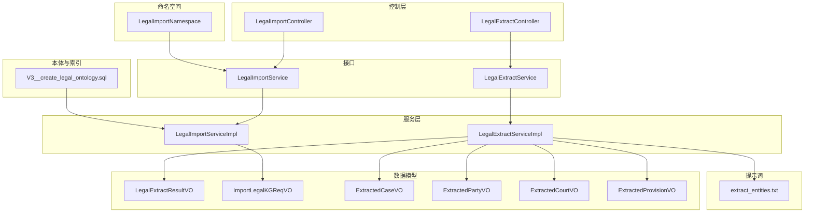
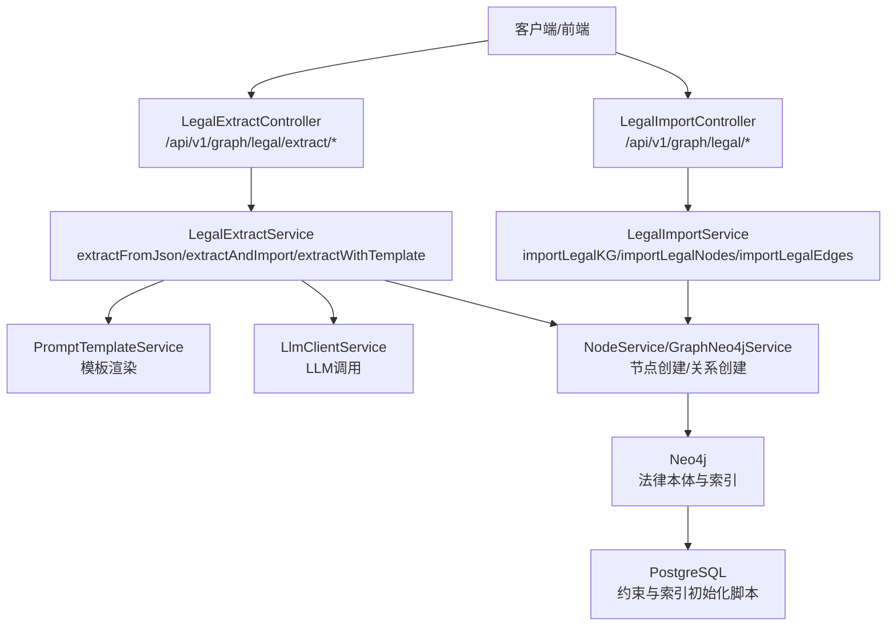
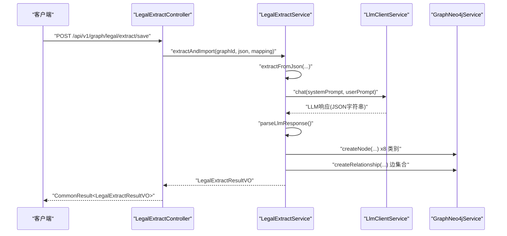
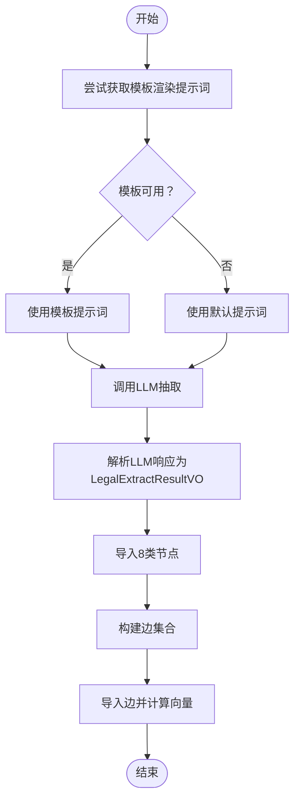
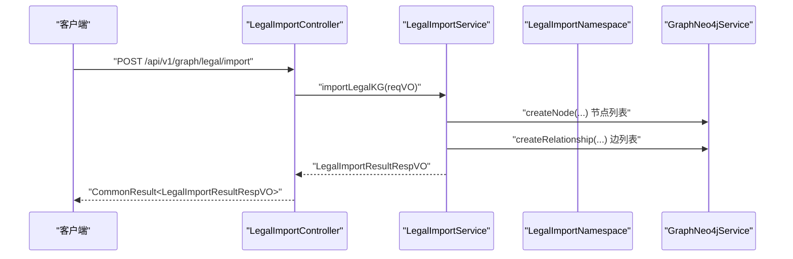
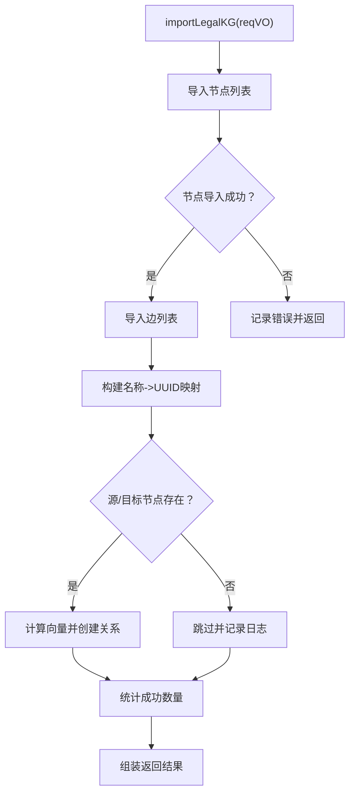
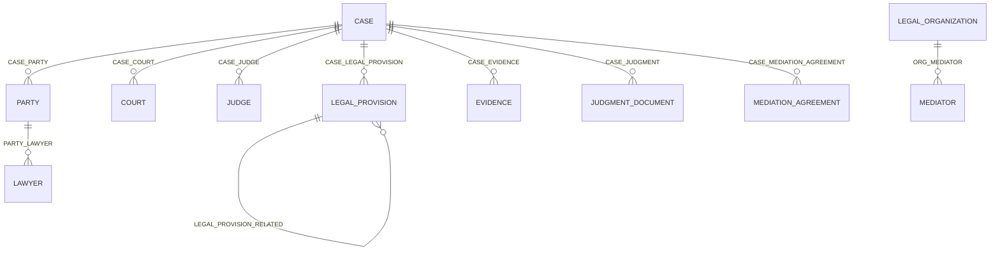
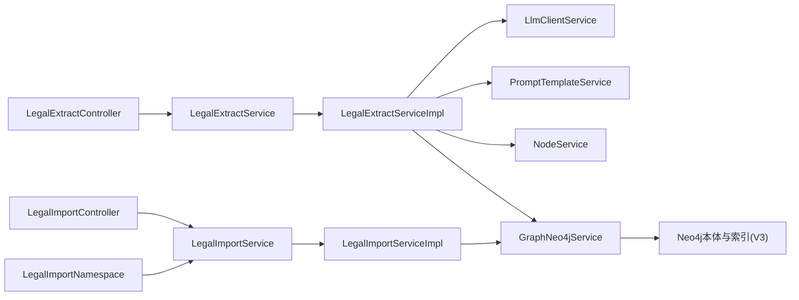

# 法律知识图谱

<cite>
**本文引用的文件**
- [LegalExtractController.java](file://graphiti-module-core/src/main/java/com/graphiti/module/graphiti/controller/admin/LegalExtractController.java)
- [LegalImportController.java](file://graphiti-module-core/src/main/java/com/graphiti/module/graphiti/controller/admin/LegalImportController.java)
- [LegalExtractServiceImpl.java](file://graphiti-module-core/src/main/java/com/graphiti/module/graphiti/service/impl/LegalExtractServiceImpl.java)
- [LegalImportServiceImpl.java](file://graphiti-module-core/src/main/java/com/graphiti/module/graphiti/service/impl/LegalImportServiceImpl.java)
- [LegalImportNamespace.java](file://graphiti-module-core/src/main/java/com/graphiti/module/graphiti/namespace/LegalImportNamespace.java)
- [LegalExtractService.java](file://graphiti-module-core/src/main/java/com/graphiti/module/graphiti/service/LegalExtractService.java)
- [LegalImportService.java](file://graphiti-module-core/src/main/java/com/graphiti/module/graphiti/service/LegalImportService.java)
- [LegalExtractResultVO.java](file://graphiti-module-core/src/main/java/com/graphiti/module/graphiti/vo/legal/LegalExtractResultVO.java)
- [ImportLegalKGReqVO.java](file://graphiti-module-core/src/main/java/com/graphiti/module/graphiti/vo/legal/ImportLegalKGReqVO.java)
- [ExtractedCaseVO.java](file://graphiti-module-core/src/main/java/com/graphiti/module/graphiti/vo/legal/ExtractedCaseVO.java)
- [ExtractedPartyVO.java](file://graphiti-module-core/src/main/java/com/graphiti/module/graphiti/vo/legal/ExtractedPartyVO.java)
- [ExtractedCourtVO.java](file://graphiti-module-core/src/main/java/com/graphiti/module/graphiti/vo/legal/ExtractedCourtVO.java)
- [ExtractedProvisionVO.java](file://graphiti-module-core/src/main/java/com/graphiti/module/graphiti/vo/legal/ExtractedProvisionVO.java)
- [extract_entities.txt](file://graphiti-module-core/src/main/resources/prompts/extract_entities.txt)
- [V3__create_legal_ontology.sql](file://sql/postgresql/V3__create_legal_ontology.sql)
</cite>

## 目录
1. [简介](#简介)
2. [项目结构](#项目结构)
3. [核心组件](#核心组件)
4. [架构总览](#架构总览)
5. [详细组件分析](#详细组件分析)
6. [依赖分析](#依赖分析)
7. [性能考虑](#性能考虑)
8. [故障排查指南](#故障排查指南)
9. [结论](#结论)
10. [附录](#附录)

## 简介
本文件面向开发者，系统化阐述法律知识图谱系统的实现与扩展，重点覆盖以下能力：
- 法律文本抽取：从结构化JSON中抽取法律实体与关系，支持模板驱动与字段映射。
- 法律KG导入：批量导入节点与边，支持一键导入法条与示例案例。
- 法律实体识别与关系推理：基于LLM与提示词模板抽取，结合Neo4j本体约束与索引。
- 法律本体设计与规则推理：基于PostgreSQL初始化脚本定义的标签、属性与索引。
- 高级功能：数据标准化、实体消歧、关系验证、嵌入向量化、导出与进度监控。

## 项目结构
法律知识图谱模块位于 graphiti-module-core，采用“控制层-服务层-命名空间-VO/DAO”的分层设计，配合Neo4j与PostgreSQL完成本体与数据持久化。

图表来源
- [LegalExtractController.java:1-408](file://graphiti-module-core/src/main/java/com/graphiti/module/graphiti/controller/admin/LegalExtractController.java#L1-L408)
- [LegalImportController.java:1-136](file://graphiti-module-core/src/main/java/com/graphiti/module/graphiti/controller/admin/LegalImportController.java#L1-L136)
- [LegalExtractServiceImpl.java:1-820](file://graphiti-module-core/src/main/java/com/graphiti/module/graphiti/service/impl/LegalExtractServiceImpl.java#L1-L820)
- [LegalImportServiceImpl.java:1-467](file://graphiti-module-core/src/main/java/com/graphiti/module/graphiti/service/impl/LegalImportServiceImpl.java#L1-L467)
- [LegalImportNamespace.java:1-82](file://graphiti-module-core/src/main/java/com/graphiti/module/graphiti/namespace/LegalImportNamespace.java#L1-L82)
- [LegalExtractResultVO.java:1-81](file://graphiti-module-core/src/main/java/com/graphiti/module/graphiti/vo/legal/LegalExtractResultVO.java#L1-L81)
- [ImportLegalKGReqVO.java:1-29](file://graphiti-module-core/src/main/java/com/graphiti/module/graphiti/vo/legal/ImportLegalKGReqVO.java#L1-L29)
- [ExtractedCaseVO.java:1-41](file://graphiti-module-core/src/main/java/com/graphiti/module/graphiti/vo/legal/ExtractedCaseVO.java#L1-L41)
- [ExtractedPartyVO.java:1-37](file://graphiti-module-core/src/main/java/com/graphiti/module/graphiti/vo/legal/ExtractedPartyVO.java#L1-L37)
- [ExtractedCourtVO.java:1-33](file://graphiti-module-core/src/main/java/com/graphiti/module/graphiti/vo/legal/ExtractedCourtVO.java#L1-L33)
- [ExtractedProvisionVO.java:1-37](file://graphiti-module-core/src/main/java/com/graphiti/module/graphiti/vo/legal/ExtractedProvisionVO.java#L1-L37)
- [extract_entities.txt:1-28](file://graphiti-module-core/src/main/resources/prompts/extract_entities.txt#L1-L28)
- [V3__create_legal_ontology.sql:1-611](file://sql/postgresql/V3__create_legal_ontology.sql#L1-L611)

章节来源
- [LegalExtractController.java:1-408](file://graphiti-module-core/src/main/java/com/graphiti/module/graphiti/controller/admin/LegalExtractController.java#L1-L408)
- [LegalImportController.java:1-136](file://graphiti-module-core/src/main/java/com/graphiti/module/graphiti/controller/admin/LegalImportController.java#L1-L136)

## 核心组件
- 控制器层
  - LegalExtractController：提供JSON预览、字段映射、模板提取、提取并保存、本体字段列表、模板列表等接口。
  - LegalImportController：提供批量导入节点/边、一键导入法条、导入示例案例、导出图谱等接口。
- 服务层
  - LegalExtractService/LegalExtractServiceImpl：从JSON抽取实体与关系，支持模板与字段映射，解析LLM输出，导入Neo4j并构建边。
  - LegalImportService/LegalImportServiceImpl：批量导入节点/边，构建名称到UUID映射，计算边向量，导出图谱。
- 命名空间
  - LegalImportNamespace：封装导入操作，便于统一调用与日志记录。
- 数据模型
  - LegalExtractResultVO：抽取结果聚合，含各类实体列表、错误信息、统计。
  - ImportLegalKGReqVO：批量导入请求载体。
  - 各Extracted*VO：抽取后的实体结构化表示。
- 提示词
  - extract_entities.txt：通用实体抽取提示词模板样例，用于实体识别基础能力。
- 本体与索引
  - V3__create_legal_ontology.sql：定义Neo4j标签、唯一约束、索引与示例数据，支撑法律本体。

章节来源
- [LegalExtractService.java:1-72](file://graphiti-module-core/src/main/java/com/graphiti/module/graphiti/service/LegalExtractService.java#L1-L72)
- [LegalImportService.java:1-48](file://graphiti-module-core/src/main/java/com/graphiti/module/graphiti/service/LegalImportService.java#L1-L48)
- [LegalExtractResultVO.java:1-81](file://graphiti-module-core/src/main/java/com/graphiti/module/graphiti/vo/legal/LegalExtractResultVO.java#L1-L81)
- [ImportLegalKGReqVO.java:1-29](file://graphiti-module-core/src/main/java/com/graphiti/module/graphiti/vo/legal/ImportLegalKGReqVO.java#L1-L29)
- [ExtractedCaseVO.java:1-41](file://graphiti-module-core/src/main/java/com/graphiti/module/graphiti/vo/legal/ExtractedCaseVO.java#L1-L41)
- [ExtractedPartyVO.java:1-37](file://graphiti-module-core/src/main/java/com/graphiti/module/graphiti/vo/legal/ExtractedPartyVO.java#L1-L37)
- [ExtractedCourtVO.java:1-33](file://graphiti-module-core/src/main/java/com/graphiti/module/graphiti/vo/legal/ExtractedCourtVO.java#L1-L33)
- [ExtractedProvisionVO.java:1-37](file://graphiti-module-core/src/main/java/com/graphiti/module/graphiti/vo/legal/ExtractedProvisionVO.java#L1-L37)
- [extract_entities.txt:1-28](file://graphiti-module-core/src/main/resources/prompts/extract_entities.txt#L1-L28)
- [V3__create_legal_ontology.sql:1-611](file://sql/postgresql/V3__create_legal_ontology.sql#L1-L611)

## 架构总览
法律知识图谱系统采用“控制器-服务-命名空间-数据模型-提示词-本体”的分层架构，结合Neo4j与PostgreSQL完成知识抽取、存储与检索。

图表来源
- [LegalExtractController.java:1-408](file://graphiti-module-core/src/main/java/com/graphiti/module/graphiti/controller/admin/LegalExtractController.java#L1-L408)
- [LegalImportController.java:1-136](file://graphiti-module-core/src/main/java/com/graphiti/module/graphiti/controller/admin/LegalImportController.java#L1-L136)
- [LegalExtractServiceImpl.java:1-820](file://graphiti-module-core/src/main/java/com/graphiti/module/graphiti/service/impl/LegalExtractServiceImpl.java#L1-L820)
- [LegalImportServiceImpl.java:1-467](file://graphiti-module-core/src/main/java/com/graphiti/module/graphiti/service/impl/LegalImportServiceImpl.java#L1-L467)
- [V3__create_legal_ontology.sql:1-611](file://sql/postgresql/V3__create_legal_ontology.sql#L1-L611)

## 详细组件分析

### LegalExtractController：法律文本抽取API设计
- 接口概览
  - POST /api/v1/graph/legal/extract/preview：上传JSON文件，返回字段树、样本数据、内容预览。
  - POST /api/v1/graph/legal/extract：根据字段映射或模板提取实体（不保存）。
  - POST /api/v1/graph/legal/extract/save：提取并直接导入Neo4j。
  - GET /api/v1/graph/legal/extract/ontology-fields：返回本体字段定义，供前端映射。
  - GET /api/v1/graph/legal/extract/templates：返回可用模板列表与默认提示词。
- 关键流程
  - JSON解析与字段树构建：递归遍历对象/数组，统计字段与节点数量，提取样本。
  - 字段映射与模板选择：优先使用模板渲染提示词，否则回退默认提示词。
  - LLM调用与结果解析：清理LLM输出中的JSON片段，反序列化为LegalExtractResultVO。
  - 导入流程：逐类导入节点，构建边并写入Neo4j，计算向量嵌入。

图表来源
- [LegalExtractController.java:90-152](file://graphiti-module-core/src/main/java/com/graphiti/module/graphiti/controller/admin/LegalExtractController.java#L90-L152)
- [LegalExtractServiceImpl.java:75-206](file://graphiti-module-core/src/main/java/com/graphiti/module/graphiti/service/impl/LegalExtractServiceImpl.java#L75-L206)

章节来源
- [LegalExtractController.java:48-152](file://graphiti-module-core/src/main/java/com/graphiti/module/graphiti/controller/admin/LegalExtractController.java#L48-L152)

### LegalExtractServiceImpl：抽取与导入服务逻辑
- 提示词模板与默认提示词
  - 支持通过模板编码获取渲染后的提示词，若不可用则回退默认提示词。
  - 默认提示词包含法律实体类型定义、字段映射规则、日期/金额格式化要求。
- JSON字段映射
  - 从JSON路径提取字段值，构造用户提示词，确保抽取字段与本体一致。
- LLM响应解析
  - 从LLM响应中提取JSON片段，反序列化为LegalExtractResultVO，统计节点总数。
- 节点导入
  - 分别导入Case、Party、Court、Judge、LegalProvision、Lawyer、Evidence、JudgmentDocument八类节点，设置name/type/summary/properties。
- 边构建与导入
  - 构建案件-当事人、案件-法院、案件-法官等边，计算fact向量，写入Neo4j。

图表来源
- [LegalExtractServiceImpl.java:75-206](file://graphiti-module-core/src/main/java/com/graphiti/module/graphiti/service/impl/LegalExtractServiceImpl.java#L75-L206)
- [LegalExtractServiceImpl.java:390-736](file://graphiti-module-core/src/main/java/com/graphiti/module/graphiti/service/impl/LegalExtractServiceImpl.java#L390-L736)

章节来源
- [LegalExtractServiceImpl.java:16-122](file://graphiti-module-core/src/main/java/com/graphiti/module/graphiti/service/impl/LegalExtractServiceImpl.java#L16-L122)
- [LegalExtractServiceImpl.java:166-206](file://graphiti-module-core/src/main/java/com/graphiti/module/graphiti/service/impl/LegalExtractServiceImpl.java#L166-L206)
- [LegalExtractServiceImpl.java:208-337](file://graphiti-module-core/src/main/java/com/graphiti/module/graphiti/service/impl/LegalExtractServiceImpl.java#L208-L337)
- [LegalExtractServiceImpl.java:390-736](file://graphiti-module-core/src/main/java/com/graphiti/module/graphiti/service/impl/LegalExtractServiceImpl.java#L390-L736)

### LegalImportController：批量导入API设计
- 接口概览
  - POST /api/v1/graph/legal/import：一次性导入节点与边。
  - POST /api/v1/graph/legal/nodes：批量导入节点。
  - POST /api/v1/graph/legal/edges：批量导入边。
  - POST /api/v1/graph/legal/provisions：一键导入商事调解条例33条法条。
  - POST /api/v1/graph/legal/cases：导入示例案例数据。
  - GET /api/v1/graph/legal/export：导出图谱为JSON。
- 导入策略
  - 先导入节点，再导入边；边导入前构建名称->UUID映射，缺失则跳过。
  - 计算边的向量嵌入，写入Neo4j。

图表来源
- [LegalImportController.java:44-56](file://graphiti-module-core/src/main/java/com/graphiti/module/graphiti/controller/admin/LegalImportController.java#L44-L56)
- [LegalImportServiceImpl.java:28-61](file://graphiti-module-core/src/main/java/com/graphiti/module/graphiti/service/impl/LegalImportServiceImpl.java#L28-L61)

章节来源
- [LegalImportController.java:42-134](file://graphiti-module-core/src/main/java/com/graphiti/module/graphiti/controller/admin/LegalImportController.java#L42-L134)

### LegalImportServiceImpl：批量导入服务逻辑
- importLegalKG：先导入节点，再导入边，收集错误信息。
- importLegalNodes：逐条创建节点，记录失败数量。
- importLegalEdges：构建名称->UUID映射，校验源/目标节点存在性，计算向量并创建关系。
- 导入预置数据：商事调解条例33条法条、示例案例与关联实体。
- 导出图谱：列出节点与边，返回JSON结构。

图表来源
- [LegalImportServiceImpl.java:28-61](file://graphiti-module-core/src/main/java/com/graphiti/module/graphiti/service/impl/LegalImportServiceImpl.java#L28-L61)
- [LegalImportServiceImpl.java:63-127](file://graphiti-module-core/src/main/java/com/graphiti/module/graphiti/service/impl/LegalImportServiceImpl.java#L63-L127)
- [LegalImportServiceImpl.java:129-150](file://graphiti-module-core/src/main/java/com/graphiti/module/graphiti/service/impl/LegalImportServiceImpl.java#L129-L150)
- [LegalImportServiceImpl.java:152-168](file://graphiti-module-core/src/main/java/com/graphiti/module/graphiti/service/impl/LegalImportServiceImpl.java#L152-L168)

章节来源
- [LegalImportServiceImpl.java:1-467](file://graphiti-module-core/src/main/java/com/graphiti/module/graphiti/service/impl/LegalImportServiceImpl.java#L1-L467)

### LegalImportNamespace：命名空间管理
- 统一封装导入操作，便于外部调用与日志追踪。
- 方法包括：importLegalKG、importLegalNodes、importLegalEdges、importCommercialMediationProvisions、importSampleCases、exportLegalKG。

章节来源
- [LegalImportNamespace.java:1-82](file://graphiti-module-core/src/main/java/com/graphiti/module/graphiti/namespace/LegalImportNamespace.java#L1-L82)

### 法律本体设计与规则推理
- 标签与唯一约束
  - Case、Court、Judge、Lawyer、LegalProvision、Mediator、LegalOrganization、MediationAgreement、Party等标签的唯一性约束。
- 索引
  - 普通属性索引：caseType、caseStatus、partyName、courtLevel、provisionLawName、evidenceType、judgmentType、orgType。
  - 文本索引（中文分词）：caseName、provisionContent。
- 示例数据与关系
  - 包含商事调解条例法条、法院/法官、律师、当事人、案件、证据、裁判文书、调解协议等节点与关系。
- 推理与验证
  - 通过唯一约束与索引保证实体一致性与查询效率；关系创建体现法律场景语义。

图表来源
- [V3__create_legal_ontology.sql:510-611](file://sql/postgresql/V3__create_legal_ontology.sql#L510-L611)

章节来源
- [V3__create_legal_ontology.sql:10-82](file://sql/postgresql/V3__create_legal_ontology.sql#L10-L82)

### 法律规则推理与实体消歧
- 实体消歧
  - 通过唯一约束与名称索引减少重复；导入前构建名称->UUID映射，避免边指向不存在节点。
- 关系验证
  - 边导入时校验源/目标UUID存在性，缺失则跳过并记录日志。
- 规则推理
  - 利用提示词模板与默认提示词约束抽取字段，确保本体一致性；Neo4j索引加速查询与推理。

章节来源
- [LegalExtractServiceImpl.java:634-736](file://graphiti-module-core/src/main/java/com/graphiti/module/graphiti/service/impl/LegalExtractServiceImpl.java#L634-L736)
- [LegalImportServiceImpl.java:80-127](file://graphiti-module-core/src/main/java/com/graphiti/module/graphiti/service/impl/LegalImportServiceImpl.java#L80-L127)
- [V3__create_legal_ontology.sql:10-82](file://sql/postgresql/V3__create_legal_ontology.sql#L10-L82)

### 法律数据标准化与抽取结果展示
- 数据标准化
  - 日期格式统一为YYYY-MM-DD；金额统一为数字（元）；字段映射严格遵循本体定义。
- 抽取结果展示
  - LegalExtractResultVO聚合各实体列表、错误信息与统计；前端可据此展示抽取详情与导入进度。

章节来源
- [LegalExtractServiceImpl.java:44-73](file://graphiti-module-core/src/main/java/com/graphiti/module/graphiti/service/impl/LegalExtractServiceImpl.java#L44-L73)
- [LegalExtractResultVO.java:1-81](file://graphiti-module-core/src/main/java/com/graphiti/module/graphiti/vo/legal/LegalExtractResultVO.java#L1-L81)

### 法律KG构建流程与工具
- 构建流程
  - JSON预览与字段映射 → 模板/默认提示词 → LLM抽取 → 节点导入 → 边构建与向量嵌入 → Neo4j写入。
- 工具说明
  - 控制器提供预览、模板、字段映射、一键导入、导出等功能；命名空间统一导入入口。

章节来源
- [LegalExtractController.java:48-284](file://graphiti-module-core/src/main/java/com/graphiti/module/graphiti/controller/admin/LegalExtractController.java#L48-L284)
- [LegalImportController.java:42-134](file://graphiti-module-core/src/main/java/com/graphiti/module/graphiti/controller/admin/LegalImportController.java#L42-L134)
- [LegalImportNamespace.java:30-80](file://graphiti-module-core/src/main/java/com/graphiti/module/graphiti/namespace/LegalImportNamespace.java#L30-L80)

## 依赖分析
- 控制器依赖服务接口，服务实现依赖LLM、提示词模板、节点/图服务与嵌入服务。
- 命名空间依赖服务接口，提供统一调用入口。
- 本体脚本为Neo4j提供约束与索引，保障数据质量与查询性能。

图表来源
- [LegalExtractController.java:43-46](file://graphiti-module-core/src/main/java/com/graphiti/module/graphiti/controller/admin/LegalExtractController.java#L43-L46)
- [LegalImportController.java:39-40](file://graphiti-module-core/src/main/java/com/graphiti/module/graphiti/controller/admin/LegalImportController.java#L39-L40)
- [LegalExtractServiceImpl.java:24-29](file://graphiti-module-core/src/main/java/com/graphiti/module/graphiti/service/impl/LegalExtractServiceImpl.java#L24-L29)
- [LegalImportServiceImpl.java:21-24](file://graphiti-module-core/src/main/java/com/graphiti/module/graphiti/service/impl/LegalImportServiceImpl.java#L21-L24)
- [V3__create_legal_ontology.sql:1-611](file://sql/postgresql/V3__create_legal_ontology.sql#L1-L611)

章节来源
- [LegalExtractServiceImpl.java:1-820](file://graphiti-module-core/src/main/java/com/graphiti/module/graphiti/service/impl/LegalExtractServiceImpl.java#L1-L820)
- [LegalImportServiceImpl.java:1-467](file://graphiti-module-core/src/main/java/com/graphiti/module/graphiti/service/impl/LegalImportServiceImpl.java#L1-L467)

## 性能考虑
- 索引与约束
  - 利用唯一约束与属性/文本索引降低重复与加速查询；建议在大规模导入后重建索引。
- 向量嵌入
  - 边导入时计算向量嵌入，建议批量化处理与缓存嵌入结果。
- 导入策略
  - 先节点后边，边导入前构建名称->UUID映射，避免多次查询；对失败项记录日志以便重试。
- LLM调用
  - 通过模板渲染减少提示词体积；对大文本分段处理，避免上下文溢出。

## 故障排查指南
- JSON解析失败
  - 检查文件编码与格式；查看预览接口返回的字段树与样本数据。
- 提取失败
  - 查看错误列表与日志；确认模板是否启用；核对字段映射是否正确。
- 导入失败
  - 检查节点UUID映射是否构建成功；确认源/目标节点是否存在；查看边导入错误统计。
- 本体约束冲突
  - 违反唯一性约束时需去重或调整数据；检查索引是否生效。

章节来源
- [LegalExtractController.java:79-82](file://graphiti-module-core/src/main/java/com/graphiti/module/graphiti/controller/admin/LegalExtractController.java#L79-L82)
- [LegalExtractServiceImpl.java:114-121](file://graphiti-module-core/src/main/java/com/graphiti/module/graphiti/service/impl/LegalExtractServiceImpl.java#L114-L121)
- [LegalImportServiceImpl.java:185-202](file://graphiti-module-core/src/main/java/com/graphiti/module/graphiti/service/impl/LegalImportServiceImpl.java#L185-L202)

## 结论
本系统通过“控制器-服务-命名空间-数据模型-提示词-本体”的分层设计，实现了从法律文本抽取到知识图谱导入的完整链路。结合Neo4j本体约束与索引、提示词模板与LLM能力，能够稳定产出高质量的法律知识图谱，并提供便捷的导入、导出与监控工具。建议在生产环境中强化错误日志与重试机制，持续优化提示词模板与索引策略。

## 附录
- 实际法律数据处理案例
  - 商事调解条例法条导入：一键导入33条法条，自动构建节点与属性。
  - 示例案例导入：导入案例、当事人、法院、法官、律师等实体与关系。
- 本体配置指南
  - 在PostgreSQL初始化脚本中定义标签、唯一约束与索引；在Neo4j中执行以建立本体与示例数据。
- 推理优化建议
  - 使用模板渲染统一提示词风格；对大文本分段处理；批量化导入与向量嵌入；定期维护索引与约束。

章节来源
- [LegalImportServiceImpl.java:129-150](file://graphiti-module-core/src/main/java/com/graphiti/module/graphiti/service/impl/LegalImportServiceImpl.java#L129-L150)
- [V3__create_legal_ontology.sql:1-611](file://sql/postgresql/V3__create_legal_ontology.sql#L1-L611)