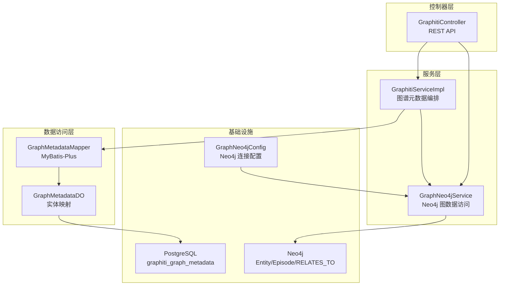
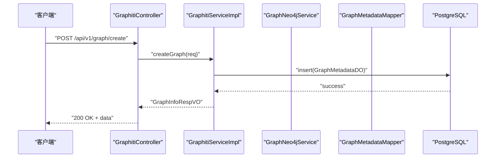
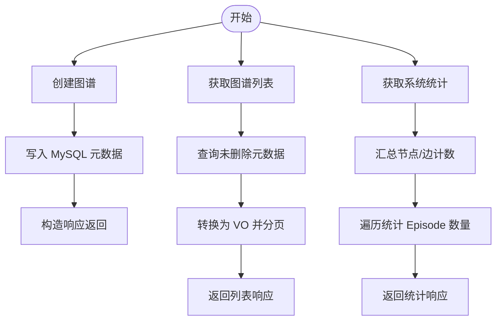
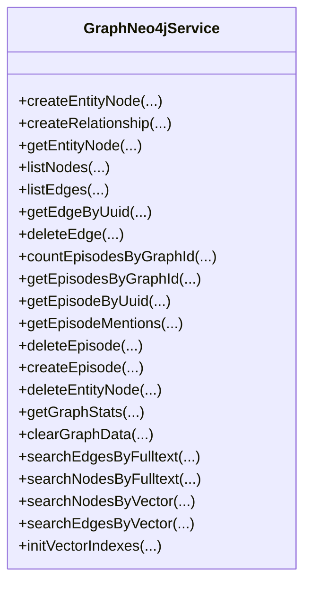
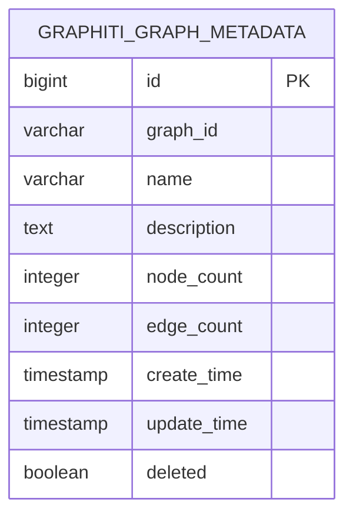
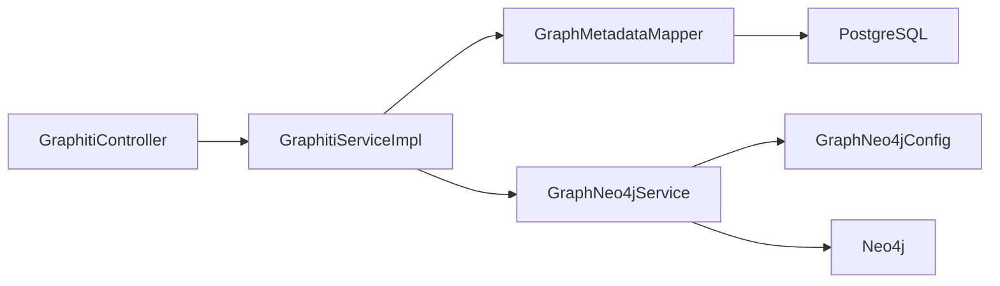

# 知识图谱管理

<!--<cite>
**本文引用的文件**
- [GraphitiController.java](file://ontograph-module-core/src/main/java/com/graphiti/module/graphiti/controller/admin/GraphitiController.java)
- [GraphitiServiceImpl.java](file://ontograph-module-core/src/main/java/com/graphiti/module/graphiti/service/impl/GraphitiServiceImpl.java)
- [GraphNeo4jService.java](file://ontograph-module-core/src/main/java/com/graphiti/module/graphiti/service/GraphNeo4jService.java)
- [GraphMetadataDO.java](file://ontograph-module-core/src/main/java/com/graphiti/module/graphiti/dal/dataobject/GraphMetadataDO.java)
- [GraphMetadataMapper.java](file://ontograph-module-core/src/main/java/com/graphiti/module/graphiti/dal/mysql/GraphMetadataMapper.java)
- [CreateGraphReqVO.java](file://ontograph-module-core/src/main/java/com/graphiti/module/graphiti/vo/graph/CreateGraphReqVO.java)
- [UpdateGraphReqVO.java](file://ontograph-module-core/src/main/java/com/graphiti/module/graphiti/vo/graph/UpdateGraphReqVO.java)
- [GraphInfoRespVO.java](file://ontograph-module-core/src/main/java/com/graphiti/module/graphiti/vo/graph/GraphInfoRespVO.java)
- [GraphListRespVO.java](file://ontograph-module-core/src/main/java/com/graphiti/module/graphiti/vo/graph/GraphListRespVO.java)
- [GraphStatsRespVO.java](file://ontograph-module-core/src/main/java/com/graphiti/module/graphiti/vo/graph/GraphStatsRespVO.java)
- [GraphNeo4jConfig.java](file://ontograph-module-core/src/main/java/com/graphiti/module/graphiti/config/GraphNeo4jConfig.java)
- [schema.sql](file://sql/postgresql/schema.sql)
- [init.cypher](file://sql/neo4j/init.cypher)
</cite>-->

## 目录
1. [简介](#简介)
2. [项目结构](#项目结构)
3. [核心组件](#核心组件)
4. [架构总览](#架构总览)
5. [详细组件分析](#详细组件分析)
6. [依赖分析](#依赖分析)
7. [性能考虑](#性能考虑)
8. [故障排查指南](#故障排查指南)
9. [结论](#结论)
10. [附录](#附录)

## 简介
本文件为知识图谱管理系统的技术文档，聚焦于图谱的创建、查询、更新、删除、清空、克隆、导出、统计与搜索等核心能力。文档从控制器、服务层、数据访问层到数据库与图数据库的集成进行全链路解析，并提供 API 接口清单、数据模型说明、业务流程图与最佳实践建议，帮助开发者快速理解与扩展系统。

## 项目结构
系统采用典型的三层架构与模块化组织：
- 控制器层：对外暴露 REST API，负责请求参数校验与响应封装
- 服务层：编排业务逻辑，协调 MySQL 元数据与 Neo4j 图数据
- 数据访问层：基于 MyBatis-Plus 访问关系型数据库
- 图数据库集成：通过 Neo4j 驱动执行图数据的增删改查与向量/全文检索

图表来源
- [GraphitiController.java:37-235](file://ontograph-module-core/src/main/java/com/graphiti/module/graphiti/controller/admin/GraphitiController.java#L37-L235)
- [GraphitiServiceImpl.java:24-256](file://ontograph-module-core/src/main/java/com/graphiti/module/graphiti/service/impl/GraphitiServiceImpl.java#L24-L256)
- [GraphNeo4jService.java:21-800](file://ontograph-module-core/src/main/java/com/graphiti/module/graphiti/service/GraphNeo4jService.java#L21-L800)
- [GraphMetadataMapper.java:11-14](file://ontograph-module-core/src/main/java/com/graphiti/module/graphiti/dal/mysql/GraphMetadataMapper.java#L11-L14)
- [GraphMetadataDO.java:12-59](file://ontograph-module-core/src/main/java/com/graphiti/module/graphiti/dal/dataobject/GraphMetadataDO.java#L12-L59)
- [GraphNeo4jConfig.java:17-46](file://ontograph-module-core/src/main/java/com/graphiti/module/graphiti/config/GraphNeo4jConfig.java#L17-L46)
- [schema.sql:109-127](file://sql/postgresql/schema.sql#L109-L127)
- [init.cypher:1-33](file://sql/neo4j/init.cypher#L1-L33)

章节来源
- [GraphitiController.java:37-235](file://ontograph-module-core/src/main/java/com/graphiti/module/graphiti/controller/admin/GraphitiController.java#L37-L235)
- [GraphitiServiceImpl.java:24-256](file://ontograph-module-core/src/main/java/com/graphiti/module/graphiti/service/impl/GraphitiServiceImpl.java#L24-L256)
- [GraphNeo4jService.java:21-800](file://ontograph-module-core/src/main/java/com/graphiti/module/graphiti/service/GraphNeo4jService.java#L21-L800)
- [GraphMetadataMapper.java:11-14](file://ontograph-module-core/src/main/java/com/graphiti/module/graphiti/dal/mysql/GraphMetadataMapper.java#L11-L14)
- [GraphMetadataDO.java:12-59](file://ontograph-module-core/src/main/java/com/graphiti/module/graphiti/dal/dataobject/GraphMetadataDO.java#L12-L59)
- [GraphNeo4jConfig.java:17-46](file://ontograph-module-core/src/main/java/com/graphiti/module/graphiti/config/GraphNeo4jConfig.java#L17-L46)
- [schema.sql:109-127](file://sql/postgresql/schema.sql#L109-L127)
- [init.cypher:1-33](file://sql/neo4j/init.cypher#L1-L33)

## 核心组件
- GraphitiController：提供图谱管理的 REST API，覆盖创建、列表、详情、更新、删除、清空、统计、节点/边列表、社区、克隆、导出、搜索、历史状态查询等接口
- GraphitiServiceImpl：服务编排，负责图谱元数据的持久化、统计聚合、克隆与导出；协调 Neo4j 数据同步
- GraphNeo4jService：Neo4j 图数据库访问服务，提供节点/边的增删改查、全文/向量检索、统计、清理、Episode 相关能力
- GraphMetadataDO/GraphMetadataMapper：MySQL 元数据持久化，记录图谱基本信息与计数
- GraphNeo4jConfig：Neo4j 连接配置，注入 Driver Bean

章节来源
- [GraphitiController.java:37-235](file://ontograph-module-core/src/main/java/com/graphiti/module/graphiti/controller/admin/GraphitiController.java#L37-L235)
- [GraphitiServiceImpl.java:24-256](file://ontograph-module-core/src/main/java/com/graphiti/module/graphiti/service/impl/GraphitiServiceImpl.java#L24-L256)
- [GraphNeo4jService.java:21-800](file://ontograph-module-core/src/main/java/com/graphiti/module/graphiti/service/GraphNeo4jService.java#L21-L800)
- [GraphMetadataDO.java:12-59](file://ontograph-module-core/src/main/java/com/graphiti/module/graphiti/dal/dataobject/GraphMetadataDO.java#L12-L59)
- [GraphMetadataMapper.java:11-14](file://ontograph-module-core/src/main/java/com/graphiti/module/graphiti/dal/mysql/GraphMetadataMapper.java#L11-L14)
- [GraphNeo4jConfig.java:17-46](file://ontograph-module-core/src/main/java/com/graphiti/module/graphiti/config/GraphNeo4jConfig.java#L17-L46)

## 架构总览
系统通过控制器接收请求，服务层编排业务，数据访问层持久化元数据，Neo4j 承载图数据与检索能力。整体遵循“元数据在 MySQL、图数据在 Neo4j”的双存储架构。

图表来源
- [GraphitiController.java:53-59](file://ontograph-module-core/src/main/java/com/graphiti/module/graphiti/controller/admin/GraphitiController.java#L53-L59)
- [GraphitiServiceImpl.java:30-47](file://ontograph-module-core/src/main/java/com/graphiti/module/graphiti/service/impl/GraphitiServiceImpl.java#L30-L47)
- [GraphMetadataMapper.java:11-14](file://ontograph-module-core/src/main/java/com/graphiti/module/graphiti/dal/mysql/GraphMetadataMapper.java#L11-L14)
- [schema.sql:109-127](file://sql/postgresql/schema.sql#L109-L127)

## 详细组件分析

### 控制器：GraphitiController
- 职责：统一 REST API 入口，参数校验，调用服务层，返回统一响应包装
- 关键接口
  - 创建图谱：POST /api/v1/graph/create
  - 图谱列表：GET /api/v1/graph/list
  - 图谱详情：GET /api/v1/graph/{graphId}
  - 更新图谱：PUT /api/v1/graph/{graphId}
  - 删除图谱：DELETE /api/v1/graph/{graphId}
  - 清空图谱数据：POST /api/v1/graph/{graphId}/clear
  - 全局统计：GET /api/v1/graph/stats
  - 指定图谱统计：GET /api/v1/graph/{graphId}/stats
  - 节点列表：GET /api/v1/graph/{graphId}/nodes
  - 边列表：GET /api/v1/graph/{graphId}/edges
  - 社区构建/查询/搜索：POST/GET /api/v1/graph/{graphId}/communities/*
  - 克隆图谱：POST /api/v1/graph/{graphId}/clone
  - 导出图谱：GET /api/v1/graph/{graphId}/export
  - 图谱搜索：POST /api/v1/graph/{graphId}/search
  - 历史状态查询：GET /api/v1/graph/{graphId}/history

章节来源
- [GraphitiController.java:37-235](file://ontograph-module-core/src/main/java/com/graphiti/module/graphiti/controller/admin/GraphitiController.java#L37-L235)

### 服务层：GraphitiServiceImpl
- 职责：图谱生命周期管理、元数据编排、统计聚合、克隆与导出
- 关键流程
  - 创建：生成 graphId，填充基础信息，写入 MySQL，返回响应
  - 列表：分页查询未删除元数据，转换为 VO
  - 详情：按 graphId 查询未删除元数据
  - 更新：按需更新名称/描述，刷新更新时间
  - 删除：逻辑删除（deleted=true）
  - 清空：重置节点/边计数
  - 统计：汇总图谱总数、节点/边总数；遍历统计 Episode 数量
  - 克隆：复制元数据，调用 Neo4j 克隆数据
  - 导出：返回元数据与 Neo4j 节点/边/Episode 数据

图表来源
- [GraphitiServiceImpl.java:30-158](file://ontograph-module-core/src/main/java/com/graphiti/module/graphiti/service/impl/GraphitiServiceImpl.java#L30-L158)

章节来源
- [GraphitiServiceImpl.java:24-256](file://ontograph-module-core/src/main/java/com/graphiti/module/graphiti/service/impl/GraphitiServiceImpl.java#L24-L256)

### 图数据库集成：GraphNeo4jService
- 职责：Neo4j 图数据访问与检索
- 关键能力
  - 节点/边 CRUD：创建实体节点、关系边，查询、删除
  - 统计：按 group_id 统计节点/边数量
  - Episode：统计、查询、删除、提及节点/边
  - 搜索：全文检索节点/边、向量检索节点/边
  - 索引：初始化向量索引（节点/边）
  - 清理：按 group_id 清空图谱数据

图表来源
- [GraphNeo4jService.java:21-800](file://ontograph-module-core/src/main/java/com/graphiti/module/graphiti/service/GraphNeo4jService.java#L21-L800)

章节来源
- [GraphNeo4jService.java:21-800](file://ontograph-module-core/src/main/java/com/graphiti/module/graphiti/service/GraphNeo4jService.java#L21-L800)

### 数据模型：GraphMetadataDO 与 GraphMetadataMapper
- GraphMetadataDO：图谱元数据实体，包含主键、graph_id、名称、描述、节点/边计数、创建/更新时间、逻辑删除标志
- GraphMetadataMapper：MyBatis-Plus Mapper，提供通用 CRUD 能力

图表来源
- [GraphMetadataDO.java:12-59](file://ontograph-module-core/src/main/java/com/graphiti/module/graphiti/dal/dataobject/GraphMetadataDO.java#L12-L59)
- [schema.sql:109-127](file://sql/postgresql/schema.sql#L109-L127)

章节来源
- [GraphMetadataDO.java:12-59](file://ontograph-module-core/src/main/java/com/graphiti/module/graphiti/dal/dataobject/GraphMetadataDO.java#L12-L59)
- [GraphMetadataMapper.java:11-14](file://ontograph-module-core/src/main/java/com/graphiti/module/graphiti/dal/mysql/GraphMetadataMapper.java#L11-L14)
- [schema.sql:109-127](file://sql/postgresql/schema.sql#L109-L127)

### 配置：GraphNeo4jConfig
- 作用：读取配置文件中的 Neo4j 连接信息，创建 Driver Bean
- 关键字段：uri、username、password

章节来源
- [GraphNeo4jConfig.java:17-46](file://ontograph-module-core/src/main/java/com/graphiti/module/graphiti/config/GraphNeo4jConfig.java#L17-L46)

## 依赖分析
- 控制器依赖服务层接口，服务层依赖 Mapper 与 Neo4j 服务
- Neo4j 服务依赖 Driver 与配置
- 数据持久化依赖 PostgreSQL 与 Neo4j

图表来源
- [GraphitiController.java:42-48](file://ontograph-module-core/src/main/java/com/graphiti/module/graphiti/controller/admin/GraphitiController.java#L42-L48)
- [GraphitiServiceImpl.java:28-29](file://ontograph-module-core/src/main/java/com/graphiti/module/graphiti/service/impl/GraphitiServiceImpl.java#L28-L29)
- [GraphNeo4jService.java:23-24](file://ontograph-module-core/src/main/java/com/graphiti/module/graphiti/service/GraphNeo4jService.java#L23-L24)
- [GraphNeo4jConfig.java:41-45](file://ontograph-module-core/src/main/java/com/graphiti/module/graphiti/config/GraphNeo4jConfig.java#L41-L45)

章节来源
- [GraphitiController.java:42-48](file://ontograph-module-core/src/main/java/com/graphiti/module/graphiti/controller/admin/GraphitiController.java#L42-L48)
- [GraphitiServiceImpl.java:28-29](file://ontograph-module-core/src/main/java/com/graphiti/module/graphiti/service/impl/GraphitiServiceImpl.java#L28-L29)
- [GraphNeo4jService.java:23-24](file://ontograph-module-core/src/main/java/com/graphiti/module/graphiti/service/GraphNeo4jService.java#L23-L24)
- [GraphNeo4jConfig.java:41-45](file://ontograph-module-core/src/main/java/com/graphiti/module/graphiti/config/GraphNeo4jConfig.java#L41-L45)

## 性能考虑
- 分页与索引
  - MySQL：graphiti_graph_metadata 建有唯一索引与删除标记索引，建议在高频查询字段上增加复合索引
  - Neo4j：已创建实体 uuid、group_id、name、episode group_id、relation type 等索引，全文索引与向量索引需按需初始化
- 统计聚合
  - 系统统计遍历查询各图谱的 Episode 数量，建议在 Neo4j 中建立批量统计任务或缓存热点图谱统计
- 搜索性能
  - 全文索引与向量索引初始化后，建议定期重建以保持准确性
- 事务与一致性
  - 创建/更新/删除图谱涉及 MySQL 元数据与 Neo4j 数据，建议在服务层统一事务边界，必要时引入 Saga 或幂等设计

## 故障排查指南
- 常见问题
  - 图谱不存在或已删除：服务层抛出业务异常，检查 graph_id 与 deleted 标志
  - Neo4j 连接失败：核对 GraphNeo4jConfig 的连接参数
  - 搜索失败：确认全文/向量索引是否已创建
- 日志与监控
  - 服务层与图数据库层均输出日志，定位异常时优先查看 warn/error 日志
  - 建议接入统一日志与指标采集，关注慢查询与异常堆栈

章节来源
- [GraphitiServiceImpl.java:214-223](file://ontograph-module-core/src/main/java/com/graphiti/module/graphiti/service/impl/GraphitiServiceImpl.java#L214-L223)
- [GraphNeo4jService.java:645-647](file://ontograph-module-core/src/main/java/com/graphiti/module/graphiti/service/GraphNeo4jService.java#L645-L647)
- [GraphNeo4jConfig.java:41-45](file://ontograph-module-core/src/main/java/com/graphiti/module/graphiti/config/GraphNeo4jConfig.java#L41-L45)

## 结论
本系统通过清晰的分层设计与双存储架构，实现了知识图谱的全生命周期管理与高效检索。控制器提供完备的 REST API，服务层编排业务与数据一致性，数据访问层与图数据库分别承担元数据与图数据的职责。建议在生产环境中完善索引、缓存与监控体系，并持续优化统计与搜索性能。

## 附录

### API 接口清单
- 创建图谱
  - 方法：POST
  - 路径：/api/v1/graph/create
  - 请求体：CreateGraphReqVO
  - 响应体：GraphInfoRespVO
- 获取图谱列表
  - 方法：GET
  - 路径：/api/v1/graph/list
  - 参数：limit、offset
  - 响应体：GraphListRespVO
- 获取图谱详情
  - 方法：GET
  - 路径：/api/v1/graph/{graphId}
  - 响应体：GraphInfoRespVO
- 更新图谱
  - 方法：PUT
  - 路径：/api/v1/graph/{graphId}
  - 请求体：UpdateGraphReqVO
  - 响应体：GraphInfoRespVO
- 删除图谱
  - 方法：DELETE
  - 路径：/api/v1/graph/{graphId}
  - 响应体：void
- 清空图谱数据
  - 方法：POST
  - 路径：/api/v1/graph/{graphId}/clear
  - 响应体：void
- 获取系统统计
  - 方法：GET
  - 路径：/api/v1/graph/stats
  - 响应体：GraphStatsRespVO
- 获取指定图谱统计
  - 方法：GET
  - 路径：/api/v1/graph/{graphId}/stats
  - 响应体：Map<String, Long>
- 获取节点列表
  - 方法：GET
  - 路径：/api/v1/graph/{graphId}/nodes
  - 响应体：List<NodeListRespVO>
- 获取边列表
  - 方法：GET
  - 路径：/api/v1/graph/{graphId}/edges
  - 响应体：List<EdgeListRespVO>
- 构建社区
  - 方法：POST
  - 路径：/api/v1/graph/{graphId}/communities/build
  - 响应体：Map<String, Object>
- 社区列表
  - 方法：GET
  - 路径：/api/v1/graph/{graphId}/communities
  - 响应体：List<Map<String, Object>>
- 搜索社区
  - 方法：GET
  - 路径：/api/v1/graph/{graphId}/communities/search
  - 参数：query
  - 响应体：List<Map<String, Object>>
- 克隆图谱
  - 方法：POST
  - 路径：/api/v1/graph/{graphId}/clone
  - 响应体：GraphInfoRespVO
- 导出图谱
  - 方法：GET
  - 路径：/api/v1/graph/{graphId}/export
  - 响应体：Map<String, Object>
- 图谱搜索
  - 方法：POST
  - 路径：/api/v1/graph/{graphId}/search
  - 请求体：SearchQueryReqVO
  - 响应体：SearchResultsRespVO
- 历史状态查询
  - 方法：GET
  - 路径：/api/v1/graph/{graphId}/history
  - 参数：time
  - 响应体：Map<String, Object>

章节来源
- [GraphitiController.java:53-233](file://ontograph-module-core/src/main/java/com/graphiti/module/graphiti/controller/admin/GraphitiController.java#L53-L233)

### 数据模型说明
- GraphMetadataDO 字段
  - id：主键
  - graph_id：图谱 ID（UUID）
  - name：图谱名称
  - description：图谱描述
  - node_count：节点数量
  - edge_count：边数量
  - createTime/updateTime：创建/更新时间
  - deleted：逻辑删除标志
- PostgreSQL 表 schema
  - graphiti_graph_metadata：包含上述字段与索引

章节来源
- [GraphMetadataDO.java:12-59](file://ontograph-module-core/src/main/java/com/graphiti/module/graphiti/dal/dataobject/GraphMetadataDO.java#L12-L59)
- [schema.sql:109-127](file://sql/postgresql/schema.sql#L109-L127)

### Neo4j 初始化与索引
- 初始化脚本要点
  - 唯一性约束：Entity/Episode 的 uuid
  - 索引：Entity/Episode 的 group_id、name；RELATES_TO 的 type
  - 全文索引：Entity 的 name/summary
- 建议
  - 在应用启动时初始化向量索引（节点/边 embedding）

章节来源
- [init.cypher:1-33](file://sql/neo4j/init.cypher#L1-L33)
- [GraphNeo4jService.java:768-791](file://ontograph-module-core/src/main/java/com/graphiti/module/graphiti/service/GraphNeo4jService.java#L768-L791)